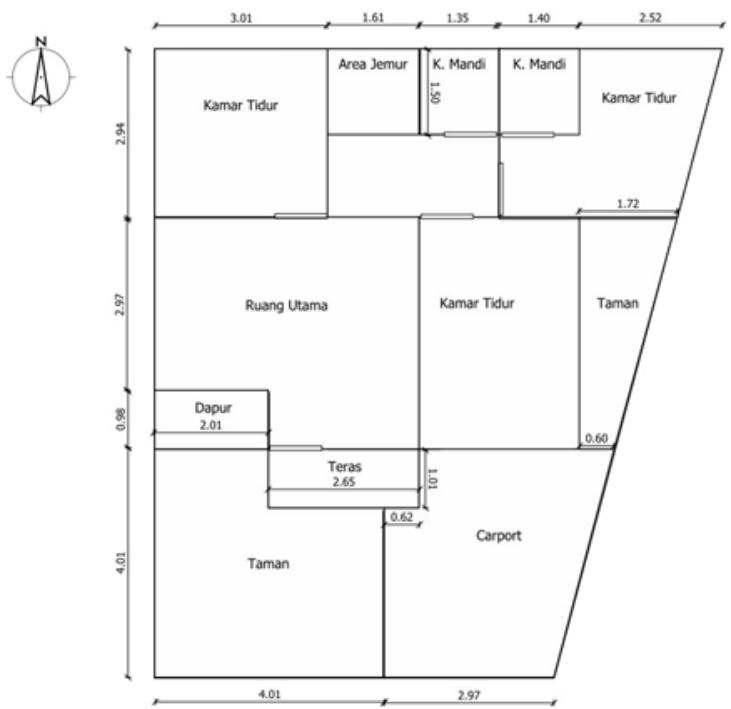
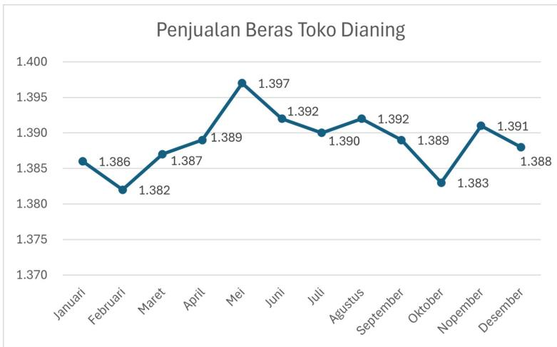
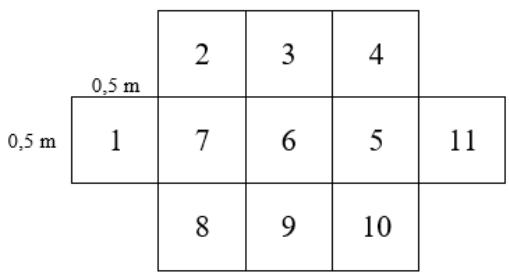
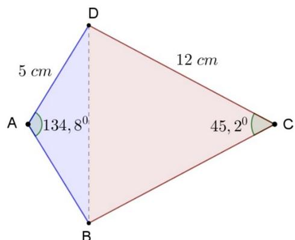
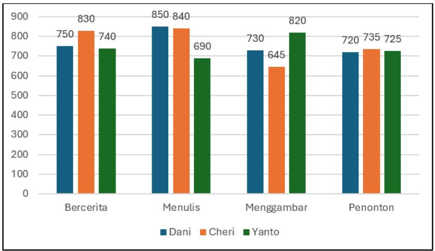

## MATEMATIKA SD TES TEORI II

URAIAN 

Waktu : 90 menit 

ru.com/ru.com/ ru.com/ 

BALAI PENGEMBANGAN TALENTA INDONESIA PUSAT PRESTASI NASIONAL 

KEMENTERIAN PENDIDIKAN, KEBUDAYAAN, RISET, DAN TEKNOLOGI 

# Petunjuk Pengerjaan Soal Isian Uraian OSN SD Bidang Matematika Tahun 2024

1. Tuliskan kode peserta di setiap lembar jawab. 

2. Tuliskan nama, sekolah, kabupaten/kotamadya, dan provinsi asal di lem-https://www.calonguru.com/ bar jawab yang telah disediakan. 

3. Tes uraian terdiri dari 13 soal. Masing-masing soal bernilai maksimal tiga jika dijawab dengan lengkap dan benar. 

4. Periksa paket soal dan mintalah lembar soal pengganti jika halaman lembar soal tidak lengkap, tulisan tidak terbaca atau gambar tidak jelas kepada petugas pengawas. 

5. Gunakan area kosong pada lembar soal untuk melakukan corat-coret perhitungan. 

6. Waktu yang disediakan untuk mengerjakan semua soal adalah 90 menit. 

7. Beberapa soal ditulis menggunakan Bahasa Inggris. Peserta diperbolehkan menjawabnya menggunakan Bahasa Indonesia. 

8. Uraikanlah jawaban pada lembar jawab yang tersedia secara terperinci. 

9. Bekerjalah dengan cermat dan rapi. 

10. Jawaban hendaknya kalian tuliskan dengan menggunakan pulpen tinta hitam atau biru, bukan pensil. 

11. Mulailah bekerja setelah pengawas memberi tanda mulai dan berhentilah bekerja setelah pengawas memberi tanda berhenti. 

12. Selama tes berlangsung, peserta dilarang: 

(a) Menanyakan jawaban soal kepada siapapun; 

(b) Menggunakan catatan, alat bantu hitung, dan buku (kecuali kamus Inggris-Indonesia);ps://www.calongur 

(c) Bekerjasama dengan peserta lain;ttps://www.calonguru.co 

(d) Memberi atau menerima bantuan dalam menjawab soal;ttps://www.calonguru.com/ 

(e) Memperlihatkan pekerjaan sendiri kepada peserta lain atau melihat pekerjaan peserta lain; 

(f) Membawa naskah soal keluar dari ruang ujian; 

(g) Menggantikan atau digantikan oleh orang lain. 

Jika peserta melakukan salah satu pelanggaran tersebut, maka yang bersangkutan didiskualifikasi. 

SELAMAT BEKERJA 

## SOAL URAIAN

1. Diberikan dua bilangan, bilangan pertama adalah bilangan ratusan 2a1 dan bilangan kedua adalah bilangan puluhan 3b. Jika hasil kali kedua bilangan tersebut habis dibagi 6, maka tentukan nilai terbesar dari hasilhttps://www.calonguru.com/ kalinya. 

2. Diberikan dua balok A dan B dengan ukuran yang sama, yaitu dengan tinggi 8 cm dan lebar 5 cm. Volume balok A yang panjangnya dibagi menjadi tiga bagian sama besar adalah 480 cm3. Jika balok B dipotonghttps://www.calonguru.com/ menjadi dua bagian menurut tingginya, maka tentukan selisih volume antara 1 potongan dari balok A dan 1 potongan dari balok B. 

3. Kota X dan Y dihubungkan oleh sebuah jalan. Pada tanggal 3 Juli 2024, bus Merah berangkat dari kota X pada pukul 06:30 WIB dan tiba di kota Y pukul 10:30 WIB pada hari yang sama. Pada tanggal yang sama, bus Biru berangkat dari kota Y pada pukul 03:30 WIB dan tiba di kota X pada pukul 09:30 WIB pada hari yang sama. Jika setiap bus bergerak dengan kecepatan tetap tanpa berhenti, pada pukul berapa kedua bus berpapasan? 

4. Tersedia tiga gelas kosong berwarna merah, hijau, dan biru yang masingmasing akan diisi kelereng. Jika tersedia empat kelereng dengan warnaps://www.calonguru.com/ sama, maka tentukan semua cara yang mungkin untuk mengisi ketigaps://www.calonguru.com/ gelas tersebut dengan semua kelereng yang tersedia. 

5. Perhatikan tabel bilangan di bawah ini: 

<table><tr><td>A</td><td>B</td><td>C</td><td>D</td><td>E</td><td>F</td><td>G</td><td>H</td><td>I</td><td>J</td></tr><tr><td>1</td><td></td><td>4</td><td></td><td></td><td></td><td></td><td></td><td>13</td><td></td></tr><tr><td></td><td>2</td><td></td><td></td><td></td><td>8</td><td></td><td>11</td><td></td><td></td></tr><tr><td></td><td></td><td>6</td><td></td><td>9</td><td></td><td></td><td></td><td>15</td><td></td></tr><tr><td></td><td>28</td><td></td><td>25</td><td></td><td></td><td></td><td>19</td><td></td><td></td></tr><tr><td>29</td><td></td><td></td><td></td><td>23</td><td></td><td></td><td></td><td>17</td><td></td></tr><tr><td></td><td></td><td></td><td></td><td></td><td></td><td></td><td>21</td><td></td><td>18</td></tr><tr><td>31</td><td></td><td>34</td><td></td><td></td><td></td><td></td><td></td><td>43</td><td></td></tr><tr><td></td><td>32</td><td></td><td></td><td></td><td>38</td><td></td><td>41</td><td></td><td></td></tr><tr><td></td><td></td><td>36</td><td></td><td>39</td><td></td><td></td><td></td><td>45</td><td></td></tr></table>

Jika bilangan Asli pada tabel di atas tersusun berpola, maka: 

a. lengkapilah pola susunan bilangan Asli pada tabel di atas; 

b. tentukan pada kolom apa letak bilangan 2024. 

6. Gambar di bawah merupakan denah rumah dalam satuan meter. Pemilik rumah ingin memasang karpet A seharga Rp250.000, 00 setiap https://www.calonguru.com/ $m ^ { 2 }$ , karpet B seharga Rp150.000, 00 setiap $m ^ { 2 }$ dan rumput sintetis seharga Rp95.000, 00 setiap $m ^ { 2 }$ . Jika karpet A untuk ruang utama, karpet B untuk kamar tidur, dan rumput sintetis untuk taman dan area jemur,https://www.calonguru.com/ maka tentukan biaya yang harus dikeluarkan. 

7. Berikut data penjualan beras toko Sembako DIANING dalam satu tahun dengan satuan karung. 

a. Hitung besar setiap penurunan penjualan yang terjadi dalam satu tahun. 

b. Tentukan pada bulan apa terjadi penurunan penjualan terbesar. 

8. Bilangan ribuan abcd yang setiap digitnya berbeda dibentuk dari bilangan 0, 1, 2, 3, 4, 5, 6, 7, 8. Jika abcd adalah kelipatan empat, maka tentukan banyak bilangan abcd yang mungkin.s://www.calonguru.com/ 

9. Diketahui dua bilangan asli berbeda berjumlah 75. Apabila bilanganttps://www.calonguru.com/ yang lebih besar dibagi yang lebih kecil, maka hasil baginya 8 dan sisanyas://www.calonguru.com/ 3. Tentukan selisih kedua bilangan tersebut. 

10. Arif dan teman-temannya bermain permainan “lompat berjumlah prima” dengan aturan sebagai berikut: 

- mereka melewati 5 petak-petak bilangan berbeda yang dimulai dari petak bilangan 1 dan berakhir di petak bilangan 11; 

- jumlah bilangan pada petak yang dilewati merupakan bilangan prima; 

- mereka hanya dapat melompati kurang dari 1 meter. 

Sebagai contoh: 

- Jalan sesuai aturan 1, 2, 3, 6, 11. 

- Jalan tidak sesuai aturan 1, 5, 6, 5, 11. 

Tuliskan semua jalan yang dapat mereka lalui dengan aturan tersebut. 

11. Suppose that ABCD is a kite with $A D = 5 c m , \ C D = 1 2 c m .$ , $\angle B A D = 1 3 4 , 8 ^ { \circ }$ and $\angle B C D = 4 5 ,$ 2◦. Determine the length of $B D$ 

12. Andi dan Bani mengunjungi suatu pusat perbelanjaan yang memiliki 4 lantai, yaitu lantai 1 (lantai dasar), lantai 2, lantai 3 dan lantai 4.https://www.calonguru.com/ Mereka berencana akan membeli alat tulis yang ada di lantai 1, membeli sepatu di lantai 2, membeli makanan di lantai 3 dan mengunjungi pusat permainan di lantai 4. Untuk menuju lantai 2, 3, dan 4 merekahttps://www.calonguru.com/ bisa menggunakan lift, tangga berjalan atau tangga biasa. Mereka akan memulai dari membeli alat tulis terlebih dahulu di lantai 1. Tuliskan banyak kemungkinan rute yang ditempuh oleh Andi dan Bani sehinggahttps://www.calonguru.com/ rencana mereka terlaksana dan kembali lagi ke lantai 1. 

13. Terpilih tiga finalis lomba bercerita, menulis, dan menggambar. Setiap jenis lomba harus diselesaikan dalam waktu yang tersedia. Juri dan penonton memberikan nilai terhadap hasil pekerjaan peserta dalam skalahttps://www.calonguru.com/ 1000 setelah waktu dinyatakan habis. Pada setiap jenis lomba finalis akan menjadi juara jika mendapatkan jumlah tertinggi dari nilai penonton dan nilai juri. Finalis akan menjadi juara favorit jika 60% rata-rata nilai jurihttps://www.calonguru.com/ ditambah 40% nilai dari penonton merupakan nilai tertinggi. Data ketiga finalis disajikan dalam diagram berikut. 

Siapakah finalis yang mendapatkan juara lomba bercerita, menulis, menggambar, serta juara favorit? 