## OSN

## MATEMATIKA

## OSN TINGKAT FINAL

## Soal OSN Matematika Final

## SOAL ISIAN SINGKAT

1. Bilangan bulat positif a, b dan c berurutan dari kecil ke besar dengan selisih setiap dua bilangan yang berurutan adalah sama. Bila jumlah ketiga bilangan adalah 33 maka selisih terbesar bilangan a dan b adalah 

2. If $a$ and $b$ are positive integers such that $\frac{3}{a} - \frac{b}{5} = 0.2$ , then the smallest possible value of $b$ is $\cdots$ . 

3. Diketahui ACB segitiga sama kaki, AC = BC = 10 cm, AB = 12 cm. Jika D pada BC sehingga AD tegak lurus BC maka luas ABD adalah ... cm². 

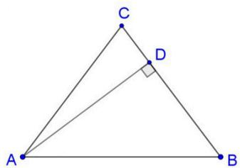

4. Farhan dan Fauzan berlomba lari mengitari lapangan yang kelilingnya 1800 meter sebanyak dua putaran. Setiap putaran berakhir, kecepatan Farhan turun 10% dan kecepatan Fauzan turun 50%. Farhan mengitari lapangan pertama kali dengan kecepatan 6 km/jam. Jika Fauzan ingin menang dari Farhan dengan selisih dua menit maka kecepatan Fauzan mengitari lapangan pertama kali adalah ⋯ km/jam. 

5. Amir, Budi, Carli, Doni dan Eki akan naik bus dari Jakarta ke Surabaya. Mereka dapat tempat di deretan kursi paling depan yang memiliki lima kursi terdiri dari dua kursi berdekatan, lorong dan tiga kursi berdekatan, seperti tampak pada gambar berikut. 

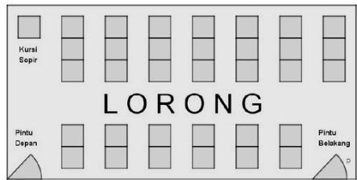

Bila Amir ingin duduk di dekat jendela dan Budi ingin duduk di samping lorong, maka banyak posisi duduk berbeda yang mungkin adalah ⋯. 

6. Suatu bilangan ratusan jika ditambah 1 merupakan kelipatan 3 sedangkan jika ditambah dengan 2 merupakan kelipatan 5. Jika semua bilangan ratusan tersebut diurutkan dari terkecil ke terbesar, maka urutan kelima adalah .... 

## Soal OSN Matematika Final

7. Bilangan $2^{4}$ adalah bilangan berpangkat dengan 2 disebut bilangan pokok dan 4 disebut bilangan pangkat. Bilangan 25 dapat dinyatakan sebagai jumlah dari beberapa bilangan berpangkat berbeda dengan bilangan pokok 2 dan 3. Bila p merupakan jumlah dari pangkat-pangkatnya, maka bilangan $25 = 2^{4} + 3^{2}$ memiliki nilai p = 6. 

$25 = 2^{3} + 2^{4} + 3^{0}$ dengan nilai $p = 7$ 

$25 = 2^{3} + 2^{2} + 2^{0} + 3^{2} + 3^{1}$ dengan nilai $p = 8$ 

Bila 50 dinyatakan sebagai jumlah dari beberapa bilangan berpangkat berbeda dengan bilangan pokok 2 dan 3, maka p terbesar adalah ... 

8. Suatu robot diberi program dan kemudian dilepaskan. Program yang dibuat adalah: 

a. Langkah pertama berjalan ke arah utara sejauh dua satuan panjang, kemudian berbelok secara bergantian yaitu kanan dua kali dan kiri dua kali, 

b. Setiap belok kanan maka langkahnya adalah dua kali langkah sebelumnya dan setiap belok kiri langkahnya adalah setengah langkah sebelumnya. 

Jika robot tersebut pertama kali dilepaskan pada titik A dan langkah selanjutnya diberi nama secara berurutan yaitu B, C, D, E, F, G, H, I, dan seterusnya, maka jarak titik P ke R adalah … satuan panjang. 

9. Misalkan x menyatakan nilai mata pelajaran matematika murid kelas V. Tabel berikut menyatakan persentase banyak murid yang memperoleh nilai tersebut. 

<table><tr><td>x</td><td>Persentase Banyak Murid</td></tr><tr><td>0 ≤ x &lt; 50</td><td>20%</td></tr><tr><td>50 ≤ x &lt; 60</td><td>10%</td></tr><tr><td>60 ≤ x &lt; 70</td><td>10%</td></tr><tr><td>70 ≤ x &lt; 80</td><td>30%</td></tr><tr><td>80 ≤ x &lt; 90</td><td>20%</td></tr><tr><td>90 ≤ x ≤ 100</td><td>10%</td></tr></table>

Murid kelas V yang memperoleh nilai matematika lebih dari 75 dapat mengikuti kompetisi matematika yang diadakan oleh sekolah. Jika 50% dari murid kelas V dapat mengikuti kompetisi dan terdapat setengah dari banyak murid yang memperoleh nilai di atas 90 tidak dapat mengikuti kompetisi karena sakit, maka banyak murid kelas V yang mengikuti kompetisi adalah 27. Banyak murid kelas V yang mengikuti kompetisi dan nilainya kurang dari 80 adalah ... 

## Soal OSN Matematika Final

10. Pak Kartono tinggal di kota A akan berkunjung ke semua kota dan kembali ke A seperti gambar berikut. 

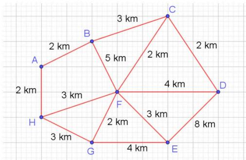

Jarak minimum yang dilewati Pak Kartono adalah · · · km. 

11. Perhatikan pola bilangan berikut. 

Pola ke-1: 1 

Pola ke-2: $1 - \frac{1}{2}$ 

Pola ke-3: $1 - \frac{1}{2} +\frac{1}{3}$ 

Pola ke-4: $1 - \frac{1}{2} +\frac{1}{3} -\frac{1}{4}$ 

dan seterusnya · · · 

Pada pola ke berapa nilainya paling dekat ke 0,75. 

12. When the numbers 917, 1457 and 1637 are each divided by a positive number $b$ , they all have the same remainder $a$ . What is the biggest value of $a + b$ ? 

13. Diketahui setengah lingkaran dengan diameter PQ = 20 cm dan O pada PQ sehingga OP = 4 cm. R terletak pada setengah lingkaran dan QS sejajar OR. Jika $SQ = \frac{3}{4}OR$ , maka luas segi empat ORSQ adalah $\cdots$ $cm^{2}$ . 

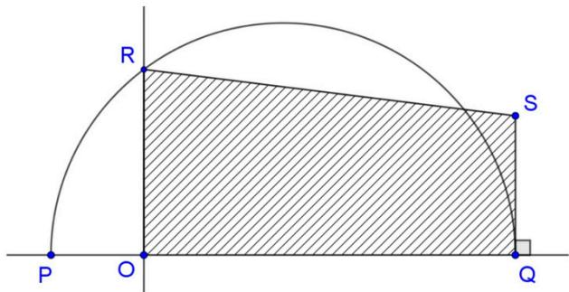

14. Siswa kelas 5A, 5B, dan 5C SD Mutiara Bunda melakukan kegiatan pengumpulan dana amal pada peringatan hari Kesetiakawanan Sosial. Jumlah dana yang dikumpulkan oleh siswa kelas 5A, 5B, dan 5C berturut-turut adalah Rp6.750.000, Rp10.800.000, dan Rp12.600.000. Jika perbandingan banyak siswa kelas 5A, 5B, dan 5C adalah 5:6:7 serta banyak siswa ketiga kelas tersebut adalah 90 orang, maka perbandingan rata-rata dana amal kelas 5A, 5B, dan 5C adalah …. 

## Soal OSN Matematika Final

15. Petak-petak persegi berikut terdiri dari empat warna, setiap warna akan diisi dengan pasangan-pasangan bilangan yang dipilih dari 0, 1, 2, 3, 4, 5, 6, yaitu pasangan (00), (01), (02), $\cdots$ , (65), atau (66). 

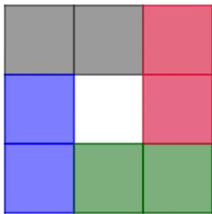

Jumlah tiga bilangan pada setiap sisi persegi adalah 10 dan tidak ada pasangan yang sama dalam setiap persegi [(41) dan (14) adalah pasangan yang sama. 

Contoh persegi yang benar 

<table><tr><td>5</td><td>1</td><td>4</td></tr><tr><td>3</td><td></td><td>1</td></tr><tr><td>2</td><td>3</td><td>5</td></tr></table>

Contoh persgi yang tidak benar (32 dipasang dua kali) 

<table><tr><td>5</td><td>2</td><td>3</td></tr><tr><td>3</td><td></td><td>2</td></tr><tr><td>2</td><td>3</td><td>5</td></tr></table>

Jika petak berwarna abu-abu diisi dengan pasangan (55) maka banyak persegi yang mungkin adalah ···. 

## Soal OSN Matematika Final

16. If a three-digit integer greater than 200 leaves a remainder of 1 when divided by 2, 3, 4, and 5, then the number of such integers is $\cdots$ . 

17. Alif membuka toko “frozen food” yang menjual bebek beku seharga Rp85.000 dengan modal Rp55.000 per ekor. Hari pertama terjual 20 ekor, hari kedua 28 ekor, dan hari ketiga 36 ekor. Jika seminggu pertama penambahan jumlah bebek yang terjual per harinya adalah tetap maka hasil keuntungan penjualan bebek selama seminggu adalah ⋯. 

18. Rahayu dan Indah akan membuat sirup yang per liternya mengandung 10% gula, 20% pewarna merah, dan 30% perisa Stroberi yang diperoleh dari campuran sirup A dan B. Kandungan sirup A dan B disajikan pada tabel berikut: 

<table><tr><td rowspan="2">Jenis Sirup</td><td colspan="3">Kandungan per liter</td></tr><tr><td>Gula (%)</td><td>Pewarna Merah (%)</td><td>Perisa Stroberi (%)</td></tr><tr><td>A</td><td>7</td><td>5</td><td>6</td></tr><tr><td>B</td><td>14</td><td>40</td><td>62</td></tr></table>

Jika mereka mencampur sirup A sebanyak 1 liter, maka banyaknya sirup B yang dibutuhkan adalah … liter. 

19. Diberikan susunan huruf-huruf sebagai berikut: 

<table><tr><td></td><td></td><td>A</td><td></td><td></td></tr><tr><td></td><td>B</td><td></td><td>C</td><td></td></tr><tr><td>D</td><td></td><td>E</td><td></td><td>F</td></tr><tr><td></td><td>G</td><td></td><td>H</td><td></td></tr><tr><td></td><td></td><td>I</td><td></td><td></td></tr></table>

Setiap huruf di atas akan diberi warna merah atau biru. Banyak cara mewarnai sedemikian hingga setiap susunan tiga huruf sebaris, sekolom atau sediagonal yang tidak berwarna sama adalah ... 

20. Diketahui petak-petak persegi berukuran $6 \times 7$ seperti gambar berikut. 

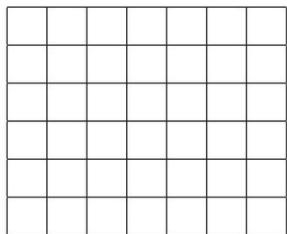

Banyak bangun persegi panjang yang dapat dibuat melalui garis-garis vertikal dan horisontal pada gambar di atas, dan panjangnya sama dengan 2 kali lebar adalah ... 

## Soal OSN Matematika Final

21. Diketahui segitiga ABC memiliki sudut siku-siku di B. Jika keliling dan luas ABC berturut turut adalah 144 cm dan 504 cm $^{2}$ , maka panjang AC adalah … cm. 

22. Perhatikan gambar persegi panjang ABCD dengan ukuran $6 \times 9$ satuan panjang. 

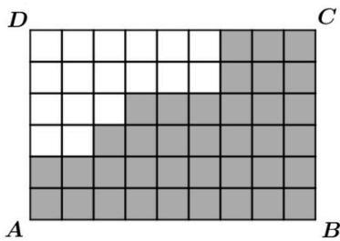

Jika titik E diletakkan diantara titik B dan C, kemudian dibentuk ruas garis AE, sehingga ruas garis tersebut membagi daerah yang diarsir menjadi dua bagian yang luasnya sama, maka panjang CE adalah … satuan panjang. 

23. Rata-rata dari lima bilangan genap yang berbeda adalah 36. Jika bilangan terbesar dihilangkan, maka rata-rata dari empat bilangan yang tersisa adalah 31. Jika bilangan terkecil dihilangkan dan bilangan terbesar dimasukkan kembali, maka rata-rata dari empat bilangan yang tersisa adalah 38. Selisih dari bilangan terbesar dan terkecil adalah ... 

24. Tim renang SD Mekarsari akan dipilih 4 murid dari 6 yang tersedia, yaitu Fani, Gita, Hana, Indra, Joko, dan Kiki. Fani dan Gita adalah perenang tercepat sehingga mereka harus selalu ada dalam tim. Banyak cara memilih anggota tim adalah … cara. 

25. Perhatikan tiga buah segi tiga siku-siku ABC, CDE dan ECF dengan panjang sisi AB = 12 cm, BC = 5 cm, dan CD = 9 cm, seperti pada gambar berikut. 

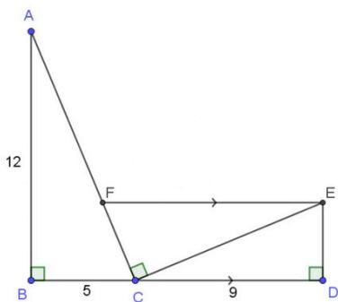

Jika FE sejajar BD, maka panjang FE sama dengan $\cdots$ cm. 

## Soal OSN Matematika Final

## SOAL URAIAN

1. Fauzan melompat sebanyak lima kali secara berurutan dari petak A ke petak B ke petak C ke petak D ke petak E dan berakhir di petak F. 

<table><tr><td><eq>A = \frac{1}{2}</eq></td><td><eq>B = \frac{3}{4}</eq></td><td><eq>C = \frac{3}{5}</eq></td><td><eq>D = \frac{1}{4}</eq></td><td><eq>E = \frac{3}{5}</eq></td><td><eq>F = \frac{2}{5}</eq></td></tr></table>

Setiap melompat Fauzan mendapat nilai sebesar bilangan pada petak asal dikurangi bilangan pada petak tujuan. Pada lompatan ke berapa Fauzan mendapat nilai terbesar? 

2. Tambahkan beberapa tanda + di antara angka pada suatu bilangan kemudian hasilnya kuadratkan. Sebagai contoh beberapa tanda + ditambahkan pada bilangan 1025 dapat dibuat sebagai berikut. 

$$
\begin{array}{l} (1 + 0 + 2 + 5) ^ {2} = 6 4 \\ (1 0 + 2 + 5) ^ {2} = 2 8 9 \\ \end{array}
$$

Lakukan proses yang sama pada bilangan 3456. Dari semua kemungkinan proses tersebut, tentukan selisih terkecil hasilnya dengan 3456. 

3. Observe the figure below. Determined the value of $x$ . 

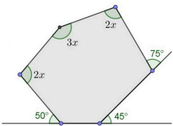

4. Diketahui a, b, c, d, e dan f adalah bilangan bulat positif. Jika diketahui $\frac{a}{b} = \frac{c}{d} = \frac{e}{f} = 9$ , maka tentukan nilai dari $\frac{5a^{2}c - 4c^{2}e + 3e^{3}}{5b^{2}d - 4d^{2}f + 3f^{3}}$ . 

5. Diketahui area parkir menampung 18 kendaraan yang terdiri dari sepeda, sepeda motor, dan mobil. Total banyak roda dari 18 kendaraan tersebut adalah 52 (sepeda dan sepeda motor masing-masing 2 roda, mobil 4 roda). Jika banyak mobil 4 lebihnya dari banyak sepeda motor maka tentukan banyak masing-masing kendaraan pada area parkir tersebut. 

## Soal OSN Matematika Final

6. Gambar di bawah ini menunjukkan lima lingkaran yang sama besar. Satu lingkaran berada di tengah. Empat lingkaran lainnya masing-masing menyentuh lingkaran yang di tengah dan titik pusatnya merupakan titik-titik sudut persegi. Berapa rasio luas daerah yang diarsir pada lingkaran dengan luas daerah yang tidak diarsir pada lingkaran? 

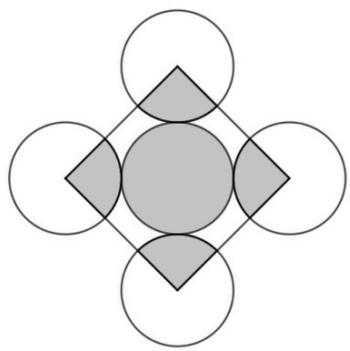

7. Berikut tabel ukuran sepatu sepuluh siswa kelas VI SD Cempaka Sari yang dinyatakan dalam dua digit 

<table><tr><td>Nama Siswa</td><td>Ukuran Sepatu</td></tr><tr><td>Amina</td><td>3a</td></tr><tr><td>Tina</td><td>36</td></tr><tr><td>Anto</td><td>4b</td></tr><tr><td>Budi</td><td>42</td></tr><tr><td>Sisca</td><td>35</td></tr><tr><td>Sugeng</td><td>41</td></tr><tr><td>Darma</td><td>37</td></tr><tr><td>Rizka</td><td>3c</td></tr><tr><td>Ahmad</td><td>38</td></tr><tr><td>Novi</td><td>3d</td></tr></table>

Jika selisih ukuran sepatu Amina dan Anto minimum dan selisih ukuran sepatu Rizka dan Novi maksimum maka tentukanlah modus dari data ukuran sepatu di atas. 

8. Ryan akan membuat password untuk handphone-nya yang terdiri dari 6 karakter berbeda, yang merupakan campuran angka dan simbol. Adapun simbol yang digunakan adalah !, @, #, $, %, &. Jika Ryan menempatkan sebuah simbol sebagai karakter pertama, dilanjutkan dengan angka, simbol, angka, simbol, dan angka, maka berapa banyak kemungkinan password yang dapat dibuat? 

## Soal OSN Matematika Final

9. Diberikan petak dua baris dan empat kolom seperti tampak pada gambar berikut 

<table><tr><td>A</td><td>B</td><td>C</td><td>D</td></tr><tr><td>E</td><td>F</td><td>G</td><td>H</td></tr></table>

Huruf pada petak A, B, C, D, E, F, G dan H merupakan bilangan-bilangan yang setiap menit berubah bergantian dari kelipatan 2 dan kelipatan 3. Misalkan X adalah jumlah bilangan pada seluruh petak pada menit ke 10 dan Y adalah jumlah seluruh bilangan pada seluruh petak pada menit ke 20. Tentukan perbandingan Y dan X. 

10. If $a * b = \frac{(a + b)^2}{2}$ , then find the value of $((2 * 0) * 2) * 5$ . 

11. Beberapa koin logam dengan jari-jari 1cm ditempatkan sebanyak mungkin pada sebuah wadah berbentuk persegi dengan panjang sisi 30cm sedemikian sehingga tidak ada koin yang saling tumpang tindih. Tentukan maksimal koin yang dapat ditempatkan pada wadah tersebut. 

12. Diberikan sebelas bilangan genap berurutan dengan rata-rata 26. Jika ditambahkan dua bilangan genap lainnya yang berbeda, maka rata-rata bilangan tersebut menjadi 30. Berapakah bilangan genap positif yang ditambahkan jika kedua bilangan tersebut adalah bilangan terbesar dan terkecil yang mungkin ditambahkan. 

13. Diberikan delapan angka berbeda yaitu 1, 2, 3, 4, 5, 6, 7, 8 dan empat simbol operasi bilangan yaitu +, -, × dan ÷. Akan disusun operasi yang melibatkan keempat simbol operasi dan semua angka yang diberikan, tentukanlah banyak susunan operasi yg dapat terjadi jika angka 3, 4 dan 8 selalu digunakan sebagai satu kesatuan. 

Contoh 

$$
8 3 4 + 5 - 1 2 \times 6 \div 7
$$

$$
5 \times 8 4 3 + 1 2 - 6 \div 7
$$

Bukan contoh 

$$
3 4 + 5 8 - 1 2 \times 6 \div 7
$$

$$
8 3 + 4 - 1 \times 6 \div 7
$$

## Soal OSN Matematika Final

## SOAL EKSPLORASI

1. Pilih enam bilangan dari bilangan-bilangan 1,2,3,4,5,6,7,8 dan tempatkan pada lingkaran-lingkaran A, B, C, D, E dan F, sehingga bilangan di bawahnya merupakan selisih dari dua bilangan di atasnya, yaitu 

• F selisih dari D dan E. 

• D selisih dari A dan B. 

• E selisih dari B dan C. 

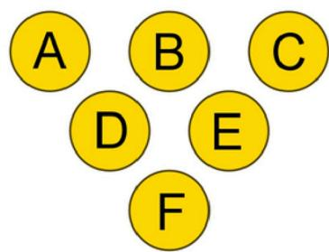

Susunan akan dianggap sama jika merupakan hasil pencerminan dari susunan yang lain, seperti contoh berikut ini: 

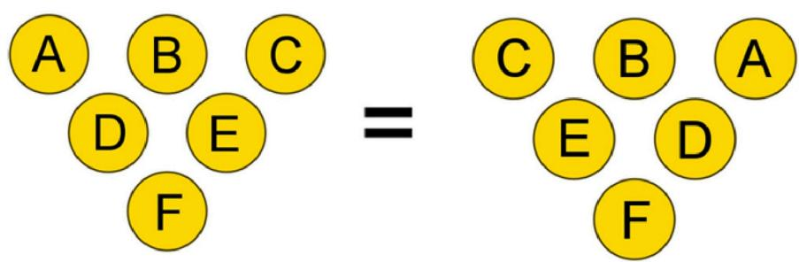

Carilah susunan berbeda sebanyak mungkin yang memenuhi syarat-syarat tersebut dan tuliskan pada lembar jawaban yang tersedia. 

## Soal OSN Matematika Final

2. Perhatikan tabel pengkodean berikut ini: 

<table><tr><td>Kode</td><td>A</td><td>B</td><td>C</td><td>D</td><td>E</td><td>F</td><td>G</td><td>H</td><td>I</td><td>J</td><td>K</td><td>L</td><td>M</td><td>N</td><td>O</td><td>P</td><td>Q</td><td>R</td><td>S</td><td>T</td><td>U</td><td>V</td><td>W</td><td>X</td><td>Y</td><td>Z</td><td>A</td></tr><tr><td>A1</td><td>1</td><td>2</td><td>3</td><td>4</td><td>5</td><td>6</td><td>7</td><td>8</td><td>9</td><td>10</td><td>11</td><td>12</td><td>13</td><td>14</td><td>15</td><td>16</td><td>17</td><td>18</td><td>19</td><td>20</td><td>21</td><td>22</td><td>23</td><td>24</td><td>25</td><td>26</td><td>1</td></tr><tr><td>B6</td><td>5</td><td>6</td><td>7</td><td>8</td><td>9</td><td>10</td><td>11</td><td>12</td><td>13</td><td>14</td><td>15</td><td>16</td><td>17</td><td>18</td><td>19</td><td>20</td><td>21</td><td>22</td><td>23</td><td>24</td><td>25</td><td>26</td><td>1</td><td>2</td><td>3</td><td>4</td><td>5</td></tr></table>

Kode A1 menunjukkan pemasangan huruf A dengan bilangan 1, huruf B dengan bilangan 2, huruf C dengan bilangan 3 dan seterusnya. Sehingga dengan kode A1 kata JAYA = 10 + 1 + 25 + 1 = 37, sedangkan dengan kode B6 kata BOLA = 46. 

Catatan: Kode A1 = B2 = C3 = ... = Z26. 

a. Bila dengan kode Cn kata SAIN = 59, maka dengan kode Cn kata DATA = ... 

b. Bila dengan kode Kn kata JAYA= 75, maka dengan kode Kn kata: 

OLIMPIADE = ... 

SAIN = ... 

NASIONAL = ... 

c. Kata Bahasa Indonesia terdiri dari 4 huruf merupakan nama suatu rempah-rempah dari bumi Indonesia. Jika dengan suatu kode, kata tersebut = 36, maka kode kata BAHAYA = ... 

## Soal OSN Matematika Final

3. Misalkan di dalam suatu keluarga terdapat 5 orang wanita, dimana 2 orang merupakan ibu dan 4 orang merupakan anak. Maka silsilah keluarga yang mungkin dapat digambarkan pada diagram berikut: 

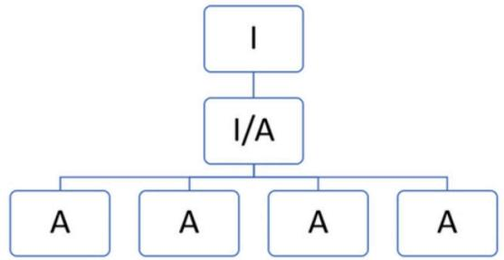

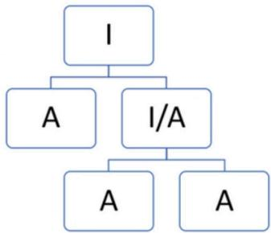

Keterangan: I = Ibu, A = Anak, I/A = Ibu sekaligus anak. 

Buatlah semua diagram silsilah keluarga yang mungkin, jika diketahui suatu keluarga terdapat 7 wanita dimana 3 orang merupakan ibu dan 6 orang merupakan anak. 

## Soal OSN Matematika Final

4. Diketahui sebuah bangun persegi panjang berukuran $4 \times 5$ satuan, seperti terlihat pada gambar berikut: 

<table><tr><td></td><td></td><td></td><td></td><td></td></tr><tr><td></td><td></td><td></td><td></td><td></td></tr><tr><td></td><td></td><td></td><td></td><td></td></tr><tr><td></td><td></td><td></td><td></td><td></td></tr></table>

Bangun tersebut akan dipotong menjadi dua bagian yang kongruen (sama bentuk dan sama luas) dengan mengikuti garis-garis yang sudah tersedia. Berikut adalah contoh hasil pemotongan yang benar. 

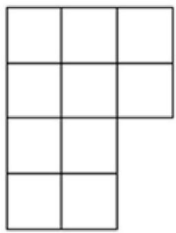

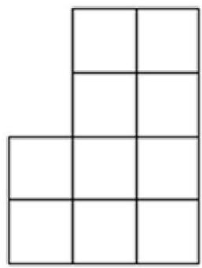

Selain contoh di atas, potonglah 15 persegi panjang $4 \times 5$ menjadi 15 pasang bangun kongruen yang berbeda. Tempel hasil pemotongan pada pada lembar jawab yang tersedia. 

## Soal OSN Matematika Final

5. Tono akan membeli 4 roti isi pada toko roti OSN, yang setiap roti memiliki satu rasa. Roti yang akan dibeli Tono minimal 3 rasa berbeda dengan maksimal 2 rasa buah. Roti isi yang tersedia beserta harganya disajikan dalam tabel berikut: 

DAFTAR MENU

<table><tr><td>Roti Isi</td><td>Harga (Rp)</td></tr><tr><td>Strawberry (S)</td><td>6000</td></tr><tr><td>Keju (K)</td><td>6500</td></tr><tr><td>Abon (A)</td><td>7000</td></tr><tr><td>Nanas (N)</td><td>7500</td></tr><tr><td>Jeruk (J)</td><td>6000</td></tr></table>

Jika Tono hanya memiliki uang Rp 26.500, -, maka tentukan semua kemungkinan roti isi yang dapat dibeli. 

## Soal OSN Matematika Final

6. Diketahui lima bangun yang tersusun dari empat persegi yang sisi-sisinya berukuran satu satuan panjang sebagai berikut: 

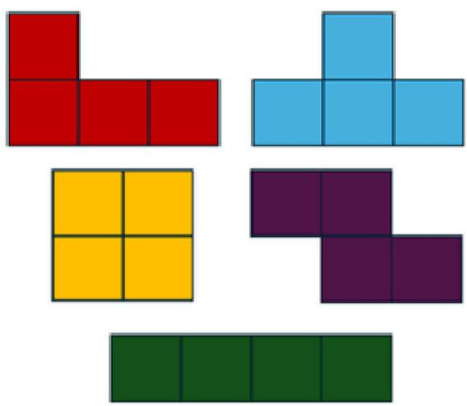

Susunlah seluruh bangun tersebut dengan ketentuan sebagai berikut: 

- Bangun yang dihasilkan tidak boleh terpisah. 

- Bangun boleh digunakan secara bolak-balik. 

- Bangun yang terbentuk harus berada pada persegi berukuran 5 × 5 satuan. 

- Antar bangun terhubung secara bersisian (dua sisi persegi berimpit). 

- Bentuk susunan bangun dianggap sama jika merupakan pencerminan atau hasil rotasi. 

Berikut adalah contoh cara menyusun lima bangun yang memenuhi ketentuan tersebut dengan keliling 28 satuan: 

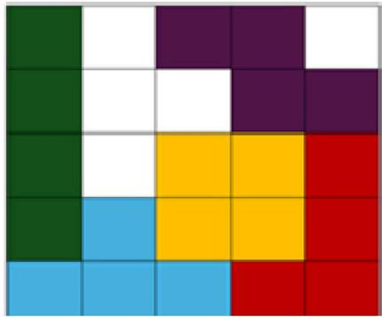

Berdasarkan ketentuan yang telah dijelaskan, arsirlah sebanyak sepuluh susunan bangun berbeda yang memiliki keliling 26 satuan pada lembar jawaban yang tersedia. 