## OSN MATEMATIKA

OSN TINGKAT SEMIFINAL 

## Soal OSN Semifinal Matematika

## Soal Isian Singkat

1. Perhatikan gabungan bangun datar di bawah. 

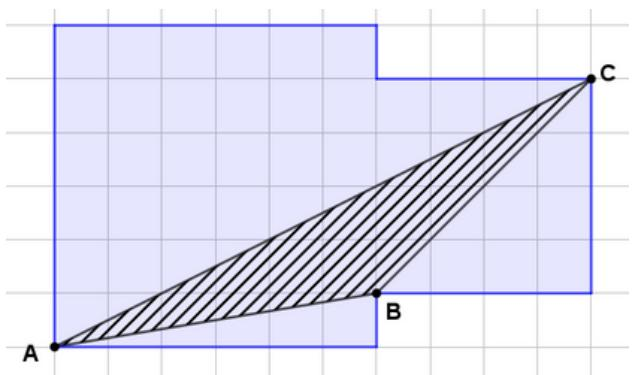

Jika luas satu petak kecil sama dengan $\frac{1}{2}$ cm $^{2}$ , maka luas daerah segitiga ABC adalah ... cm $^{2}$ . 

Jawab: 5 satuan luas

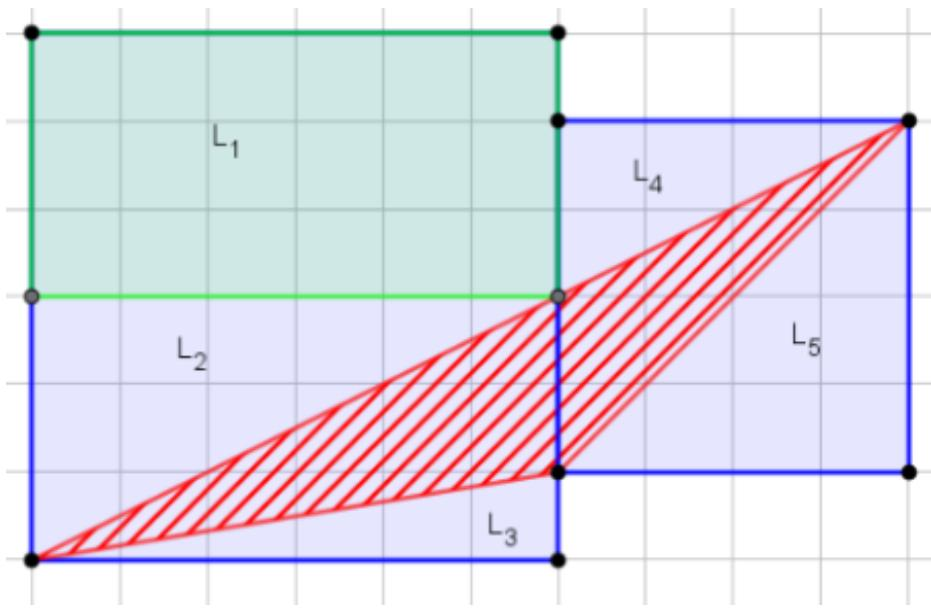

Luas persegi besar = Lb = 36 Luas persegi kecil = Lk = 16 L1=18, L2=9, L3=3, L4=4, L5=8 

Luas daerah diarsir = $\frac{1}{2}$ (36+16-18-9-3-4-8) = $\frac{1}{2}$ 10 

= 5 satuan luas 

## Soal OSN Semifinal Matematika

2. Diketahui hasil penjumlahan tujuh bilangan bulat berurutan merupakan bilangan bulat terbesar yang kurang dari 1195. Bilangan terkecil dari tujuh bilangan bulat tersebut adalah .... 

## Jawab: 167

Karena hasil penjumlahan dari tujuh bilangan bulat berurutan, maka akan diperoleh urutan bilangan sbb: 

<table><tr><td>1</td><td>2</td><td>3</td><td>4</td><td>5</td><td>6</td><td>7</td></tr><tr><td>a</td><td>a+1</td><td>a+2</td><td>a+3</td><td>a+4</td><td>a+5</td><td>a+6</td></tr></table>

Misalkan tujuh bilangan berturut-turut adalah $a, a + 1, a + 2, a + 3, a + 4, a + 5, a + 6$ . Maka: 

$$
a + a + 1 + a + 2 + a + 3 + a + 4 + a + 5 + a + 6 = 7 a + 2 1
$$

Sehingga 7a + 21 merupakan bilangan bulat kelipatan tujuh. 

Bilangan bulat terbesar kurang dari 1195 yang merupakan kelipatan tujuh adalah 1190. 

Menentukan bilangan terkecil sama dengan mencari nilai a 

$$
7 a + 2 1 = 1 1 9 0
$$

$$
7 a = 1 1 6 9
$$

$$
a = 1 6 7
$$

3. Banyak angka nol pada akhir bilangan 17020000 adalah 4. Jika N merupakan hasil perkalian semua bilangan asli kelipatan 5 kurang dari 107, maka banyak angka nol pada akhir bilangan N adalah .... 

## Jawab: 17

Perkalian bilangan-bilangan tersebut adalah: 

$$
N = 5 \times 1 0 \times 1 5 \times 2 0 \times 2 5 \times 3 0 \times 3 5 \times 4 0 \times 4 5 \times 5 0 \times 5 5 \times 6 0 \times 6 5 \times 7 0 \times 7 5 \times 8 0 \times 8 5 \times 9 0 \times 9 5 \times 1 0 0 \times 1 0 5
$$

$$
= (5 \times 1 5 \times 2 \times 2 5 \times 3 \times 3 5 \times 4 \times 4 5 \times 5 \times 5 5 \times 6 \times 6 5 \times 7 \times 7 5 \times 8 \times 8 5 \times 9 \times 9 5 \times 1 0 5) \times 1 0 1 0
$$

$$
= (5 \times 3 0 \times 2 5 \times 3 \times 1 4 0 \times 4 5 \times 5 \times 3 3 0 \times 6 5 \times 7 \times 6 0 0 \times 8 5 \times 9 \times 9 5 \times 1 0 5) \times 1 0 1 0
$$

$$
= (5 \times 3 \times 2 5 \times 3 \times 1 4 \times 4 5 \times 5 \times 3 3 \times 6 5 \times 7 \times 6 \times 8 5 \times 9 \times 9 5 \times 1 0 5) \times 1 0 1 5
$$

$$
= (5 \times 3 \times 2 5 \times 3 \times 6 3 0 \times 5 \times 3 3 \times 6 5 \times 7 \times 5 1 0 \times 9 \times 9 5 \times 1 0 5) \times 1 0 1 5
$$

$$
= (5 \times 3 \times 2 5 \times 3 \times 6 3 \times 5 \times 3 3 \times 6 5 \times 7 \times 5 1 \times 9 \times 9 5 \times 1 0 5) \times 1 0 1 7
$$

Jadi ada 17 angka nol di akhir bilangan N 

## Soal OSN Semifinal Matematika

## Cara lain 1:

Bilangan penghasil angka nol di bagian belakang dari perkalian: 

$$
5 \times 2 0 = 1 0 0
$$

$$
1 5 \times 4 0 = 6 0 0 (*)
$$

$$
2 5 \times 6 0 = 1 5 0 0 (^ {* *})
$$

$$
3 5 \times 8 0 = 2 8 0 0 (* * *)
$$

Ada 8 angka nol 

Penghasil nol tanpa faktor perkalian: 10, 30, 50 (****), 70, 90, 100 

Ada 6 angka nol Dari (*) dan (**) 6 x 15 = 90 

Dari ( $^{***}$ ) dan ( $^{****}$ ) 28 x 5 = 140 (#) 

Ada 2 angka nol 

Bilangan-bilangan yang belum dioperasikan: 45 (##), 55, 65, 75, 85, 95, 105 

Dari (#) dan (##) 14 × 45 = 630 

Ada 1 angka nol 

Total banyak angka nol = 8 +6 +2 +1 = 17 

## Cara Lain 2:

Bilangan-bilangan kelipatan 5 tanpa puluhan: 5,15,25,35,45,55,65,75,85,95,105 

Bilangan-bilangan kelipatan 10: 10, 20, 30,40,50,60,70,80,90,100 (ada 10 angka nol) 

Bilangan-bilangan puluhan tanpa nol di belakang: 1,2,3,4,5,6,7,8,9. 

Angka nol bisa di dapatkan kombinasi perkalian: 5 x 2 = 10 

$$
1 5 \times 4 = 6 0
$$

$$
2 5 \times 6 = 1 5 0
$$

$$
3 5 \times 8 = 2 8 0
$$

Ada 4 angka nol (ada angka yang masih mungkin bisa menghasilkan nol: 6, 15, 28) 

Bilangan-bilangan yang belum dikalikan: 1,3,5,7,9, 6, 15, 28, 45,55,65,75,85,95,105 

Angka nol bisa di dapatkan kombinasi perkalian: 

$$
5 \times 6 = 3 0
$$

$$
1 5 \times 2 8 = 4 2 0
$$

Ada 2 angka nol (ada angka yang masih mungkin bisa menghasilkan nol: 42) 

Bilangan-bilangan yang belum dikalikan: 1,3,7,9,42, 45,55,65,75,85,95,105 

$$
4 2 \times 4 5 = 1 8 9 0
$$

Ada 1 angka nol 

Total banyak angka nol = 10 + 4 + 2 + 1 = 17 

## Soal OSN Semifinal Matematika

4. Misal diberikan suatu segitiga sama kaki ABC dengan AB = BC = 18 cm serta AC = 30 cm. Titik D dan E adalah titik-titik pada AC sehingga luas segitiga ADB = luas segitiga DEB = luas segitiga ECB. Keliling segitiga DEB adalah ... cm. 

## Jawab 36 cm

Karena luas segitiga ADB=DEF=ECB, maka AD=DE=EC=10 cm. 

Misalkan F adalah titik Tengah AC, maka BF= $\sqrt{18^{2}-15^{2}}=12$ 

Karena FE = FC-EC=15-10=5 cm, sehingga BE= $\sqrt{5^{2}-12^{2}}=\sqrt{169}=13$ 

Sehingga keliling segitiga DEB adalah cm 10 + 13 + 13 = 36cm. 

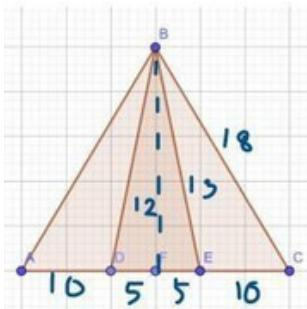

5. Suatu lemari besi memiliki kunci yang merupakan kombinasi dari tombol-tombol yang tersusun dalam dua baris dan empat kolom seperti tampak pada gambar berikut. 

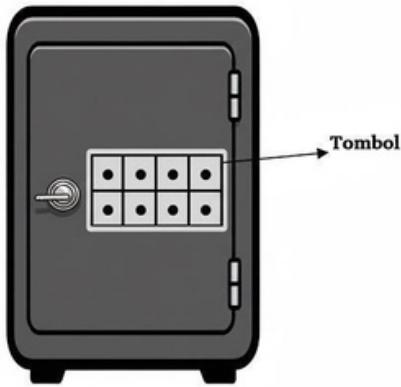

Gambar Lemari Besi

Lemari besi tersebut dapat dibuka dengan menekan 4 tombol sehingga banyak tombol pada tiap baris dan banyak tombol pada tiap kolom merupakan bilangan ganjil. Banyak kombinasi susunan tombol yang mungkin untuk membuka lemari besi adalah .... 

## Jawab: 8 susunan

Karena pada tiap baris atau kolom harus menekan sejumlah ganjil tombol maka kemungkinan tombol yang ditekan adalah: 

Pada baris 1 dan 2 berturut-turut 1 dan 3 atau 3 dan 1. 

Pada susunan baris 1 sejumlah 1 tombol dan baris 2 ada 3 tombol, maka terdapat 4 susunan. 

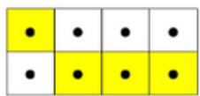

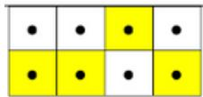

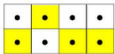

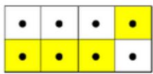

Demikian juga jika pada baris 1 terdapat 3 tombol yang ditekan dan baris kedua terdapat 1 tombol yang ditekan, maka terdapat 4 susunan. 

Sehingga banyaknya susunan kunci untuk membuka lemari tersebut adalah 8 susunan. 

## Soal OSN Semifinal Matematika

6. Jika b merupakan bilangan bulat terbesar sehingga $\frac{1}{3} < \frac{15}{b} < \frac{7}{3}$ dan a merupakan bilangan bulat terkecil sehingga $b \frac{1}{3} < \frac{15}{a} < \frac{7}{3}$ , maka nilai b-a = .... 

Jawab: 8

<table><tr><td>b</td><td>0.333333</td><td>&lt;b&lt;</td><td>0.428571429</td></tr><tr><td>40</td><td></td><td>0.375</td><td></td></tr><tr><td>41</td><td></td><td>0.365853659</td><td></td></tr><tr><td>42</td><td></td><td>0.357142857</td><td></td></tr><tr><td>43</td><td></td><td>0.348837209</td><td></td></tr><tr><td>44</td><td>terbesar</td><td>0.340909091</td><td>b</td></tr><tr><td>45</td><td></td><td>0.333333333</td><td></td></tr><tr><td>46</td><td></td><td>0.326086957</td><td></td></tr><tr><td>39</td><td></td><td>0.384615385</td><td></td></tr><tr><td>38</td><td></td><td>0.394736842</td><td></td></tr><tr><td>37</td><td></td><td>0.405405405</td><td></td></tr><tr><td>36</td><td>terkecil</td><td>0.416666667</td><td>a</td></tr><tr><td>35</td><td></td><td>0.428571429</td><td></td></tr></table>

b-a=44-36 = 8 

7. Jarak titik A ke titik B adalah km. Bila C terletak di antara A dan B sehingga AC : CB = 3 : 5, D terletak di antara A dan B sehingga AD : DB = 4 : 1. Jarak C ke D adalah ... meter. 

## Jawab: 255 meter

AB = 3/5 km = 3/5 × 1000 = 600 m 

AC:CB = 3:5 AC:AB = 3:8 AC = 3/8 × 600 = 225 meter 

AD:DB = 4:1 AD:AB=4:5 AD = 4/5 × 600 = 480 meter 

Jadi jarak C ke D = 480-225 = 255 meter 

## Soal OSN Semifinal Matematika

8. SD Matahari Pertiwi melakukan survei terhadap 300 murid-murid nya mengenai kegiatan mereka di hari Minggu. Empat kategori kegiatan yang disurvei adalah: belajar kelompok, olahraga, bermain game, dan membaca buku. Hasil survei sebagai berikut: banyak murid yang membaca buku 60 anak, banyak murid yang belajar kelompok 90 anak, dan banyak murid yang memilih bermain game 50% lebih banyak dari banyak murid yang memilih olahraga. Hasil survei dapat digambarkan dalam diagram lingkaran di bawah ini. Selisih besar sudut yang mewakili aktivitas bermain game dan olahraga adalah ... derajat. 

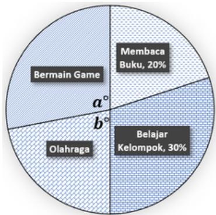

Catatan: ukuran sudut pada gambar bukan ukuran sebenarnya.

## Jawab: 36

Menghitung jumlah siswa untuk kategori yang tidak diketahui: 

Diketahui: Total siswa = 300, BK = 90 dan MB = 60. Maka BK + OR + BG + MB = 300 

90 + OR + BG + 60 = 300 OR + BG = 300 - 150 OR + BG = 150 

Menghitung jumlah siswa untuk kategori olahraga dan bermain game: 

Karena BG 50% lebih banyak dari OR maka 

BG = OR + 50 % × OR BG = 1,5 × OR 

Dari soal diketahui juga bahwa OR + BG =150, diperoleh 

OR + 1,5 OR = 150 

OR = 150/2,5 = 60 siswa. 

Jadi BG = 150 - 60 = 90 siswa. 

Menghitung besar sudut setiap kategori dalam lingkaran 

Besar sudut = Jumlah siswa/total siswa x 360° 

## Sudut untuk Bermain Game:

$$
\left(\frac {9 0}{3 0 0}\right) \times 3 6 0 ^ {\circ} = \frac {9}{3 0} \times 3 6 0 ^ {\circ} = 3 \times 3 6 ^ {\circ} = 1 0 8 ^ {\circ}
$$

## Sudut untuk Olahraga:

$$
\left(\frac {6 0}{3 0 0}\right) \times 3 6 0 ^ {\circ} = \frac {6}{3 0} \times 3 6 0 ^ {\circ} = \frac {1}{5} \times 3 6 ^ {\circ} = 7 2 ^ {\circ}
$$

Menghitung selisih sudut antara Bermain Game dan Membaca Buku. 

Selisih sudut = Sudut Bermain Game - Sudut Olah raga 

Selisih sudut = 108° - 72° = 36°. 

## Soal OSN Semifinal Matematika

9. Suatu kecamatan memiliki tiga desa yaitu P, Q, dan R. Setiap orang di kecamatan yang bekerja, hanya bekerja di salah satu desa tersebut. Pada gambar berikut, arah panah dari desa R menuju desa Q menunjukkan persentase 35%, artinya 35% penduduk yang tinggal di desa R bekerja di desa Q. Begitu juga pada arah panah yang lain memiliki makna yang serupa. 

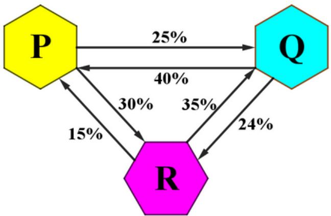

Jika banyak penduduk yang bekerja dan tinggal di desa P, Q, dan R berturut-turut adalah 320, 400, dan 380, maka banyak penduduk yang bekerja di desa Q adalah ... orang. 

## Jawab: 357 orang

Misalkan jumlah orang yang tinggal di desa P, Q, dan R secara berturut-turut adalah p, q, r. 

Jumlah orang yang bekerja di desa Q adalah gabungan dari: 

Orang yang tinggal di P dan bekerja di Q 

Orang yang tinggal di R dan bekerja di Q 

Orang yang tinggal di Q dan bekerja di Q 

Atau 

$$
\begin{array}{l} \frac {2 5}{1 0 0} p + \frac {3 5}{1 0 0} r + \left(q - \frac {4 0}{1 0 0} q - \frac {2 4}{1 0 0} q\right) \\ \frac {2 5}{1 0 0} (p) + \frac {3 5}{1 0 0} (r) + \frac {3 6}{1 0 0} (q) \\ \frac {1}{4} (3 2 0) + \frac {3 5}{1 0 0} (3 8 0) + \frac {3 6}{1 0 0} (4 0 0) \\ 8 0 + 1 3 3 + 1 4 4 = 3 5 7 \\ \end{array}
$$

## Soal OSN Semifinal Matematika

10. Pak Barli mengemudikan mobil dari rumahnya menuju bandara menempuh 56 km selama satu jam, tetapi belum sampai bandara. Pak Barli menyadari bahwa jika terus melaju dengan kecepatan tersebut, maka akan terlambat 1 jam. Ia kemudian menaikkan kecepatannya sebesar 24 km/jam untuk sisa perjalanan ke bandara dan tiba 30 menit lebih awal. Jarak dari rumah Pak Barli ke bandara adalah... km. 

## Jawab: 336 km

Misalkan: 

Jarak ke bandara setelah menempuh 56 km di jam pertama adalah s. 

Waktu pak Barli sampai di bandara tepat waktu adalah t. 

Maka: 

$$
1 \frac {s}{8 0} = t - 0. 5 \dots (1) a t a u 1. 5 \frac {s}{8 0} = t
$$

$$
1 \frac {s}{5 6} = t - 1 \dots (2) a t a u \frac {s}{5 6} = t
$$

$$
1. 5 + \frac {s}{8 0} = \frac {s}{5 6}
$$

$$
1. 5 + \frac {s}{8 0} - \frac {s}{5 6} = 0
$$

$$
\frac {7 s - 1 0 s + 8 4 0}{5 6 0} = 0
$$

$$
3 s = 8 4 0
$$

Maka, jarak dari rumah ke bandara adalah 280+56 = 336km 

11. AB adalah bilangan dua angka dengan A dan B merupakan bilangan prima. Jika AB habis dibagi A dan habis dibagi B, maka banyak bilangan AB yang memenuhi sifat-sifat tersebut adalah .... 

Jawab: 4 bilangan yaitu 22, 33, 55, 77 

Bilangan prima satu angka adalah 2,3,5 dan 7. 

Bilangan 2 angka yang terbentuk adalah 

22,23,25,27,32,33,35,37, 52,53,55,57, 72,73,75, dan 77 

Yang memenuhi sifat A|AB dan B|AB adalah 22, 33, 55, dan 77 

Jadi ada 4 bilangan yang memenuhi sifat-sifat tersebut. 

## Soal OSN Semifinal Matematika

12. Diketahui ABCD trapesium dengan AD sejajar BC dan ukuran sisi-sisi seperti tampak pada gambar. 

Let ABCD be a trapezium with AD parallel to BC, and the length of the sides are shown in the figure below. 

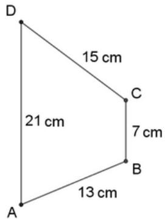

Luas daerah ABCD = ... cm $^{4}$ . 

The area of ABCD = ... cm $^{2}$ . 

Jawaban: 84 cm $^{2}$ 

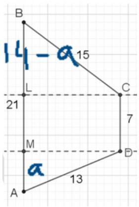

Bila AM = a cm, maka LB = 21 - 7 - a = 14 - a Dan $^{2}$ t = 169 $^{2}$ a $^{2}$ , t = 225 - (14 $^{2}$ - a) 

225 - 169 = (14 - $^{2}$ a) $^{2}$ a. 

$56 = (14 - a)^{2} - a^{2}$ 

<table><tr><td>a</td><td>(14-a)<eq>^2</eq>-a<eq>^2</eq></td></tr><tr><td>1</td><td>168</td></tr><tr><td>2</td><td>140</td></tr><tr><td>3</td><td>112</td></tr><tr><td>4</td><td>84</td></tr><tr><td>5</td><td>56</td></tr></table>

Jadi a = 5 □ t² = 169 - 25 = 144 □ t = 12 

L. ABCD = $\frac{1}{2}$ (21+7)×12=84 

56 = 196-28a 

28a = 140 

a = 5 

## Soal OSN Semifinal Matematika

13. Suatu perusahaan media digital menyediakan tiga paket pemasangan reklame di tempat strategis yaitu: 

- Paket A: Rp121.000.000 untuk 10 titik. 

- Paket B: Rp15.000.000 per titik. 

- Paket C: Rp13.000.000 per titik, minimal pemasangan 5 titik dan maksimal 9 titik, bila pemasangan lebih dari 5 titik mendapat diskon tambahan 10% untuk pemasangan titik ke-6, ke-7, ke-8, dan ke-9. 

Bila seorang klien ingin memasang iklan di 13 titik, maka biaya pemasangan paling murah adalah ... rupiah. 

## Jawaban: Rp165.100.000.

Kombinasi paket yang mungkin untuk 13 titik. 

- Kemungkinan 1: Paket A (10 titik) + Paket B (3 titik) 

Biaya Paket A: Rp121.000.000 

Biaya 3 titik tambahan (Paket B): $3 \times Rp15.000.000 = Rp45.000.000$ 

Total biaya: Rp121.000.000 + Rp45.000.000 = Rp166.000.000 

• Kemungkinan 2: Paket B (13 titik) 

Biaya 13 titik (Paket B): $13 \times Rp15.000.000 = Rp195.000.000$ 

- Kemungkinan 3: Paket C (9 titik) + Paket B (4 titik) 

Biaya 9 titik (Paket C): 5 titik awal: $5 \times Rp13.000.000 = Rp65.000.000$ 

4 titik kelebihan: $4 \times Rp13.000.000 = Rp52.000.000$ 

Diskon 10% untuk 4 titik kelebihan: 10% dari Rp52.000.000 = Rp5.200.000 

Total Paket C: Rp65.000.000 + (Rp52.000.000 - Rp5.200.000) = Rp111.800.000 

Biaya 4 titik tambahan (Paket B): 4 × Rp15.000.000 = Rp60.000.000 

Total biaya: Rp111.800.000 + Rp60.000.000 = Rp171.800.000 

- Kemungkinan 4: Paket C (5 titik) + Paket C (8 titik) 

Biaya Paket C untuk 5 titik: 5 x Rp13.000.000 = Rp65.000.000 

Biaya Paket C untuk 8 titik: Biaya 5 titik awal: 5 x Rp13.000.000 = Rp65.000.000 

Biaya 3 titik kelebihan: 3 x Rp13.000.000 = Rp39.000.000 

Diskon 10% untuk 3 titik kelebihan: 10% x Rp39.000.000 = Rp3.900.000 

Total biaya 8 titik: Rp65.000.000 + (Rp39.000.000 - Rp3.900.000) = Rp100.100.000 

Total biaya: Rp65.000.000 + Rp100.100.000 = Rp165.100.000 

Biaya yang paling minimal Rp165.100.000. 

## Soal OSN Semifinal Matematika

14. Di dalam lemari pakaian terdapat tujuh baju, yaitu baju warna merah, jingga, kuning, hijau, biru, nila, dan ungu, juga terdapat tujuh celana dengan warna merah, jingga, kuning, hijau, biru, nila, dan ungu. Banyak cara seorang penata gaya mengambil lima potong pakaian sehingga terdapat tepat sepasang baju dan celana dengan warna yang sama adalah .... 

Jawaban: 280 cara 

$$
\frac {7 \times 1 2 \times 1 0 \times 8}{1 \times 2 \times 3 \times 4} = \frac {6 7 2 0}{2 4} = 2 8 0
$$

15. Sebuah robot bergerak dari titik A menuju titik B melewati garis mendatar dan tegak seperti gambar di bawah. Robot hanya bisa bergerak ke Timur atau ke Utara. Banyak jalur berbeda yang bisa ditempuh robot dari A ke B tanpa melewati P adalah .... 

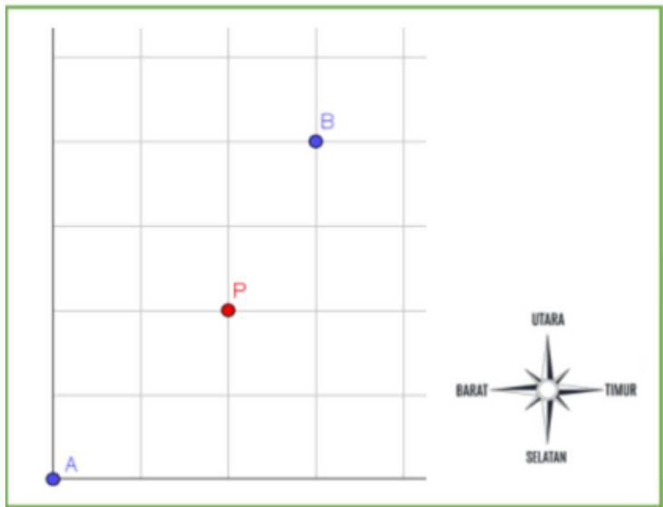

Jawab: 17 jalur 

7!/4! 

Total jalur (dengan mengabaikan P) = 35 jalur Jalur terlarang = 18 jalur 

Jalur yang ditanyakan = 35 - 18 = 17 jalur 

## Soal OSN Semifinal Matematika

## Soal Uraian

1. Dua persegi memiliki luas yang sama, yaitu 36 cm^2 Keduanya diletakkan tumpang tindih sehingga membentuk area gabungan. Jika area yang tumpang tindih berbentuk persegi dan luasnya 16 cm^2, maka berapa meter keliling bangun gabungan tersebut? 

## Jawab: 0,32 meter

- Persegi dengan luas 36 cm2 memiliki Panjang sisi $\sqrt{36} = 6$ cm (skor 0,5) 

- Luas area yang tumpang tindih 16 cm2 maka Panjang sisinya $\sqrt{16} = 4$ (skor 0,5) 

- Hanya 2 sisi persegi besar yang terpotong sehingga keliling dari bangun gabungan adalah = 6 × 4 + (6 - 4) × 4 = 24 + 8 = 32 cm (skor 1) 

- Keliling bangun gabungan = 0,32 m (skor 1) 

- Jika menjawab benar tanpa cara maka mendapatkan skor 1 

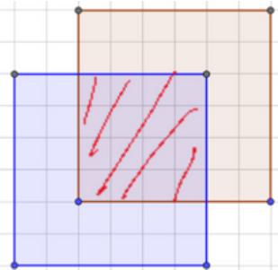

2. Perusahaan jasa pengantaran paket akan mengantar barang dari agen ke empat tujuan berbeda. Tentukan banyak cara agen menugaskan tiga orang kurir sehingga setiap kurir ditugaskan ke paling sedikit satu tujuan. 

## Jawab: 36 cara

## Cara 1

Berikut adalah tabel yang mengilustrasikan semua kemungkinan distribusi tugas, di mana T1, T2, T3, T4 adalah empat tugas berbeda, dan K1, K2, K3 adalah tiga kurir berbeda. 

<table><tr><td>K1</td><td>K2</td><td>K3</td><td>K1</td><td>K2</td><td>K3</td><td>K1</td><td>K2</td><td>K3</td></tr><tr><td>{T1, T2}</td><td>{T3}</td><td>{T4}</td><td>{T3}</td><td>{T1, T2}</td><td>{T4}</td><td>{T3}</td><td>{T4}</td><td>{T1, T2}</td></tr><tr><td>{T1, T2}</td><td>{T4}</td><td>{T3}</td><td>{T4}</td><td>{T1, T2}</td><td>{T3}</td><td>{T4}</td><td>{T3}</td><td>{T1, T2}</td></tr><tr><td>{T1, T3}</td><td>{T2}</td><td>{T4}</td><td>{T2}</td><td>{T1, T3}</td><td>{T4}</td><td>{T2}</td><td>{T4}</td><td>{T1, T3}</td></tr><tr><td>{T1, T3}</td><td>{T4}</td><td>{T2}</td><td>{T4}</td><td>{T1, T3}</td><td>{T2}</td><td>{T4}</td><td>{T2}</td><td>{T1, T3}</td></tr><tr><td>{T1, T4}</td><td>{T2}</td><td>{T3}</td><td>{T2}</td><td>{T1, T4}</td><td>{T3}</td><td>{T2}</td><td>{T3}</td><td>{T1, T4}</td></tr><tr><td>{T1, T4}</td><td>{T3}</td><td>{T2}</td><td>{T3}</td><td>{T1, T4}</td><td>{T2}</td><td>{T3}</td><td>{T2}</td><td>{T1, T4}</td></tr></table>

## Soal OSN Semifinal Matematika

<table><tr><td>{T2, T3}</td><td>{T1}</td><td>{T4}</td><td>{T1}</td><td>{T2, T3}</td><td>{T4}</td><td>{T1}</td><td>{T4}</td><td>{T2, T3}</td></tr><tr><td>{T2, T3}</td><td>{T4}</td><td>{T1}</td><td>{T4}</td><td>{T2, T3}</td><td>{T1}</td><td>{T4}</td><td>{T1}</td><td>{T2, T3}</td></tr><tr><td>{T2, T4}</td><td>{T1}</td><td>{T3}</td><td>{T1}</td><td>{T2, T4}</td><td>{T3}</td><td>{T1}</td><td>{T3}</td><td>{T2, T4}</td></tr><tr><td>{T2, T4}</td><td>{T3}</td><td>{T1}</td><td>{T3}</td><td>{T2, T4}</td><td>{T1}</td><td>{T3}</td><td>{T1}</td><td>{T2, T4}</td></tr><tr><td>{T3, T4}</td><td>{T1}</td><td>{T2}</td><td>{T1}</td><td>{T3, T4}</td><td>{T2}</td><td>{T1}</td><td>{T2}</td><td>{T3, T4}</td></tr><tr><td>{T3, T4}</td><td>{T2}</td><td>{T1}</td><td>{T2}</td><td>{T3, T4}</td><td>{T1}</td><td>{T2}</td><td>{T1}</td><td>{T3, T4}</td></tr></table>

## (3,6 masing-masing sel benar nilai 0,1)

Ada 36 cara untuk mendistribusikan empat tugas berbeda ke tiga kurir berbeda, dengan setiap kurir ditugaskan paling sedikit satu tujuan. (0,15) 

Jika menjawab hanya 36 cara tanpa cara nilai 1,25. 

## Cara 2

Masalah ini dapat diselesaikan dengan membagi tugas menjadi 3 kelompok, yaitu satu kelompok berisi 2 tugas dan dua kelompok masing-masing berisi 1 tugas. 

- Memilih kelompok 2 tugas dari 4 tugas yang ada: Jumlah cara untuk memilih 2 tugas dari 4 adalah $\left(C_{2}^{4}\right)=4!/(4-2)!2!=24/4=6$ cara. (skor 1,5) 

- Membagi 3 kelompok tugas ke 3 kurir: Kelompok tugas (2 tugas, 1 tugas, dan 1 tugas) dapat didistribusikan ke 3 kurir berbeda dengan 3! cara. Kurir A bisa mendapat kelompok 2 tugas, Kurir B mendapat 1 tugas, dan Kurir C mendapat 1 tugas. Jumlah cara menyusun 3 kelompok tugas ke 3 kurir adalah 3! = 3 × 2 × 1 = 6 cara. (skor 1,5) 

- Total cara: Total cara = (cara memilih kelompok) × (cara mendistribusikan kelompok) 

• Total cara = 6 × 6 = 36 cara. (skor 0,75) 

Jika menjawab hanya 36 cara tanpa cara nilai 1,25. 

3. Santi, Tian, dan Umi mulai bekerja pada pukul 09.30 pagi di perusahaan jasa pengemasan barang. Dalam setiap 4 menit, mereka masing-masing mampu mengemas sebanyak 5, 4, dan 3 barang. Beberapa waktu kemudian, Vina bergabung dan mampu mengemas 6 barang dalam setiap 5 menit. Jika mereka berempat menyelesaikan pengemasan sebanyak 450 barang tepat pada pukul 11.40, maka pukul berapa Vina bergabung? 

## Jawab: Pukul 10.50

Sebelum Vina bergabung: 

Total paket yang dikemas: 5+4+3 = 12 paket/ 4 menit (skor 0.75) 

## Soal OSN Semifinal Matematika

## Setelah Vina bergabung:

450 paket dalam 2 jam 10 menit atau 130 menit 

- Paket yang diselesaikan Santi, Tian, Umi dalam 130 menit 

$$
\frac {1 3 0 m e n i t}{4 m e n i t} \times 1 2 p a k e t = 3 9 0 p a k e t (\text {skor} 0, 5)
$$

- Paket yang diselesaikan Vina 

$$
4 5 0 \text {   paket   } - 3 9 0 \text {   paket   } = 6 0 \text {   paket   (skor   0,5) }
$$

- Waktu yang dibutuhkan Vina dalam menyelesaikan 60 paket 

$$
\frac {1 3 0 m e n i t}{4 m e n i t} \times \times 5 m e n i t = 5 0 m e n i t (\text {skor} 1)
$$

• Vina bergabung 50 menit sebelum pukul 11.40 atau: 

Pukul 11.40 - 50 menit = Pukul 10.50 (skor 1) 

Jika menjawab benar tanpa cara mendapatkan skor 1,5. 

4. Misalkan ABC dan CBA adalah bilangan ratusan. Tuliskan semua bilangan ABC sehingga memenuhi 

ABC 

CBA + 

DDD 

## Jawab:

Karena ABC dan CBA Adalah bilangan ratusan serta ABC + CBA merupakan bilangan ratusan, maka 0 < A + C < 10 (skor 0,5) 

Karena A+C=B+B=2B, maka A+C genap (skor 0,4) Jadi A dan C sama-sama ganjil atau A dan C sama sama genap (skor 0,4) 

Sehingga yang memenuhi adalah 

<table><tr><td>A</td><td>C</td><td>B</td><td>(A,B,C)</td></tr><tr><td>1</td><td>1</td><td>1</td><td>(1,1,1)</td></tr><tr><td>1</td><td>3</td><td>2</td><td>(1,2,3)</td></tr><tr><td>2</td><td>2</td><td>2</td><td>(2,2,2)</td></tr><tr><td>2</td><td>4</td><td>3</td><td>(2,3,4)</td></tr><tr><td>3</td><td>1</td><td>2</td><td>(3,2,1)</td></tr><tr><td>3</td><td>3</td><td>3</td><td>(3,3,3)</td></tr><tr><td>4</td><td>2</td><td>3</td><td>(4,3,2)</td></tr><tr><td>4</td><td>4</td><td>4</td><td>(4,4,4)</td></tr></table>

(masing-masing baris skor 0,2) 

Jika hanya menjawab 1 susunan tanpa ada penjelasan maka setiap susunan nilainya 0,2 → bila dpt menulis semua bilangan (16) maka nilai 4,5 

## Soal OSN Semifinal Matematika

5. Hitung hasil dari penjumlahan berikut dan nyatakan dalam bentuk pecahan yang paling sederhana. 

$$
\frac {1}{3} + \frac {1}{6} + \frac {1}{1 2} + \frac {1}{2 0} + \frac {1}{3 0} + \frac {1}{4 2} + \frac {1}{5 6} + \frac {1}{6 4}
$$

Jawab: $\frac{139}{192}$ 

$$
\begin{array}{l} = \frac {1}{3} + \frac {1}{2 . 3} + \frac {1}{3 . 4} + \frac {1}{4 . 5} + \frac {1}{5 . 6} + \frac {1}{6 . 7} + \frac {1}{7 . 8} + \frac {1}{6 4} (\text {Skor} 1, 5) \\ = \frac {1}{3} + \left(\frac {1}{2} - \frac {1}{3}\right) + \left(\frac {1}{3} - \frac {1}{4}\right) + \left(\frac {1}{4} - \frac {1}{5}\right) + \left(\frac {1}{5} - \frac {1}{6}\right) + \left(\frac {1}{6} - \frac {1}{7}\right) + \left(\frac {1}{7} - \frac {1}{8}\right) + \frac {1}{6 4} \\ = \frac {1}{3} + \frac {1}{2} - \frac {1}{8} + \frac {1}{6 4} (\text { Skor } 1, 5) \\ = \frac {1}{3} + \frac {1}{2} - \frac {1}{8} + \frac {1}{6 4} = \frac {5}{6} - \frac {7}{6 4} = \frac {3 2 0 - 4 2}{6 \times 6 4} = \frac {2 7 8}{6 \times 6 4} = \frac {1 3 9}{1 9 2} (\text {Skor} 1, 5) \\ \end{array}
$$

Jika menjawab benar tanpa cara mendapatkan skor 1,5. 