## Arsip Soal OSN Matematika SD/MI Tingkat Provinsi Tahun 2009

Disusun oleh Tim OSN Provinsi Kalimantan Barat 

Diunduh melalui situs mathcyber1997.com 

## I. Bagian Tes 1

1. Jika kemarin adalah hari Kamis, maka 2009 hari yang akan datang adalah hari · · · · 

2. Banyaknya bilangan prima dua angka yang jika urutan angkanya dibalik juga menghasilkan bilangan prima adalah · · · · 

3. Dua bilangan cacah berselisih 6 dan hasil perkaliannya 216. Bilangan terbesar dari dua bilangan itu adalah · · · · 

4. Jika bilangan 45N78 habis dibagi 3, maka jumlah dari semua bilangan N yang mungkin adalah · · · · 

5. Aku memiliki sebuah pecahan. Jika aku tambahkan $\frac 1 3$ , maka hasilnya ${ \frac { 3 } { 4 } } .$ Bilangan pecahan apakah itu? 

6. Nadia mencari bilangan asli yang bersisa 3 ketika dibagi 4, bersisa 2 ketika dibagi 3, dan bersisa 1 ketika dibagi 2. Bilangan terkecil yang memenuhi semua syarat itu adalah · · · · 

7. Jika 0, 252525 · · · dapat dijadikan pecahan paling sederhana berbentuk $\frac { a } { b }$ , maka nilai a + b = · · · · 

8. Pada akhir tahun 2008, $\frac { 5 } { 8 }$ guru di suatu sekolah dasar adalah wanita. Pada awal tahun 2009, sekolah tersebut menerima 4 guru pria yang baru sehingga jumlah seluruh guru pria menjadi 16 orang. Jumlah guru wanita yang mengajar di sekolah tersebut pada akhir tahun 2008 adalah · · · · 

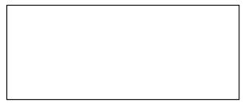

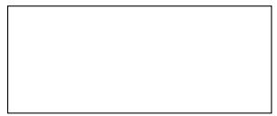

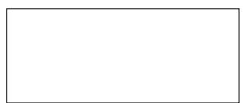

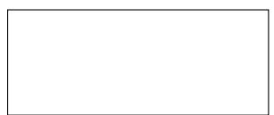

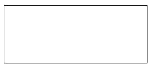

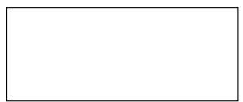

9. Suatu persegi memiliki keliling 60 cm. Jika setiap sisinya bertambah panjang sebesar 20%, maka luas persegi tersebut sekarang adalah $\cdots \mathrm { c m ^ { 2 } }$ . 

10. The ratio of the number of apples to the number of pears in a box is 2 : 3. If there are 180 more pears than apples, then the number of pears in the box is · · · · 

11. Kalung manik-manik milik Lia rusak. Sebanyak $\frac 1 3$ dari jumlah manik-maniknya ada di lantai dan $\mathrm { { \frac { 1 } { 4 } } \mathrm { { \bar { \Omega } } ^ { - n y a } } }$ ada di kasur. Jika $\frac { 1 } { 6 }$ masih tersisa pada tali kalung tersebut dan sebanyak 12 manik-manik hilang, maka jumlah manik-manik semula yang terpasang pada kalung adalah 

12. Saya menyimpan kelereng dalam 9 dus kecil masing-masing sama banyak. Jika saya mengambil semua kelereng dari 6 dus dan dibagikan sama banyak ke setiap dus lainnya, maka isi dus-dus tersebut bertambah 10 kelereng. Banyak kelereng yang saya punya adalah · · · · 

13. Dengan 64 pekerja, seorang pengusaha harus mengeluarkan upah satu juta rupiah per hari. Jika 8 orang pekerja diberhentikan, maka upah yang harus dikeluarkan pengusaha tersebut tiap harinya menjadi 

14. Indra mengelilingi lapangan berbentuk trapesium sama kaki sebanyak 9 kali putaran. Tinggi trapesium 120 m dan dua sisi sejajar memiliki panjang 300 m dan 200 m. Jarak yang ditempuh Indra adalah · · · km. 

15. Adli bought an English dictionary at a 30% discount. He then paid $\mathrm { R p 6 3 . 0 0 0 } , 0 0$ . The initial price of the dictionary was · · · · 

<table><tr><td></td></tr><tr><td></td></tr><tr><td></td></tr><tr><td></td></tr><tr><td></td></tr><tr><td></td></tr><tr><td></td></tr><tr><td></td></tr><tr><td></td></tr><tr><td></td></tr><tr><td></td></tr></table>

16. Perhatikan gambar berikut. 

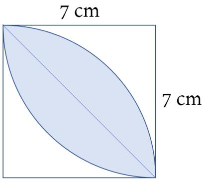

Garis lengkung merupakan busur suatu lingkaran. Luas daerah yang diarsir (luas daun) adalah · · · · 

17. Sebuah wadah berisi minyak $\frac { 1 } { 5 }$ bagian. Bila ke dalam wadah itu dituang lagi 3, 5 liter minyak, isi wadah menjadi $\frac { 2 } { 3 }$ bagian. Agar penuh, maka harus dituang minyak lagi sebanyak · · · liter. 

18. Jarak kota Pontianak ke Singkawang adalah 160 km. Andi bersepeda motor dari Pontianak dengan kecepatan rata-rata 60 km/jam dan tiba di Singkawang pada pukul 10.10. Jika di tengah perjalanan ia beristirahat selama 15 menit, maka Andi berangkat pada pukul · · · · 

19. Tomo berjalan sejauh 2, 5 km selama 40 menit. Ia kemudian melanjutkan perjalanannya lagi sejauh 2 km selama 50 menit. Kecepatan rata-rata Tomo berjalan adalah · · · km/jam. 

20. Nilai rata-rata 5 besar peserta OSN bidang matematika tahun lalu adalah 75, sedangkan nilai rata-rata 6 besarnya adalah 73. Nilai peserta peringkat ke-6 adalah 

21. The longer side of a rectangle is 3 times the length of shorter side. If its perimeter is 72 cm, how long is the shorter side of this rectangle? 

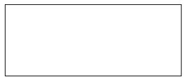

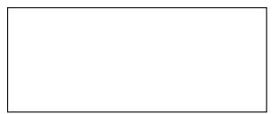

22. Keliling persegi panjang adalah 56 cm. Jika panjangnya dikurangi 3 cm, kemudian dibagi 4, maka diperoleh ukuran lebar persegi panjang tersebut. Luas persegi panjang itu adalah · · · cm2. $\cdots \mathrm { c m ^ { 2 } }$ 

23. Selembar uang Rp100.000,00 akan ditukarkan dengan pecahan uang lembaran Rp10.000,00 dan Rp5.000,00 dengan ketentuan salah satu dari dua uang pecahan itu harus ada minimal selembar. Ada berapa cara komposisi penukaran uang yang berbeda? 

24. If 4#3 = 7, 5#2 = 21, 7#5 = 24, then $6 \# 5 = \cdot \cdot \cdot$ 

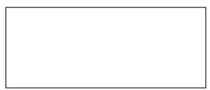

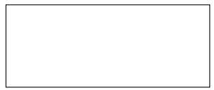

## II. Bagian Tes 2

1. D merupakan jumlah bilangan ganjil dari 1 sampai 99 secara berurutan, sedangkan N adalah jumlah bilangan genap dari 2 sampai 98 secara berurutan. Tentukan selisih antara D dan N. 

2. Usia Mely setahun lebih tua dari usia Didi, sedangkan usia Fifi dua tahun lebih muda dari usia Mely. Pada tahun ini, jumlah usia ketiganya adalah 118 tahun. Berapakah usia Mely pada tahun ini? 

3. Dua buah bilangan mempunyai perbandingan 7 : 9. Jika bilangan pertama dikurangi 12 dan bilangan kedua ditambah 16, maka perbandingan kedua bilangan tersebut sekarang menjadi 1 : 2. Tentukan masing-masing dua bilangan yang dimaksud. 

4. Harga 4 ekor ayam dan 5 ekor itik adalah Rp250.000,00, sedangkan harga 3 ekor ayam dan 5 ekor itik adalah Rp225.000,00. Berapakah total harga dari seekor ayam dan seekor itik? 

5. Bu Elly membeli sebuah buku seharga Rp40.000,00 dan akan dijualnya kembali. Jika ia memberi diskon 20%, namun masih mendapat keuntungan 25%, maka berapa rupiah buku itu harus dijual Bu Elly? 

6. Ahmad melakukan perjalanan dari kota A ke kota C melalui kota B. Pada pukul 07.00, dia berangkat dari kota A dengan kecepatan rata-rata 30 km/jam. Pada pukul 08.30, ia sampai di kota B. Setelah beristirahat 30 menit, Ahmad berangkat menuju kota C dan sampai di sana pada pukul 10.30. Jika jarak tempuh totalnya adalah 135 km, maka berapa kecepatan rata-rata perjalanan Ahmad dari kota B ke C dalam satuan km/jam? 

7. Hitunglah perbandingan luas daerah yang diarsir terhadap luas persegi pada gambar di bawah ini dengan catatan bahwa garis melengkung merupakan busur suatu lingkaran. 

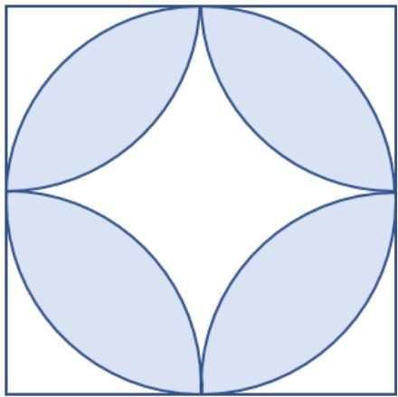

8. Jika Pak Ali dan Pak Beni bekerja bersama-sama, pekerjaan dapat selesai selama 6 hari. Jika Pak Ali bekerja sendiri, dibutuhkan waktu 9 hari untuk menyelesaikan pekerjaan yang sama. Berapa hari waktu yang dibutuhkan jika Pak Beni bekerja sendiri? 

9. Saat bulan lalu, berat badan Budi dua kali berat badan Dani. Berat badan Budi turun 8 kg pada bulan ini. Berat badannya sekarang 30 kg lebihnya dari berat badan Dani. Berapa berat badan Budi pada bulan ini? 

10. Suatu akuarium berbentuk balok dengan ukuran 80 cm × 50 cm × 40 cm berisi air sampai setengah bagian. Jika sebuah kubus besi yang memiliki panjang rusuk 20 cm dimasukkan ke dalam akuarium itu, maka tinggi airnya akan naik menjadi · · · · 

11. Sebanyak 40% dari jumlah kursi di suatu pesawat merupakan kursi kelas A. Sisa kursi lainnya merupakan kursi kelas B dan kelas Ekonomi dengan perbandingan 5 : 7. Jumlah kursi kelas Ekonomi 30 lebih banyak dari kursi kelas B. Berapa banyak semua kursi di pesawat itu? 

12. Halaman rumah Pak Husin berukuran panjang 25 m dan lebar 18 m. Sebanyak 30% dari halaman tersebut terkena program pelebaran jalan. Ganti rugi tanah yang diberikan sebesar 40% dari harga pada umumnya. Jika harga tanah pada umumnya Rp120.000,00 per meter persegi, maka berapa rupiah uang ganti rugi yang diterima Pak Husin? 

13. Tentukan nilai dari ${ \frac { 1 } { 3 \times 5 } } + { \frac { 1 } { 5 \times 7 } } + { \frac { 1 } { 7 \times 9 } } + \cdots + { \frac { 1 } { 9 5 \times 9 7 } } + { \frac { 1 } { 9 7 \times 9 9 } } .$ 

Kunjungi mathcyber1997.com untuk mendapatkan arsip soal lainnya 