## Arsip Soal OSN Matematika SD/MI Tingkat Provinsi Tahun 2010

Disusun oleh Tim OSN Provinsi Kalimantan Barat 

Diunduh melalui situs mathcyber1997.com 

## I. Bagian Tes 1

1. Jika tanggal 26 Juni 2010 adalah hari Sabtu, maka tanggal 1 Januari 2005 adalah hari · · · · 

2. Dua bilangan selisihnya 3 dan jumlah kuadratnya 117. Bilangan-bilangan itu adalah · · · · 

3. Banyaknya faktor positif dari 960 adalah · · · · 

4. Jumlah luas dari persegi A dan persegi B sama dengan luas persegi C. Jika keliling persegi A sama dengan 48 cm dan keliling persegi B sama dengan 64 cm, maka keliling persegi C adalah · · · · 

5. Mirna berenang setiap 4 hari sekali, sedangkan Bety berenang 7 hari sekali. Kemarin Mirna berenang, sedangkan Bety akan berenang besok. Berapa hari lagi keduanya paling cepat akan berenang pada hari yang sama? 

6. Jika $P , Q ,$ , dan R masing-masing adalah bilangan bulat positif yang memenuhi sistem persamaan berikut: 

$$
\left\{ \begin{array}{l l} P \times P & = Q \\ Q - P & = R, \\ P + P & = R \end{array} \right.
$$

maka nilai dari $P + Q + R = \cdots$ 

7. Sebanyak 10 kg beras akan dikemas menjadi 25 kantong. Sebanyak $\frac { 4 } { 5 }$ bagian dari beras tersebut akan dikemas dalam 5 kantong yang ukurannya sama. Sisa beras akan dikemas dalam kantong yang ukurannya lebih kecil. Berapa kg berat beras dalam kantong berukuran kecil? 

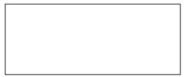

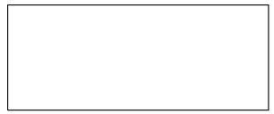

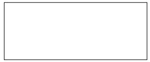

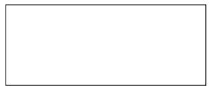

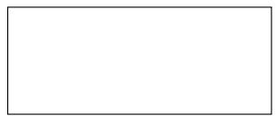

8. Volume suatu kubus adalah 1.000 cm3. Jika panjang rusuknya bertambah 50%, maka volume kubus yang baru adalah · · · · 

9. Jika 5 ekor kucing dapat menangkap 5 ekor tikus dalam waktu 5 menit, maka jumlah tikus yang dapat ditangkap 20 kucing dalam waktu 20 menit adalah · · · · 

10. Lantai rumah berukuran 9 m × 8 m. Ayah ingin menutup lantai dengan keramik berukuran 60 cm × 60 cm. Satu keping keramik harganya Rp50.000,00. Total harga pembelian keramik agar seluruh lantai tertutup adalah · · · · 

11. Sebuah pesawat hanya mampu membawa 18 orang dewasa atau 30 orang anak. Pada suatu hari, ada 12 orang dewasa yang akan berangkat menggunakan pesawat itu. Paling banyak berapa jumlah anak yang dapat ikut berangkat? 

12. Panjang diameter sebuah roda sepeda adalah 1 meter. Saat sepeda tersebut berjalan, rodanya berputar sebanyak 500 kali. Berapa kilometer jarak yang ditempuh sepeda itu? (π = 3, 14) 

13. KPK dan FPB dari 28, 36, dan 40 berturut-turut adalah 

14. Untuk menempuh perjalanan dari Pontianak ke Sambas dengan kecepatan rata-rata 60 km/jam, Pak Yudi biasanya memerlukan waktu selama 6 jam 40 menit. Agar Pak Yudi tiba di Sambas 1 jam 20 menit lebih awal dari biasanya, maka kecepatan rata-rata Pak Yudi berkendara adalah · · · · 

15. Suatu toko memberikan persentase potongan harga yang sama terhadap seluruh produk yang dijualnya. Harga celana yang semula seharga Rp66.000,00 dipotong menjadi Rp45.000,00. Jika harga kaus mula-mula Rp22.000,00, maka setelah mendapat potongan harga akan menjadi · · · · 

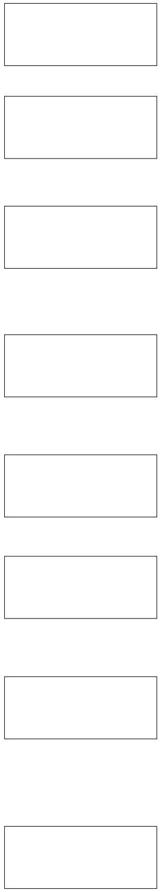

16. Jika A dan B adalah bilangan asli berbeda yang memenuhi ${ \frac { 1 } { 4 } } = { \frac { 1 } { A } } - { \frac { 1 } { B } }$ 4 = A − B , maka nilai masing-masing dari keduanya adalah · · · · 

17. Sebuah penampungan air dengan volume $2 0 ~ \mathrm { m ^ { 3 } }$ dalam keadaan kosong diisi air sebanyak 4 $\mathrm { m ^ { 3 } }$ setiap hari. Tiap sore hari, air itu diambil sebanyak $\mathrm { 3 ~ m ^ { 3 } }$ . Pada hari ke berapa penampungan air itu penuh? 

18. Sehelai kain memiliki panjang 512 cm. Karena dianggap terlalu panjang, kain itu dilipat sebanyak 6 kali lipatan. Panjang lipatan terakhir adalah · · · cm. 

19. Mobil milik Adi diisi 12 liter bensin. Dengan kecepatan rata-rata 48 $\mathrm { k m / j a m }$ menggunakan mobilnya, Adi bergerak dari kota A ke kota B selama 4 jam dan tersisa 0, 5 liter bensin. Jika dengan kecepatan yang sama, namun diisi bensin sebanyak 37 liter, maka waktu yang diperlukan Adi untuk bergerak dari kota A ke kota B adalah · · · jam. 

20. Diketahui 35% dari X adalah 42 dan $\frac { 5 } { 6 }$ dari $Y$ adalah 25. Nilai $X + Y$ adalah · · · · 

21. Dede membelanjakan $\frac { 5 } { 1 1 }$ dari uangnya untuk membeli celana panjang dan $\frac { 1 } { 2 }$ 1 dari sisanya djgunakan untuk membeli ikat pinggang. Berapa persen uang Dede yang dibelanjakan? 

22. Angka satuan dari $2 ^ { 2 0 1 0 } + 3 ^ { 2 0 1 0 }$ adalah · · · · 

23. Pecahan biasa paling sederhana yang merupakan hasildari $\frac { 1 } { 1 \times 2 } + \frac { 1 } { 2 \times 3 } + \frac { 1 } { 3 \times 4 } + \frac { \dot { 1 } } { 4 \times 5 } + \frac { 1 } { 5 \times 6 } + \frac { 1 } { 6 \times 7 } +$ 十$\frac { 1 } { 7 \times 8 } + \frac { 1 } { 8 \times 9 } + \frac { 1 } { 9 \times 1 0 }$ 1 + adalah · · · ·

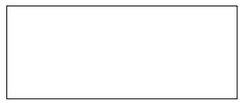

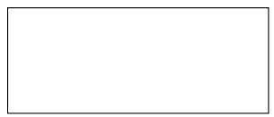

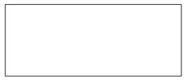

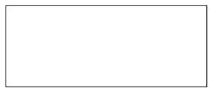

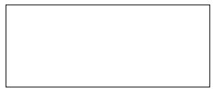

24. Pak Agung mencampur 25 kg beras jenis A seharga Rp5.200,00/kg dengan 15 kg beras jenis B seharga Rp4.800,00/kg. Pak Agung akan menjual campuran beras tersebut dengan harga tiap kilogramnya sebagai rata-rata dari harga kedua jenis beras. Seorang ibu kemudian membeli 8 kg beras campuran tersebut. Berapa rupiah uang kembalian yang diterima ibu itu? 

25. Rata-rata 9 bilangan adalah 8. Salah satu di antara 9 bilangan itu diabaikan. Rata-rata 8 bilangan tersisa adalah 7. Jika x adalah bilangan yang diabaikan dan $y = 1 6$ , maka hubungan ketidaksamaan antara x dan y adalah · · · (pilih: >, <, atau =). 

26. Jika $4 \circ 2 = 8 , 5 \circ 3 = 1 1$ , dan $4 \circ 6 = 1 6$ , maka $6 \circ 5 = \cdots$ 

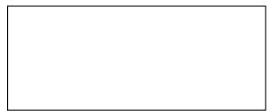

## II. Bagian Tes 2

1. Babak final lomba lari 100 meter putra diikuti oleh 4 peserta, yaitu Anas, Andi, Akbar, dan Ruhut. Anggaplah bahwa tidak ada yang memasuki garis finish bersamaan. Jika Anas selalu lebih cepat dari Andi, tentukan banyak kemungkinan susunan pemenang dari urutan pertama sampai keempat. 

2. Jika kecepatan sepeda motor dinaikkan dari 50 km/jam menjadi 60 km/jam, jarak yang ditempuh Toni bertambah 3 km untuk setiap liter bensin yang digunakannya. Pada kecepatan 50 km/jam, Toni dapat menempuh jarak 18 km/liter. Tentukan banyaknya liter bensin yang dapat dihemat Toni dalam perjalanan sejauh 180 km jika ia menaikkan kecepatannya dari 50 km/jam menjadi 60 km/jam. 

3. Sebuah bak dapat diisi air menggunakan pipa kecil yang mengalirkan air 20 liter/menit atau menggunakan pipa besar yang mengalirkan air 25 liter/menit. Bila pipa besar yang digunakan, bak tersebut akan penuh lebih cepat 1 menit dibandingkan menggunakan pipa kecil. Berapa menit waktu yang dibutuhkan untuk memenuhi bak dengan air bila menggunakan pipa kecil? 

4. Dua buku, dua pensil, dan satu penghapus memiliki total harga Rp15.000,00. Satu buku, satu pensil, dan satu penghapus harganya Rp9.000,00. Berapa rupiah yang harus dibayar untuk membeli lima buku, lima pensil, dan tiga penghapus? 

5. Dalam bulan Juni dan Juli, rata-rata 94% kamar di Hotel Khatulistiwa terpakai, sedangkan sepanjang bulan lainnya rata-rata hanya 64% kamar yang terpakai. Berapakah rata-rata pemakaian kamar hotel tersebut sepanjang tahun? 

6. Tentukan luas daerah yang diarsir pada gambar berikut. 

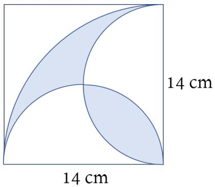

7. Harga tiket suatu kapal wisata berkapasitas 70 kursi adalah Rp650.000,00 untuk orang dewasa dan Rp180.000,00 untuk anak-anak. Jika uang hasil penjualan tiket suatu perjalanan wisata adalah Rp18.240.000,00, berapakah banyak orang dewasa dan anak-anak yang mungkin dalam kapal tersebut? 

8. Umur Pak Jojo 4 kali umur anaknya. Enam tahun mendatang, umur Pak Jojo menjadi 3 kali umur anaknya. Berapa umur Pak Jojo sekarang? 

9. Seekor kambing dapat menghabiskan rumput di suatu lapangan dalam waktu 4 minggu. Jika seekor sapi mampu menghabiskan rumput di lapangan yang sama dalam waktu 3 minggu, maka berapa lama rumput akan habis jika kambing dan sapi ditempatkan dalam lapangan itu? 

10. Jika masing-masing huruf mewakili angka yang berbeda, tentukan nilai A, B, dan C dari operasi penjumlahan berikut. 

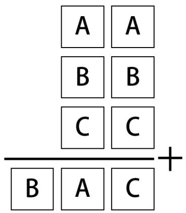

11. Pak Toni memiliki tiga jeriken minyak goreng yang masing-masing berisi 25 liter dengan harga Rp600.000,00 dan menjualnya dengan mengharapkan laba 5% dari harga beli. Beberapa hari kemudian, harga minyak goreng turun dan Pak Toni terpaksa harus menjual sisa persediaan minyak goreng sebanyak 21 liter dengan harga Rp7.400,00/liter. Berapa persen keuntungan/kerugian Pak Toni setelah semua minyak goreng itu terjual habis? 

12. Rata-rata usia buruh di suatu pabrik adalah 36 tahun. Rata-rata usia buruh laki-lakinya 40 tahun, sedangkan buruh perempuan 30 tahun. Berapakah perbandingan banyaknya buruh laki-laki dan buruh perempuan di pabrik itu? 

## Kunjungi mathcyber1997.com untuk mendapatkan arsip soal lainnya