## Arsip Soal OSN Matematika SD/MI Tingkat Provinsi Tahun 2016

Diunduh melalui situs mathcyber1997.com 

## I. Bagian Tes 1

1. Persegi panjang ABCD mempunyai ukuran AB = 12 cm, BC = 5 cm, dan titik E terletak pada diagonal AC. Jika BE tegak lurus AC, maka panjang BE adalah · · · cm. 

2. Suatu bilangan bulat positif bila dibagi 7 bersisa 2 dan dibagi 8 bersisa 3. Bilangan bulat positif terkecil yang memenuhi adalah · · · · 

3. Terdapat dua larutan berbeda dengan volume sama. Larutan I adalah larutan gula dengan rasio gula dan airnya 2 : 5, sedangkan larutan II adalah larutan garam dengan rasio garam dan airnya 3 : 11. Jika kedua larutan dicampurkan, maka rasio kandungan gula dan garam hasil pencampuran adalah · · · · 

4. Lima orang duduk berjajar. Bila di antara mereka ada Romi dan Yuli yang ingin selalu berdampingan dan Loni yang ingin selalu duduk di posisi pinggir, maka banyaknya kemungkinan posisi duduk mereka berlima adalah · · · · 

5. Bila 20% uang Aiko sama dengan $\frac 1 8$ uang Mahatma, maka perbandingan uang Aiko dan uang Mahatma adalah · · · · 

6. Perhatikan empat gambar bangun datar berikut. 

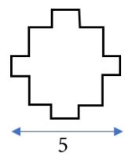

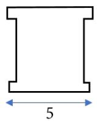

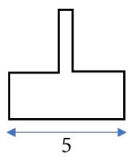

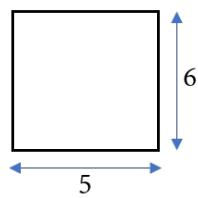

Keempat bangun datar itu memiliki panjang dan lebar yang sama, yaitu masing-masing 6 dan 5 satuan. Bangun datar yang memiliki keliling paling besar adalah · · · · 

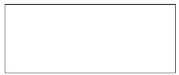

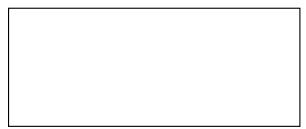

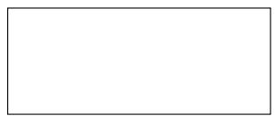

7. Tahun kabisat kelipatan 5 pada rentang waktu 65 tahun sebanyak-banyaknya ada · · · · 

8. Bilangan tiga digit abc memenuhi $a + c = b .$ Jika $a < c ,$ maka bilangan abc terbesar adalah · · · · 

9. Titik A, B, C, D, dan E terletak pada suatu garis lurus. Jika panjang AB sama dengan 4 kali panjang BD, panjang CE sama dengan 5 kali panjang ED, panjang BC sama dengan 2 kali panjang BD, dan AD adalah ruas garis terpanjang, maka perbandingan panjang AE dan BC adalah · · · · 

10. Nadia memiliki dua rok. Jika setiap hari dalam seminggu Nadia menggunakan kombinasi rok dan baju yang berbeda, maka banyaknya baju yang harus dimiliki Nadia paling sedikit adalah · · · · 

11. Keran A dan B digunakan untuk mengisi suatu bak air. Keran A dapat mengisi penuh bak air dalam waktu 5 jam, sedangkan keran B memerlukan waktu 8 jam. Suatu hari pada pukul 07.00, keran A dan B digunakan bersamaan untuk mengisi bak air itu. Ternyata pada pukul 08.00 keran B rusak dan segera diperbaiki. Saat keran B diperbaiki, hanya keran A yang digunakan untuk mengisi bak. Pada pukul 09.00, keran B digunakan kembali untuk mengisi bak air. Jika pengisian bak air dilakukan hingga pukul 10.00, maka bak telah terisi air sebanyak · · · bagian. 

12. Dominggus lahir pada tanggal 29 Februari 2008. Apabila dia selalu merayakan ulang tahunnya hanya di tanggal tersebut, maka sampai tahun 2070 Dominggus merayakannya sebanyak · · · kali. 

13. Rata-rata dari lima bilangan adalah 85. Jika bilangan pertama dan kelima ditambah 5, bilangan kedua ditambah 10, bilangan ketiga dikurang 3, dan bilangan keempat dikurang 2, maka selisih rata-rata lima bilangan yang baru dengan rata-rata semula adalah · · · · 

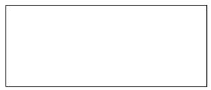

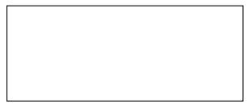

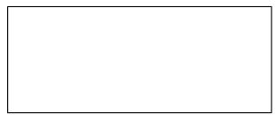

14. Diketahui peta jalan sebagai berikut. 

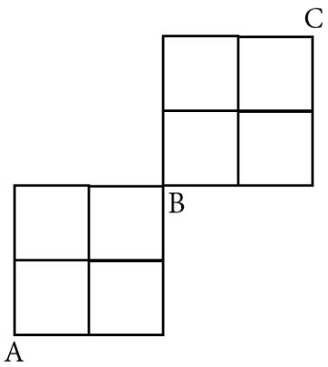

Bila semua ruas jalan panjangnya sama, maka banyaknya lintasan terpendek dari A ke C adalah · · · · 

15. Misal a, b, c adalah tiga angka berbeda yang tidak sama dengan nol. Selisih terbesar dari dua bilangan tiga angka abc dan bca adalah · · · · 

16. Sudirman akan meletakkan angka 1, 2, 3, 4, dan 5 ke dalam kotak-kotak berikut sehingga setiap angka yang berurutan adalah sama. Jumlah bilangan-bilangan yang disusun tersebut adalah · · · · 

<table><tr><td></td><td></td><td></td><td></td><td></td><td></td><td></td><td></td><td></td><td></td><td></td></tr></table>

17. Andi menekan tombol bilangan tiga angka pada kalkulator, lalu berturut-turut menekan tombol berikut. 

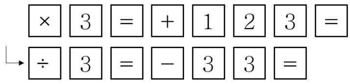

Hasil akhir pada perhitungan kalkulator tertera bjlangan tiga angka juga. Selisih terkecil antara bilangan semula dan akhir yang tertera pada layar kalkulator adalah · · · · 

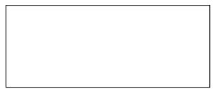

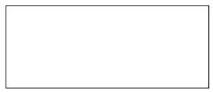

18. Data jumlah penduduk Desa Jayamukti sebagai berikut. 

1. Anak-anak 20% persen lebih banyak dari penduduk dewasa. 

2. Di antara anak-anak, anak laki-laki 10% lebih banyak. 

3. Di antara penduduk dewasa, wanita 15% lebih banyak. 

4. Jumlah penduduk Desa Jayamukti lebih dari 9.000 orang, tetapi kurang dari 10.000 orang. 

Berdasarkan 4 poin informasi di atas, jumlah penduduk Desa Jayamukti adalah · · · orang. 

## II. Bagian Tes 2

1. Suatu rapat dihadiri oleh 30 orang, 60% di antaranya laki-laki. Setelah beberapa perempuan masuk menjadi peserta baru rapat tersebut, banyaknya laki-laki yang menjadi peserta rapat adalah 40% dari keseluruhan peserta. Berapakah banyak peserta perempuan yang mengikuti rapat tersebut mula-mula? 

2. Perhatikan persegi ABCD di bawah ini. Semua garis horizontal dan vertikal saling sejajar. 

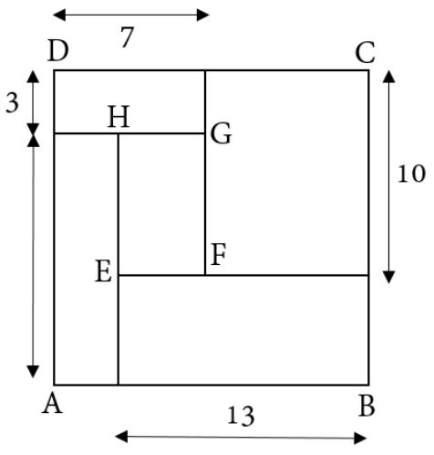

Tentukan luas EF GH. 

3. Dalam sebuah wadah terdapat sejumlah mangga dan jeruk. Budi mengambil 20 buah yang terdiri dari jeruk dan mangga dari wadah itu. Sesudah diambil, $\frac 3 4$ bagian dari keseluruhan. Jika jeruk yang tersisa dalam wadah adalah 33 buah, maka berapa banyak buah mangga yang diambil Budi? 

4. Pada gambar berikut, panjang $A B = B C = A D = D C$ . Berapakah besar sudut CAD? 

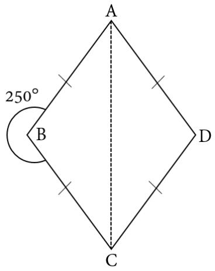

5. Jarak kota A dan B adalah 190 km. Joko mulai mengendarai sepeda motor meninggalkan kota A menuju kota B pada pukul 07.00. Dia menempuh perjalanan dengan kecepatan 75 km/jam untuk menempuh jarak 50 km pertama. Agar Joko tiba di kota B pada pukul 10.00, maka berapakah kecepatan mengemudi Joko dalam satuan km/jam untuk menempuh sisa perjalanan ke kota B? 

6. Sekelompok anak sedang berbaris satu-satu sambil bergerak maju. Jarak anak terdepan dengan terbelakang adalau 60 meter. Anak terbelakang akan menyerahkan benderanya kepada anak terdepan. Ia berlari ke depan untuk menyerahkan bendera dan langsung berlari lagi ke posisi semula. Jika kecepatan bergeraknya barisan adalah 1 meter/detik dan kecepatan anak berlari adalah 5 meter/detik, berapa meterkah barisan telah bergerak saat anak tersebut kembali ke posisi semula? 

7. Waktu di Jayapura lebih awal dibandingkan waktu di Jakarta. Jika di Jakarta pukul 23.00 WIB, maka di Jayapura pukul 01.00 WIT. Pesawat terbang memerlukan waktu 7 jam 24 menit dari Jakarta ke Jayapura, begitu juga sebaliknya. Pesawat pertama terbang dari Jakarta ke Jayapura pada pukul 09.16 WIB dan pesawat kedua terbang dari Jayapura ke Jakarta pada pukul 10.52 WIT. Pukul berapa dalam WIB kedua pesawat berjarak sama dari kota Jayapura? 

8. Pada gambar berikut, luas jajar genjang ABCD adalah $7 6 8 ~ \mathrm { c m ^ { 2 } }$ . Jika luas trapesium ABED sama dengan $\frac 3 4$ dari luas jajar genjang ABCD, maka berapakah panjang DE? 

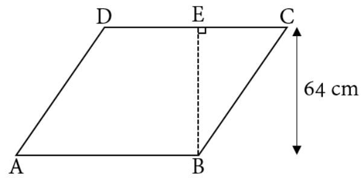

Kunjungi mathcyber1997.com untuk mendapatkan arsip soal lainnya 