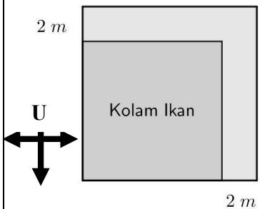
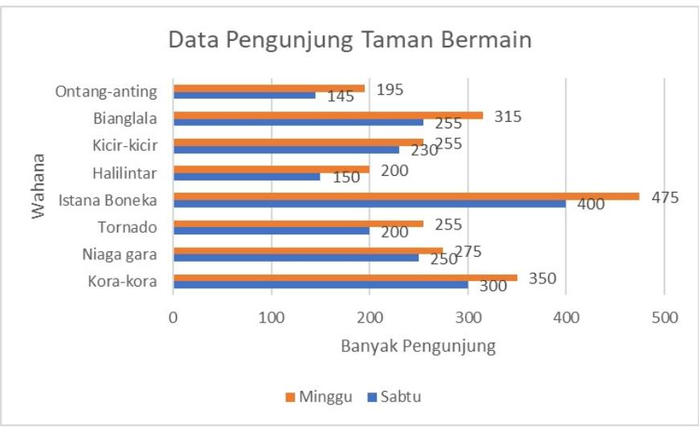

<table><tr><td>No</td><td colspan="7">SOAL</td></tr><tr><td>1</td><td colspan="7">Alfian menjual sepeda motor bekas dengan harga dua kali lipat dari harga belinya. Sebelum menjual ia telah mengeluarkan biaya sebesar 60% dari harga belinya untuk memperbaiki dan menambah aksesoris pada sepeda motor tersebut. Jika biaya perbaikan dan penambahan aksesoris sebesar Rp1.650.000,00, maka keuntungan yang diperoleh Alfian adalah ... rupiah.Petunjuk penulisan jawaban:(1) nominal uang tuliskan bilangannya saja tanpa tanda baca, (2) bentuk akar (misal <eq>\sqrt{2}</eq>) tulis akar(2), (3) bilangan desimal gunakan tanda koma contoh 2,75 (4) bentuk perbandingan gunakan tanda titik dua misal 2:3</td></tr><tr><td>2</td><td colspan="7">Bu Linda membuat suatu permainan yang disebut Berpindah Bernilai. Permainan tersebut memiliki aturan sebagai berikut:a. hanya bisa berpindah maju, geser ke kiri atau berputar pada posisinya;b. maju 1 petak bernilai 10;c. geser ke kiri 1 petak bernilai -10;d. berputar t derajat searah putaran jarum jam bernilai – t dengan t bilangan positif dan tidak melebihi 360;e. berputar t derajat berlawanan arah putaran jarum jam bernilai t dengan t bilangan positif dan tidak melebihi 360;f. nilai permainan sama dengan jumlah seluruh nilai langkah atau berputar.Bu Linda meminta siswa-siswanya memainkan permainan Berpindah Bernilai sehingga boneka A (menghadap Utara) berpindah menuju dan menjadi boneka C (menghadap Timur).Aisyah mencoba permainan tersebut dengan melakukan perpindahan atau berputar dengan urutan sebagai berikut: (1) berputar searah jarum jam, (2) maju 4 petak, (3) berputar searah jarum jam, (4) maju 2 petak, (5) berputar berlawanan arah putar jarum jam. Nilai permainan yang diperoleh Aisyah adalah ....Petunjuk penulisan jawaban:(1) nominal uang tuliskan bilangannya saja tanpa tanda baca, (2) bentuk akar (misal <eq>\sqrt{2}</eq>) tulis akar(2), (3) bilangan desimal gunakan tanda koma contoh 2,75 (4) bentuk perbandingan gunakan tanda titik dua misal 2:3</td></tr><tr><td rowspan="8">3</td><td colspan="7">Ari mencari kata KAKAK yang ada pada petak 7 × 7 berikut.</td></tr><tr><td>K</td><td>A</td><td>K</td><td>A</td><td>K</td><td>A</td><td>K</td></tr><tr><td>A</td><td>K</td><td>A</td><td>K</td><td>A</td><td>K</td><td>A</td></tr><tr><td>K</td><td>A</td><td>K</td><td>A</td><td>K</td><td>A</td><td>K</td></tr><tr><td>A</td><td>K</td><td>A</td><td>K</td><td>A</td><td>K</td><td>A</td></tr><tr><td>K</td><td>A</td><td>K</td><td>A</td><td>K</td><td>A</td><td>K</td></tr><tr><td>A</td><td>K</td><td>A</td><td>K</td><td>A</td><td>K</td><td>A</td></tr><tr><td>K</td><td>A</td><td>K</td><td>A</td><td>K</td><td>A</td><td>K</td></tr><tr><td>4</td><td colspan="7">Diketahui operasi bilangan a ⊕ b = max{a, b}, dengan max{a, b} menyatakan bilangan terbesar antara a dan b. Jika 3 ⊕ (-x) = 5 , maka nilai x adalah ....Petunjuk penulisan jawaban: (1) nominal uang tuliskan bilangannya saja tanpa tanda baca, (2) bentuk akar (misal <eq>\sqrt{2}</eq>) tulis akar(2), (3) bilangan desimal gunakan tanda koma contoh 2,75 (4) bentuk perbandingan gunakan tanda titik dua misal 2:3</td></tr><tr><td>5</td><td colspan="5">Diketahui lingkaran dengan pusat O berjari-jari 5 cm. Titik A dan B pada lingkaran sehingga jarak A dan B adalah 8 cm. Jika titik C pada lingkaran dengan panjang AC sama dengan panjang BC, maka luas segitiga ABC terbesar adalah ... cm2.Petunjuk penulisan jawaban: (1) nominal uang tuliskan bilangannya saja tanpa tanda baca, (2) bentuk akar (misal <eq>\sqrt{2}</eq>) tulis akar(2), (3) bilangan desimal gunakan tanda koma contoh 2,75 (4) bentuk perbandingan gunakan tanda titik dua misal 2:3</td><td></td><td></td></tr><tr><td>6</td><td colspan="2">Banyak bilangan tiga digit yang habis dibagi 4 dan habis dibagi 6 tetapi tidak habis dibagi 30 adalah ....Petunjuk penulisan jawaban: (1) nominal uang tuliskan bilangannya saja tanpa tanda baca, (2) bentuk akar (misal <eq>\sqrt{2}</eq>) tulis akar(2), (3) bilangan desimal gunakan tanda koma contoh 2,75 (4) bentuk perbandingan gunakan tanda titik dua misal 2:3</td><td></td><td></td><td></td><td></td><td></td></tr><tr><td>7</td><td colspan="2">Misalkan a = <eq>2^{5} \times 3^{3}</eq> dan b = <eq>3^{4} \times 5^{2}</eq>. Banyak faktor positif dari a × b yang habis dibagi 6 adalah ....Petunjuk penulisan jawaban: (1) nominal uang tuliskan bilangannya saja tanpa tanda baca, (2) bentuk akar (misal <eq>\sqrt{2}</eq>) tulis akar(2), (3) bilangan desimal gunakan tanda koma contoh 2,75 (4) bentuk perbandingan gunakan tanda titik dua misal 2:3</td><td colspan="2">Kata KAKAK yang dicari hanya pada garis mendatar (boleh dari kanan ke kiri atau sebaliknya) atau tegak (boleh dari atas ke bawah atau sebaliknya). Paling banyak kata KAKAK yang bisa diperoleh Ari adalah ....Petunjuk penulisan jawaban: (1) nominal uang tuliskan bilangannya saja tanpa tanda baca, (2) bentuk akar (misal <eq>\sqrt{2}</eq>) tulis akar(2), (3) bilangan desimal gunakan tanda koma contoh 2,75 (4) bentuk perbandingan gunakan tanda titik dua misal 2:3</td><td></td><td></td><td></td></tr><tr><td rowspan="7">8</td><td colspan="6">Anita membuka toko online yang menjual berbagai jenis pakaian. Setiap pembelian berikutnya dari barang yang sama diberi potongan harga 2% dari harga sebelumnya untuk barang dengan harga lebih dari Rp100.000 dan potongan 1% untuk harga Rp100.000 atau kurang. Tabel berikut adalah data pembelian seorang pelanggan dengan nama akun @juriosnsd23:</td><td></td></tr><tr><td rowspan="2">Nama Barang</td><td rowspan="2">Harga satuan (Rp)</td><td colspan="4">Banyak Pembelian</td><td></td></tr><tr><td>Ke 1</td><td>Ke 2</td><td>Ke 3</td><td>Ke 4</td><td></td></tr><tr><td>Kemeja</td><td>150.000</td><td>2</td><td>2</td><td></td><td></td><td></td></tr><tr><td>Celana Panjang</td><td>175.000</td><td></td><td>2</td><td>2</td><td></td><td></td></tr><tr><td>Celana Pendek</td><td>60.000</td><td></td><td></td><td>1</td><td>1</td><td></td></tr><tr><td colspan="6">Jumlah uang yang diterima Anita dari akun @juriosnsd23 adalah ... rupiah.Petunjuk penulisan jawaban:(1) nominal uang tuliskan bilangannya saja tanpa tanda baca, (2) bentuk akar (misal <eq>\sqrt{2}</eq>) tulis akar(2), (3) bilangan desimal gunakan tanda koma contoh 2,75 (4) bentuk perbandingan gunakan tanda titik dua misal 2:3</td><td></td></tr><tr><td>9</td><td colspan="7">Jarak kota Palu ke kota Poso adalah 180 km. Jarak tersebut jika ditempuh dengan kendaraan umum ternyata lebih lambat 2 jam daripada jika ditempuh dengan kendaraan pribadi. Jika kecepatan rata-rata kendaraan umum 32 km/jam lebih lambat dari kecepatan rata-rata kendaraan pribadi, maka perbandingan kecepatan rata-rata kendaraan umum dan kendaraan pribadi adalah ... (tuliskan jawaban dalam bentuk a:b yang paling sederhana).Petunjuk penulisan jawaban:(1) nominal uang tuliskan bilangannya saja tanpa tanda baca, (2) bentuk akar (misal <eq>\sqrt{2}</eq>) tulis akar(2), (3) bilangan desimal gunakan tanda koma contoh 2,75 (4) bentuk perbandingan gunakan tanda titik dua misal 2:3</td></tr><tr><td>10</td><td colspan="5">Diketahui segitiga ABC dengan titik tengah masing-masing sisinya adalah P, Q, dan R. Banyak segitiga yang dapat dibentuk dari titik-titik A, B, C, P, Q, dan R adalah ....Petunjuk penulisan jawaban:(1) nominal uang tuliskan bilangannya saja tanpa tanda baca, (2) bentuk akar (misal <eq>\sqrt{2}</eq>) tulis akar(2), (3) bilangan desimal gunakan tanda koma contoh 2,75 (4) bentuk perbandingan gunakan tanda titik dua misal 2:3</td><td></td><td></td></tr><tr><td>11</td><td colspan="6">Diketahui dua bilangan yang merupakan faktor dari 192. Jika selisih dua bilangan tersebut adalah 16, dan selisih hasil bagi 192 dengan masing-masing bilangan tersebut adalah 2, maka jumlah dua bilangan tersebut adalah ....</td><td></td></tr></table>

<table><tr><td></td><td colspan="4">Petunjuk penulisan jawaban:(1) nominal uang tuliskan bilangannya saja tanpa tanda baca,(2) bentuk akar (misal <eq>\sqrt{2}</eq>) tulis akar(2),(3) bilangan desimal gunakan tanda koma contoh 2,75(4) bentuk perbandingan gunakan tanda titik dua misal 2:3</td></tr><tr><td>12</td><td colspan="4"> Pak Amir memiliki kolam ikan berbentuk persegi yang diperluas ke arah Timur dan Utara sejauh 2 meter seperti gambar di samping.Jika luas kolam ikan Pak Amir bertambah 44% dari luas semula,maka luas kolam ikan semula adalah ... m2.Petunjuk penulisan jawaban:(1) nominal uang tuliskan bilangannya saja tanpa tanda baca, (2) bentuk akar (misal <eq>\sqrt{2}</eq>) tulis akar(2),(3) bilangan desimal gunakan tanda koma contoh 2,75 (4) bentuk perbandingan gunakan tanda titik dua misal 2:3</td></tr><tr><td rowspan="6">13</td><td colspan="4">Luki bersepeda dari pos A ke pos D melalui pos B dan pos C tanpa berhenti. Data jarak, waktu tempuh, dan kecepatan rata-rata pada tiap trayek disajikan dalam tabel berikut:</td></tr><tr><td>Trayek</td><td>Jarak (km)</td><td>Waktu tempuh (menit)</td><td>Kecepatan rata-rata (km/jam)</td></tr><tr><td>A ke B</td><td>5,25</td><td>X</td><td>21</td></tr><tr><td>B ke C</td><td>6,4</td><td>32</td><td>Y</td></tr><tr><td>C ke D</td><td>Z</td><td>13</td><td>18</td></tr><tr><td colspan="4">Kecepatan rata-rata Luki bersepeda dari pos A ke pos D adalah ... km/jam.Petunjuk penulisan jawaban:(1) nominal uang tuliskan bilangannya saja tanpa tanda baca, (2) bentuk akar (misal <eq>\sqrt{2}</eq>) tulis akar(2),(3) bilangan desimal gunakan tanda koma contoh 2,75 (4) bentuk perbandingan gunakan tanda titik dua misal 2:3</td></tr><tr><td>15</td><td colspan="3">Masing-masing bidang sisi suatu balok memiliki luas 12, 36, dan 48 cm2. Panjang diagonal ruang balok tersebut adalah ... cm.Petunjuk penulisan jawaban:(1) nominal uang tuliskan bilangannya saja tanpa tanda baca, (2) bentuk akar (misal <eq>\sqrt{2}</eq>) tulis akar(2), (3) bilangan desimal gunakan tanda koma contoh 2,75 (4) bentuk perbandingan gunakan tanda titik dua misal 2:3</td><td></td></tr><tr><td rowspan="5">16</td><td colspan="3">Perhatikan tabel berikut:</td><td></td></tr><tr><td>Kelompok</td><td>Banyak Anggota</td><td>Rata-rata Tinggi Badan (cm)</td><td></td></tr><tr><td>A</td><td>4</td><td>134</td><td></td></tr><tr><td>B</td><td>6</td><td>128</td><td></td></tr><tr><td colspan="3">Seorang anak dari kelompok A dan seorang anak dari kelompok B bertukar posisi kelompok sehingga rata-rata tinggi badan kedua kelompok tersebut berbeda 1 cm. Jika tinggi badan (dalam cm) setiap anak adalah bilangan bulat, maka selisih tinggi badan kedua anak yang bertukar posisi kelompok tersebut adalah ... cm.Petunjuk penulisan jawaban:(1) nominal uang tuliskan bilangannya saja tanpa tanda baca, (2) bentuk akar (misal <eq>\sqrt{2}</eq>) tulis akar(2), (3) bilangan desimal gunakan tanda koma contoh 2,75 (4) bentuk perbandingan gunakan tanda titik dua misal 2 : 3</td><td></td></tr><tr><td>17</td><td colspan="3">Faktor terbesar dari 2023 yang kurang dari 2023 adalah ....Petunjuk penulisan jawaban:(1) nominal uang tuliskan bilangannya saja tanpa tanda baca, (2) bentuk akar (misal <eq>\sqrt{2}</eq>) tulis akar(2), (3) bilangan desimal gunakan tanda koma contoh 2,75 (4) bentuk perbandingan gunakan tanda titik dua misal 2:3</td><td></td></tr><tr><td>[18]</td><td colspan="4">Petak-petak A,B,C,D,E,F,G,H,I, dan J pada gambar di samping akan diisi dengan bilangan cacah berbeda sehingga jumlah bilangan dari petak-petak yang segaris adalah 19. Jika petak D diisi bilangan 7 dan petak-petak yang lain diisi bilangan yang kurang dari 10, maka jumlah minimum dari bilangan pada petak A,B, dan C adalah ....Petunjuk penulisan jawaban:(1) nominal uang tuliskan bilangannya saja tanpa tanda baca, (2) bentuk akar (misal <eq>\sqrt{2}</eq>) tulis akar(2), (3) bilangan desimal gunakan tanda koma contoh 2,75 (4) bentuk perbandingan gunakan tanda titik dua misal 2:3</td></tr></table>

Data pengunjung suatu taman bermain untuk setiap wahana pada hari Sabtu dan Minggu disajikan dalam diagram di samping. 

Persentase kenaikan tertinggi jumlah pengunjung terjadi pada wahana …. 

Petunjuk penulisan 

jawaban: (1) nominal uang tuliskan bilangannya saja tanpa tanda baca, (2) bentuk akar (misal √2) tulis akar(2), (3) bilangan desimal gunakan tanda koma contoh 2,75 (4) bentuk perbandingan gunakan tanda titik dua misal 2:3 

20 

Perhatikan petak 4  4 yang berisi angka-angka berikut. 

<table><tr><td>1</td><td>2</td><td>5</td><td>9</td></tr><tr><td>5</td><td>4</td><td>5</td><td>3</td></tr><tr><td>7</td><td>6</td><td>0</td><td>9</td></tr><tr><td>1</td><td>7</td><td>3</td><td>5</td></tr></table>

Contoh 3 petak bersisian ditandai dengan warna kuning. Contoh petak yang tidak bersisian ditandai dengan warna biru 

Aris mewarnai 3 petak yang saling bersisian (memiliki dua pasang petak yang sisinya berimpit) sehingga membentuk bilangan ratusan yang habis dibagi 4. Banyak susunan berbeda yang dapat dibuat oleh Aris adalah …. 

<table><tr><td>1</td><td>2</td><td>5</td><td>9</td></tr><tr><td>5</td><td>4</td><td>5</td><td>3</td></tr><tr><td>7</td><td>6</td><td>0</td><td>9</td></tr><tr><td>1</td><td>7</td><td>3</td><td>5</td></tr></table>

Petunjuk penulisan jawaban: (1) nominal uang tuliskan bilangannya saja tanpa tanda baca, (2) bentuk akar (misal √2) tulis akar(2), (3) bilangan desimal gunakan tanda koma contoh 2,75 (4) bentuk perbandingan gunakan tanda titik dua misal 2:3 

3 