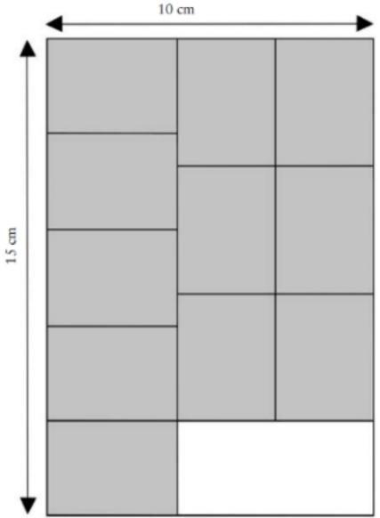
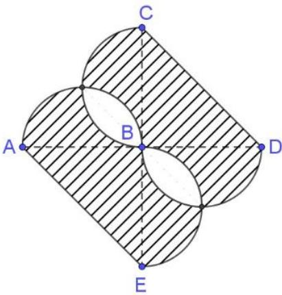
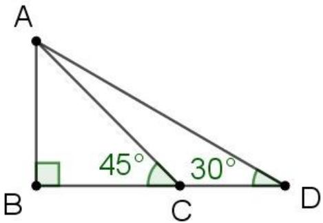
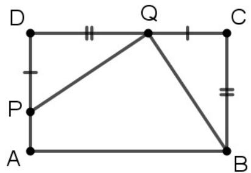
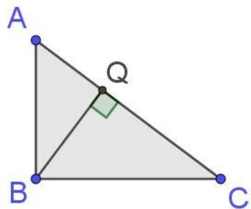
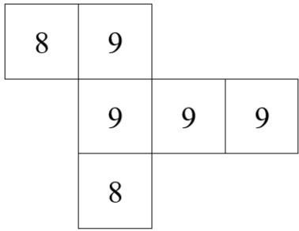
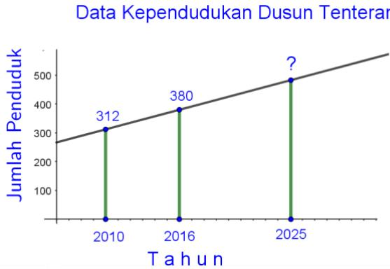

<table><tr><td>No</td><td colspan="6">Soal</td></tr><tr><td>1</td><td colspan="6">Jika <eq>3^{n}</eq> adalah faktor dari <eq>18^{10}</eq>, maka bilangan bulat terbesar <eq>n</eq> yang mungkin adalah ....</td></tr><tr><td>2</td><td colspan="6">Diketahui Faktor Persekutuan Terbesar dari <eq>a</eq> dan 2024 serta <eq>a</eq> dan 2025 terletak antara 10 dan 20. Nilai <eq>a</eq> terkecil yang mungkin adalah ....</td></tr><tr><td>3</td><td colspan="6">Bilangan 2024 dapat dinyatakan sebagai jumlah dari <eq>n</eq> bilangan kuadrat berbeda. Sebagai contoh 2024 dapat dinyatakan sebagai jumlah dari 3 bilangan kuadrat berbeda yaitu <eq>2024 = 2^{2} + 24^{2} + 38^{2}</eq>. Nilai <eq>n</eq> terbesar yang mungkin adalah ....</td></tr><tr><td>4</td><td colspan="6">Jika bilangan lima digit <eq>a679b</eq> habis dibagi 72, maka bilangan tersebut adalah ....</td></tr><tr><td>5</td><td colspan="6">Sebelas (11) persegi panjang kecil ukuran sama ditempel pada kertas berbentuk persegi panjang dengan ukuran <eq>10 \times 15</eq> seperti tampak pada gambar. Luas daerah persegi panjang yang tidak ditempel adalah ....</td></tr><tr><td>6</td><td colspan="6">Perhatikan gambar di bawah ini.Busur AB, BE, BD dan BC adalah setengah lingkaran dengan diameter 10 cm, maka luas daerah yang diarsir adalah ....</td></tr><tr><td>7</td><td colspan="6">Perhatikan gambar di atas. Jika diketahui luas segitiga ABC adalah 578 satuan luas, maka panjang AD adalah ... satuan panjang.</td></tr><tr><td>8</td><td colspan="6">Diketahui ABCD persegi panjang dengan luas 36, Jika BC = DQ, DP = CQ, dan luas ABCD : luas ABQP = 3:2, maka luas daerah ABQP adalah ... cm2.</td></tr><tr><td>9</td><td colspan="6">Segitiga ABC siku-siku di B, perbandingan sisi AB:BC = 3:4. BQ tegak lurus AC. Perbandingan luas segitiga BCQ dan ABQ adalah ....</td></tr><tr><td>10</td><td colspan="6">Perhatikan gambar jaring-jaring kubus berikut.Apabila jaring-jaring kubus di atas dibentuk menjadi kubus dan bilangan pada sisi yang saling berhadapan dijumlahkan, maka banyak pasangan bilangan yang jumlahnya sama adalah ... pasang.</td></tr><tr><td>11</td><td colspan="6">Let abc is a three digits number, both of ab and bc are two digits numbers. If abc = 2 × (ab + bc), then abc is ....</td></tr><tr><td>12</td><td colspan="6">Pak Raden berniat membagikan uang senilai 7.995 juta rupiah kepada seorang istri, 5 orang putra dan 4 orang putri. Jika setiap anak laki-laki menerima tiga kali dari bagian setiap anak perempuan, dan setiap anak perempuan menerima dua kali dari bagian istri pak Raden, maka uang yang diterima istri pak Raden sebesar ... rupiah.</td></tr><tr><td rowspan="7">13</td><td colspan="6">Pak Adi memiliki tiga kantin sekolah. Tabel berikut adalah hasil keuntungan Pak Adi dari hari Senin sampai dengan hari Jumat.</td></tr><tr><td colspan="6">Keuntungan Hari -</td></tr><tr><td>Kantin</td><td>Senin</td><td>Selasa</td><td>Rabu</td><td>Kamis</td><td>Jumat</td></tr><tr><td>A</td><td>160.000</td><td>165.000</td><td>220.000</td><td>205.000</td><td>250.000</td></tr><tr><td>C</td><td>264.000</td><td>156.000</td><td>186.000</td><td>234.000</td><td>360.000</td></tr><tr><td>B</td><td>285.000</td><td>315.000</td><td>255.000</td><td>330.000</td><td>315.000</td></tr><tr><td colspan="6">Jika pada hari Sabtu masing-masing kantin mendapat keuntungan 25% dari keuntungan pada 5 hari sebelumnya, maka persentase keuntungan hari Sabtu dari total keuntungan selama 6 hari adalah ... %</td></tr><tr><td rowspan="5">14</td><td colspan="6">Andi Rahman mengikuti lomba balap sepeda yang menempuh 5 etape. Setiap etape diperoleh data hasil lombanya sebagai berikut. Jarak etape ke tiga adalah ... km.</td></tr><tr><td colspan="2">Etape</td><td>1</td><td>2</td><td>3</td><td>4</td></tr><tr><td colspan="2">Jarak (km)</td><td>100</td><td>145</td><td>a</td><td>150</td></tr><tr><td colspan="2">Rata-rata Kecepatan (km/jam)</td><td>40</td><td>30</td><td>25</td><td>30</td></tr><tr><td colspan="2">Total Waktu Tempuh (menit)</td><td colspan="4">1259</td></tr></table>

<table><tr><td colspan="6">Keuntungan Hari -</td></tr><tr><td>Kantin</td><td>Senin</td><td>Selasa</td><td>Rabu</td><td>Kamis</td><td>Jumat</td></tr><tr><td>A</td><td>160.000</td><td>165.000</td><td>220.000</td><td>205.000</td><td>250.000</td></tr><tr><td>C</td><td>264.000</td><td>156.000</td><td>186.000</td><td>234.000</td><td>360.000</td></tr><tr><td>B</td><td>285.000</td><td>315.000</td><td>255.000</td><td>330.000</td><td>315.000</td></tr></table>

<table><tr><td>Etape</td><td>1</td><td>2</td><td>3</td><td>4</td><td>5</td></tr><tr><td>Jarak (km)</td><td>100</td><td>145</td><td>a</td><td>150</td><td>130</td></tr><tr><td>Rata-rata Kecepatan (km/jam)</td><td>40</td><td>30</td><td>25</td><td>30</td><td>40</td></tr><tr><td>Total Waktu Tempuh (menit)</td><td colspan="5">1259</td></tr></table>

<table><tr><td rowspan="9">15</td><td>Persentase siswa yang memperoleh nilai 65, 70, 75, 80, 85 dan 90 dalam latihan tes OSN ditampilkan pada tabel berikut. Jika banyak peserta tes 80 siswa, selisih terkecil banyak siswa dengan nilai berdekatan adalah ....</td></tr><tr><td>Nilai %</td></tr><tr><td>65 10,0 %</td></tr><tr><td>70 20,0 %</td></tr><tr><td>75 27,5 %</td></tr><tr><td>80 25,0 %</td></tr><tr><td>85 12,5 %</td></tr><tr><td>90 5,0 %</td></tr><tr><td>Jumlah 100 %</td></tr><tr><td>16</td><td>Perhatikan Data Kependudukan Dusun Tenteram berikut ini. Bila kecepatan pertambahan penduduk tetap, maka banyak penduduk Dusun Tenteram pada tahun 2025 adalah ... orang.</td></tr></table>

<table><tr><td>Nilai</td><td>%</td></tr><tr><td>65</td><td>10,0 %</td></tr><tr><td>70</td><td>20,0 %</td></tr><tr><td>75</td><td>27,5 %</td></tr><tr><td>80</td><td>25,0 %</td></tr><tr><td>85</td><td>12,5 %</td></tr><tr><td>90</td><td>5,0 %</td></tr><tr><td>Jumlah</td><td>100 %</td></tr></table>

<table><tr><td>17</td><td>Diberikan empat buah bilangan a, b, c, dan d. Rata-rata a dan b adalah 50. Rata-rata b dan c adalah 3/2 dari rata-rata a dan b. Rata-rata c dan d adalah lima kurangnya dari rata-rata b dan c. Rata-rata a dan d adalah ....</td></tr><tr><td>18</td><td>Toko Kue Echo menjual 8 jenis Roti. Anita ingin membeli 5 roti dengan jenis berbeda di toko kue tersebut. Jika Anita sudah menentukan 2 jenis roti yang akan dipilihnya, banyak kemungkinan roti yang dibeli Anita adalah ....</td></tr><tr><td>19</td><td>Tessi memilih lima bilangan berbeda dari 1, 2, 3, 4, 5, 6 dan 7 yang memenuhi:Jumlah kelima bilangan tersebut adalah ganjilJumlah bilangan tersebut merupakan faktor dari hasil kali bilangan-bilangan yang dipilihBanyak bilangan yang mungkin dipilih oleh Tessi adalah ....</td></tr><tr><td>20</td><td>Bilangan a,b, dan c merupakan bilangan prima kurang dari 10. Bilangan-bilangan hasil perkalian <eq>a \times b \times c</eq> yang kelipatan 7 ada sebanyak ....</td></tr></table>