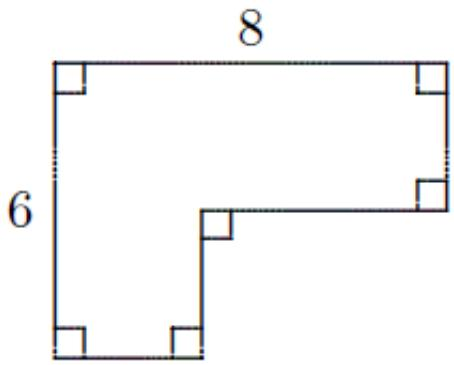
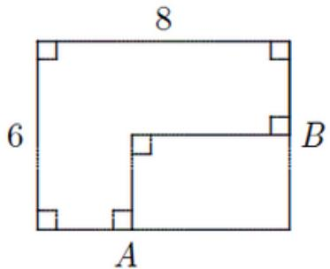
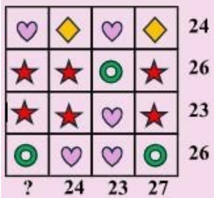
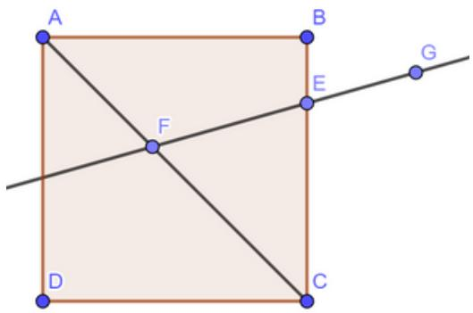
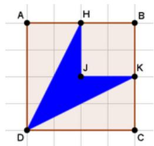
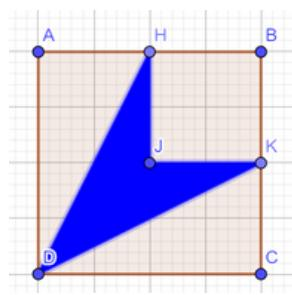
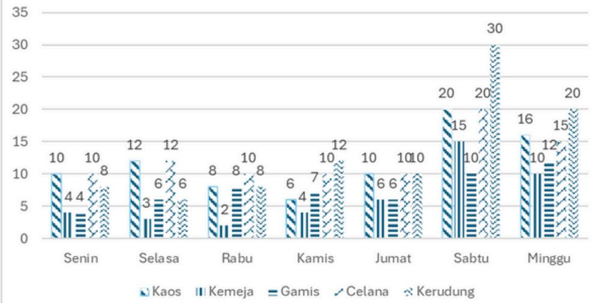

## OSN MATEMATIKA

OSN TINGKAT PROVINSI 

## Soal OSN Provinsi Matematika

## Soal Uraian

1. Jika hasil penjumlah bilangan pada setiap baris, kolom maupun diagonal adalah sama, maka bilangan pengganti x adalah .... 

<table><tr><td></td><td></td><td></td></tr><tr><td>23</td><td>20</td><td>17</td></tr><tr><td>15</td><td></td><td>x</td></tr></table>

## Jawaban: 18

23+20+17=60, maka hasil penjumlahannya adalah 60. Misal 15+20+y=60 maka y=25 maka x+17+25=60 jadi x=18 

2. Pada awal pendirian klub penggemar badminton terdiri atas 15 anak laki-laki dan 20 anak perempuan. Klub ini mampu menarik minat anak-anak lain untuk bergabung. sehingga setiap bulan, 1 anak perempuan baru dan 2 anak laki-laki baru bergabung ke klub. Setelah beberapa waktu jumlah anak laki-laki di klub sama dengan jumlah anak perempuan, sehingga anggota klub di waktu tersebut adalah .... 

## Jawaban : 50

Dalam lima bulan, akan ada 5 anak perempuan dan 10 anak laki-laki lagi di klub. Pada saat itu, akan ada 25 anak laki-laki dan 25 anak perempuan secara keseluruhan. Akan ada $25 + 25 = 50$ anak di klub 

3. Sebuah pesawat berangkat dari kota A pada hari Sabtu pukul 08.20 waktu setempat. Pesawat tersebut tiba di kota B pada hari Minggu pukul 06.35 waktu setempat. Waktu tempuh penerbangan tersebut adalah 14 jam 15 menit. Perbedaan waktu antara kota A dan kota B adalah... jam 

## Jawab : 8

$$
0 8. 2 0 + 1 4. 1 5 = 2 2. 3 5
$$

Perbedaan waktu: 22.35 + x = 06.35 x = 8 jam 

## Soal OSN Provinsi Matematika

4. Keliling bangun di bawah ini adalah ... satuan panjang. 

Jawab : 28

$6+8+6+8=28$

5. Misalkan ABCD adalah bilangan ribuan yang habis dibagi 3. Diketahui pula ABC bilangan ratusan habis dibagi 4 dan AB bilangan puluhan habis dibagi 5. Bilangan ABCD terbesar adalah .... 

## Jawaban : 9567

ABCD adalah bilangan terbesar sehingga pilih A=9. Karena AB habis dibagi 5 maka B=0 atau 5, karena dipilih terbesar maka B=5. Karena ABC habis dibagi 4, maka 5C habis dibagi 4, karena dipilih yang terbesar, maka C=6. Karena ABCD habis dibagi 3, maka 9+5+6+D=20+D habis dibagi 3, karena dipilih terbesar, maka D=7. Sehingga bilangan ABCD yang memenuhi adalah 9567. 

## Soal OSN Provinsi Matematika

6. 

Setiap simbol di atas melambangkan sebuah bilangan. Hasil penjumlahan bilangan-bilangan pada setiap baris dan kolom terlihat di samping kanan dan bawah tabel. Hasil penjumlahan bilangan-bilangan pada kolom pertama adalah .... 

## JAWAB: 25

$$
2 4 + 2 6 + 2 3 + 2 6 = ? + 2 4 + 2 3 + 2 7
$$

$$
2 5 = ?
$$

Lihat baris 2 dan 3 : Donut – hati = 3 

Lihat baris 4 

2 (donut + hati) = 26 Donut + hati = 13 

Donut = 8, hati = 5 

Bintang = (26 - 8)/3 = 18/3 = 6 Kolom 1 = 5 + 6 + 6 + 8 = 25 

7. Misalkan $A = \frac{3}{2} + \frac{4}{3} + \frac{5}{4} \cdots + \frac{2026}{2025}$ dan $B = \frac{1}{2} + \frac{1}{3} + \frac{1}{4} \cdots + \frac{1}{2025}$ maka hasil dari 2026 + A - (2025 + B) adalah.... 

## Jawab: 2025

Perhatikan bahwa 2026 + A - 2025 - B = 2026 + $\frac{3}{2}$ + $\frac{4}{3}$ + $\frac{5}{4}$ ... + $\frac{2026}{2025}$ - 2025 + 

$$
\frac {1}{2} + \frac {1}{3} + \frac {1}{4} \dots + \frac {1}{2 0 2 5} = 1 + 1 + 1 + \dots + 1 = 2 0 2 5
$$

## Soal OSN Provinsi Matematika

## 8. Perhatikan persegi ABCD berikut:

Jika ∠ AFE = ∠GEC = x° dan ∠EFC = yo maka 3y° - x° adalah ....° 

Jawab : 90° 

$$
\angle A O F = x ^ {\circ} \text {   maka   } y ^ {\circ} = 1 8 0 - x ^ {\circ}
$$

$$
\angle E F C = x ^ {\circ} \text {   maka   } \angle O F C = 1 8 0 - x ^ {\circ} \text {   Pada   } \Delta F O C: \angle F O C + \angle O C F +
$$

$$
\angle O F C = 1 8 0 ^ {\circ}
$$

$$
\Leftrightarrow y ^ {\circ} + 4 5 ^ {\circ} + (1 8 0 ^ {\circ} - x ^ {\circ}) = 1 8 0 ^ {\circ}
$$

$$
\Leftrightarrow (1 8 0 ^ {\circ} - x ^ {\circ}) + 4 5 ^ {\circ} + (1 8 0 ^ {\circ} - x ^ {\circ}) = 1 8 0 ^ {\circ} \Leftrightarrow 4 5 ^ {\circ} + 1 8 0 ^ {\circ} - 2 x ^ {\circ} = 0
$$

$$
\Leftrightarrow 2 x ^ {\circ} = 2 2 5 ^ {\circ} \Leftrightarrow x ^ {\circ} = 1 1 2, 5 ^ {\circ} \text {   maka   } y ^ {\circ} = 1 8 0 ^ {\circ} - x ^ {\circ} = 6 7, 5 ^ {\circ}
$$

Jadi 3yo° - x° = 3(67,5)° - 112,5° = 90° 

## 9. Diketahui ABCD suatu persegi. Jika luas daerah DHJK adalah 9 cm2, maka panjang sisi persegi ABCD adalah ... cm.

Jawab: 6 cm

Misal, HB = a, AB = 2a 

$$
\text { Luas   HBKJ } = a ^ {2}
$$

$$
\text { Luas   DCK } = a ^ {2} \text { Luas   DAH } = a ^ {2} \text { Luas   ABCD } = 4 a ^ {2}
$$

$$
\text { Luas   } \operatorname{arsir} = \text { luas   } A B C D - \text { luas   } (E B F O + D C F + D A E) 9 = 4 a ^ {2} -
$$

$$
(a ^ {2} + a ^ {2} + a ^ {2})
$$

$$
9 = 4 a ^ {2} - 3 a ^ {2}
$$

$$
9 = a ^ {2}
$$

$$
a = 3
$$

Panjang sisi persegi ABCD = 6 cm. 

## Soal OSN Provinsi Matematika

10. Berikut adalah data Penduduk di Kecamatan Tanjung Puri pada bulan Juni Tahun 2025 

<table><tr><td>No</td><td>Kelurahan</td><td>Jumlah Penduduk</td><td>Keterangan</td></tr><tr><td>1</td><td>Bunga Tanjung</td><td>34.592</td><td>50% laki-laki</td></tr><tr><td>2</td><td>Pondok Tanjung</td><td>18.468</td><td>L:P=1:2</td></tr><tr><td>3</td><td>Tanjung Cinta</td><td>14.836</td><td>0,75 bagian peremp uan</td></tr><tr><td>4</td><td>Tanjung Sari</td><td>13.434</td><td><eq>\frac{1}{2}</eq> bagian peremp uan</td></tr><tr><td>5</td><td>TanjungMa laka</td><td>55.76</td><td>L:P=2:3</td></tr><tr><td>6</td><td>Tanjung Jaya</td><td>15.063</td><td>L:P=2:1</td></tr><tr><td>7</td><td>Sabana Tanjung</td><td>34.045</td><td>0,4 bagian laki-laki</td></tr></table>

Keterangan : 

L : Laki-laki, P : Perempuan 

Misalkan A adalah rata-rata jumlah penduduk laki-laki di kecamatan Tanjung Puri. Banyak kelurahan di Kecamatan Tanjung Puri yang jumlah penduduk berjenis kelamin laki-laki kurang dari A adalah ... kelurahan. 

Jawab: 4

<table><tr><td>No</td><td>Kelurahan</td><td>Jumlah Penduduk</td><td>Laki laki</td></tr><tr><td>1</td><td>Bunga Tanjung</td><td>34.592</td><td>1729 6</td></tr><tr><td>2</td><td>Pondok Tanjung</td><td>18.468</td><td>6156</td></tr><tr><td>3</td><td>Tanjung Cinta</td><td>14.836</td><td>3709</td></tr><tr><td>4</td><td>Tanjung Sari</td><td>13.434</td><td>6717</td></tr><tr><td>5</td><td>TanjungMa laka</td><td>55.76</td><td>2230 4</td></tr><tr><td>6</td><td>Tanjung Jaya</td><td>15.063</td><td>1004 2</td></tr><tr><td>7</td><td>Sabana Tanjung</td><td>34.045</td><td>1361 8</td></tr><tr><td></td><td>Jumlah</td><td></td><td>7984 2</td></tr></table>

Rata-rata jumlah penduduk berjenis kelamin laki-laki di Kecamatan Tanjung Puri adalah 79842 : 7 = 11406 jiwa 

Banyak kelurahan yg jumlah penduduk laki-laki kurang dari rata-ratanya adalah 4 kelurahan. 

## Soal OSN Provinsi Matematika

11. Andi, Bardi, Clara, Dora, dan Endang tinggal di RW yang sama. Dua dari mereka tinggal di RT1 dan tiga lainnya tinggal RT2. Dora tinggal di RT yang berbeda dengan Clara dan Endang. Bardi tinggal di RT yang berbeda dengan Andi dan Clara. Yang rumahnya di RT1 adalah..... 

## Jawab: Bardi dan Dora

Karena Clara dan Endang tidak tinggal di RT yang sama dengan Dora, mereka tinggal di RT yang sama. Karena Andi dan Clara tidak tinggal di RT yang sama dengan Bardi, mereka juga tinggal di RT yang sama. Jadi, Clara, Endang, dan Andi tinggal di RT yang sama yaitu RT2. Ini berarti Bardi dan Dora tinggal di RT1 

12. Dua buah dadu warna merah dan biru dilempar bersamaan. Mata dadu yang muncul kemudian dijumlahkan dan dikalikan. Sebagai contoh, misalnya saat pelemparan muncul mata dadu 2 pada dadu merah dan mata dadu 3 pada dadu biru 

$$
2 + 3 = 5
$$

$$
2 \times 3 = 6
$$

Kemudian hasil perkaliannya dikurangkan dengan hasil penjumlahannya sehingga diperoleh sebuah bilangan bulat. 

$$
(2 \times 3) - (2 + 3) = 6 - 5 = 1
$$

Banyaknya pasangan mata dadu yang menghasilkan bilangan kuadrat adalah ... pasang. 

## Jawab : 7 pasang

pasangan dadu yang menghasilkan bilangan kuadrat ada 7 yaitu: 

2 dadu merah dan 2 dadu biru 

2 dadu merah dan 3 dadu biru 

3 dadu merah dan 2 dadu biru 

2 dadu merah dan 6 dadu biru 6 dadu merah dan 2 dadu biru 

3 dadu merah dan 6 dadu biru 6 dadu merah dan 3 dadu biru 

## Soal OSN Provinsi Matematika

13. ROTI dan KEJU melambangkan bilangan ribuan. Tiap huruf R, O, T, I, K, E, J, U melambangkan satu buah bilangan berbeda antara 0, 1, 2, 3, ..., 9, sehingga 

$\frac{ROTI}{KEJU} +$ 

Nilai KEJU terkecil yang mungkin adalah... 

Jawab: 2690 

1345 

1345 + 

2690 

14. Diberikan bilangan prima berbeda a, b, dan c yang memenuhi $499 \times a + 103 \times b + 102 \times c = 2025$ 

Nilai dari $a + b - c$ adalah .... 

## Jawab: 6

Perhatikan bahwa a haruslah 2 maka diperoleh 103b+102c=1027 maka b yang mungkin 3, 5, 7. Ketika b=3 atau b=5 maka c bukan bilangan prima. Ketika b=7 maka c=3 sehingga diperoleh a+b-c=2+7-3=6 

15. Diberikan bilangan bulat a, b, c, d, e, f dengan $a + 2 = b - 4 = c + 7 = d + 2 = e + 3 = f - 32$ . 

Diantara a, b, c, d, e dan f yang terbesar adalah .... 

## Jawab: b

Perhatikan bahwa: 

- $a + 2 = b - 16$ maka $a = b - 18$ sehingga $a < b$ . 

- b - 16 = c + 7 maka b = c + 23 sehingga c < b. 

- $c + 7 = d + 4$ maka c = d - 3 sehingga c < d. 

- $d + 4 = e + 9$ maka $d = e + 5$ sehingga e < d. 

- $e + 9 = f - 9$ maka e = f - 18 sehingga e < f. 

- b - 16 = f - 9 maka b = f + 7 sehingga f < b. 

- $d + 4 = f - 9$ maka d = f - 13 sehingga d < f. 

Sehingga terbesar adalah b. 

## Soal OSN Provinsi Matematika

16. Diketahui jari-jari tabung A, B dan C berturut-turut adalah 8 cm, 3 cm dan 2 cm. Sedangkan tinggi tabung A, B dan C berturut-turut adalah 15 cm, 7 cm dan 3 cm. Andika ingin mengisi tabung A hingga penuh menggunakan air dari tabung B dan tabung C. Berapa kali jumlah minimum yang mungkin untuk tabung B dan tabung C harus digunakan (masing-masing diisi penuh lalu dituangkan ke tabung A) agar tabung A terisi penuh? 

## Jawab: 29 kali

Volume tabung A = pi*64*15=960pi Volume tabung B = pi * 9*7=63pi Volume tabung C = pi * 4*3=12pi 

<table><tr><td>X = banyaknya pengisian oleh B</td><td>Y = Banyaknya pengisian oleh C</td><td>63X + 12Y</td><td>X + Y</td><td></td></tr><tr><td>15</td><td>2</td><td>969pi</td><td>17</td><td>sisa</td></tr><tr><td>14</td><td>7</td><td>966pi</td><td>21</td><td>sisa</td></tr><tr><td>13</td><td>12</td><td>963pi</td><td>25</td><td>sisa</td></tr><tr><td>12</td><td>17</td><td>960pi</td><td>29</td><td>pas</td></tr></table>

Banyaknya pengisian minimal adalah 29 kali dengan rincian 12 kali tabung B dan 17 kali tabung C 

17. Banyak siswa SD Permata Bunda kelas VIA adalah 45 siswa, sementara banyak siswa kelas VIB adalah 40 siswa. Perbandingan rata-rata uang jajan siswa kelas VIA dengan rata-rata uang jajan siswa kelas VIB adalah 2 : 3. Bila rata-rata uang jajan siswa pada kedua kelas adalah Rp 7.000,00. Maka rata- rata uang jajan siswa kelas VIB adalah... rupiah. 

## Jawab: 8.500

Kelas VIA : 45 siswa Kelas VIB : 40 siswa 

Rata-rata UJ Kelas VIA = RA Rata-rata UJ Kelas VIB = RB 

RA : RB = 2 : 3 ⇒ RA = (2/3) RB 

Total siswa kelas VIA dan VIB : 85 

Rata-rata uang jajan siswa kedua kelas = 7000 7000 = (45 × RA + 40 × RB)/85 

$$
= (4 5 \times 2 / 3 \times R B + 4 0 \times R B) / 8 5
$$

$$
7 0 0 0 = (7 0 \times \mathrm{RB}) / 8 5 \quad \mathrm{RB} = 8 5 0 0.
$$

## Soal OSN Provinsi Matematika

18. Berikut adalah data penjualan barang Fashion pada toko Amanah selama seminggu. 

Penjualan Barang Fashion

Diketahui harga kaos, kemeja dan celana sama, harga kaos 5000 lebih mahal dari harga kerudung dan harga gamis dua kali harga kemeja. Penjualan kerudung seminggu tersebut adalah 5.170.000, maka selama satu minggu hasil penjualan barang Fashion toko Amanah adalah...rupiah. 

## Jawab: 24.310.000

Diagram tersebut dapat dinyatakan dalam table berikut

<table><tr><td>Jenis Baju</td><td>Senin</td><td>Selasa</td><td>Rabu</td><td>Kamis</td><td>Jumat</td><td>Sabtu</td><td>Minggu</td><td>Total</td></tr><tr><td>Kaos</td><td>10</td><td>12</td><td>8</td><td>6</td><td>10</td><td>20</td><td>16</td><td>82</td></tr><tr><td>Kemeja</td><td>4</td><td>3</td><td>2</td><td>4</td><td>6</td><td>15</td><td>10</td><td>44</td></tr><tr><td>Gamis</td><td>4</td><td>6</td><td>8</td><td>7</td><td>6</td><td>10</td><td>12</td><td>53</td></tr><tr><td>Celana</td><td>10</td><td>12</td><td>10</td><td>10</td><td>10</td><td>20</td><td>15</td><td>87</td></tr><tr><td>Kerudung</td><td>8</td><td>6</td><td>8</td><td>12</td><td>10</td><td>30</td><td>20</td><td>94</td></tr></table>

Karena hasil penjualan kerudung adalah 5.170.000, maka harga satu kerudung 55.000. 

Harga kaos=harga kemeja=harga celana=60.000, Harga gamis =120.000. 

Sehingga hasil penjualan seminggu adalah (82 + 44 + 87) * 60.000+53 * 120.000 + 5.170.000 = 24.310.000. 

## Soal OSN Provinsi Matematika

19. Keluarga Andika terdiri dari Andika, istri Andika, 1 orang anak laki laki dan 2 orang anak Perempuan. Mereka memiliki meja makan yang berbentuk lingkaran dengan 5 kursi. Berapa banyak cara mereka duduk sehingga Andika dan Istri selalu duduk berdekatan? 

## Jawab: 12

Karena Andika dan Istri selalu duduk berdekatan maka dapat dianggap 4 orang yang duduk melingkar, sehingga terdapat 3x2x1=6 cara. 

Karena cara duduk Andika dan Istri ada 2 cara maka cara duduk kelima orang tersebut ada 6x2=12 cara. 

20. Misalkan diberikan tujuh angka, 0,1, 2, 3, 6, 7, dan 9. Akan dibentuk sebuah bilangan yang terdiri dari 4 angka, dengan setiap angka hanya digunakan sekali dan angka pertama tidak boleh sama dengan nol. 

Banyaknya bilangan genap yang terbentuk adalah ... bilangan 

## Jawaban: 320

Misal bilangan tersebut : ABCD Kasus I, D = 0 

A memiliki 6 cara 

B memiliki 5 cara 

C memiliki 4 cara 

Jadi terdapat 120 bilangan Kasus II, D = 2 

A memiliki 5 tempat 

B memiliki 5 tempat 

C memiliki 4 tempat 

Jadi terdapat 100 bilangan Kasus III, D = 6 

A memiliki 5 tempat 

B memiliki 5 tempat 

C memiliki 4 tempat 

Jadi terdapat 100 bilangan 

Jadi banyaknya bilangan yang terbentuk adal 120 + 100 + 100 = 320 bilangan. 