# Primary 2 (Grade 2) – GEP Practice

# 2019 & 2020

# Contest Problems with Full Solutions

Authors: 

Henry Ong, BSc, MBA, CMA 

Merlan Nagidulin, BSc 

## © Singapore International Mastery Contests Center (SIMCC) All Rights Reserved

No part of this work may be reproduced or transmitted by any means, electronic or mechanical, including photocopying and recording, or by any information or retrieval system, without the prior permission of the publisher. 

## About the Authors:

Henry Ong is the Founder of SASMO and President of Singapore International Mastery Contest Centre (SIMCC). He conducts Math Olympiad classes, not only in Singapore but also around the 20 countries that have joined SASMO. He now travels round the world giving out awards and scholarships to students and teachers. He is now promoting new contests, International Scholastic Trust Teachers’ Institute (ISTTI) and International Junior Honor Society (IJHS). 

In February 2020, Henry was appointed Co-Chair of the Council Administration of Cambodian Mathematical Society (CA_CMS). Henry will share and use his great wealth of experience, expertise, and international networks to contribute effectively to: (1) promoting STEM: Science, Technology, Engineering, and Mathematics; (2) organizing and undertaking multilateral partnership programs; and (3) strengthening and improving the public-private partnership for development of STEM, research and development, and research and innovation as well as teacher professional development in Cambodia with relevant stakeholders in close collaboration and consultation with relevant leadership and management of Ministry of Education, Youth and Sport, especially Cambodian Mathematical Society (CMS), New Generation Pedagogical Research Center (NGPRC), National Institute of Education(NIE) and Teacher Training Department (TTD). 

Merlan Nagidulin is the Academic Director for Math and Science Olympiad and General Manager of SIMCC. Merlan graduated with a Bachelor of Science, Honours in Mathematical Sciences from Nanyang Technological University. Merlan won 2 gold medals in Kazakhstan National Math Olympiad and was awarded a bronze medal in the most prestigious International Math Olympiad (IMO Slovenia 2006). 

## Publisher

Noble Education Pte Ltd specialises in printing educational resources and educational games. We introduced many thinking games and puzzles to MOE schools in Singapore and overseas. We help students, teachers and entrepreneurs to self-publish their own titles. We print contest papers for all Singapore International Math Contest Centre (SIMCC) academic competitions world-wide. 

Noble Education Pte Ltd – 55 Lor L Telok Kurau, 03-69, Bright Centre, Singapore 425500 SIMCC – 199A Thomson Road, Goldhill Centre, Singapore 307636 Website: www.simcc.org 

If you spot any mistakes, kindly email us at training@simcc.org . 

Copyright © 2021 by SIMCC 

All rights reserved. No part of this work may be reproduced or transmitted in any form or by any means, electronic or mechanical, including photocopying and recording, or by any information or retrieval system, except as may be expressly permitted by the Copyright Act of 1976 or in writing to the Publisher. Requests for Permission should be addressed to: Permissions, Mr Henry Ong, c/o 55 Lor L Telok Kurau, 03-69, Bright Centre, Singapore 425500 or email: admin@simcc.org 

First Edition printed in Singapore, 2021 

ISBN: 978-98-11800-87-0 

## Table of Contents

International Scholastic Trust President’s Message........... 

Competition and Prizes .......... 

Introduction ..... 

Problem Solving Procedure ......... 

Problem Solving Strategies .......... 

SASMO 2019 Primary 2 (Grade 2) Contest Questions .............. 9 

SASMO 2020 Primary 2 (Grade 2) Contest Questions ............ . 20 

Solutions to SASMO 2019 Primary 2 (Grade 2) ........... . 32 

Solutions to SASMO 2020 Primary 2 (Grade 2) ........... . 41 

# International Scholastic Trust President’s Message

Dear SIMCC contestants, parents, teachers, and partners, 

I hope all of you are safe and healthy. We have all gone through so much within the past year, and we should rejoice - we are all alive and well. Despite all the groom and predictions of the worst recession to hit us very soon, we at SIMCC, are expanding globally – adding another 14 country partners to a total of 35 countries and territories within the last 10 months, and setting up sales offices in Cambodia and India, in addition to taking over the ICAS competitions and staff from the University of New South Wales Global Office based in Hong Kong and Macau. 

Two years, Sophie Koh, our Senior Director of IT, Events and Operations left Singapore Polytechnic as a Senior Lecturer of IT to join us. She has almost digitally transformed most of our operations and contest systems. This will provide valuable big data in formative and summative assessments for teachers to measure their students and inform their teaching. Parents and students will also receive Detailed Performance Reports (DPR) in our Member Development Portal (MDP) to improve their Academic Skills. Teachers and their schools will be able to download Students’ Analytical Performance Reports (SAPR). SIMCC together with our partners will be conducting more Webinars to prepare teachers and parents to use our contests and data to arm their wards with Skills and Recognition for SUCCESS. 

From February 16 to April 30, 2021, we are offering the 1st Singapore Math Global Assessment for grades 1 to 11 students. We want to open this up to every country, especially since Singapore Math textbooks are used in schools from over 70 countries. We want to share our rich Singapore Math heritage that has propelled Singapore students to the top of PISA rankings since the 1990s. We also have excellent teachers, Learning Management System (LMS), Math textbooks, assessment books, as well as teacher training to help improve math education worldwide. Reach out to us for help, if you want your students to become Mathematics Heroes! 

The global winners of SINGA Math Assessments are invited for the 1st SINGA Math Global Finals, in their home countries on September 11, 2021. The prize for the Overall Champion of grades 1 to 10/11 is a S$600 competition package to compete in the STEAM AHEAD International Junior Mathematics Olympiad (IJMO) to be held in Bali, Indonesia from December 3 to 7, 2021. The prize for Overall Runner-up is S$250 and 2nd Runner-up is S$150, offering a total prize award of S$10,000. Winners of Gold (10%) and Silver (15%) are invited to compete in STEAM AHEAD IJMO 2021. 

From 2021, we will be offering most of our contests to grade 12 students – SASMO, DrCT, SIMOC, and STEAM AHEAD. This will pave the way for Grades 12 SIMCC students to apply for SIMCC and STS’s US$270,000 endowed 2 scholarships for 4-year undergraduate studies at Southern Illinois University (SIU), Carbondale, Illinois, USA in STEM related fields. SIU has also given SIMCC over 30 SIU International Student Tuition Grants to award to top SIMCC students to pursue their university education. SIMCC will setup our own network for SIMCC scholars at SIU. This will help us expand SIMCC contests in North America and generate revenue for us to fund more scholarships. 

Best Regards, 

Henry Ong, President 

## Competition and Prizes

SASMO is devoted and dedicated to bringing a love for Mathematics to students. Unlike most Math Olympiad Competitions, SASMO caters not only to students in the top 5% but to the top 40% instead. It aims to arouse students’ interest and enthusiasm for mathematical problem solving, develop mathematical intuition, reasoning and logical thinking, as well as creative and critical thinking. In addition, this can help improve the students’ math grades because they can apply problem-solving strategies learnt during the training to their daily school mathematics. 

## History:

Created in 2006, SASMO is one of the largest Math Olympiads in the Asian region. We have expanded the competition to provide an International platform for students from Primary 2 to Secondary 4, with differentiated contest papers for every level. SASMO awards medals and certificates to the top 40% of participants. 

## Calculators are not permitted

When a problem introduces a more advanced concept, all necessary definitions are included. 

## Awards:

Each participant receives a Certificate of Participation or an award certificate for winners below. Each of the top 8%, 12% and 20% of all participants receives a Gold, Silver or Bronze medal and certificate respectively. Each student who achieves a Perfect Score of 85 points receives a Perfect Score certificate, Gold medal and $100. 

## Introduction

For Students Taking the Math Olympiad Challenge 

Congratulations. You have embarked on a journey of scholarship. Competitions like SASMO open many doors for you. Firstly, you learn new and interesting approaches to problem-solving and new topics. Next, you will meet talented students from other schools as you attend trainings and competitions. You build your endurance to “puzzle” out challenging problems and build your reputation as a problem solver. Finally, you will be exposed to various international competitions and scholarship opportunities. Here in Singapore, you increase your chances of getting into a top school via Direct School Admissions (DSA) and entry into the Gifted Education Programme as you compete regularly in high level competitions. 

This book is written for the participants in the Singapore and Asian Schools Math Olympiads (SASMO). It helps students to prepare well for the contest and develop higher-order thinking. All problems are designed to help students develop the ability to think mathematically, rather than to teach more advanced or unusual topics. The fun is in how you can see patterns and ways of solving each problem in non-technical ways even though you have not learnt the topic yet! 

In addition to the contest problems, the reader is provided with a list of familiar mathematical terms, as well as a review of some of the topics that are likely to be tested in the Olympiad. The book also contains some solved examples to provide different problem-solving techniques, and to familiarize the participant with different types of Olympiad questions. It is advised that the reader spends appropriate time studying these questions and solutions, as they will assist in tackling actual Olympiad problems. 

How to Use This Book: Practice daily for 15 minutes per hour instead of 4 hours of learning once a month. Your mind needs to absorb each new thought, and constant practice allows frequent review of previously learned concepts and skills. Together, you can remember many new problem-solving approaches. Try to spend 10 or 15 minutes daily doing two or three problems. This approach should help you minimize the time needed to develop the ability to think mathematically. 

Whether you solve a problem quickly or if you are confused, it is worth studying the solutions in this book, because often they offer unexpected insights that can help you understand the problem more fully. After you have invested time – trying to solve each problem any way you can, reviewing our solutions is very effective. Many of the problems in this book can be solved in more than one way. There is always a single answer, but there can be many paths to that answer. Once you solve a problem, go back and see if you can solve it by another method. Then check our solutions to see if any of them differ from yours. 

Enjoy working on these challenges and you will soon be in a different league from your peers who have not taken any international competition. We look forward to inviting you if you are a bronze, silver, gold or perfect score medallist for further training. 

## Problem Solving Procedure

You may go through several phases when solving a problem such as trying to understand the problem, working on a specific approach (planning and attempting), getting stuck and trying to get unstuck, critically examining solutions or communicating. The work may involve going back and forth between these different phases of problem solving. 

In solving any problem, it helps to have a working procedure. You might want to consider this four-step procedure: Understand, Plan, Try It, and Look Back. 

## Understand

Before you can solve a problem, you must first understand it. Read and re-read the problem carefully to find all the clues and determine what the question is asking you to find. What is the unknown? What is the data? What is the condition? 

## Plan

Once you understand the question and the clues, it's time to use your previous experience with similar problems to look for strategies and tools to answer the question. Do you know a related problem? Look at the unknown! And try to think of a familiar problem having the same or a similar unknown? 

## Try It

After deciding on a plan, you should try it and see what answer you come up with. Can you see clearly that the steps are correct? 

But can you also prove that the steps are correct? 

## Are you feeling stuck?

Many different approaches can be tried to get unstuck. One approach is to try working a simpler version of the problem, and use the solution to the problem to get insights that are useful in solving the original problem. In the next chapter, we will show some common solving approaches. 

If you are discouraged after a few failed attempts, read this quote from the famous scientist, Thomas Edison. An assistant asked, "Why are you wasting your time and money? We have had failure after failure, almost a thousand of them. Why do you continue to pursue this impossible task?" Edison said, "We haven't had a thousand failures, we've just discovered a thousand ways to not invent the electric bulb." 

## Look Back

Once you've tried a problem and found an answer, go back to the problem and see if you've really answered the question. Sometimes it's easy to overlook something. If you missed something check your plan and try the problem again. Can you check the result? 

Can you check the argument? 

Can you derive the result differently? 

Can you see it at a glance? 

## Problem Solving Strategies

## 1. Change the representation

Using a wrong representation may make a problem impossible to solve. 

Strategies of changing representation include drawing a picture and acting it out. 

DRAW A PICTURE: By drawing a picture, and visualizing the problem information using it, you will have a clearer understanding of the problem and it will help you to come up an approach to solve the problem that you might not be able to see otherwise. 

ACT IT OUT: We are better at thinking in terms of concrete objects and situations than in terms of abstract concepts. If we can act out the situation described in a word problem, we are able to understand the problem better and we may be able to come up with a solution. To do this, we need to use real materials that are easily available to us. Examples can be pencils, coins and other objects we have in the classroom. 

## 2. Make an Organized List or a Table

ORGANIZED LIST: Making an organized list allows you to clearly examine data. It can help you in ensuring that you are looking at all the relevant information. It will also allow you to see patterns in the data easily and to come to correct conclusions. 

MAKE A TABLE: Making a table allows you to clearly examine data. It can help you in ensuring that you are looking at all the relevant information. It will also allow you to see patterns in the data easily and to come to correct conclusions. 

## 3. Create a Simpler Problem

Sometimes we are not able to solve the problem as it is stated, but we are able to solve a similar problem that is similar in some way. For example, the simpler problem may use simpler numbers. Once we solve one or more simpler problems, we may understand the approach that can be used to solve the problems of similar type and may be able to solve the problem that has been given to us. 

## 4. Use Logical Reasoning

Logical reasoning is useful in mathematics problems in various ways. It can be used to eliminate incorrect choices. It can also sometimes be used to conclude the answer directly. 

## 5. Guess and Check

"Guess and Check" strategy can be used on many problems. If the number of possible answers is small, one can use this strategy to come up with the answer very quickly. In some other cases where the number of possible answers is not small, one may still be able to make intelligent guesses and come up with the answer. 

## 6. Working Backwards

Sometimes, it is easier to start with information at the end of the problem and work backwards to the beginning of the problem than the other way around. 

## SASMO 2019 Primary 2 (Grade 2) Contest Questions

Section A (Correct answer – 2 points| No answer – 0 points| Incorrect answer – minus 1 point) 

## Question 1

Calculate the sum below. 

$$
9 + 1 1 + 8 + 1 2 + 7 + 1 3 + 6 + 1 4 + 5 + 1 4
$$

A. 100 

B. 85 

C. 92 

E. None of the above 

## Question 2

Which one of the following is NOT equal to 8 + 8 + 8? 

A. 3 + 3 + 3 + 3 + 3 + 3 + 3 + 3 

B. 32 ÷ 4 

C. 30 − 6 

D. 8 × 3 

E. None of the above 

## Question 3

Find the next number in the sequence below. 

$$
\begin{array}{l} 1, 3, 6, 1 0, 1 5, 2 1, \dots \end{array}
$$

A. 26 

B. 27 

C. 28 

E. None of the above 

## Question 4

Find the difference in length between the saw and the screwdriver. 

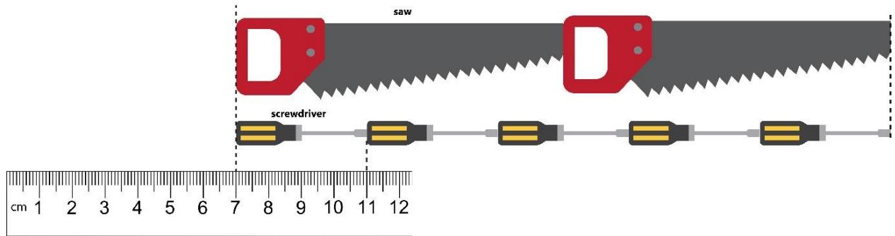

A. 6 cm 

B. 8 cm 

C. 10 cm 

D. 12 cm 

E. None of the above 

## Question 5

The journey from Tom’s house to his school is 45 minutes long. He must report to school at 7.05 a.m. and he was 15 minutes late. What time did he leave the house? 

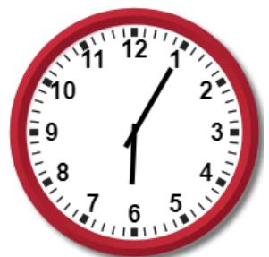

A

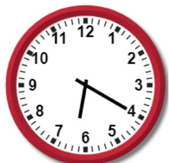

B

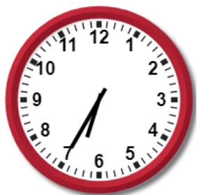

C

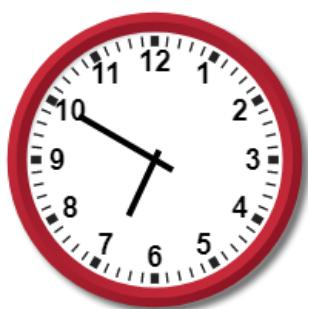

D

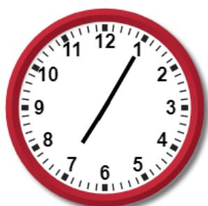

E

## Question 6

Which snowflake below is the same as the snowflake on the right? 

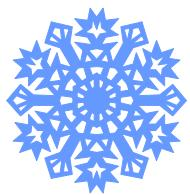

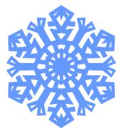

A

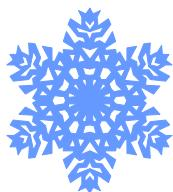

B

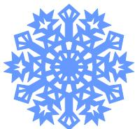

C

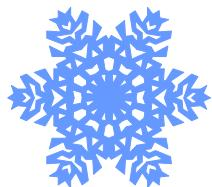

D

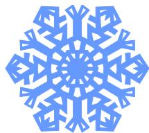

E

## Question 7

Find the missing shape in the pattern below. 

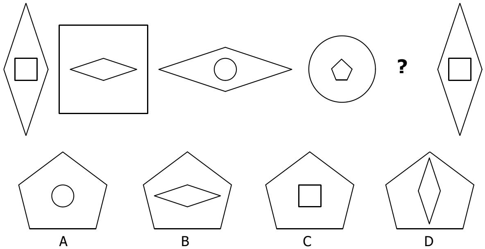

E. None of the above

## Question 8

Andy bought a 4-metre rope. He used 250 cm of it and cut the rest into 5 equal pieces. How long is each piece? 

A. 30 cm 

B. 40 cm 

C. 50 cm 

D. 150 cm 

E. None of the above 

## Question 9

How many numbers from 1 to 100 are multiples of 4 and 5 at the same time? 

<table><tr><td>1</td><td>2</td><td>3</td><td>4</td><td>5</td><td>6</td><td>7</td><td>8</td><td>9</td><td>10</td></tr><tr><td>11</td><td>12</td><td>13</td><td>14</td><td>15</td><td>16</td><td>17</td><td>18</td><td>19</td><td>20</td></tr><tr><td>21</td><td>22</td><td>23</td><td>24</td><td>25</td><td>26</td><td>27</td><td>28</td><td>29</td><td>30</td></tr><tr><td>31</td><td>32</td><td>33</td><td>34</td><td>35</td><td>36</td><td>37</td><td>38</td><td>39</td><td>40</td></tr><tr><td>41</td><td>42</td><td>43</td><td>44</td><td>45</td><td>46</td><td>47</td><td>48</td><td>49</td><td>50</td></tr><tr><td>51</td><td>52</td><td>53</td><td>54</td><td>55</td><td>56</td><td>57</td><td>58</td><td>59</td><td>60</td></tr><tr><td>61</td><td>62</td><td>63</td><td>64</td><td>65</td><td>66</td><td>67</td><td>68</td><td>69</td><td>70</td></tr><tr><td>71</td><td>72</td><td>73</td><td>74</td><td>75</td><td>76</td><td>77</td><td>78</td><td>79</td><td>80</td></tr><tr><td>81</td><td>82</td><td>83</td><td>84</td><td>85</td><td>86</td><td>87</td><td>88</td><td>89</td><td>90</td></tr><tr><td>91</td><td>92</td><td>93</td><td>94</td><td>95</td><td>96</td><td>97</td><td>98</td><td>99</td><td>100</td></tr></table>

A. 5 

B. 20 

C. 25 

D. 45 

E. None of the above 

## Question 10

Twelve trees are planted at equal distance from each other along a straight path. The distance between 1st and 5th tree is 30 metres. What is the distance between 3rd and 5th tree? 

A. 12 

B. 15 

C. 18 

D. 20 

E. None of the above 

## Question 11

Study the picture below. 

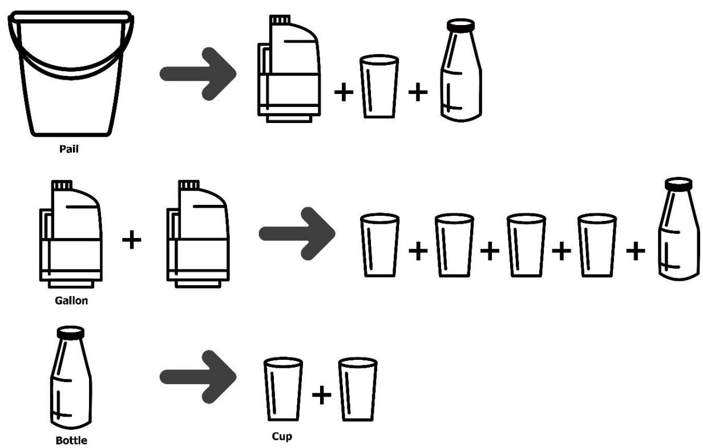

How many cups of water are needed to fill up the pail? 

A. 5 

B. 4 

C. 9 

D. 6 

E. None of the above 

## Question 12

Find the mirror image of the picture on the right. 

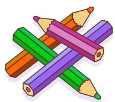

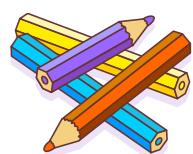

A

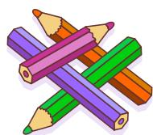

B

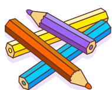

C

D

E

## Question 13

Jeremy had $10 in his piggy bank on January 1, 2019 which is Tuesday. He put $2 into the piggy bank every Monday, Wednesday and Saturday. On which date he would reach $30 in his piggy bank? 

A. January 20, 2019 

B. January 21, 2019 

C. January 25, 2019 

D. January 27, 2019 

E. None of the above 

## Question 14

How many different 2-digit numbers have only odd digits? 

A. 50 

B. 45 

C. 25 

D. 20 

E. None of the above 

## Question 15

Jocelyn, Hector, Thomas and Christie are siblings. Hector is not the youngest. Thomas is older than Jocelyn, and Hector is younger than Christie. Who is the youngest among the siblings? 

A. Hector 

B. Christine 

C. Thomas 

D. Jocelyn 

E. Impossible to know 

## Section B (Correct answer – 4 points| Incorrect or No answer – 0 points)

When an answer is a 1-digit number, shade “0” for the tens, hundreds and thousands place. 

Example: if the answer is 7, then shade 0007 

When an answer is a 2-digit number, shade “0” for the hundreds and thousands place. 

Example: if the answer is 23, then shade 0023 

When an answer is a 3-digit number, shade “0” for the thousands place. 

Example: if the answer is 785, then shade 0785 

When an answer is a 4-digit number, shade as it is. 

Example: if the answer is 4196, then shade 4196 

## Question 16

Use all the digits 2, 0, 1 and 9 to form a number closest to 1969. 

## Question 17

What is the total number of triangles, rectangles and circles in the picture below? 

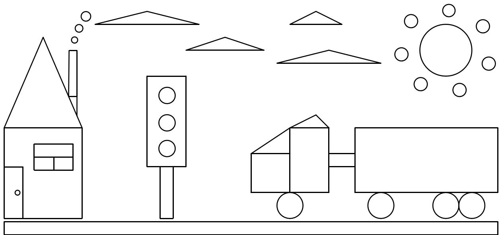

## Question 18

In the number sentence below, what is the value of ∆? 

$$
\Delta \times 4 + 1 0 = 5 \times 4 + 1 4
$$

## Question 19

It is given that 

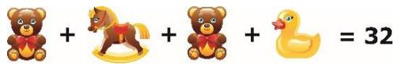

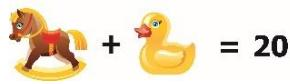

What number does the sum ++ stand for? 

## Question 20

Tom will be twice his age in 4 years from now. Three years ago, the sum of Tom’s and Jerry’s ages was 10. In how many years from now will Jerry’s age be doubled? 

## Question 21

The picture graph below shows the number of stamps 5 children have at first. 

<table><tr><td>Anthony</td><td>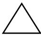</td></tr><tr><td>Brandon</td><td>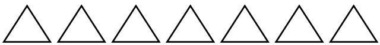</td></tr><tr><td>Carol</td><td>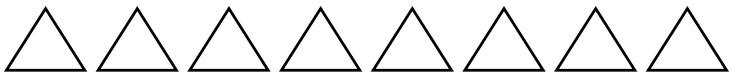</td></tr><tr><td>Dennis</td><td>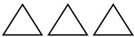</td></tr><tr><td>Elizabeth</td><td>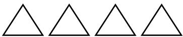</td></tr><tr><td colspan="2">Each △ stands for 3 stamps.</td></tr></table>

Carol distributes all her stamps equally among Anthony, Brandon, Dennis and Elizabeth. How many more stamps does Elizabeth have than Anthony now? 

## Question 22

A mother baked 235 cookies for her children, Grace, Scott and Cindy. Cindy received 15 more cookies than Scott. Grace received 8 less cookies than Scott. How many cookies did Grace receive? 

## Question 23

Claire had 0 cupcakes while Alice and Bob had some. Alice gave half of her cupcakes to Claire. Bob gave 17 cupcakes to Claire. Claire has 55 cupcakes now. How many cupcakes did Alice have in the beginning? 

## Question 24

Picture 2 shows the completed version of the puzzle in Picture 1. 

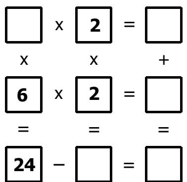

Picture 1

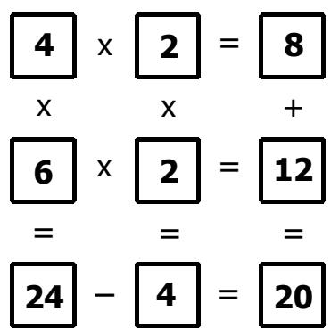

Picture 2

Complete the puzzle in Picture 3 and find the missing number “?”. 

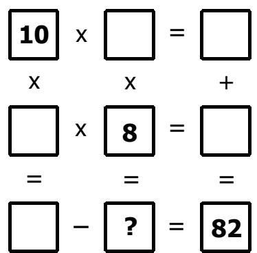

Picture 3

## Question 25

In the following, all the different letters stand for different digits. What is the value of the 4-digit number BDDC? 

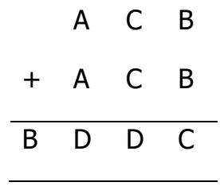

END OF PAPER 

## SASMO 2020 Primary 2 (Grade 2) Contest Questions

Section A (Correct answer – 2 points| No answer – 0 points| Incorrect answer – minus 1 point) 

## Question 1

How many dots are there in the figure below? 

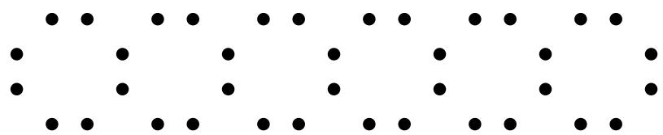

A. 40 

B. 38 

C. 48 

D. 36 

E. None of the above 

## Question 2

The shapes below formed a pattern. Observe carefully and find out the two missing shapes. 

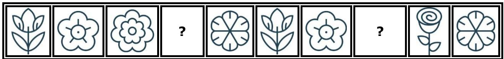

A. 

B. 

C. 

E 

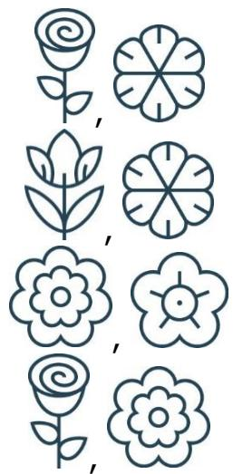

None of the above 

## Question 3

How many months of the year have exactly 30 days? 

A. 4 

B. 5 

C. 12 

D. 11 

E. None of the above 

## Question 4

Which treasure chest below can be opened with the key shown on the right? 

A

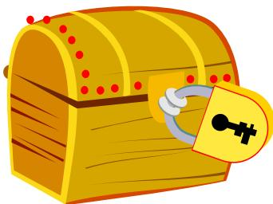

B

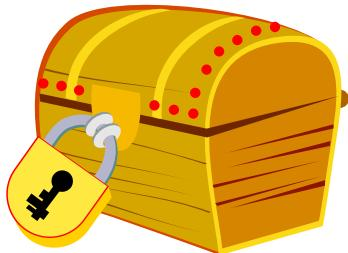

C

D

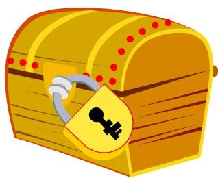

E

## Question 5

What is the next number in the sequence below? 

47, 44, 38, 29, 17 

A. 3 

B. 5 

C. 11 

D. 2 

E. None of the above 

## Question 6

Anastacia bought one blue and one red dress. The blue dress costs $100 more than the red one. If she spent $110 in total, how much did the red dress cost? 

A. $10 

B. $5 

C. $105 

D. $110 

E. None of the above 

## Question 7

The diagram shows some cubes of the same size stacked at a corner of a room. How many cubes are there altogether? (Note: The floor is horizontal and the two walls are vertical. There are no gaps or holes behind the visible cubes.) 

A. 12 

B. 17 

C. 18 

D. 19 

E. None of the above 

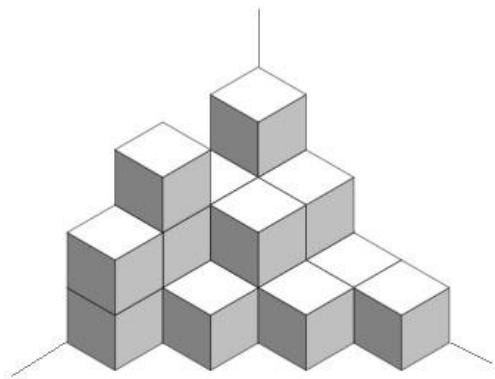

## Question 8

Samuel was 7 years old 5 years ago. His brother David is 2 years older than him. How old will David be 4 years from now? 

A. 13 

B. 14 

C. 16 

D. 17 

E. None of the above 

## Question 9

It is given that 

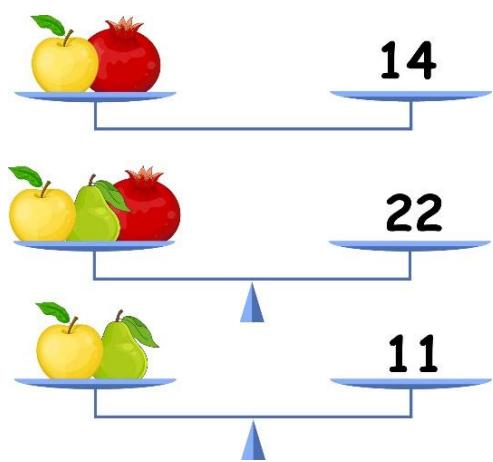

Find the value of 

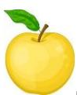

A. 11 

B. 8 

D. 5 

E. None of the above 

## Question 10

Daniel had 6 apples fewer than Laura. After each of them sold 5 apples, they have a total of 36 apples. How many apples does Daniel have now? 

A. 20 

B. 15 

C. 26 

D. 21 

E. None of the above 

## Question 11

Study the picture below. 

If the volume of the kettle is 1200 ml, what is the volume of the stewpan? 

A. 1500 ml 

B. 1450 ml 

C. 1600 ml 

D. 400 ml 

E. None of the above 

## Question 12

Study the pattern below and find ‘?’. 

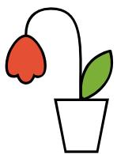

A

B

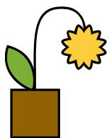

C

D

E

## Question 13

A two-digit number can be divided by both 3 and 5. It is also an even number. How many such numbers are there? 

A. 3 

B. 30 

D. 43 

E. None of the above 

## Question 14

Aria, Evelyn and Camila sit at a round table. They study in primary 2, 3 and 4. The primary 4 girl is on Camila’s left. The primary 3 girl is on Aria’s right. Who is the primary 2 girl? 

A. Aria 

B. Evelyn 

C. Camila 

D. Impossible to determine 

E. None of the above 

## Question 15

Which picture below can form the pyramid shown on the right? 

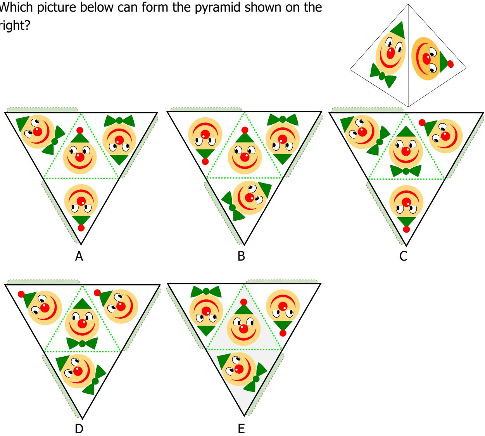

## Section B (Correct answer – 4 points| Incorrect or No answer – 0 points)

When an answer is a 1-digit number, shade “0” for the tens, hundreds and thousands place. 

Example: if the answer is 7, then shade 0007 

When an answer is a 2-digit number, shade “0” for the hundreds and thousands place. 

Example: if the answer is 23, then shade 0023 

When an answer is a 3-digit number, shade “0” for the thousands place. 

Example: if the answer is 785, then shade 0785 

When an answer is a 4-digit number, shade as it is. 

Example: if the answer is 4196, then shade 4196 

## Question 16

What is the value of the following sum? 

$$
2 9 + 3 7 + 7 6 + 6 3 + 2 4 + 4 5 + 6 1 + 5 5
$$

## Question 17

How many triangles are there in the figure below? 

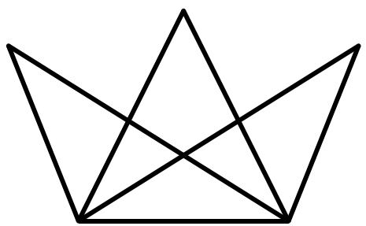

## Question 18

The picture graph below shows the number of cookies that were sold yesterday in Tasty Bakery. How many cookies did Tasty Bakery sell yesterday altogether? 

<table><tr><td>Chocolate Chip</td><td></td></tr><tr><td>Oatmeal Raisin</td><td></td></tr><tr><td>Peanut Butter</td><td></td></tr><tr><td>Almond</td><td></td></tr><tr><td colspan="2">Each  stands for 7 cookies.</td></tr></table>

## Question 19

Find the number ?? such that the following statement is true: 

$$
3 \times 1 3 + 5 \times 1 3 = A \times 8
$$

## Question 20

Trevor made number 2020 using 22 matchsticks as shown below. What is the smallest whole number he can construct using exactly 27 matchsticks? 

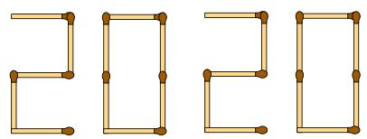

(The figures of all the digits from 0 to 9 are shown below.) 

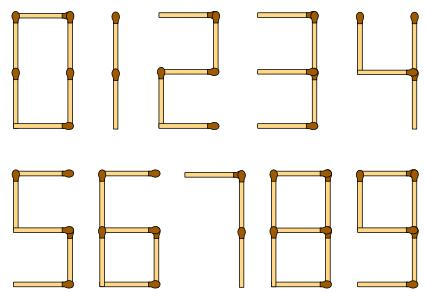

## Question 21

I am a 3-digit even number. 

• All my digits are different. 

• The digit in my hundreds place is the greatest 1-digit number. 

• The digits in my tens and ones place add up to 15. 

What number am I? 

## Question 22

Tom rolled 3 standard six-sided dice of different colours. Each dice has 6 faces with 1, 2, 3, 4, 5 or 6 dots on each face. The number of dots on each of the rolled dice is different. How many possible ways could Tom get the sum 12? 

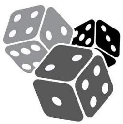

## Question 23

There are 8 cows and chickens altogether in a barn. The total number of legs of all the cows and chickens is 26. How many chickens are there in the barn? 

## Question 24

There are 11 green, 5 red and 7 yellow apples in a basket. Isabella wants to take 3 red apples from the basket without looking. What is the smallest number of apples she needs to take out to make sure that she gets 3 red apples? 

## Question 25

In the following, all the different letters stand for different digits. 

<table><tr><td></td><td>C</td><td>O</td><td>R</td></tr><tr><td>+</td><td></td><td>O</td><td>R</td></tr><tr><td>R</td><td>E</td><td>E</td><td>F</td></tr></table>

Find the value of the 4-digit number REEF. 

# Solutions to SASMO 2019 Primary 2 (Grade 2)

## Question 1

Group the numbers and then add them. 

$$
\begin{array}{l} (9 + 1 1) + (8 + 1 2) + (7 + 1 3) + (6 + 1 4) + 5 + 1 4 = 2 0 + 2 0 + 2 0 + 2 0 + 1 9 = \\ = 2 0 \times 4 + 1 9 = 8 0 + 1 9 = 9 9 \\ \end{array}
$$

Answer: (D) 

## Question 2

A. 3 + 3 + 3 + 3 + 3 + 3 + 3 + 3 = 3 × 8 = 24 

B. 32 ÷ 4 = 8 

C. 30 − 6 = 24 

D. 8 × 3 = 24 

Option B is not equal to 8 + 8 + 8 = 24. 

Answer: (B) 

## Question 3

The pattern is as follows: 

$$
1 \stackrel {+ 2} {\rightarrow} 3 \stackrel {+ 3} {\rightarrow} 6 \stackrel {+ 4} {\rightarrow} 1 0 \stackrel {+ 5} {\rightarrow} 1 5 \stackrel {+ 6} {\rightarrow} 2 1 \stackrel {+ 7} {\rightarrow} \mathbf {2 8}
$$

The next number in the sequence is 28. 

Answer: (C) 

## Question 4

The screwdriver is 11 − 7 = 4 cm long. 

2 saws = 5 screwdrivers = 5 × 4 = 20 cm 

1 saw = 20 ÷ 2 = 10 cm. 

The difference in length between saw and screwdriver = 10 cm – 4 cm = 6 cm 

Answer: (A) 

## Question 5

Tom reached school at 

$$
7. 0 5 \mathrm{a.m.} + 1 5 \text {minutes} = 7. 2 0 \mathrm{a.m.}
$$

Since the journey from Tom’s house to his school is 45 minutes long, he left the house at 

$$
7. 2 0 \mathrm{a.m.} - 4 5 \text { minutes } = 6. 3 5 \mathrm{a.m.}
$$

Answer: (C) 

## Question 6

The circled parts are different from the original picture at the right. 

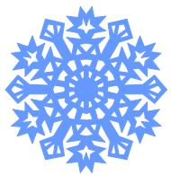

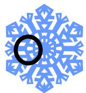

A

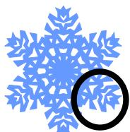

B

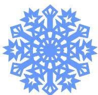

C

D

E

Answer: (C) 

## Question 7

The pattern is as follows: the inner shape in a figure becomes the outer shape of the next figure. 

<table><tr><td></td><td>The outer shape of the fifth figure must be a pentagon since the inner shape of the fourth figure is a pentagon.</td></tr><tr><td></td><td>The inner shape shape of the fifth figure must be a kite since the outer shape of the sixth figure is a kite.</td></tr></table>

The answer is Option D. 

Answer: (D) 

## Question 8

Andy bought a 4-metre rope or a 400 cm rope. He used 250 cm of it and left with 400 cm – 250 cm = 150 cm. Therefore, each of the 5 equal pieces is 150 ÷ 5 = ???? cm long. 

Answer: (A) 

## Question 9

In the table below, we mark the multiples of 4 with and the multiples of 5 with . Thus, 5 multiples of 4 and 5 at the same time will be marked with . 

<table><tr><td>1</td><td>2</td><td>3</td><td>4</td><td>5</td><td>6</td><td>7</td><td>8</td><td>9</td><td>10</td></tr><tr><td>11</td><td>12</td><td>13</td><td>14</td><td>15</td><td>16</td><td>17</td><td>18</td><td>19</td><td>20</td></tr><tr><td>21</td><td>22</td><td>23</td><td>24</td><td>25</td><td>26</td><td>27</td><td>28</td><td>29</td><td>30</td></tr><tr><td>31</td><td>32</td><td>33</td><td>34</td><td>35</td><td>36</td><td>37</td><td>38</td><td>39</td><td>40</td></tr><tr><td>41</td><td>42</td><td>43</td><td>44</td><td>45</td><td>46</td><td>47</td><td>48</td><td>49</td><td>50</td></tr><tr><td>51</td><td>52</td><td>53</td><td>54</td><td>55</td><td>56</td><td>57</td><td>58</td><td>59</td><td>60</td></tr><tr><td>61</td><td>62</td><td>63</td><td>64</td><td>65</td><td>66</td><td>67</td><td>68</td><td>69</td><td>70</td></tr><tr><td>71</td><td>72</td><td>73</td><td>74</td><td>75</td><td>76</td><td>77</td><td>78</td><td>79</td><td>80</td></tr><tr><td>81</td><td>82</td><td>83</td><td>84</td><td>85</td><td>86</td><td>87</td><td>88</td><td>89</td><td>90</td></tr><tr><td>91</td><td>92</td><td>93</td><td>94</td><td>95</td><td>96</td><td>97</td><td>98</td><td>99</td><td>100</td></tr></table>

Alternatively, numbers that are multiples of both 4 and 5 at the same time are multiples of 20. These numbers are 20, 40, 60, 80, and 100. 

Answer: (A) 

## Question 10

There are 4 intervals between 1st and $5 ^ { \mathrm { t h } }$ tree and 2 intervals between $3 ^ { \mathsf { r d } }$ and $5 ^ { \mathrm { t h } }$ tree. 

4 intervals = 30 metres 

2 intervals = 30÷2 = 15 metres. 

Hence the distance between $3 ^ { \mathsf { r d } }$ and $5 ^ { \mathrm { t h } }$ tree is 15 metres. 

Answer: (B) 

## Question 11

1 bottle = 2 cups 

2 gallons = 4 cups + 1 bottle = 4 cups + 2 cups = 6 cups 

1 gallon = 6÷2 = 3 cups 

1 pail = 1 gallon + 1 cup + 1 bottle = 3 cups + 1 cup + 2 cups = 6 cups. 

Hence 6 cups of water are needed to fill up the pail. 

Answer: (D) 

## Question 12

A

B

C

D

E

The shortest pencil in the mirror image must face right and be on top of other pencils. Only options A and B satisfy this condition. The unsharpened pencil must be just below the shortest pencil. Thus, the answer is Option B. 

Answer: (B) 

## Question 13

Jeremy must put $30 – $10 = $20 in total to reach $30 in his piggy bank and he needs $20 ÷ $2 = 10 days to do that. Next, we draw the table as shown below and count 10 days (only Mondays, Wednesdays and Saturdays). 

<table><tr><td>Monday</td><td>Tuesday</td><td>Wednesday</td><td>Thursday</td><td>Friday</td><td>Saturday</td><td>Sunday</td></tr><tr><td></td><td>1-Jan</td><td>2-Jan</td><td>3-Jan</td><td>4-Jan</td><td>5-Jan</td><td>6-Jan</td></tr><tr><td>7-Jan</td><td>8-Jan</td><td>9-Jan</td><td>10-Jan</td><td>11-Jan</td><td>12-Jan</td><td>13-Jan</td></tr><tr><td>14-Jan</td><td>15-Jan</td><td>16-Jan</td><td>17-Jan</td><td>18-Jan</td><td>19-Jan</td><td>20-Jan</td></tr><tr><td>21-Jan</td><td>22-Jan</td><td>23-Jan</td><td>24-Jan</td><td>25-Jan</td><td>26-Jan</td><td>27-Jan</td></tr></table>

He would reach $30 on January ${ \bf 2 3 ^ { r d } } ,$ 2019. 

Answer: (E) 

## Question 14

Do the systematic listing as shown in the table below. 

<table><tr><td>Tens digit is 1</td><td>Tens digit is 3</td><td>Tens digit is 5</td><td>Tens digit is 7</td><td>Tens digit is 9</td></tr><tr><td>11</td><td>31</td><td>51</td><td>71</td><td>91</td></tr><tr><td>13</td><td>33</td><td>53</td><td>73</td><td>93</td></tr><tr><td>15</td><td>35</td><td>55</td><td>75</td><td>95</td></tr><tr><td>17</td><td>37</td><td>57</td><td>77</td><td>97</td></tr><tr><td>19</td><td>39</td><td>59</td><td>79</td><td>99</td></tr></table>

There are 5 × 5 = ???? such numbers. 

Answer: (C) 

## Question 15

Hector is not the youngest. Thomas cannot be the youngest as he is older than Jocelyn. Also, Christie also can’t be the youngest as Hector is younger than her. The only person left who must be the youngest is Jocelyn. 

Answer: (D) 

## Question 16

Obviously, the desired number must be close to 1900 or 2000. Two such numbers we can form are 2019 and 1920. After comparing the differences 

$$
1 9 6 9 - 1 9 2 0 = 4 9
$$

$$
2 0 1 9 - 1 9 6 9 = 5 0,
$$

we find that the closest number we can form is 1920. 

Answer: 1920 

## Question 17

Let’s divide the picture into 5 parts: house, road, truck, sky and traffic light. Afterwards, we count the number of the shapes in each part. 

<table><tr><td></td><td>Rectangles</td><td>Triangles</td><td>Circles</td></tr><tr><td>House</td><td>8</td><td>2</td><td>4</td></tr><tr><td>Road</td><td>1</td><td>0</td><td>0</td></tr><tr><td>Truck</td><td>4</td><td>2</td><td>4</td></tr><tr><td>Traffic light</td><td>2</td><td>0</td><td>3</td></tr><tr><td>Sky</td><td>0</td><td>4</td><td>8</td></tr><tr><td>Total:</td><td>15</td><td>8</td><td>19</td></tr></table>

The total number of triangles, rectangles and circles in the picture is $1 5 + 8 + 1 9 =$ ????. 

Answer: 42 

## Question 18

$$
\Delta \times 4 + 1 0 = 5 \times 4 + 1 4 = 2 0 + 1 4 = 3 4 \mathrm{or} \Delta \times 4 + 1 0 = 3 4
$$

$$
\Delta \times 4 = 3 4 - 1 0 = 2 4 \text { or } \Delta \times 4 = 2 4
$$

$$
\Delta = 2 4 \div 4 = 6
$$

Answer: 6 

## Question 19

$$
3 2 = \text {   +   } + \text {   +   } + \text {   =   } + \text {   +   } + (\text {   +   }) = 2 \times \text {   +   } 2 0 \text {   or   }
$$

$$
3 2 = 2 \times + 2 0, \text { then }
$$

$$
= (3 2 - 2 0) \div 2 = 1 2 \div 2 = 6. \text {   Hence   }
$$

$$
+ + = + (+ 2 0 = 2 6
$$

Answer: 26 

## Question 20

Tom is 4 years old now since he will be twice his age in 4 years from now. 

If the sum of Tom’s and Jerry’s ages was 10 three years ago, then the sum of their ages now is 10 + 3 + 3 = 16. In 4 years from now, the sum of their ages will be 16 + 4 + 4 = 24. It is also given that Tom will be 8 years old in 4 years from now. Hence Jerry will be 24 − 8 = 16 years old and he is 16 − 4 = 12 years old now. Jerry’s age will double in 12 years. 

Answer: 12 years 

## Question 21

After Carol distributes the same number of stamps to Elizabeth and Anthony, the difference in number of stamps between Elizabeth and Anthony does not change. Elizabeth had 4 × 3 = 12 stamps and Anthony had 1 × 3 = 3 stamps. Elizabeth has 12 − 3 = ?? more stamps than Anthony. 

Answer: 9 

## Question 22

Using Model Method, let the number of cookies Grace received be 1 unit: 

<table><tr><td>Grace:</td><td>1 unit</td><td></td><td></td></tr><tr><td>Scott:</td><td>1 unit</td><td>8</td><td></td></tr><tr><td>Cindy:</td><td>1 unit</td><td>8</td><td>15</td></tr></table>

Total: 235 cookies 

$$
3 \mathrm{units} + 8 + 8 + 1 5 = 2 3 5
$$

$$
3 \mathrm{units} = 2 3 5 - 8 - 8 - 1 5 = 2 0 4
$$

$$
1 \mathrm{unit} = 2 0 4 \div 3 = 6 8
$$

Thus, Grace received 68 cookies. 

Answer: 68 

## Question 23

Claire has 55 cupcakes now which she received from Bob (17 cupcakes) and Alice (half of her cupcakes). The number of cupcakes Claire received from Alice is 55 − 17 = 38. Hence Alice had 38 × 2 = ???? cupcakes in the beginning. 

Answer: 76 

## Question 24

Let us label the empty boxes with A, B, C, D, E and F. 

C must be greater than 7 since 10 × C is greater than 82. 

The ones digit of D be must 2 as the ones digit of B is 0. D is also less than 82. The only value of C that satisfies all the above conditions is 9. Then A = 1 and F = 1 × 8 = ??. 

$$
\begin{array}{c c} \framebox {\mathbf {1 0}} & \times \\ \mathrm{x} & \mathrm{x} \end{array} = \begin{array}{c c} \framebox {\mathbf {A}} & = \\ \mathrm{x} & + \end{array}
$$

$$
\begin{array}{c} \framebox {\mathbf {C}} \\ = \end{array} \times \begin{array}{c} \framebox {\mathbf {8}} \\ = \end{array} = \begin{array}{c} \framebox {\mathbf {D}} \\ = \end{array}
$$

$$
\boxed {\mathsf {E}} - \boxed {\mathsf {F}} = \boxed {8 2}
$$

Answer: 8 

## Question 25

B cannot be greater than 1 as the sum of any two 3-digit number is not greater than 999 + 999 = 1998. Hence B must be 1. 

$$
\mathrm{C} = \mathrm{B} + \mathrm{B} = 1 + 1 = 2
$$

$$
D = C + C = 2 + 2 = 4
$$

$$
B D D C = \mathbf {1 4 4 2}
$$

Answer: 1442 

## Solutions to SASMO 2020 Primary 2 (Grade 2)

## Question 1

There are $6 \times 2 = 1 2$ dots on top and bottom of the figure, 2 × 7 = 14 dots in middle of the figure. Thus, there are altogether $1 2 + 1 2 + 1 4 = 3 8$ dots in the figure. 

Answer: (B) 

## Question 2

## Question 3

February has either exactly 28 days in a non-leap year or exactly 29 days in a leap year. January, March, May, July, August, October and December have exactly 31 days. April, June, September and November have exactly 30 days. Thus, there are 4 months in a year that have exactly 30 days. 

Answer: (A) 

## Question 4

The correct keyhole should contain 3 indents (“bumps”) on one side and one indent on the other side as shown on the right. The indent on the left side of the keyhole is somewhere 

in between the largest and the 2nd largest indents on the opposite side. Only option E matches those indents. 

Answer: (E) 

## Question 5

The pattern is as follows: 

$$
4 7 \stackrel {- 3} {\rightarrow} 4 4 \stackrel {- 6} {\rightarrow} 3 8 \stackrel {- 9} {\rightarrow} 2 9 \stackrel {- 1 2} {\longrightarrow} 1 7 \stackrel {- 1 5} {\longrightarrow} \mathbf {2},
$$

where each subtracted number is 3 more than the previous one. 

The next number in the sequence is 2. 

Answer: (D) 

## Question 6

Let the cost of the red dress be 1 ????????. Then the cost of the blue dress is 

(1 ???????? + 100). It is given that 

$$
\begin{array}{l} 1 \text {   unit   } + (1 \text {   unit   } + 1 0 0) = 1 1 0 \\ 2 \text {   units   } + 1 0 0 = 1 1 0 \\ 2 \text {   units   } = 1 1 0 - 1 0 0 = 1 0 \\ 1 \text {   unit   } = 1 0 \div 2 = 5 \\ \end{array}
$$

Answer: (B) 

## Question 7

Let us count the cubes on each stack from left to right. 

There are 2 cubes in the 1st stack. 

There are 4 cubes in the 2nd stack. 

There are 5 cubes in the 3rd stack. 

There are 7 cubes in the 4th stack. 

In total, there are 2 + 4 + 5 + 7 = ???? cubes. 

Answer: (C) 

## Question 8

Since Samuel was 7 years old 5 years ago, Samuel is 7 + 5 = 12 years old now. 

As Samuel’s brother, David is 2 years older than him, David is 12 + 2 = 14 years old now. 

4 years from now, David will be 14 + 4 = ???? years old. 

Answer: (E) 

## Question 9

By comparing the figures above, the value of is 22 − 11 = 11. 

As per the figure above, since the value of is 11, the value of is 14 − 11 = ??. 

Answer: (C) 

## Question 10

As each of them sold the same number of apples, the difference between their number of apples remains the same before and after selling the apples. 

Let the number of apples Daniel has after selling be 1 ????????. Then Laura has (1 ???????? + 6) apples. Then 

1 ???????? + (1 ???????? + 6) = 36 

2 ?????????? + 6 = 36 

2 ?????????? = 36 − 6 = 30 

1 ???????? = 30 ÷ 2 = ???? 

Answer: (B) 

## Question 11

Since 3 cups = 1 coffee pot, then from the second equation we get that 

4 coffee pots = 1200ml or 1 coffee pot = 300ml. 

Hence 1 coffee pot = 3 cups = 300ml or 1 cup = 100ml. 

Volume of the stewpan = volume of one kettle + volume of one coffee pot + volume 

of one cup = 1200ml + 300ml + 100ml = ???????????? 

Answer: (C) 

## Question 12

The same pattern repeats in each row of 3 figures but in different orders as illustrated in the table below: 

<table><tr><td>Part</td><td>Pattern</td></tr><tr><td>Leaf</td><td>2 at the left, 1 at the right</td></tr><tr><td>Stalk</td><td>bowing leftwards, rightwards or S-shaped</td></tr><tr><td>Flower</td><td>tulip-shaped, star-shaped or different tulip-shaped</td></tr><tr><td>Shape of flower pot</td><td>square, square or oval-shaped</td></tr><tr><td>Pattern of flower pot</td><td>dotted, shaded or white</td></tr></table>

So, the missing figure should be Option C which has a leaf at the left, a stalk bowing rightwards, a star-shaped flower, and a shaded square pot. 

Answer: (C) 

## Question 13

If a number is divisible by both 3 and 5, it must also be divisible by 15. Two-digit multiples of 15 are 15, 30, 45, 60, 75, 90. However, only 30, 60 and 90 are even. 

Thus, there are only 3 two-digit even numbers that can be divided by both 3 and 5. 

Answer: (A) 

## Question 14

Aria, Evelyn and Camila sit at a round table. They study in primary 2, 3 and 4. The primary 3 girl is on Aria’s right. Who is the primary 2 girl? 

The primary 4 girl is on Camila’s left: 

If Aria on top, then Primary 4 girl is on her right: 

This is impossible since primary 3 girl must be on her right. 

Hence, Aria must be Primary 4 student. Camilia must Primary 3 girl since she is on Aria’s right 

Thus, Evelyn is Primary 2. 

Answer: (B) 

## Question 15

Let us describe the characteristics of the two faces of the pyramid. 

## Face 1:

• It has a dot on top of its hat 

• It has a white dot on the left of its nose. 

• Its eyes look to the right. 

## Face 2:

• It doesn’t have a dot on top of its hat. 

• It has a white dot on the left of its nose. 

• Its eyes look to the right. 

• It has a bow tie. 

Only Option E has both faces. 

Answer: (E) 

## Question 16

Pair numbers to make tens or hundreds: 

$$
2 9 + 6 1 = 9 0
$$

$$
3 7 + 6 3 = 1 0 0
$$

$$
7 6 + 2 4 = 1 0 0
$$

$$
4 5 + 5 5 = 1 0 0
$$

$$
\mathrm{Sum} = 1 0 0 \times 3 + 9 0 = 3 9 0
$$

Answer: 390 

## Question 17

1-part: 5 triangles 

2-part: 6 triangles 

3-part: 2 triangles 

4-part: 1 triangle 

Total number of triangles = 5 + 6 + 2 + 1 = ???? 

Answer: 14 

## Question 18

There are $7 + 4 + 3 + 6 = 2 0$ 

altogether. Each 

stands for 7 cookies. 

Hence, Tasty Bakery sold 20 × 7 = ?????? cookies yesterday altogether. 

Answer: 140 

## Question 19

$$
3 \times 1 3 + 5 \times 1 3 = A \times 8
$$

$$
(3 + 5) \times 1 3 = A \times 8
$$

$$
8 \times 1 3 = A \times 8 = 8 \times A
$$

$$
\mathrm{A} = \mathbf {1 3}
$$

Answer: 13 

## Question 20

Observe that the number “8” requires 7 matchsticks to be formed. Since the smallest whole number should have the least number of digits, we want to pick the number which requires the most number of matchsticks to be formed, and this number is 8. 

After forming 3 “8”s, we have 27 − (3 × 7) = 6 matchstcks left. The numbers which require 6 matchsticks to be formed are 0, 6 and 9. 

This 4-digit number cannot start with 0, but it can start with 6. Hence, the smallest number is 6888. 

Answer: 6888 

## Question 21

From the second clue, hundreds digit must be 9. 

From the third clue, tens and ones digits must be 8 and 7 for them to add up to 15. They cannot be 9 and 6 as 9 is already in hundreds place and all the digits are different. 

Since the number is even, ones digit must be 8 and tens digit must be 7. 

Thus, the number is 978. 

Answer: 978 

## Question 22

List down all the possible ways for the sum of 3 numbers lesser than 7 to be equal to 12. 

Let the first dice roll out 1 dot, then the only possible ways to get 12 are $1 + 5 + 6$ and 1 + 6 + 5, making it 2 possible ways. 

Let the first dice roll out 2 dots, then the only possible ways to get 12 are 2 + 4 + 6 and 2 + 6 + 4, making it 2 possible ways. 

Let the first dice roll out 3 dots, then the only possible ways to get 12 are 3 + 4 + 5 and 3 + 5 + 4, making it 2 possible ways. 

Let the first dice roll out 4 dots, then the only possible ways to get 12 are 4 + 2 + 6, 4 + 6 + 2, 4 + 3 + 5 and 4 + 5 + 3, making it 4 possible ways. 

Let the first dice roll out 5 dots, then the only possible ways to get 12 are 5 + 1 + 6, 5 + 6 + 1, 5 + 3 + 4 and 5 + 4 + 3, making it 4 possible ways. 

Let the first dice roll out 6 dots, then the only possible ways to get 12 are 6 + 1 + 5, 6 + 5 + 1, 6 + 2 + 4 and 6 + 4 + 2, making it 4 possible ways. 

Total number of ways = 2 + 2 + 2 + 4 + 4 + 4 = 18 

Answer: 18 

## Question 23

Suppose all the animals were chickens. Then there would be 8 × 2 = 16 legs in total. 

As the actual number of legs is 26, there is a difference of 26 − 16 = 10 legs. 

The difference between the number of legs of a cow and a chicken is 4 − 2 = 2. 

Hence, there are 10 ÷ 2 = 5 cows and 8 − 5 = ?? chickens in the barn. 

Answer: 3 

## Question 24

In this question, we must consider the worst-case scenario. 

In the worst-case scenario, Isabella gets all the 11 green apples and 7 yellow apples for her first 18 draws. She would then get the remaining red apples in her next 3 draws. 

Hence the least number of apples she needs to take out is 11 + 7 + 3 = ????. 

Answer: 21 

## Question 25

A three-digit number plus a two-digit number can only result in a four-digit number that starts with 1. Hence R must be 1. F must then be 1 + 1 = 2. 

Different letters stand for different digits, so C cannot be the same as E. Thus, there should be a carry over of 1 from the tens place addition and C = 9. Hence, E = 0 and O = 5, 

Therefore, REEF stands for 1002. 

Answer: 1002 