# Primary 2 (Grade 2) – GEP Practice

# 2020 Contest Problems with Full Solutions

Authors: 

Henry Ong, BSc, MBA, CMA Merlan Nagidulin, BSc 

## © Singapore International Mastery Contests Center (SIMCC) All Rights Reserved

No part of this work may be reproduced or transmitted by any means, electronic or mechanical, including photocopying and recording, or by any information or retrieval system, without the prior permission of the publisher. 

## Section A (Correct answer – 2 points| No answer – 0 points| Incorrect answer – minus 1 point)

## Question 1

How many dots are there in the figure below? 

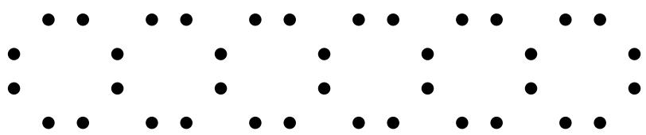

A. 40 

B. 38 

C. 48 

D. 36 

E. None of the above 

## Question 2

The shapes below formed a pattern. Observe carefully and find out the two missing shapes. 

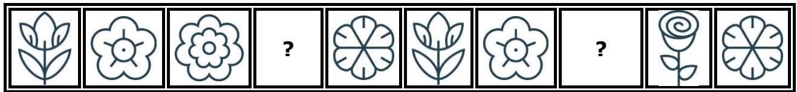

A. 

B. 

C. 

D. 

E 

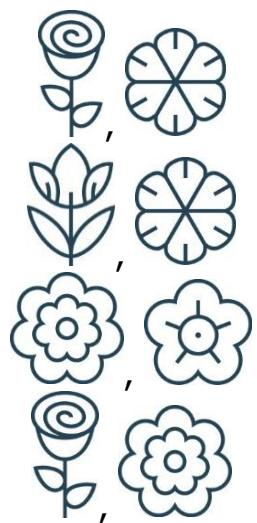

None of the above 

## Question 3

How many months of the year have exactly 30 days? 

A. 4 

B. 5 

C. 12 

D. 11 

E. None of the above 

## Question 4

Which treasure chest below can be opened with the key shown on the right? 

A

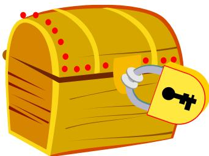

B

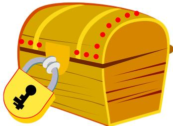

C

D

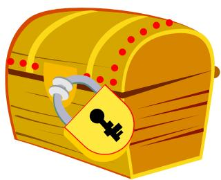

E

## Question 5

What is the next number in the sequence below? 

47, 44, 38, 29, 17 

A. 3 

B. 5 

C. 11 

E. None of the above 

## Question 6

Anastacia bought one blue and one red dress. The blue dress costs $100 more than the red one. If she spent $110 in total, how much did the red dress cost? 

A. $10 

B. $5 

C. $105 

D. $110 

E. None of the above 

## Question 7

The diagram shows some cubes of the same size stacked at a corner of a room. How many cubes are there altogether? (Note: The floor is horizontal and the two walls are vertical. There are no gaps or holes behind the visible cubes.) 

A. 12 

B. 17 

C. 18 

D. 19 

E. None of the above 

## Question 8

Samuel was 7 years old 5 years ago. His brother David is 2 years older than him. How old will David be 4 years from now? 

A. 13 

B. 14 

C. 16 

D. 17 

E. None of the above 

## Question 9

It is given that 

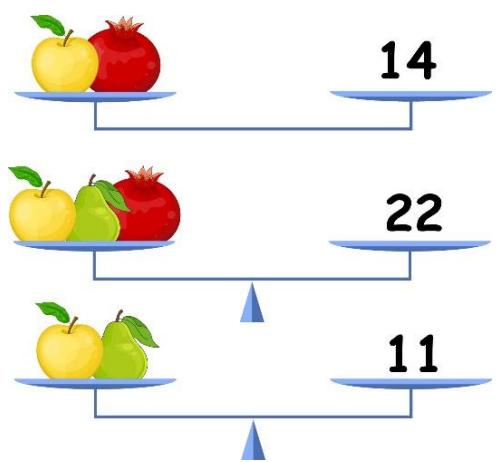

Find the value of 

A. 11 

B. 8 

D. 5 

E. None of the above 

## Question 10

Daniel had 6 apples fewer than Laura. After each of them sold 5 apples, they have a total of 36 apples. How many apples does Daniel have now? 

A. 20 

B. 15 

C. 26 

D. 21 

E. None of the above 

## Question 11

Study the picture below. 

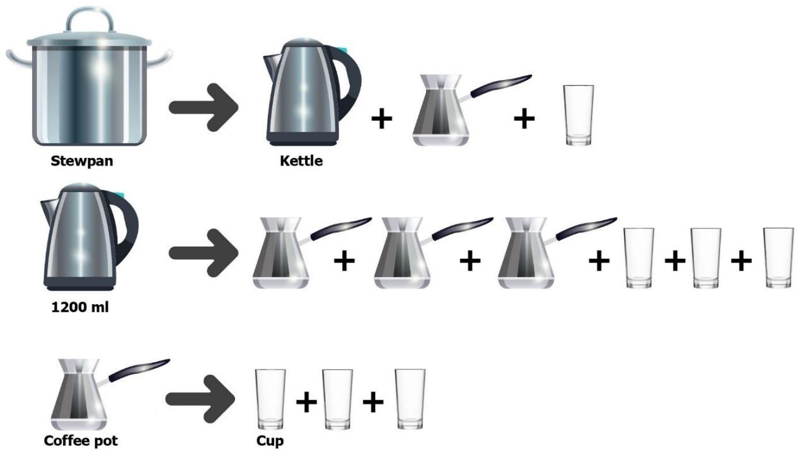

If the volume of the kettle is 1200 ml, what is the volume of the stewpan? 

A. 1500 ml 

B. 1450 ml 

C. 1600 ml 

D. 400 ml 

E. None of the above 

## Question 12

Study the pattern below and find ‘?’. 

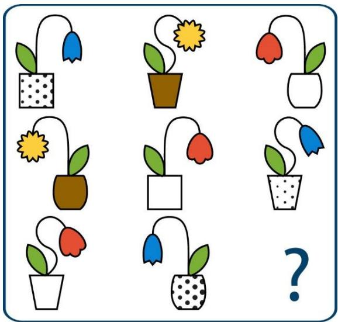

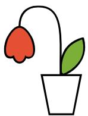

A

B

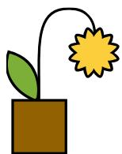

C

D

E

## Question 13

A two-digit number can be divided by both 3 and 5. It is also an even number. How many such numbers are there? 

A. 3 

B. 30 

D. 43 

E. None of the above 

## Question 14

Aria, Evelyn and Camila sit at a round table. They study in primary 2, 3 and 4. The primary 4 girl is on Camila’s left. The primary 3 girl is on Aria’s right. Who is the primary 2 girl? 

A. Aria 

B. Evelyn 

C. Camila 

D. Impossible to determine 

E. None of the above 

## Question 15

Which picture below can form the pyramid shown on the right? 

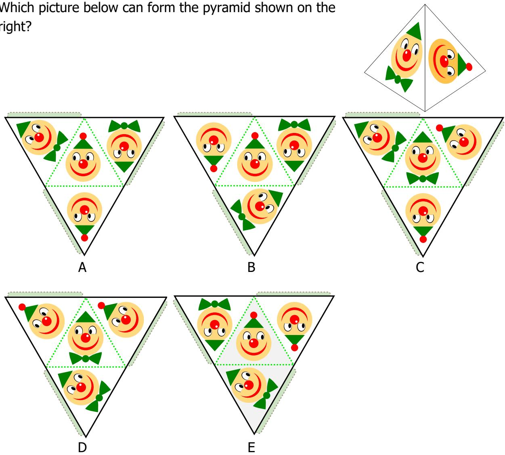

## Section B (Correct answer – 4 points| Incorrect or No answer – 0 points)

When an answer is a 1-digit number, shade “0” for the tens, hundreds and thousands place. 

Example: if the answer is 7, then shade 0007 

When an answer is a 2-digit number, shade “0” for the hundreds and thousands place. 

Example: if the answer is 23, then shade 0023 

When an answer is a 3-digit number, shade “0” for the thousands place. 

Example: if the answer is 785, then shade 0785 

When an answer is a 4-digit number, shade as it is. 

Example: if the answer is 4196, then shade 4196 

## Question 16

What is the value of the following sum? 

$$
2 9 + 3 7 + 7 6 + 6 3 + 2 4 + 4 5 + 6 1 + 5 5
$$

## Question 17

How many triangles are there in the figure below? 

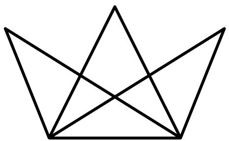

## Question 18

The picture graph below shows the number of cookies that were sold yesterday in Tasty Bakery. How many cookies did Tasty Bakery sell yesterday altogether? 

<table><tr><td>Chocolate Chip</td><td></td></tr><tr><td>Oatmeal Raisin</td><td></td></tr><tr><td>Peanut Butter</td><td></td></tr><tr><td>Almond</td><td></td></tr><tr><td colspan="2">Each  stands for 7 cookies.</td></tr></table>

## Question 19

Find the number ?? such that the following statement is true: 

$$
3 \times 1 3 + 5 \times 1 3 = A \times 8
$$

## Question 20

Trevor made number 2020 using 22 matchsticks as shown below. What is the smallest whole number he can construct using exactly 27 matchsticks? 

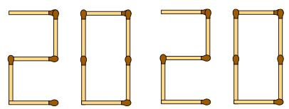

(The figures of all the digits from 0 to 9 are shown below.) 

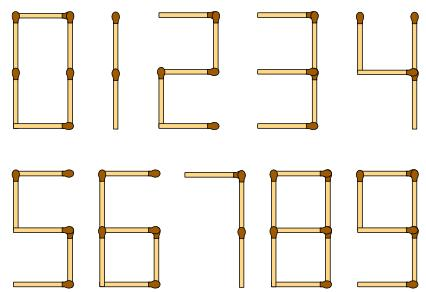

## Question 21

I am a 3-digit even number. 

• All my digits are different. 

• The digit in my hundreds place is the greatest 1-digit number. 

• The digits in my tens and ones place add up to 15. 

What number am I? 

## Question 22

Tom rolled 3 standard six-sided dice of different colours. Each dice has 6 faces with 1, 2, 3, 4, 5 or 6 dots on each face. The number of dots on each of the rolled dice is different. How many possible ways could Tom get the sum 12? 

## Question 23

There are 8 cows and chickens altogether in a barn. The total number of legs of all the cows and chickens is 26. How many chickens are there in the barn? 

## Question 24

There are 11 green, 5 red and 7 yellow apples in a basket. Isabella wants to take 3 red apples from the basket without looking. What is the smallest number of apples she needs to take out to make sure that she gets 3 red apples? 

## Question 25

In the following, all the different letters stand for different digits. 

<table><tr><td></td><td>C</td><td>O</td><td>R</td></tr><tr><td>+</td><td></td><td>O</td><td>R</td></tr><tr><td></td><td>R</td><td>E</td><td>E</td></tr></table>

Find the value of the 4-digit number REEF. 

## Solutions to SASMO 2020 Primary 2 (Grade 2)

## Question 1

There are $6 \times 2 = 1 2$ dots on top and bottom of the figure, 2 × 7 = 14 dots in middle of the figure. Thus, there are altogether $1 2 + 1 2 + 1 4 = 3 8$ dots in the figure. 

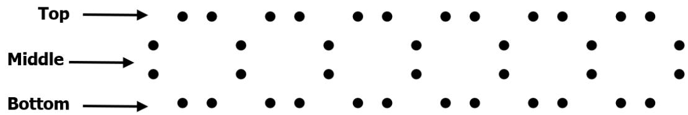

Answer: (B) 

## Question 2

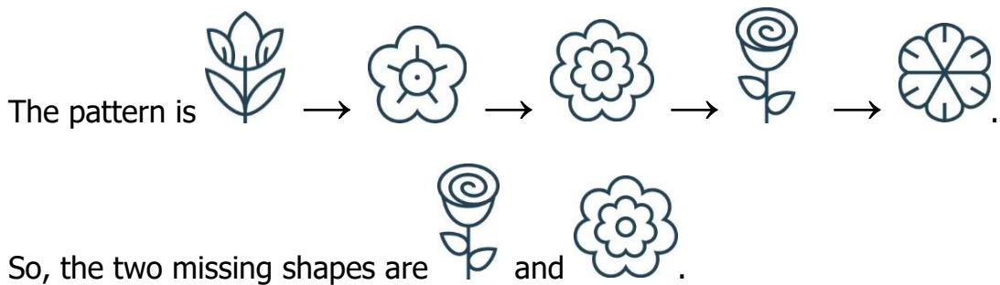

Answer: (D) 

## Question 3

February has either exactly 28 days in a non-leap year or exactly 29 days in a leap year. January, March, May, July, August, October and December have exactly 31 days. April, June, September and November have exactly 30 days. Thus, there are 4 months in a year that have exactly 30 days. 

Answer: (A) 

## Question 4

The correct keyhole should contain 3 indents (“bumps”) on one side and one indent on the other side as shown on the right. The indent on the left side of the keyhole is somewhere 

in between the largest and the 2nd largest indents on the opposite side. Only option E matches those indents. 

Answer: (E) 

## Question 5

The pattern is as follows: 

$$
4 7 \stackrel {- 3} {\rightarrow} 4 4 \stackrel {- 6} {\rightarrow} 3 8 \stackrel {- 9} {\rightarrow} 2 9 \stackrel {- 1 2} {\longrightarrow} 1 7 \stackrel {- 1 5} {\longrightarrow} \mathbf {2},
$$

where each subtracted number is 3 more than the previous one. 

The next number in the sequence is 2. 

Answer: (D) 

## Question 6

Let the cost of the red dress be 1 ????????. Then the cost of the blue dress is 

(1 ???????? + 100). It is given that 

1 ???????? + (1 ???????? + 100) = 110 

2 ?????????? + 100 = 110 

2 ?????????? = 110 − 100 = 10 

1 ???????? = 10 ÷ 2 = $?? 

Answer: (B) 

## Question 7

Let us count the cubes on each stack from left to right. 

There are 2 cubes in the 1st stack. 

There are 4 cubes in the 2nd stack. 

There are 5 cubes in the 3rd stack. 

There are 7 cubes in the 4th stack. 

In total, there are 2 + 4 + 5 + 7 = ???? cubes. 

Answer: (C) 

## Question 8

Since Samuel was 7 years old 5 years ago, Samuel is 7 + 5 = 12 years old now. 

As Samuel’s brother, David is 2 years older than him, David is 12 + 2 = 14 years old now. 

4 years from now, David will be 14 + 4 = ???? years old. 

Answer: (E) 

## Question 9

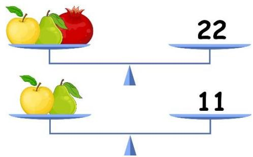

By comparing the figures above, the value of is 22 − 11 = 11. 

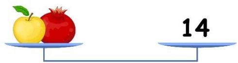

As per the figure above, since the value of is 11, the value of is 14 − 11 = ??. 

Answer: (C) 

## Question 10

As each of them sold the same number of apples, the difference between their number of apples remains the same before and after selling the apples. 

Let the number of apples Daniel has after selling be 1 ????????. Then Laura has (1 ???????? + 6) apples. Then 

1 ???????? + (1 ???????? + 6) = 36 

2 ?????????? + 6 = 36 

2 ?????????? = 36 − 6 = 30 

1 ???????? = 30 ÷ 2 = ???? 

Answer: (B) 

## Question 11

Since 3 cups = 1 coffee pot, then from the second equation we get that 

4 coffee pots = 1200ml or 1 coffee pot = 300ml. 

Hence 1 coffee pot = 3 cups = 300ml or 1 cup = 100ml. 

Volume of the stewpan = volume of one kettle + volume of one coffee pot + volume 

of one cup = 1200ml + 300ml + 100ml = ???????????? 

Answer: (C) 

## Question 12

The same pattern repeats in each row of 3 figures but in different orders as illustrated in the table below: 

<table><tr><td>Part</td><td>Pattern</td></tr><tr><td>Leaf</td><td>2 at the left, 1 at the right</td></tr><tr><td>Stalk</td><td>bowing leftwards, rightwards or S-shaped</td></tr><tr><td>Flower</td><td>tulip-shaped, star-shaped or different tulip-shaped</td></tr><tr><td>Shape of flower pot</td><td>square, square or oval-shaped</td></tr><tr><td>Pattern of flower pot</td><td>dotted, shaded or white</td></tr></table>

So, the missing figure should be Option C which has a leaf at the left, a stalk bowing rightwards, a star-shaped flower, and a shaded square pot. 

Answer: (C) 

## Question 13

If a number is divisible by both 3 and 5, it must also be divisible by 15. Two-digit multiples of 15 are 15, 30, 45, 60, 75, 90. However, only 30, 60 and 90 are even. 

Thus, there are only 3 two-digit even numbers that can be divided by both 3 and 5. 

Answer: (A) 

## Question 14

Aria, Evelyn and Camila sit at a round table. They study in primary 2, 3 and 4. The primary 3 girl is on Aria’s right. Who is the primary 2 girl? 

The primary 4 girl is on Camila’s left: 

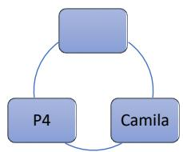

If Aria on top, then Primary 4 girl is on her right: 

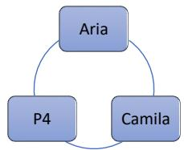

This is impossible since primary 3 girl must be on her right. 

Hence, Aria must be Primary 4 student. Camilia must Primary 3 girl since she is on Aria’s right 

Thus, Evelyn is Primary 2. 

Answer: (B) 

## Question 15

Let us describe the characteristics of the two faces of the pyramid. 

## Face 1:

• It has a dot on top of its hat 

• It has a white dot on the left of its nose. 

• Its eyes look to the right. 

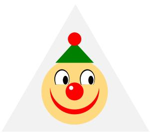

## Face 2:

• It doesn’t have a dot on top of its hat. 

• It has a white dot on the left of its nose. 

• Its eyes look to the right. 

• It has a bow tie. 

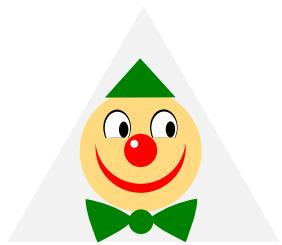

Only Option E has both faces. 

Answer: (E) 

## Question 16

Pair numbers to make tens or hundreds: 

$$
2 9 + 6 1 = 9 0
$$

$$
3 7 + 6 3 = 1 0 0
$$

$$
7 6 + 2 4 = 1 0 0
$$

$$
4 5 + 5 5 = 1 0 0
$$

$$
\mathrm{Sum} = 1 0 0 \times 3 + 9 0 = 3 9 0
$$

Answer: 390 

## Question 17

1-part: 5 triangles 

2-part: 6 triangles 

3-part: 2 triangles 

4-part: 1 triangle 

Total number of triangles = 5 + 6 + 2 + 1 = ???? 

Answer: 14 

## Question 18

There are $7 + 4 + 3 + 6 = 2 0$ 

altogether. Each 

stands for 7 cookies. 

Hence, Tasty Bakery sold 20 × 7 = ?????? cookies yesterday altogether. 

Answer: 140 

## Question 19

$$
3 \times 1 3 + 5 \times 1 3 = A \times 8
$$

$$
(3 + 5) \times 1 3 = A \times 8
$$

$$
8 \times 1 3 = A \times 8 = 8 \times A
$$

$$
\mathrm{A} = 1 3
$$

Answer: 13 

## Question 20

Observe that the number “8” requires 7 matchsticks to be formed. Since the smallest whole number should have the least number of digits, we want to pick the number which requires the most number of matchsticks to be formed, and this number is 8. 

After forming 3 “8”s, we have 27 − (3 × 7) = 6 matchstcks left. The numbers which require 6 matchsticks to be formed are 0, 6 and 9. 

This 4-digit number cannot start with 0, but it can start with 6. Hence, the smallest number is 6888. 

Answer: 6888 

## Question 21

From the second clue, hundreds digit must be 9. 

From the third clue, tens and ones digits must be 8 and 7 for them to add up to 15. They cannot be 9 and 6 as 9 is already in hundreds place and all the digits are different. 

Since the number is even, ones digit must be 8 and tens digit must be 7. 

Thus, the number is 978. 

Answer: 978 

## Question 22

List down all the possible ways for the sum of 3 numbers lesser than 7 to be equal to 12. 

Let the first dice roll out 1 dot, then the only possible ways to get 12 are 1 + 5 + 6 and 1 + 6 + 5, making it 2 possible ways. 

Let the first dice roll out 2 dots, then the only possible ways to get 12 are 2 + 4 + 6 and 2 + 6 + 4, making it 2 possible ways. 

Let the first dice roll out 3 dots, then the only possible ways to get 12 are 3 + 4 + 5 and 3 + 5 + 4, making it 2 possible ways. 

Let the first dice roll out 4 dots, then the only possible ways to get 12 are 4 + 2 + 6, 4 + 6 + 2, 4 + 3 + 5 and 4 + 5 + 3, making it 4 possible ways. 

Let the first dice roll out 5 dots, then the only possible ways to get 12 are 5 + 1 + 6, 5 + 6 + 1, 5 + 3 + 4 and 5 + 4 + 3, making it 4 possible ways. 

Let the first dice roll out 6 dots, then the only possible ways to get 12 are 6 + 1 + 5, 6 + 5 + 1, 6 + 2 + 4 and 6 + 4 + 2, making it 4 possible ways. 

Total number of ways = 2 + 2 + 2 + 4 + 4 + 4 = 18 

Answer: 18 

## Question 23

Suppose all the animals were chickens. Then there would be 8 × 2 = 16 legs in total. 

As the actual number of legs is 26, there is a difference of 26 − 16 = 10 legs. 

The difference between the number of legs of a cow and a chicken is 4 − 2 = 2. 

Hence, there are 10 ÷ 2 = 5 cows and 8 − 5 = ?? chickens in the barn. 

Answer: 3 

## Question 24

In this question, we must consider the worst-case scenario. 

In the worst-case scenario, Isabella gets all the 11 green apples and 7 yellow apples for her first 18 draws. She would then get the remaining red apples in her next 3 draws. 

Hence the least number of apples she needs to take out is 11 + 7 + 3 = ????. 

Answer: 21 

## Question 25

A three-digit number plus a two-digit number can only result in a four-digit number that starts with 1. Hence R must be 1. F must then be 1 + 1 = 2. 

Different letters stand for different digits, so C cannot be the same as E. Thus, there should be a carry over of 1 from the tens place addition and C = 9. Hence, E = 0 and O = 5, 

Therefore, REEF stands for 1002. 

Answer: 1002 