# Primary 3 (Grade 3) – GEP Practice

# 2019 & 2020

# Contest Problems with Full Solutions

Authors: 

Henry Ong, BSc, MBA, CMA 

Merlan Nagidulin, BSc 

## © Singapore International Mastery Contests Centre (SIMCC) All Rights Reserved

No part of this work may be reproduced or transmitted by any means, electronic or mechanical, including photocopying and recording, or by any information or retrieval system, without the prior permission of the publisher. 

## About the Authors:

Henry Ong is the Founder of SASMO and President of Singapore International Mastery Contest Centre (SIMCC). He conducts Math Olympiad classes, not only in Singapore but also around the 20 countries that have joined SASMO. He now travels round the world giving out awards and scholarships to students and teachers. He is now promoting new contests, International Scholastic Trust Teachers’ Institute (ISTTI) and International Junior Honor Society (IJHS). 

In February 2020, Henry was appointed Co-Chair of the Council Administration of Cambodian Mathematical Society (CA_CMS). Henry will share and use his great wealth of experience, expertise, and international networks to contribute effectively to: (1) promoting STEM: Science, Technology, Engineering, and Mathematics; (2) organizing and undertaking multilateral partnership programs; and (3) strengthening and improving the public-private partnership for development of STEM, research and development, and research and innovation as well as teacher professional development in Cambodia with relevant stakeholders in close collaboration and consultation with relevant leadership and management of Ministry of Education, Youth and Sport, especially Cambodian Mathematical Society (CMS), New Generation Pedagogical Research Center (NGPRC), National Institute of Education(NIE) and Teacher Training Department (TTD). 

Merlan Nagidulin is the Academic Director for Math and Science Olympiad and General Manager of SIMCC. Merlan graduated with a Bachelor of Science, Honours in Mathematical Sciences from Nanyang Technological University. Merlan won 2 gold medals in Kazakhstan National Math Olympiad and was awarded a bronze medal in the most prestigious International Math Olympiad (IMO Slovenia 2006). 

## Publisher

Noble Education Pte Ltd specialises in printing educational resources and educational games. We introduced many thinking games and puzzles to MOE schools in Singapore and overseas. We help students, teachers and entrepreneurs to self-publish their own titles. We print contest papers for all Singapore International Math Contest Centre (SIMCC) academic competitions world-wide. 

Noble Education Pte Ltd – 55 Lor L Telok Kurau, 03-69, Bright Centre, Singapore 425500 SIMCC – 199A Thomson Road, Goldhill Centre, Singapore 307636 Website: www.simcc.org 

If you spot any mistakes, kindly email us at training@simcc.org . 

Copyright © 2021 by SIMCC 

All rights reserved. No part of this work may be reproduced or transmitted in any form or by any means, electronic or mechanical, including photocopying and recording, or by any information or retrieval system, except as may be expressly permitted by the Copyright Act of 1976 or in writing to the Publisher. Requests for Permission should be addressed to: Permissions, Mr Henry Ong, c/o 55 Lor L Telok Kurau, 03-69, Bright Centre, Singapore 425500 or email: admin@simcc.org 

First Edition printed in Singapore, 2021 

ISBN: 978-98-11800-88-7 

## Table of Contents

International Scholastic Trust President’s Message........... 

Competition and Prizes ......... 

Introduction ...... 

Problem Solving Procedure ......... 

Problem Solving Strategies .......... 

SASMO 2019 Primary 3 (Grade 3) Contest Questions ............ 

SASMO 2020 Primary 3 (Grade 3) Contest Questions .............. . 22 

Solutions to SASMO 2019 Primary 3 (Grade 3) ........... .. 34 

Solutions to SASMO 2020 Primary 3 (Grade 3) ........... .... 45 

# International Scholastic Trust President’s Message

Dear SIMCC contestants, parents, teachers, and partners, 

I hope all of you are safe and healthy. We have all gone through so much within the past year, and we should rejoice - we are all alive and well. Despite all the groom and predictions of the worst recession to hit us very soon, we at SIMCC, are expanding globally – adding another 14 country partners to a total of 35 countries and territories within the last 10 months, and setting up sales offices in Cambodia and India, in addition to taking over the ICAS competitions and staff from the University of New South Wales Global Office based in Hong Kong and Macau. 

Two years, Sophie Koh, our Senior Director of IT, Events and Operations left Singapore Polytechnic as a Senior Lecturer of IT to join us. She has almost digitally transformed most of our operations and contest systems. This will provide valuable big data in formative and summative assessments for teachers to measure their students and inform their teaching. Parents and students will also receive Detailed Performance Reports (DPR) in our Member Development Portal (MDP) to improve their Academic Skills. Teachers and their schools will be able to download Students’ Analytical Performance Reports (SAPR). SIMCC together with our partners will be conducting more Webinars to prepare teachers and parents to use our contests and data to arm their wards with Skills and Recognition for SUCCESS. 

From February 16 to April 30, 2021, we are offering the 1st Singapore Math Global Assessment for grades 1 to 11 students. We want to open this up to every country, especially since Singapore Math textbooks are used in schools from over 70 countries. We want to share our rich Singapore Math heritage that has propelled Singapore students to the top of PISA rankings since the 1990s. We also have excellent teachers, Learning Management System (LMS), Math textbooks, assessment books, as well as teacher training to help improve math education worldwide. Reach out to us for help, if you want your students to become Mathematics Heroes! 

The global winners of SINGA Math Assessments are invited for the 1st SINGA Math Global Finals, in their home countries on September 11, 2021. The prize for the Overall Champion of grades 1 to 10/11 is a S$600 competition package to compete in the STEAM AHEAD International Junior Mathematics Olympiad (IJMO) to be held in Bali, Indonesia from December 3 to 7, 2021. The prize for Overall Runner-up is S$250 and 2nd Runner-up is S$150, offering a total prize award of S$10,000. Winners of Gold (10%) and Silver (15%) are invited to compete in STEAM AHEAD IJMO 2021. 

From 2021, we will be offering most of our contests to grade 12 students – SASMO, DrCT, SIMOC, and STEAM AHEAD. This will pave the way for Grades 12 SIMCC students to apply for SIMCC and STS’s US$270,000 endowed 2 scholarships for 4-year undergraduate studies at Southern Illinois University (SIU), Carbondale, Illinois, USA in STEM related fields. SIU has also given SIMCC over 30 SIU International Student Tuition Grants to award to top SIMCC students to pursue their university education. SIMCC will setup our own network for SIMCC scholars at SIU. This will help us expand SIMCC contests in North America and generate revenue for us to fund more scholarships. 

Best Regards, 

Henry Ong, President 

## Competition and Prizes

SASMO is devoted and dedicated to bringing a love for Mathematics to students. Unlike most Math Olympiad Competitions, SASMO caters not only to students in the top 5% but to the top 40% instead. It aims to arouse students’ interest and enthusiasm for mathematical problem solving, develop mathematical intuition, reasoning and logical thinking, as well as creative and critical thinking. In addition, this can help improve the students’ math grades because they can apply problem-solving strategies learnt during the training to their daily school mathematics. 

## History:

Created in 2006, SASMO is one of the largest Math Olympiads in the Asian region. We have expanded the competition to provide an International platform for students from Primary 2 to Secondary 4, with differentiated contest papers for every level. SASMO awards medals and certificates to the top 40% of participants. 

## Calculators are not permitted

When a problem introduces a more advanced concept, all necessary definitions are included. 

## Awards:

Each participant receives a Certificate of Participation or an award certificate for winners below. Each of the top 8%, 12% and 20% of all participants receives a Gold, Silver or Bronze medal and certificate respectively. Each student who achieves a Perfect Score of 85 points receives a Perfect Score certificate, Gold medal and $100. 

## Introduction

## For Students Taking the Math Olympiad Challenge

Congratulations. You have embarked on a journey of scholarship. Competitions like SASMO open many doors for you. Firstly, you learn new and interesting approaches to problem-solving and new topics. Next, you will meet talented students from other schools as you attend trainings and competitions. You build your endurance to “puzzle” out challenging problems and build your reputation as a problem solver. Finally, you will be exposed to various international competitions and scholarship opportunities. Here in Singapore, you increase your chances of getting into a top school via Direct School Admissions (DSA) and entry into the Gifted Education Programme as you compete regularly in high level competitions. 

This book is written for the participants in the Singapore and Asian Schools Math Olympiads (SASMO). It helps students to prepare well for the contest and develop higher-order thinking. All problems are designed to help students develop the ability to think mathematically, rather than to teach more advanced or unusual topics. The fun is in how you can see patterns and ways of solving each problem in non-technical ways even though you have not learnt the topic yet! 

In addition to the contest problems, the reader is provided with a list of familiar mathematical terms, as well as a review of some of the topics that are likely to be tested in the Olympiad. The book also contains some solved examples to provide different problem-solving techniques, and to familiarize the participant with different types of Olympiad questions. It is advised that the reader spends appropriate time studying these questions and solutions, as they will assist in tackling actual Olympiad problems. 

How to Use This Book: Practice daily for 15 minutes per hour instead of 4 hours of learning once a month. Your mind needs to absorb each new thought, and constant practice allows frequent review of previously learned concepts and skills. Together, you can remember many new problem-solving approaches. Try to spend 10 or 15 minutes daily doing two or three problems. This approach should help you minimize the time needed to develop the ability to think mathematically. 

Whether you solve a problem quickly or if you are confused, it is worth studying the solutions in this book, because often they offer unexpected insights that can help you understand the problem more fully. After you have invested time – trying to solve each problem any way you can, reviewing our solutions is very effective. Many of the problems in this book can be solved in more than one way. There is always a single answer, but there can be many paths to that answer. Once you solve a problem, go back and see if you can solve it by another method. Then check our solutions to see if any of them differ from yours. 

Enjoy working on these challenges and you will soon be in a different league from your peers who have not taken any international competition. We look forward to inviting you if you are a bronze, silver, gold or perfect score medallist for further training. 

## Problem Solving Procedure

You may go through several phases when solving a problem such as trying to understand the problem, working on a specific approach (planning and attempting), getting stuck and trying to get unstuck, critically examining solutions or communicating. The work may involve going back and forth between these different phases of problem solving. 

In solving any problem, it helps to have a working procedure. You might want to consider this four-step procedure: Understand, Plan, Try It, and Look Back. 

## Understand

Before you can solve a problem, you must first understand it. Read and re-read the problem carefully to find all the clues and determine what the question is asking you to find. What is the unknown? What is the data? What is the condition? 

## Plan

Once you understand the question and the clues, it's time to use your previous experience with similar problems to look for strategies and tools to answer the question. Do you know a related problem? Look at the unknown! And try to think of a familiar problem having the same or a similar unknown? 

## Try It

After deciding on a plan, you should try it and see what answer you come up with. Can you see clearly that the steps are correct? 

But can you also prove that the steps are correct? 

## Are you feeling stuck?

Many different approaches can be tried to get unstuck. One approach is to try working a simpler version of the problem, and use the solution to the problem to get insights that are useful in solving the original problem. In the next chapter, we will show some common solving approaches. 

If you are discouraged after a few failed attempts, read this quote from the famous scientist, Thomas Edison. An assistant asked, "Why are you wasting your time and money? We have had failure after failure, almost a thousand of them. Why do you continue to pursue this impossible task?" Edison said, "We haven't had a thousand failures, we've just discovered a thousand ways to not invent the electric bulb." 

## Look Back

Once you've tried a problem and found an answer, go back to the problem and see if you've really answered the question. Sometimes it's easy to overlook something. If you missed something check your plan and try the problem again. Can you check the result? 

Can you check the argument? 

Can you derive the result differently? 

Can you see it at a glance? 

## Problem Solving Strategies

## 1. Change the representation

Using a wrong representation may make a problem impossible to solve. 

Strategies of changing representation include drawing a picture and acting it out. 

DRAW A PICTURE: By drawing a picture, and visualizing the problem information using it, you will have a clearer understanding of the problem and it will help you to come up an approach to solve the problem that you might not be able to see otherwise. 

ACT IT OUT: We are better at thinking in terms of concrete objects and situations than in terms of abstract concepts. If we can act out the situation described in a word problem, we are able to understand the problem better and we may be able to come up with a solution. To do this, we need to use real materials that are easily available to us. Examples can be pencils, coins and other objects we have in the classroom. 

## 2. Make an Organized List or a Table

ORGANIZED LIST: Making an organized list allows you to clearly examine data. It can help you in ensuring that you are looking at all the relevant information. It will also allow you to see patterns in the data easily and to come to correct conclusions. 

MAKE A TABLE: Making a table allows you to clearly examine data. It can help you in ensuring that you are looking at all the relevant information. It will also allow you to see patterns in the data easily and to come to correct conclusions. 

## 3. Create a Simpler Problem

Sometimes we are not able to solve the problem as it is stated, but we are able to solve a similar problem that is similar in some way. For example, the simpler problem may use simpler numbers. Once we solve one or more simpler problems, we may understand the approach that can be used to solve the problems of similar type and may be able to solve the problem that has been given to us. 

## 4. Use Logical Reasoning

Logical reasoning is useful in mathematics problems in various ways. It can be used to eliminate incorrect choices. It can also sometimes be used to conclude the answer directly. 

## 5. Guess and Check

"Guess and Check" strategy can be used on many problems. If the number of possible answers is small, one can use this strategy to come up with the answer very quickly. In some other cases where the number of possible answers is not small, one may still be able to make intelligent guesses and come up with the answer. 

## 6. Working Backwards

Sometimes, it is easier to start with information at the end of the problem and work backwards to the beginning of the problem than the other way around. 

## SASMO 2019 Primary 3 (Grade 3) Contest Questions

Section A (Correct answer – 2 points| No answer – 0 points| Incorrect answer – minus 1 point) 

## Question 1

Calculate the value of $7 + 1 6 + 3 4 + 4 5 + 5 0 - 6 - 1 5 - 4 - 7 .$ 

A. 70 

B. 120 

D. 124 

E. None of the above 

## Question 2

Study the pattern below. 

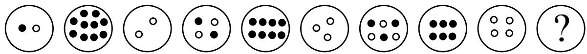

How many black circles are in the circle with the question mark? 

A. 0 

B. 2 

C. 3 

D. 4 

E. None of the above 

## Question 3

Kevin has 3 regular dice. Each dice has numbers from 1 to 6. Which of the following could not be the sum of the numbers on top of the 3 dice? 

A. 5 

B. 13 

C. 17 

D. 22 

E. All the above numbers are possible sum 

## Question 4

Find the top view of the figure on the right. 

A. 

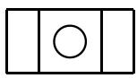

B. 

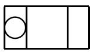

C. 

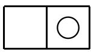

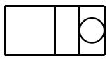

E. 

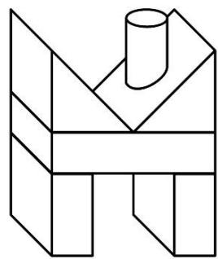

## Question 5

Mitchell, Jason, Tom and Mark race across a field. Mark finishes one place ahead of Jason. Mitchell finishes one place behind the winner. Who is the winner of the race? 

A. Mitchell 

B. Jason 

C. Tom 

D. Mark 

E. Jason and Mark 

## Question 6

In a toy store, cars are available in 5 different colours: blue, white, yellow, black and red. A car has either 2 or 4 doors. How many different versions of the car are available? 

A. 10 

B. 20 

D. 9 

E. None of the above 

## Question 7

Find the mirror image of the picture on the right. 

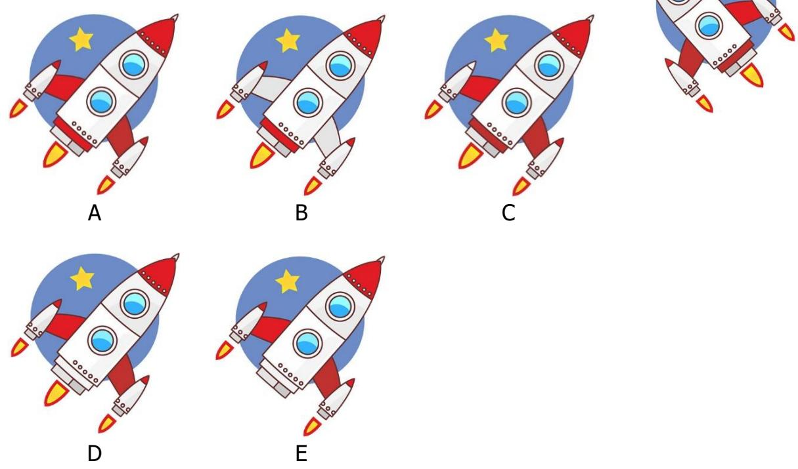

## Question 8

The four-digit number 32B9 is divisible by 3. If B is even, find the digit B. 

A. 0 

B. 2 

E. 8 

## Question 9

Study the picture below. 

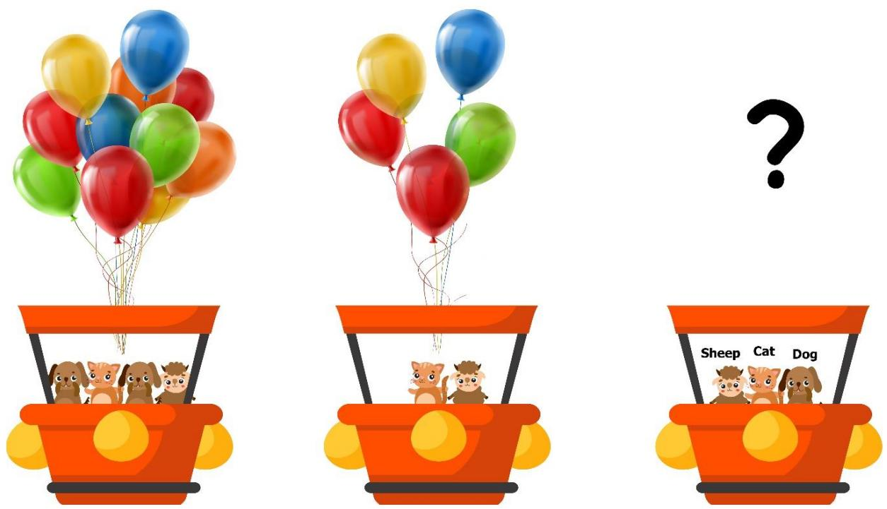

How many balloons are needed to carry the sheep, cat and dog? 

(All balloons are visible in the picture and the same size. None of the balloons are hidden.) 

A. 8 

B. 16 

D. 9 

E. None of the above 

## Question 10

A group of friends arrive at SASMO Cinema at 9:30. They watch any movie together. What is the earliest time they could finish watching both movies? 

<table><tr><td colspan="3">SASMO Cinema</td></tr><tr><td>Title</td><td>Duration</td><td>Show Times</td></tr><tr><td>Four Princesses</td><td>115 minutes</td><td>10:00, 12:15, 13:55, 17:05, 19:35</td></tr><tr><td>Dragon Fighter</td><td>105 minutes</td><td>9:00, 10:55, 14:10, 16:50, 19:35</td></tr></table>

A. 14:00 

B. 12:40 

C. 15:50 

D. 15:55 

E. None of the above 

Solution: 

Case 1: They watched Four Princesses first. 

The earliest time they can watch Four Princesses is 10:00. They finish at 11.55 and continue with Dragon Fighter at 14:10. The earliest time they could finish watching both movies is 15:55. 

Case 2: They watched Dragon Fighter first. 

The earliest time they can watch is 10:55 since they missed the first session at 9:00. They finish at 12:40 and continue with Four Princesses at 13:55. The earliest time they could finish watching both movies is 15:50 which is earlier than 15:55. 

Answer: (C) 

## Question 11

Find the missing shape in the diagram below. 

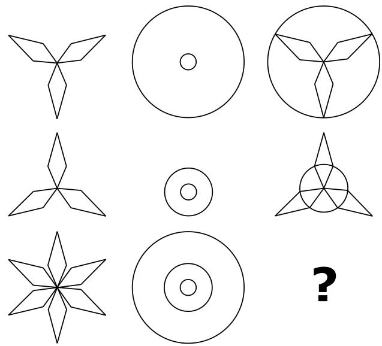

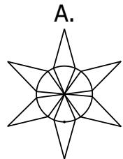

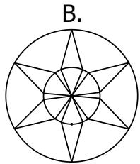

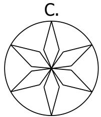

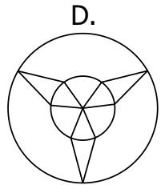

E. None of them

## Question 12

All the figures below are made up of identical squares. The area of the figure with the largest area is 48 cm2. What is the perimeter of the figure with the largest perimeter? 

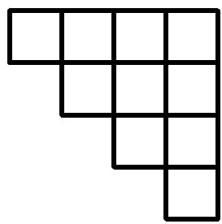

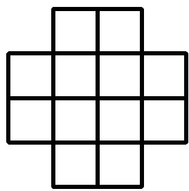

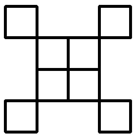

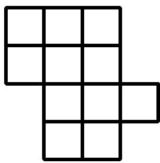

A. 46 cm 

B. 96 cm 

C. 32 cm 

D. 48 cm 

E. None of the above 

## Question 13

On Saturday, Diana read 102 pages of a book. On Sunday, she read 100 pages of the same book. Every day, she read 2 pages less than the day before. On which day of the week did she read exactly 4 pages of the book? 

A. Monday 

B. Wednesday 

C. Friday 

D. Sunday 

E. None of the above 

## Question 14

How many two-digit numbers can be divided by both 2 and 3 at the same time? 

A. 16 

B. 75 

C. 15 

D. 60 

E. None of the above 

## Question 15

Study the picture below. 

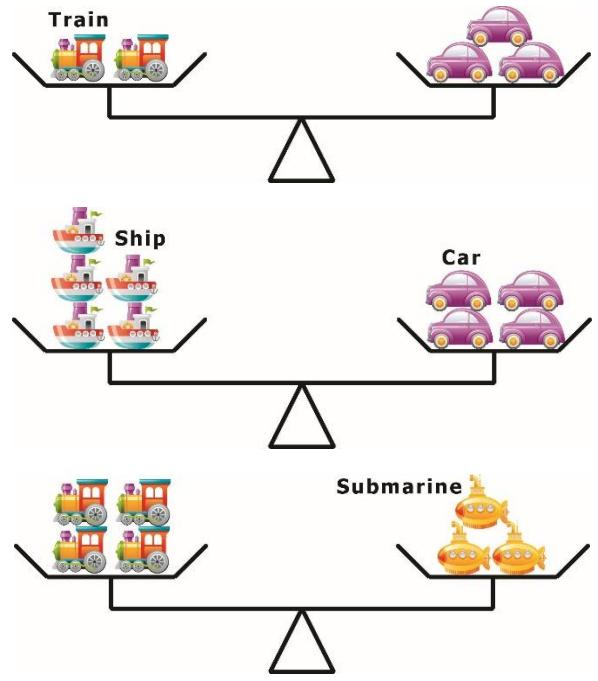

Which toy is the heaviest? 

A. Train 

B. Submarine 

E. None of the above 

## Section B (Correct answer – 4 points| Incorrect or No answer – 0 points)

When an answer is a 1-digit number, shade “0” for the tens, hundreds and thousands place. 

Example: if the answer is 7, then shade 0007 

When an answer is a 2-digit number, shade “0” for the hundreds and thousands place. 

Example: if the answer is 23, then shade 0023 

When an answer is a 3-digit number, shade “0” for the thousands place. 

Example: if the answer is 785, then shade 0785 

When an answer is a 4-digit number, shade as it is. 

Example: if the answer is 4196, then shade 4196 

## Question 16

How many rectangles are there in the picture below? 

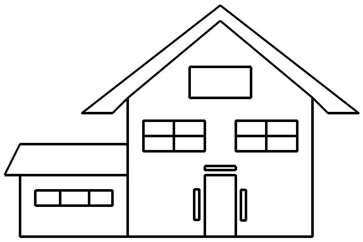

## Question 17

The operator ⊛ acts on two numbers to give the following outcomes: 

$$
2 \circledast 4 = 4 4
$$

$$
5 \circledast 7 = 1 0 4
$$

$$
1 \circledast 5 = 2 8
$$

$$
7 \circledast 1 0 = 1 4 6
$$

What is 6 ⊛ 12 equal to? 

## Question 18

The picture graph below shows the number of muffins 5 siblings have at first. 

<table><tr><td>Anastacia</td><td></td></tr><tr><td>Braiden</td><td></td></tr><tr><td>Clarke</td><td></td></tr><tr><td>Darla</td><td></td></tr><tr><td>Eddie</td><td></td></tr><tr><td colspan="2">Each  stands for 6 muffins.</td></tr></table>

Their mom takes all their muffins and then distributes equally among Anastacia, Braiden, Darla and Eddie. How many more muffins does Eddie have now than before? 

## Question 19

Andrew, Kim and Shaun have 256 stamps. Shaun has twice as many stamps as Kim. Andrew has 24 less stamps than Shaun. How many stamps does Andrew have? 

## Question 20

In the number sentence below, what is the value of ⊟? 

$$
\text {日} \times 6 + 1 3 - \text {日} = 1 7 + 4 6
$$

## Question 21

Use the clues below to find the number being described. 

• This number is a 3-digit number. 

• The sum of its digits is 15. 

• The digit in the tens place is twice the digit in the hundreds place. 

• The digit in the hundreds place is 1 more than the digit in the ones place. 

## Question 22

A group of children and adults went to a zoo. The price of an adult’s ticket is $8 and a child’s ticket is $7. The group paid $90 for their tickets. Given that there were less than 14 people in the group, how many adults were there? 

## Question 23

A book has 130 pages numbered from 1 to 130. How many digit “1” are there in all the page numbers of the book? 

## Question 24

Picture 2 shows the completed version of the puzzle in Picture 1. 

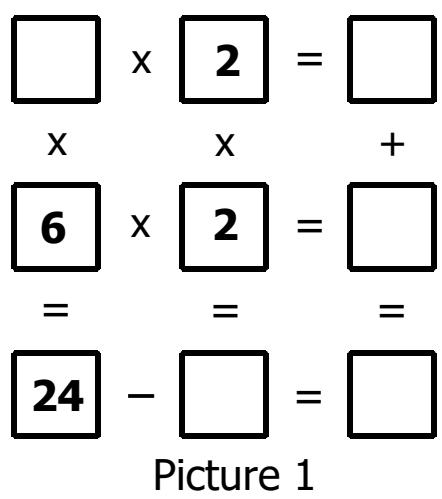

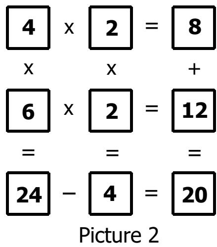

Complete the puzzle in Picture 3 and find the missing number “?”. 

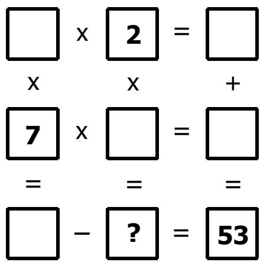

Picture 3

## Question 25

In the following, all the different letters stand for different digits. What is the value of $\mathsf { A } + \mathsf { B } + \mathsf { C } ?$ 

A B B B 

C C C 

A 

END OF PAPER 

## SASMO 2020 Primary 3 (Grade 3) Contest Questions

Section A (Correct answer – 2 points| No answer – 0 points| Incorrect answer – minus 1 point) 

## Question 1

What is the value of the following sum? 

$$
9 0 2 + 8 0 4 + 7 0 0 + 6 0 9 + 5 0 8 + 4 0 3 + 3 0 7 + 2 0 1 + 1 0 6
$$

A. 4450 

B. 4540 

C. 4500 

D. 4505 

E. None of the above 

## Question 2

Fill in the blank: _ is 2 tens 8 ones less than 5 tens 5 ones. 

A. 27 

B. 37 

C. 73 

D. 20 

E. None of the above 

## Question 3

Study the pattern below and find ‘?’. 

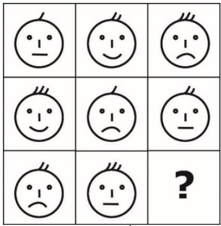

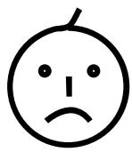

A

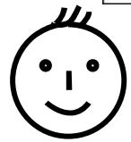

B

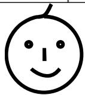

C

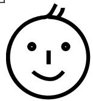

D

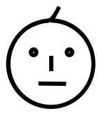

E

## Question 4

Alice’s first day in Caterpillar Club was Tuesday. She wants to throw a party on her 40th day in the club. If Alice attends the club every day, on which day of the week will the party be? 

A. Friday 

B. Saturday 

C. Sunday 

D. Monday 

E. None of the above 

## Question 5

How many multiples of 6 are there between 14 and 100? 

A. 16 

B. 15 

C. 14 

D. 13 

E. None of the above 

## Question 6

The diagram shows some cubes of the same size stacked at a corner of a room. How many cubes are there altogether? (Note: The floor is horizontal, and the two walls are vertical. There are no gaps or holes behind the visible cubes.) 

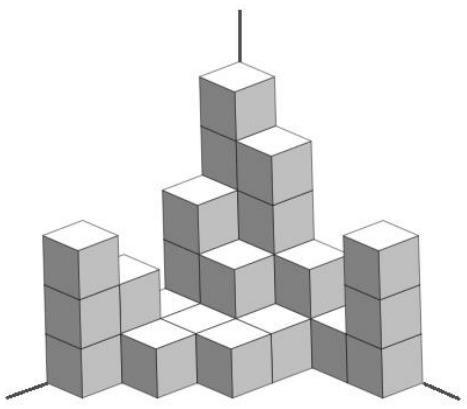

A. 20 

B. 30 

C. 31 

D. 29 

E. None of the above 

## Question 7

Alicia and Emily agreed to meet at the cinema at 3.55 pm. Emily left her house at 1.47 pm but arrived at the cinema 17 minutes late. How long was Emily’s journey from her house to the cinema? 

A. 189 minutes 

B. 172 minutes 

C. 216 minutes 

D. 206 minutes 

E. None of the above 

## Question 8

What is the missing number in the sequence below? 

1, 3, 7, 15, 31, _ 

A. 63 

B. 47 

C. 57 

D. 59 

E. None of the above 

## Question 9

If the four-digit number 3P78 is divisible by 3, how many possible values are there for P? 

A. 4 

B. 3 

C. 5 

D. 10 

E. None of the above 

## Question 10

In the fictional ”Odd Island”, all the numbers contain only odd digits. The order of the counting numbers is as follows 

$$
\begin{array}{l} 1, 3, 5, 7, \dots , 1 9, 3 1, 3 3, \dots \end{array}
$$

What is the 31st counting number in the island? 

A. 101 

B. 111 

C. 99 

D. 113 

E. None of the above 

## Question 11

The weights of four boys are 45 kg, 48 kg, 52 kg and 53 kg. Mason’s weight is an even number. Joshua’s weight is a multiple of 5. Christopher is not the heaviest and Mateo is not the lightest. Who is the heaviest among the four boys? 

A. Mason 

B. Joshua 

C. Christopher 

D. Mateo 

E. Impossible to determine 

## Question 12

Alex, John and Sam went to buy oranges. Alex paid $20, John paid $15, and Sam only paid $5. They bought 120 oranges altogether. They divided them in proportion to the amount of money each of them had paid. How many oranges did John get? 

A. 15 

B. 30 

C. 45 

D. 60 

E. None of the above 

## Question 13

A tank filled with 200 litres of water weighs 350 kg. The same tank filled with 150 litres of water weighs 315 kg. What is the weight of the empty tank? 

A. 120 kg 

B. 150 kg 

C. 165 kg 

D. 210 kg 

E. None of the above 

## Question 14

A city council decided to put lanterns on both sides of a river. The distance between any two neighbouring lanterns on each side must be 11 metres. The length of the river is 132 metres. The distance between the first and the last lantern on each side must be also 132 metres. How many lanterns will there be in total? 

A. 12 

B. 13 

C. 24 

D. 26 

E. None of the above 

## Question 15

Which picture below can form the pyramid shown on the right? 

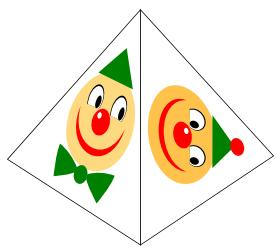

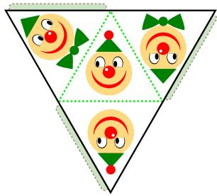

A

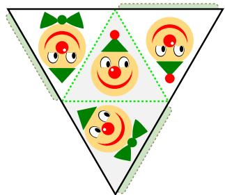

B

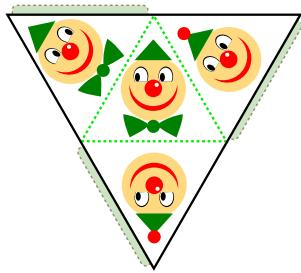

C

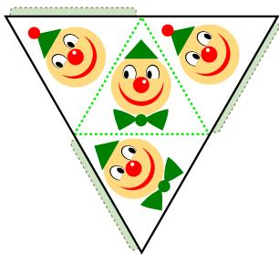

D

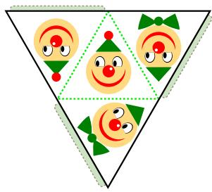

E

## Section B (Correct answer – 4 points| Incorrect or No answer – 0 points)

When an answer is a 1-digit number, shade “0” for the tens, hundreds and thousands place. 

Example: if the answer is 7, then shade 0007 

When an answer is a 2-digit number, shade “0” for the hundreds and thousands place. 

Example: if the answer is 23, then shade 0023 

When an answer is a 3-digit number, shade “0” for the thousands place. 

Example: if the answer is 785, then shade 0785 

When an answer is a 4-digit number, shade as it is. 

Example: if the answer is 4196, then shade 4196 

## Question 16

What is the sum of the first 30 numbers of the following pattern? 

50, 49, 48, 47, 46 … 

## Question 17

If you increase the length of a rectangle by 12 cm, you will get a rectangle with a perimeter of 38 cm. What is the perimeter of the original rectangle? 

## Question 18

How many triangles are there in the figure below? 

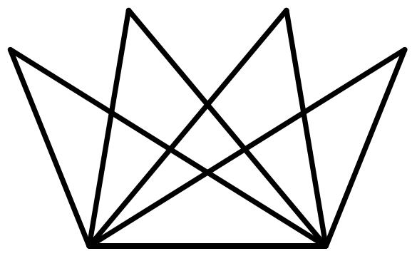

## Question 19

The graph below shows the number of guests who visited the National Museum in the first six months of 2019. How many people visited the museum during the six months? 

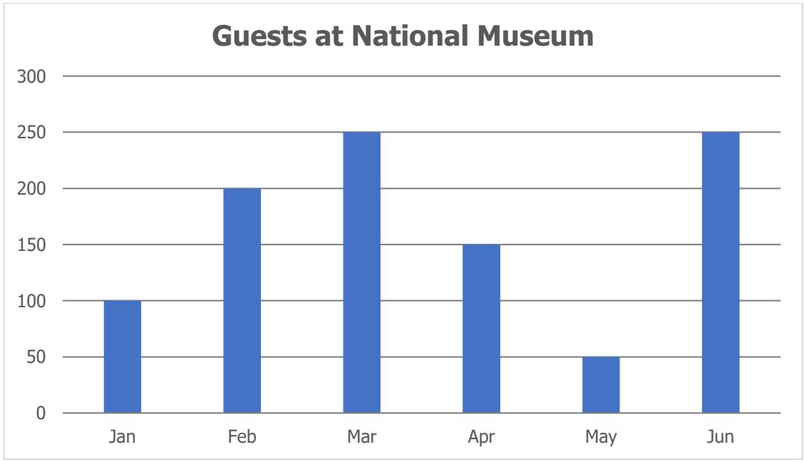

## Question 20

Study the picture below. 

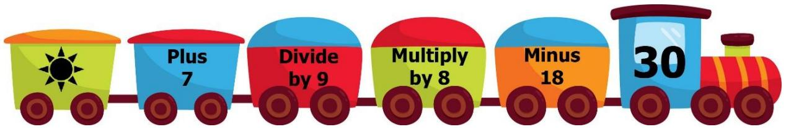

Find the value of 

## Question 21

If the area of the rectangle is 96 cm2, what is the area (in cm2) of the shaded region? 

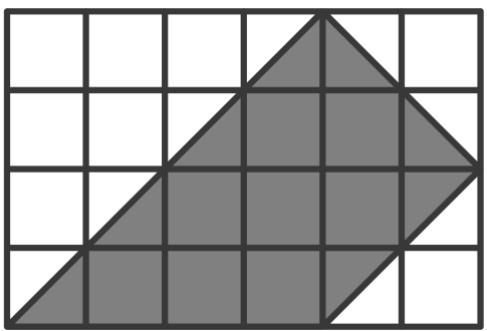

## Question 22

Brad bought 2 boxes of chocolates, 3 packets of sweets and 4 baskets of fruits at $29. A box of chocolates and a packet of sweets cost $4. A packet of sweets and a basket of fruits cost $6. How much does a box of chocolates cost? 

## Question 23

Diana made number 2020 using 22 matchsticks as shown below. How many digits are there in the largest possible whole number that she can construct using exactly 17 matchsticks? 

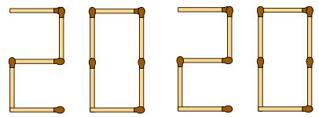

(The figures of all the digits from 0 to 9 are shown below.) 

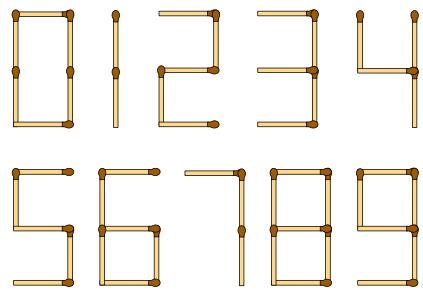

## Question 24

The numbers 2, 5, 8, 11, 14, 17 and 20 can be placed in the 7 circles below such that the sum along each straight line is the same and each number can only be used once. What is the largest possible value of this sum? 

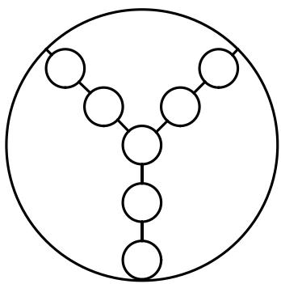

## Question 25

In the following, all the different letters stand for different digits. 

<table><tr><td></td><td>P</td><td>P</td><td>P</td></tr><tr><td>+</td><td>Q</td><td>Q</td><td>Q</td></tr><tr><td>R</td><td>Q</td><td>Q</td><td>R</td></tr></table>

Find the value of the 4-digit number RQQR. 

## END OF PAPER

## Solutions to SASMO 2019 Primary 3 (Grade 3)

## Question 1

Group the numbers and calculate. 

$$
(7 - 7) + (1 6 - 6) + (3 4 - 4) + (4 5 - 1 5) + 5 0 = 0 + 1 0 + 3 0 + 3 0 + 5 0 = \mathbf {1 2 0}
$$

Answer: (B) 

## Question 2

The pattern is as follows: 

<table><tr><td colspan="2"><eq>1^{st}</eq> circle</td><td colspan="2"><eq>4^{th}</eq> circle</td><td colspan="2"><eq>7^{th}</eq> circle</td></tr><tr><td></td><td>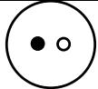</td><td></td><td>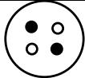</td><td></td><td>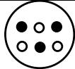</td></tr><tr><td colspan="2">1 black &amp; 1 white circles</td><td colspan="2">2 black &amp; 2 white circles</td><td colspan="2">3 black &amp; 3 white circles</td></tr></table>

<table><tr><td><eq>2^{nd}</eq> circle</td><td><eq>5^{th}</eq> circle</td><td><eq>8^{th}</eq> circle</td></tr><tr><td>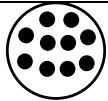</td><td>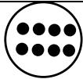</td><td>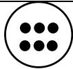</td></tr><tr><td>10 black circles</td><td>8 black circles</td><td>6 black circles</td></tr></table>

<table><tr><td><eq>3^{rd}</eq> circle</td><td><eq>6^{th}</eq> circle</td><td><eq>9^{th}</eq> circle</td></tr><tr><td>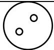</td><td>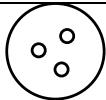</td><td></td></tr><tr><td>2 white circles</td><td>3 white circles</td><td>4 white circles</td></tr></table>

Hence the $1 0 ^ { \mathrm { t h } }$ circle must have 4 black & 4 white circles. 

Answer: (D) 

## Question 3

The smallest possible sum that can be obtained is 1 + 1 + 1 = 3 and the largest sum is $6 + 6 + 6 = 1 8$ . Thus, it is impossible to get the sum 22. 

Answer: (D) 

## Question 4

A. 

B. 

C. 

D. 

E. 

All the options, except $\complement ,$ have 4 vertical lines whereas the top view of the figure has 3 vertical lines. The answer is Option C. 

Answer: (C) 

## Question 5

Mitchell finishes second, one place behind the winner. So, the winner finishes one place ahead of Mitchell. Mark is not the winner as he finishes one place ahead of Jason. Hence the winner is Tom. 

Answer: (C) 

## Question 6

The following table shows the different combinations: 

<table><tr><td>Blue</td><td>√</td><td>√</td><td></td><td></td><td></td><td></td><td></td><td></td><td></td><td></td></tr><tr><td>White</td><td></td><td></td><td>√</td><td>√</td><td></td><td></td><td></td><td></td><td></td><td></td></tr><tr><td>Yellow</td><td></td><td></td><td></td><td></td><td>√</td><td>√</td><td></td><td></td><td></td><td></td></tr><tr><td>Black</td><td></td><td></td><td></td><td></td><td></td><td></td><td>√</td><td>√</td><td></td><td></td></tr><tr><td>Red</td><td></td><td></td><td></td><td></td><td></td><td></td><td></td><td></td><td>√</td><td>√</td></tr><tr><td>2-door</td><td>√</td><td></td><td>√</td><td></td><td>√</td><td></td><td>√</td><td></td><td>√</td><td></td></tr><tr><td>4-door</td><td></td><td>√</td><td></td><td>√</td><td></td><td>√</td><td></td><td>√</td><td></td><td>√</td></tr></table>

For instance, the first combination (2nd column) is a blue 2-door car, and the second combination $( 3 ^ { \mathsf { r d } }$ column) is a blue 4-door car. 

In total, 10 different versions of the car are available. 

Answer: (A) 

## Question 7

The circled spots are different from the mirror image of the picture on the right. 

A

B

C

D

E

Answer: (A) 

## Question 8

Using the divisibility test for 3, the sum of the digits $3 + 2 + 9 + \mathsf { B } = 1 4 + \mathsf { B }$ is divisible by 3. Since B is a single digit, B = 1, 4 and 7. But since B is even, B = 4. 

Answer: (C) 

## Question 9

In the second air balloon: 

1 cat + 1 sheep → 5 balloons 

In the first air balloon: 

1 cat + 1 sheep + 2 dogs → 11 balloons 

5 balloons 6 balloons 

1 dog → 6 ÷ 2 = 3 balloons 

1 cat + 1 sheep + 1 dog → 5 + 3 = 8 balloons 

Answer: (A) 

## Question 10

Case 1: They watched Four Princesses first. 

The earliest time they can watch Four Princesses is 10:00. They finish at 11.55 and continue with Dragon Fighter at 14:10. The earliest time they could finish watching both movies is 15:55. 

Case 2: They watched Dragon Fighter first. 

The earliest time they can watch is 10:55 since they missed the first session at 9:00. They finish at 12:40 and continue with Four Princesses at 13:55. The earliest time they could finish watching both movies is 15:50 which is earlier than 15:55. 

Answer: (C) 

## Question 11

The pattern is as follows: 

In the first row, the third image is formed by combining the second image with the first and removing the smallest circle. 

In the second row, the third image is formed by combining the second image with the first and removing the smallest circle. 

Following the same pattern in the third row, we combine the second image with the first and remove the smallest circle. Thus, Option B will be the missing shape. 

Answer: (B) 

## Question 12

Draw a table and count the number of squares and sides in each figure. 

<table><tr><td>Figure</td><td>No. of squares</td><td>The largest area</td><td>No. of sides</td><td>The largest perimeter</td></tr><tr><td>1</td><td>10</td><td></td><td>16</td><td></td></tr><tr><td>2</td><td>12</td><td>√</td><td>16</td><td></td></tr><tr><td>3</td><td>8</td><td></td><td>24</td><td>√</td></tr><tr><td>4</td><td>11</td><td></td><td>16</td><td></td></tr></table>

Figure 2 has the largest area as it is made up of the greatest number of squares. 

Area of each identical square = 48 cm2 ÷ 12 = 4 cm2 

Length of each identical square = 2 cm 

Figure 3 has the largest perimeter because it has the most number of sides (24) compared to the other three figures (16). 

Perimeter of Figure 3 = 24 x 2 cm = 48 cm 

Answer: (D) 

## Question 13

The following table shows the numbers pages read in the first 2 weeks. 

<table><tr><td>Monday</td><td>Tuesday</td><td>Wednesday</td><td>Thursday</td><td>Friday</td><td>Saturday</td><td>Sunday</td></tr><tr><td></td><td></td><td></td><td></td><td></td><td>102</td><td>100</td></tr><tr><td>98</td><td>96</td><td>94</td><td>92</td><td>90</td><td>88</td><td>86</td></tr><tr><td>84</td><td>82</td><td>80</td><td>78</td><td>76</td><td>74</td><td></td></tr></table>

Notice from the table above that Diana read 14 pages less every week. 

Next Saturday, Diana read 102 − 14 = 88 and the following Saturday, she read 88 − $1 4 = 7 4$ . 

She read 74 − 14 − 14 − 14 − 14 − 14 = 4 pages on Saturday. 

Answer: (E) 

## Question 14

If a number can be divided by both 2 and 3, then it can be divided by 6. The largest two-digit number that can be divided by 6 is 96, which is the 16th multiple of 6. In other words, there are 16 numbers less than 100 which can be divided by 6. However, these 16 numbers include the one-digit number ‘6’. Thus, there are only 16 – 1 = 15 two-digit numbers that can be divided by both 2 and 3 at the same time. 

Answer: (C) 

## Question 15

A train is heavier than a car since 2 trains are needed to balance 3 cars. 

A car is heavier than a ship since 4 cars are needed to balance 5 ships. 

A submarine is heavier than a train since 3 submarines are needed to balance 4 trains. 

Arranging from the lightest to the heaviest 

$\mathsf { S h i p - C a r - T r a i n - S u b m a r i n e } ,$ 

we find that Submarine is the heaviest among the different types of toys. 

Answer: (B) 

## Question 16

<table><tr><td>Type of Rectangle</td><td>1-part</td><td>2-part</td><td>3-part</td><td>4-part</td></tr><tr><td>Example</td><td></td><td></td><td></td><td></td></tr><tr><td>Quantity</td><td>16</td><td>10</td><td>1</td><td>3</td></tr></table>

Total = 16 + 10 + 1 + 3 = ???? rectangles 

Answer: 30 

## Question 17

The operator ⊛ performs the following: 

: It multiples the number on the left by 2. 

: It multiplies the difference between the two numbers by 2. Then product is placed next to the number obtained in step 1 

We can see that the operator ⊛ satisfies all the equations in the question. 

Therefore, $6 \mathbf { \textcircled { * } } 1 2 = ( 2 \times 6 ) { \bigl ( } 2 \times ( 1 2 - 6 ) { \bigr ) } = 1 2 1 2 .$ 

Answer: 1212 

## Question 18

Initially, the 5 siblings had 24 $\times 6 = 1 4 4$ muffins altogether. 

Then, their mom distributed $1 4 4 \div 4 = 3 6$ muffins to 4 of them and Eddie has 36 muffins now. 

From the picture graph, Eddie had $4 ^ { \circ } \times 6 = 2 4$ muffins at first. 

Eddie has $3 6 - 2 4 = 1 2$ more muffins now than before. 

Answer: 12 

## Question 19

Using the Model Method, let the number of stamps Kim has be 1 unit. Then Shaun has 2 units and Andrew has 24 less than 2 units. 

5 units = 256 + 24 = 280 

1 unit = 280 ÷ 5 = 56 

Andrew has 56 + 56 − 24 = ???? stamps. 

Answer: 88 

## Question 20

$\boxed { \div } \times 6 + 1 3 - \boxed { \div } = 1 7 + 4 6$ 

$\boxed { \times 6 - \boxminus + 1 3 = 1 7 + 4 6 = 6 3 }$ 

$\boxed { \ d } \times 5 + 1 3 = 6 3$ 

$\boxed { \times } \times 5 = 6 3 - 1 3 = 5 0$ 

$\boldsymbol { \mathrm { \Pi } } \boldsymbol { \mathrm { \Pi } } = 5 0 \div 5 = \mathbf { 1 0 }$ 

$\mathsf { A n s w e r : 1 0 }$ 

## Question 21

Using the Model Method, let the digit in the hundreds place be 1 unit. Then the digit in the tens place is 2 units and the one digit is 1 less than 1 unit. 

4 units = 15 + 1 = 16 

1 unit = 16 ÷ 4 = 4 

Hence the hundreds digit is 4, the tens digit is 4 + 4 = 8, and the ones digit is 4 − 1 = 3. The number is 483. 

Answer: 483 

## Question 22

The largest number of adults could be is $88 ÷ $8 = 11. However, no ticket could be bought for the remaining $90 − $88 = $2. 

The following table shows whether $90 can be spent when the number of adults is 10 or less. 

<table><tr><td>No. of adults</td><td>Total cost of adults&#x27; tickets</td><td>The remaining money</td><td>Children&#x27;s ticket</td></tr><tr><td>10</td><td>$8 × 10 = $80</td><td>$90 – $80 = $10</td><td>All $10 cannot be spent.</td></tr><tr><td>9</td><td>$8 × 9 = $72</td><td>$90 – $72 = $18</td><td>All $18 cannot be spent.</td></tr><tr><td>8</td><td>$8 × 8 = $64</td><td>$90 – $64 = $26</td><td>All $26 cannot be spent.</td></tr><tr><td>7</td><td>$8 × 7 = $56</td><td>$90 – $56 = $34</td><td>All $34 cannot be spent.</td></tr><tr><td>6</td><td>$8 × 6 = $48</td><td>$90 – $48 = $42</td><td>all $42 ÷ $7 = 6 can be spent</td></tr></table>

Answer: 6 

## Question 23

Number of digit ‘1’s in the ones places: 1, 11, 21, 31, 41, 51, 61, 71, 81, 91, 101, 111, 121 – 13 numbers 

Number of digit ‘1’s in the tens places: 10, 11, 12, 13, 14, 15, 16, 17, 18, 19, 110, 111, 112, 113, 114, 115, 116, 117, 118, 119 – 20 numbers 

Number of digit ‘1’s in the hundreds place: 100, 101, 102, …, 129, 130 – 31 numbers 

Total: 13 + 20 + 31 = 64 

Answer: 64 

## Question 24

Let us label the empty boxes with A, B, C, D, E and F. 

A must be greater than 7 since 7 × A is greater than 53. Then B = A × 2 is greater than 7 × 2 = 14, and D is less than 53 − 14 = 49. If D = 7 × C is less than 49, then C is less than 49 ÷ 7 = 7. 

From ?? × 7 − 2 × ?? = 53, ?? must be less than 10; otherwise, C will be greater than 7. Hence ?? = 8 ???? 9. 

?? = 8 doesn’t have any solutions. 

If ?? = 9, then ?? = 5 and ?? = ????. 

Answer: 10 

$$
\begin{array}{l} \begin{array}{c c} \framebox {\mathbf {A}} & \times \\ \mathrm{x} & \mathrm{x} \end{array} = \begin{array}{c c} \framebox {\mathbf {2}} & = \\ \mathrm{x} & + \end{array} \\ \begin{array}{c} \framebox {7} \\ = \end{array} \times \begin{array}{c} \framebox {\mathbf {C}} \\ = \end{array} = \begin{array}{c} \framebox {\mathbf {D}} \\ = \end{array} \\ \boxed {\mathsf {E}} - \boxed {\mathsf {F}} = \boxed {\mathsf {5 3}} \\ \end{array}
$$

## Question 25

A must be 1; otherwise, (2?????? − ??????), (3?????? − ??????), … , (9?????? − ??????) will be greater than 1000. 

Rewrite the subtraction as addition. 

<table><tr><td></td><td>C</td><td>C</td><td>C</td></tr><tr><td>+</td><td></td><td></td><td>A</td></tr><tr><td>A</td><td>B</td><td>B</td><td>B</td></tr></table>

Since A = 1, then C = 9 and B = 0. 

$$
A + B + C = 1 + 0 + 9 = \mathbf {1 0}
$$

Answer: 10 

## Solutions to SASMO 2020 Primary 3 (Grade 3)

## Question 1

Pairing numbers to make tens or hundreds: 

$$
9 0 2 + 5 0 8 = 1 4 1 0
$$

$$
8 0 4 + 1 0 6 = 9 1 0
$$

$$
6 0 9 + 2 0 1 = 8 1 0
$$

$$
4 0 3 + 3 0 7 = 7 1 0
$$

$$
\text { Sum } = 1 4 1 0 + 9 1 0 + 8 1 0 + 7 1 0 + 7 0 0 = 4 5 4 0
$$

Answer: (B) 

## Question 2

5 tens 5 ones = 5 × 10 + 5 = 55 

2 tens 8 ones = 2 × 10 + 8 = 28 

$$
5 5 - 2 8 = 2 7
$$

Answer: (A) 

## Question 3

The same pattern repeats in each row of 3 figures but in different orders as illustrated in the table below: 

<table><tr><td>Part</td><td>Pattern</td></tr><tr><td>Hair</td><td>1, 2, 3</td></tr><tr><td>Mouth</td><td>smiley, sad, horizontal</td></tr></table>

So, the missing figure should be Option C which has 1 hair and a smiley face. 

Answer: (C) 

## Question 4

Every one week or 7 days later will return to the same day. 

Alice wants to throw a party on her $4 0 ^ { \mathrm { t h } }$ day or 39 days later in the club. 

39 ÷ 7 = 5R4 means that 39 days later will be 5 weeks and 4 days after Tuesday. 

5 weeks after Tuesday is still Tuesday and 4 days after Tuesday is Saturday. 

Answer: (B) 

## Question 5

From 1 to 100, there are 16 (100 ÷ 6 = 16??4) multiples of 6. 

From 1 to 14, there are 2 (6 and 12) multiples of 6. 

Thus, there are 16 − 2 = ???? multiples of 6 between 14 and 100. 

Answer: (C) 

## Question 6

Let us count the cubes on each stack from left to right. 

There are 3 cubes in the 1st stack. 

There are 3 cubes in the $2 ^ { \mathsf { n d } }$ stack. 

There are 3 cubes in the $3 ^ { \mathsf { r d } }$ stack. 

There are 6 cubes in the 4th stack. 

There are 5 + 4 + 2 + 1 + 3 = 15 cubes in the $5 ^ { \mathrm { t h } }$ stack. 

In total, there are 3 + 3 + 3 + 6 + 15 = ???? cubes. 

Answer: (B) 

## Question 7

Emily arrived at the cinema 17 minutes after 3.55 pm, which is 4.12 pm. There are 2 hours or 120 minutes from 1.47 pm to 3.47 pm. There are 25 minutes from 3.47 pm to 4.12 pm. Thus, Emily’s journey from her house to the cinema was 120 + 25 = 145 minutes long. 

Answer: (E) 

## Question 8

The pattern is as follows: 

$$
1 \stackrel {+ 2} {\rightarrow} 3 \stackrel {+ 4} {\rightarrow} 7 \stackrel {+ 8} {\rightarrow} 1 5 \stackrel {+ 1 6} {\longrightarrow} 3 1 \stackrel {+ 3 2} {\longrightarrow} 6 3,
$$

where each addition is twice the previous one. 

The next number in the sequence is 63. 

Answer: (A) 

## Question 9

According to the Divisibility Rule of 3, 3P78 is divisible by 3 if the sum of its digits 3 + P + 7 + 8 = 18 + P is divisible by 3. The multiples of 3 are 

3, 6, 9, 12, 15, 18, 21, 24, 27, 30 … … 

$$
\begin{array}{l} 1 8 + \mathrm{P} = 1 8 \rightarrow \mathrm{P} = 0 \\ 1 8 + \mathrm{P} = 2 1 \rightarrow \mathrm{P} = 3 \\ 1 8 + \mathrm{P} = 2 4 \rightarrow \mathrm{P} = 6 \\ 1 8 + \mathrm{P} = 2 7 \rightarrow \mathrm{P} = 9 \\ \end{array}
$$

There are 4 possible values for P. 

Answer: (A) 

## Question 10

The first 31 counting numbers are: 

1, 3, 5, 7, 9, 

11, 13, 15, 17, 19, 

31, 33, 35, 37, 39, 

51, 53, 55, 57, 59, 

71, 73, 75, 77, 79, 

91, 93, 95, 97, 99 

111 

Thus, the 31st counting number is 111. 

Answer: (B) 

## Question 11

The heaviest boy is 53 kg heavy, which is an odd-numbered weight. 

Mason’s weight is an even number, so he is not the heaviest. 

Joshua’s weight is a multiple of 5 which is 45 kg. So, he is not the heaviest. 

Christopher is not the heaviest as per the statement. 

Thus, the remaining boy, Mateo is the heaviest. 

Answer: (D) 

## Question 12

They paid altogether $\$ 20+\$ 15+55=940$ for 120 oranges. 

$$
\$ 40 \rightarrow 120 \text{ oranges }
$$

$$
\$ 1 \rightarrow 120 \div 4 = 3 \text{ oranges }
$$

John paid $\$ 15$ oranges 

Answer: (C) 

## Question 13

$$
\mathrm{Tank} + 2 0 0 \text { litres   of   water } = 3 5 0 \mathrm{kg}
$$

$$
\mathrm{Tank} + 1 5 0 \text { litres   of   water } = 3 1 5 \mathrm{kg}
$$

Subtracting the equations above: 50 litres of water = 35 kg 

$$
1 5 0 \text { litres   of   water } = 3 5 \mathrm{kg} \times 3 = 1 0 5 \mathrm{kg}
$$

$$
\mathrm{Tank} + 1 5 0 \text { litres   of   water } = \mathrm{Tank} + 1 0 5 \mathrm{kg} = 3 1 5 \mathrm{kg}
$$

$$
\text { Thus,   } \mathrm{Tank} = 3 1 5 \mathrm{kg} - 1 0 5 \mathrm{kg} = 2 1 0 \mathrm{kg}
$$

Answer: (D) 

## Question 14

There are 132 ÷ 11 = 12 gaps among all the lanterns on each side of the river. 

There are 12 + 1 = 13 lanterns on each side of the river. 

Thus, there are 13 × 2 = ???? lanterns in total. 

Answer: (D) 

## Question 15

Let us describe the two faces of the pyramid. 

## Face 1:

• It has a dot on top of its hat 

• It has a white dot on the left of its nose. 

• Its eyes look to the right. 

## Face 2:

• It doesn’t have a dot on top of its hat. 

• It has a white dot on the left of its nose. 

• Its eyes look to the right. 

• It has a bow tie. 

Only Option B has both faces. 

Answer: (B) 

## Question 16

We notice that the $2 ^ { \mathsf { n d } }$ number is (50 − 1), the third number is 50 − 2 and so on. 

Hence the $3 0 ^ { \mathrm { t h } }$ number is $5 0 - 2 9 = 2 1$ and the sum is 

$$
\begin{array}{l} 5 0 + 4 9 + 4 8 \dots \dots + 2 3 + 2 2 + 2 1 \\ = (5 0 + 2 1) + (4 9 + 2 2) + (4 8 + 2 3) + \dots + (3 6 + 3 5) \\ = 7 1 \times (3 0 \div 2) \\ = 7 1 \times 1 5 \\ = 1 0 6 5. \\ \end{array}
$$

Answer: 1065 

## Question 17

A rectangle has 2 lengths and 2 widths. 

When the length of the rectangle is increased by 12 cm for each side, its perimeter is increased by 12 × 2 = 24 cm. 

So, original perimeter + 24 cm = 38 cm 

Working backwards: original perimeter = 38 cm − 24 cm = ???? ???? 

Answer: 14 

## Question 18

1-part: 7 triangles 

2-part: 10 triangles 

3-part: 6 triangles 

4-part: 5 triangles 

6-part: 2 triangles 

Total number of triangles = 7 + 10 + 6 + 5 + 2 = ???? 

Answer: 30 

## Question 19

According to the diagram, there are 2 units of guests in January, 4 units in February, 5 units in March, 3 units in April, 1 unit in May and 5 units in June. 

In total, there are 2 + 4 + 5 + 3 + 1 + 5 = 20 units 

As each unit represents 50 guests, 20 ?????????? = 20 × 50 = ???????? guests. 

Answer: 1000 

## Question 20

Working backwards, we reverse all operations to obtain the unknown number . 

$$
3 0 + 1 8 = 4 8
$$

$$
4 8 \div 8 = 6
$$

$$
6 \times 9 = 5 4
$$

$$
5 4 - 7 = 4 7
$$

Answer: 47 

## Question 21

There are 6 squares along the length and 4 squares along the width. So, the rectangle is made of altogether 6 × 4 = 24 squares. 

Area of each square= 96 cm2÷ 24 = 4 cm2 

The shaded region comprises of 8 squares and 8 half square triangles. The 8 half square triangles can be combined to 4 squares. Thus, the shaded region comprises of 8 + 4 = 12 squares. 

Area of shaded region=Area of 12 squares= 12 × 4 = ???? ????2 

Answer: 48 cm2 

## Question 22

It is given that 

$$
\begin{array}{l} 2 9 = 2 \text { boxes   of   chocolates } + 3 \text { packets   of   sweets } + 4 \text { baskets   of   fruits } \\ = 2 \text {   boxes   } + 3 \text {   packets   } + 4 \text {   baskets   } \\ = 2 \text {boxes} + 2 \text {packets} + 1 \text {packet} + 1 \text {basket} + 3 \text {baskets} \\ = 2 \times (1 \text { boxes } + 1 \text { packet }) + (1 \text { packet } + 1 \text { basket }) + 3 \text { baskets } \\ = 2 \times 4 + 6 + 3 \text {   baskets   } = 1 4 + 3 \text {   baskets. } \\ \end{array}
$$

Hence 

$$
3 \text { baskets } = 2 9 - 1 4 = 1 5 \text { or } 1 \text { basket } = 1 5 \div 3 = 5
$$

$$
1 \text {   packet   } = 6 - 5 = 1 \text {   and   } 1 \text {   box   } = 4 - 1 = 3.
$$

Answer: $3 

## Question 23

To obtain the largest possible whole number, Diana needs to construct as many digits as possible. The digit ‘1’ requires the least number of matchsticks which is 2. The digit ‘7’ requires the second least number of matchsticks which is 3. Thus, the largest possible number that she can construct using exactly 17 matchsticks is 71,111,111. 

The number 71,111,111 contains 8 digits. 

Answer: 8 

## Question 24

There will be a total of 3 sums in this figure, and these 3 sums have the same value. 

Hence, the total value of the 3 sums in the figure = 3 × (sum of each straight line), which must be a multiple of 3. 

On the other hand, the total value of the 3 sums in the figure can also be equal to the sum of all 7 numbers in the question + 2 times of the middle number 

$$
= 7 7 + 2 \times (\text { middle   number }).
$$

Thus, 77 + 2 × middle number = (sum of each straight line) × 3 

Hence, to obtain the greatest sum, the middle number must be of the greatest possible value such that (77 + 2 × middle number) is a multiple of 3. The largest number in the question is 20, and the greatest possible sum is $7 7 + 2 \times 2 0 = 1 1 7 =$ $3 \times 3 9$ . 

One possible arrangement is (2, 14, 20), (5, 14, 20) and (8, 11, 20). 

Answer: 39 

## Question 25

A three-digit number plus a three-digit number can only result in a four-digit number that starts with 1. Hence R must be 1. 

In ones place addition, the last digit of P + Q is 1 which means that ?? + ?? = 11 since ?? + ?? is greater than 1. 

Then in tens place addition P + Q = 11 and there is a carryover of 1 from the ones place addition. Thus, Q = 2 and RQQR is 1221. 

Answer: 1221 