# Primary 3 (Grade 3) – GEP Practice

# 2020 Contest Problems with Full Solutions

Authors: 

Henry Ong, BSc, MBA, CMA 

Merlan Nagidulin, BSc 

© Singapore International Mastery Contests Centre (SIMCC) 

## All Rights Reserved

No part of this work may be reproduced or transmitted by any means, electronic or mechanical, including photocopying and recording, or by any information or retrieval system, without the prior permission of the publisher. 

## Section A (Correct answer – 2 points| No answer – 0 points| Incorrect answer – minus 1 point)

## Question 1

What is the value of the following sum? 

$$
9 0 2 + 8 0 4 + 7 0 0 + 6 0 9 + 5 0 8 + 4 0 3 + 3 0 7 + 2 0 1 + 1 0 6
$$

A. 4450 

B. 4540 

C. 4500 

D. 4505 

E. None of the above 

## Question 2

Fill in the blank: _ is 2 tens 8 ones less than 5 tens 5 ones. 

A. 27 

B. 37 

D. 20 

E. None of the above 

## Question 3

Study the pattern below and find ‘?’. 

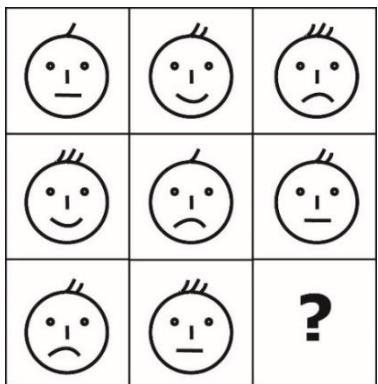

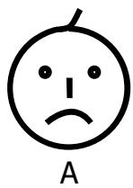

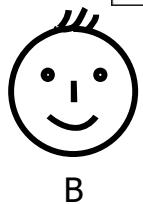

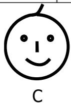

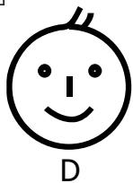

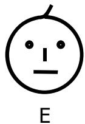

## Question 4

Alice’s first day in Caterpillar Club was Tuesday. She wants to throw a party on her 40th day in the club. If Alice attends the club every day, on which day of the week will the party be? 

A. Friday 

B. Saturday 

C. Sunday 

D. Monday 

E. None of the above 

## Question 5

How many multiples of 6 are there between 14 and 100? 

A. 16 

B. 15 

C. 14 

D. 13 

E. None of the above 

## Question 6

The diagram shows some cubes of the same size stacked at a corner of a room. How many cubes are there altogether? (Note: The floor is horizontal, and the two walls are vertical. There are no gaps or holes behind the visible cubes.) 

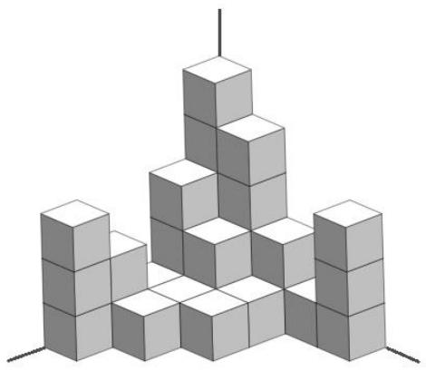

A. 20 

B. 30 

C. 31 

D. 29 

E. None of the above 

## Question 7

Alicia and Emily agreed to meet at the cinema at 3.55 pm. Emily left her house at 1.47 pm but arrived at the cinema 17 minutes late. How long was Emily’s journey from her house to the cinema? 

A. 189 minutes 

B. 172 minutes 

C. 216 minutes 

D. 206 minutes 

E. None of the above 

## Question 8

What is the missing number in the sequence below? 

1, 3, 7, 15, 31, _ 

A. 63 

B. 47 

C. 57 

D. 59 

E. None of the above 

## Question 9

If the four-digit number 3P78 is divisible by 3, how many possible values are there for P? 

A. 4 

B. 3 

C. 5 

D. 10 

E. None of the above 

## Question 10

In the fictional ”Odd Island”, all the numbers contain only odd digits. The order of the counting numbers is as follows 

$$
\begin{array}{l} 1, 3, 5, 7, \dots , 1 9, 3 1, 3 3, \dots \end{array}
$$

What is the 31st counting number in the island? 

A. 101 

B. 111 

C. 99 

D. 113 

E. None of the above 

## Question 11

The weights of four boys are 45 kg, 48 kg, 52 kg and 53 kg. Mason’s weight is an even number. Joshua’s weight is a multiple of 5. Christopher is not the heaviest and Mateo is not the lightest. Who is the heaviest among the four boys? 

A. Mason 

B. Joshua 

C. Christopher 

D. Mateo 

E. Impossible to determine 

## Question 12

Alex, John and Sam went to buy oranges. Alex paid $20, John paid $15, and Sam only paid $5. They bought 120 oranges altogether. They divided them in proportion to the amount of money each of them had paid. How many oranges did John get? 

A. 15 

B. 30 

C. 45 

D. 60 

E. None of the above 

## Question 13

A tank filled with 200 litres of water weighs 350 kg. The same tank filled with 150 litres of water weighs 315 kg. What is the weight of the empty tank? 

A. 120 kg 

B. 150 kg 

C. 165 kg 

D. 210 kg 

E. None of the above 

## Question 14

A city council decided to put lanterns on both sides of a river. The distance between any two neighbouring lanterns on each side must be 11 metres. The length of the river is 132 metres. The distance between the first and the last lantern on each side must be also 132 metres. How many lanterns will there be in total? 

A. 12 

B. 13 

C. 24 

D. 26 

E. None of the above 

## Question 15

Which picture below can form the pyramid shown on the right? 

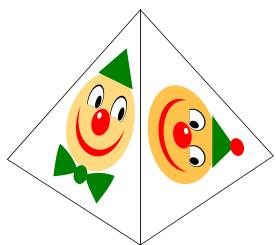

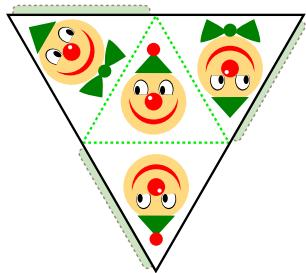

A

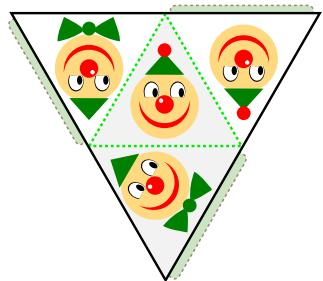

B

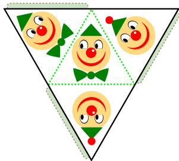

C

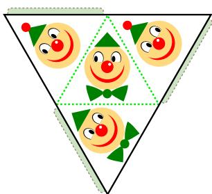

D

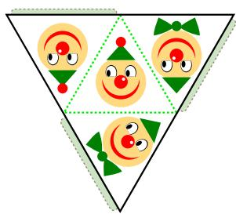

E

## Section B (Correct answer – 4 points| Incorrect or No answer – 0 points)

When an answer is a 1-digit number, shade “0” for the tens, hundreds and thousands place. 

Example: if the answer is 7, then shade 0007 

When an answer is a 2-digit number, shade “0” for the hundreds and thousands place. 

Example: if the answer is 23, then shade 0023 

When an answer is a 3-digit number, shade “0” for the thousands place. 

Example: if the answer is 785, then shade 0785 

When an answer is a 4-digit number, shade as it is. 

Example: if the answer is 4196, then shade 4196 

## Question 16

What is the sum of the first 30 numbers of the following pattern? 

50, 49, 48, 47, 46 … 

## Question 17

If you increase the length of a rectangle by 12 cm, you will get a rectangle with a perimeter of 38 cm. What is the perimeter of the original rectangle? 

## Question 18

How many triangles are there in the figure below? 

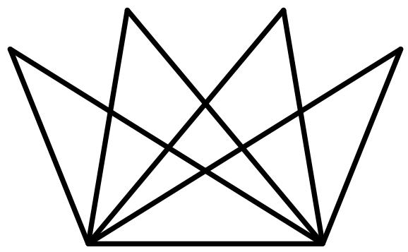

## Question 19

The graph below shows the number of guests who visited the National Museum in the first six months of 2019. How many people visited the museum during the six months? 

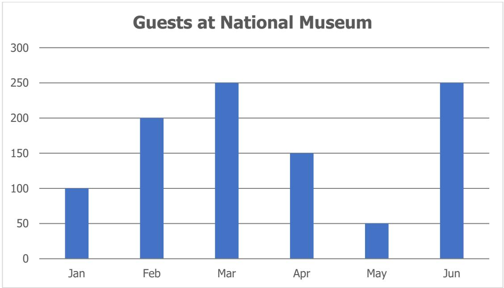

## Question 20

Study the picture below. 

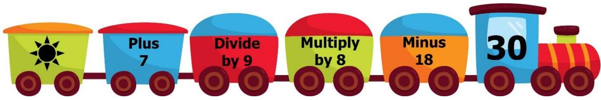

Find the value of 

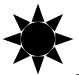

## Question 21

If the area of the rectangle is 96 cm2, what is the area (in cm2) of the shaded region? 

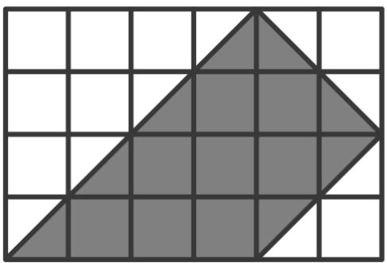

## Question 22

Brad bought 2 boxes of chocolates, 3 packets of sweets and 4 baskets of fruits at $29. A box of chocolates and a packet of sweets cost $4. A packet of sweets and a basket of fruits cost $6. How much does a box of chocolates cost? 

## Question 23

Diana made number 2020 using 22 matchsticks as shown below. How many digits are there in the largest possible whole number that she can construct using exactly 17 matchsticks? 

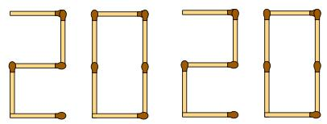

(The figures of all the digits from 0 to 9 are shown below.) 

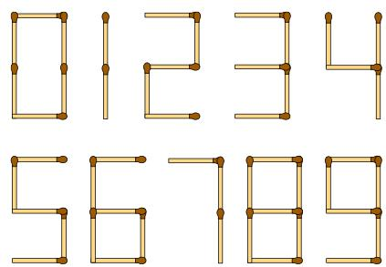

## Question 24

The numbers 2, 5, 8, 11, 14, 17 and 20 can be placed in the 7 circles below such that the sum along each straight line is the same and each number can only be used once. What is the largest possible value of this sum? 

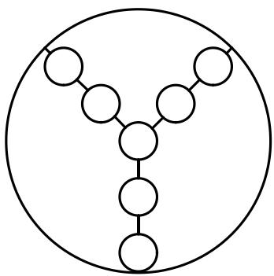

## Question 25

In the following, all the different letters stand for different digits. 

<table><tr><td></td><td>P</td><td>P</td><td>P</td></tr><tr><td>+</td><td>Q</td><td>Q</td><td>Q</td></tr><tr><td>R</td><td>Q</td><td>Q</td><td>R</td></tr></table>

Find the value of the 4-digit number RQQR. 

## Solutions to SASMO 2020 Primary 3 (Grade 3)

## Question 1

Pairing numbers to make tens or hundreds: 

$$
9 0 2 + 5 0 8 = 1 4 1 0
$$

$$
8 0 4 + 1 0 6 = 9 1 0
$$

$$
6 0 9 + 2 0 1 = 8 1 0
$$

$$
4 0 3 + 3 0 7 = 7 1 0
$$

$$
\text { Sum } = 1 4 1 0 + 9 1 0 + 8 1 0 + 7 1 0 + 7 0 0 = 4 5 4 0
$$

Answer: (B) 

## Question 2

5 tens 5 ones = 5 × 10 + 5 = 55 

2 tens 8 ones = 2 × 10 + 8 = 28 

$$
5 5 - 2 8 = 2 7
$$

Answer: (A) 

## Question 3

The same pattern repeats in each row of 3 figures but in different orders as illustrated in the table below: 

<table><tr><td>Part</td><td>Pattern</td></tr><tr><td>Hair</td><td>1, 2, 3</td></tr><tr><td>Mouth</td><td>smiley, sad, horizontal</td></tr></table>

So, the missing figure should be Option C which has 1 hair and a smiley face. 

Answer: (C) 

## Question 4

Every one week or 7 days later will return to the same day. 

Alice wants to throw a party on her $4 0 ^ { \mathrm { t h } }$ day or 39 days later in the club. 

$3 9 \div 7 = 5 { \mathrm { R } } 4$ means that 39 days later will be 5 weeks and 4 days after Tuesday. 

5 weeks after Tuesday is still Tuesday and 4 days after Tuesday is Saturday. 

Answer: (B) 

## Question 5

From 1 to 100, there are 16 (100 ÷ 6 = 16??4) multiples of 6. 

From 1 to 14, there are 2 (6 and 12) multiples of 6. 

Thus, there are 16 − 2 = ???? multiples of 6 between 14 and 100. 

Answer: (C) 

## Question 6

Let us count the cubes on each stack from left to right. 

There are 3 cubes in the 1st stack. 

There are 3 cubes in the $2 ^ { \mathsf { n d } }$ stack. 

There are 3 cubes in the $3 ^ { \mathsf { r d } }$ stack. 

There are 6 cubes in the 4th stack. 

There are 5 + 4 + 2 + 1 + 3 = 15 cubes in the $5 ^ { \mathrm { t h } }$ stack. 

In total, there are 3 + 3 + 3 + 6 + 15 = ???? cubes. 

Answer: (B) 

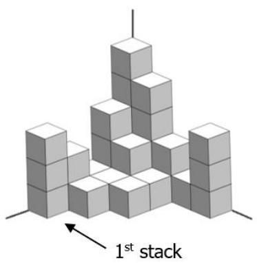

## Question 7

Emily arrived at the cinema 17 minutes after 3.55 pm, which is 4.12 pm. There are 2 hours or 120 minutes from 1.47 pm to 3.47 pm. There are 25 minutes from 3.47 pm to 4.12 pm. Thus, Emily’s journey from her house to the cinema was 120 + 25 = 145 minutes long. 

Answer: (E) 

## Question 8

The pattern is as follows: 

$$
1 \stackrel {+ 2} {\rightarrow} 3 \stackrel {+ 4} {\rightarrow} 7 \stackrel {+ 8} {\rightarrow} 1 5 \stackrel {+ 1 6} {\longrightarrow} 3 1 \stackrel {+ 3 2} {\longrightarrow} 6 3,
$$

where each addition is twice the previous one. 

The next number in the sequence is 63. 

Answer: (A) 

## Question 9

According to the Divisibility Rule of 3, 3P78 is divisible by 3 if the sum of its digits 3 + P + 7 + 8 = 18 + P is divisible by 3. The multiples of 3 are 

3, 6, 9, 12, 15, 18, 21, 24, 27, 30 … … 

$$
1 8 + \mathrm{P} = 1 8 \rightarrow \mathrm{P} = 0
$$

$$
1 8 + \mathrm{P} = 2 1 \rightarrow \mathrm{P} = 3
$$

$$
1 8 + \mathrm{P} = 2 4 \rightarrow \mathrm{P} = 6
$$

$$
1 8 + \mathrm{P} = 2 7 \rightarrow \mathrm{P} = 9
$$

There are 4 possible values for P. 

Answer: (A) 

## Question 10

The first 31 counting numbers are: 

1, 3, 5, 7, 9, 

11, 13, 15, 17, 19, 

31, 33, 35, 37, 39, 

51, 53, 55, 57, 59, 

71, 73, 75, 77, 79, 

91, 93, 95, 97, 99 

111 

Thus, the 31st counting number is 111. 

Answer: (B) 

## Question 11

The heaviest boy is 53 kg heavy, which is an odd-numbered weight. 

Mason’s weight is an even number, so he is not the heaviest. 

Joshua’s weight is a multiple of 5 which is 45 kg. So, he is not the heaviest. 

Christopher is not the heaviest as per the statement. 

Thus, the remaining boy, Mateo is the heaviest. 

Answer: (D) 

## Question 12

They paid altogether $\$ 20+\$ 15+55=940$ for 120 oranges. 

$$
\$ 40 \rightarrow 120 \text{ oranges }
$$

$$
\$ 1 \rightarrow 120 \div 4 = 3 \text{ oranges }
$$

John paid $\$ 15$ oranges 

Answer: (C) 

## Question 13

$$
\mathrm{Tank} + 2 0 0 \mathrm{litresofwater} = 3 5 0 \mathrm{kg}
$$

$$
\mathrm{Tank} + 1 5 0 \mathrm{litresofwater} = 3 1 5 \mathrm{kg}
$$

Subtracting the equations above: 50 litres of water = 35 kg 

$$
1 5 0 \mathrm{litresofwater} = 3 5 \mathrm{kg} \times 3 = 1 0 5 \mathrm{kg}
$$

$$
\mathrm{Tank} + 1 5 0 \text { litres   of   water } = \mathrm{Tank} + 1 0 5 \mathrm{kg} = 3 1 5 \mathrm{kg}
$$

$$
\text { Thus,   } \mathrm{Tank} = 3 1 5 \mathrm{kg} - 1 0 5 \mathrm{kg} = 2 1 0 \mathrm{kg}
$$

Answer: (D) 

## Question 14

There are 132 ÷ 11 = 12 gaps among all the lanterns on each side of the river. 

There are 12 + 1 = 13 lanterns on each side of the river. 

Thus, there are 13 × 2 = ???? lanterns in total. 

Answer: (D) 

## Question 15

Let us describe the two faces of the pyramid. 

## Face 1:

• It has a dot on top of its hat 

• It has a white dot on the left of its nose. 

• Its eyes look to the right. 

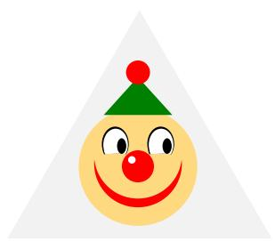

## Face 2:

• It doesn’t have a dot on top of its hat. 

• It has a white dot on the left of its nose. 

• Its eyes look to the right. 

• It has a bow tie. 

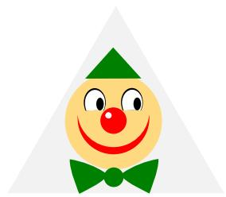

Only Option B has both faces. 

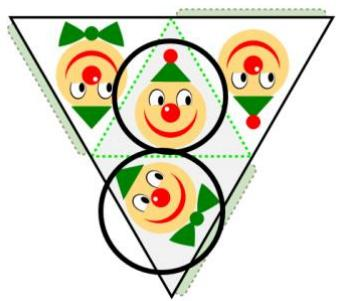

Answer: (B) 

## Question 16

We notice that the $2 ^ { \mathsf { n d } }$ number is (50 − 1), the third number is $5 0 - 2$ and so on. 

Hence the ${ 3 0 ^ { \mathrm { t h } } }$ number is $5 0 - 2 9 = 2 1$ and the sum is 

$$
\begin{array}{l} 5 0 + 4 9 + 4 8 \dots \dots + 2 3 + 2 2 + 2 1 \\ = (5 0 + 2 1) + (4 9 + 2 2) + (4 8 + 2 3) + \dots + (3 6 + 3 5) \\ = 7 1 \times (3 0 \div 2) \\ = 7 1 \times 1 5 \\ = 1 0 6 5. \\ \end{array}
$$

Answer: 1065 

## Question 17

A rectangle has 2 lengths and 2 widths. 

When the length of the rectangle is increased by 12 cm for each side, its perimeter is increased by 12 × 2 = 24 cm. 

So, original perimeter + 24 cm = 38 cm 

Working backwards: original perimeter = 38 cm − 24 cm = ???? ???? 

Answer: 14 

## Question 18

1-part: 7 triangles 

2-part: 10 triangles 

3-part: 6 triangles 

4-part: 5 triangles 

6-part: 2 triangles 

Total number of triangles = 7 + 10 + 6 + 5 + 2 = ???? 

Answer: 30 

## Question 19

According to the diagram, there are 2 units of guests in January, 4 units in February, 5 units in March, 3 units in April, 1 unit in May and 5 units in June. 

In total, there are 2 + 4 + 5 + 3 + 1 + 5 = 20 units 

As each unit represents 50 guests, 20 ?????????? = 20 × 50 = ???????? guests. 

Answer: 1000 

## Question 20

Working backwards, we reverse all operations to obtain the unknown number . 

$$
3 0 + 1 8 = 4 8
$$

$$
4 8 \div 8 = 6
$$

$$
6 \times 9 = 5 4
$$

$$
5 4 - 7 = 4 7
$$

Answer: 47 

## Question 21

There are 6 squares along the length and 4 squares along the width. So, the rectangle is made of altogether 6 × 4 = 24 squares. 

Area of each square= 96 cm2÷ 24 = 4 cm2 

The shaded region comprises of 8 squares and 8 half square triangles. The 8 half square triangles can be combined to 4 squares. Thus, the shaded region comprises of 8 + 4 = 12 squares. 

Area of shaded region=Area of 12 squares= 12 × 4 = ???? ????2 

Answer: 48 cm2 

## Question 22

It is given that 

$$
\begin{array}{l} 2 9 = 2 \text { boxes   of   chocolates } + 3 \text { packets   of   sweets } + 4 \text { baskets   of   fruits } \\ = 2 \text {   boxes   } + 3 \text {   packets   } + 4 \text {   baskets   } \\ = 2 \text {   boxes   } + 2 \text {   packets   } + 1 \text {   packet   } + 1 \text {   basket   } + 3 \text {   baskets   } \\ = 2 \times (1 \text { boxes } + 1 \text { packet }) + (1 \text { packet } + 1 \text { basket }) + 3 \text { baskets } \\ = 2 \times 4 + 6 + 3 \text {   baskets   } = 1 4 + 3 \text {   baskets. } \\ \end{array}
$$

Hence 

$$
3 \text { baskets } = 2 9 - 1 4 = 1 5 \text { or } 1 \text { basket } = 1 5 \div 3 = 5
$$

$$
1 \text {   packet   } = 6 - 5 = 1 \text {   and   } 1 \text {   box   } = 4 - 1 = 3.
$$

Answer: $3 

## Question 23

To obtain the largest possible whole number, Diana needs to construct as many digits as possible. The digit ‘1’ requires the least number of matchsticks which is 2. The digit ‘7’ requires the second least number of matchsticks which is 3. Thus, the largest possible number that she can construct using exactly 17 matchsticks is 71,111,111. 

The number 71,111,111 contains 8 digits. 

Answer: 8 

## Question 24

There will be a total of 3 sums in this figure, and these 3 sums have the same value. 

Hence, the total value of the 3 sums in the figure = 3 × (sum of each straight line), which must be a multiple of 3. 

On the other hand, the total value of the 3 sums in the figure can also be equal to the sum of all 7 numbers in the question + 2 times of the middle number 

$$
= 7 7 + 2 \times (\text { middle   number }).
$$

Thus, 77 + 2 × middle number = (sum of each straight line) × 3 

Hence, to obtain the greatest sum, the middle number must be of the greatest possible value such that (77 + 2 × middle number) is a multiple of 3. The largest number in the question is 20, and the greatest possible sum is $7 7 + 2 \times 2 0 = 1 1 7 =$ $3 \times 3 9$ . 

One possible arrangement is (2, 14, 20), (5, 14, 20) and (8, 11, 20). 

Answer: 39 

## Question 25

A three-digit number plus a three-digit number can only result in a four-digit number that starts with 1. Hence R must be 1. 

In ones place addition, the last digit of P + Q is 1 which means that ?? + ?? = 11 since ?? + ?? is greater than 1. 

Then in tens place addition P + Q = 11 and there is a carryover of 1 from the ones place addition. Thus, Q = 2 and RQQR is 1221. 

Answer: 1221 