# Primary 4 (Grade 4) – GEP Practice

# 2019 & 2020 Contest Problems with Full Solutions

Authors: 

Henry Ong, BSc, MBA, CMA Merlan Nagidulin, BSc 

## © Singapore International Mastery Contests Centre (SIMCC) All Rights Reserved

No part of this work may be reproduced or transmitted by any means, electronic or mechanical, including photocopying and recording, or by any information or retrieval system, without the prior permission of the publisher. 

## About the Authors:

Henry Ong is the Founder of SASMO and President of Singapore International Mastery Contest Centre (SIMCC). He conducts Math Olympiad classes, not only in Singapore but also around the 20 countries that have joined SASMO. He now travels round the world giving out awards and scholarships to students and teachers. He is now promoting new contests, International Scholastic Trust Teachers’ Institute (ISTTI) and International Junior Honor Society (IJHS). 

In February 2020, Henry was appointed Co-Chair of the Council Administration of Cambodian Mathematical Society (CA_CMS). Henry will share and use his great wealth of experience, expertise, and international networks to contribute effectively to: (1) promoting STEM: Science, Technology, Engineering, and Mathematics; (2) organizing and undertaking multilateral partnership programs; and (3) strengthening and improving the public-private partnership for development of STEM, research and development, and research and innovation as well as teacher professional development in Cambodia with relevant stakeholders in close collaboration and consultation with relevant leadership and management of Ministry of Education, Youth and Sport, especially Cambodian Mathematical Society (CMS), New Generation Pedagogical Research Center (NGPRC), National Institute of Education(NIE) and Teacher Training Department (TTD). 

Merlan Nagidulin is the Academic Director for Math and Science Olympiad and General Manager of SIMCC. Merlan graduated with a Bachelor of Science, Honours in Mathematical Sciences from Nanyang Technological University. Merlan won 2 gold medals in Kazakhstan National Math Olympiad and was awarded a bronze medal in the most prestigious International Math Olympiad (IMO Slovenia 2006). 

## Publisher

Noble Education Pte Ltd specialises in printing educational resources and educational games. We introduced many thinking games and puzzles to MOE schools in Singapore and overseas. We help students, teachers and entrepreneurs to self-publish their own titles. We print contest papers for all Singapore International Math Contest Centre (SIMCC) academic competitions world-wide. 

Noble Education Pte Ltd – 55 Lor L Telok Kurau, 03-69, Bright Centre, Singapore 425500 SIMCC – 199A Thomson Road, Goldhill Centre, Singapore 307636 Website: www.simcc.org 

If you spot any mistakes, kindly email us at training@simcc.org . 

Copyright © 2021 by SIMCC 

All rights reserved. No part of this work may be reproduced or transmitted in any form or by any means, electronic or mechanical, including photocopying and recording, or by any information or retrieval system, except as may be expressly permitted by the Copyright Act of 1976 or in writing to the Publisher. Requests for Permission should be addressed to: Permissions, Mr Henry Ong, c/o 55 Lor L Telok Kurau, 03-69, Bright Centre, Singapore 425500 or email: admin@simcc.org 

First Edition printed in Singapore, 2021 

ISBN: 978-98-11800-89-4 

## Table of Contents

International Scholastic Trust President’s Message........... 

Competition and Prizes ......... 

Introduction ...... 

Problem Solving Procedure ......... 

Problem Solving Strategies .......... 

SASMO 2019 Primary 4 (Grade 4) Contest Questions ............ 

SASMO 2020 Primary 4 (Grade 4) Contest Questions ............... .. 20 

Solutions to SASMO 2019 Primary 4 (Grade 4) ............ ... 32 

Solutions to SASMO 2020 Primary 4 (Grade 4) ............ .. 42 

# International Scholastic Trust President’s Message

Dear SIMCC contestants, parents, teachers, and partners, 

I hope all of you are safe and healthy. We have all gone through so much within the past year, and we should rejoice - we are all alive and well. Despite all the groom and predictions of the worst recession to hit us very soon, we at SIMCC, are expanding globally – adding another 14 country partners to a total of 35 countries and territories within the last 10 months, and setting up sales offices in Cambodia and India, in addition to taking over the ICAS competitions and staff from the University of New South Wales Global Office based in Hong Kong and Macau. 

Two years, Sophie Koh, our Senior Director of IT, Events and Operations left Singapore Polytechnic as a Senior Lecturer of IT to join us. She has almost digitally transformed most of our operations and contest systems. This will provide valuable big data in formative and summative assessments for teachers to measure their students and inform their teaching. Parents and students will also receive Detailed Performance Reports (DPR) in our Member Development Portal (MDP) to improve their Academic Skills. Teachers and their schools will be able to download Students’ Analytical Performance Reports (SAPR). SIMCC together with our partners will be conducting more Webinars to prepare teachers and parents to use our contests and data to arm their wards with Skills and Recognition for SUCCESS. 

From February 16 to April 30, 2021, we are offering the 1st Singapore Math Global Assessment for grades 1 to 11 students. We want to open this up to every country, especially since Singapore Math textbooks are used in schools from over 70 countries. We want to share our rich Singapore Math heritage that has propelled Singapore students to the top of PISA rankings since the 1990s. We also have excellent teachers, Learning Management System (LMS), Math textbooks, assessment books, as well as teacher training to help improve math education worldwide. Reach out to us for help, if you want your students to become Mathematics Heroes! 

The global winners of SINGA Math Assessments are invited for the 1st SINGA Math Global Finals, in their home countries on September 11, 2021. The prize for the Overall Champion of grades 1 to 10/11 is a S$600 competition package to compete in the STEAM AHEAD International Junior Mathematics Olympiad (IJMO) to be held in Bali, Indonesia from December 3 to 7, 2021. The prize for Overall Runner-up is S$250 and 2nd Runner-up is S$150, offering a total prize award of S$10,000. Winners of Gold (10%) and Silver (15%) are invited to compete in STEAM AHEAD IJMO 2021. 

From 2021, we will be offering most of our contests to grade 12 students – SASMO, DrCT, SIMOC, and STEAM AHEAD. This will pave the way for Grades 12 SIMCC students to apply for SIMCC and STS’s US$270,000 endowed 2 scholarships for 4-year undergraduate studies at Southern Illinois University (SIU), Carbondale, Illinois, USA in STEM related fields. SIU has also given SIMCC over 30 SIU International Student Tuition Grants to award to top SIMCC students to pursue their university education. SIMCC will setup our own network for SIMCC scholars at SIU. This will help us expand SIMCC contests in North America and generate revenue for us to fund more scholarships. 

Best Regards, 

Henry Ong, President 

## Competition and Prizes

SASMO is devoted and dedicated to bringing a love for Mathematics to students. Unlike most Math Olympiad Competitions, SASMO caters not only to students in the top 5% but to the top 40% instead. It aims to arouse students’ interest and enthusiasm for mathematical problem solving, develop mathematical intuition, reasoning and logical thinking, as well as creative and critical thinking. In addition, this can help improve the students’ math grades because they can apply problem-solving strategies learnt during the training to their daily school mathematics. 

## History:

Created in 2006, SASMO is one of the largest Math Olympiads in the Asian region. We have expanded the competition to provide an International platform for students from Primary 2 to Secondary 4, with differentiated contest papers for every level. SASMO awards medals and certificates to the top 40% of participants. 

## Calculators are not permitted

When a problem introduces a more advanced concept, all necessary definitions are included. 

## Awards:

Each participant receives a Certificate of Participation or an award certificate for winners below. Each of the top 8%, 12% and 20% of all participants receives a Gold, Silver or Bronze medal and certificate respectively. Each student who achieves a Perfect Score of 85 points receives a Perfect Score certificate, Gold medal and $100. 

## Introduction

## For Students Taking the Math Olympiad Challenge

Congratulations. You have embarked on a journey of scholarship. Competitions like SASMO open many doors for you. Firstly, you learn new and interesting approaches to problem-solving and new topics. Next, you will meet talented students from other schools as you attend trainings and competitions. You build your endurance to “puzzle” out challenging problems and build your reputation as a problem solver. Finally, you will be exposed to various international competitions and scholarship opportunities. Here in Singapore, you increase your chances of getting into a top school via Direct School Admissions (DSA) and entry into the Gifted Education Programme as you compete regularly in high level competitions. 

This book is written for the participants in the Singapore and Asian Schools Math Olympiads (SASMO). It helps students to prepare well for the contest and develop higher-order thinking. All problems are designed to help students develop the ability to think mathematically, rather than to teach more advanced or unusual topics. The fun is in how you can see patterns and ways of solving each problem in non-technical ways even though you have not learnt the topic yet! 

In addition to the contest problems, the reader is provided with a list of familiar mathematical terms, as well as a review of some of the topics that are likely to be tested in the Olympiad. The book also contains some solved examples to provide different problem-solving techniques, and to familiarize the participant with different types of Olympiad questions. It is advised that the reader spends appropriate time studying these questions and solutions, as they will assist in tackling actual Olympiad problems. 

How to Use This Book: Practice daily for 15 minutes per hour instead of 4 hours of learning once a month. Your mind needs to absorb each new thought, and constant practice allows frequent review of previously learned concepts and skills. Together, you can remember many new problem-solving approaches. Try to spend 10 or 15 minutes daily doing two or three problems. This approach should help you minimize the time needed to develop the ability to think mathematically. 

Whether you solve a problem quickly or if you are confused, it is worth studying the solutions in this book, because often they offer unexpected insights that can help you understand the problem more fully. After you have invested time – trying to solve each problem any way you can, reviewing our solutions is very effective. Many of the problems in this book can be solved in more than one way. There is always a single answer, but there can be many paths to that answer. Once you solve a problem, go back and see if you can solve it by another method. Then check our solutions to see if any of them differ from yours. 

Enjoy working on these challenges and you will soon be in a different league from your peers who have not taken any international competition. We look forward to inviting you if you are a bronze, silver, gold or perfect score medallist for further training. 

## Problem Solving Procedure

You may go through several phases when solving a problem such as trying to understand the problem, working on a specific approach (planning and attempting), getting stuck and trying to get unstuck, critically examining solutions or communicating. The work may involve going back and forth between these different phases of problem solving. 

In solving any problem, it helps to have a working procedure. You might want to consider this four-step procedure: Understand, Plan, Try It, and Look Back. 

## Understand

Before you can solve a problem, you must first understand it. Read and re-read the problem carefully to find all the clues and determine what the question is asking you to find. What is the unknown? What is the data? What is the condition? 

## Plan

Once you understand the question and the clues, it's time to use your previous experience with similar problems to look for strategies and tools to answer the question. Do you know a related problem? Look at the unknown! And try to think of a familiar problem having the same or a similar unknown? 

## Try It

After deciding on a plan, you should try it and see what answer you come up with. Can you see clearly that the steps are correct? 

But can you also prove that the steps are correct? 

## Are you feeling stuck?

Many different approaches can be tried to get unstuck. One approach is to try working a simpler version of the problem, and use the solution to the problem to get insights that are useful in solving the original problem. In the next chapter, we will show some common solving approaches. 

If you are discouraged after a few failed attempts, read this quote from the famous scientist, Thomas Edison. An assistant asked, "Why are you wasting your time and money? We have had failure after failure, almost a thousand of them. Why do you continue to pursue this impossible task?" Edison said, "We haven't had a thousand failures, we've just discovered a thousand ways to not invent the electric bulb." 

## Look Back

Once you've tried a problem and found an answer, go back to the problem and see if you've really answered the question. Sometimes it's easy to overlook something. If you missed something check your plan and try the problem again. Can you check the result? 

Can you check the argument? 

Can you derive the result differently? 

Can you see it at a glance? 

## Problem Solving Strategies

## 1. Change the representation

Using a wrong representation may make a problem impossible to solve. 

Strategies of changing representation include drawing a picture and acting it out. 

DRAW A PICTURE: By drawing a picture, and visualizing the problem information using it, you will have a clearer understanding of the problem and it will help you to come up an approach to solve the problem that you might not be able to see otherwise. 

ACT IT OUT: We are better at thinking in terms of concrete objects and situations than in terms of abstract concepts. If we can act out the situation described in a word problem, we are able to understand the problem better and we may be able to come up with a solution. To do this, we need to use real materials that are easily available to us. Examples can be pencils, coins and other objects we have in the classroom. 

## 2. Make an Organized List or a Table

ORGANIZED LIST: Making an organized list allows you to clearly examine data. It can help you in ensuring that you are looking at all the relevant information. It will also allow you to see patterns in the data easily and to come to correct conclusions. 

MAKE A TABLE: Making a table allows you to clearly examine data. It can help you in ensuring that you are looking at all the relevant information. It will also allow you to see patterns in the data easily and to come to correct conclusions. 

## 3. Create a Simpler Problem

Sometimes we are not able to solve the problem as it is stated, but we are able to solve a similar problem that is similar in some way. For example, the simpler problem may use simpler numbers. Once we solve one or more simpler problems, we may understand the approach that can be used to solve the problems of similar type and may be able to solve the problem that has been given to us. 

## 4. Use Logical Reasoning

Logical reasoning is useful in mathematics problems in various ways. It can be used to eliminate incorrect choices. It can also sometimes be used to conclude the answer directly. 

## 5. Guess and Check

"Guess and Check" strategy can be used on many problems. If the number of possible answers is small, one can use this strategy to come up with the answer very quickly. In some other cases where the number of possible answers is not small, one may still be able to make intelligent guesses and come up with the answer. 

## 6. Working Backwards

Sometimes, it is easier to start with information at the end of the problem and work backwards to the beginning of the problem than the other way around. 

## SASMO 2019 Primary 4 (Grade 4) Contest Questions

Section A (Correct answer – 2 points| No answer – 0 points| Incorrect answer – minus 1 point) 

## Question 1

Find the next number in the sequence below. 

$$
4, 7, 1 3, 2 2, 3 4, \_
$$

A. 15 

B. 18 

C. 49 

D. 60 

E. None of the above 

## Question 2

How many triangles are there in the picture below? 

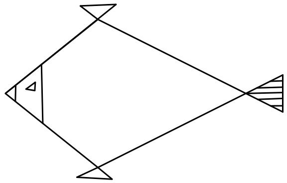

A. 16 

B. 12 

C. 8 

D. 6 

E. None of the above 

## Question 3

If the 3-digit number 2M4 is divisible by 6, what is the smallest value of the digit M? 

A. 0 

B. 3 

C. 6 

D. 9 

E. None of the above 

## Question 4

Eight days after the day before yesterday is Friday. Which day of the week is tomorrow? 

A. Friday 

B. Saturday 

C. Sunday 

D. Thursday 

E. None of the above 

## Question 5

Which of the following options you most likely to spin? 

A. An even number 

B. An odd number 

C. A multiple of 3 

D. A number bigger than 2 

E. A number less than 4 

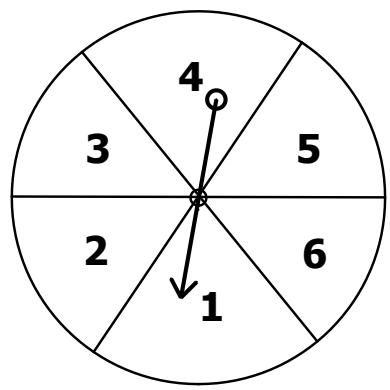

## Question 6

Jonathan has 4 regular dice. Each dice has numbers from 1 to 6. Which of the following could not be the sum of the numbers on top of the 4 dice? 

A. 6 

B. 11 

C. 19 

D. 26 

E. All the above numbers are possible sum 

## Question 7

In Mathematics, the product of the first ?? whole numbers starting from 1 is written as $n ! = 1 \times 2 \times 3 \times \ldots \times n$ . For example, $2 ! = 1 \times 2$ and 7! = $1 \times 2 \times 3 \times 4 \times 5 \times 6 \times 7$ . The number of hours in September can be written as ??!. Find the value of ??. 

A. 5 

B. 6 

C. 7 

D. 8 

E. None of the above 

## Question 8

Which of the following will form a knot when the two ends are pulled away from each other at the same time? 

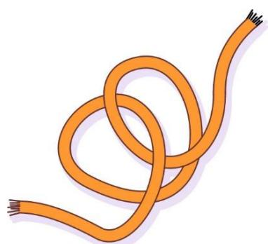

A

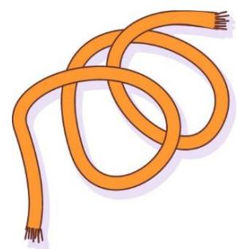

B

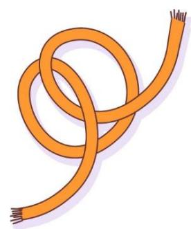

C

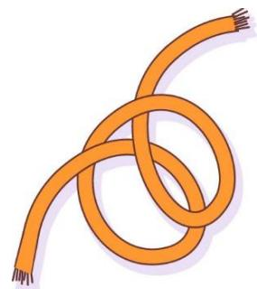

D

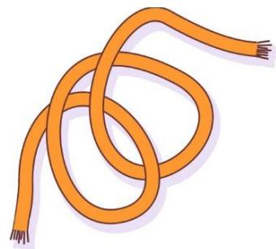

E

## Question 9

Adam can travel from City A to City B by a bus, a train or a plane. To get from City B to Town C, he can hire a taxi, rent a car, a motorcycle or a bicycle. There is no direct transportation from City A to Town C. How many ways can Adam travel from City A to Town C? 

A. 8 

B. 7 

C. 12 

E. None of the above 

## Question 10

What is the missing number in the diagram below? 

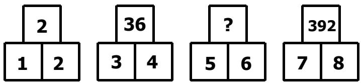

A. 150 

B. 360 

C. 31 

D. 205 

E. None of the above 

## Question 11

Calculate the sum of the following mixed fractions. 

$$
1 \frac {1}{3} + 2 \frac {9}{1 2} + 3 \frac {3}{5} + 4 \frac {1}{4} + 5 \frac {4}{6} + 6 \frac {1 0}{2 5}
$$

A. 18 

B. 19 

C. 21 $\frac { 7 } { 1 2 }$ 

D. 24 

E. None of the above 

## Question 12

The plans for Mobile Data offered by a company are given below. 

• Plan A: 20 minutes at $2 

• Plan B: 50 minutes at $4 

• Plan C: 60 minutes at $6 

• Plan D: 100 minutes at $9 

Which plan offers the best rate per minute? 

A. Plan A 

B. Plan B 

C. Plan C 

D. Plan D 

E. None of the above 

## Question 13

A group of friends arrive at SASMO Cinema at 11:30. They watch any movie together. What is the earliest time they could finish watching both movies? 

<table><tr><td colspan="3">SASMO Cinema</td></tr><tr><td>Title</td><td>Duration</td><td>Show Times</td></tr><tr><td>Adventure Park</td><td>115 minutes</td><td>12:00, 14:15, 15:55, 19:05, 21:35</td></tr><tr><td>Monster Land</td><td>105 minutes</td><td>11:00, 12:55, 16:10, 18:50, 21:35</td></tr></table>

A. 16:00 

B. 14:40 

C. 17:50 

D. 17:55 

E. None of the above 

## Question 14

Which of the following figures has the largest fraction of its area shaded? 

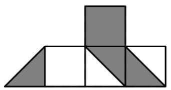

A

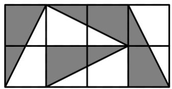

B

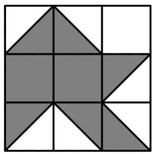

C

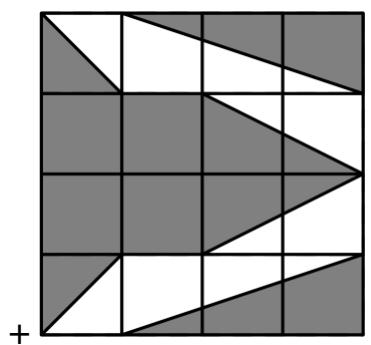

D

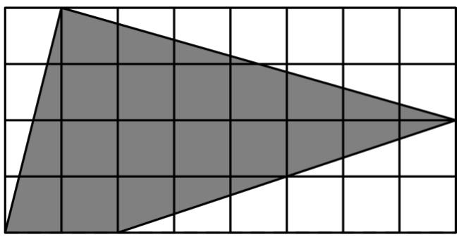

E

## Question 15

Study the picture below. 

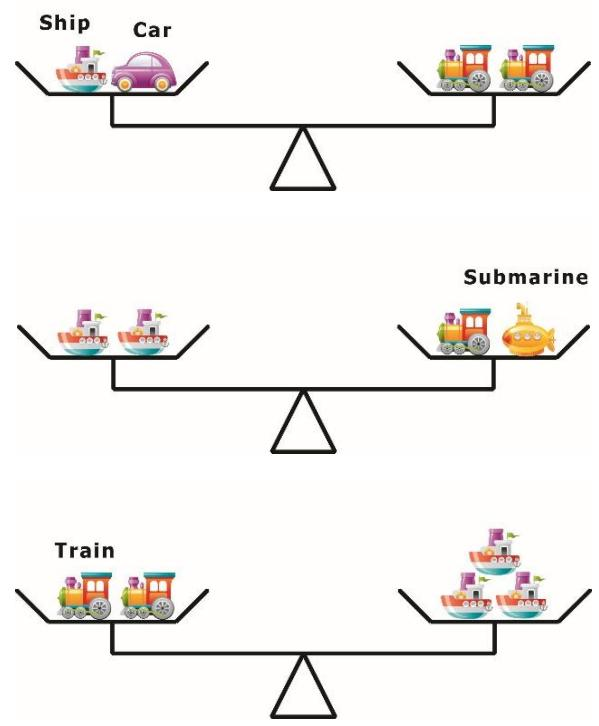

Which toy is the heaviest? 

A. Car 

B. Train 

C. Ship 

D. Submarine 

E. Impossible to know 

## Section B (Correct answer – 4 points| Incorrect or No answer – 0 points)

When an answer is a 1-digit number, shade “0” for the tens, hundreds and thousands place. 

Example: if the answer is 7, then shade 0007 

When an answer is a 2-digit number, shade “0” for the hundreds and thousands place. 

Example: if the answer is 23, then shade 0023 

When an answer is a 3-digit number, shade “0” for the thousands place. 

Example: if the answer is 785, then shade 0785 

When an answer is a 4-digit number, shade as it is. 

Example: if the answer is 4196, then shade 4196 

## Question 16

Find the sum of the whole numbers from 31 to 41: 

$$
3 1 + 3 2 + 3 3 + \dots + 4 0 + 4 1
$$

## Question 17

The big square on the right is made up of 8 identical rectangles and 1 small square. The width of the rectangle is 2 cm and the area of the small square is 64 cm2. Find the perimeter, in cm, of the big square. 

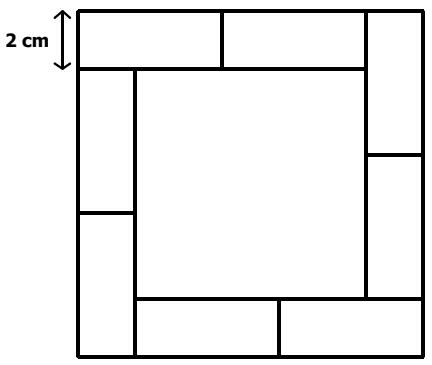

## Question 18

Find the smallest 3-digit number such that the product of all its digits is also a 3-digit number. 

## Question 19

Some children are in a summer camp. If the children are divided into groups of 7, then each child will be in a group. If the children are divided into groups of 9, then 2 children will be left out. What is the smallest possible number of children in the summer camp? 

## Question 20

The following bar chart shows the amount of money Mary spent, in dollars, in the first 5 days of the last week. All the horizontal lines are equally spaced. The day with the second highest amount of money spent and the day with the lowest amount of money spent differs by $60. On the following Saturday, Mary spent $\frac { 1 } { 5 }$ of the total amount of money spent from Monday to Friday. How much did she spend on Saturday? 

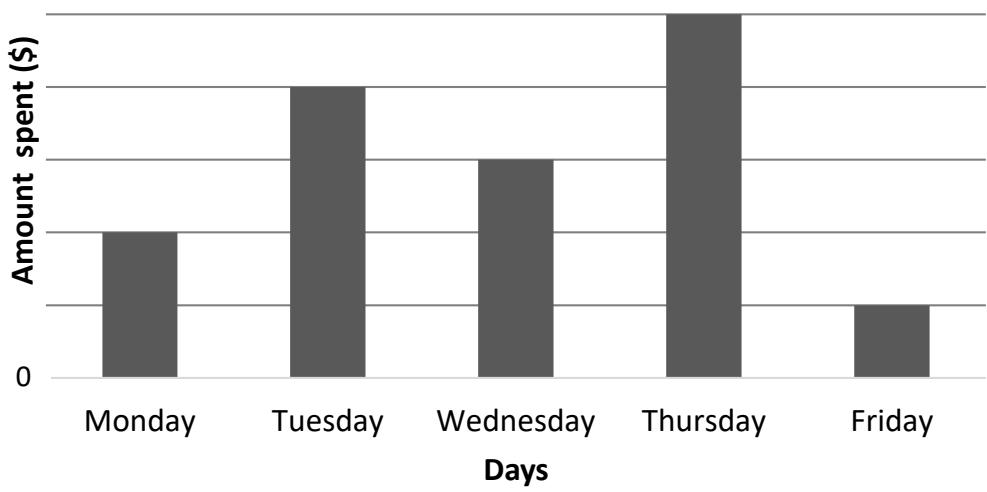

## Question 21

Originally, there were equal number of tables and chairs in a shop. After selling away 42 tables and bringing in 24 chairs, the number of chairs will be 4 times as many as tables. How many chairs were there in the shop originally? 

## Question 22

January 23, 2019 can be written as 8-digit date format 23/01/2019. September 2, 2019 can be written as 8-digit date format 02/09/2019. How many digit “3” are there in all 8-digit dates of the year 2019? 

(For example, the date 30/03/2019 consists two “3” digits) 

## Question 23

In the following, all the different letters stand for different digits. What is the value of the 4-digit number BDEC? 

C B C D 

+ C D B C 

B D E C 

## Question 24

Four 2-digit numbers are made up from the digits 1, 2, 3, …, 8 with no repetition. The following are the hints about these numbers: 

• In the smallest number, the ones digit is twice the tens digit. 

• In the largest number, the sum of ones and tens digits is 9. 

• In the second largest number, the tens digit is 5 more than the ones digit. 

• There is only 1 odd number among these 4 numbers. 

Find the second smallest number. 

## Question 25

Tom had Lego blocks. He lost 4 pieces at home and then gave $\frac 1 4$ of the remaining to his friend Gary. After that, 3 pieces got lost, then he gave $\frac 1 3$ of the new remaining to another friend Fiona. Another 2 pieces were lost, and then he gave half of the new remaining to his brother. At the end, Tom has 19 Lego blocks left. How many Lego blocks did Tom have originally? 

End of Paper 

## SASMO 2020 Primary 4 (Grade 4) Contest Questions

Section A (Correct answer – 2 points| No answer – 0 points| Incorrect answer – minus 1 point) 

## Question 1

What is the value of the following sum? 

$$
2 8 1 4 + 3 7 0 0 + 4 6 0 9 + 8 2 1 1 + 9 1 0 6 - 2 2 9 0 0
$$

A. 4450 

B. 4540 

C. 5540 

D. 5450 

E. None of the above 

## Question 2

If Gear A rotates anti-clockwise, which of the following options is true? 

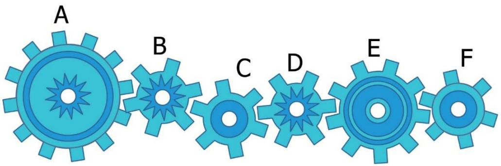

A. Gears A and C rotate in opposite directions 

B. Four gears rotate in the same direction 

C. Gear E rotates clockwise 

D. Gear C rotates anti-clockwise 

E. None of the above 

## Question 3

In the fictional ”Odd Island”, all the numbers contain only odd digits. The order of the counting numbers is the following 

$$
\begin{array}{l} 1, 3, 5, 7, \dots , 1 9, 3 1, 3 3, \dots \end{array}
$$

What is the 55th counting number in the island? 

A. 99 

B. 101 

C. 197 

D. 199 

E. None of the above 

## Question 4

How many four-digit numbers are there such that if we add 2020 to each of the numbers, the results are still four-digit numbers? 

A. 7020 

B. 6880 

C. 6980 

D. 7880 

E. None of the above 

## Question 5

In the grid below, the first row and the first column have been filled up with numbers from 10 to 19. The empty cells will be filled up with numbers by adding the topmost number in the column with the leftmost number in the row. (For example, ?? = 17 + 14 = 31 and ?? = 19 + 18 = 37.) After filling up all the empty cells, what will the sum of all the numbers in the grid be? 

<table><tr><td>10</td><td>11</td><td>13</td><td>15</td><td>17</td><td>19</td></tr><tr><td>12</td><td></td><td></td><td></td><td></td><td></td></tr><tr><td>14</td><td></td><td></td><td></td><td>A</td><td></td></tr><tr><td>16</td><td></td><td></td><td></td><td></td><td></td></tr><tr><td>18</td><td></td><td></td><td></td><td></td><td>B</td></tr></table>

A. 745 

B. 725 

C. 145 

D. 135 

E. None of the above 

## Question 6

Each of the numbers 138 and 243 has digits whose product is 24. How many threedigit numbers are there whose digits have a product of 24? 

A. 8 

B. 9 

C. 12 

D. 18 

E. None of the above 

## Question 7

The month of December of a certain calendar year has exactly 5 Saturdays and 4 Sundays. On which day of the week does the first day of December fall? 

A. Monday 

B. Tuesday 

C. Wednesday 

D. Thursday 

E. None of the above 

## Question 8

What is the missing number in the following pattern? 

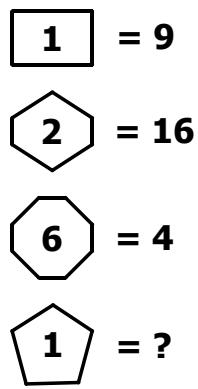

$$
\boxed {\textbf {1}} = \textbf {9}
$$

$$
② = 1 6
$$

$$
⑥ = 4
$$

$$
ⓛ = ?
$$

A. 5 

B. 10 

C. 16 

D. 20 

E. None of the above 

## Question 9

How many numbers are there in the list below? 

$$
6 \frac {1}{3}, 7, 7 \frac {2}{3}, 8 \frac {1}{3}, \dots , 3 0 \frac {1}{3}, 3 1
$$

A. 25 

B. 26 

C. 38 

D. 37 

E. None of the above 

## Question 10

The five-digit number 25M48 is a multiple of 9. What digit does M represent? 

A. 9 

B. 8 

C. 7 

D. 6 

E. None of the above 

## Question 11

In the figure below, ???????? and ???????? are rectangles. ???? = ???? = 6 cm and ???? = ???? = 10 cm. Compare the areas of the shaded region of rectangle ???????? and ????????. Which of the following statements below is true? 

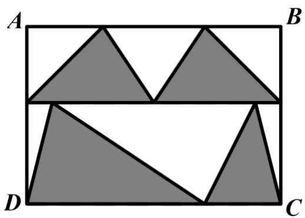

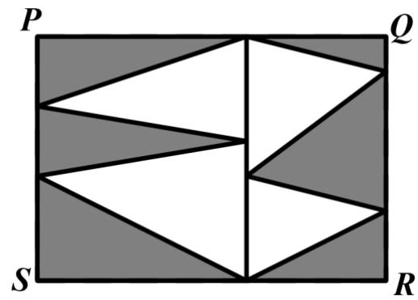

A. The area of the shaded region of ABCD is equal to the area of the shaded region of PQRS. 

B. The area of the shaded region of ABCD is greater than the area of the shaded region of PQRS. 

C. The area of the shaded region of ABCD is less than the area of the shaded region of PQRS. 

D. Cannot be determined 

E. None of the above 

## Question 12

The time now is 16:56 and Archie’s 12-hour digital clock shows 4:56 P.M. He realizes that the digits of his digital clock are in increasing consecutive order. When the time is 12:17 P.M. or A.M., the clock will show 12:17 P.M. or A.M. respectively. How many minutes later will Archie’s clock show digits again in increasing consecutive order? 

A. 507 minutes 

B. 458 minutes 

C. 467 minutes 

D. 407 minutes 

E. None of the above 

## Question 13

Ali has 80 candles. He lights 1 candle every day. He can recycle the wax of four used candles to form a new candle. After how many days will he need to buy more candles? 

A. 80 

B. 130 

C. 132 

D. 133 

E. None of the above 

## Question 14

Among George, Helen and Irene, only one of them watched the movie ‘Avengers’. When they were asked about the movie, they gave the following replies. 

George said: Helen watched it. 

Helen said: I have not watched it. 

Irene said: I have not watched it. 

If two of them lied, who watched the movie? 

A. George 

B. Helen 

C. Irene 

D. Impossible to determine 

E. None of the above 

## Question 15

Which one of the following options is a missing piece of the cube on the right? 

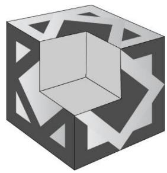

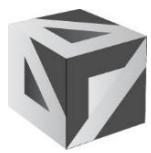

A

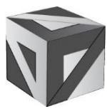

B

C

D

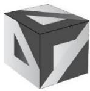

E

## Section B (Correct answer – 4 points| Incorrect or No answer – 0 points)

When an answer is a 1-digit number, shade “0” for the tens, hundreds and thousands place. 

Example: if the answer is 7, then shade 0007 

When an answer is a 2-digit number, shade “0” for the hundreds and thousands place. 

Example: if the answer is 23, then shade 0023 

When an answer is a 3-digit number, shade “0” for the thousands place. 

Example: if the answer is 785, then shade 0785 

When an answer is a 4-digit number, shade as it is. 

Example: if the answer is 4196, then shade 4196 

## Question 16

What is the value of $9 5 \times 3 7 + 9 5 \times 4 2 + 2 1 \times 9 5 ?$ 

## Question 17

How many triangles are there in the figure below? 

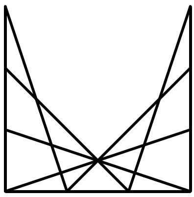

## Question 18

I am thinking of a number. If the number is added to 8, the sum is multiplied by 8, 8 is subtracted from the product, and the difference is divided by 8, it yields a quotient of 80. What is this number? 

## Question 19

The graph below shows the number of guests who visited the National Museum during the first six months of 2019. All the horizontal lines are equally spaced. If the total number of guests who visited in January and May were 200 fewer than those in June, how many people visited the museum in total during the six months? 

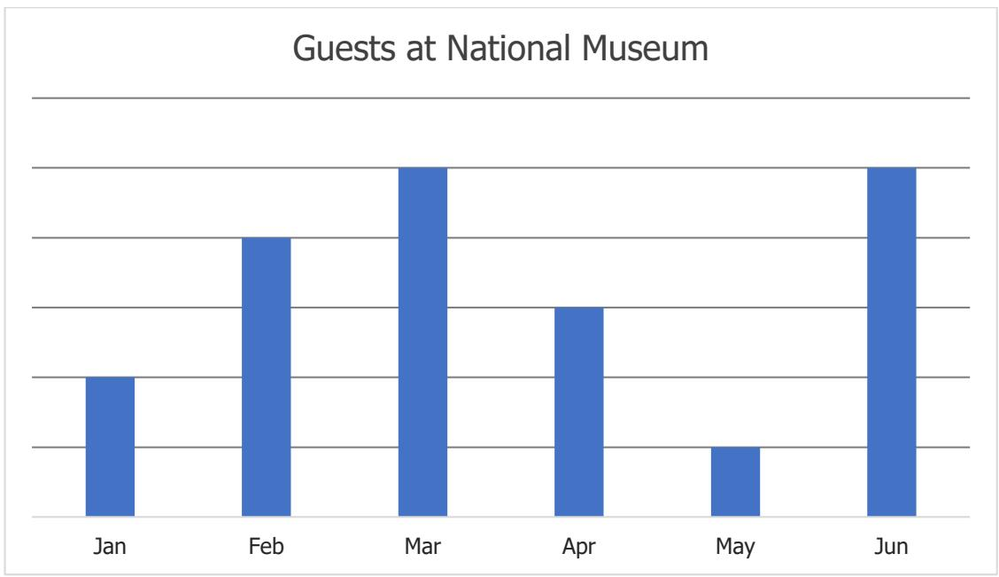

## Question 20

The following square is divided into four rectangles as shown. The sum of the perimeters of the four rectangles is 72 cm. Find the side length (in cm) of the square. 

## Question 21

One wants to colour the circles in the figure below such that any pair of circles connected by a line segment shares different colours. What is the least number of colours needed for the colouring? 

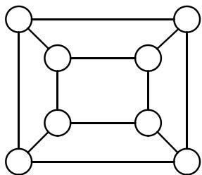

## Question 22

Ronald McDonald, a farmer, has chickens, goats and cows in his farm. He has 40 chickens and goats combined. He notices that 3 times the number of his chickens is 5 times the number of his cows. On the other hand, 2 times the number of goats is 10 times the number of his cows. Help Ronald McDonald determine the total number of animal feet in his farm. 

## Question 23

Kate bought some pieces of candy. She ate $\frac 1 3$ at home and brought the rest to school. She shared the candy with her seven friends so that each friend received 26 pieces of candy. If Kate left with 22 pieces of candy, how many pieces of candy did she initially buy? 

## Question 24

A printer printed 237 digits for all the page numbers of a storybook. How many pages are there in the storybook? 

## Question 25

In the following, all the different letters stand for different digits. 

<table><tr><td></td><td>A</td><td>B</td><td>A</td><td>C</td></tr><tr><td>+</td><td>D</td><td>B</td><td>E</td><td>C</td></tr><tr><td></td><td>A</td><td>C</td><td>E</td><td>D</td></tr></table>

Find the value of the 4-digit number DBEC. 

# Solutions to SASMO 2019 Primary 4 (Grade 4)

## Question 1

The pattern is as follows: 

$$
4 \stackrel {+ 3} {\rightarrow} 7 \stackrel {+ 6} {\rightarrow} 1 3 \stackrel {+ 9} {\rightarrow} 2 2 \stackrel {+ 1 2} {\longrightarrow} 3 4 \stackrel {+ 1 5} {\longrightarrow} 4 9
$$

The next number in the sequence is $3 4 + 1 5 = 4 9$ . 

Answer: (C) 

## Question 2

The following are the number of triangles. 

<table><tr><td>Type of Triangle</td><td>1-part</td><td>2-part</td><td>3-part</td><td>6-part</td></tr><tr><td>Example</td><td><eq>\triangle</eq></td><td><eq>\triangle</eq></td><td>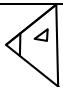</td><td>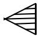</td></tr><tr><td>Quantity</td><td>6</td><td>2</td><td>3</td><td>1</td></tr></table>

Total = 6 + 2 + 3 + 1 = ???? triangles. 

Answer: (B) 

## Question 3

If a number is divisible by $6 ( = 2 \times 3 )$ , then it is also divisible by 2 and 3. 

Using the divisibility test for 3, the sum of digits $2 + \mathsf { M } + 4 = 6 + \mathsf { M }$ is divisible by 3. 

Since ?? is a single digit, ?? = 0, 3 and 9. Hence the smallest value of the digit M is 0. 

Answer: (A) 

## Question 4

Eight days after the day before yesterday is Friday. 7 days after the day before yesterday (which is 1 day earlier) is Thursday. Then the day before yesterday is Thursday, yesterday is Friday, and today is Saturday. Tomorrow is Sunday. 

Answer: (C) 

## Question 5

A. An even number – 2, 4 and 6: (3 out of 6) 

B. An odd number – 1, 3 and 5 (3 out of 6) 

C. A multiple of 3 – 3 and 6 (2 out of 6) 

D. A number bigger than 2 – 3, 4, 5 and 6 (4 out of 6) 

E. A number less than 4 – 1, 2 and 3 (3 out of 6) 

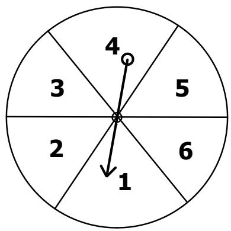

Answer: (D) 

## Question 6

The smallest possible sum that can be obtained is 1 + 1 + 1 + 1 = 4 and the largest sum is 6 + 6 + 6 + 6 = 24. Thus, it is impossible to get the sum 26. 

Answer: (D) 

## Question 7

September has 30 days and each day has 24 hours. 

$$
\begin{array}{l} 3 0 \text { days } \times 2 4 \text { hours } = (6 \times 5) \times (1 2 \times 2) = (6 \times 5) \times (4 \times 3 \times 2) = 1 \times 2 \times 3 \times 4 \times 5 \times \\ 6 = 6! \end{array}
$$

Thus, ?? is 6. 

Answer: (B) 

## Question 8

Options A, B, C and D will not form a knot. Option E will form a knot. 

Answer: (E) 

## Question 9

There are 3 ways to go from A to B. For each of these 3 ways, there are 4 ways to go to C from B. Thus, there are 3 × 4 = ???? ways to travel from A to C. 

Answer: (C) 

## Question 10

The pattern is as follows: 

$$
\text { Left   Number } \times \text { Left   Number } \times \text { Right   Number } = \text { Top   Number }
$$

Diagram 1:1 × 1 × 2 = 2 

Diagram 2: 3 × 3 × 4 = 36 

Diagram 3: 5 × 5 × 6 = 150 

Diagram 4: 7 × 7 × 8 = 392 

Hence, the missing number is ??????. 

Answer: (A) 

## Question 11

Simplify the fractions. Then pair those fractions with the common denominators and add them: 

$$
1 \frac {1}{3} + 5 \frac {4}{6} = 1 \frac {1}{3} + 5 \frac {2}{3} = 7
$$

$$
2 \frac {9}{1 2} + 4 \frac {1}{4} = 2 \frac {3}{4} + 4 \frac {1}{4} = 7
$$

$$
3 \frac {3}{5} + 6 \frac {1 0}{2 5} = 3 \frac {3}{5} + 6 \frac {2}{5} = 1 0
$$

$$
7 + 7 + 1 0 = 2 4
$$

Answer: (D) 

## Question 12

In the table below, the rate per minute is calculated by dividing the price of a plan by the number of minutes offered in the same plan. 

<table><tr><td>Plan</td><td>Rate per minute</td><td>Rate per minute with common denominator.</td></tr><tr><td>A</td><td>$2 ÷ 20 = <eq>\frac{2}{20}</eq></td><td><eq>\frac{2}{20} = \frac{2 \times 5}{20 \times 5} = \frac{10}{100}</eq></td></tr><tr><td>B</td><td>$4 ÷ 50 = <eq>\frac{4}{50}</eq></td><td><eq>\frac{4}{50} = \frac{4 \times 2}{50 \times 2} = \frac{8}{100}</eq></td></tr><tr><td>C</td><td>$6 ÷ 60 = <eq>\frac{6}{60} = \frac{1}{10}</eq></td><td><eq>\frac{1}{10} = \frac{1 \times 10}{10 \times 10} = \frac{10}{100}</eq></td></tr><tr><td>D</td><td>$9 ÷ 100 = <eq>\frac{9}{100}</eq></td><td><eq>\frac{9}{100}</eq></td></tr></table>

Hence Plan B offers the lowest and so the best rate per minute. 

Answer: (B) 

## Question 13

Case 1: They watched Adventure Park first. 

The earliest time they can watch Adventure Park is 12:00. They finish at 13.55 and continue with Monster Land at 16:10. The earliest time they could finish watching both movies is 17:55. 

Case 2: They watched Monster Land first. 

The earliest time they can watch Monster Land is 12:55 since they missed the first session at 11:00. They finish at 14:40 and continue with Adventure Park at 15:55. The earliest time they could finish watching both movies is 17:50 which is earlier than 17:55 

Answer: (C) 

## Question 14

Let the area the square in each figure be 1 unit. The area of i s $\frac 1 2$ unit which is half the area of the square. The area of is $\frac { 3 } { 2 }$ units which is half the area of the rectangle made of 3 squares. Similarly, we can find the areas of the figures in the following table. 

<table><tr><td>Figure</td><td>Area</td></tr><tr><td>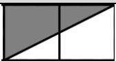</td><td>1 unit</td></tr><tr><td>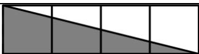</td><td>2 units</td></tr><tr><td>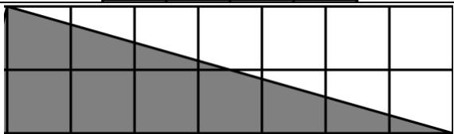</td><td>7 units</td></tr><tr><td>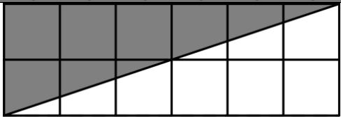</td><td>6 units</td></tr></table>

Next, we find the shaded and total area of each figure. 

<table><tr><td>Figure</td><td>Shaded Area</td><td>Total</td><td>Fraction of its area shaded</td></tr><tr><td>A</td><td><eq>2\frac{1}{2}</eq> units</td><td><eq>4\frac{1}{2}</eq> units</td><td><eq>\frac{2\frac{1}{2}}{4\frac{1}{2}} = \frac{5}{9}</eq></td></tr><tr><td>B</td><td>4 units</td><td>8 units</td><td><eq>\frac{4}{8} = \frac{1}{2}</eq></td></tr><tr><td>C</td><td>5 units</td><td>9 units</td><td><eq>\frac{5}{9}</eq></td></tr><tr><td>D</td><td><eq>1^{st} \text{ row: } \frac{1}{2} + \frac{3}{2} = 2 \text{ units}</eq><eq>2^{nd} \text{ row: 3 units}</eq><eq>3^{rd} \text{ row: 3 units}</eq><eq>4^{th} \text{ row: } \frac{1}{2} + \frac{3}{2} = 2 \text{ units}</eq>Total: <eq>2 + 3 + 3 + 2 = 10 \text{ units}</eq></td><td>16 units</td><td><eq>\frac{10}{16} = \frac{5}{8}</eq></td></tr><tr><td>E</td><td><eq>32 - (2+7+6) = 17 \text{ units}</eq></td><td>32 units</td><td><eq>\frac{17}{32}</eq></td></tr></table>

The sign ′ > ′ means ′???? ?????????????? ??ℎ????′ 

$$
\frac {5}{8} > \frac {5}{9}, \quad \frac {5}{8} = \frac {2 0}{3 2} > \frac {1 7}{3 2}, \quad \frac {5}{8} > \frac {4}{8} = \frac {1}{2}
$$

Thus, Figure D has the largest fraction of its area shaded. 

Answer: (D) 

## Question 15

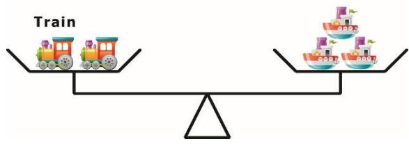

A train is heavier than a ship since 2 trains are needed to balance 3 ships. 

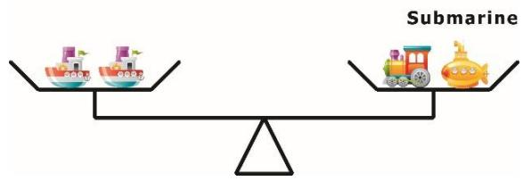

Since a train is heavier than a ship, then submarine is lighter than ship. 

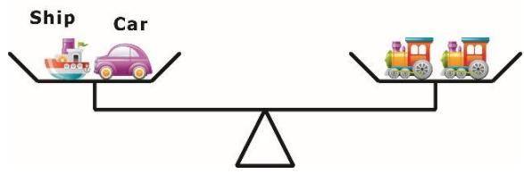

Since a train is heavier than a ship, then train is lighter than car. 

Thus, car is the heaviest. 

Answer: (A) 

## Question 16

Pair the numbers and add them as shown below. 

$$
(3 1 + 4 1) + (3 2 + 4 0) + \dots (3 5 + 3 7) + 3 6 = \underbrace {7 2 + \cdots + 7 2} _ {5 t i m e s} + 3 6 = 7 2 \times 5 + 6 = 3 9 6
$$

Answer: 396 

## Question 17

Area of small square = 64 cm2 

Length of small square = 8 cm 

Length of big square = 2 cm + 8 cm + 2 cm = 12 cm 

Perimeter of big square = 12 cm x 4 = 48 cm 

Answer: 48 cm 

## Question 18

If the hundreds digit is 1, then the largest possible product of the digits is 1 × 9 × 9 = 81. Thus, the hundreds digit must be 2 so that the 3-digit number is the smallest possible. 

If the tens digit is 5 or less, then the largest possible product of the digits is 2 × 5 × 9 = 90. Thus, the tens digit must be 6 so that the 3-digit number is the smallest possible. 

If the ones digit is 8 or less, then the largest possible product of the digits is 2 × 6 × 8 = 96. Thus, the ones digit must be 9 so that the 3-digit number is the smallest possible. 

Answer: 269 

## Question 19

The number of children must be a multiple of 7 (can be divided into groups of 7 with no remainder) and gives a remainder of 2 when it is divided by 9 (divided into groups of 9 with 2 left out children). 

List the numbers which give a remainder of 2 when divided by 9: 

11, 20, 29, 38, 47, 56, 65, … … 

The first multiple of 7 in the list is 56 which is the smallest possible number of children in the summer camp. 

Answer: 56 

## Question 20

The followings are the number of units in the bar drawing of each day: 

Monday – 2 units, 

Tuesday – 4 units (the second highest), 

Wednesday – 3 units, 

Thursday – 5 units, 

Friday – 1 unit (the lowest). 

The condition implies that 4 ?????????? − 1 ???????? = $60, and so 3 ?????????? = $60. Hence, 

Mary spent $60 ÷ 3 = $20 on Friday, $20 × 2 = $40 on Monday, $20 × 4 = $80 on 

Tuesday, $20 × 3 = $60 on Wednesday and $20 × 5 = $100 on Thursday. 

The total amount Mary spent from Monday to Friday is $20 + $40 + $60 + $80 + 

$100 = $300. On Saturday, Mary spent $\frac { 1 } { 5 } \times \$ 300 = \$ 60$ . 

Answer: $60 

## Question 21

Originally, there were equal number of tables and chairs in a shop. 

Tables 

Chairs 

Afterwards, 42 tables were sold, and 24 chairs were brought. 

Using the Model Method, let the number of tables be 1 unit. 

Tables 42 24 

Chairs 

The difference between the numbers of chairs and table is 3 units = 42 + 24 = 66 

1 unit = 66 ÷ 3 = 22 

The original number of chairs is 22 + 42 = 64. 

Answer: 64 

## Question 22

Year part of the dates doesn’t contain any digit “3”. 

Make a list and count the number of digit “3s” in the day and month part of the dates. 

<table><tr><td>Day</td><td>Month</td><td>Number of “3”</td></tr><tr><td>03, 13, 23, 30, 31</td><td>01</td><td>5</td></tr><tr><td>03, 13, 23</td><td>02</td><td>3</td></tr><tr><td>03, 13, 23, 30, 31</td><td>03</td><td>There are five “3s” in day part of the dates: 03, 13, 23, 30 and 31There are thirty-one “3s” in month part of the dates. <eq>5 + 31 = 36</eq></td></tr><tr><td>03, 13, 23, 30</td><td>04</td><td>4</td></tr><tr><td>03, 13, 23, 30, 31</td><td>05</td><td>5</td></tr><tr><td>03, 13, 23, 30</td><td>06</td><td>4</td></tr><tr><td>03, 13, 23, 30, 31</td><td>07</td><td>5</td></tr><tr><td>03, 13, 23, 30, 31</td><td>08</td><td>5</td></tr><tr><td>03, 13, 23, 30</td><td>09</td><td>4</td></tr><tr><td>03, 13, 23, 30, 31</td><td>10</td><td>5</td></tr><tr><td>03, 13, 23, 30</td><td>11</td><td>4</td></tr><tr><td>03, 13, 23, 30, 31</td><td>12</td><td>5</td></tr></table>

Total: 6 × 5 + 4 × 4 + 3 + 36 = ???? 

Answer: 85 

## Question 23

In the ones place addition, it is obvious that D = 0. 

In the hundreds place addition, since D = 0, B can only be 9 with 1 carried over from the tens place addition. Then in the thousands place addition, ?? + ?? + 1 = ?? = 9 (1 was carried over from the hundreds place addition). Hence C = 4, E = 3 and BDEC = ????????. 

Answer: 9034 

## Question 24

The smallest number can be 12, 24, 36 or 48. 

The largest number can be 45, 54, 36, 63, 27, 72, 18 or 81. 

The second largest number can be 61 or 72. The second largest number cannot be 83 as the largest number is at most 81. Hence the largest number can only be 72 or 81. 

If the largest number is 72, then the second largest number is 61. Subsequently, the smallest number must be 48 as it doesn’t contain 1, 2, 6 or 7. Therefore, the second smallest number can only be 53. However, there is only 1 odd number among these 4 numbers. 

Thus, the largest number is 81. Then the second largest number is 72 and the smallest number is 36. The second smallest number can be 45 or 54. Since there is only 1 odd number among these 4 numbers, then the second smallest number is 54. 

Answer: 54 

## Question 25

The original amount of Tom’s Lego: 

<table><tr><td></td></tr></table>

He lost 4 pieces at home and then gave $\frac 1 4$ of the remaining to his friend Gary. 

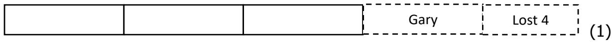

Next, 3 pieces got lost, then he gave $\frac 1 3$ of the new remaining to another friend Fiona. 

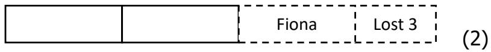

Another 2 pieces were lost, and then he gave half of the new remaining to his brother. At the end, Tom has 19 Lego blocks left. 

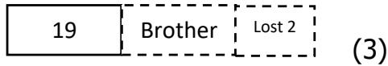

Working backwards, we get the following 

In (3), 19 × 2 + 2 = 40 

In (2), (40 ÷ 2) × 3 + 3 = 63 

In (1), (63 ÷ 3) × 4 + 4 = ???? 

Answer: 88 

# Solutions to SASMO 2020 Primary 4 (Grade 4)

## Question 1

$$
2 8 1 4 + 9 1 0 6 = 1 1 9 2 0
$$

$$
4 6 0 9 + 8 2 1 1 = 1 2 8 2 0
$$

$$
1 1 9 2 0 + 1 2 8 2 0 + 3 7 0 0 - 2 2 9 0 0 = 5 5 4 0
$$

Answer: (C) 

## Question 2

If gear A rotates anti-clockwise, gear B will rotate clockwise, gear C will rotate anticlockwise, gear D will rotate clockwise, gear E will rotate anti-clockwise, and gear F will rotate clockwise. The only statement that fits our observations is the statement in option D. 

Answer: (D) 

## Question 3

The first 55 counting numbers are: 

1, 3, 5, 7, 9, 

11, 13, 15, 17, 19, 

31, 33, 35, 37, 39, 

51, 53, 55, 57, 59, 

71, 73, 75, 77, 79, 

91, 93, 95, 97, 99, 

111, … … , 119, 

131, … … , 139, 

151, … … , 159 

171, … … , 179 

191, … … , 199 

Thus, the 55th counting number is 199. 

Answer: (D) 

## Question 4

The largest four-digit number is 9999. 

Hence, the largest possible four-digit number, which will still be a four-digit number after being added to 2020, is 9999 − 2020 = 7979. 

The smallest possible such four-digit number is 1000. 

From 1000 to 7979, there are 7979 − 1000 + 1 = ???????? numbers. 

Answer: (C) 

## Question 5

Write down the expressions of the remaining numbers in the grid, to facilitate calculation: 

<table><tr><td>10</td><td>11</td><td>13</td><td>15</td><td>17</td><td>19</td></tr><tr><td>12</td><td>12+11</td><td>12+13</td><td>12+15</td><td>12+17</td><td>12+19</td></tr><tr><td>14</td><td>14+11</td><td>14+13</td><td>14+15</td><td>14+17</td><td>14+19</td></tr><tr><td>16</td><td>16+11</td><td>16+13</td><td>16+15</td><td>16+17</td><td>16+19</td></tr><tr><td>18</td><td>18+11</td><td>18+13</td><td>18+15</td><td>18+17</td><td>18+19</td></tr></table>

Since each column is added 5 times and each row number added 6 times, the sum of all the numbers equals to: 

$$
\begin{array}{l} 1 0 + 5 \times 1 1 + 6 \times 1 2 + 5 \times 1 3 + 6 \times 1 4 + 5 \times 1 5 + 6 \times 1 6 + 5 \times 1 7 + 6 \times 1 8 + 5 \times 1 9 \\ = 1 0 + 5 \times (1 1 + 1 3 + 1 5 + 1 7 + 1 9) + 6 \times (1 2 + 1 4 + 1 6 + 1 8) \\ = 1 0 + 5 \times 7 5 + 6 \times 6 0 \\ = 1 0 + 3 7 5 + 3 6 0 \\ = 7 4 5 \\ \end{array}
$$

Answer: (A) 

## Question 6

When the hundreds place is 1: 

There are 4 numbers whose product of digits is 24: 138, 146, 164, 183. 

Similarly, we construct the following table. 

<table><tr><td>Hundreds digit</td><td>3-digit numbers</td><td>Quantity</td></tr><tr><td>1</td><td>138, 146, 164, 183</td><td>4</td></tr><tr><td>2</td><td>226, 234, 243, 262</td><td>4</td></tr><tr><td>3</td><td>318, 324, 342, 381</td><td>4</td></tr><tr><td>4</td><td>416, 423, 432, 461</td><td>4</td></tr><tr><td>6</td><td>614, 622, 641</td><td>3</td></tr><tr><td>8</td><td>813, 831</td><td>2</td></tr></table>

Thus, there are 4 × 4 + 3 + 2 = ???? three-digit numbers whose digits have a product of 24. 

Answer: (E) 

## Question 7

Since there are exactly 5 Saturdays and 4 Sunday, then there is no Sunday after $5 ^ { \mathrm { t h } }$ Saturday which means that the last Saturday is December $3 1 ^ { \mathsf { s t } }$ . Thus, the first day of this December falls on Thursday. 

<table><tr><td>Sunday</td><td>Monday</td><td>Tuesday</td><td>Wednesday</td><td>Thursday</td><td>Friday</td><td>Saturday</td></tr><tr><td></td><td></td><td></td><td></td><td>1</td><td>2</td><td>3</td></tr><tr><td>4</td><td>5</td><td>6</td><td>7</td><td>8</td><td>9</td><td>10</td></tr><tr><td>11</td><td>12</td><td>13</td><td>14</td><td>15</td><td>16</td><td>17</td></tr><tr><td>18</td><td>19</td><td>20</td><td>21</td><td>22</td><td>23</td><td>24</td></tr><tr><td>25</td><td>26</td><td>27</td><td>28</td><td>29</td><td>30</td><td>31</td></tr></table>

Answer: (D) 

## Question 8

Observe that the number 1 is inscribed in a rectangle with 4 sides. 

The pattern would be: (Number of sides of the shape a number is inscribed in − number) squared. 

For example, the number 6 is inscribed in an 8-sided shape, so $( 8 - 6 ) ^ { 2 } = 4 \qquad $ 

Hence, the missing number is $( 5 - 1 ) ^ { 2 } = \mathbf { 1 6 }$ 

Answer: (C) 

## Question 9

First number of the sequence is 6 1 = ????. $6 { \frac { 1 } { 3 } } = { \frac { 1 9 } { 3 } } .$ 3 

Second number of the sequence is $7 = { \frac { 2 1 } { 3 } } .$ 3 

Third number of the sequence is $7 { \frac { 2 } { 3 } } = { \frac { 2 3 } { 3 } } .$ 

Last number of the sequence is $\begin{array} { r } { 3 1 = \frac { 9 3 } { 3 } . } \end{array}$ 3： 

Since all fractions now have the same denominator, then counting them is the same as counting the number on the numerators, or the number of numbers in the list: 19, 21, $2 3 , \ldots 9 3$ . It can be counted using the formula: 

$$
(l a s t n u m b e r - f i r s t n u m b e r) \div c o m m o n d i f f e r e n c e + 1
$$

Thus, there are $( 9 3 - 1 9 ) \div 2 + 1 = 3 8$ numbers in the list. 

Answer: (C) 

## Question 10

According to the Divisibility Rule of 9, the sum of digits: $2 + 5 + \mathsf { M } + 4 + 8 = 1 9 + \mathsf { M }$ is a multiple of 9. 

The next multiple of 9 greater than 19 is 27. Hence M must be $2 7 - 1 9 = { \bf 8 }$ 

Answer: (B) 

## Question 11

In both ABCD and PQRS, their shaded regions and unshaded regions have the same base and the same height. In each of the rectangles ABCD and PQRS, the area of shaded regions and area of unshaded regions are the same. Hence, area of shaded regions in both ABCD and PQRS is half the area of the whole rectangle i.e., they are the same. 

Answer: (A) 

## Question 12

Since 5.67 P.M. is not an actual time, he next time after 4.56 P.M. when the digits of his digital clock are in increasing consecutive order is 12.34 A.M. 

12.34 A.M. is 7 hours 38 minutes or $7 \times 6 0 + 3 8 = 4 5 8$ minutes after 4.56 P.M. 

Answer: (B) 

## Question 13

80 candles take 80 days to be used up, and will give 80 pieces of wax to form 20 new candles. 

20 candles take another 20 days to be used up, and will give 20 pieces of wax to form 5 new candles. 

5 candles take another 5 days to be used up, and 4 out of the 5 pieces of wax can be used to form one last candle. 

One candle will be used up in 1 day. 

Total number of days $= 8 0 + 2 0 + 5 + 1 = \mathbf { 1 0 6 }$ 

Answer: (E) 

## Question 14

If George has watched it, 

<table><tr><td></td><td>Lie</td><td>Truth</td></tr><tr><td>George</td><td>√</td><td></td></tr><tr><td>Helen</td><td></td><td>√</td></tr><tr><td>Irene</td><td></td><td>√</td></tr></table>

Only one of them lied which does not fit criteria of the question. 

If Helen has watched it, 

<table><tr><td></td><td>Lie</td><td>Truth</td></tr><tr><td>George</td><td></td><td>√</td></tr><tr><td>Helen</td><td>√</td><td></td></tr><tr><td>Irene</td><td></td><td>√</td></tr></table>

Only one of them lied which does not fit criteria of the question. 

If Irene has watched it, 

<table><tr><td></td><td>Lie</td><td>Truth</td></tr><tr><td>George</td><td>√</td><td></td></tr><tr><td>Helen</td><td></td><td>√</td></tr><tr><td>Irene</td><td>√</td><td></td></tr></table>

Two of them lied and it fits the criteria of the question. 

Thus, Irene has watched the movie. 

Answer: (C) 

## Question 15

The missing piece must have 3 faces shown below to match the cube. 

<table><tr><td>Top face</td><td>Right face</td><td>Left face</td></tr><tr><td>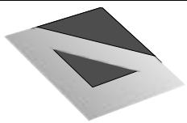</td><td>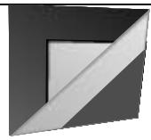</td><td>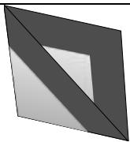</td></tr></table>

Only options B and E have all the 3 faces, but Option B has the correct orientation. 

Answer: (B) 

## Question 16

$$
9 5 \times 3 7 + 9 5 \times 4 2 + 2 1 \times 9 5
$$

$$
= 9 5 \times (3 7 + 4 2 + 2 1)
$$

$$
= 9 5 \times 1 0 0
$$

$$
= 9 5 0 0
$$

Answer: 9500 

## Question 17

Count by types of triangle. 

Types of triangles Quantity 

1-part triangles 11 

2-part triangles 12 

3-part triangles 6 

4-part triangles 6 

5-part triangles 3 

7-part triangles 4 

Total 42 

Answer: 42 

## Question 18

Working backwards: 

$$
8 0 \times 8 = 6 4 0
$$

$$
6 4 0 + 8 = 6 4 8
$$

$$
6 4 8 \div 8 = 8 1
$$

$$
8 1 - 8 = 7 3
$$

Answer: 73 

## Question 19

According to the diagram, there are 2 units of guests in January, 4 units in February, 5 units in March, 3 units in April, 1 unit in May and 5 units in June. 

In total, there are 2 + 4 + 5 + 3 + 1 + 5 = 20 units 

Total number of guests who visited the museum in January and May were 200 fewer than those in June: 

There are altogether 2 + 1 = 3 units in January and May while 5 units in June. 

Thus, 5 − 3 = 2 ?????????? = 200 

$$
1 \text {   unit   } = 1 0 0
$$

Total number of guests during the six months 

$$
= 2 0 \times 1 0 0
$$

$$
= 2 0 0 0
$$

Answer: 2000 

## Question 20

Note that the vertical side of the square is counted 4 times in vertical side lengths of the 4 rectangles. Similarly, the horizontal side of the square is also counted 4 times in horizontal sides lengths of the 4 rectangles. Thus, the sum of the perimeters of the four rectangles = 8 x length of square = 72 cm and the length of the square = 9 cm. 

Answer: 9 

## Question 21

Let us colour all the circles with 2 colours, say yellow (Y) and green (G). 

The diagram below shows one possible way to colour all the circles with just yellow and green: 

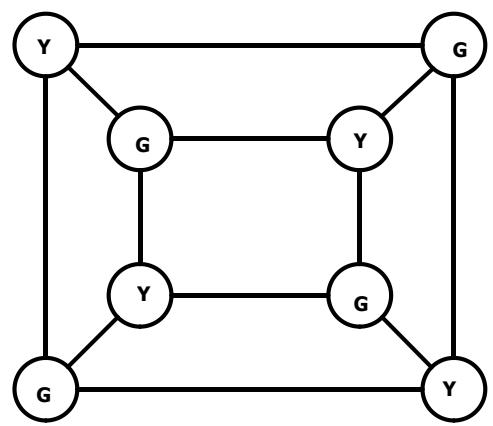

Answer: 2 

## Question 22

Let the number of chickens Ronald McDonald has be 5 units. 

Then the number of cows he has = 5 units × 3 ÷ 5 = 3 units. 

Then the number of goats he has = 3 units × 10 ÷ 2 = 15 units. 

Number of chickens and goats = (5 + 15) units = 20 units = 40 

Thus, 1 unit = 2, the number of chickens is 5 × 2 = 10 , the number of cows is 3 × 2 = 6, and the number of goats is 15 × 2 = 30 

Since a chicken has 2 feet, each cow and goat has 4 feet, then the total number of feet is 10 × 2 + 6 × 4 + 30 × 4 = 164. 

Answer: 164 

## Question 23

Let the number of candies Kate bought be 3 ??????????. 

$$
3 - 1 = 2 \text {units}
$$

$$
2 \text {units} = 2 6 \times 7 + 2 2 = 2 0 4
$$

$$
1 \text {unit} = 2 0 4 \div 2 = 1 0 2
$$

$$
T o t a l = 3 \text { units } = 1 0 2 \times 3 = 3 0 6
$$

Answer: 306 

## Question 24

Page 1 to Page 9: 9 digits 

Pages 10 to 99: 90 × 2 = 180 digits (99 − 10 + 1 = 90 2-digit numbers) 

The remaining pages have 237 − 9 − 180 = 48 digits 

48 digits belong to the 3-digit numbers, starting from Page 100. 

$$
4 8 \div 3 = 1 6
$$

$$
9 9 + 1 6 = 1 1 5
$$

The book has 115 pages. 

Answer: 115 

## Question 25

A four-digit number plus a four-digit number can only result in a five-digit number that starts with 1. Hence A must be 1. 

Since A is 1, D can only be 8 or 9. If D=8, then C = 0, E = D – A = 7 which is impossible since the last digit of B + B must be even. 

Thus D = 9, C = 0, E = D – F = 8, 8 = B + B or B = 4 and DBEC is 9480. 

Answer: 9480 