# Primary 4 (Grade 4) – GEP Practice

# 2020 Contest Problems with Full Solutions

Authors: 

Henry Ong, BSc, MBA, CMA 

Merlan Nagidulin, BSc 

© Singapore International Mastery Contests Centre (SIMCC) 

## All Rights Reserved

No part of this work may be reproduced or transmitted by any means, electronic or mechanical, including photocopying and recording, or by any information or retrieval system, without the prior permission of the publisher. 

## Section A (Correct answer – 2 points| No answer – 0 points| Incorrect answer – minus 1 point)

## Question 1

What is the value of the following sum? 

$$
2 8 1 4 + 3 7 0 0 + 4 6 0 9 + 8 2 1 1 + 9 1 0 6 - 2 2 9 0 0
$$

A. 4450 

B. 4540 

C. 5540 

D. 5450 

E. None of the above 

## Question 2

If Gear A rotates anti-clockwise, which of the following options is true? 

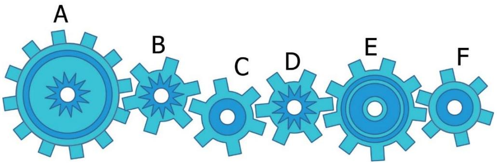

A. Gears A and C rotate in opposite directions 

B. Four gears rotate in the same direction 

C. Gear E rotates clockwise 

D. Gear C rotates anti-clockwise 

E. None of the above 

## Question 3

In the fictional ”Odd Island”, all the numbers contain only odd digits. The order of the counting numbers is the following 

$$
\begin{array}{l} 1, 3, 5, 7, \dots , 1 9, 3 1, 3 3, \dots \end{array}
$$

What is the 55th counting number in the island? 

A. 99 

B. 101 

C. 197 

D. 199 

E. None of the above 

## Question 4

How many four-digit numbers are there such that if we add 2020 to each of the numbers, the results are still four-digit numbers? 

A. 7020 

B. 6880 

C. 6980 

D. 7880 

E. None of the above 

## Question 5

In the grid below, the first row and the first column have been filled up with numbers from 10 to 19. The empty cells will be filled up with numbers by adding the topmost number in the column with the leftmost number in the row. (For example, ?? = 17 + 14 = 31 and ?? = 19 + 18 = 37.) After filling up all the empty cells, what will the sum of all the numbers in the grid be? 

<table><tr><td>10</td><td>11</td><td>13</td><td>15</td><td>17</td><td>19</td></tr><tr><td>12</td><td></td><td></td><td></td><td></td><td></td></tr><tr><td>14</td><td></td><td></td><td></td><td>A</td><td></td></tr><tr><td>16</td><td></td><td></td><td></td><td></td><td></td></tr><tr><td>18</td><td></td><td></td><td></td><td></td><td>B</td></tr></table>

A. 745 

B. 725 

C. 145 

D. 135 

E. None of the above 

## Question 6

Each of the numbers 138 and 243 has digits whose product is 24. How many threedigit numbers are there whose digits have a product of 24? 

A. 8 

B. 9 

C. 12 

D. 18 

E. None of the above 

## Question 7

The month of December of a certain calendar year has exactly 5 Saturdays and 4 Sundays. On which day of the week does the first day of December fall? 

A. Monday 

B. Tuesday 

C. Wednesday 

D. Thursday 

E. None of the above 

## Question 8

What is the missing number in the following pattern? 

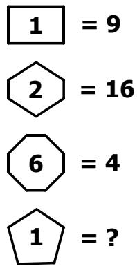

$$
\boxed {1} = 9
$$

$$
② = 1 6
$$

$$
⑥ = 4
$$

$$
ⓛ = ?
$$

A. 5 

B. 10 

C. 16 

D. 20 

E. None of the above 

## Question 9

How many numbers are there in the list below? 

$$
6 \frac {1}{3}, 7, 7 \frac {2}{3}, 8 \frac {1}{3}, \dots , 3 0 \frac {1}{3}, 3 1
$$

A. 25 

B. 26 

C. 38 

D. 37 

E. None of the above 

## Question 10

The five-digit number 25M48 is a multiple of 9. What digit does M represent? 

A. 9 

B. 8 

C. 7 

D. 6 

E. None of the above 

## Question 11

In the figure below, ???????? and ???????? are rectangles. ???? = ???? = 6 cm and ???? = ???? = 10 cm. Compare the areas of the shaded region of rectangle ???????? and ????????. Which of the following statements below is true? 

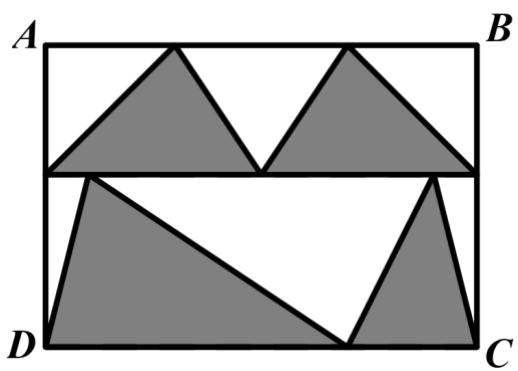

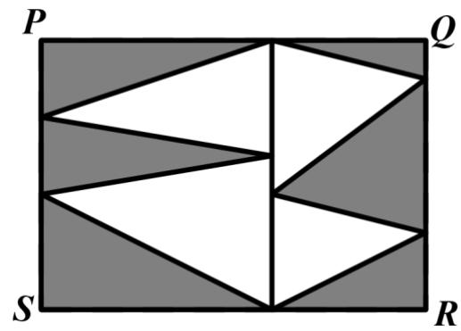

A. The area of the shaded region of ABCD is equal to the area of the shaded region of PQRS. 

B. The area of the shaded region of ABCD is greater than the area of the shaded region of PQRS. 

C. The area of the shaded region of ABCD is less than the area of the shaded region of PQRS. 

D. Cannot be determined 

E. None of the above 

## Question 12

The time now is 16:56 and Archie’s 12-hour digital clock shows 4:56 P.M. He realizes that the digits of his digital clock are in increasing consecutive order. When the time is 12:17 P.M. or A.M., the clock will show 12:17 P.M. or A.M. respectively. How many minutes later will Archie’s clock show digits again in increasing consecutive order? 

A. 507 minutes 

B. 458 minutes 

C. 467 minutes 

D. 407 minutes 

E. None of the above 

## Question 13

Ali has 80 candles. He lights 1 candle every day. He can recycle the wax of four used candles to form a new candle. After how many days will he need to buy more candles? 

A. 80 

B. 130 

C. 132 

D. 133 

E. None of the above 

## Question 14

Among George, Helen and Irene, only one of them watched the movie ‘Avengers’. When they were asked about the movie, they gave the following replies. 

George said: Helen watched it. 

Helen said: I have not watched it. 

Irene said: I have not watched it. 

If two of them lied, who watched the movie? 

A. George 

B. Helen 

C. Irene 

D. Impossible to determine 

E. None of the above 

## Question 15

Which one of the following options is a missing piece of the cube on the right? 

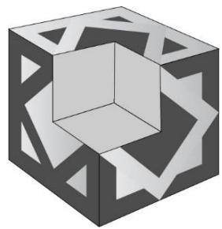

A

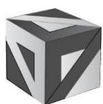

B

C

D

E

## Section B (Correct answer – 4 points| Incorrect or No answer – 0 points)

When an answer is a 1-digit number, shade “0” for the tens, hundreds and thousands place. 

Example: if the answer is 7, then shade 0007 

When an answer is a 2-digit number, shade “0” for the hundreds and thousands place. 

Example: if the answer is 23, then shade 0023 

When an answer is a 3-digit number, shade “0” for the thousands place. 

Example: if the answer is 785, then shade 0785 

When an answer is a 4-digit number, shade as it is. 

Example: if the answer is 4196, then shade 4196 

## Question 16

What is the value of $9 5 \times 3 7 + 9 5 \times 4 2 + 2 1 \times 9 5 ?$ 

## Question 17

How many triangles are there in the figure below? 

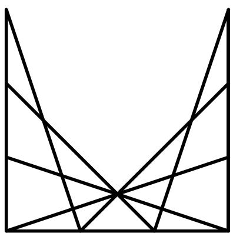

## Question 18

I am thinking of a number. If the number is added to 8, the sum is multiplied by 8, 8 is subtracted from the product, and the difference is divided by 8, it yields a quotient of 80. What is this number? 

## Question 19

The graph below shows the number of guests who visited the National Museum during the first six months of 2019. All the horizontal lines are equally spaced. If the total number of guests who visited in January and May were 200 fewer than those in June, how many people visited the museum in total during the six months? 

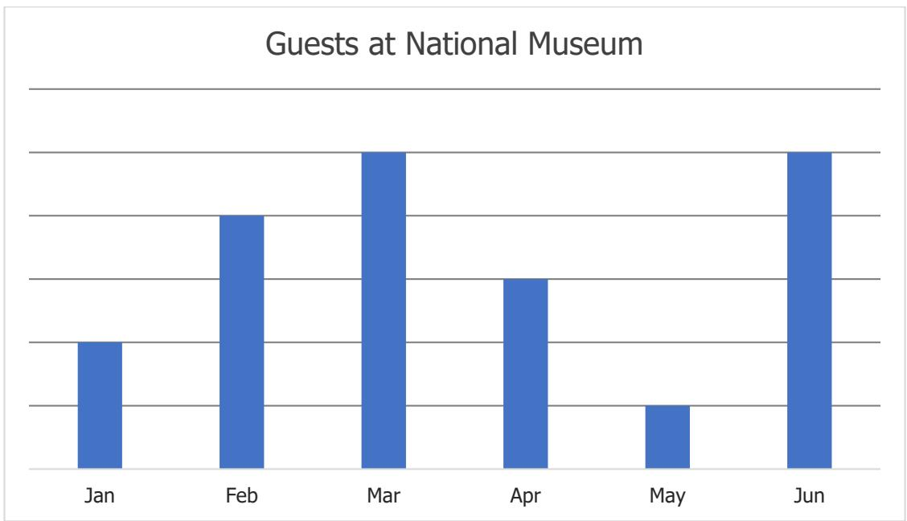

## Question 20

The following square is divided into four rectangles as shown. The sum of the perimeters of the four rectangles is 72 cm. Find the side length (in cm) of the square. 

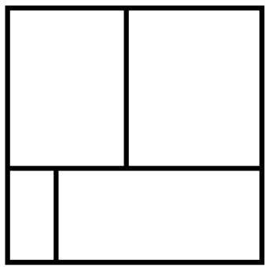

## Question 21

One wants to colour the circles in the figure below such that any pair of circles connected by a line segment shares different colours. What is the least number of colours needed for the colouring? 

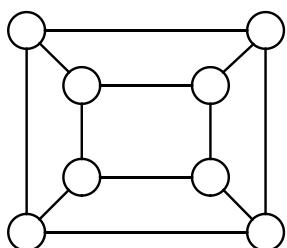

## Question 22

Ronald McDonald, a farmer, has chickens, goats and cows in his farm. He has 40 chickens and goats combined. He notices that 3 times the number of his chickens is 5 times the number of his cows. On the other hand, 2 times the number of goats is 10 times the number of his cows. Help Ronald McDonald determine the total number of animal feet in his farm. 

## Question 23

Kate bought some pieces of candy. She ate $\frac 1 3$ at home and brought the rest to school. She shared the candy with her seven friends so that each friend received 26 pieces of candy. If Kate left with 22 pieces of candy, how many pieces of candy did she initially buy? 

## Question 24

A printer printed 237 digits for all the page numbers of a storybook. How many pages are there in the storybook? 

## Question 25

In the following, all the different letters stand for different digits. 

<table><tr><td></td><td>A</td><td>B</td><td>A</td><td>C</td></tr><tr><td>+</td><td>D</td><td>B</td><td>E</td><td>C</td></tr><tr><td></td><td>A</td><td>C</td><td>E</td><td>D</td></tr></table>

Find the value of the 4-digit number DBEC. 

# Solutions to SASMO 2020 Primary 4 (Grade 4)

## Question 1

$$
2 8 1 4 + 9 1 0 6 = 1 1 9 2 0
$$

$$
4 6 0 9 + 8 2 1 1 = 1 2 8 2 0
$$

$$
1 1 9 2 0 + 1 2 8 2 0 + 3 7 0 0 - 2 2 9 0 0 = 5 5 4 0
$$

Answer: (C) 

## Question 2

If gear A rotates anti-clockwise, gear B will rotate clockwise, gear C will rotate anticlockwise, gear D will rotate clockwise, gear E will rotate anti-clockwise, and gear F will rotate clockwise. The only statement that fits our observations is the statement in option D. 

Answer: (D) 

## Question 3

The first 55 counting numbers are: 

1, 3, 5, 7, 9, 

11, 13, 15, 17, 19, 

31, 33, 35, 37, 39, 

51, 53, 55, 57, 59, 

71, 73, 75, 77, 79, 

91, 93, 95, 97, 99, 

111, … … , 119, 

131, … … , 139, 

151, … … , 159 

171, … … , 179 

191, … … , 199 

Thus, the 55th counting number is 199. 

Answer: (D) 

## Question 4

The largest four-digit number is 9999. 

Hence, the largest possible four-digit number, which will still be a four-digit number after being added to 2020, is 9999 − 2020 = 7979. 

The smallest possible such four-digit number is 1000. 

From 1000 to 7979, there are 7979 − 1000 + 1 = ???????? numbers. 

Answer: (C) 

## Question 5

Write down the expressions of the remaining numbers in the grid, to facilitate calculation: 

<table><tr><td>10</td><td>11</td><td>13</td><td>15</td><td>17</td><td>19</td></tr><tr><td>12</td><td>12+11</td><td>12+13</td><td>12+15</td><td>12+17</td><td>12+19</td></tr><tr><td>14</td><td>14+11</td><td>14+13</td><td>14+15</td><td>14+17</td><td>14+19</td></tr><tr><td>16</td><td>16+11</td><td>16+13</td><td>16+15</td><td>16+17</td><td>16+19</td></tr><tr><td>18</td><td>18+11</td><td>18+13</td><td>18+15</td><td>18+17</td><td>18+19</td></tr></table>

Since each column is added 5 times and each row number added 6 times, the sum of all the numbers equals to: 

$$
\begin{array}{l} 1 0 + 5 \times 1 1 + 6 \times 1 2 + 5 \times 1 3 + 6 \times 1 4 + 5 \times 1 5 + 6 \times 1 6 + 5 \times 1 7 + 6 \times 1 8 + 5 \times 1 9 \\ = 1 0 + 5 \times (1 1 + 1 3 + 1 5 + 1 7 + 1 9) + 6 \times (1 2 + 1 4 + 1 6 + 1 8) \\ = 1 0 + 5 \times 7 5 + 6 \times 6 0 \\ = 1 0 + 3 7 5 + 3 6 0 \\ = 7 4 5 \\ \end{array}
$$

Answer: (A) 

## Question 6

When the hundreds place is 1: 

There are 4 numbers whose product of digits is 24: 138, 146, 164, 183. 

Similarly, we construct the following table. 

<table><tr><td>Hundreds digit</td><td>3-digit numbers</td><td>Quantity</td></tr><tr><td>1</td><td>138, 146, 164, 183</td><td>4</td></tr><tr><td>2</td><td>226, 234, 243, 262</td><td>4</td></tr><tr><td>3</td><td>318, 324, 342, 381</td><td>4</td></tr><tr><td>4</td><td>416, 423, 432, 461</td><td>4</td></tr><tr><td>6</td><td>614, 622, 641</td><td>3</td></tr><tr><td>8</td><td>813, 831</td><td>2</td></tr></table>

Thus, there are 4 × 4 + 3 + 2 = ???? three-digit numbers whose digits have a product of 24. 

Answer: (E) 

## Question 7

Since there are exactly 5 Saturdays and 4 Sunday, then there is no Sunday after $5 ^ { \mathrm { t h } }$ Saturday which means that the last Saturday is December $3 1 ^ { \mathsf { s t } }$ . Thus, the first day of this December falls on Thursday. 

<table><tr><td>Sunday</td><td>Monday</td><td>Tuesday</td><td>Wednesday</td><td>Thursday</td><td>Friday</td><td>Saturday</td></tr><tr><td></td><td></td><td></td><td></td><td>1</td><td>2</td><td>3</td></tr><tr><td>4</td><td>5</td><td>6</td><td>7</td><td>8</td><td>9</td><td>10</td></tr><tr><td>11</td><td>12</td><td>13</td><td>14</td><td>15</td><td>16</td><td>17</td></tr><tr><td>18</td><td>19</td><td>20</td><td>21</td><td>22</td><td>23</td><td>24</td></tr><tr><td>25</td><td>26</td><td>27</td><td>28</td><td>29</td><td>30</td><td>31</td></tr></table>

Answer: (D) 

## Question 8

Observe that the number 1 is inscribed in a rectangle with 4 sides. 

The pattern would be: (Number of sides of the shape a number is inscribed in − number) squared. 

For example, the number 6 is inscribed in an 8-sided shape, so $( 8 - 6 ) ^ { 2 } = 4 \qquad $ 

Hence, the missing number is $( 5 - 1 ) ^ { 2 } = \mathbf { 1 6 }$ 

Answer: (C) 

## Question 9

$6 { \frac { 1 } { 3 } } = { \frac { 1 9 } { 3 } } .$ 

Second number of the sequence is $7 = { \frac { 2 1 } { 3 } } .$ ?? 

Third number of the sequence is $7 { \frac { 2 } { 3 } } = { \frac { 2 3 } { 3 } } .$ 

Last number of the sequence is $\begin{array} { r } { 3 1 = \frac { 9 3 } { 3 } . } \end{array}$ ?? 

Since all fractions now have the same denominator, then counting them is the same as counting the number on the numerators, or the number of numbers in the list: 19, 21, 23, … 93. It can be counted using the formula: 

$$
(l a s t n u m b e r - f i r s t n u m b e r) \div c o m m o n d i f f e r e n c e + 1
$$

Thus, there are $( 9 3 - 1 9 ) \div 2 + 1 = 3 8$ numbers in the list. 

Answer: (C) 

## Question 10

According to the Divisibility Rule of 9, the sum of digits: $2 + 5 + \mathsf { M } + 4 + 8 = 1 9 + \mathsf { M }$ is a multiple of 9. 

The next multiple of 9 greater than 19 is 27. Hence M must be $2 7 - 1 9 = 8 $ 

Answer: (B) 

## Question 11

In both ABCD and PQRS, their shaded regions and unshaded regions have the same base and the same height. In each of the rectangles ABCD and PQRS, the area of shaded regions and area of unshaded regions are the same. Hence, area of shaded regions in both ABCD and PQRS is half the area of the whole rectangle i.e., they are the same. 

Answer: (A) 

## Question 12

Since 5.67 P.M. is not an actual time, he next time after 4.56 P.M. when the digits of his digital clock are in increasing consecutive order is 12.34 A.M. 

12.34 A.M. is 7 hours 38 minutes or $7 \times 6 0 + 3 8 = 4 5 8$ minutes after 4.56 P.M. 

Answer: (B) 

## Question 13

80 candles take 80 days to be used up, and will give 80 pieces of wax to form 20 new candles. 

20 candles take another 20 days to be used up, and will give 20 pieces of wax to form 5 new candles. 

5 candles take another 5 days to be used up, and 4 out of the 5 pieces of wax can be used to form one last candle. 

One candle will be used up in 1 day. 

Total number of days $= 8 0 + 2 0 + 5 + 1 = \mathbf { 1 0 6 }$ 

Answer: (E) 

## Question 14

If George has watched it, 

<table><tr><td></td><td>Lie</td><td>Truth</td></tr><tr><td>George</td><td>√</td><td></td></tr><tr><td>Helen</td><td></td><td>√</td></tr><tr><td>Irene</td><td></td><td>√</td></tr></table>

Only one of them lied which does not fit criteria of the question. 

If Helen has watched it, 

<table><tr><td></td><td>Lie</td><td>Truth</td></tr><tr><td>George</td><td></td><td>√</td></tr><tr><td>Helen</td><td>√</td><td></td></tr><tr><td>Irene</td><td></td><td>√</td></tr></table>

Only one of them lied which does not fit criteria of the question. 

If Irene has watched it, 

<table><tr><td></td><td>Lie</td><td>Truth</td></tr><tr><td>George</td><td>√</td><td></td></tr><tr><td>Helen</td><td></td><td>√</td></tr><tr><td>Irene</td><td>√</td><td></td></tr></table>

Two of them lied and it fits the criteria of the question. 

Thus, Irene has watched the movie. 

Answer: (C) 

## Question 15

The missing piece must have 3 faces shown below to match the cube. 

<table><tr><td>Top face</td><td>Right face</td><td>Left face</td></tr><tr><td>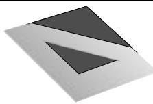</td><td>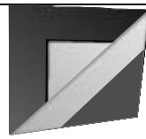</td><td>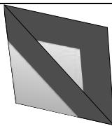</td></tr></table>

Only options B and E have all the 3 faces, but Option B has the correct orientation. 

Answer: (B) 

## Question 16

$$
9 5 \times 3 7 + 9 5 \times 4 2 + 2 1 \times 9 5
$$

$$
= 9 5 \times (3 7 + 4 2 + 2 1)
$$

$$
= 9 5 \times 1 0 0
$$

$$
= 9 5 0 0
$$

Answer: 9500 

## Question 17

Count by types of triangle. 

Types of triangles Quantity 

1-part triangles 11 

2-part triangles 12 

3-part triangles 6 

4-part triangles 6 

5-part triangles 3 

7-part triangles 4 

Total 42 

Answer: 42 

## Question 18

Working backwards: 

$$
8 0 \times 8 = 6 4 0
$$

$$
6 4 0 + 8 = 6 4 8
$$

$$
6 4 8 \div 8 = 8 1
$$

$$
8 1 - 8 = 7 3
$$

Answer: 73 

## Question 19

According to the diagram, there are 2 units of guests in January, 4 units in February, 5 units in March, 3 units in April, 1 unit in May and 5 units in June. 

In total, there are 2 + 4 + 5 + 3 + 1 + 5 = 20 units 

Total number of guests who visited the museum in January and May were 200 fewer than those in June: 

There are altogether 2 + 1 = 3 units in January and May while 5 units in June. 

Thus, 5 − 3 = 2 ?????????? = 200 

$$
1 \text {   unit   } = 1 0 0
$$

Total number of guests during the six months 

$$
= 2 0 \times 1 0 0
$$

$$
= 2 0 0 0
$$

Answer: 2000 

## Question 20

Note that the vertical side of the square is counted 4 times in vertical side lengths of the 4 rectangles. Similarly, the horizontal side of the square is also counted 4 times in horizontal sides lengths of the 4 rectangles. Thus, the sum of the perimeters of the four rectangles = 8 x length of square = 72 cm and the length of the square = 9 cm. 

Answer: 9 

## Question 21

Let us colour all the circles with 2 colours, say yellow (Y) and green (G). 

The diagram below shows one possible way to colour all the circles with just yellow and green: 

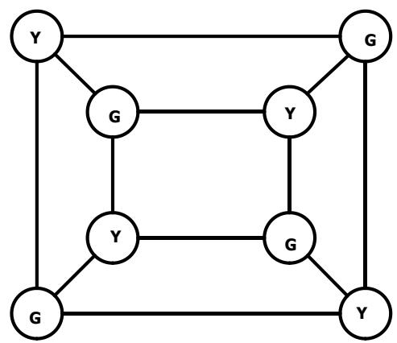

Answer: 2 

## Question 22

Let the number of chickens Ronald McDonald has be 5 units. 

Then the number of cows he has = 5 units × 3 ÷ 5 = 3 units. 

Then the number of goats he has = 3 units × 10 ÷ 2 = 15 units. 

Number of chickens and goats = (5 + 15) units = 20 units = 40 

Thus, 1 unit = 2, the number of chickens is 5 × 2 = 10 , the number of cows is 3 × 2 = 6, and the number of goats is 15 × 2 = 30 

Since a chicken has 2 feet, each cow and goat has 4 feet, then the total number of feet is 10 × 2 + 6 × 4 + 30 × 4 = 164. 

Answer: 164 

## Question 23

Let the number of candies Kate bought be 3 ??????????. 

$$
3 - 1 = 2 \text {units}
$$

$$
2 \text {units} = 2 6 \times 7 + 2 2 = 2 0 4
$$

$$
1 \text {unit} = 2 0 4 \div 2 = 1 0 2
$$

$$
T o t a l = 3 \text { units } = 1 0 2 \times 3 = 3 0 6
$$

Answer: 306 

## Question 24

Page 1 to Page 9: 9 digits 

Pages 10 to 99: 90 × 2 = 180 digits (99 − 10 + 1 = 90 2-digit numbers) 

The remaining pages have 237 − 9 − 180 = 48 digits 

48 digits belong to the 3-digit numbers, starting from Page 100. 

$$
4 8 \div 3 = 1 6
$$

$$
9 9 + 1 6 = 1 1 5
$$

The book has 115 pages. 

Answer: 115 

## Question 25

A four-digit number plus a four-digit number can only result in a five-digit number that starts with 1. Hence A must be 1. 

Since A is 1, D can only be 8 or 9. If D=8, then C = 0, E = D – A = 7 which is impossible since the last digit of B + B must be even. 

Thus D = 9, C = 0, E = D – F = 8, 8 = B + B or B = 4 and DBEC is 9480. 

Answer: 9480 