# Primary 5 (Grade 5) – GEP Practice

# 2019 & 2020 Contest Problems with Full Solutions

Authors: 

Henry Ong, BSc, MBA, CMA Merlan Nagidulin, BSc 

## © Singapore International Mastery Contests Centre (SIMCC) All Rights Reserved

No part of this work may be reproduced or transmitted by any means, electronic or mechanical, including photocopying and recording, or by any information or retrieval system, without the prior permission of the publisher. 

## About the Authors:

Henry Ong is the Founder of SASMO and President of Singapore International Mastery Contest Centre (SIMCC). He conducts Math Olympiad classes, not only in Singapore but also around the 20 countries that have joined SASMO. He now travels round the world giving out awards and scholarships to students and teachers. He is now promoting new contests, International Scholastic Trust Teachers’ Institute (ISTTI) and International Junior Honor Society (IJHS). 

In February 2020, Henry was appointed Co-Chair of the Council Administration of Cambodian Mathematical Society (CA_CMS). Henry will share and use his great wealth of experience, expertise, and international networks to contribute effectively to: (1) promoting STEM: Science, Technology, Engineering, and Mathematics; (2) organizing and undertaking multilateral partnership programs; and (3) strengthening and improving the public-private partnership for development of STEM, research and development, and research and innovation as well as teacher professional development in Cambodia with relevant stakeholders in close collaboration and consultation with relevant leadership and management of Ministry of Education, Youth and Sport, especially Cambodian Mathematical Society (CMS), New Generation Pedagogical Research Center (NGPRC), National Institute of Education(NIE) and Teacher Training Department (TTD). 

Merlan Nagidulin is the Academic Director for Math and Science Olympiad and General Manager of SIMCC. Merlan graduated with a Bachelor of Science, Honours in Mathematical Sciences from Nanyang Technological University. Merlan won 2 gold medals in Kazakhstan National Math Olympiad and was awarded a bronze medal in the most prestigious International Math Olympiad (IMO Slovenia 2006). 

## Publisher

Noble Education Pte Ltd specialises in printing educational resources and educational games. We introduced many thinking games and puzzles to MOE schools in Singapore and overseas. We help students, teachers and entrepreneurs to self-publish their own titles. We print contest papers for all Singapore International Math Contest Centre (SIMCC) academic competitions world-wide. 

Noble Education Pte Ltd – 55 Lor L Telok Kurau, 03-69, Bright Centre, Singapore 425500 SIMCC – 199A Thomson Road, Goldhill Centre, Singapore 307636 Website: www.simcc.org 

If you spot any mistakes, kindly email us at training@simcc.org . 

Copyright © 2021 by SIMCC 

All rights reserved. No part of this work may be reproduced or transmitted in any form or by any means, electronic or mechanical, including photocopying and recording, or by any information or retrieval system, except as may be expressly permitted by the Copyright Act of 1976 or in writing to the Publisher. Requests for Permission should be addressed to: Permissions, Mr Henry Ong, c/o 55 Lor L Telok Kurau, 03-69, Bright Centre, Singapore 425500 or email: admin@simcc.org 

First Edition printed in Singapore, 2021 

ISBN: 978-98-11801-19-8 

## Table of Contents

International Scholastic Trust President’s Message........... 

Competition and Prizes ......... 

Introduction ...... 

Problem Solving Procedure ......... 

Problem Solving Strategies .......... 

SASMO 2019 Primary 5 (Grade 5) Contest Questions ............ 

SASMO 2020 Primary 5 (Grade 5) Contest Questions ............... .. 20 

Solutions to SASMO 2019 Primary 5 (Grade 5) ........... .. 32 

Solutions to SASMO 2020 Primary 5 (Grade 5) ........... .. 42 

# International Scholastic Trust President’s Message

Dear SIMCC contestants, parents, teachers, and partners, 

I hope all of you are safe and healthy. We have all gone through so much within the past year, and we should rejoice - we are all alive and well. Despite all the groom and predictions of the worst recession to hit us very soon, we at SIMCC, are expanding globally – adding another 14 country partners to a total of 35 countries and territories within the last 10 months, and setting up sales offices in Cambodia and India, in addition to taking over the ICAS competitions and staff from the University of New South Wales Global Office based in Hong Kong and Macau. 

Two years, Sophie Koh, our Senior Director of IT, Events and Operations left Singapore Polytechnic as a Senior Lecturer of IT to join us. She has almost digitally transformed most of our operations and contest systems. This will provide valuable big data in formative and summative assessments for teachers to measure their students and inform their teaching. Parents and students will also receive Detailed Performance Reports (DPR) in our Member Development Portal (MDP) to improve their Academic Skills. Teachers and their schools will be able to download Students’ Analytical Performance Reports (SAPR). SIMCC together with our partners will be conducting more Webinars to prepare teachers and parents to use our contests and data to arm their wards with Skills and Recognition for SUCCESS. 

From February 16 to April 30, 2021, we are offering the 1st Singapore Math Global Assessment for grades 1 to 11 students. We want to open this up to every country, especially since Singapore Math textbooks are used in schools from over 70 countries. We want to share our rich Singapore Math heritage that has propelled Singapore students to the top of PISA rankings since the 1990s. We also have excellent teachers, Learning Management System (LMS), Math textbooks, assessment books, as well as teacher training to help improve math education worldwide. Reach out to us for help, if you want your students to become Mathematics Heroes! 

The global winners of SINGA Math Assessments are invited for the 1st SINGA Math Global Finals, in their home countries on September 11, 2021. The prize for the Overall Champion of grades 1 to 10/11 is a S$600 competition package to compete in the STEAM AHEAD International Junior Mathematics Olympiad (IJMO) to be held in Bali, Indonesia from December 3 to 7, 2021. The prize for Overall Runner-up is S$250 and 2nd Runner-up is S$150, offering a total prize award of S$10,000. Winners of Gold (10%) and Silver (15%) are invited to compete in STEAM AHEAD IJMO 2021. 

From 2021, we will be offering most of our contests to grade 12 students – SASMO, DrCT, SIMOC, and STEAM AHEAD. This will pave the way for Grades 12 SIMCC students to apply for SIMCC and STS’s US$270,000 endowed 2 scholarships for 4-year undergraduate studies at Southern Illinois University (SIU), Carbondale, Illinois, USA in STEM related fields. SIU has also given SIMCC over 30 SIU International Student Tuition Grants to award to top SIMCC students to pursue their university education. SIMCC will setup our own network for SIMCC scholars at SIU. This will help us expand SIMCC contests in North America and generate revenue for us to fund more scholarships. 

Best Regards, 

Henry Ong, President 

## Competition and Prizes

SASMO is devoted and dedicated to bringing a love for Mathematics to students. Unlike most Math Olympiad Competitions, SASMO caters not only to students in the top 5% but to the top 40% instead. It aims to arouse students’ interest and enthusiasm for mathematical problem solving, develop mathematical intuition, reasoning and logical thinking, as well as creative and critical thinking. In addition, this can help improve the students’ math grades because they can apply problem-solving strategies learnt during the training to their daily school mathematics. 

## History:

Created in 2006, SASMO is one of the largest Math Olympiads in the Asian region. We have expanded the competition to provide an International platform for students from Primary 2 to Secondary 4, with differentiated contest papers for every level. SASMO awards medals and certificates to the top 40% of participants. 

## Calculators are not permitted

When a problem introduces a more advanced concept, all necessary definitions are included. 

## Awards:

Each participant receives a Certificate of Participation or an award certificate for winners below. Each of the top 8%, 12% and 20% of all participants receives a Gold, Silver or Bronze medal and certificate respectively. Each student who achieves a Perfect Score of 85 points receives a Perfect Score certificate, Gold medal and $100. 

## Introduction

## For Students Taking the Math Olympiad Challenge

Congratulations. You have embarked on a journey of scholarship. Competitions like SASMO open many doors for you. Firstly, you learn new and interesting approaches to problem-solving and new topics. Next, you will meet talented students from other schools as you attend trainings and competitions. You build your endurance to “puzzle” out challenging problems and build your reputation as a problem solver. Finally, you will be exposed to various international competitions and scholarship opportunities. Here in Singapore, you increase your chances of getting into a top school via Direct School Admissions (DSA) and entry into the Gifted Education Programme as you compete regularly in high level competitions. 

This book is written for the participants in the Singapore and Asian Schools Math Olympiads (SASMO). It helps students to prepare well for the contest and develop higher-order thinking. All problems are designed to help students develop the ability to think mathematically, rather than to teach more advanced or unusual topics. The fun is in how you can see patterns and ways of solving each problem in non-technical ways even though you have not learnt the topic yet! 

In addition to the contest problems, the reader is provided with a list of familiar mathematical terms, as well as a review of some of the topics that are likely to be tested in the Olympiad. The book also contains some solved examples to provide different problem-solving techniques, and to familiarize the participant with different types of Olympiad questions. It is advised that the reader spends appropriate time studying these questions and solutions, as they will assist in tackling actual Olympiad problems. 

How to Use This Book: Practice daily for 15 minutes per hour instead of 4 hours of learning once a month. Your mind needs to absorb each new thought, and constant practice allows frequent review of previously learned concepts and skills. Together, you can remember many new problem-solving approaches. Try to spend 10 or 15 minutes daily doing two or three problems. This approach should help you minimize the time needed to develop the ability to think mathematically. 

Whether you solve a problem quickly or if you are confused, it is worth studying the solutions in this book, because often they offer unexpected insights that can help you understand the problem more fully. After you have invested time – trying to solve each problem any way you can, reviewing our solutions is very effective. Many of the problems in this book can be solved in more than one way. There is always a single answer, but there can be many paths to that answer. Once you solve a problem, go back and see if you can solve it by another method. Then check our solutions to see if any of them differ from yours. 

Enjoy working on these challenges and you will soon be in a different league from your peers who have not taken any international competition. We look forward to inviting you if you are a bronze, silver, gold or perfect score medallist for further training. 

## Problem Solving Procedure

You may go through several phases when solving a problem such as trying to understand the problem, working on a specific approach (planning and attempting), getting stuck and trying to get unstuck, critically examining solutions or communicating. The work may involve going back and forth between these different phases of problem solving. 

In solving any problem, it helps to have a working procedure. You might want to consider this four-step procedure: Understand, Plan, Try It, and Look Back. 

## Understand

Before you can solve a problem, you must first understand it. Read and re-read the problem carefully to find all the clues and determine what the question is asking you to find. What is the unknown? What is the data? What is the condition? 

## Plan

Once you understand the question and the clues, it's time to use your previous experience with similar problems to look for strategies and tools to answer the question. Do you know a related problem? Look at the unknown! And try to think of a familiar problem having the same or a similar unknown? 

## Try It

After deciding on a plan, you should try it and see what answer you come up with. Can you see clearly that the steps are correct? 

But can you also prove that the steps are correct? 

## Are you feeling stuck?

Many different approaches can be tried to get unstuck. One approach is to try working a simpler version of the problem, and use the solution to the problem to get insights that are useful in solving the original problem. In the next chapter, we will show some common solving approaches. 

If you are discouraged after a few failed attempts, read this quote from the famous scientist, Thomas Edison. An assistant asked, "Why are you wasting your time and money? We have had failure after failure, almost a thousand of them. Why do you continue to pursue this impossible task?" Edison said, "We haven't had a thousand failures, we've just discovered a thousand ways to not invent the electric bulb." 

## Look Back

Once you've tried a problem and found an answer, go back to the problem and see if you've really answered the question. Sometimes it's easy to overlook something. If you missed something check your plan and try the problem again. Can you check the result? 

Can you check the argument? 

Can you derive the result differently? 

Can you see it at a glance? 

## Problem Solving Strategies

## 1. Change the representation

Using a wrong representation may make a problem impossible to solve. 

Strategies of changing representation include drawing a picture and acting it out. 

DRAW A PICTURE: By drawing a picture, and visualizing the problem information using it, you will have a clearer understanding of the problem and it will help you to come up an approach to solve the problem that you might not be able to see otherwise. 

ACT IT OUT: We are better at thinking in terms of concrete objects and situations than in terms of abstract concepts. If we can act out the situation described in a word problem, we are able to understand the problem better and we may be able to come up with a solution. To do this, we need to use real materials that are easily available to us. Examples can be pencils, coins and other objects we have in the classroom. 

## 2. Make an Organized List or a Table

ORGANIZED LIST: Making an organized list allows you to clearly examine data. It can help you in ensuring that you are looking at all the relevant information. It will also allow you to see patterns in the data easily and to come to correct conclusions. 

MAKE A TABLE: Making a table allows you to clearly examine data. It can help you in ensuring that you are looking at all the relevant information. It will also allow you to see patterns in the data easily and to come to correct conclusions. 

## 3. Create a Simpler Problem

Sometimes we are not able to solve the problem as it is stated, but we are able to solve a similar problem that is similar in some way. For example, the simpler problem may use simpler numbers. Once we solve one or more simpler problems, we may understand the approach that can be used to solve the problems of similar type and may be able to solve the problem that has been given to us. 

## 4. Use Logical Reasoning

Logical reasoning is useful in mathematics problems in various ways. It can be used to eliminate incorrect choices. It can also sometimes be used to conclude the answer directly. 

## 5. Guess and Check

"Guess and Check" strategy can be used on many problems. If the number of possible answers is small, one can use this strategy to come up with the answer very quickly. In some other cases where the number of possible answers is not small, one may still be able to make intelligent guesses and come up with the answer. 

## 6. Working Backwards

Sometimes, it is easier to start with information at the end of the problem and work backwards to the beginning of the problem than the other way around. 

## SASMO 2019 Primary 5 (Grade 5) Contest Questions

Section A (Correct answer – 2 points| No answer – 0 points| Incorrect answer – minus 1 point) 

## Question 1

Find the sum of all digits of the following product 

$$
3 6 9 \times 3 3 3
$$

A. 122877 

B. 121877 

C. 27 

D. 25 

E. None of the above 

## Question 2

Which of the following results in an odd number? 

A. 6875 − 4213 

B. 1648 + 6742 

C. 54 × 357 

D. 252 ÷ 12 

E. None of the above 

## Question 3

What is the value of C so that the 4-digit number 187C is divisible by 9? 

A. 0 

B. 1 

C. 2 

D. 3 

E. None of the above 

## Question 4

Find the next number in the sequence below. 

7, 11, 22, 40, 65, _ 

A. 104 

B. 129 

C. 72 

E. None of the above 

## Question 5

Andrew and Caden had some stamps in the ratio 6:8. Andrew gave a quarter of his stamps to Caden. Caden then had 280 stamps more than Andrew. How many stamps did they have altogether? 

A. 392 

B. 784 

C. 336 

D. 448 

E. None of the above 

## Question 6

From which figure onwards will the number of black circles in the figure be more than the number of white circles in the same figure? 

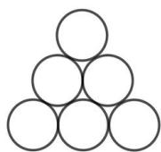

Figure 1

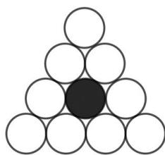

Figure 2

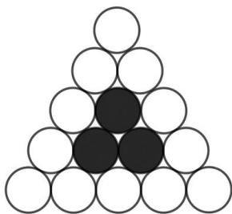

Figure 3

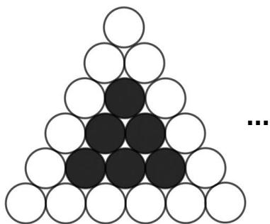

Figure 4

A. Figure 7 

B. Figure 8 

C. Figure 9 

D. Figure 10 

E. None of the above 

## Question 7

Find the value of the following fraction in simplest form. 

$$
2 - \frac {1}{0 + \frac {1}{1 - \frac {1}{9}}}
$$

$1 { \frac { 1 } { 9 } }$ 

B. $\frac { 8 } { 9 }$ 

C. $\frac { 2 6 } { 1 7 }$ 

D. $\frac { 7 } { 8 }$ 

E. None of the above 

## Question 8

Which of the following will form a knot when the two ends are pulled away from each other at the same time? 

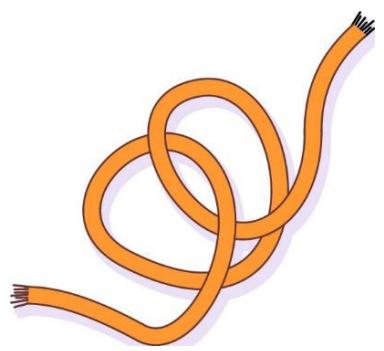

A

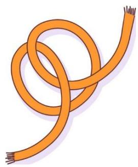

B

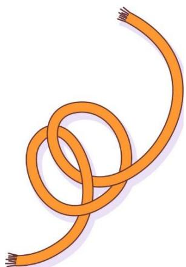

C

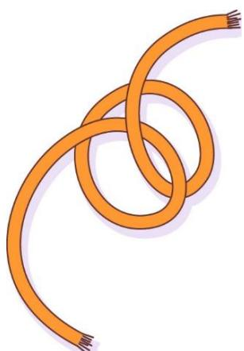

D

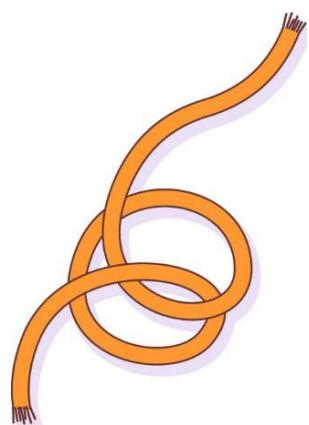

E

## Question 9

Find the sum of all whole numbers ?? such that when 60 is divided by ?? it gives a remainder of 4. 

A. 120 

B. 113 

C. 57 

D. 56 

E. None of the above 

## Question 10

Edison left Town A at 2:30 pm and drove towards Town B at 60 km/h. At 3 pm, Jason also left Town A and drove in the same direction as Edison at 75 km/h. What time did Jason catch up with Edison? 

A. 4:30 pm 

B. 5:00 pm 

C. 3:45 pm 

D. 4:00 pm 

E. None of the above 

## Question 11

In how many different ways can the circles be coloured using 3 colours: white, blue and green so that any 2 circles connected by a line do not share the same colour? 

A. 6 

B. 8 

C. 16 

D. 24 

E. None of the above 

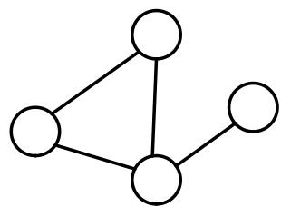

## Question 12

The number of male viewers of a YouTube channel was twice as many as the number of its female viewers. The average watch time per video of its male viewers was 24 seconds and the average watch time per video of female viewers of this channel was 36 seconds. What was the average watch time per video of all the viewers of this YouTube channel? 

A. 24 seconds 

B. 28 seconds 

C. 32 seconds 

D. 33 seconds 

E. None of the above 

## Question 13

Two identical squares overlap each other as shown on the right. Given the vertical sides of the squares are parallel, and the area of the square is 676 $\mathsf { c m } ^ { 2 }$ , what is the area of the shaded triangle? 

A. 128 $\mathsf { c m } ^ { 2 }$ 

B. $1 6 5 \ \mathsf { c m } ^ { 2 }$ 

C. 167 $\mathsf { c m } ^ { 2 }$ 

D. 284 $\mathsf { c m } ^ { 2 }$ 

E. None of the above 

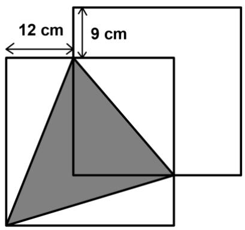

## Question 14

Four friends made the following statements: 

Kieran: I’m not the shortest. 

Franklin: I’m neither the tallest nor the shortest. 

Mabel: I’m the shortest 

Jeff: I’m the tallest 

If only one of them lied, who is the tallest? 

A. Kieran 

B. Franklin 

C. Mabel 

D. Jeff 

E. Insufficient data 

## Question 15

Find the missing figure in the diagram below. 

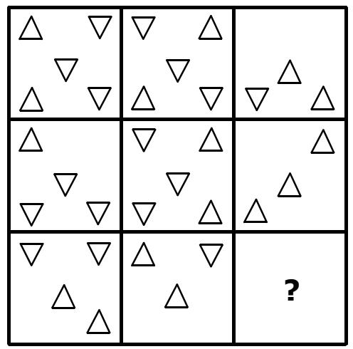

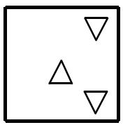

A

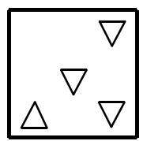

B

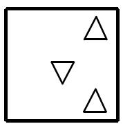

C

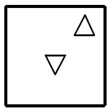

D

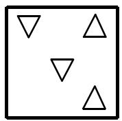

E

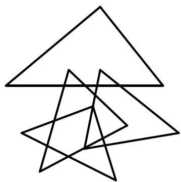

## Section B (Correct answer – 4 points| Incorrect or No answer – 0 points)

When an answer is a 1-digit number, shade “0” for the tens, hundreds and thousands place. 

Example: if the answer is 7, then shade 0007 

When an answer is a 2-digit number, shade “0” for the hundreds and thousands place. 

Example: if the answer is 23, then shade 0023 

When an answer is a 3-digit number, shade “0” for the thousands place. 

Example: if the answer is 785, then shade 0785 

When an answer is a 4-digit number, shade as it is. 

Example: if the answer is 4196, then shade 4196 

## Question 16

How many triangles are there in the figure on the right? 

## Question 17

In a 24-hour period on a digital clock, from 0:00 to 23:59, how many times does the digit “5” occur? 

[At the time 3:55, the digit “5” occurs 2 times] 

## Question 18

The following bar chart shows the number of students from Happy Primary School who received 4 different awards in SASMO competition. All the horizontal lines are equally spaced. The difference between the number of students who received Silver Award and Perfect Score was 140. Students who didn’t win any award received Certificate of Participation and they weren’t indicated on the graph. The ratio between the number of students who received Gold Award to the number of students who received Certificate of Participation was 4:9. Find the number of students who received Certificate of Participation. 

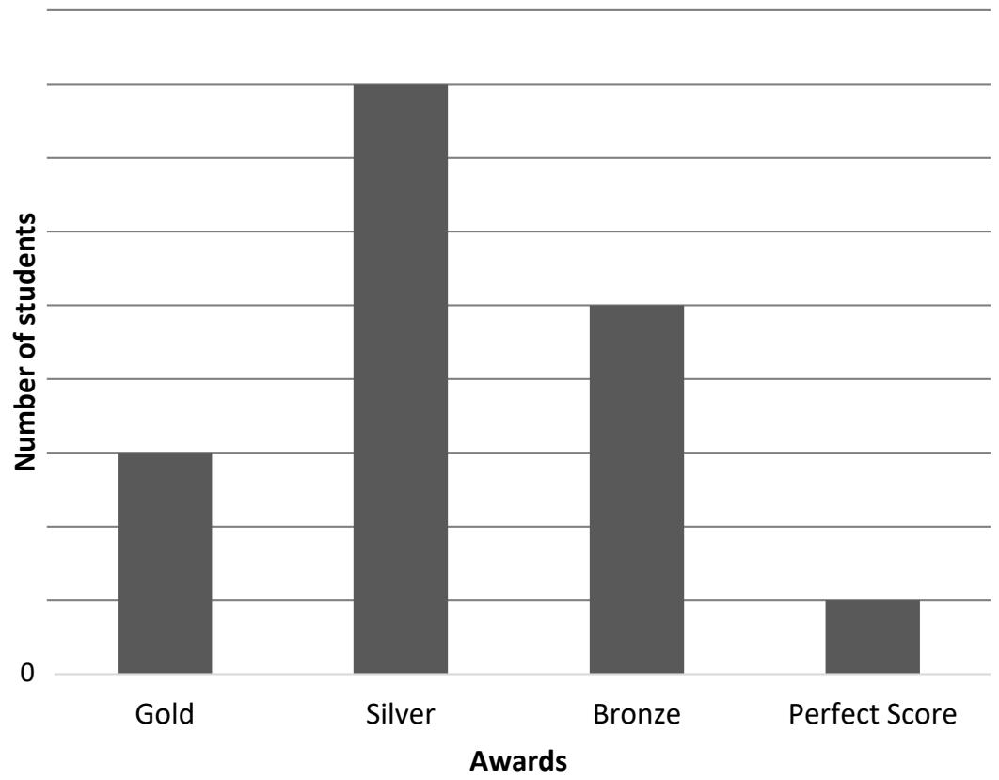

## Question 19

A pipe can fill up an empty tank in 18 hours. Full tank can be emptied by a pump in 20 hours. How long (in hours) will it take to fill up an empty tank if both the pipe and the pump are turned on at the same time? 

## Question 20

Ren selected 20 different whole numbers greater than 0 such that the product of any 9 numbers is always even. The sum of the 20 numbers is an odd number. Find the least possible sum of these numbers. 

## Question 21

The big square on the right is made up of 4 rectangles and 1 small square. The lengths and the breadths of 2 rectangles are given in the picture. Find the perimeter (in cm) of the big square. 

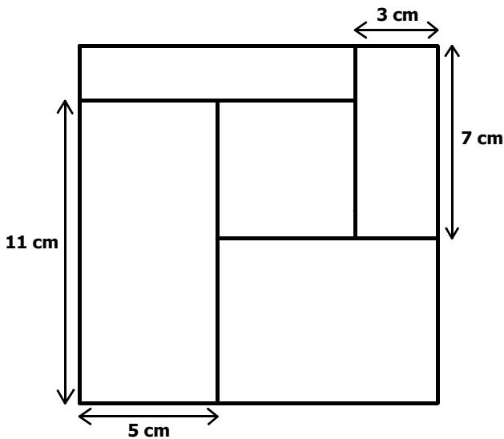

## Question 22

In the following cryptarithm, all the different letters stand for different digits. What is the value of the 4-digit number AECA? 

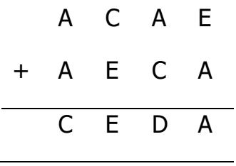

## Question 23

Shells are being distributed into a fixed number of boxes. If the shells are distributed into groups of 14, there will 6 extra shells. When shells are grouped into 16, there will be a shortage of 84 shells. What is the total number of shells? 

## Question 24

Four 2-digit numbers are made up from the digits 2, 3, 4, …, 9 with no repetition. The following are the hints about these numbers: 

• In the smallest number, the ones digit is twice of tens digit. 

• In the largest number, the sum of ones and tens digits is 11. 

• In one of the numbers, tens digit is 5 more than ones digit. 

• One of the numbers is divisible by 7. 

Find the second smallest number. 

## Question 25

Stan got some notebooks and pens from a bookstore. The price of a notebook was $7, and a pen’s price was $3. There was a promotion “Buy 4 notebooks, get 5 pens free”. He spent exactly $82 in total and enjoyed the promotion to the fullest such that he got the largest combined number of notebooks and pens. What is the total number of pens (including the free ones) that he got from the bookstore? 

## END OF PAPER

## SASMO 2020 Primary 5 (Grade 5) Contest Questions

Section A (Correct answer – 2 points| No answer – 0 points| Incorrect answer – minus 1 point) 

## Question 1

Find the value of the following. 

$$
8 8 9 9 + (6 6 7 7 - 2 2 3 3) - 4 4 5 5
$$

A. 8888 

B. 8877 

C. 8899 

D. 8887 

E. None of the above 

## Question 2

Jane thought of a number. Josh calculated one-third of Jane’s number. Frank calculated two-fifths of Josh’s number. If Frank got 18, what was Jane’s number? 

A. 2.4 

B. 270 

C. 45 

D. 135 

E. None of the above 

## Question 3

In a sports league, teams can either get 7 points or 3 points in each match. What is the largest score that cannot be attained? 

A. 8 

B. 11 

C. 19 

D. 22 

E. None of the above 

## Question 4

The percentages of boys in two classes are 30% and 60%. The numbers of students in the two classes are 30 and 45 respectively. What is the percentage of boys in the two classes combined? 

A. 90% 

B. 48% 

C. 30% 

D. 10% 

E. None of the above 

## Question 5

How many pairs of non-zero whole numbers ?? and ?? are there such that ?? + ?? = 10? Take note that $( a , b )$ and $( b , a )$ are the same pair. 

A. 4 

B. 5 

C. 6 

D. 10 

E. None of the above 

## Question 6

Ted, Bob, Andi and Beti were playing "Guess The Number" game. Ted thought of a three-digit number and the others were trying to guess his number. 

Bob said, "I guess your number is 784." 

Andi said, "I think it is 394." 

Beti said, "I think it must be 795." 

Ted then replied, ”Each of the numbers you said shares two digits in common with mine". What is the sum of the digits of Ted’s number? 

A. 395 

B. 794 

D. 22 

E. None of the above 

## Question 7

What is the missing number in the sequence below? 

23, 19, 25, 26, 27, 33, 29, __, 31 

A. 40 

B. 30 

C. 32 

D. 36 

E. None of the above 

## Question 8

How many two-digit numbers are divisible by 4 but not by 8? 

A. 25 

B. 22 

C. 12 

D. 11 

E. None of the above 

## Question 9

There are roses and lilies at a flower shop. Two roses cost $7 while three lilies cost $5. Billy bought some roses and lilies and paid $86. Which of the following can be the number of lilies he bought? 

A. 15 

B. 21 

C. 24 

D. 36 

E. None of the above 

## Question 10

What is the missing number in the pattern below? 

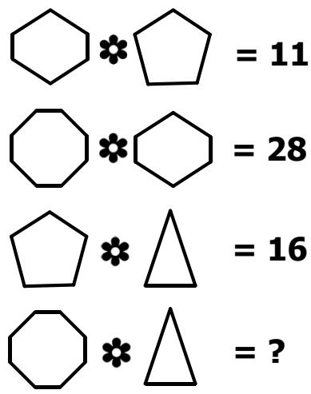

A. 11 

B. 33 

C. 38 

D. 55 

E. None of the above 

## Question 11

The dimensions of two metal cuboids are 3 × 5 × 7 and $6 \times 8 \times 1 0$ . One of the cuboids is shown on the right. Harry melts both cubes and forms the largest possible cuboid with base of size 9 × 13. What is the height of the new cuboid? 

A. 4.5 

B. 5 

D. 11 

E. None of the above 

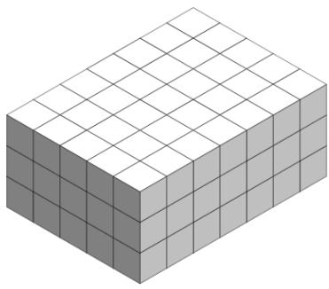

## Question 12

There are three boxes, one contains only apples, one contains only oranges, and one contains both apples and oranges. All the boxes are labelled as shown below. 

Box 1 labelled: This box contains both apples and oranges. 

Box 2 labelled: Box 1 does not contain different fruits. 

Box 3 labelled: This box contains only one type of fruit. 

If only one box is labelled correctly, which box contains both apples and oranges? 

A. Box 1 

B. Box 2 

C. Box 3 

D. Impossible to determine 

E. Box 1 and 2 

## Question 13

In the rectangle ????????, point ?? is on the side ???? and point ?? is on the side ???? such that $\begin{array} { r } { B E = \frac { 1 } { 3 } A E } \end{array}$ and ${ D F } = \textstyle { \frac { 2 } { 5 } } A D$ . What is the ratio of areas of ???????? and ??????????? 

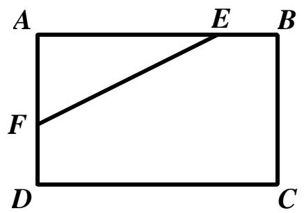

A. 40 : 31 

B. 15 : 13 

C. 48 : 35 

D. 15 : 14 

E. None of the above 

## Question 14

In which of the following times is the hour hand closest to the minute hand of a clock? 

A. 6:30 

B. 6:31 

C. 6.32 

D. 6:33 

E. 6:34 

## Question 15

Which one of the following options is a missing piece of the cube on the right? 

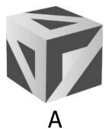

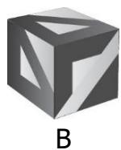

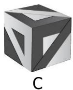

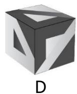

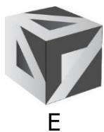

## Section B (Correct answer – 4 points| Incorrect or No answer – 0 points)

When an answer is a 1-digit number, shade “0” for the tens, hundreds and thousands place. 

Example: if the answer is 7, then shade 0007 

When an answer is a 2-digit number, shade “0” for the hundreds and thousands place. 

Example: if the answer is 23, then shade 0023 

When an answer is a 3-digit number, shade “0” for the thousands place. 

Example: if the answer is 785, then shade 0785 

When an answer is a 4-digit number, shade as it is. 

Example: if the answer is 4196, then shade 4196 

## Question 16

How many triangles are there in the figure below? 

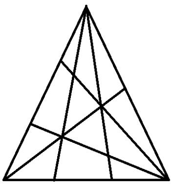

## Question 17

Find the last digit of the following product. 

$$
\underbrace {2 \times 2 \times \ldots \times 2} _ {\text {20 times}} \times \underbrace {3 \times 3 \ldots \times 3} _ {\text {20 times}}
$$

## Question 18

The ratio of the volume of water in Tank A to that in Tank C is 4 : 7. The ratio of the volume of water in Tank B to the total volume in the 3 tanks is 6 : 50. If there are 5 more litres of water in Tank A than Tank B, how much water (in litres) is there in Tank C? 

## Question 19

How many four-digit numbers are there between 7500 and 9600 that can be formed using only the digits 3, 7, 5, 6, 8, 9 without repetition of any digits? 

## Question 20

At a book fair, there were 120 more adults than girls. The number of girls was 75% of the number of boys and 12% of the total number of people. How many adults were there at the book fair? 

## Question 21

The number of digits used to number the pages of a book is twice the number of pages of the book. If the number of pages of the book is a three-digit number, how many pages does the book have? 

## Question 22

Peter and Frank together can build a house in eight days. Peter and George together can build the same house in six days. It is given that each of them works exactly nine hours per day. If Peter alone can build the same house in 12 days, how many hours will Frank and George work together to build a house? 

## Question 23

In the diagram below, points ??, ??, ?? and ?? are the midpoints of the sides of a square. If the area of the largest square below is 390 cm2, find the area of the shaded region. 

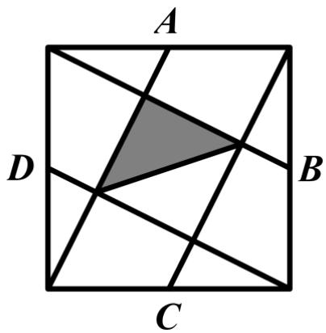

## Question 24

One wants to colour the circles in the figure below such that any pair of circles connected by a line segment shares different colours. What is the least number of colours needed for the colouring? 

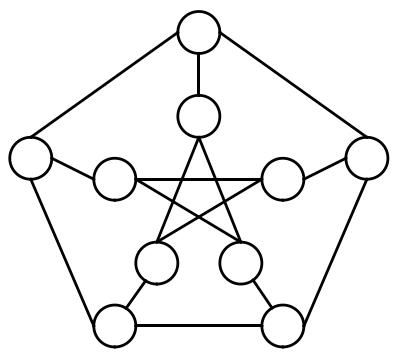

## Question 25

In the following, all the different letters stand for different digits. 

<table><tr><td></td><td>F</td><td>B</td><td>F</td><td>C</td></tr><tr><td>+</td><td>D</td><td>B</td><td>E</td><td>C</td></tr><tr><td></td><td>F</td><td>C</td><td>E</td><td>D</td></tr></table>

Find the value of the 4-digit number DBEC. 

# Solutions to SASMO 2019 Primary 5 (Grade 5)

## Question 1

$$
\begin{array}{l} 3 6 9 \times 3 3 3 = (3 \times 1 2 3) \times 3 3 3 = 1 2 3 \times 3 \times 3 3 3 = 1 2 3 \times 9 9 9 = 1 2 3 \times (1 0 0 0 - 1) \\ = 1 2 3 \times 1 0 0 0 - 1 2 3 \times 1 = 1 2 3 0 0 0 - 1 2 3 = 1 2 2 8 7 7. \\ \end{array}
$$

The sum of the digits is 1 + 2 + 2 + 8 + 7 + 7 = ????. 

Answer: (C) 

## Question 2

A. ?????? − ?????? = ???????? 

B. ???????? + ???????? = ???????? 

C. ???????? × ?????? = ???????? 

D. 252 ÷ 12 = 21 (odd) 

E. None of the above 

Answer: (D) 

## Question 3

Using the divisibility test for 9, the sum of digits 1 + 8 + 7 + ?? = 16 + ?? is divisible by 9. Since ?? is a single digit, ?? = ?? 

Answer: (C) 

## Question 4

Find the difference between neighbouring numbers 

$$
7 \stackrel {+ 4} {\rightarrow} 1 1 \stackrel {+ 1 1} {\longrightarrow} 2 2 \stackrel {+ 1 8} {\longrightarrow} 4 0 \stackrel {+ 2 5} {\longrightarrow} 6 5
$$

The pattern of differences is as follows: 

$$
4 \stackrel {+ 7} {\rightarrow} 1 1 \stackrel {+ 7} {\rightarrow} 1 8 \stackrel {+ 7} {\rightarrow} 2 5 \stackrel {+ 7} {\rightarrow} 3 2
$$

The next number in the sequence is 65 + 32 = ????. 

Answer: (D) 

## Question 5

Andrew and Caden had some stamps in the ratio 6:8 or 12 units:16 units. After Andrew gave a quarter of his stamps or equivalently $\textstyle { \frac { 1 } { 4 } } \times 1 2 = 3$ units to Caden, the ratio became (12 − 3): (16 + 3) or 9: 19. 

Caden then had 280 stamps or (19 − 9) = 10 units more than Andrew. 

Thus, 10 ?????????? = 280 and 1 ???????? = 280 ÷ 10 = 28. 

They had 9 + 19 = 28 ?????????? = 28 × 28 = ?????? stamps altogether. 

Answer: (B) 

## Question 6

The pattern for number of black and white circles in each figure is as follows: 

<table><tr><td>Figure</td><td>No. of black circles</td><td>No. of white circles</td></tr><tr><td>1</td><td>0</td><td>6</td></tr><tr><td>2</td><td>1</td><td>6 + 3 = 9</td></tr><tr><td>3</td><td>1 + 2 = 3</td><td>9 + 3 = 12</td></tr><tr><td>4</td><td>1 + 2 + 3 = 6</td><td>12 + 3 = 15</td></tr><tr><td>5</td><td>1 + 2 + 3 + 4 = 10</td><td>18</td></tr><tr><td>6</td><td>1 + 2 + 3 + 4 + 5 = 15</td><td>21</td></tr><tr><td>7</td><td>1 + 2 + 3 + 4 + 5 + 6 = 21</td><td>24</td></tr><tr><td>8</td><td>1 + 2 + 3 + 4 + 5 + 6 + 7 = 28</td><td>27</td></tr></table>

Answer: (B) 

## Question 7

$$
2 - \frac {1}{0 + \frac {1}{1 - \frac {1}{9}}} = 2 - \frac {1}{0 + \frac {1}{\frac {8}{9}}} = 2 - \frac {1}{0 + 1 \div \frac {8}{9}} = 2 - \frac {1}{0 + \frac {9}{8}} = 2 - \frac {1}{\frac {9}{8}} = 2 - \frac {8}{9} = \frac {1 0}{9} = 1 \frac {1}{9}
$$

Answer: (A) 

## Question 8

Options A, B, D and E will not form a knot. Option C will form a knot. 

Answer: (C) 

## Question 9

When 60 is divided by ?? it gives a remainder of 4. Hence $6 0 - 4 = 5 6$ is divisible by ??. The factors of 56 are 1, 2, 4, 7, 8, 14, 28, 56. When 60 is divided by 1, 2 and 4, there is no remainder. 

When 60 is divided by 7, 8, 14, 28 and 56 it gives a remainder of 4. Therefore, the sum is $7 + 8 + 1 4 + 2 8 + 5 6 = 1 1 3$ . 

Answer: (B) 

## Question 10

Jason left Town A 30 minutes or $\frac { 1 } { 2 }$ hour later than Edison. In a half an hour time, Edison drove 60 $\textstyle \times { \frac { 1 } { 2 } } = 3 0$ km i.e. Jason started 30 km behind Edison. The difference in their speeds is $7 5 - 6 0 = 1 5 \ : k m / h ,$ , so the difference between them decreased by 15 km every hour. Then the time that Jason caught up with Edison is $3 0 \div 1 5 =$ 2 ℎ???????? after 3 pm which is 5:00 pm. 

Answer: (B) 

## Question 11

Label the circles with A, B, C and D as shown. 

If Circle A is blue, then there 4 possible colourings: 

• B is white, C green and D is white 

• B is white, C green and D is blue 

• B is green, C white and D is green 

• B is green, C white and D is blue 

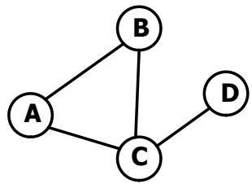

Similarly, there are 4 possible colouring when Circle A is white or green. 

There are $4 \times 3 = 1 2$ ways. 

Answer: (E) 

## Question 12

Let the number of female viewers be 1 unit. Then the number of male viewers is 2 units. 

Total watch time of male viewers: 2 units x 24 = 48 units 

Total watch time of female viewers: 1 unit x 36 = 36 units 

Total watch time of all viewers: 48 units + 36 units = 84 units 

Total number of viewers: 1 unit + 2 units = 3 units 

Average watch time of all viewers: 84 ÷ 3 = 28 seconds 

Answer: (B) 

## Question 13

If the area of square is 676 cm2, then the length of the side is 26 cm. 

The area of the unshaded triangle on the left is $1 2 \times 2 6 \div 2 = 1 5 6 \ : \mathrm { c m } ^ { 2 }$ 

The area of the unshaded triangle on the top right is $( 2 6 - 1 2 ) \times ( 2 6 - 9 ) \div 2 = 1 1 9 \ \mathsf { c m } ^ { 2 }$ 

The area of the unshaded triangle at the bottom is (26 − 17) × 26 ÷ 2 = 117 cm2 

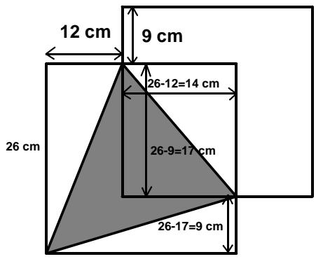

The area of shaded triangle is $6 7 6 \thinspace { \mathsf { c m } } ^ { 2 } - ( 1 5 6 \thinspace { \mathsf { c m } } ^ { 2 } + 1 1 9 \thinspace { \mathsf { c m } } ^ { 2 } + 1 1 7 \thinspace { \mathsf { c m } } ^ { 2 } ) = 2 8 4$ cm2. 

Answer: (D) 

## Question 14

If Kieran lied, then he would be the shortest. But Mabel also said that she is the shortest and it is true. So, Kieran could not be the shortest one and he did not lie. If Franklin lied, then he may be the tallest or the shortest. However, the truthful statements from Mabel and Jeff indicate that Franklin is neither the tallest nor the shortest. So, Franklin could not be the one lying. 

If Mabel lied, then she is not the shortest. The statements made by Kieran and Franklin could not be true otherwise no one would be the shortest. Thus, Mabel also did not lie. 

If Jeff lied, then he is not the tallest. The truthful statements from Mabel and Franklin indicate that both are not the tallest. Thus, the tallest person can only be 

## Kieran.

Answer: (A) 

## Question 15

In every column, the third square is obtained from the first and the second squares following these 3 rules: 

Rule 1: If 2 triangles in the same position from both first and second squares are facing the same direction, then the resulting triangle in the same position in the third square will be pointing in the opposite direction. 

Rule 2: If 2 triangles in the same position from both first and second squares are facing different directions, then there is no triangle in the same position in the third square. 

Rule 3: If there is only 1 triangle in the same position from both first and second squares, then the same triangle will be in the same position in the third square. 

Following these rules in the third column, we will get the figure in Option C as shown on the right. 

Answer: (C) 

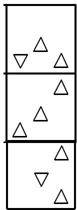

## Question 16

The following are the number of triangles. 

<table><tr><td>Type of Triangle</td><td>1-part</td><td>2-part</td><td>3-part</td><td>5-part</td></tr><tr><td>Example</td><td></td><td>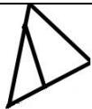</td><td>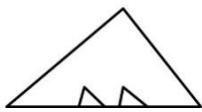</td><td>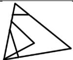</td></tr><tr><td>Quantity</td><td>7</td><td>3</td><td>1</td><td>3</td></tr></table>

Total = 7 + 3 + 1 + 3 = ???? triangles. 

Answer: 14 

## Question 17

Make a list: 

Number of “5”s in hours: 5:00, 5:01,…, 5:59 and 15:00, 15:01, …, 15:59 – 60 × 2 = 120 times. 

Number of “5s” in ones place of the minutes: 

00:05, 00:15, …, 00:55 – 6 times 

01:05, 01:15, …, 01:55 – 6 times 

23:05, 23:15, …, 23:55 – 6 times 

6 × 24 = 144 times 

Number of “5s” in tens place of the minutes: 

00:50, 00:51, …, 00:59 – 10 times 

01:50, 01:51, …, 01:59 – 10 times 

23:50, 23:51, …, 23:59 – 10 times 

10 × 24 = 240 times 

Total= 120 + 144 + 240 = 504 times. 

Answer: 0504 

## Question 18

The followings are the number of units in the bar drawing of each award: 

Gold – 3 units, 

Silver – 8 units, 

Bronze – 5 units, 

Perfect Score – 1 unit. 

The condition implies that 8 ?????????? − 1 ???????? = 140, and so 7 ?????????? = 140. Hence the number of students who received Perfect Score was 1 ???????? = 140 ÷ 7 = 20, and 3 ?????????? = 20 × 3 = 60 students received Gold Award. 

The ratio between the number of students who received Gold Award to the number of students who received Certificate of Participation was 4:9 or $4 \times 1 5 { : } 9 \times 1 5$ or 60:135. 

Thus, the number of students who received Certificate of Participation is 135. 

Answer: 135 

## Question 19

In 1 hour, the pipe can fill up $\frac { 1 } { 1 8 }$ of the tank while the pump can empty $\frac { 1 } { 2 0 }$ of the tank. 

When both the pipe and pump are working together, they can fill up $\begin{array} { r } { \frac { 1 } { 1 8 } - \frac { 1 } { 2 0 } = \frac { 1 } { 1 8 0 } } \end{array}$ of the tank in 1 hour. 

1 hour $ \frac { 1 } { 1 8 0 }$ of the tank 

180 hours $ \frac { 1 8 0 } { 1 8 0 }$ of the tank 

Answer: 180 

## Question 20

Among the 20 numbers, there are at most 8 odd numbers; otherwise, there will be 9 odd numbers with an odd number product. 

If there are exactly 8 odd numbers, then the sum of the 20 numbers is an even number as the sum of 8 odd numbers is an even number. Thus, there are at most 7 odd numbers among the 20 numbers and the least possible sum is 

$$
\begin{array}{r l} & 1 + 2 + 3 + 4 + 5 + 6 + 7 + 8 + 9 + 1 0 + 1 1 + 1 2 + 1 3 + 1 4 + 1 6 + 1 8 + 2 0 + 2 2 + 2 4 \\ & \quad + 2 6 = \mathbf {2 3 1}. \end{array}
$$

Answer: 231 

## Question 21

Let the length of the small square be 1 unit as shown on the right. 

Then the length of the the top side of the big square is 

$$
5 c m + 1 u n i t + 3 c m = 8 c m + 1 u n i t.
$$

the length of the the right side of the big square is 

$$
7 c m + (1 1 - 1 u n i t) = 1 8 - 1 u n i t.
$$

Thus, 

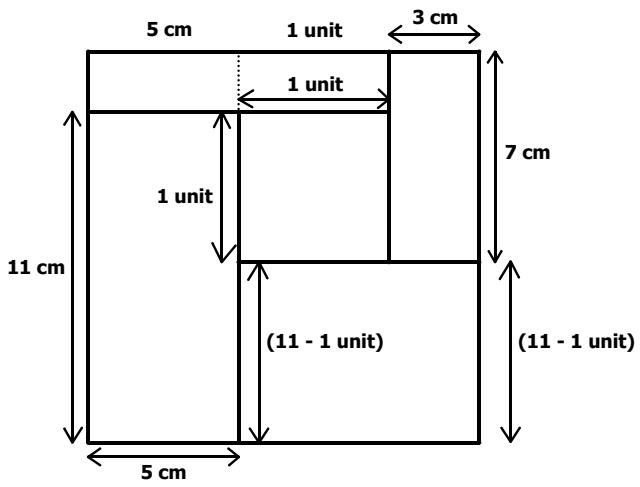

$$
8 c m + 1 u n i t = 1 8 - 1 u n i t
$$

$$
1 \text {unit} + 1 \text {unit} = 1 8 - 8
$$

$$
2 \text {units} = 1 0
$$

$$
1 \text {   unit   } = 1 0 \div 2 = 5 \text {   cm   }
$$

The perimeter of the big square is 

$$
4 \times (8 c m + 1 u n i t) = 4 \times (8 c m + 5 c m) = 5 2 c m.
$$

Answer: 52 

## Question 22

In the ones place addition, it is obvious that E = 0. 

In the hundreds place addition, since E = 0, ?? can only be 9 with 1 carried over from the tens place addition. Then in the thousands place addition, ?? + ?? + 1 = ?? = 9 (1 was carried over from the hundreds place addition). Hence A = 4, D = 3 and AECA = ????????. 

Answer: 4094 

## Question 23

If the shells are distributed into groups of 14, there will 6 extra shells. 

But 6 shells left are not enough to distribute 2 more shells into each box since there would be 84 shells short. 

So if there are 84 more shells, then there would be 84 + 6 = 90 shells which can be distributed so that each box has 2 more shells, i.e. 16 shells each. 

Since 2 more shells were distributed to each box (i.e. the 15th and 16th shell), then there are 90 ÷ 2 = 45 boxes. 

There are 45  14 + 6 or 45 x 16 – 84 = 636 shells. 

Answer: 636 

## Question 24

The smallest number can be 24, 36 or 48. 

In one of the numbers, tens digit is 5 more than ones digit. So that number can be 72, 83 or 94. Hence the largest number can be 74, 83 or 92. 

If the largest number is 92, then one number is 83 as digits 9 and 2 were used. Then the smallest number cannot be 24, 36 or 48 since 2, 3, 8 and 9 were used. Therefore, the largest number is not 92. Similarly, the largest number is not 74. 

The only option left for the largest number is 83. The smallest number is 24 since 3 and 8 were used. Another number is 72. The remaining number is either 65 or 56. Since one of the number is divisible by 7, the remaining number must be 56. The second smallest number is 56. 

Answer: 56 

## Question 25

List down all the possibilities with the total price of $82: 

<table><tr><td>No. of notebooks</td><td>Total Price of notebooks</td><td>No. of pens</td><td>Total Price of pens</td><td>Combined no. of notebooks and files</td></tr><tr><td>10</td><td>$70</td><td>4</td><td>$12</td><td>10 notebooks and 4 + 10 free pens = 24</td></tr><tr><td>7</td><td>$49</td><td>11</td><td>$33</td><td>7 notebooks and 11 + 5 free pens = 23</td></tr><tr><td>4</td><td>$28</td><td>18</td><td>$54</td><td>4 notebooks and 18 + 5 free pens = 27</td></tr><tr><td>1</td><td>$7</td><td>25</td><td>$75</td><td>1 notebook and 25 pens = 26</td></tr></table>

Since Stan got the largest combined number of notebooks and pens when he bought 4 notebooks and 18 pens (+ 5 free pens), he got 23 pens from the bookstore. 

Answer: 23 pens 

## Solutions to SASMO 2020 Primary 5 (Grade 5)

## Question 1

$$
\begin{array}{l} 8 8 9 9 + (6 6 7 7 - 2 2 3 3) - 4 4 5 5 \\ = 8 8 9 9 + 4 4 4 4 - 4 4 5 5 \\ = 8 8 9 9 - 4 4 5 5 + 4 4 4 4 \\ = 4 4 4 4 + 4 4 4 4 \\ = 8 8 8 8 \\ \end{array}
$$

## Question 2

$$
\begin{array}{l} F r a n k ^ {\prime} s \text {number} = \frac {2}{5} \text {of Josh^{\prime} s number} = 1 8 \\ \frac {1}{5} \text {of Josh's number} = 9 \\ \frac {5}{5} \text {of Josh's number} = 9 \times 5 = 4 5 \\ \text { Josh's   number } = \frac {1}{3} \text { of   Jane's   number } = 4 5 \\ \frac {3}{3} \text {of Jane's number} = 4 5 \times 3 = \mathbf {1 3 5} \\ \end{array}
$$

Answer: (D) 

## Question 3

Some valid scores include 12 (3 × 4), 13 (3 × 2 + 7) and 14 (7 × 2). 

Next three scores 15, 16 and 17 can be obtained from 12, 13 and 14 by scoring 3 more points. Thus, all scores greater than 11 can be obtained by scoring additional 3 points, and the largest unattainable score is 11. 

Answer: (B) 

## Question 4

Number of boys in the first clas $\begin{array} { r } { \mathsf { S } = 3 0 \times \frac { 3 0 } { 1 0 0 } = 9 } \end{array}$ 

Number of boys in the second cla $\mathsf { S S } = 4 5 \times \frac { 6 0 } { 1 0 0 } = 2 7$ 

Total number of boys in the two classes= 9 + 27 = 36 

Total number of students in the two classes= 30 + 45 = 75 

Percentage of boys in the two classes combined $= \frac { 3 6 } { 7 5 } \times 1 0 0 = 4 8 \%$ 

Answer: (B) 

## Question 5

10 

$$
= 1 + 9
$$

$$
= 2 + 8
$$

$$
= 3 + 7
$$

$$
= 4 + 6
$$

$$
= 5 + 5
$$

Thus, there are 5 such pairs. 

Answer: (B) 

## Question 6

If each number said shares 2 digits, then there must be common digits of numbers said. 

Bob and Andis’ numbers share a common digit of 4. 

Andi and Betis’ numbers share a common digit of 9. 

Bob and Betis’ numbers share a common digit of 7. 

Hence the number which Ted is thinking of is a permutation of the digits 4, 7 and 9, which sum of digits is $4 + 7 + 9 = 2 0$ 

Answer: (C) 

## Question 7

The pattern is a combination of two different sequences as shown: 

$$
2 3 \stackrel {+ 2} {\rightarrow} 2 5 \stackrel {+ 2} {\rightarrow} 2 7 \stackrel {+ 2} {\rightarrow} 2 9 \stackrel {+ 2} {\rightarrow} 3 1
$$

$$
1 9 \stackrel {+ 7} {\rightarrow} 2 6 \stackrel {+ 7} {\rightarrow} 3 3 \stackrel {+ 7} {\rightarrow} \mathbf {4 0}
$$

The next number in the sequence in the question is 40. 

Answer: (A) 

## Question 8

Two-digit numbers which are divisible by 4: 12, 16, 20, …, 96 

There are (96 − 12) ÷ 4 + 1 = 22 multiples of 4. 

Two-digit numbers which are divisible by 8: 16, 24, 32, …, 96 

There are (96 − 16) ÷ 8 + 1 = 11 multiples of 8. 

Out of 22 multiples of 4, 11 of them are also divisible by 8. Thus, there are 22 − 11 = ???? two-digit numbers which are divisible by 4 but not by 8. 

Answer: (D) 

## Question 9

To get $86, the number of roses must be divisible by 2 and the number of lilies must be divisible by 3. Let the number of roses be 2 × ?? and the number of lilies be 3 × ??. Hence 

$$
7 \times a + 5 \times b = 8 6
$$

When ?? = 1, ?? is not a whole number. 

When ?? = 2, ?? is not a whole number again. 

Checking other values of ?? from 3 to 12, the possible values of ?? are 3 and 8. Then ?? = 13 or 6 and 3 × ?? = 39 or 18. Thus, none of the options A to D are possible and the answer is option E. 

Answer: (E) 

## Question 10

From the pattern octagon (which has 8 sides) flower hexagon (which has 6 sides) = (8 + 6)(8 − 6) = 28 

This also holds true for the remaining 2 examples given. 

Hence, octagon (which has 8 sides) flower triangle (which has 3 sides) = (8 + 3)(8 − 3) = ???? 

Answer: (D) 

## Question 11

Cuboid of dimensions 3 × 5 × 7 is made of 3 × 5 × 7 = 105 small cubes. 

Cuboid of dimensions 6 × 8 × 10 is made of 6 × 8 × 10 = 480 small cubes. 

When melted, they will form a new cuboid with a total of 585 small cubes. 

Height of new cuboid = 585 ÷ (9 × 13) = 5 

Answer: (B) 

## Question 12

If box 1 is labelled correctly, then box 3 must contain either apples or oranges, so box 3 is also labelled correctly, which contradicts the fact that only one box is labelled correctly. 

If box 3 is labelled correctly, then box 1 is labelled wrongly. This means that box 1 contains only one type of fruit. Hence box 2 is also labelled correctly, which contradicts the fact that only one box is labelled correctly. 

Hence, box 2 must be labelled correctly. This means that box 3, which is labelled wrongly, must contain both apples and oranges. 

Answer: (C) 

## Question 13

Let the length of AB be 4 units. Let the length of AD be 5 parts. 

Then AE must be 3 units long and AF must be 3 parts long. 

$$
\begin{array}{l} \text { Area } (F E B C D) = \text { Area } (A B C D) - \text { Area } (A E F) \\ = 4 \text {units} \times 5 \text {parts} - \frac {1}{2} \times 3 \text {units} \times 3 \text {parts} = 1 5. 5 \text {units} \times \text {parts} \\ \end{array}
$$

????????(????????): ????????(??????????) = (4 × 5) (?????????? × ??????????): 15.5 (?????????? × ??????????) = 40:31 

Answer: (A) 

## Question 14

The angle of each division is $3 6 0 ^ { \circ } \div 1 2 = 3 0 ^ { \circ }$ 

In 1 hour: 

• the hour hand moves by 30° 

• the minute hand moves by 360° 

In 1 minute: 

the hour hand moves by $3 0 ^ { \circ } \div 6 0 =$ $0 . 5 ^ { \circ }$ 

the minute hand moves by $3 6 0 ^ { \circ } \div$ $6 0 = 6 ^ { \circ }$ 

Let assume that after ?? minutes past 6, the angle between the hands is $0 ^ { \circ }$ . 

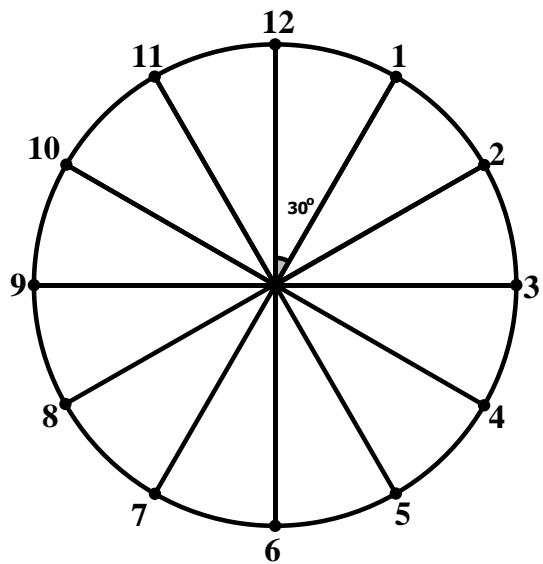

The minute hand travelled $6 ^ { \circ } \times m = 6 m$ from the 12. 

The hour hand travelled $0 . 5 ^ { \circ } \times m = 0 . 5 m$ from the 6. Also, the angle between the 12 and 6 is $3 0 ^ { \circ } \times 6 = 1 8 0 ^ { \circ }$ . Thus, the angle between the 12 and the tip of the hour hand is $1 8 0 ^ { \circ } + 0 . 5 m .$ . 

The angle between the hands of a clock is 

$$
6 m - (1 8 0 + 0. 5 m) = 0 ^ {\circ}
$$

Solving the equation, we get $\begin{array} { r } { m = \frac { 3 6 0 } { 1 1 } = 3 2 \frac { 8 } { 1 1 } } \end{array}$ which is closest to 33. 

Answer: (D) 

## Question 15

The missing piece must have 3 faces shown below to match the cube. 

<table><tr><td>Top face</td><td>Right face</td><td>Left face</td></tr><tr><td>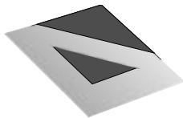</td><td></td><td>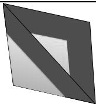</td></tr></table>

Only Option C has all the 3 faces. 

Answer: (C) 

## Question 16

Rotate the figure as shown on the right. 

Count by types of triangles. 

1-part: 10 

5-part: 4 

2-part: 7 

6-part: 3 

3-part: 10 

8-part: 4 

4-part: 6 

12-part: 1 

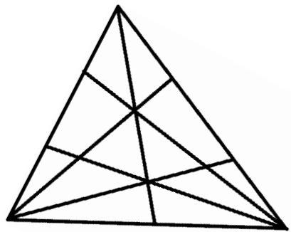

Total: 10 + 7 + 10 + 6 + 4 + 3 + 4 + 1 = 45 

Answer: 45 

## Question 17

Last digits of the following is product is 

$$
\underbrace {(2 \times 3) \times (2 \times 3) \times \ldots \times (2 \times 3)} _ {2 0 t i m e s} = \underbrace {6 \times 6 \times \ldots \times 6} _ {2 0 t i m e s} = \mathbf {6}.
$$

Answer: 6 

## Question 18

The ratio of B : A+B+C is 6 : 50, implying that the volume of water in B can be expressed as 6 units while the volume of water in A + C can be expressed as $5 0 - 6 =$ 44 units. 

The ratio of $\mathsf { A } : \mathsf { C } = 4 : 7$ gives a total of 11 units. The least common multiple of 11 and 44 is 44, so the least total number of units of A and C must be 44 units. 

The ratio of $\mathsf { A } : \mathsf { C } = 4 : 7$ must be multiplied by 4 to become 16 : 28, so that the total number of units of A and C is 44. 

Since B is 6 units while A is 16 units, and there are 5 more litres of water in Tank A than Tank B, 16 − 6 = 10 units = 5 litres. 

$$
1 \text {unit} = 5 \div 1 0 = \frac {1}{2} \text {litres}
$$

$$
2 8 \text { units } = \frac {1}{2} \times 2 8 = 1 4 \text { litres }
$$

Answer: 14 

## Question 19

The total number of four-digit numbers from 7500 to 7999 that can be formed using only the digits 3, 7, 5, 6, 8 or 9 without repetition of any digits: 

<table><tr><td>Thousands</td><td>Hundreds</td><td>Tens</td><td>Ones</td></tr><tr><td>1 option</td><td>4 options</td><td>4 options</td><td>3 options</td></tr><tr><td>7</td><td>5, 6, 8 or 9</td><td>5 options – 1 option (which is already used in the hundreds place)3, 5, 6, 8 or 9</td><td>5 options – 2 options (which are used in hundreds and tens place)</td></tr></table>

$\ 1 o p t i o n \times 4 o p t i o n s \times 4 o p t i o n s \times 3 o p t i o n s = 4 8 n u m b e r s$ 

The number of four-digit numbers from 8000 to 8999 that can be formed using only the digits $3 , 7 , 5 , 6 , 8$ or 9 without repetition of any digits: 

<table><tr><td>Thousands</td><td>Hundreds</td><td>Tens</td><td>Ones</td></tr><tr><td>1 option</td><td>5 options</td><td>4 options</td><td>3 options</td></tr><tr><td>8</td><td>3, 5, 6, 7 or 9</td><td>5 options – 1 option (which is already used in the hundreds place)3, 5, 6, 8 or 9</td><td>5 options – 2 options (which are used in hundreds and tens place)</td></tr></table>

$\ 1 o p t i o n \times 5 o p t i o n \times 4 o p t i o n s \times 3 o p t i o n s = 6 0 n u m b e r s$ 

The number of four-digit numbers more than 9600 that can be formed using only the digits $3 , 7 , 5 , 6 , 8$ or 9 without repetition of any digits: 

<table><tr><td>Thousands</td><td>Hundreds</td><td>Tens</td><td>Ones</td></tr><tr><td>1 option</td><td>2 options</td><td>4 options</td><td>3 options</td></tr><tr><td>9</td><td>3 or 5</td><td>5 options – 1 option (which is already used in the hundreds place)</td><td>5 options – 2 options (which are used in hundreds and tens place)</td></tr></table>

$1 o p t i o n \times 2 o p t i o n s \times 4 o p t i o n s \times 3 o p t i o n s = 2 4 n u m b e r s$ 

In total, there are $4 8 + 6 0 + 2 4 = 1 3 2$ such numbers. 

Answer: 132 

## Question 20

The number of girls was $7 5 \% = \frac { 7 5 } { 1 0 0 } = \frac { 3 } { 4 }$ 3 of the number of boys and 12% of the total number of people: 

Girls → 3 units = 12% of the total 

Boys → 4 units = 12 ÷ 3 × 4 = 16% of the total 

Adults = 100 − 12 − 16 = 72% of the total 

$$
72\% - 12\% = 60\% \text{of the total} = 120
$$

$$
1 \% \text { of the total} = 120 \div 60 = 2
$$

Adults = 72% ???? ??ℎ?? ?????????? = 72 × 2 = ?????? 

Answer: 144 

## Question 21

Let ?? be the number of pages in the book. Then 

<table><tr><td>Values</td><td>Number of values</td><td>Number of digits</td></tr><tr><td>1 to 9</td><td>9</td><td><eq>9 \times 1 = 9</eq></td></tr><tr><td>10 to 99</td><td>90</td><td><eq>90 \times 2 = 180</eq></td></tr><tr><td>100 to x</td><td>x - 99</td><td><eq>3 \times (x - 99)</eq></td></tr><tr><td>Total:</td><td>x</td><td><eq>9 + 180 + 3x - 297 = 3x - 108</eq></td></tr></table>

It is given that the number of digits used to number the pages of a book is twice the number of pages, so 

$$
3 x - 1 0 8 = 2 x \Rightarrow x = \mathbf {1 0 8}.
$$

Answer: 108 

## Question 22

???????? ???????? ???? ?????????? + ???????? ???????? ???? $\begin{array} { r } { F r a n k = \frac { W o r k D o n e } { T i m e S p e n t } = \frac { 1 } { 8 d a y s } = } \end{array}$ 

$\frac 1 8$ of the house per day 

???????? ???????? ???? ?????????? + ???????? ???????? ???? ???????????? = $\begin{array} { r } { g e = \frac { 1 } { 6 d a y s } = \frac { 1 } { 6 } } \end{array}$ 6 ???????? of the house per day 

???????? ???????? ???? $\begin{array} { r } { P e t e r = \frac { 1 } { 1 2 d a y s } = \frac { 1 } { 1 2 } } \end{array}$ of the house per day 

$G e o r g e = \frac { 1 } { 6 } - \frac { 1 } { 1 2 } = \frac { 1 } { 1 2 }$ of the house per day 

???????? ???????? ???? ?????????? = 1 − $\textstyle = { \frac { 1 } { 8 } } - { \frac { 1 } { 1 2 } } = { \frac { 1 } { 2 4 } }$ of the house per day 

???????? ???????? ???? ?????????? + ???????? ???????? ???? ?????????? $\textstyle { \frac { 1 } { 2 4 } } + { \frac { 1 } { 1 2 } } = { \frac { 1 } { 8 } }$ of the house per day 

Since Frank and George can build $\frac 1 8$ of the house per day , they can build the same house in $1 \times 8 = 8$ days. 

Since each of them works exactly nine hours per day, they will take $8 \times 9 =$ ???? hours. 

Answer: 72 

## Question 23

Observe that the large square is divided into a square EFGI, along with 4 parts X and 4 parts Y. If you rotate a part X and combine with a part Y along a side of the large square, you will form the same square as EFGI. 

Hence, the large square is divided into 5 smaller squares, with EFGI being one of them. 

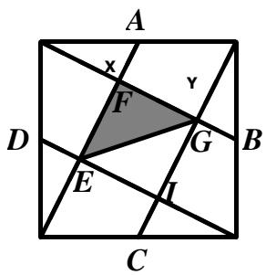

Area of shaded part $\textstyle = { \frac { 1 } { 2 } }$ the area of $\mathsf { E F G I } = \frac { 1 } { 2 } \times \frac { 1 } { 5 }$ 5 the area of the large square = $\begin{array} { c c c } { { \frac { 1 } { 1 0 } \times 3 9 0 c m ^ { 2 } = 3 9 c m ^ { 2 } } } \end{array}$ 

Answer: 39 

## Question 24

Let us colour all the circles with 3 colours, say red (R), blue (B) and green (G). 

The diagram below shows one possible way to colour all the circles with just red, blue and green: 

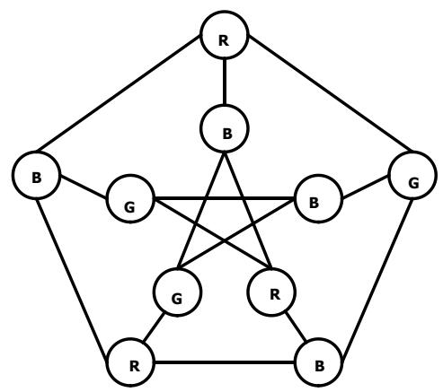

Answer: 3 

## Question 25

A four-digit number plus a four-digit number can only result in a five-digit number that starts with 1. Hence F must be 1. 

Since F is 1, D can only be 8 or 9. If D=8, then C = 0, E = D – F = 7 which is impossible since the last digit of B + B must be even. 

Thus D = 9, C = 0, E = D – F = 8, 8 = B + B or B = 4 and DBEC is 9480. 

Answer: 9480 