# Primary 5 (Grade 5) – GEP Practice

# 2020 Contest Problems with Full Solutions

Authors: 

Henry Ong, BSc, MBA, CMA 

Merlan Nagidulin, BSc 

© Singapore International Mastery Contests Centre (SIMCC) 

## All Rights Reserved

No part of this work may be reproduced or transmitted by any means, electronic or mechanical, including photocopying and recording, or by any information or retrieval system, without the prior permission of the publisher. 

## Section A (Correct answer – 2 points| No answer – 0 points| Incorrect answer – minus 1 point)

## Question 1

Find the value of the following. 

$$
8 8 9 9 + (6 6 7 7 - 2 2 3 3) - 4 4 5 5
$$

A. 8888 

B. 8877 

C. 8899 

D. 8887 

E. None of the above 

## Question 2

Jane thought of a number. Josh calculated one-third of Jane’s number. Frank calculated two-fifths of Josh’s number. If Frank got 18, what was Jane’s number? 

A. 2.4 

B. 270 

C. 45 

D. 135 

E. None of the above 

## Question 3

In a sports league, teams can either get 7 points or 3 points in each match. What is the largest score that cannot be attained? 

A. 8 

B. 11 

C. 19 

D. 22 

E. None of the above 

## Question 4

The percentages of boys in two classes are 30% and 60%. The numbers of students in the two classes are 30 and 45 respectively. What is the percentage of boys in the two classes combined? 

A. 90% 

B. 48% 

C. 30% 

D. 10% 

E. None of the above 

## Question 5

How many pairs of non-zero whole numbers ?? and ?? are there such that ?? + ?? = 10? Take note that $( a , b )$ and $( b , a )$ are the same pair. 

A. 4 

B. 5 

C. 6 

D. 10 

E. None of the above 

## Question 6

Ted, Bob, Andi and Beti were playing "Guess The Number" game. Ted thought of a three-digit number and the others were trying to guess his number. 

Bob said, "I guess your number is 784." 

Andi said, "I think it is 394." 

Beti said, "I think it must be 795." 

Ted then replied, ”Each of the numbers you said shares two digits in common with mine". What is the sum of the digits of Ted’s number? 

A. 395 

B. 794 

D. 22 

E. None of the above 

## Question 7

What is the missing number in the sequence below? 

$$
\begin{array}{l} 2 3, 1 9, 2 5, 2 6, 2 7, 3 3, 2 9, \_, 3 1 \end{array}
$$

A. 40 

B. 30 

C. 32 

D. 36 

E. None of the above 

## Question 8

How many two-digit numbers are divisible by 4 but not by 8? 

A. 25 

B. 22 

C. 12 

D. 11 

E. None of the above 

## Question 9

There are roses and lilies at a flower shop. Two roses cost $7 while three lilies cost $5. Billy bought some roses and lilies and paid $86. Which of the following can be the number of lilies he bought? 

A. 15 

B. 21 

C. 24 

D. 36 

E. None of the above 

## Question 10

What is the missing number in the pattern below? 

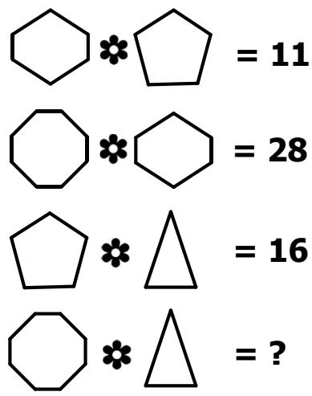

A. 11 

B. 33 

C. 38 

D. 55 

E. None of the above 

## Question 11

The dimensions of two metal cuboids are 3 × 5 × 7 and $6 \times 8 \times 1 0$ . One of the cuboids is shown on the right. Harry melts both cubes and forms the largest possible cuboid with base of size 9 × 13. What is the height of the new cuboid? 

A. 4.5 

D. 11 

E. None of the above 

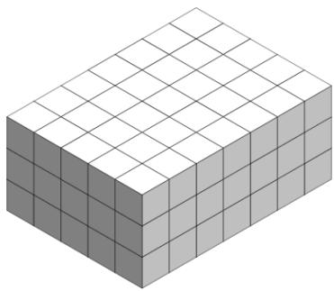

## Question 12

There are three boxes, one contains only apples, one contains only oranges, and one contains both apples and oranges. All the boxes are labelled as shown below. 

Box 1 labelled: This box contains both apples and oranges. 

Box 2 labelled: Box 1 does not contain different fruits. 

Box 3 labelled: This box contains only one type of fruit. 

If only one box is labelled correctly, which box contains both apples and oranges? 

A. Box 1 

B. Box 2 

C. Box 3 

D. Impossible to determine 

E. Box 1 and 2 

## Question 13

In the rectangle ????????, point ?? is on the side ???? and point ?? is on the side ???? such that $B E = { \textstyle { \frac { 1 } { 3 } } } A E$ and ${ D F } = \textstyle { \frac { 2 } { 5 } } A D$ . What is the ratio of areas of ???????? and ??????????? 

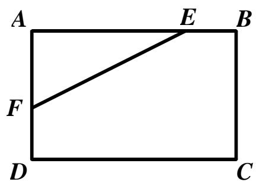

A. 40 : 31 

B. 15 : 13 

C. 48 : 35 

D. 15 : 14 

E. None of the above 

## Question 14

In which of the following times is the hour hand closest to the minute hand of a clock? 

A. 6:30 

B. 6:31 

C. 6.32 

D. 6:33 

E. 6:34 

## Question 15

Which one of the following options is a missing piece of the cube on the right? 

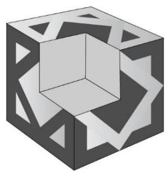

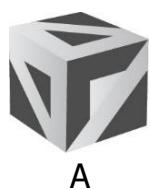

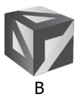

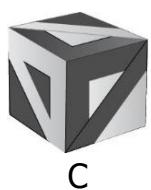

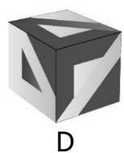

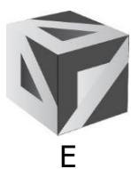

## Section B (Correct answer – 4 points| Incorrect or No answer – 0 points)

When an answer is a 1-digit number, shade “0” for the tens, hundreds and thousands place. 

Example: if the answer is 7, then shade 0007 

When an answer is a 2-digit number, shade “0” for the hundreds and thousands place. 

Example: if the answer is 23, then shade 0023 

When an answer is a 3-digit number, shade “0” for the thousands place. 

Example: if the answer is 785, then shade 0785 

When an answer is a 4-digit number, shade as it is. 

Example: if the answer is 4196, then shade 4196 

## Question 16

How many triangles are there in the figure below? 

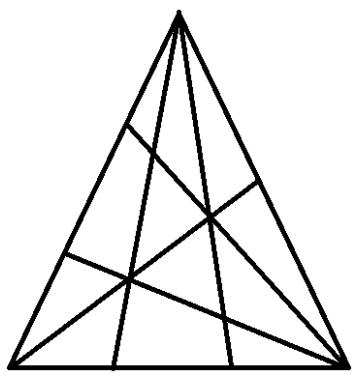

## Question 17

Find the last digit of the following product. 

$$
\underbrace {2 \times 2 \times \ldots \times 2} _ {\text {20 times}} \times \underbrace {3 \times 3 \ldots \times 3} _ {\text {20 times}}
$$

## Question 18

The ratio of the volume of water in Tank A to that in Tank C is 4 : 7. The ratio of the volume of water in Tank B to the total volume in the 3 tanks is 6 : 50. If there are 5 more litres of water in Tank A than Tank B, how much water (in litres) is there in Tank C? 

## Question 19

How many four-digit numbers are there between 7500 and 9600 that can be formed using only the digits 3, 7, 5, 6, 8, 9 without repetition of any digits? 

## Question 20

At a book fair, there were 120 more adults than girls. The number of girls was 75% of the number of boys and 12% of the total number of people. How many adults were there at the book fair? 

## Question 21

The number of digits used to number the pages of a book is twice the number of pages of the book. If the number of pages of the book is a three-digit number, how many pages does the book have? 

## Question 22

Peter and Frank together can build a house in eight days. Peter and George together can build the same house in six days. It is given that each of them works exactly nine hours per day. If Peter alone can build the same house in 12 days, how many hours will Frank and George work together to build a house? 

## Question 23

In the diagram below, points ??, ??, ?? and ?? are the midpoints of the sides of a square. If the area of the largest square below is $3 9 0 \ c m ^ { 2 } ,$ , find the area of the shaded region. 

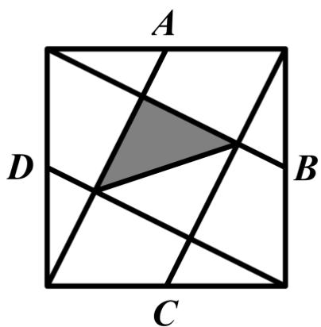

## Question 24

One wants to colour the circles in the figure below such that any pair of circles connected by a line segment shares different colours. What is the least number of colours needed for the colouring? 

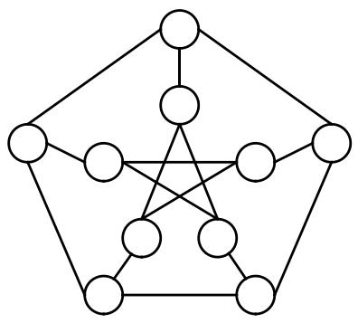

## Question 25

In the following, all the different letters stand for different digits. 

<table><tr><td></td><td>F</td><td>B</td><td>F</td><td>C</td></tr><tr><td>+</td><td>D</td><td>B</td><td>E</td><td>C</td></tr><tr><td></td><td>F</td><td>C</td><td>E</td><td>D</td></tr></table>

Find the value of the 4-digit number DBEC. 

## Solutions to SASMO 2020 Primary 5 (Grade 5)

## Question 1

$$
\begin{array}{l} 8 8 9 9 + (6 6 7 7 - 2 2 3 3) - 4 4 5 5 \\ = 8 8 9 9 + 4 4 4 4 - 4 4 5 5 \\ = 8 8 9 9 - 4 4 5 5 + 4 4 4 4 \\ = 4 4 4 4 + 4 4 4 4 \\ = 8 8 8 8 \\ \end{array}
$$

## Question 2

$$
\begin{array}{l} F r a n k ^ {\prime} s \text {   number   } = \frac {2}{5} \text {   of   Josh's   number   } = 1 8 \\ \frac {1}{5} \text {of Josh's number} = 9 \\ \frac {5}{5} \text {of Josh's number} = 9 \times 5 = 4 5 \\ \text { Josh's   number } = \frac {1}{3} \text { of   Jane's   number } = 4 5 \\ \frac {3}{3} \text {of Jane's number} = 4 5 \times 3 = \mathbf {1 3 5} \\ \end{array}
$$

Answer: (D) 

## Question 3

Some valid scores include 12 (3 × 4), 13 (3 × 2 + 7) and 14 (7 × 2). 

Next three scores 15, 16 and 17 can be obtained from 12, 13 and 14 by scoring 3 more points. Thus, all scores greater than 11 can be obtained by scoring additional 3 points, and the largest unattainable score is 11. 

Answer: (B) 

## Question 4

Number of boys in the first clas $\begin{array} { r } { \mathsf { s } = 3 0 \times \frac { 3 0 } { 1 0 0 } = 9 } \end{array}$ 

Number of boys in the second cla $5 5 = 4 5 \times \frac { 6 0 } { 1 0 0 } = 2 7$ 

Total number of boys in the two classes= 9 + 27 = 36 

Total number of students in the two classes= 30 + 45 = 75 

Percentage of boys in the two classes combined= $\begin{array} { r } { \mathrm { ; } \frac { 3 6 } { 7 5 } \times 1 0 0 = 4 8 \% } \end{array}$ 

Answer: (B) 

## Question 5

10 

$$
= 1 + 9
$$

$$
= 2 + 8
$$

$$
= 3 + 7
$$

$$
= 4 + 6
$$

$$
= 5 + 5
$$

Thus, there are 5 such pairs. 

Answer: (B) 

## Question 6

If each number said shares 2 digits, then there must be common digits of numbers said. 

Bob and Andis’ numbers share a common digit of 4. 

Andi and Betis’ numbers share a common digit of 9. 

Bob and Betis’ numbers share a common digit of 7. 

Hence the number which Ted is thinking of is a permutation of the digits 4, 7 and $^ { 9 , }$ which sum of digits is $4 + 7 + 9 = 2 0$ 

Answer: (C) 

## Question 7

The pattern is a combination of two different sequences as shown: 

$$
2 3 \stackrel {+ 2} {\rightarrow} 2 5 \stackrel {+ 2} {\rightarrow} 2 7 \stackrel {+ 2} {\rightarrow} 2 9 \stackrel {+ 2} {\rightarrow} 3 1
$$

$$
1 9 \stackrel {+ 7} {\rightarrow} 2 6 \stackrel {+ 7} {\rightarrow} 3 3 \stackrel {+ 7} {\rightarrow} \mathbf {4 0}
$$

The next number in the sequence in the question is 40. 

Answer: (A) 

## Question 8

Two-digit numbers which are divisible by 4: 12, 16, 20, …, 96 

There are (96 − 12) ÷ 4 + 1 = 22 multiples of 4. 

Two-digit numbers which are divisible by 8: 16, 24, 32, …, 96 

There are (96 − 16) ÷ 8 + 1 = 11 multiples of 8. 

Out of 22 multiples of 4, 11 of them are also divisible by 8. Thus, there are 22 − 11 = ???? two-digit numbers which are divisible by 4 but not by 8. 

Answer: (D) 

## Question 9

To get $86, the number of roses must be divisible by 2 and the number of lilies must be divisible by 3. Let the number of roses be 2 × ?? and the number of lilies be 3 × ??. Hence 

$$
7 \times a + 5 \times b = 8 6
$$

When ?? = 1, ?? is not a whole number. 

When ?? = 2, ?? is not a whole number again. 

Checking other values of ?? from 3 to 12, the possible values of ?? are 3 and 8. Then ?? = 13 or 6 and 3 × ?? = 39 or 18. Thus, none of the options A to D are possible and the answer is option E. 

Answer: (E) 

## Question 10

From the pattern octagon (which has 8 sides) flower hexagon (which has 6 sides) = (8 + 6)(8 − 6) = 28 

This also holds true for the remaining 2 examples given. 

Hence, octagon (which has 8 sides) flower triangle (which has 3 sides) = (8 + 3)(8 − 3) = ???? 

Answer: (D) 

## Question 11

Cuboid of dimensions 3 × 5 × 7 is made of 3 × 5 × 7 = 105 small cubes. 

Cuboid of dimensions 6 × 8 × 10 is made of 6 × 8 × 10 = 480 small cubes. 

When melted, they will form a new cuboid with a total of 585 small cubes. 

Height of new cuboid = 585 ÷ (9 × 13) = 5 

Answer: (B) 

## Question 12

If box 1 is labelled correctly, then box 3 must contain either apples or oranges, so box 3 is also labelled correctly, which contradicts the fact that only one box is labelled correctly. 

If box 3 is labelled correctly, then box 1 is labelled wrongly. This means that box 1 contains only one type of fruit. Hence box 2 is also labelled correctly, which contradicts the fact that only one box is labelled correctly. 

Hence, box 2 must be labelled correctly. This means that box 3, which is labelled wrongly, must contain both apples and oranges. 

Answer: (C) 

## Question 13

Let the length of AB be 4 units. Let the length of AD be 5 parts. 

Then AE must be 3 units long and AF must be 3 parts long. 

$$
\begin{array}{l} \text { Area } (F E B C D) = \text { Area } (A B C D) - \text { Area } (A E F) \\ = 4 \text {units} \times 5 \text {parts} - \frac {1}{2} \times 3 \text {units} \times 3 \text {parts} = 1 5. 5 \text {units} \times \text {parts} \\ \end{array}
$$

????????(????????): ????????(??????????) = (4 × 5) (?????????? × ??????????): 15.5 (?????????? × ??????????) = 40:31 

Answer: (A) 

## Question 14

The angle of each division is $3 6 0 ^ { \circ } \div 1 2 = 3 0 ^ { \circ }$ 

In 1 hour: 

• the hour hand moves by 30° 

• the minute hand moves by $3 6 0 ^ { \circ }$ 

In 1 minute: 

the hour hand moves by $3 0 ^ { \circ } \div 6 0 =$ $0 . 5 ^ { \circ }$ 

the minute hand moves by $3 6 0 ^ { \circ } \div$ $6 0 = 6 ^ { \circ }$ 

Let assume that after ?? minutes past 6, the angle between the hands is $0 ^ { \circ }$ . 

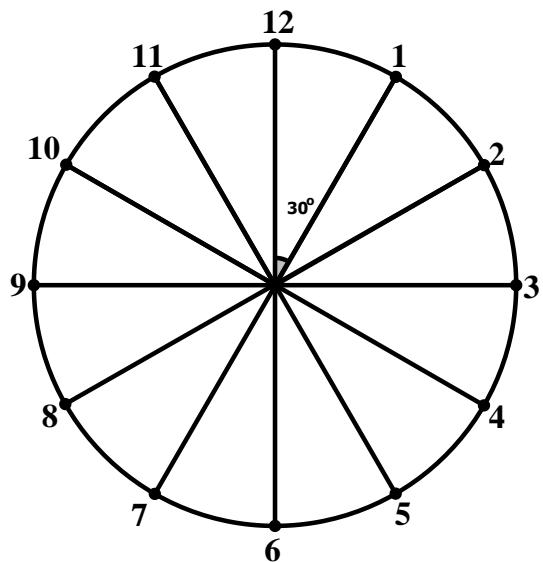

The minute hand travelled 6° × ?? = 6?? from the 12. 

The hour hand travelled $0 . 5 ^ { \circ } \times m = 0 . 5 m$ from the 6. Also, the angle between the 12 and 6 is $3 0 ^ { \circ } \times 6 = 1 8 0 ^ { \circ }$ . Thus, the angle between the 12 and the tip of the hour hand is $1 8 0 ^ { \circ } + 0 . 5 m .$ . 

The angle between the hands of a clock is 

$$
6 m - (1 8 0 + 0. 5 m) = 0 ^ {\circ}
$$

Solving the equation, we get $\begin{array} { r } { m = \frac { 3 6 0 } { 1 1 } = 3 2 \frac { 8 } { 1 1 } } \end{array}$ which is closest to 33. 

Answer: (D) 

## Question 15

The missing piece must have 3 faces shown below to match the cube. 

<table><tr><td>Top face</td><td>Right face</td><td>Left face</td></tr><tr><td>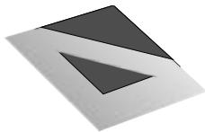</td><td>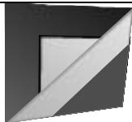</td><td>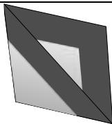</td></tr></table>

Only Option C has all the 3 faces. 

Answer: (C) 

## Question 16

Rotate the figure as shown on the right. 

Count by types of triangles. 

1-part: 10 

5-part: 4 

2-part: 7 

6-part: 3 

3-part: 10 

8-part: 4 

4-part: 6 

12-part: 1 

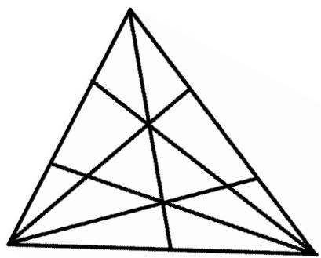

Total: 10 + 7 + 10 + 6 + 4 + 3 + 4 + 1 = 45 

Answer: 45 

## Question 17

Last digits of the following is product is 

$$
\underbrace {(2 \times 3) \times (2 \times 3) \times \ldots \times (2 \times 3)} _ {2 0 t i m e s} = \underbrace {6 \times 6 \times \ldots \times 6} _ {2 0 t i m e s} = \mathbf {6}.
$$

Answer: 6 

## Question 18

The ratio of $B : A + B + C$ is $6 : 5 0$ , implying that the volume of water in B can be expressed as 6 units while the volume of water in A + C can be expressed as $5 0 - 6 =$ 44 units. 

The ratio of $\mathsf { A } : \mathsf { C } = 4 : 7$ gives a total of 11 units. The least common multiple of 11 and 44 is $^ { 4 4 , }$ so the least total number of units of A and C must be 44 units. 

The ratio of $\mathsf { A } : \mathsf { C } = 4 : 7$ must be multiplied by 4 to become 16 : 28, so that the total number of units of A and C is 44. 

Since B is 6 units while A is 16 units, and there are 5 more litres of water in Tank A than Tank B, 16 − 6 = 10 units = 5 litres. 

$$
1 \text {unit} = 5 \div 1 0 = \frac {1}{2} \text {litres}
$$

$$
2 8 \mathrm{units} = \frac {1}{2} \times 2 8 = 1 4 \mathrm{litres}
$$

Answer: 14 

## Question 19

The total number of four-digit numbers from 7500 to 7999 that can be formed using only the digits 3, 7, 5, 6, 8 or 9 without repetition of any digits: 

<table><tr><td>Thousands</td><td>Hundreds</td><td>Tens</td><td>Ones</td></tr><tr><td>1 option</td><td>4 options</td><td>4 options</td><td>3 options</td></tr><tr><td>7</td><td>5, 6, 8 or 9</td><td>5 options – 1 option (which is already used in the hundreds place)3, 5, 6, 8 or 9</td><td>5 options – 2 options (which are used in hundreds and tens place)</td></tr></table>

$\ 1 o p t i o n \times 4 o p t i o n s \times 4 o p t i o n s \times 3 o p t i o n s = 4 8 n u m b e r s$ 

The number of four-digit numbers from 8000 to 8999 that can be formed using only the digits 3, 7, 5, 6, 8 or 9 without repetition of any digits: 

<table><tr><td>Thousands</td><td>Hundreds</td><td>Tens</td><td>Ones</td></tr><tr><td>1 option</td><td>5 options</td><td>4 options</td><td>3 options</td></tr><tr><td>8</td><td>3, 5, 6, 7 or 9</td><td>5 options – 1 option (which is already used in the hundreds place)3, 5, 6, 8 or 9</td><td>5 options – 2 options (which are used in hundreds and tens place)</td></tr></table>

$\ 1 o p t i o n \times 5 o p t i o n \times 4 o p t i o n s \times 3 o p t i o n s = 6 0 n u m b e r s$ 

The number of four-digit numbers more than 9600 that can be formed using only the digits $3 , 7 , 5 , 6 , 8$ or 9 without repetition of any digits: 

<table><tr><td>Thousands</td><td>Hundreds</td><td>Tens</td><td>Ones</td></tr><tr><td>1 option</td><td>2 options</td><td>4 options</td><td>3 options</td></tr><tr><td>9</td><td>3 or 5</td><td>5 options – 1 option (which is already used in the hundreds place)</td><td>5 options – 2 options (which are used in hundreds and tens place)</td></tr></table>

$\ 1 o p t i o n \times 2 o p t i o n s \times 4 o p t i o n s \times 3 o p t i o n s = 2 4 n u m b e r s$ 

In total, there are $4 8 + 6 0 + 2 4 = 1 3 2$ such numbers. 

Answer: 132 

## Question 20

The number of girls was $7 5 \% = \frac { 7 5 } { 1 0 0 } = \frac { 3 } { 4 }$ 3 of the number of boys and 12% of the total number of people: 

Girls → 3 units = 12% of the total 

Boys → 4 units = 12 ÷ 3 × 4 = 16% of the total 

Adults = 100 − 12 − 16 = 72% of the total 

$$
72\% - 12\% = 60 \% \text{of the total} = 120
$$

$$
1 \% \text { of the total} = 120 \div 60 = 2
$$

Adults = 72% ???? ??ℎ?? ?????????? = 72 × 2 = ?????? 

Answer: 144 

## Question 21

Let ?? be the number of pages in the book. Then 

<table><tr><td>Values</td><td>Number of values</td><td>Number of digits</td></tr><tr><td>1 to 9</td><td>9</td><td><eq>9 \times 1 = 9</eq></td></tr><tr><td>10 to 99</td><td>90</td><td><eq>90 \times 2 = 180</eq></td></tr><tr><td>100 to x</td><td>x - 99</td><td><eq>3 \times (x - 99)</eq></td></tr><tr><td>Total:</td><td>x</td><td><eq>9 + {180} + {3x} - {297} = {3x} - {108}</eq></td></tr></table>

It is given that the number of digits used to number the pages of a book is twice the number of pages, so 

$$
3 x - 1 0 8 = 2 x \Rightarrow x = \mathbf {1 0 8}.
$$

Answer: 108 

## Question 22

???????? ???????? ???? ?????????? + ???????? ???????? ???? $\begin{array} { r } { F r a n k = \frac { W o r k D o n e } { T i m e S p e n t } = \frac { 1 } { 8 d a y s } = } \end{array}$ 

$\frac 1 8$ of the house per day 

???????? ???????? ???? ?????????? + ???????? ???????? ???? ???????? $\begin{array} { r } { g e = \frac { 1 } { 6 d a y s } = \frac { 1 } { 6 } } \end{array}$ of the house per day 

???????? ???????? ???? $\begin{array} { r } { P e t e r = \frac { 1 } { 1 2 d a y s } = \frac { 1 } { 1 2 } } \end{array}$ of the house per day 

???????? ???????? ???? $G e o r g e = \frac { 1 } { 6 } - \frac { 1 } { 1 2 } = \frac { 1 } { 1 2 }$ of the house per day 

???????? ???????? ???? ?????????? $\textstyle = { \frac { 1 } { 8 } } - { \frac { 1 } { 1 2 } } = { \frac { 1 } { 2 4 } }$ of the house per day 

???????? ???????? ???? ?????????? + ???????? ???????? ???? ???????????? $\textstyle = { \frac { 1 } { 2 4 } } + { \frac { 1 } { 1 2 } } = { \frac { 1 } { 8 } }$ of the house per day 

Since Frank and George can build $\frac 1 8$ of the house per day , they can build the same house in $1 \times 8 = 8$ days. 

Since each of them works exactly nine hours per day, they will take $8 \times 9 =$ ???? hours. 

Answer: 72 

## Question 23

Observe that the large square is divided into a square EFGI, along with 4 parts X and 4 parts Y. If you rotate a part X and combine with a part Y along a side of the large square, you will form the same square as EFGI. 

Hence, the large square is divided into 5 smaller squares, with EFGI being one of them. 

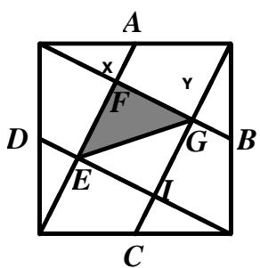

Area of shaded part $\textstyle = { \frac { 1 } { 2 } }$ the area of EFGI $\textstyle = { \frac { 1 } { 2 } } \times { \frac { 1 } { 5 } }$ the area of the large square = $\begin{array} { c c c } { { \frac { 1 } { 1 0 } \times 3 9 0 c m ^ { 2 } = 3 9 c m ^ { 2 } } } \end{array}$ 

Answer: 39 

## Question 24

Let us colour all the circles with 3 colours, say red (R), blue (B) and green (G). 

The diagram below shows one possible way to colour all the circles with just red, blue and green: 

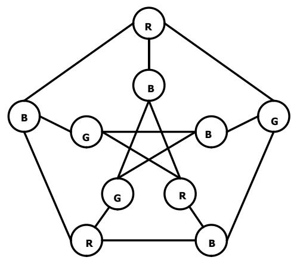

Answer: 3 

## Question 25

A four-digit number plus a four-digit number can only result in a five-digit number that starts with 1. Hence F must be 1. 

Since F is 1, D can only be 8 or 9. If D=8, then C = 0, E = D – F = 7 which is impossible since the last digit of B + B must be even. 

Thus D = 9, C = 0, E = D – F = 8, 8 = B + B or B = 4 and DBEC is 9480. 

Answer: 9480 