# Primary 6 (Grade 6) – GEP Practice

## 2019 & 2020

## Contest Problems with Full Solutions

Authors: 

Henry Ong, BSc, MBA, CMA 

Merlan Nagidulin, BSc 

## © Singapore International Mastery Contests Centre (SIMCC) All Rights Reserved

No part of this work may be reproduced or transmitted by any means, electronic or mechanical, including photocopying and recording, or by any information or retrieval system, without the prior permission of the publisher. 

## About the Authors:

Henry Ong is the Founder of SASMO and President of Singapore International Mastery Contest Centre (SIMCC). He conducts Math Olympiad classes, not only in Singapore but also around the 20 countries that have joined SASMO. He now travels round the world giving out awards and scholarships to students and teachers. He is now promoting new contests, International Scholastic Trust Teachers’ Institute (ISTTI) and International Junior Honor Society (IJHS). 

In February 2020, Henry was appointed Co-Chair of the Council Administration of Cambodian Mathematical Society (CA_CMS). Henry will share and use his great wealth of experience, expertise, and international networks to contribute effectively to: (1) promoting STEM: Science, Technology, Engineering, and Mathematics; (2) organizing and undertaking multilateral partnership programs; and (3) strengthening and improving the public-private partnership for development of STEM, research and development, and research and innovation as well as teacher professional development in Cambodia with relevant stakeholders in close collaboration and consultation with relevant leadership and management of Ministry of Education, Youth and Sport, especially Cambodian Mathematical Society (CMS), New Generation Pedagogical Research Center (NGPRC), National Institute of Education(NIE) and Teacher Training Department (TTD). 

Merlan Nagidulin is the Academic Director for Math and Science Olympiad and General Manager of SIMCC. Merlan graduated with a Bachelor of Science, Honours in Mathematical Sciences from Nanyang Technological University. Merlan won 2 gold medals in Kazakhstan National Math Olympiad and was awarded a bronze medal in the most prestigious International Math Olympiad (IMO Slovenia 2006). 

## Publisher

Noble Education Pte Ltd specialises in printing educational resources and educational games. We introduced many thinking games and puzzles to MOE schools in Singapore and overseas. We help students, teachers and entrepreneurs to self-publish their own titles. We print contest papers for all Singapore International Math Contest Centre (SIMCC) academic competitions world-wide. 

Noble Education Pte Ltd – 55 Lor L Telok Kurau, 03-69, Bright Centre, Singapore 425500 SIMCC – 199A Thomson Road, Goldhill Centre, Singapore 307636 Website: www.simcc.org 

If you spot any mistakes, kindly email us at training@simcc.org . 

Copyright © 2021 by SIMCC 

All rights reserved. No part of this work may be reproduced or transmitted in any form or by any means, electronic or mechanical, including photocopying and recording, or by any information or retrieval system, except as may be expressly permitted by the Copyright Act of 1976 or in writing to the Publisher. Requests for Permission should be addressed to: Permissions, Mr Henry Ong, c/o 55 Lor L Telok Kurau, 03-69, Bright Centre, Singapore 425500 or email: admin@simcc.org 

First Edition printed in Singapore, 2021 

ISBN: 978-98-11801-19-8 

## Table of Contents

International Scholastic Trust President’s Message........... 

Competition and Prizes ......... 

Introduction ...... 

Problem Solving Procedure ......... 

Problem Solving Strategies .......... 

SASMO 2019 Primary 6 (Grade 6) Contest Questions ............ 

SASMO 2020 Primary 6 (Grade 6) Contest Questions ............... .... 21 

Solutions to SASMO 2019 Primary 6 (Grade 6) ........... ... 33 

Solutions to SASMO 2020 Primary 6 (Grade 6) ........... . 44 

# International Scholastic Trust President’s Message

Dear SIMCC contestants, parents, teachers, and partners, 

I hope all of you are safe and healthy. We have all gone through so much within the past year, and we should rejoice - we are all alive and well. Despite all the groom and predictions of the worst recession to hit us very soon, we at SIMCC, are expanding globally – adding another 14 country partners to a total of 35 countries and territories within the last 10 months, and setting up sales offices in Cambodia and India, in addition to taking over the ICAS competitions and staff from the University of New South Wales Global Office based in Hong Kong and Macau. 

Two years, Sophie Koh, our Senior Director of IT, Events and Operations left Singapore Polytechnic as a Senior Lecturer of IT to join us. She has almost digitally transformed most of our operations and contest systems. This will provide valuable big data in formative and summative assessments for teachers to measure their students and inform their teaching. Parents and students will also receive Detailed Performance Reports (DPR) in our Member Development Portal (MDP) to improve their Academic Skills. Teachers and their schools will be able to download Students’ Analytical Performance Reports (SAPR). SIMCC together with our partners will be conducting more Webinars to prepare teachers and parents to use our contests and data to arm their wards with Skills and Recognition for SUCCESS. 

From February 16 to April 30, 2021, we are offering the 1st Singapore Math Global Assessment for grades 1 to 11 students. We want to open this up to every country, especially since Singapore Math textbooks are used in schools from over 70 countries. We want to share our rich Singapore Math heritage that has propelled Singapore students to the top of PISA rankings since the 1990s. We also have excellent teachers, Learning Management System (LMS), Math textbooks, assessment books, as well as teacher training to help improve math education worldwide. Reach out to us for help, if you want your students to become Mathematics Heroes! 

The global winners of SINGA Math Assessments are invited for the 1st SINGA Math Global Finals, in their home countries on September 11, 2021. The prize for the Overall Champion of grades 1 to 10/11 is a S$600 competition package to compete in the STEAM AHEAD International Junior Mathematics Olympiad (IJMO) to be held in Bali, Indonesia from December 3 to 7, 2021. The prize for Overall Runner-up is S$250 and 2nd Runner-up is S$150, offering a total prize award of S$10,000. Winners of Gold (10%) and Silver (15%) are invited to compete in STEAM AHEAD IJMO 2021. 

From 2021, we will be offering most of our contests to grade 12 students – SASMO, DrCT, SIMOC, and STEAM AHEAD. This will pave the way for Grades 12 SIMCC students to apply for SIMCC and STS’s US$270,000 endowed 2 scholarships for 4-year undergraduate studies at Southern Illinois University (SIU), Carbondale, Illinois, USA in STEM related fields. SIU has also given SIMCC over 30 SIU International Student Tuition Grants to award to top SIMCC students to pursue their university education. SIMCC will setup our own network for SIMCC scholars at SIU. This will help us expand SIMCC contests in North America and generate revenue for us to fund more scholarships. 

Best Regards, 

Henry Ong, President 

## Competition and Prizes

SASMO is devoted and dedicated to bringing a love for Mathematics to students. Unlike most Math Olympiad Competitions, SASMO caters not only to students in the top 5% but to the top 40% instead. It aims to arouse students’ interest and enthusiasm for mathematical problem solving, develop mathematical intuition, reasoning and logical thinking, as well as creative and critical thinking. In addition, this can help improve the students’ math grades because they can apply problem-solving strategies learnt during the training to their daily school mathematics. 

## History:

Created in 2006, SASMO is one of the largest Math Olympiads in the Asian region. We have expanded the competition to provide an International platform for students from Primary 2 to Secondary 4, with differentiated contest papers for every level. SASMO awards medals and certificates to the top 40% of participants. 

## Calculators are not permitted

When a problem introduces a more advanced concept, all necessary definitions are included. 

## Awards:

Each participant receives a Certificate of Participation or an award certificate for winners below. Each of the top 8%, 12% and 20% of all participants receives a Gold, Silver or Bronze medal and certificate respectively. Each student who achieves a Perfect Score of 85 points receives a Perfect Score certificate, Gold medal and $100. 

## Introduction

## For Students Taking the Math Olympiad Challenge

Congratulations. You have embarked on a journey of scholarship. Competitions like SASMO open many doors for you. Firstly, you learn new and interesting approaches to problem-solving and new topics. Next, you will meet talented students from other schools as you attend trainings and competitions. You build your endurance to “puzzle” out challenging problems and build your reputation as a problem solver. Finally, you will be exposed to various international competitions and scholarship opportunities. Here in Singapore, you increase your chances of getting into a top school via Direct School Admissions (DSA) and entry into the Gifted Education Programme as you compete regularly in high level competitions. 

This book is written for the participants in the Singapore and Asian Schools Math Olympiads (SASMO). It helps students to prepare well for the contest and develop higher-order thinking. All problems are designed to help students develop the ability to think mathematically, rather than to teach more advanced or unusual topics. The fun is in how you can see patterns and ways of solving each problem in non-technical ways even though you have not learnt the topic yet! 

In addition to the contest problems, the reader is provided with a list of familiar mathematical terms, as well as a review of some of the topics that are likely to be tested in the Olympiad. The book also contains some solved examples to provide different problem-solving techniques, and to familiarize the participant with different types of Olympiad questions. It is advised that the reader spends appropriate time studying these questions and solutions, as they will assist in tackling actual Olympiad problems. 

How to Use This Book: Practice daily for 15 minutes per hour instead of 4 hours of learning once a month. Your mind needs to absorb each new thought, and constant practice allows frequent review of previously learned concepts and skills. Together, you can remember many new problem-solving approaches. Try to spend 10 or 15 minutes daily doing two or three problems. This approach should help you minimize the time needed to develop the ability to think mathematically. 

Whether you solve a problem quickly or if you are confused, it is worth studying the solutions in this book, because often they offer unexpected insights that can help you understand the problem more fully. After you have invested time – trying to solve each problem any way you can, reviewing our solutions is very effective. Many of the problems in this book can be solved in more than one way. There is always a single answer, but there can be many paths to that answer. Once you solve a problem, go back and see if you can solve it by another method. Then check our solutions to see if any of them differ from yours. 

Enjoy working on these challenges and you will soon be in a different league from your peers who have not taken any international competition. We look forward to inviting you if you are a bronze, silver, gold or perfect score medallist for further training. 

## Problem Solving Procedure

You may go through several phases when solving a problem such as trying to understand the problem, working on a specific approach (planning and attempting), getting stuck and trying to get unstuck, critically examining solutions or communicating. The work may involve going back and forth between these different phases of problem solving. 

In solving any problem, it helps to have a working procedure. You might want to consider this four-step procedure: Understand, Plan, Try It, and Look Back. 

## Understand

Before you can solve a problem, you must first understand it. Read and re-read the problem carefully to find all the clues and determine what the question is asking you to find. What is the unknown? What is the data? What is the condition? 

## Plan

Once you understand the question and the clues, it's time to use your previous experience with similar problems to look for strategies and tools to answer the question. Do you know a related problem? Look at the unknown! And try to think of a familiar problem having the same or a similar unknown? 

## Try It

After deciding on a plan, you should try it and see what answer you come up with. Can you see clearly that the steps are correct? 

But can you also prove that the steps are correct? 

## Are you feeling stuck?

Many different approaches can be tried to get unstuck. One approach is to try working a simpler version of the problem, and use the solution to the problem to get insights that are useful in solving the original problem. In the next chapter, we will show some common solving approaches. 

If you are discouraged after a few failed attempts, read this quote from the famous scientist, Thomas Edison. An assistant asked, "Why are you wasting your time and money? We have had failure after failure, almost a thousand of them. Why do you continue to pursue this impossible task?" Edison said, "We haven't had a thousand failures, we've just discovered a thousand ways to not invent the electric bulb." 

## Look Back

Once you've tried a problem and found an answer, go back to the problem and see if you've really answered the question. Sometimes it's easy to overlook something. If you missed something check your plan and try the problem again. Can you check the result? 

Can you check the argument? 

Can you derive the result differently? 

Can you see it at a glance? 

## Problem Solving Strategies

## 1. Change the representation

Using a wrong representation may make a problem impossible to solve. 

Strategies of changing representation include drawing a picture and acting it out. 

DRAW A PICTURE: By drawing a picture, and visualizing the problem information using it, you will have a clearer understanding of the problem and it will help you to come up an approach to solve the problem that you might not be able to see otherwise. 

ACT IT OUT: We are better at thinking in terms of concrete objects and situations than in terms of abstract concepts. If we can act out the situation described in a word problem, we are able to understand the problem better and we may be able to come up with a solution. To do this, we need to use real materials that are easily available to us. Examples can be pencils, coins and other objects we have in the classroom. 

## 2. Make an Organized List or a Table

ORGANIZED LIST: Making an organized list allows you to clearly examine data. It can help you in ensuring that you are looking at all the relevant information. It will also allow you to see patterns in the data easily and to come to correct conclusions. 

MAKE A TABLE: Making a table allows you to clearly examine data. It can help you in ensuring that you are looking at all the relevant information. It will also allow you to see patterns in the data easily and to come to correct conclusions. 

## 3. Create a Simpler Problem

Sometimes we are not able to solve the problem as it is stated, but we are able to solve a similar problem that is similar in some way. For example, the simpler problem may use simpler numbers. Once we solve one or more simpler problems, we may understand the approach that can be used to solve the problems of similar type and may be able to solve the problem that has been given to us. 

## 4. Use Logical Reasoning

Logical reasoning is useful in mathematics problems in various ways. It can be used to eliminate incorrect choices. It can also sometimes be used to conclude the answer directly. 

## 5. Guess and Check

"Guess and Check" strategy can be used on many problems. If the number of possible answers is small, one can use this strategy to come up with the answer very quickly. In some other cases where the number of possible answers is not small, one may still be able to make intelligent guesses and come up with the answer. 

## 6. Working Backwards

Sometimes, it is easier to start with information at the end of the problem and work backwards to the beginning of the problem than the other way around. 

## SASMO 2019 Primary 6 (Grade 6) Contest Questions

Section A (Correct answer – 2 points| No answer – 0 points| Incorrect answer – minus 1 point) 

## Question 1

Find the sum of all digits of the following product 

$$
6 9 3 \times 3 3 3
$$

A. 230769 

B. 229669 

C. 27 

D. 34 

E. None of the above 

## Question 2

In a school, 52 students were given vouchers for a bookstore or cafeteria. Twenty of them received bookstore vouchers and 39 students received cafeteria vouchers. How many students received both vouchers? 

A. 8 

B. 9 

C. 10 

D. 11 

E. None of the above 

## Question 3

A cube is a solid consisting of identical squares. A cube has 6 faces. A “dodecahedron” is a solid consisting of identical pentagons (5-sided shapes), as illustrated below. If a dodecahedron has 12 faces, how many edges does it have? 

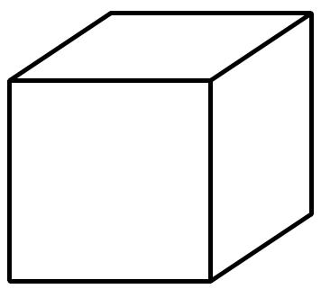

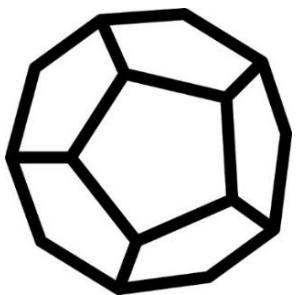

A. 5 

B. 20 

C. 12 

D. 30 

E. None of the above 

## Question 4

William has 3 books: Charlotte’s Web, Little Prince and Hobbit. How many ways can he arrange these books in a row such that Hobbit and Charlotte’s Web are next to each other? 

A. 6 

B. 2 

C. 4 

D. 12 

E. None of the above 

## Question 5

Clayton gave 77 baseball cards to his friend and 112 baseball cards to his brother. In the end, Clayton is left with 441 baseball cards. What percentage of his original number of cards did Clayton give away? 

A. 70% 

B. 60% 

C. 40% 

D. 30% 

E. None of the above 

## Question 6

In the diagram, ???????? and ???????? are squares, and ?????? is an equilateral triangle. Find the measurement (in degrees) of the angle ∠??????. 

A. $45 \textdegree$ 

B. $3 6 ^ { \circ }$ 

C. $3 2 ^ { \circ }$ 

D. $30 ^ { \circ }$ 

E. None of the above 

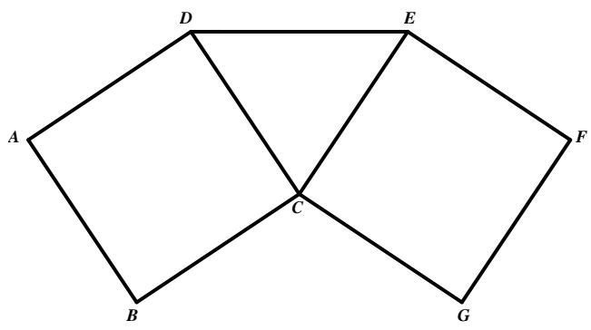

## Question 7

Annabelle, Betty, Cynthia and Dora are playing a new video game. After the first round of the game: 

Cynthia’s number of gold coins is equal to the average number of gold coins Annabelle and Betty have. 

• Annabelle’s number of gold coins is half of Betty’s. 

• Betty and Dora got the same number of gold coins. 

• Dora got 10 more gold coins that Cynthia. 

What is their total number of gold coins after the first round? 

A. 140 

B. 130 

C. 70 

D. Insufficient data 

E. None of the above 

## Question 8

Each of the 3-digit numbers ??????, ?????? and ?????? is even and divisible by 9. If ??, ?? and ?? are different digits, find the value of ?? + ?? + ??. 

A. 18 

B. 9 

C. 20 

D. 12 

E. None of the above 

## Question 9

Consider all the whole numbers from 1 to 50. Which of the following is NOT true about them? 

A. The number of even numbers is the same as the number of odd numbers. 

B. Writing all the digits, the digit “0” is the least occurring digit. 

C. There are more 2-digit numbers than 1-digit numbers. 

D. The number of multiples of 5 is the same as the number of multiples of 7. 

E. The average of the 50 numbers is not a whole number. 

## Question 10

A pipe can fill up an empty tank with water in 4 hours. However, due to the leakage in the tank, the pipe fills the empty tank in 12 hours. If the tank is full of water and the pipe is removed, how long will the leakage take to empty the full tank? 

A. 6 hours 

B. 8 hours 

C. 9 hours 

D. 16 hours 

E. None of the above 

## Question 11

Seventy days after the day before yesterday is Friday. Which day of the week is tomorrow? 

A. Friday 

B. Saturday 

C. Sunday 

D. Thursday 

E. None of the above 

## Question 12

At 12 p.m., the hour and minute hand point in the same direction. What is the exact time between 6 p.m. and 7 p.m. when the hour and minute hand point in the same direction? 

A. 6.30 p.m. 

B. $6 { : } 3 2 { \frac { 8 } { 1 1 } } { \mathsf { p } } . { \mathsf { m } } .$ 

C. $6 { : } 3 3 \frac { 3 } { 1 1 } \mathsf { p . m } .$ 

D. $6 { : 3 2 } \textstyle { \frac { 7 } { 1 1 } } { \mathsf { p } } . { \mathsf { m } } ,$ 

E. None of the above 

## Question 13

Four athletes run in a marathon, and made the following statements: 

Tom: I’m the fastest. 

Jack: I’m the slowest. 

Lionel: I’m neither the slowest nor the fastest. 

Robert: I’m not the fastest. 

If exactly 3 of them are telling the truth, who is the slowest? 

A. Tom 

B. Jack 

C. Lionel 

D. Robert 

E. Insufficient data 

## Question 14

The product of all whole numbers from 2 to M is a multiple of 1365. What is the least possible value of M? 

A. 13 

B. 15 

C. 65 

D. 1365 

E. None of the above 

## Question 15

Find the missing figure in the diagram below. 

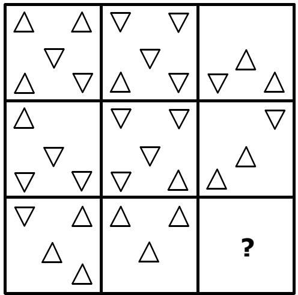

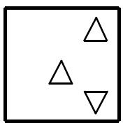

A

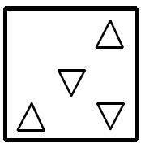

B

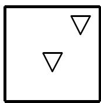

C

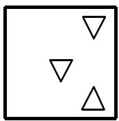

D

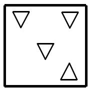

E

## Section B (Correct answer – 4 points| Incorrect or No answer – 0 points)

When an answer is a 1-digit number, shade “0” for the tens, hundreds and thousands place. 

Example: if the answer is 7, then shade 0007 

When an answer is a 2-digit number, shade “0” for the hundreds and thousands place. 

Example: if the answer is 23, then shade 0023 

When an answer is a 3-digit number, shade “0” for the thousands place. 

Example: if the answer is 785, then shade 0785 

When an answer is a 4-digit number, shade as it is. 

Example: if the answer is 4196, then shade 4196 

## Question 16

How many triangles are there in the diagram? 

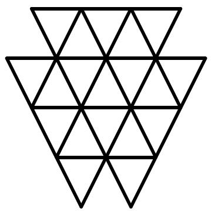

## Question 17

Find the numerator of the following sum in its simplest form. 

$$
\frac {1}{2} + \frac {1}{4} + \frac {1}{8} + \dots + \frac {1}{1 2 8}
$$

## Question 18

The following bar chart shows Nicki’s usage time of her phone in four months. The percentage decrease in the amount of usage time remains the same every following month. Find Nicki’s total number of usage time, in hours, during these four months. Round off your answer to the nearest whole number. 

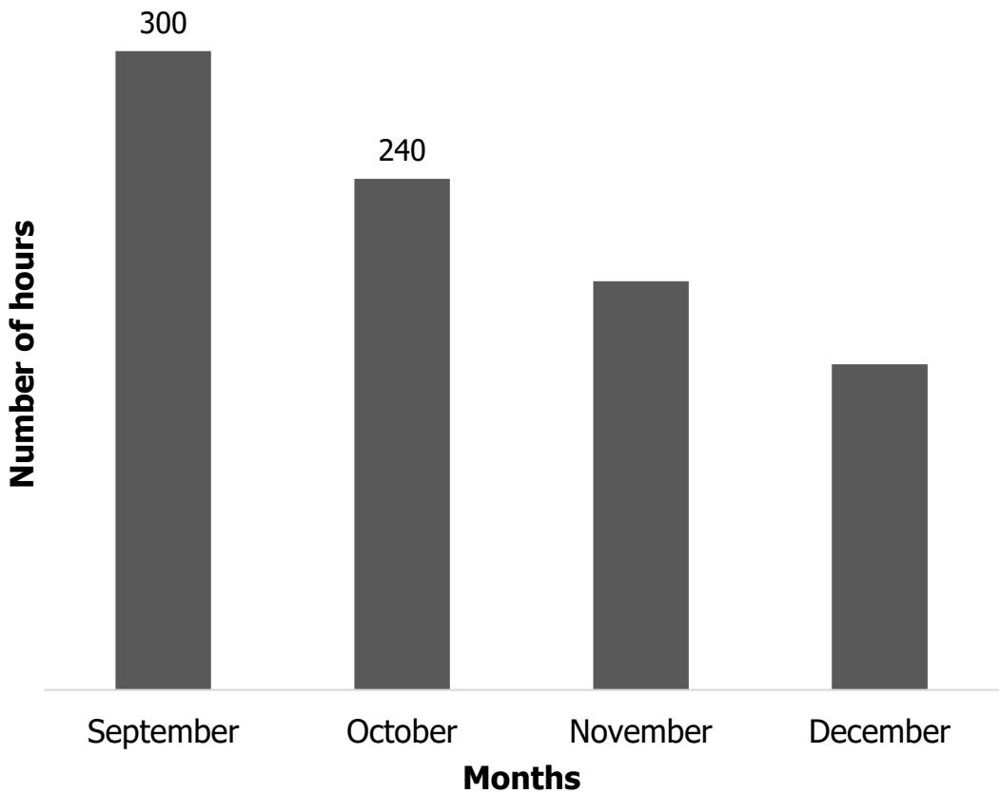

## Question 19

What is the missing number in the sequence below? 

131, 228, 331, 430, 531, 630, 731, ?, 930 

## Question 20

Andrew, Barry, Cassie and Drake bought some candies from a grocery shop. The number of candies Andrew bought is equal to $\frac 1 3$ of the total number of candies of Barry, Cassie and Drake. Barry’s number of candies is equal to 25% of the total number of candies of Andrew, Cassie and Drake. The ratio of Cassie’s candies to the total number of candies of the other three is 2:5. Drake bought 3 candies less than Cassie. How many candies did four of them buy altogether? 

## Question 21

Tom selected 30 different whole numbers such that the product of any 11 numbers is always even. The sum of the 30 numbers is an odd number. Find the least possible sum of these numbers. 

## Question 22

The diagram below shows triangular tracks ?????? and ?????? from the above. Triangles ?????? and ?????? are equilateral, and the perimeter of the triangular track ?????? is 168 metres. Matt runs around the track in the direction $A \longrightarrow B \longrightarrow C \longrightarrow A$ at 3 m/s (metres per second). Jack runs around the track in the direction $A \longrightarrow B \longrightarrow D \longrightarrow A$ at 7 m/s. If Matt and Jack start running from point A at the same time, how many seconds later will they meet each other for the first time at point ??? 

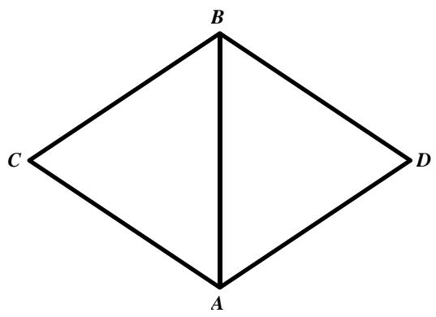

## Question 23

In the diagram, ???????? and ???????? are squares with $A B = 9$ cm and $D E = 5$ cm. If $\angle C D G = 9 0 ^ { \circ }$ , find the area $( \mathsf { i n c m } ^ { 2 } )$ of the shaded quadrilateral. 

## Question 24

In the following cryptarithm, all the different letters stand for different digits. What is the value of the sum O + D + A + G? 

<table><tr><td></td><td>G</td><td>O</td><td>O</td><td>D</td></tr><tr><td>+</td><td></td><td>D</td><td>O</td><td>G</td></tr><tr><td></td><td>D</td><td>G</td><td>D</td><td>A</td></tr></table>

## Question 25

January 23, 2019 can be written as 8-digit date format 23/01/2019. September 2, 2019 can be written as 8-digit date format 02/09/2019. How many digit “1” are there in all 8-digit dates of the year 2019? 

(For example, the date 25/01/2019 consists two “1” digits) 

## SASMO 2020 Primary 6 (Grade 6) Contest Questions

Section A (Correct answer – 2 points| No answer – 0 points| Incorrect answer – minus 1 point) 

## Question 1

Find the value of the following. 

$$
2 0 2 0 \times 2 0 2 0 - 2 0 1 9 \times 2 0 2 1
$$

A. 2020 

B. 4040 

E. None of the above 

## Question 2

What is the next number in the following pattern? 

$$
1, 2, 6, 1 5, 3 1, 5 6, \dots
$$

A. 92 

B. 81 

C. 105 

D. 78 

E. None of the above 

## Question 3

In a supermarket, the chicken nuggets are only available in packs of either 3 or 7 nuggets. For example, you cannot purchase exactly 2, 5 or 8 nuggets. What is the largest number of chicken nuggets that one cannot purchase? 

A. 231 

B. 721 

C. 23 

D. 13 

E. None of the above 

## Question 4

In the diagram, the unshaded area is made of 4 semicircles touching at the centre of the large circle. If the diameter of the large circle is 28 cm, find the area of the shaded region. (Use $\begin{array} { r } { \pi = { \frac { 2 2 } { 7 } } ) } \end{array}$ 

A. $6 1 6 \ \mathsf { c m } ^ { 2 }$ 

B. $4 6 2 \ c m ^ { 2 }$ 

C. $3 0 8 \ c m ^ { 2 }$ 

D. $1 5 4 \mathsf { c m } ^ { 2 }$ 

E. None of the above 

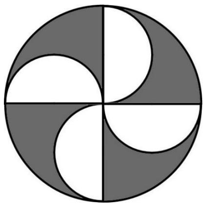

## Question 5

James has tiles of size 3 cm × 7 cm. He wants to put them on the floor of size 23 cm × 10 cm. What is the largest number of tiles that he can put without overlapping or breaking of any tiles? 

A. 10 

B. 9 

C. 8 

D. 7 

E. None of the above 

## Question 6

The following bar chart shows the responses made by SASMO Primary 6 students in a multiple-choice question. All the horizontal lines are equally spaced. Each student selected one of the possible choices and the correct answer is C. Find the percentage of students who answered this question correctly. 

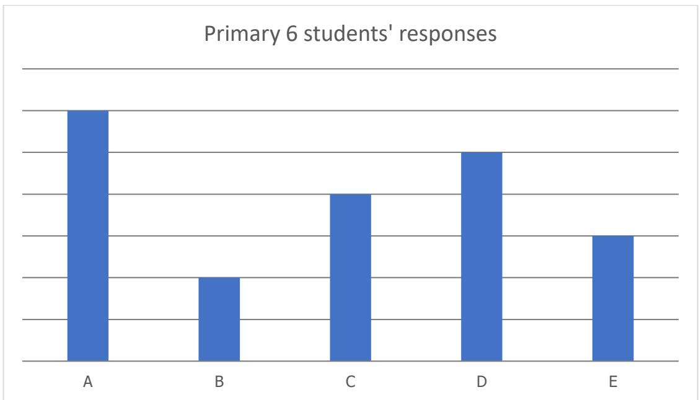

A. 25% 

B. 16% 

C. 24% 

D. 20% 

E. None of the above 

## Question 7

Working alone, Ryan can dig a 5 m by 5 m by 5 m hole in six hours. Castel can dig a 10 m by 10 m by 5 m hole in twelve hours. How many hours would it take them to dig a 5 m by 5 m by 5 m hole if they worked together? 

A. 4 

B. 1 

C. 2 

D. 3 

E. None of the above 

## Question 8

The five-digit number A549B is divisible by 45. Find the value of A + B. 

A. 0 

B. 9 

C. 18 

D. 27 

E. None of the above 

## Question 9

Which cube below has a top view same as the clock on the right? 

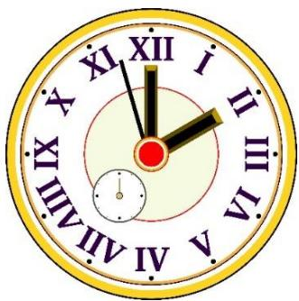

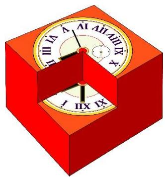

A

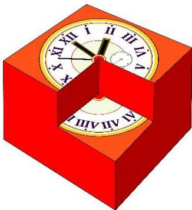

B

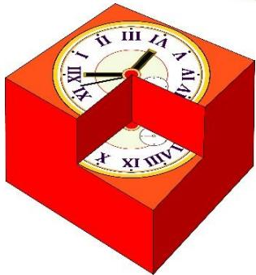

C

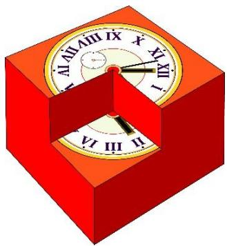

D

E

## Question 10

Stacy bought a pack of M&M chips. After she ate some, the ratio of the number of chips she ate to the number of remaining chips in the pack was 3 : 5. If she eats 50 chips more, then the new ratio will be 7 : 5. How many M&M chips were there in the pack when Stacy bought it? 

A. 10 

B. 150 

C. 240 

D. 140 

E. None of the above 

## Question 11

The minute hand of a certain clock is 3 times as long as the hour hand. In 24 hours, the tips of hour and minute hands travelled 1036 × ?? cm in total. How long is the hour hand of the clock? (Use $\begin{array} { r } { \pi = { \frac { 2 2 } { 7 } } ) } \end{array}$ 

A. 7 cm 

B. 21 cm 

C. 14 cm 

D. 7.5 cm 

E. None of the above 

## Question 12

In Mathematics, the product of the first ?? positive integers is written as ??! = 

$n \times ( n - 1 ) \times \ldots \times 1$ . For example, $2 ! = 2 \times 1$ and $7 ! = 7 \times 6 \times 5 \times 4 \times 3 \times 2 \times 1$ . How 

many consecutive digit "0"s at the end of 8! + 9! are there? 

A. 0 

B. 2 

C. 1 

D. 3 

E. None of the above 

## Question 13

Four identical rectangles are placed side by side on a 28 cm by 20 cm rectangular piece of paper in 2 different ways as shown in Figures A and B. What is the difference in the perimeters of the shaded regions of Figure A and B? 

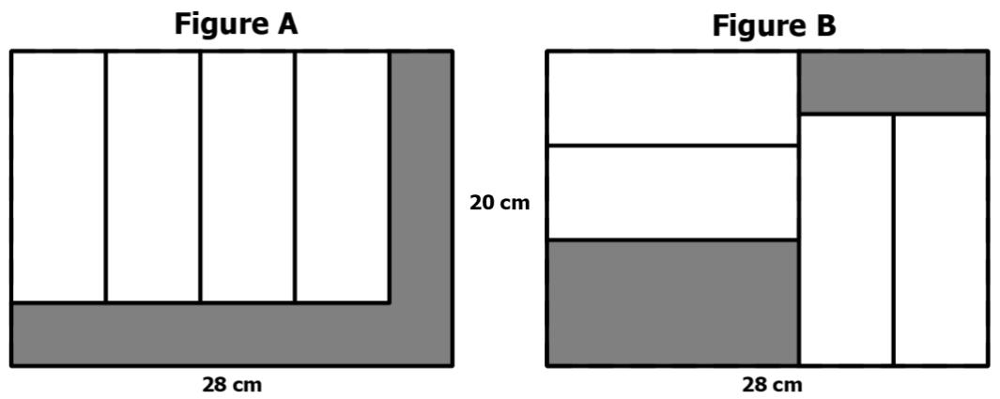

A. 96 cm 

B. 80 cm 

C. 32 cm 

D. 16 cm 

E. None of the above 

## Question 14

Hailey, Lydia, Julia, Asher and Charles are Primary 4 or 6 students. They study in either Bright Primary School or Light Primary School. 

• Lydia and Charles are from the same grade. 

• Julia and Asher study at different levels. 

• Three students study in Primary 4 and the other two students in Primary 6. 

• Asher and Charles are from different schools. 

• Hailey and Julia go to the same school. 

• Three students go to Bright Primary School and the other two are from Light Primary School. 

If one of them is Primary 6 student from Light Primary School, who is that person? 

A. Hailey 

B. Lydia 

C. Julia 

D. Asher 

E. Charles 

## Question 15

In which of the following times is the hour hand closest to the minute hand of a clock? 

A. 9:47 

B. 9:48 

C. 9:49 

D. 9:50 

E. 9:51 

## Section B (Correct answer – 4 points| Incorrect or No answer – 0 points)

When an answer is a 1-digit number, shade “0” for the tens, hundreds and thousands place. 

Example: if the answer is 7, then shade 0007 

When an answer is a 2-digit number, shade “0” for the hundreds and thousands place. 

Example: if the answer is 23, then shade 0023 

When an answer is a 3-digit number, shade “0” for the thousands place. 

Example: if the answer is 785, then shade 0785 

When an answer is a 4-digit number, shade as it is. 

Example: if the answer is 4196, then shade 4196 

## Question 16

Find the last digit of the following product. 

$$
\underbrace {2 \times 2 \times \ldots \times 2} _ {\text {20 times}} \times \underbrace {3 \times 3 \ldots \times 3} _ {\text {24 times}}
$$

## Question 17

How many triangles are there in the figure below? 

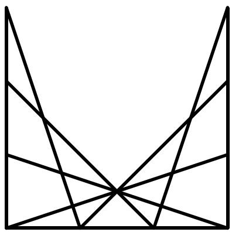

## Question 18

Find the value of the following. 

$$
\left(\frac {1}{2 0 \times 2 5} + \frac {1}{2 5 \times 3 0} + \frac {1}{3 0 \times 3 5} + \dots \frac {1}{2 0 1 5 \times 2 0 2 0}\right) \times 2 0 2 0
$$

## Question 19

The number of apples in a basket is $\frac { 4 } { 5 }$ of the number of oranges. The ratio of the number of pears to the number of apples is 3 : 8. The rest of the fruits are bananas and 20% of all the fruits in the baskets are oranges. The number of bananas is 48 more than the total number of apples, oranges and pears. How many fruits are there in the basket? 

## Question 20

The number of digits used to number the pages of a book is twice the number of pages of the book. If the number of pages of the book is a three-digit number, how many pages does the book have? 

## Question 21

The diameter of Candle A is longer than that of Candle B. Candle A can burn for 24 hours, while Candle B can burn for 16 hours. Both were lit at the same time and had the same height two hours later. If the original height of Candle A is 168 mm, what is the original height (in mm) of Candle B? 

## Question 22

An election for the school president position consists of 4 candidates: Amelia, Brad, Chris and Diana. There are 382 voters. In the middle of the manual count, Amelia got 90 votes, Brad got 45 votes, Chris got 69 votes, and Diana got 78 votes. What is the smallest number of votes that Amelia needs to get in order to ensure that she wins the position? 

## Question 23

In the diagram, $\angle A B C = \angle A D B = 9 0 ^ { \circ } , A B = B C ,$ , ???? = 4 cm and ???? = 6 cm. Find the area (in cm2) of triangle ??????. 

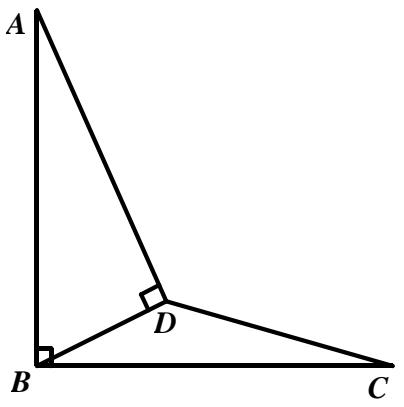

## Question 24

In the following cryptarithm, all the different letters stand for different digits. 

<table><tr><td></td><td>P</td><td>Q</td><td>R</td><td>S</td></tr><tr><td>x</td><td></td><td></td><td></td><td>9</td></tr><tr><td></td><td>S</td><td>R</td><td>Q</td><td>P</td></tr></table>

Find the value of the 4-digit number PQRS. 

## Question 25

Jason randomly placed digits 1, 2, 3, …, 9 around a circle. When he read three consecutive digits in clockwise order, he got a three-digit whole number. If there are 9 such three-digit numbers, find the sum of the 9 numbers. 

# Solutions to SASMO 2019 Primary 6 (Grade 6)

## Question 1

$$
\begin{array}{l} 6 9 3 \times 3 3 3 = (3 \times 2 3 1) \times 3 3 3 = 2 3 1 \times 3 \times 3 3 3 = 2 3 1 \times 9 9 9 = 2 3 1 \times (1 0 0 0 - 1) \\ = 2 3 1 \times 1 0 0 0 - 2 3 1 \times 1 = 2 3 1 0 0 0 - 2 3 1 = 2 3 0 7 6 9. \\ \end{array}
$$

The sum of the digits is 2 + 3 + 0 + 7 + 6 + 9 = ????. 

Answer: (C) 

## Question 2

$$
2 0 + 3 9 = 5 9 \mathrm{vouchersweregiven}
$$

$$
5 9 - 5 2 = 7 \text {   students   received   both   vouchers   }
$$

Answer: (E) 

## Question 3

Each face has 5 edges. Then 

12 faces x 5 edges = 60 edges 

However, every edge has been counted twice as there are 2 faces sharing the same edge. 

Thus, a dodecahedron has 60 ÷ 2 = 30 edges. 

Answer: (D) 

## Question 4

1) Hobbit – Charlotte’s Web – Little Prince 

2) Charlotte’s Web – Hobbit – Little Prince 

3) Little Prince – Hobbit – Charlotte’s Web 

4) Little Prince – Charlotte’s Web – Hobbit 

There are 4 ways of arrangement as shown above. 

Answer: (C) 

## Question 5

The number of cards Clayton gave away is $7 7 + 1 1 2 = 1 8 9$ . His original number of cards was $1 8 9 + 4 4 1 = 6 3 0$ . Hence the percentage is $\frac { 1 8 9 } { 6 3 0 } \mathrm { ~ X ~ } 1 0 0 = 3 0 \%$ . 

Answer: (D) 

## Question 6

It is given that $\angle C D A = 9 0 ^ { \circ }$ and $\angle C D E = 6 0 ^ { \circ } ,$ then 

$$
\angle A D E = \angle C D A + \angle C D E = 9 0 ^ {\circ} + 6 0 ^ {\circ} = 1 5 0 ^ {\circ}
$$

Triangle ?????? is isosceles since $A D = D C =$ ????. Hence 

$$
\begin{array}{l} \angle E A D = \angle A E D = (1 8 0 ^ {\circ} - \angle A D E) \div 2 \\ = (1 8 0 ^ {\circ} - 1 5 0 ^ {\circ}) \div 2 = 1 5 ^ {\circ} \\ \end{array}
$$

$$
\angle E A C = \angle C A D - \angle E A D = 4 5 ^ {\circ} - 1 5 ^ {\circ} = 3 0 ^ {\circ}
$$

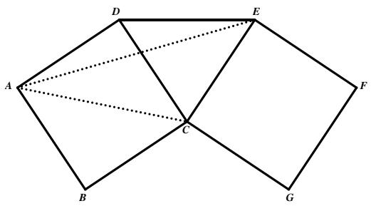

Answer: (D) 

## Question 7

Let Betty’s number of gold coins be 2 units. Then Dora has also 2 units gold coins and Annabelle has 1 unit. 

The average number of gold coins Annabelle and Betty have is 1 ????????+2 ???????? $\textstyle { \frac { 1 u n i t + 2 u n i t } { 2 } } = 1 . 5$ units. Hence Cynthia’s number of gold coins is 1.5 units. 

Dora got 10 more gold coins that Cynthia which implies that 

$$
2 \text {   units   } - 1. 5 \text {   units   } = 0. 5 \text {   unit   } = 1 0 \text {   and   } 1 \text {   unit   } = 2 0.
$$

Thus, their total number of gold coins after the first round is 

$$
1 \text {   unit   } + 2 \text {   units   } + 1. 5 \text {   units   } + 2 \text {   units   } = 6. 5 \text {   units   } = 6. 5 \times 2 0 = \mathbf {1 3 0}.
$$

Answer: (B) 

## Question 8

The digits ??, ?? and ?? are even since ??????, ?????? and ?????? are even. 

Using the divisibility test for 9, the sum of digits $A + B + C$ is divisible by 9. Since the digits ??, ?? and ?? are even, then $A + B + C = 1 8$ . 

Answer: (A) 

## Question 9

A. True. There are 25 even and 25 odd numbers. 

B. True. The digit “0” appears 5 times whereas other digits appear at least 5 times 

C. True. There are nine 1-digit numbers and forty-one 2-digit numbers. 

D. NOT True. There are ten multiples of 5 and seven multiples of 7. 

E. True. The average is $\begin{array} { r } { \frac { 2 5 \times 5 1 } { 5 0 } = \frac { 5 1 } { 2 } } \end{array}$ 51 which is not a whole number. 50 

Answer: (D) 

## Question 10

In 1 hour, the pipe can fill up $\frac 1 4$ of the tank. However, due to leakage, the pipe can only fill up $\frac { 1 } { 1 2 }$ of the tank in 1 hour. 

Therefore, the leakage empties $\begin{array} { r } { \frac { 1 } { 4 } - \frac { 1 } { 1 2 } = \frac { 1 } { 6 } } \end{array}$ of the tank per hour. 

1 hour $ \textstyle { \frac { 1 } { 6 } }$ of the tank 

6 hours $\begin{array} { r } { \to \frac { 6 } { 6 } = 1 } \end{array}$ tank. 

Answer: (A) 

## Question 11

70 days is exactly 10 weeks. 10 weeks after the day before yesterday is Friday. Hence the day before yesterday is also Friday, yesterday is Saturday, today is Sunday, and tomorrow is Monday. 

Answer: (E) 

## Question 12

Let ?? be the number of minutes after 6p.m. when the hour and minute hand point in the same direction. 

Since the hour hand moves 360° over a 24-hour period, so it moves $\frac { 3 6 0 ^ { \circ } } { 1 2 \times 6 0 } = 0 . 5 ^ { \circ }$ per 12×60 minute. The hour hand would be at $1 8 0 ^ { \circ }$ at 6p.m., therefore, it would be at $1 8 0 ^ { \circ } +$ $0 . 5 ^ { \circ } \times x$ at the time that the hands overlap. 

The minute hand moves $\frac { 3 6 0 ^ { \circ } } { 6 0 } = 6 ^ { \circ }$ 60 every hour, so it moves $\frac { 3 6 0 ^ { \circ } } { 6 0 } = 6 ^ { \circ }$ 60 every minute. 

And since it starts at an angle of $0 ^ { \circ }$ at 6p.m., the minute hand should be at the angle of $6 ^ { \circ } \times x$ when they overlap. 

Now, set them equal to each other, you get: 

$$
1 8 0 ^ {\circ} + 0. 5 ^ {\circ} \times x = 6 ^ {\circ} \times x
$$

$$
1 8 0 + 0. 5 x = 6 x
$$

$$
1 8 0 = 6 x - 0. 5 x = 5. 5 x = \frac {1 1}{2} x
$$

$$
x = 1 8 0 \div \frac {1 1}{2} = 1 8 0 \times \frac {2}{1 1} = \frac {3 6 0}{1 1} = 3 2 \frac {8}{1 1}
$$

The hour and minute hand point in the same direction at $6 { : } 3 2 \frac { 8 } { 1 1 } \left| \pmb { \mathrm { p . m . } } \right|$ p.m.. 

Answer: (B) 

## Question 13

Exactly 3 of them told the truth which implies that only one of them lied. 

If Tom lied, then he is not the fastest. The truthful statements from others indicate that Jack is the slowest., Lionel and Robert are not the fastest. Thus, no one is the fastest. So, Tom could not be the one lying. 

If Jack lied, then he is not the slowest. Tom is the fastest. Lionel is neither the slowest nor the fastest. Robert is not the fastest. Jack, Tom and Lionel are not the slowest, so Robert is the slowest. 

Similarly, we can conclude that Lionel and Robert didn’t lie. 

Answer: (D) 

## Question 14

$$
1 3 6 5 = 3 \times 5 \times 7 \times 1 3
$$

Since 13 is the highest factor of 1365, in 2 x 3 x 4 x 5 x 6 x 7 x … x M, M should be at least 13 so that the product will be a multiple of 1365. 

Answer: (A) 

## Question 15

In every column, the third square is obtained from the first and the second squares following these 3 rules: 

Rule 1: If 2 triangles in the same position from both first and second squares are facing the same direction, then the resulting triangle in the same position in the third square will be pointing in the opposite direction. 

Rule 2: If 2 triangles in the same position from both first and second squares are facing different directions, then there is no triangle in the same position in the third square. 

Rule 3: If there is only 1 triangle in the same position from both first and second squares, then the same triangle will be in the same position in the third square. 

Following these rules in the third column, we will get the figure in Option D as shown on the right. 

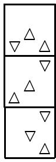

Answer: (D) 

## Question 16

The following are the number of triangles. 

<table><tr><td>Type of Triangle</td><td>1-part</td><td>4-part</td><td>9-part</td></tr><tr><td>Example</td><td>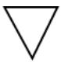</td><td>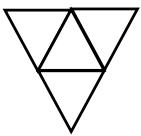</td><td>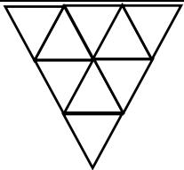</td></tr><tr><td>Quantity</td><td>19</td><td>10</td><td>3</td></tr></table>

Total = 19 + 10 + 3 = ???? triangles. 

Answer: 32 

## Question 17

Observe the following pattern: 

$$
\frac {1}{2} + \frac {1}{4} = \frac {3}{4}
$$

$$
\frac {3}{4} + \frac {1}{8} = \frac {7}{8}
$$

$$
\frac {7}{8} + \frac {1}{1 6} = \frac {1 5}{1 6}
$$

$$
\frac {1 5}{1 6} + \frac {1}{3 2} = \frac {3 1}{3 2}
$$

Note that the numerator is always 1 less than the denominator in every addition. 

Thus, 

$$
\frac {1}{2} + \frac {1}{4} + \frac {1}{8} + \dots + \frac {1}{1 2 8} = \frac {\mathbf {1 2 7}}{1 2 8}
$$

Answer: 127 

## Question 18

The percentage decrease from September to October is 

$$
\frac {3 0 0 - 2 4 0}{3 0 0} \times 1 0 0 = 20 \%.
$$

The amount of usage time in November is 240 × (100% − 20%) = 192. 

The amount of usage time in December is 192 × 80% = 153.6. 

The total amount of usage time is 300 + 240 + 192 + 153.6 = 885.6. Rounding off to the nearest whole number, we get 886. 

Answer: 886 

## Question 19

The pattern is as follows: 

31 days in January (the first month of an ordinary year), 28 days in February (the second month of an ordinary year), 31 days in March and so on. 

The missing number is 831 which represents 31 days in August. 

Answer: 831 

## Question 20

Let the number of Andrew’s, Barry’s, Cassie’s and Drake’s number of candies be A, B, C and D, respectively. Then 

$$
\begin{array}{l} A: B + C + D = 1: 3 \\ B: A + C + D = 1: 4 \\ C: A + B + D = 2: 5 \\ \end{array}
$$

The total number of units in each ratio above represent the same total number of candies. Change the ratios so that the total number of units is the same. 

$$
\begin{array}{l} A: B + C + D = 1: 3 = 3 5: 1 0 5 \\ B: A + C + D = 1: 4 = 2 8: 1 1 2 \\ C: A + B + D = 2: 5 = 4 0: 1 0 0 \\ \end{array}
$$

Thus, A = 35 units, B = 28 units, C = 40 units and D = 105 – 28 – 40 = 140 – 35 – 28 – 40 = 37 units. 

Since Drake bought 3 candies less than Cassie, 

40 units – 37 units = 3 candies 

3 units = 3 candies 

1 unit = 1 candy 

140 units = 140 candies 

Answer: 140 candies 

## Question 21

Among the 30 numbers, there are at most 10 odd numbers; otherwise, there will be 11 odd numbers with an odd number product. 

If there are exactly 10 odd numbers, then the sum of the 30 numbers is an even number as the sum of 10 odd numbers is an even number. Thus, there are at most 9 odd numbers among the 30 numbers and the least possible sum is 

$$
1 + 2 + 3 + 4 + 5 + 6 + 7 + 8 + 9 + 1 0 + 1 1 + 1 2 + 1 3 + 1 4 + 1 5 + 1 6 + 1 7 + 1 8 + 2 0
$$

$$
+ 2 2 + \dots + 4 0 + 4 2 = 5 4 3.
$$

Answer: 543 

## Question 22

Matt runs around the perimeter of the triangular track ABC which is 168 metres long. It takes him 168 metres ÷ 3 m/s = 56 seconds to complete 1 round. 

Jack runs around the perimeter of the triangular track ABD which is 168 metres long. It takes him 168 metres ÷ 7 m/s = 24 seconds to complete 1 round. 

Matt would take 56 seconds, 112 seconds, , etc. to complete 1st, 2nd, 3rd round, so on and so forth. 

Jack would take 24 seconds, 48 seconds, 72 seconds, 96 seconds, 120 seconds, 144 seconds, , etc. to complete 1st, 2nd, 3rd round, so on and so forth. 

After 168 seconds, they both would have completed a certain number of rounds and reached Point A at the same time. 

Answer: 168 seconds 

## Question 23

Let the intersection point of ???? and ???? be ?? and the intersection point between ???? and ???? be ??. 

$$
\begin{array}{l} A r e a (C E F) = \frac {1}{2} \times C E \times E F = \frac {1}{2} \times (C D + E D) \times E F \\ = \frac {1}{2} \times (9 + 5) \times 5 = 3 5 \\ \end{array}
$$

$$
A r e a (E C B) = \frac {1}{2} \times C E \times B C = \frac {1}{2} \times (C D + E D) \times B C
$$

$$
= \frac {1}{2} \times (9 + 5) \times 9 = 6 3
$$

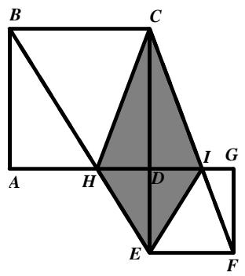

$$
A r e a (I E F) = \frac {1}{2} \times D E \times E F = \frac {1}{2} \times 5 \times 5 = \frac {2 5}{2}
$$

$$
A r e a (H C B) = \frac {1}{2} \times D C \times B C = \frac {1}{2} \times 9 \times 9 = \frac {8 1}{2}
$$

$$
\text { Area } (C H E I) = \text { Area } (C E F) + \text { Area } (E C B) - \text { Area } (I E F) - \text { Area } (H C B)
$$

$$
= 3 5 + 6 3 - \frac {2 5}{2} - \frac {8 1}{2} = 4 5
$$

Answer: 45 cm2 

## Question 24

From the thousands place, it is obvious that ?? = ?? + 1. 

In the hundreds place addition, the ones digit of ?? + ?? is ?? or the ones digit of ?? + ?? + 1 is ?? (if there is a carryover from the tens place addition). Hence, the value of ?? can only be 8 or 9. 

Case 1: ?? = 9 

In the tens place addition, there is no carryover of 1 from ones place addition otherwise ?? = 9 = ?? which is impossible. Therefore, ?? = 8 (?? + ?? = 18) and ?? = ?? − 1 = 7 which implies that there is a carryover of 1 from ones place addition. We got the contradiction, so Case 1 is impossible. 

Case 2: ?? = 8 

In the tens place addition, ?? = 6 ???? 7 (?? + ?? = 16 ???? ?? + ?? + 1 = 17) and ?? = 5 ???? 6. Hence, ?? + ?? > 10 and there is a carryover of 1 from ones place addition. We get ?? = 7 (?? + ?? + 1 = 17), ?? = 6 and ?? = 3. 

The sum O + D + A + G is equal to 8 + 7 + 5 + 3 = ????. 

Answer: 24 

## Question 25

Each “year” part of the dates contains one digit “1”. Hence there are 365 “1” digits in the “year” part of the dates. 

Make a list and count the number of digit “1” in the day and month part of the dates. 

<table><tr><td>Day</td><td>Month</td><td>Number of “1”</td></tr><tr><td>01, 10, 11, 12, ..., 19, 21, 31</td><td>01</td><td>There are fourteen “1” in the “day” part of the dates:01, 10, 11, 12, ..., 19, 21 and 31There are thirty-one “1” in “month” part of the dates.14 + 31 = 45</td></tr><tr><td>01, 10, 11, 12, ..., 19, 21</td><td>02</td><td>13</td></tr><tr><td>01, 10, 11, 12, ..., 19, 21, 31</td><td>03</td><td>14</td></tr><tr><td>01, 10, 11, 12, ..., 19, 21</td><td>04</td><td>13</td></tr><tr><td>01, 10, 11, 12, ..., 19, 21, 31</td><td>05</td><td>14</td></tr><tr><td>01, 10, 11, 12, ..., 19, 21</td><td>06</td><td>13</td></tr><tr><td>01, 10, 11, 12, ..., 19, 21, 31</td><td>07</td><td>14</td></tr><tr><td>01, 10, 11, 12, ..., 19, 21, 31</td><td>08</td><td>14</td></tr><tr><td>01, 10, 11, 12, ..., 19, 21</td><td>09</td><td>13</td></tr><tr><td>01, 10, 11, 12, ..., 19, 21, 31</td><td>10</td><td>There are fourteen “1” in the “day” part of the dates:01, 10, 11, 12, ..., 19, 21 and 31There are thirty-one “1” in the “month” part of the dates.14 + 31 = 45</td></tr><tr><td>01, 10, 11, 12, ..., 19, 21</td><td>11</td><td>There are thirteen “1” in the “day” part of the dates:01, 10, 11, 12, ..., 19, 21 and 31There are sixty “1” in the “month” part of the dates.13 + 60 = 73</td></tr><tr><td>01, 10, 11, 12, ..., 19, 21, 31</td><td>12</td><td>There are fourteen “1” in the “day” part of the dates:01, 10, 11, 12, ..., 19, 21 and 31There are thirty-one “1” in the “month” part of the dates.14 + 31 = 45</td></tr></table>

Total: $1 3 \times 4 + 1 4 \times 4 + 4 5 \times 3 + 7 3 + 3 6 5 = 6 8 1$ 

Answer: 681 

# Solutions to SASMO 2020 Primary 6 (Grade 6)

## Question 1

$$
\begin{array}{l} 2 0 2 0 \times 2 0 2 0 - 2 0 1 9 \times 2 0 2 1 = 2 0 2 0 ^ {2} - (2 0 2 0 - 1) \times (2 0 2 0 + 1) \\ = 2 0 2 0 ^ {2} - 2 0 2 0 ^ {2} + 1 = 1 \\ \end{array}
$$

Answer: (C) 

## Question 2

The pattern is as follows: 

$$
1 + 1 \times 1 = 2
$$

$$
2 + 2 \times 2 = 6
$$

$$
6 + 3 \times 3 = 1 5
$$

$$
1 5 + 4 \times 4 = 3 1
$$

$$
3 1 + 5 \times 5 = 5 6
$$

$$
5 6 + 6 \times 6 = 9 2
$$

Answer: (A) 

## Question 3

We can purchase exactly 3 × 4 = 12 nuggets, 3 × 2 + 7 = 13 nuggets and $7 \times 2 = 1 4$ nuggets. Next three numbers 15, 16 and 17 can be obtained from 12, 13 and 14 by buying one more pack of 3 nuggets. Thus, all number bigger than 11 can be purchased by buying additional packs of 3 nuggets, and the largest number of chicken nuggets that one cannot purchase is 11. 

Answer: (E) 

## Question 4

When we combined two of the semicircles, we get a full circle with a radius of $2 8 \div$ $4 = 7 ~ { \mathsf { c m } }$ . Then the area of the unshaded region is 

$$
2 \times \pi \times 7 ^ {2} = 2 \times \frac {2 2}{7} \times 7 ^ {2} = 3 0 8 c m ^ {2}.
$$

Thus, the area of the shaded regions is equal to 

$$
\text { Area } (\text { Large   Circle }) - \text { Area } (\text { unshaded   region }) =
$$

$$
= \pi \times \left(\frac {2 8}{2}\right) ^ {2} - 3 0 8 = \frac {2 2}{7} \times \left(\frac {2 8}{2}\right) ^ {2} - 3 0 8 = 6 1 6 - 3 0 8 = \mathbf {3 0 8 c m} ^ {2}.
$$

Answer: (C) 

## Question 5

The area of the floor is $2 3 \times 1 0 = 2 3 0 c m ^ { 2 } ,$ , and the area of a tile is $3 \times 7 = 2 1 c m ^ { 2 }$ Since $2 3 0 = 2 1 \times 1 0 + 2 0$ , the greatest number of tiles James can put on the floor is 10. The figure below is an example of an arrangement of 10 tiles. 

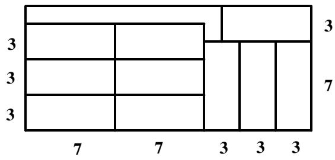

Answer: (A) 

## Question 6

Let the number of students who answered C be 4 units. 

The total number of Primary 6 students is $6 + 2 + 4 + 5 + 3 = 2 0$ units. 

Thus, the percentage of students who answered this question correctly is 

$$
\frac {4}{2 0} = \frac {2 0}{1 0 0} = 20 \%.
$$

Answer: (D) 

## Question 7

Working alone, Ryan can dig a $5 \times 5 \times 5 = 1 2 5 ~ \mathsf { m } ^ { 3 }$ hole in six hours or $\textstyle { \frac { 1 2 5 } { 6 } } \mathsf { m } ^ { 3 }$ per hour. 

Castel can dig a $1 0 \times 1 0 \times 5 = 5 0 0 \ { \mathsf { m } } ^ { 3 }$ hole in twelve hours or $\frac { 5 0 0 } { 1 2 } = \frac { 2 5 0 } { 6 } m ^ { 3 }$ per hour. 

Working together, they can dig $\begin{array} { r } { \frac { 1 2 5 } { 6 } + \frac { 2 5 0 } { 6 } = \frac { 3 7 5 } { 6 } \mathsf { m } ^ { 3 } } \end{array}$ = 375 m3 per hour. Hence they can dig a 5 × 5 × 5 = 125 m3 hole in 125 ÷ 375 $5 \times 5 \times 5 = 1 2 5 ~ \mathsf { m } ^ { 3 }$ $1 2 5 \div { \frac { 3 7 5 } { 6 } } = 2$ hours. 

Answer: (C) 

## Question 8

The five-digit number A549B must be divisible by 5 and 9 since $4 5 = 5 \times 9$ . 

From the divisibility rule of 5, we have ?? = 0 ???? 5. 

From the divisibility rule of 9, we have $A + 5 + 4 + 9 + B = A + B + 1 8$ which is divisible by 9 or ?? + ?? = 9 ???? 18. 

If ?? + ?? = 18 and ?? = 0 ???? 5, then ?? = 18 ???? 13 which is impossible since A is a digit. 

Thus, ?? + ?? = 9. 

Answer: (B) 

## Question 9

It is not option A as the second hand in option A is in between V and VI. 

It is not option B as the small circle in option B is next to V and VI. 

It is not option C as the hour hand in option C points to VI. 

It is not option E as the minute hand in option E points to II. 

The top view of option D matches with the clock. 

Answer: (D) 

## Question 10

After she ate some, the ratio of the number of chips she ate to the number of remaining chips in the pack was 3 : 5: 

<table><tr><td></td><td>The amount she ate</td><td>Remaining amount</td><td>Total</td></tr><tr><td>Ratio:</td><td>3</td><td>5</td><td>8</td></tr></table>

If she eats 50 chips more, then the new ratio will be 7 : 5: 

<table><tr><td></td><td>The amount she ate</td><td>Remaining amount</td><td>Total</td></tr><tr><td>Ratio:</td><td>7</td><td>5</td><td>12</td></tr></table>

Since the total number of chips never changes, then change the ratios in both tables so that the total number is the same, which is 48. 

<table><tr><td></td><td>The amount she ate</td><td>Remaining amount</td><td>Total</td></tr><tr><td>After 1stsentence</td><td>3 × 6 = 18</td><td>5 × 6 = 30</td><td>8 × 6 = 48</td></tr><tr><td>After 2ndsentence</td><td>7 × 4 = 28</td><td>5 × 4 = 20</td><td>12 × 4 = 48</td></tr></table>

Since she ate 50 chips in the second sentence, then 28 ?????????? − 18 ?????????? = 10 ?????????? = 50 ???? 1 ???????? = 5. 

The number of chips in the pack was 48 ?????????? = 48 × 5 = ??????. 

Answer: (C) 

## Question 11

Let the length of the hour hand be ??. Then the length of the minute hand is 3??. 

The distance travelled by the hour hand in 12 hours is the circumference of a circle with a radius of ??, which is $2 \times \pi \times r$ . 

Similarly, the distance travelled by the minute hand in 1 hour is $2 \times \pi \times 3 r =$ $6 \times \pi \times r$ . 

The total distance travelled in 24 hours is 

$$
\begin{array}{l} 1 0 3 6 \times \pi = 2 \times (2 \times \pi \times r) + 2 4 \times (6 \times \pi \times r) = 4 \times \pi \times r + 1 4 4 \times \pi \times r \\ = 1 4 8 \times \pi \times r \\ \end{array}
$$

Hence $1 0 3 6 = 1 4 8 \times r 0 \mathsf { r } r = 1 0 3 6 \div 1 4 8 = 7$ cm. The hour hand is 7 cm long. 

Answer: (A) 

## Question 12

$$
8! + 9! = 8! \times 1 + 8! \times 9 = 8! \times (1 + 9) = 8! \times 1 0
$$

8! contains only one pair of (2,5) in its product, hence 8! has one consecutive zero at the end and 10 × 8! has 2 consecutive zeros. 

Answer: (B) 

## Question 13

The perimeter of the shaded region in figure A is $2 \times ( 2 0 + 2 8 ) = 9 6$ 

Let the length of each of the four rectangles be ?? and its width be ??. 

In figure $8 , x + 2 y = 2 8 .$ 

The perimeter of the shaded region in figure B is 

$$
\begin{array}{l} 2 \times (2 0 - 2 y) + 2 \times (2 0 - x) + 2 \times 2 8 = 4 0 - 4 y + 4 0 - 2 x + 5 6 \\ = 1 3 6 - 2 (x + 2 y) \\ = 1 3 6 - 2 \times 2 8 = 8 0 \\ \end{array}
$$

The difference is $9 6 - 8 0 = 1 6 \ c m$ 

Answer: (D) 

## Question 14

If Hailey and Julia go to Light Primary School, then neither Asher nor Charles goes to Light Primary School. Hence Asher and Charles go to Bright Primary School, which is impossible as they are from different schools. Thus, Hailey and Julia go to Bright Primary School. 

If Lydia and Charles are Primary 6 students, then neither Julia nor Asher is a Primary 6 student. Hence Julia and Asher are Primary 4 students, which is impossible as they study at different levels. Thus, Lydia and Charles are Primary 4 students. 

Hailey, Julia, Lydia and Charles cannot be a Primary 6 student from Light Primary School School. Thus, the answer is Asher. 

Answer: (D) 

## Question 15

The angle of each division is $3 6 0 ^ { \circ } \div 1 2 = 3 0 ^ { \circ }$ 

In 1 hour: 

• the hour hand moves by 30° 

• the minute hand moves by 360° 

In 1 minute: 

the hour hand moves by $3 0 ^ { \circ } \div 6 0 =$ $0 . 5 ^ { \circ }$ 

the minute hand moves by $3 6 0 ^ { \circ } \div$ $6 0 = 6 ^ { \circ }$ 

Let us assume that ?? minutes after 9:00, the angle between the hands is 0°. 

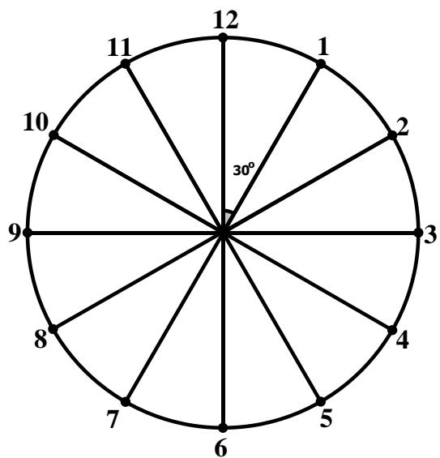

The minute hand travelled 6° × ?? = 6?? from the 12. 

The hour hand travelled $0 . 5 ^ { \circ } \times m = 0 . 5 m$ from the 9. Also, the angle between 12 and 9 is $3 0 ^ { \circ } \times 9 = 2 7 0 ^ { \circ }$ . Thus, the angle between the 12 and the tip of the hour hand is $2 7 0 ^ { \circ } + 0 . 5 m$ . 

The angle between the hands of a clock is 

$$
6 m - (2 7 0 + 0. 5 m) = 0 ^ {\circ}.
$$

Solving the equation, we get $\textstyle m = 4 9 { \frac { 1 } { 1 1 } }$ and the closest time to it is ??: ????. 

Answer: (C) 

## Question 16

$$
\begin{array}{l} \underbrace {2 \times 2 \times \dots \times 2} _ {2 0 t i m e s} \times \underbrace {3 \times 3 \dots \times 3} _ {2 4 t i m e s} = (\underbrace {2 \times 3) \times (2 \times 3) \dots \times (2 \times 3)} _ {2 0 t i m e s} \times \underbrace {3 \times 3 \dots \times 3} _ {4 t i m e s} \\ = \underbrace {6 \times 6 \times \dots \times 6} _ {\text {20 times}} \times 8 1 \\ \end{array}
$$

The last digit of $6 \times 6 \times \ldots \times 6$ is 6 and the last digit of $6 \times 6 \times . . . \times 6 \times 8 1$ is also 6. 20 ?????????? 20 ?????????? 

Answer: 6 

## Question 17

Count by types of triangle. 

<table><tr><td>Type of triangle</td><td>Quantity</td></tr><tr><td>1-part triangles</td><td>11</td></tr><tr><td>2-part triangles</td><td>12</td></tr><tr><td>3-part triangles</td><td>6</td></tr><tr><td>4-part triangles</td><td>6</td></tr><tr><td>5-part triangles</td><td>3</td></tr><tr><td>7-part triangles</td><td>4</td></tr><tr><td>Total</td><td>42</td></tr></table>

Answer: 42 

## Question 18

We can notice that 

$$
\begin{array}{l} \frac {1}{2 0 \times 2 5} = \frac {1}{5} \times \left(\frac {1}{2 0} - \frac {1}{2 5}\right), \frac {1}{2 5 \times 3 0} = \frac {1}{5} \times \left(\frac {1}{2 5} - \frac {1}{3 0}\right), \dots , \frac {1}{2 0 1 5 \times 2 0 2 0} = \\ = \frac {1}{5} \times \left(\frac {1}{2 0 1 5} - \frac {1}{2 0 2 0}\right). \\ \end{array}
$$

Hence 

$$
\begin{array}{l} \left(\frac {1}{2 0 \times 2 5} + \frac {1}{2 5 \times 3 0} + \frac {1}{3 0 \times 3 5} + \dots \frac {1}{2 0 1 5 \times 2 0 2 0}\right) \times 2 0 2 0 \\ = \left(\frac {1}{5} \times \left(\frac {1}{2 0} - \frac {1}{2 5}\right) + \frac {1}{5} \times \left(\frac {1}{2 5} - \frac {1}{3 0}\right) + \dots + \frac {1}{5} \times \left(\frac {1}{2 0 1 5} - \frac {1}{2 0 2 0}\right)\right) \times 2 0 2 0 \\ = \frac {1}{5} \times \left(\left(\frac {1}{2 0} - \frac {1}{2 5}\right) + \left(\frac {1}{2 5} - \frac {1}{3 0}\right) + \dots + \left(\frac {1}{2 0 1 5} - \frac {1}{2 0 2 0}\right)\right) \times 2 0 2 0 \\ = \frac {1}{5} \times \left(\frac {1}{2 0} - \frac {1}{2 0 2 0}\right) \times 2 0 2 0 = \mathbf {2 0} \\ \end{array}
$$

Answer: 20 

## Question 19

The number of apples in a basket is $\frac { 4 } { 5 }$ of the number of oranges: 

<table><tr><td></td><td>Oranges</td><td>Apples</td><td>Pears</td><td>Bananas</td></tr><tr><td>Ratio:</td><td>5</td><td>4</td><td></td><td></td></tr><tr><td></td><td colspan="2">or</td><td></td><td></td></tr><tr><td></td><td><eq>5 \times 2 = 10</eq></td><td><eq>4 \times 2 = 8</eq></td><td></td><td></td></tr></table>

The ratio of the number of pears to the number of apples is 3 : 8: 

<table><tr><td></td><td>Oranges</td><td>Apples</td><td>Pears</td><td>Bananas</td></tr><tr><td>Ratio:</td><td>10</td><td>8</td><td>3</td><td></td></tr></table>

The total number of fruits is $1 0 \times 5 = 5 0$ units since the number of oranges, which is 10 units, is 20% of all the fruits. Hence 

<table><tr><td></td><td>Oranges</td><td>Apples</td><td>Pears</td><td>Bananas</td></tr><tr><td>Ratio:</td><td>10</td><td>8</td><td>3</td><td>29</td></tr></table>

The number of bananas is $^ { 4 8 }$ more than the total number of apples, oranges and pears: 

$$
2 9 \text {   units   } - (1 0 + 8 + 3) \text {   units   } = 8 \text {   units   } = 4 8 \Rightarrow 1 \text {   unit   } = 6.
$$

The total number of fruits in the basket is 50 ?????????? $\mathbf { \tau } = 5 0 \times 6 = 3 0 \mathbf { 0 }$ . 

Answer: 300 

## Question 20

Let ?? be the number of pages in the book. Then 

<table><tr><td>Values</td><td>Number of values</td><td>Number of digits</td></tr><tr><td>1 to 9</td><td>9</td><td><eq>9 \times 1 = 9</eq></td></tr><tr><td>10 to 99</td><td>90</td><td><eq>90 \times 2 = 180</eq></td></tr><tr><td>100 to x</td><td>x - 99</td><td><eq>3 \times (x - 99)</eq></td></tr><tr><td>Total:</td><td>x</td><td><eq>9 + {180} + {3x} - {297} = {3x} - {108}</eq></td></tr></table>

It is given that the number of digits used to number the pages of a book is twice the number of pages, so 

$$
3 x - 1 0 8 = 2 x \Rightarrow x = \mathbf {1 0 8}.
$$

Answer: 108 

## Question 21

The burn rate of Candle A is $1 6 8 \div 2 4 = 7$ mm per hour. After two hours, the height of Candle A was $1 6 8 - 2 \times 7 = 1 5 4$ mm which was the height of Candle B as well. 

Candle B burned $\begin{array} { r } { \frac { 2 } { 1 6 } = \frac { 1 } { 8 } } \end{array}$ of its height in two hours and left with $\frac { 7 } { 8 }$ of its height which was 154 mm. 

Thus, the original height of Candle B is 154 $\div { \frac { 7 } { 8 } } = 1 5 4 \times { \frac { 8 } { 7 } } = 1 7 6$ mm. 

Answer: 176 

## Question 22

In the middle of the manual count, there are $3 8 2 - 9 0 - 4 5 - 6 9 - 7 8 = 1 0 0$ votes which are yet to be counted. 

To ensure Amelia wins the position, we consider the worst-case scenario when all remaining votes are either for Amelia, or for the candidate with the $2 ^ { \mathsf { n d } }$ highest vote count, Diana. 

In this scenario, Diana needs 12 more votes than Amelia (since Amelia is currently leading by 12 votes), from the remaining 100 votes to win, or ${ \frac { 1 0 0 + 1 2 } { 2 } } = 5 6$ votes. 

Hence Amelia needs a minimum of $9 0 + 1 0 0 - 5 6 + 1$ or 135 votes to win. 

Answer: 135 

## Question 23

Let ???? be the height of triangle ??????. 

Apply Pythagoras Theorem on triangle ??????: 

$$
A B = \sqrt {4 ^ {2} + 6 ^ {2}} = \sqrt {5 2} = 2 \sqrt {1 3}
$$

Triangles ?????? and ?????? are similar since $\angle D B E = 9 0 ^ { \circ } -$ $\angle D B A = \angle D A B$ and $\angle B D A = \angle D E B$ . Hence 

$$
\frac {D E}{D B} = \frac {D B}{A B} \Leftrightarrow \frac {D E}{4} = \frac {4}{2 \sqrt {1 3}} \Rightarrow D E = \frac {8}{\sqrt {1 3}}
$$

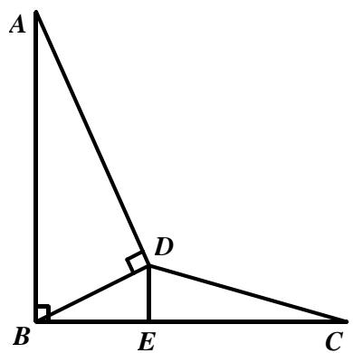

Thus, 

$$
A r e a (B D C) = \frac {D E \times B C}{2} = \frac {D E \times A B}{2} = \frac {8}{\sqrt {1 3}} \times \frac {2 \sqrt {1 3}}{2} = 8 c m ^ {2}
$$

Answer: 8 

## Question 24

$\mathsf { P } { = } 1$ , otherwise if ${ \mathsf { P } } { \geq } 2$ , then $2 \mathrm { ~ \_ ~ } \mathrm { \_ ~ } \times 9$ is a five-digit number. 

In ones place multiplication, S=9 since the ones digit of $S { \times } 9$ is 1. 

If $\scriptstyle { Q \geq 2 }$ , then $1 2 _ { -- } \times 9$ is a five-digit number. Hence $\scriptstyle { Q = 0 }$ 

In tens place multiplication, R=8 since the ones digit of $( \mathsf { R } \times 9 + 8 )$ is 0. 

Thus, the value of the 4-digit number PQRS is 1089. 

Answer: 1089 

## Question 25

We can notice that each digit appears exactly once in the tens, ones and hundreds place. 

Hence the sum of the 9 numbers can be rewritten as 

$$
\begin{array}{l} 1 + 1 0 + 1 0 0 + 2 + 2 0 + 2 0 0 + 3 + 3 0 + 3 0 0 + \dots + 9 + 9 0 + 9 0 0 \\ = 1 1 1 + 2 2 2 + 3 3 3 + \dots + 9 9 9 = 1 1 1 \times (1 + 2 + 3 + \dots + 9) = 1 1 1 \times 4 5 \\ = 4 9 9 5. \\ \end{array}
$$

Answer: 4995 