# Primary 6 (Grade 6) – GEP Practice

# 2020 Contest Problems with Full Solutions

Authors: 

Henry Ong, BSc, MBA, CMA 

Merlan Nagidulin, BSc 

© Singapore International Mastery Contests Centre (SIMCC) All Rights Reserved 

No part of this work may be reproduced or transmitted by any means, electronic or mechanical, including photocopying and recording, or by any information or retrieval system, without the prior permission of the publisher. 

## Section A (Correct answer – 2 points| No answer – 0 points| Incorrect answer – minus 1 point)

## Question 1

Find the value of the following. 

$$
2 0 2 0 \times 2 0 2 0 - 2 0 1 9 \times 2 0 2 1
$$

A. 2020 

B. 4040 

C. 1 

D. 2 

E. None of the above 

## Question 2

What is the next number in the following pattern? 

$$
1, 2, 6, 1 5, 3 1, 5 6, \dots
$$

A. 92 

B. 81 

C. 105 

D. 78 

E. None of the above 

## Question 3

In a supermarket, the chicken nuggets are only available in packs of either 3 or 7 nuggets. For example, you cannot purchase exactly 2, 5 or 8 nuggets. What is the largest number of chicken nuggets that one cannot purchase? 

A. 231 

B. 721 

C. 23 

D. 13 

E. None of the above 

## Question 4

In the diagram, the unshaded area is made of 4 semicircles touching at the centre of the large circle. If the diameter of the large circle is 28 cm, find the area of the shaded region. (Use $\begin{array} { r } { \pi = \frac { 2 2 } { 7 } ) } \end{array}$ 

A. $6 1 6 \ \mathsf { c m } ^ { 2 }$ 

B. $4 6 2 \ c m ^ { 2 }$ 

C. $3 0 8 \ c m ^ { 2 }$ 

D. $1 5 4 \mathsf { c m } ^ { 2 }$ 

E. None of the above 

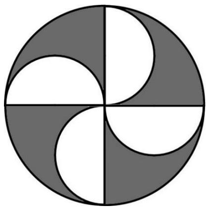

## Question 5

James has tiles of size 3 cm × 7 cm. He wants to put them on the floor of size 23 $\mathsf { c m } \times 1 0$ cm. What is the largest number of tiles that he can put without overlapping or breaking of any tiles? 

A. 10 

B. 9 

C. 8 

D. 7 

E. None of the above 

## Question 6

The following bar chart shows the responses made by SASMO Primary 6 students in a multiple-choice question. All the horizontal lines are equally spaced. Each student selected one of the possible choices and the correct answer is C. Find the percentage of students who answered this question correctly. 

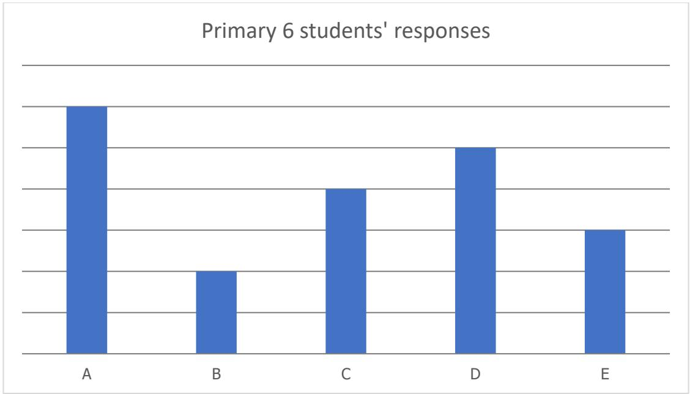

A. 25% 

B. 16% 

C. 24% 

D. 20% 

E. None of the above 

## Question 7

Working alone, Ryan can dig a 5 m by 5 m by 5 m hole in six hours. Castel can dig a 10 m by 10 m by 5 m hole in twelve hours. How many hours would it take them to dig a 5 m by 5 m by 5 m hole if they worked together? 

A. 4 

B. 1 

C. 2 

D. 3 

E. None of the above 

## Question 8

The five-digit number A549B is divisible by 45. Find the value of A + B. 

A. 0 

B. 9 

C. 18 

D. 27 

E. None of the above 

## Question 9

Which cube below has a top view same as the clock on the right? 

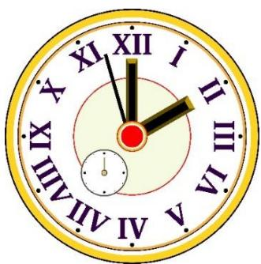

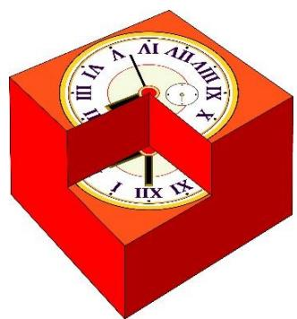

A

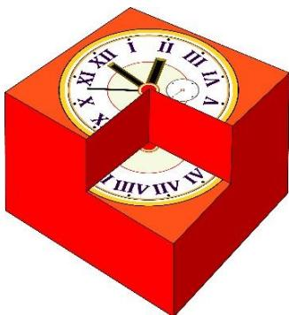

B

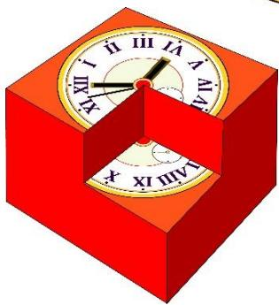

C

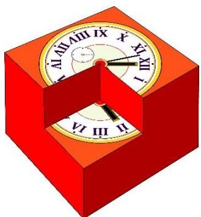

D

E

## Question 10

Stacy bought a pack of M&M chips. After she ate some, the ratio of the number of chips she ate to the number of remaining chips in the pack was 3 : 5. If she eats 50 chips more, then the new ratio will be 7 : 5. How many M&M chips were there in the pack when Stacy bought it? 

A. 10 

B. 150 

C. 240 

D. 140 

E. None of the above 

## Question 11

The minute hand of a certain clock is 3 times as long as the hour hand. In 24 hours, the tips of hour and minute hands travelled 1036 × ?? cm in total. How long is the hour hand of the clock? (Use $\begin{array} { r } { \pi = { \frac { 2 2 } { 7 } } ) } \end{array}$ 

A. 7 cm 

B. 21 cm 

C. 14 cm 

D. 7.5 cm 

E. None of the above 

## Question 12

In Mathematics, the product of the first ?? positive integers is written as ??! = 

$n \times ( n - 1 ) \times \ldots \times 1$ . For example, $2 ! = 2 \times 1$ and $7 ! = 7 \times 6 \times 5 \times 4 \times 3 \times 2 \times 1$ . How 

many consecutive digit "0"s at the end of 8! + 9! are there? 

A. 0 

B. 2 

C. 1 

D. 3 

E. None of the above 

## Question 13

Four identical rectangles are placed side by side on a 28 cm by 20 cm rectangular piece of paper in 2 different ways as shown in Figures A and B. What is the difference in the perimeters of the shaded regions of Figure A and B? 

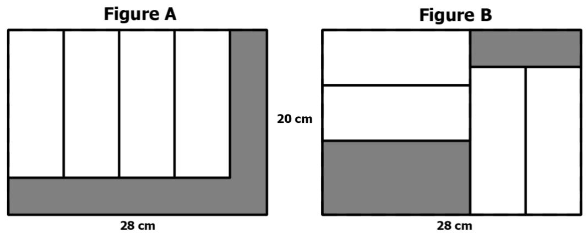

A. 96 cm 

B. 80 cm 

C. 32 cm 

D. 16 cm 

E. None of the above 

## Question 14

Hailey, Lydia, Julia, Asher and Charles are Primary 4 or 6 students. They study in either Bright Primary School or Light Primary School. 

• Lydia and Charles are from the same grade. 

• Julia and Asher study at different levels. 

• Three students study in Primary 4 and the other two students in Primary 6. 

• Asher and Charles are from different schools. 

• Hailey and Julia go to the same school. 

• Three students go to Bright Primary School and the other two are from Light Primary School. 

If one of them is Primary 6 student from Light Primary School, who is that person? 

A. Hailey 

B. Lydia 

C. Julia 

D. Asher 

E. Charles 

## Question 15

In which of the following times is the hour hand closest to the minute hand of a clock? 

A. 9:47 

B. 9:48 

C. 9:49 

D. 9:50 

E. 9:51 

## Section B (Correct answer – 4 points| Incorrect or No answer – 0 points)

When an answer is a 1-digit number, shade “0” for the tens, hundreds and thousands place. 

Example: if the answer is 7, then shade 0007 

When an answer is a 2-digit number, shade “0” for the hundreds and thousands place. 

Example: if the answer is 23, then shade 0023 

When an answer is a 3-digit number, shade “0” for the thousands place. 

Example: if the answer is 785, then shade 0785 

When an answer is a 4-digit number, shade as it is. 

Example: if the answer is 4196, then shade 4196 

## Question 16

Find the last digit of the following product. 

$$
\underbrace {2 \times 2 \times \ldots \times 2} _ {\text {20 times}} \times \underbrace {3 \times 3 \ldots \times 3} _ {\text {24 times}}
$$

## Question 17

How many triangles are there in the figure below? 

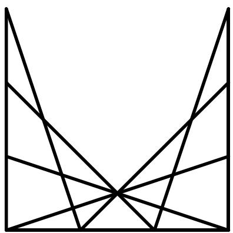

## Question 18

Find the value of the following. 

$$
\left(\frac {1}{2 0 \times 2 5} + \frac {1}{2 5 \times 3 0} + \frac {1}{3 0 \times 3 5} + \dots \frac {1}{2 0 1 5 \times 2 0 2 0}\right) \times 2 0 2 0
$$

## Question 19

The number of apples in a basket is $\frac { 4 } { 5 }$ of the number of oranges. The ratio of the number of pears to the number of apples is 3 : 8. The rest of the fruits are bananas and 20% of all the fruits in the baskets are oranges. The number of bananas is 48 more than the total number of apples, oranges and pears. How many fruits are there in the basket? 

## Question 20

The number of digits used to number the pages of a book is twice the number of pages of the book. If the number of pages of the book is a three-digit number, how many pages does the book have? 

## Question 21

The diameter of Candle A is longer than that of Candle B. Candle A can burn for 24 hours, while Candle B can burn for 16 hours. Both were lit at the same time and had the same height two hours later. If the original height of Candle A is 168 mm, what is the original height (in mm) of Candle B? 

## Question 22

An election for the school president position consists of 4 candidates: Amelia, Brad, Chris and Diana. There are 382 voters. In the middle of the manual count, Amelia got 90 votes, Brad got 45 votes, Chris got 69 votes, and Diana got 78 votes. What is the smallest number of votes that Amelia needs to get in order to ensure that she wins the position? 

## Question 23

In the diagram, $\angle A B C = \angle A D B = 9 0 ^ { \circ } , A B = B C ,$ , ???? = 4 cm and ???? = 6 cm. Find the area (in cm2) of triangle ??????. 

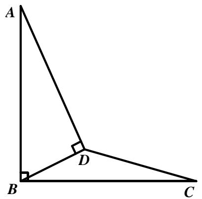

## Question 24

In the following cryptarithm, all the different letters stand for different digits. 

<table><tr><td></td><td>P</td><td>Q</td><td>R</td><td>S</td></tr><tr><td>x</td><td></td><td></td><td></td><td>9</td></tr><tr><td></td><td>S</td><td>R</td><td>Q</td><td>P</td></tr></table>

Find the value of the 4-digit number PQRS. 

## Question 25

Jason randomly placed digits 1, 2, 3, …, 9 around a circle. When he read three consecutive digits in clockwise order, he got a three-digit whole number. If there are 9 such three-digit numbers, find the sum of the 9 numbers. 

# Solutions to SASMO 2020 Primary 6 (Grade 6)

## Question 1

$$
\begin{array}{l} 2 0 2 0 \times 2 0 2 0 - 2 0 1 9 \times 2 0 2 1 = 2 0 2 0 ^ {2} - (2 0 2 0 - 1) \times (2 0 2 0 + 1) \\ = 2 0 2 0 ^ {2} - 2 0 2 0 ^ {2} + 1 = 1 \\ \end{array}
$$

Answer: (C) 

## Question 2

The pattern is as follows: 

$$
\begin{array}{l} 1 + 1 \times 1 = 2 \\ 2 + 2 \times 2 = 6 \\ 6 + 3 \times 3 = 1 5 \\ 1 5 + 4 \times 4 = 3 1 \\ 3 1 + 5 \times 5 = 5 6 \\ 5 6 + 6 \times 6 = 9 2 \\ \end{array}
$$

Answer: (A) 

## Question 3

We can purchase exactly 3 × 4 = 12 nuggets, 3 × 2 + 7 = 13 nuggets and $7 \times 2 = 1 4$ nuggets. Next three numbers 15, 16 and 17 can be obtained from 12, 13 and 14 by buying one more pack of 3 nuggets. Thus, all number bigger than 11 can be purchased by buying additional packs of 3 nuggets, and the largest number of chicken nuggets that one cannot purchase is 11. 

Answer: (E) 

## Question 4

When we combined two of the semicircles, we get a full circle with a radius of $2 8 \div$ $4 = 7 ~ { \mathsf { c m } }$ . Then the area of the unshaded region is 

$$
2 \times \pi \times 7 ^ {2} = 2 \times \frac {2 2}{7} \times 7 ^ {2} = 3 0 8 c m ^ {2}.
$$

Thus, the area of the shaded regions is equal to 

$$
A r e a (L a r g e C i r c l e) - A r e a (u n s h a d e d r e g i o n) =
$$

$$
= \pi \times \left(\frac {2 8}{2}\right) ^ {2} - 3 0 8 = \frac {2 2}{7} \times \left(\frac {2 8}{2}\right) ^ {2} - 3 0 8 = 6 1 6 - 3 0 8 = 3 0 8 c m ^ {2}.
$$

Answer: (C) 

## Question 5

The area of the floor is $2 3 \times 1 0 = 2 3 0 c m ^ { 2 } ,$ , and the area of a tile is $3 \times 7 = 2 1 c m ^ { 2 }$ . Since $2 3 0 = 2 1 \times 1 0 + 2 0$ , the greatest number of tiles James can put on the floor is 10. The figure below is an example of an arrangement of 10 tiles. 

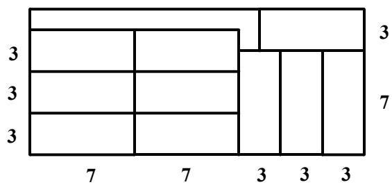

Answer: (A) 

## Question 6

Let the number of students who answered C be 4 units. 

The total number of Primary 6 students is $6 + 2 + 4 + 5 + 3 = 2 0$ units. 

Thus, the percentage of students who answered this question correctly is 

$$
\frac {4}{2 0} = \frac {2 0}{1 0 0} = 20 \%.
$$

Answer: (D) 

## Question 7

Working alone, Ryan can dig a $5 \times 5 \times 5 = 1 2 5 ~ \mathsf { m } ^ { 3 }$ hole in six hours or $\textstyle { \frac { 1 2 5 } { 6 } } \mathsf { m } ^ { 3 }$ per hour. 

$1 0 \times 1 0 \times 5 = 5 0 0 \ { \mathsf { m } } ^ { 3 }$ $\textstyle { \frac { 5 0 0 } { 1 2 } } = { \frac { 2 5 0 } { 6 } } \mathsf { m } ^ { 3 }$ 

Working together, they can dig $\begin{array} { r } { \frac { 1 2 5 } { 6 } + \frac { 2 5 0 } { 6 } = \frac { 3 7 5 } { 6 } \mathsf { m } ^ { 3 } } \end{array}$ per hour. Hence they can dig a $5 \times 5 \times 5 = 1 2 5 ~ \mathsf { m } ^ { 3 }$ hole in $1 2 5 \div { \frac { 3 7 5 } { 6 } } = 2$ hours. 

Answer: (C) 

## Question 8

The five-digit number A549B must be divisible by 5 and 9 since $4 5 = 5 \times 9$ . 

From the divisibility rule of 5, we have ?? = 0 ???? 5. 

From the divisibility rule of 9, we have $A + 5 + 4 + 9 + B = A + B + 1 8$ which is divisible by 9 or ?? + ?? = 9 ???? 18. 

If ?? + ?? = 18 and ?? = 0 ???? 5, then ?? = 18 ???? 13 which is impossible since A is a digit. 

Thus, ?? + ?? = 9. 

Answer: (B) 

## Question 9

It is not option A as the second hand in option A is in between V and VI. 

It is not option B as the small circle in option B is next to V and VI. 

It is not option C as the hour hand in option C points to VI. 

It is not option E as the minute hand in option E points to II. 

The top view of option D matches with the clock. 

Answer: (D) 

## Question 10

After she ate some, the ratio of the number of chips she ate to the number of remaining chips in the pack was 3 : 5: 

<table><tr><td></td><td>The amount she ate</td><td>Remaining amount</td><td>Total</td></tr><tr><td>Ratio:</td><td>3</td><td>5</td><td>8</td></tr></table>

If she eats 50 chips more, then the new ratio will be 7 : 5: 

<table><tr><td></td><td>The amount she ate</td><td>Remaining amount</td><td>Total</td></tr><tr><td>Ratio:</td><td>7</td><td>5</td><td>12</td></tr></table>

Since the total number of chips never changes, then change the ratios in both tables so that the total number is the same, which is 48. 

<table><tr><td></td><td>The amount she ate</td><td>Remaining amount</td><td>Total</td></tr><tr><td>After 1stsentence</td><td>3 × 6 = 18</td><td>5 × 6 = 30</td><td>8 × 6 = 48</td></tr><tr><td>After 2ndsentence</td><td>7 × 4 = 28</td><td>5 × 4 = 20</td><td>12 × 4 = 48</td></tr></table>

Since she ate 50 chips in the second sentence, then 28 ?????????? − 18 ?????????? = 10 ?????????? = 50 ???? 1 ???????? = 5. 

The number of chips in the pack was 48 ?????????? = 48 × 5 = ??????. 

Answer: (C) 

## Question 11

Let the length of the hour hand be ??. Then the length of the minute hand is 3??. 

The distance travelled by the hour hand in 12 hours is the circumference of a circle with a radius of ??, which is $2 \times \pi \times r$ . 

Similarly, the distance travelled by the minute hand in 1 hour is $2 \times \pi \times 3 r =$ $6 \times \pi \times r$ . 

The total distance travelled in 24 hours is 

$$
\begin{array}{l} 1 0 3 6 \times \pi = 2 \times (2 \times \pi \times r) + 2 4 \times (6 \times \pi \times r) = 4 \times \pi \times r + 1 4 4 \times \pi \times r \\ = 1 4 8 \times \pi \times r \\ \end{array}
$$

Hence $1 0 3 6 = 1 4 8 \times r 0 \mathsf { r } r = 1 0 3 6 \div 1 4 8 = 7$ cm. The hour hand is 7 cm long. 

Answer: (A) 

## Question 12

$$
8! + 9! = 8! \times 1 + 8! \times 9 = 8! \times (1 + 9) = 8! \times 1 0
$$

8! contains only one pair of (2,5) in its product, hence 8! has one consecutive zero at the end and 10 × 8! has 2 consecutive zeros. 

Answer: (B) 

## Question 13

The perimeter of the shaded region in figure A is $2 \times ( 2 0 + 2 8 ) = 9 6$ 

Let the length of each of the four rectangles be ?? and its width be ??. 

In figure $8 , x + 2 y = 2 8 .$ 

The perimeter of the shaded region in figure B is 

$$
\begin{array}{l} 2 \times (2 0 - 2 y) + 2 \times (2 0 - x) + 2 \times 2 8 = 4 0 - 4 y + 4 0 - 2 x + 5 6 \\ = 1 3 6 - 2 (x + 2 y) \\ = 1 3 6 - 2 \times 2 8 = 8 0 \\ \end{array}
$$

The difference is $9 6 - 8 0 = 1 6 \ c m$ 

Answer: (D) 

## Question 14

If Hailey and Julia go to Light Primary School, then neither Asher nor Charles goes to Light Primary School. Hence Asher and Charles go to Bright Primary School, which is impossible as they are from different schools. Thus, Hailey and Julia go to Bright Primary School. 

If Lydia and Charles are Primary 6 students, then neither Julia nor Asher is a Primary 6 student. Hence Julia and Asher are Primary 4 students, which is impossible as they study at different levels. Thus, Lydia and Charles are Primary 4 students. 

Hailey, Julia, Lydia and Charles cannot be a Primary 6 student from Light Primary School School. Thus, the answer is Asher. 

Answer: (D) 

## Question 15

The angle of each division is $3 6 0 ^ { \circ } \div 1 2 = 3 0 ^ { \circ }$ 

In 1 hour: 

• the hour hand moves by 30° 

• the minute hand moves by 360° 

In 1 minute: 

the hour hand moves by $3 0 ^ { \circ } \div 6 0 =$ $0 . 5 ^ { \circ }$ 

the minute hand moves by $3 6 0 ^ { \circ } \div$ $6 0 = 6 ^ { \circ }$ 

Let us assume that ?? minutes after 9:00, the angle between the hands is 0°. 

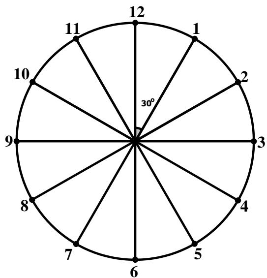

The minute hand travelled 6° × ?? = 6?? from the 12. 

The hour hand travelled $0 . 5 ^ { \circ } \times m = 0 . 5 m$ from the 9. Also, the angle between 12 and 9 is $3 0 ^ { \circ } \times 9 = 2 7 0 ^ { \circ }$ . Thus, the angle between the 12 and the tip of the hour hand is $2 7 0 ^ { \circ } + 0 . 5 m$ . 

The angle between the hands of a clock is 

$$
6 m - (2 7 0 + 0. 5 m) = 0 ^ {\circ}.
$$

Solving the equation, we get $\textstyle m = 4 9 { \frac { 1 } { 1 1 } }$ and the closest time to it is ??: ????. 

Answer: (C) 

## Question 16

$$
\begin{array}{l} \underbrace {2 \times 2 \times \dots \times 2} _ {2 0 t i m e s} \times \underbrace {3 \times 3 \dots \times 3} _ {2 4 t i m e s} = (\underbrace {2 \times 3) \times (2 \times 3) \dots \times (2 \times 3)} _ {2 0 t i m e s} \times \underbrace {3 \times 3 \dots \times 3} _ {4 t i m e s} \\ = \underbrace {6 \times 6 \times \ldots \times 6} _ {\text {20 times}} \times 8 1 \\ \end{array}
$$

The last digit of $6 \times 6 \times \ldots \times 6$ is 6 and the last digit of $6 \times 6 \times . . . \times 6 \times 8 1$ is also 6. 20 ?????????? 20 ?????????? 

Answer: 6 

## Question 17

Count by types of triangle. 

<table><tr><td>Type of triangle</td><td>Quantity</td></tr><tr><td>1-part triangles</td><td>11</td></tr><tr><td>2-part triangles</td><td>12</td></tr><tr><td>3-part triangles</td><td>6</td></tr><tr><td>4-part triangles</td><td>6</td></tr><tr><td>5-part triangles</td><td>3</td></tr><tr><td>7-part triangles</td><td>4</td></tr><tr><td>Total</td><td>42</td></tr></table>

Answer: 42 

## Question 18

We can notice that 

$$
\begin{array}{l} \frac {1}{2 0 \times 2 5} = \frac {1}{5} \times \left(\frac {1}{2 0} - \frac {1}{2 5}\right), \frac {1}{2 5 \times 3 0} = \frac {1}{5} \times \left(\frac {1}{2 5} - \frac {1}{3 0}\right), \dots , \frac {1}{2 0 1 5 \times 2 0 2 0} = \\ = \frac {1}{5} \times \left(\frac {1}{2 0 1 5} - \frac {1}{2 0 2 0}\right). \\ \end{array}
$$

Hence 

$$
\begin{array}{l} \left(\frac {1}{2 0 \times 2 5} + \frac {1}{2 5 \times 3 0} + \frac {1}{3 0 \times 3 5} + \dots \frac {1}{2 0 1 5 \times 2 0 2 0}\right) \times 2 0 2 0 \\ = \left(\frac {1}{5} \times \left(\frac {1}{2 0} - \frac {1}{2 5}\right) + \frac {1}{5} \times \left(\frac {1}{2 5} - \frac {1}{3 0}\right) + \dots + \frac {1}{5} \times \left(\frac {1}{2 0 1 5} - \frac {1}{2 0 2 0}\right)\right) \times 2 0 2 0 \\ = \frac {1}{5} \times \left(\left(\frac {1}{2 0} - \frac {1}{2 5}\right) + \left(\frac {1}{2 5} - \frac {1}{3 0}\right) + \dots + \left(\frac {1}{2 0 1 5} - \frac {1}{2 0 2 0}\right)\right) \times 2 0 2 0 \\ = \frac {1}{5} \times \left(\frac {1}{2 0} - \frac {1}{2 0 2 0}\right) \times 2 0 2 0 = \mathbf {2 0} \\ \end{array}
$$

Answer: 20 

## Question 19

The number of apples in a basket is $\frac { 4 } { 5 }$ of the number of oranges: 

<table><tr><td></td><td>Oranges</td><td>Apples</td><td>Pears</td><td>Bananas</td></tr><tr><td>Ratio:</td><td>5</td><td>4</td><td></td><td></td></tr><tr><td></td><td colspan="2">or</td><td></td><td></td></tr><tr><td></td><td><eq>5 \times 2 = 10</eq></td><td><eq>4 \times 2 = 8</eq></td><td></td><td></td></tr></table>

The ratio of the number of pears to the number of apples is 3 : 8: 

<table><tr><td></td><td>Oranges</td><td>Apples</td><td>Pears</td><td>Bananas</td></tr><tr><td>Ratio:</td><td>10</td><td>8</td><td>3</td><td></td></tr></table>

The total number of fruits is 10 × 5 = 50 units since the number of oranges, which is 10 units, is 20% of all the fruits. Hence 

<table><tr><td></td><td>Oranges</td><td>Apples</td><td>Pears</td><td>Bananas</td></tr><tr><td>Ratio:</td><td>10</td><td>8</td><td>3</td><td>29</td></tr></table>

The number of bananas is 48 more than the total number of apples, oranges and pears: 

$$
2 9 \text {   units   } - (1 0 + 8 + 3) \text {   units   } = 8 \text {   units   } = 4 8 \Rightarrow 1 \text {   unit   } = 6.
$$

The total number of fruits in the basket is 50 ?????????? = 50 × 6 = ??????. 

Answer: 300 

## Question 20

Let ?? be the number of pages in the book. Then 

<table><tr><td>Values</td><td>Number of values</td><td>Number of digits</td></tr><tr><td>1 to 9</td><td>9</td><td><eq>9 \times 1 = 9</eq></td></tr><tr><td>10 to 99</td><td>90</td><td><eq>90 \times 2 = 180</eq></td></tr><tr><td>100 to x</td><td>x - 99</td><td><eq>3 \times (x - 99)</eq></td></tr><tr><td>Total:</td><td>x</td><td><eq>9 + {180} + {3x} - {297} = {3x} - {108}</eq></td></tr></table>

It is given that the number of digits used to number the pages of a book is twice the number of pages, so 

$$
3 x - 1 0 8 = 2 x \Rightarrow x = \mathbf {1 0 8}.
$$

Answer: 108 

## Question 21

The burn rate of Candle A is $1 6 8 \div 2 4 = 7$ mm per hour. After two hours, the height of Candle A was $1 6 8 - 2 \times 7 = 1 5 4$ mm which was the height of Candle B as well. 

Candle B burned $\begin{array} { r } { \frac { 2 } { 1 6 } = \frac { 1 } { 8 } } \end{array}$ of its height in two hours and left with $\frac { 7 } { 8 }$ of its height which was 154 mm. 

Thus, the original height of Candle B is 154 $\div { \frac { 7 } { 8 } } = 1 5 4 \times { \frac { 8 } { 7 } } = 1 7 6$ mm. 

Answer: 176 

## Question 22

In the middle of the manual count, there are $3 8 2 - 9 0 - 4 5 - 6 9 - 7 8 = 1 0 0$ votes which are yet to be counted. 

To ensure Amelia wins the position, we consider the worst-case scenario when all remaining votes are either for Amelia, or for the candidate with the $2 ^ { \mathsf { n d } }$ highest vote count, Diana. 

In this scenario, Diana needs 12 more votes than Amelia (since Amelia is currently leading by 12 votes), from the remaining 100 votes to win, or 100+12 = 56 votes. ${ \frac { 1 0 0 + 1 2 } { 2 } } = 5 6$ 

Hence Amelia needs a minimum of $9 0 + 1 0 0 - 5 6 + 1$ or 135 votes to win. 

Answer: 135 

## Question 23

Let ???? be the height of triangle ??????. 

Apply Pythagoras Theorem on triangle ??????: 

$$
A B = \sqrt {4 ^ {2} + 6 ^ {2}} = \sqrt {5 2} = 2 \sqrt {1 3}
$$

Triangles ?????? and ?????? are similar since $\angle D B E = 9 0 ^ { \circ }$ − $\angle D B A = \angle D A B$ and $\angle B D A = \angle D E B$ . Hence 

$$
\frac {D E}{D B} = \frac {D B}{A B} \Leftrightarrow \frac {D E}{4} = \frac {4}{2 \sqrt {1 3}} \Rightarrow D E = \frac {8}{\sqrt {1 3}}
$$

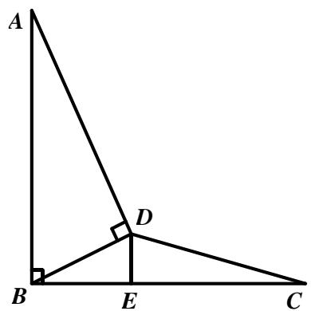

Thus, 

$$
A r e a (B D C) = \frac {D E \times B C}{2} = \frac {D E \times A B}{2} = \frac {8}{\sqrt {1 3}} \times \frac {2 \sqrt {1 3}}{2} = 8 c m ^ {2}
$$

Answer: 8 

## Question 24

$\mathsf { P } { = } 1$ , otherwise if $\mathsf { P } { \geq } 2$ , then $2 \mathrm { ~ -- ~ } \mathrm { \ x { \times } ~ } 9$ is a five-digit number. 

In ones place multiplication, S=9 since the ones digit of $S { \times } 9$ is 1. 

If $\scriptstyle { Q \geq 2 }$ , then $1 2 _ { -- } \times 9$ is a five-digit number. Hence $\scriptstyle { Q = 0 }$ 

In tens place multiplication, R=8 since the ones digit of $( \mathsf { R } \times 9 + 8 )$ is 0. 

Thus, the value of the 4-digit number PQRS is 1089. 

Answer: 1089 

## Question 25

We can notice that each digit appears exactly once in the tens, ones and hundreds place. 

Hence the sum of the 9 numbers can be rewritten as 

$$
\begin{array}{l} 1 + 1 0 + 1 0 0 + 2 + 2 0 + 2 0 0 + 3 + 3 0 + 3 0 0 + \dots + 9 + 9 0 + 9 0 0 \\ = 1 1 1 + 2 2 2 + 3 3 3 + \dots + 9 9 9 = 1 1 1 \times (1 + 2 + 3 + \dots + 9) = 1 1 1 \times 4 5 \\ = 4 9 9 5. \\ \end{array}
$$

Answer: 4995 