## PAPER

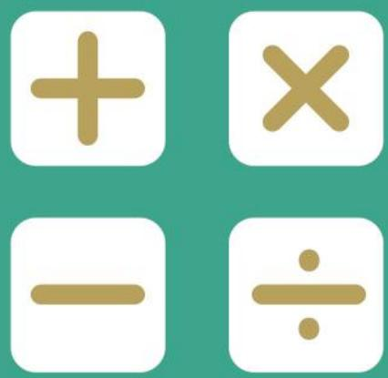

## SEAMO X

SoutheastAsianMathematical Olympiad Extended Round 

## DO NOT OPEN THIS BOOKLET UNTIL INSTRUCTED.

## STUDENT'SNAME:

Read the instructions on theAnswer sheetand fillin your CANDIDATENUMBERand Otherdetails. 

Usea2BorBpencil oraBLAcKorBLUEpen. 

Ruboutorstrike offanymistakes. 

Correction tape or liquid paper isNoT ALLowED. 

You MUsTrecord your answers on the ANsweR SHEET. 

## LOWER PRIMARY

Nomarksareawarded forquestions leftBLANK. 

MarkswillNoTbedeductedfor incorrect answers. 

You must answer ALL PARTsof the question correctly. 

INCOMPLETEquestionsare considered incorrect. 

QUESTIONS1TO10 

Eachcorrectanswerisawarded FoURMARKS. 

QUESTIONS 11 TO 20 

Eachcorrectanswer isawarded SixMARKs. 

YouareNot allowed touseacalculator. 

## Section A

For questions 1 to 10, each correct answer is awarded 4 marks. 

1. Evaluate 

$$
1 3 + 1 4 + 1 5 + 1 6 + 1 7 + 1 8 + 1 9 + 2 0
$$

2. Find the missing sum. 

$$
\odot + \odot + \odot + \odot + \Delta = 3 6
$$

$$
\Delta + \Delta = \odot + \odot + \odot + \odot
$$

$$
ⓞ + \Delta = ?
$$

3. Find the missing number. 

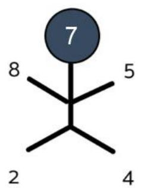

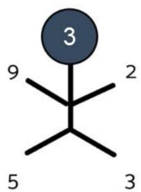

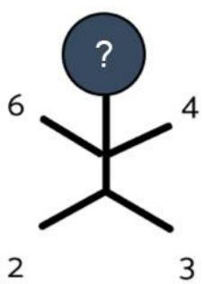

4. How many rectangles are there in the figure below? 

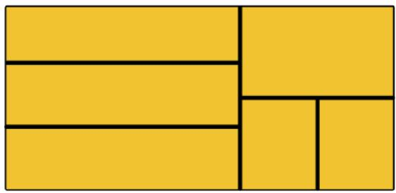

5. Find the value of 1 in the number sequence given below. 

1, 1, 2, 4, 7, 13, 24, 44, 1, 149, 274 … 

6. Draw the $1 7 ^ { \mathrm { t h } }$ shape in the geometric pattern shown below. 

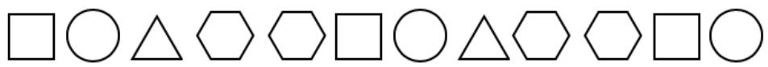

7. In a football tournament, there were seven participating teams. Each team would have to play against every other team exactly once. How many games were played altogether? 

8. How many cubes are there in the figure given below? 

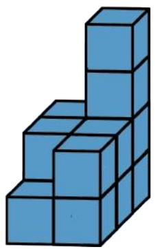

9. There are 12 students standing in a line. The distance between every 2 students is the same. Given that the length of the line is 22 metres, what is the distance between any 2 students? 

## 10.Given that

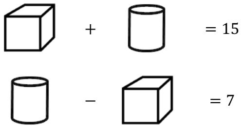

What is the value of 

## Section B

For questions 11 to 20, each correct answer is awarded 6 marks. 

11. A family of six is having dinner. Each person has a bowl of rice. Every two persons share a bowl of vegetables. Every three persons share a bowl of soup. How many bowls are there in total? 

12.Alan, Ben, Cathy and Dan are standing in a queue. 

Alan: “There is one person in front of me.” 

Ben: “There is one person behind me.” 

Cathy: “There is nobody behind me.” 

Who is first in the queue? 

13.The diagram below shows two perfectly balanced scales. 

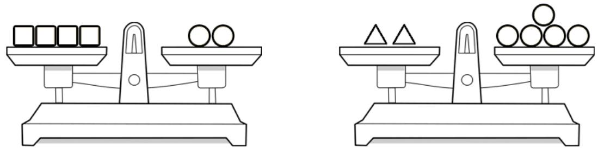

How many is/are needed to balance one ? 

14. What is the value of B in the cryptarithm below? 

<table><tr><td></td><td>A</td><td>A</td></tr><tr><td></td><td>B</td><td>B</td></tr><tr><td>+</td><td>C</td><td>C</td></tr><tr><td>A</td><td>B</td><td>C</td></tr></table>

15.Find the missing number. 

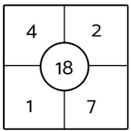

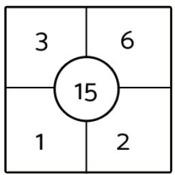

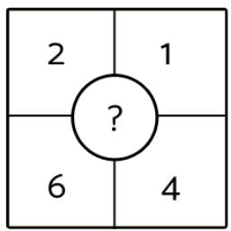

16. When Alan is 6 years old, his Dad is 33 years old. How old will Alan be when his Dad’s age is 4 times his age? 

17. In which figure are there 32 circles? 

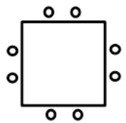

Fig 1

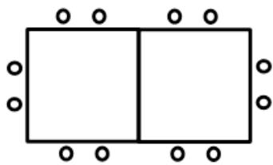

Fig2

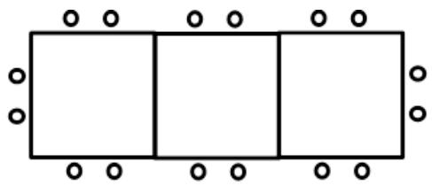

Fig3

18.Given that 

$$
7 + 9 + 9 + 9 = 3 4
$$

and 

$$
8 + 8 + 9 + 9 = 3 4
$$

How many 4-digit numbers are there whose digits add up to 34? 

19. What is the missing figure? 

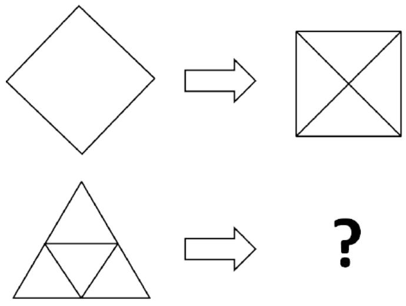

(A)

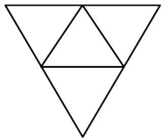

(B)

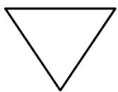

(C)

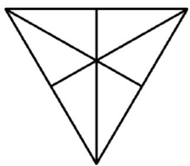

(D)

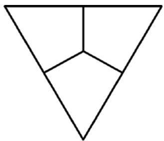

20.Cindy wrote the following number sequence on a piece of paper 

1, 2, 3, 4, 5, … , 55, 56 

How many times altogether did she write the digit ‘5’? 

# SEAMO X 2020

## Paper A – Answers

## Section A

Questions 1 to 10 carry 4 marks each. 

<table><tr><td>Q1</td><td>Q2</td><td>Q3</td><td>Q4</td><td>Q5</td></tr><tr><td>132</td><td>18</td><td>5</td><td>12</td><td>81</td></tr></table>

<table><tr><td>Q6</td><td>Q7</td><td>Q8</td><td>Q9</td><td>Q10</td></tr><tr><td>◯</td><td>21</td><td>13</td><td>2</td><td>4</td></tr></table>

## Section B

Questions 11 to 20 carry 6 marks each. 

<table><tr><td>Q11</td><td>Q12</td><td>Q13</td><td>Q14</td><td>Q15</td></tr><tr><td>11</td><td>Dan</td><td>5</td><td>9</td><td>16</td></tr></table>

<table><tr><td>Q16</td><td>Q17</td><td>Q18</td><td>Q19</td><td>Q20</td></tr><tr><td>9</td><td>Fig. 7</td><td>10</td><td>B</td><td>13</td></tr></table>