## Section A

For questions 1 to 10, each correct answer is awarded 4 marks. 

1. Study the number pattern carefully. Find the value represented by $" A "$ . [Hint: Find the value of ?? first] 

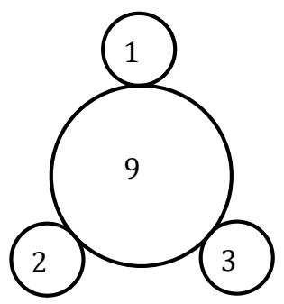

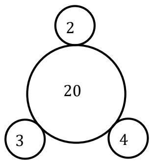

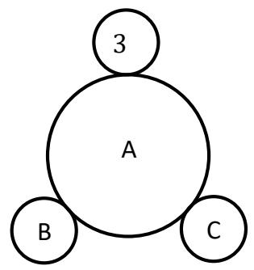

2. Find the value of 

$$
2 + 4 + 6 + 8 + \dots + 3 8 + 4 0
$$

3. Perimeter is the total length of a figure. For example, in the rectangle shown below. 

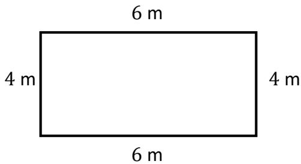

The perimeter is $( 4 + 6 + 6 + 4 ) = 2 0 \mathsf { m }$ . 

Find the perimeter of the figure of 

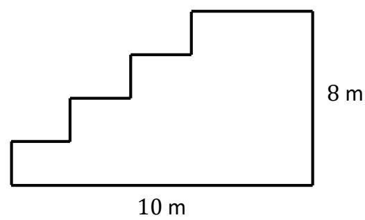

4. Find the value of ????̅̅̅̅, ????̅̅̅̅ and ????̅̅̅̅ in 

<table><tr><td></td><td>A</td><td>A</td></tr><tr><td></td><td>B</td><td>B</td></tr><tr><td>+</td><td>C</td><td>C</td></tr><tr><td>A</td><td>B</td><td>C</td></tr></table>

5. Mink drops a little marble into the funnel. She wonders how many ways are there for the marble to travel downwards? 

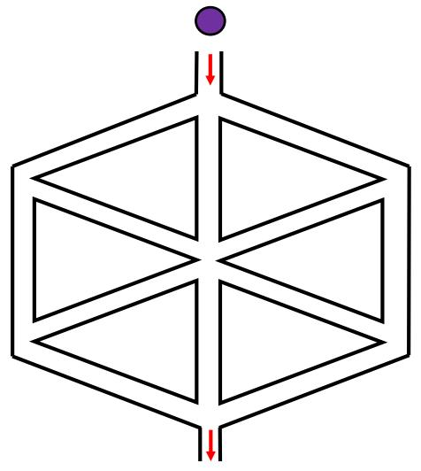

6. There were 12 children in a party. Each boy got 3 balloons, each girl got 5 balloons. Altogether 50 balloons were given out. How many girls were there in the party? 

7. How many triangles are there in the figure below? 

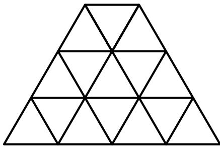

8. Study the number pattern below carefully. Find the sum of $r + c$ 

<table><tr><td>2</td><td>4</td><td>8</td><td>14</td><td>x</td><td>r</td><td></td></tr><tr><td>6</td><td>10</td><td>16</td><td></td><td></td><td></td><td></td></tr><tr><td>12</td><td>18</td><td></td><td></td><td></td><td></td><td></td></tr><tr><td>20</td><td></td><td></td><td></td><td></td><td></td><td></td></tr><tr><td>c</td><td></td><td></td><td></td><td></td><td></td><td></td></tr><tr><td></td><td></td><td></td><td></td><td></td><td></td><td></td></tr></table>

9. How many beads are there in all? 

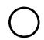

Fig 1.

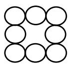

Fig 2

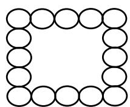

Fig 3

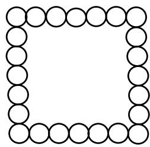

Fig 4

10. In a month of March some years ago, there were 4 Thursdays and 5 Fridays. On which day of the week was 15th for that month? [Hint: There are 31 days in the month of March] 

## Section B

For questions 11 to 20, each correct answer is awarded 6 marks. 

11. 

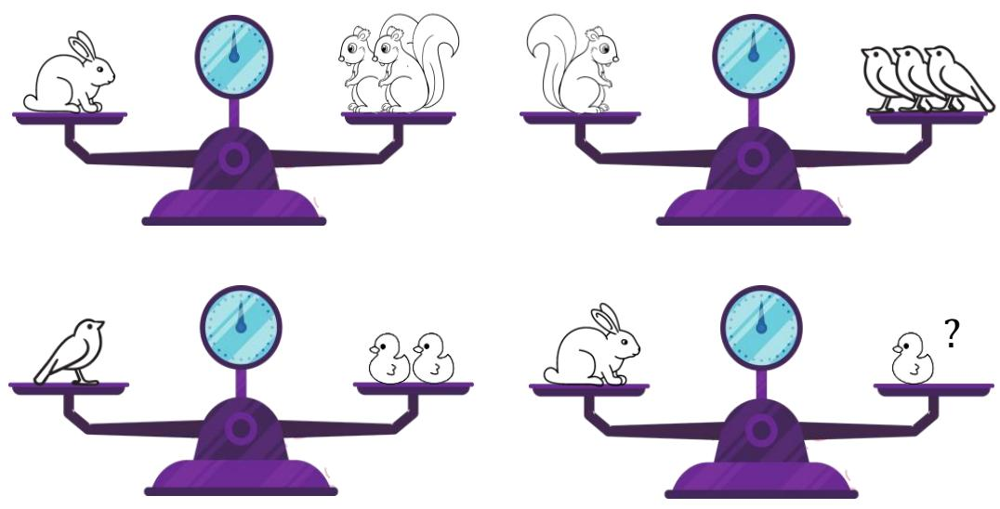

## 12. Compute

$$
7 + 7 7 + 7 7 7 + 7 7 7 7
$$

13. There are 10 black socks, 10 grey socks, 10 red socks and, 4 white socks in a drawer. How many socks, at the most, must Rila take from the drawer, without looking, to make sure there are 2 pairs of socks of the same colour? 

14. The Eye of Mizora is a circular flyer with some cabins. Remy is sitting in one of the cabins when she notices that there are 19 cabins in front of her. There are also 19 cabins behind hers. How many cabins are there altogether? 

15. Fill a number from 1, 2, 3, 4, 5, 6 or 7, so the sum of 3 numbers along each line equal to 12. What is the number in the middle circle? 

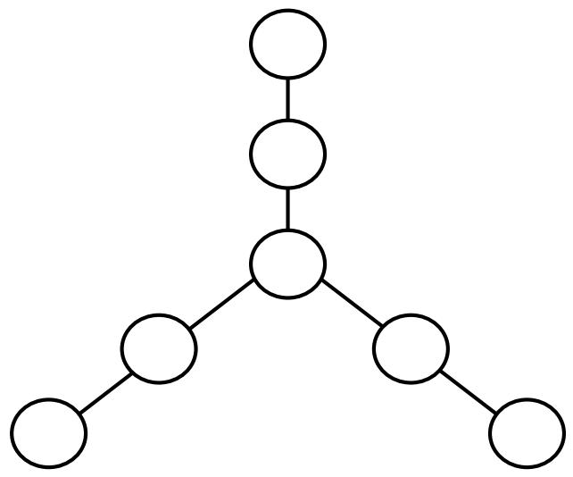

16. Mink walked from Point A to Point B, at a speed of 60 m per minute. At the same time, Nappon walked from Point B to Point A, at 40 m per minute. Mink and Nappon met 30 metres from the middle of Points A and B. Find the distance from Point A to Point B. 

17. The teacher has a bag of sweets. If she gives each child 3 sweets, she is short of 2 sweets. If she gives each child 2 sweets, she would have 9 sweets remaining. How many children are there in her class? 

18. A Square Number is the product of a number and itself. Examples are $1 \times 1 = 1$ , $2 \times 2 = 4 , \ 3 \times 3 = 9$ , … and so on. So, 1, 4, 9,… are Square Numbers. Find the $2 0 ^ { \mathrm { t h } }$ digit in: 

1 4 9 1 6 2 5 3 6 4 9 … 

19. Find the missing number. 

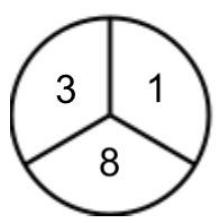

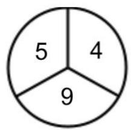

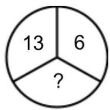

20. There are 20 goats, ducks and chickens in a farm. The number of chickens is the same as the number of ducks. Altogether, there are 56 legs. How many goats are there? 

## SEAMO X 2022

## Paper A – Answers

Questions 1 to 10 carry 4 marks each. 

<table><tr><td>Q1</td><td>Q2</td><td>Q3</td><td>Q4</td><td>Q5</td></tr><tr><td>35</td><td>420</td><td>36</td><td>198</td><td>11</td></tr></table>

<table><tr><td>Q6</td><td>Q7</td><td>Q8</td><td>Q9</td><td>Q10</td></tr><tr><td>7</td><td>23</td><td>62</td><td>49</td><td>Friday</td></tr></table>

Questions 11 to 20 carry 6 marks each. 

<table><tr><td>Q11</td><td>Q12</td><td>Q13</td><td>Q14</td><td>Q15</td></tr><tr><td>12</td><td>8638</td><td>13</td><td>20</td><td>4</td></tr></table>

<table><tr><td>Q16</td><td>Q17</td><td>Q18</td><td>Q19</td><td>Q20</td></tr><tr><td>300</td><td>11</td><td>2</td><td>133</td><td>8</td></tr></table>