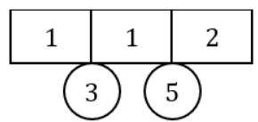
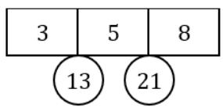
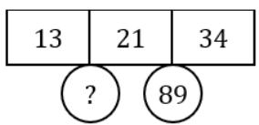
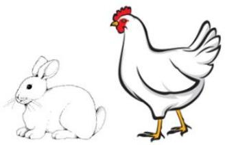
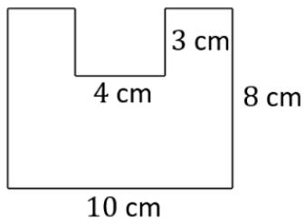
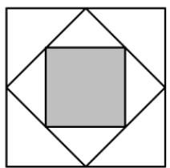
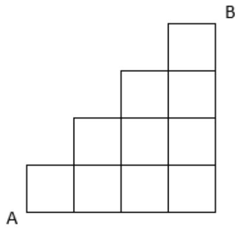

## Section A

For questions 1 to 10, each correct answer is awarded 4 marks. 

1. Find the missing number in the diagram below. 

2. A farmer has 15 chickens and rabbits. There are 48 legs altogether. How many rabbits are there? 

3. Find the perimeter, in ????, of the figure shown below. Leave your answer as a whole number with no units. 

4. Evaluate 

$$
1 + 2 + 3 + \dots + 4 8 + 4 9 + 5 0
$$

5. Find the area, in $c m ^ { 2 } .$ , of the shaded region shown below. Leave your answer as a whole number with no units. 

12 cm 

12 cm 

6. Find the value of 

$$
8 + 8 8 + 8 8 8 + 8 8 8 8
$$

7. A number greater than 30 and smaller than 50 gives a remainder of 1 when it is divided by 4. The remainder is 2 when it is divided by 7. What is the number? 

8. A teacher has a bag of sweets. If she gives each student 4 sweets, she will be left with 11 sweets. If she gives each student 5 sweets, she will need 1 more sweet. How many sweets does the teacher have? 

9. In the magic square below, each box contains the numbers 1 to 9, without repetition. The sum of numbers in any row, column and along the two diagonals is the same. Find the missing number. 

<table><tr><td></td><td></td><td>?</td></tr><tr><td>7</td><td>5</td><td></td></tr><tr><td></td><td></td><td>4</td></tr></table>

10. In Mathematics, 

$$
1 \times 1 = 1
$$

$$
2 \times 2 = 4
$$

$$
3 \times 3 = 9
$$

$$
4 \times 4 = 1 6
$$

where 1, 4, 9, 16, … are Square Numbers. 

Find the 30th digit in the following array. 

1 4 9 1 6 2 5 3 6 4 9 … 

## Section B

For questions 11 to 20, each correct answer is awarded 6 marks. 

11. The 3-digit number $\overline { { 4 a b } }$ is divisible by 91. Find the number $\overline { { 4 a b } }$ . 

12. The $1 ^ { \mathsf { s t } }$ of January some years ago fell on a Wednesday. On which day of the week was $1 4 ^ { \mathrm { t h } }$ of February that same year? 

13. Mr. Wattana left Town A for Town B at 10:00 AM at a constant speed of 90 km/h. After one hour, Miss Mink starts travelling from Town A to Town B at a constant speed of 120 km/h. Given that Miss Mink catches up with Mr Wattana at ??:00 PM, find ??. 

14. Evaluate 

$$
1 + 2 - 3 - 4 + 5 + 6 - 7 - 8 + \dots + 9 3 + 9 4
$$

15. Find the number of shortest paths from A to B. 

16. Find the 4-digit number ???????? ̅̅̅̅̅̅̅ given that 

$$
\begin{array}{c c c c c} & a & b & c & d \\ \times & & & & 9 \\ \hline & d & c & b & a \end{array}
$$

17. Cindy is 2 years older than her brother. Given that the product of their ages is 99, how old is Cindy? 

18. Lily pads float on the surface of a pond. Every day, they double in number such that the area of the pond they cover is twice as compared to the day before. If the entire pond was covered by lily pads on Day 18, on which day was $\frac 1 2$ the pond covered by the lily pads? 

Leave your answer as a whole number with no units. 

19. Find the missing number. 

3, 3, 6, 9, 15, 24, ( ) 

20. Given that 

$1 \otimes 3 = 1 0$ 

$2 \otimes 4 = 2 0 \quad$ 

$6 \otimes 5 = 6 1$ 

Find 7 ⊗ 2. 

# SEAMO X 2023

## Paper A – Answers

Questions 1 to 10 carry 4 marks each. 

<table><tr><td>Q1</td><td>Q2</td><td>Q3</td><td>Q4</td><td>Q5</td></tr><tr><td>55</td><td>9</td><td>42</td><td>1275</td><td>36</td></tr></table>

<table><tr><td>Q6</td><td>Q7</td><td>Q8</td><td>Q9</td><td>Q10</td></tr><tr><td>9872</td><td>37</td><td>59</td><td>8</td><td>6</td></tr></table>

Questions 11 to 20 carry 6 marks each. 

<table><tr><td>Q11</td><td>Q12</td><td>Q13</td><td>Q14</td><td>Q15</td></tr><tr><td>455</td><td>Friday</td><td>2</td><td>95</td><td>42</td></tr></table>

<table><tr><td>Q16</td><td>Q17</td><td>Q18</td><td>Q19</td><td>Q20</td></tr><tr><td>1089</td><td>11</td><td>17</td><td>39</td><td>53</td></tr></table>