## PAPER A

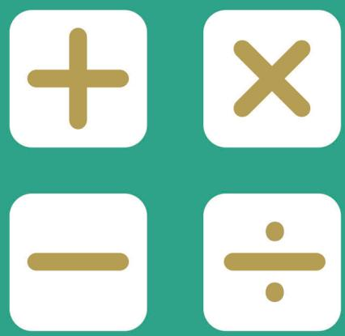

## SEAMO X

Southeast Asian Mathematical Olympiad Extended Round 

## DO NOT OPEN THIS BOOKLET UNTIL INSTRUCTED.

STUDENT'S NAME: 

Read the instructions on the ANSWER SHEET and fill in your NAME, COUNTRY and CANDIDATE NUMBER. 

All answers must be given in ENGLISH. 

Use a 2B or B pencil. Do NOT use a pen. 

Rub out mistakes completely. 

You MUST record your answers on the ANSWER SHEET. 

## LOWER PRIMARY

No marks are awarded for questions left BLANK. 

ONE MARK is deducted for incorrect answers. 

You must answer ALL PARTS of the question correctly. 

INCOMPLETE questions are considered incorrect. 

QUESTIONS 1 TO 10 

Each correct answer is awarded FOUR MARKS. 

QUESTIONS 11 TO 20 

Each correct answer is awarded SIX MARKS. 

You are NoT allowed to use a calculator. 

## Section A

For questions 1 to 10, each correct answer is awarded 4 marks. 

1. Count the number of cubes. 

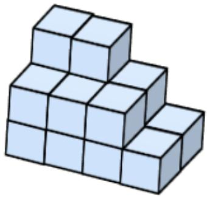

2. Find the colour of the circle marked with $" ? ^ { \prime \prime }$ . 

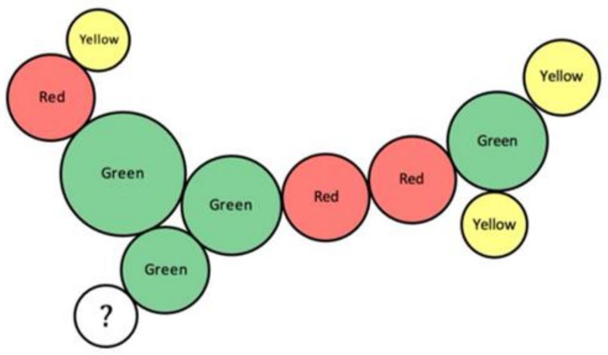

3. Find the value of 

$$
1 - 2 + 3 - 4 + 5 - 6 + \dots + 1 9
$$

4. Find the area of the triangle 

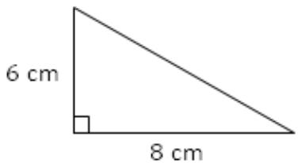

5. Draw the missing diagram in your answer script. 

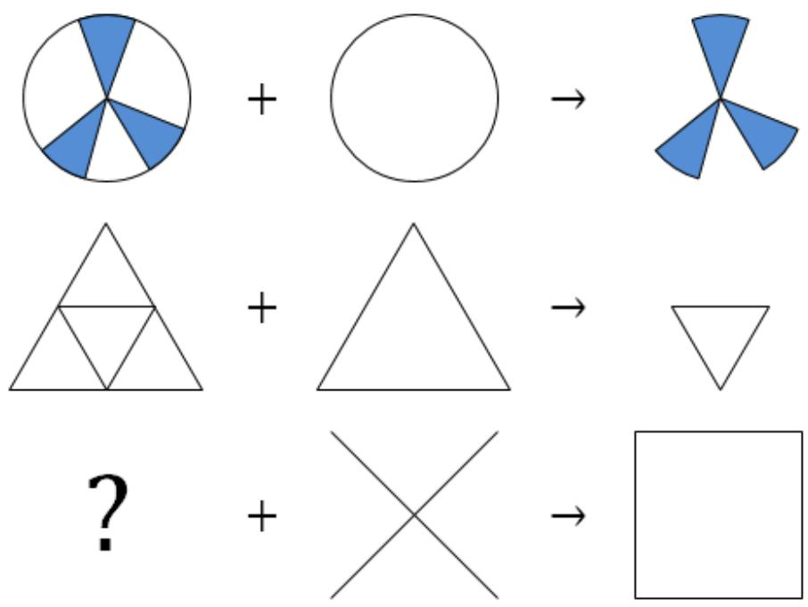

6. Using → and ↓ movements only, find the number of shortest paths from ? to ?, without passing through ?. 

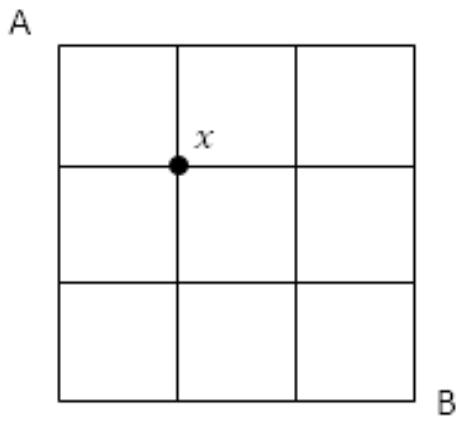

7. A wire of 98 cm is used to form a square of side length 16 cm. What is the remaining length of wire? 

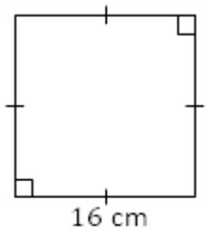

8. Find the missing number below. 

$$
3 * 5 = 1 4
$$

$$
5 * 6 = 3 1
$$

$$
8 * 7 = 7 1
$$

$$
1 0 * 8 = ?
$$

9. There are 11 girls and boys at a birthday party. Each boy gets 2 balloons, each girl gets 4 balloons. Altogether 34 balloons are given away. How many girls are at the party? 

10. Find the missing number below 

1, 4, 10, 22, 46, ( ) , … 

## Section B

For questions 11 to 20, each correct answer is awarded 6 marks. 

11. Mdm June has a basket of apples. If she gives each child 4 apples, 4 apples will remain. If she gives each child 5 apples, she will be short of 1 apple. How many apples does Mdm June have? 

12. It took Sam 2 minutes to vertically saw a log into 2 pieces. How many minutes did it take him to vertically saw the same log into 4 pieces? 

## 13. Study the number array below

<table><tr><td>1,</td><td>2,</td><td>3,</td><td>4,</td><td>5,</td></tr><tr><td>6,</td><td>7,</td><td>8,</td><td>9,</td><td>10,</td></tr><tr><td>11,</td><td>12,</td><td>13,</td><td>14,</td><td>15,</td></tr><tr><td>16,</td><td>17,</td><td>18,</td><td>19,</td><td>20,</td></tr><tr><td>21,</td><td>22,</td><td>23,</td><td>24,</td><td>25,</td></tr><tr><td>26,</td><td>27,</td><td>28,</td><td>29,</td><td>30,</td></tr><tr><td>...</td><td></td><td></td><td></td><td></td></tr><tr><td>...</td><td></td><td></td><td></td><td></td></tr></table>

In Mathematics, a prime number has only 2 factors – 1 and itself. The prime numbers in the array, up to 19, have been circled. What is the second prime number that is bigger than 60? 

14. A number multiplied by itself is called a Square Number. As shown below, 1, 4, 9, 16, … are square numbers. Find the sum of the first eight square numbers. 

$$
1 \times 1 = 1
$$

$$
2 \times 2 = 4
$$

$$
3 \times 3 = 9
$$

$$
4 \times 4 = 1 6
$$

15. John left home for the park at 0730 h, at a speed of 60 m/min. His brother returned from the park at the same time at 70 m/min. It is known that the distance between the park and their home is 2600 m. At what time did they meet along the way? 

Give your answer in 24-hour clock format (e.g. 0612 h means 6:12 AM). 

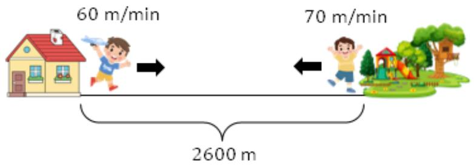

16. In Mathematics, $2 ^ { 1 } = 2 , 2 ^ { 2 } = 2 \times 2 = 4 , 2 ^ { 3 } = 2 \times 2 \times 2 = 8 ,$ …. 

Study the pattern below carefully 

$$
2 ^ {1} \div 3 = R 2
$$

$$
2 ^ {2} \div 3 = 4 \div 3
$$

$$
= 1 \mathrm{R} 1
$$

$$
2 ^ {3} \div 3 = 8 \div 3
$$

$$
= 2 \mathrm{R} 2
$$

What is the remainder when $2 ^ { 1 0 }$ is divided by 3? 

17. The $6 ^ { \mathrm { { t h } } }$ of February many years ago was a Wednesday during a leap year. On which day of the week was the $1 0 ^ { \mathrm { t h } }$ of March that same year? Use the table provided to assist you. 

<table><tr><td>Sun</td><td>Mon</td><td>Tue</td><td>Wed</td><td>Thu</td><td>Fri</td><td>Sat</td></tr><tr><td></td><td></td><td></td><td></td><td></td><td></td><td></td></tr><tr><td></td><td></td><td></td><td></td><td></td><td></td><td></td></tr><tr><td></td><td></td><td></td><td></td><td></td><td></td><td></td></tr><tr><td></td><td></td><td></td><td></td><td></td><td></td><td></td></tr><tr><td></td><td></td><td></td><td></td><td></td><td></td><td></td></tr></table>

18. There are 8 steps on a flight of stairs at Don’s apartment. There are 2 flights of stairs from one level to another. It takes Don 90 seconds to climb one flight of stairs. How many minutes does Don take to reach his home on the 6th floor? 

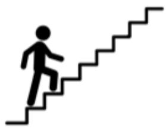

19. Mother kept a birthday cake in the fridge in the morning. One of the children ate part of the cake in the afternoon. These were the answers when mother questioned them. 

Alice: I didn’t take the cake. 

Benson: Mother, I didn’t even know there was a cake. 

Chloe: Benson took the cake! 

Two of the children had lied. Who ate the cake? 

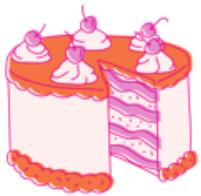

$\begin{array} { r } { \triangle = \frac { 1 } { 2 } \times } \end{array}$ 

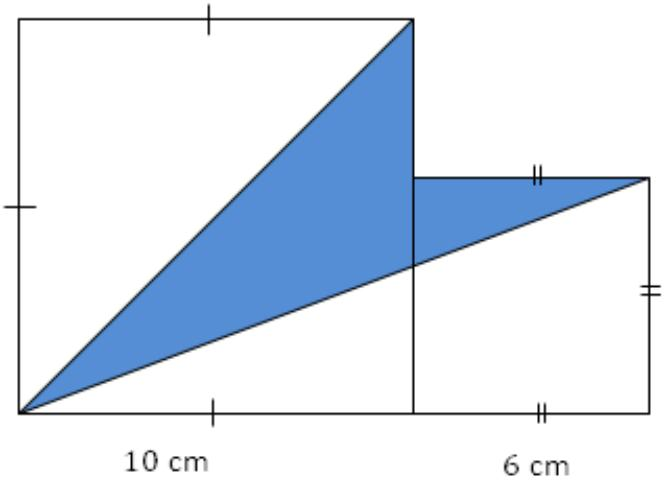

# SEAMO X 2024

## Paper A – Answers

Questions 1 to 10 carry 4 marks each. 

<table><tr><td>Q1</td><td>Q2</td><td>Q3</td><td>Q4</td><td>Q5</td></tr><tr><td>16</td><td>Yellow</td><td>10</td><td>24</td><td>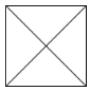</td></tr></table>

<table><tr><td>Q6</td><td>Q7</td><td>Q8</td><td>Q9</td><td>Q10</td></tr><tr><td>8</td><td>34</td><td>108</td><td>6</td><td>94</td></tr></table>

Questions 11 to 20 carry 6 marks each. 

<table><tr><td>Q11</td><td>Q12</td><td>Q13</td><td>Q14</td><td>Q15</td></tr><tr><td>24</td><td>6</td><td>67</td><td>204</td><td>0750</td></tr></table>

<table><tr><td>Q16</td><td>Q17</td><td>Q18</td><td>Q19</td><td>Q20</td></tr><tr><td>1</td><td>Monday</td><td>15</td><td>Alice</td><td>38</td></tr></table>