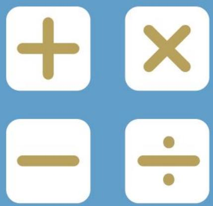
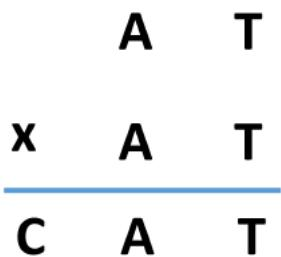
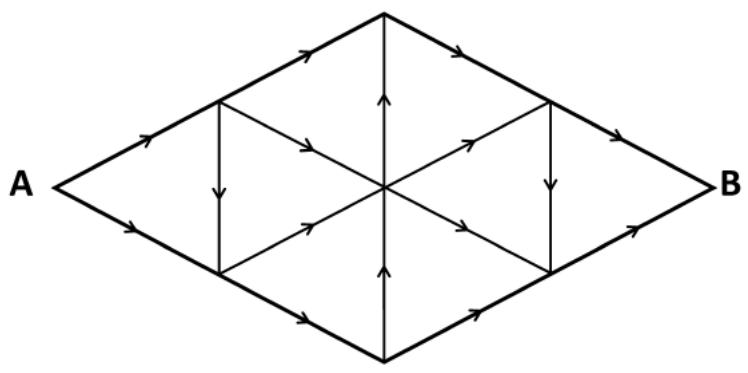
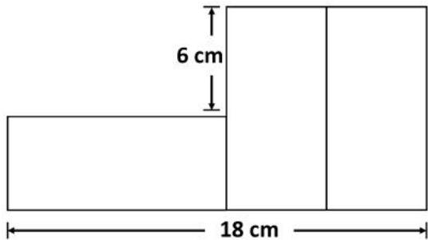
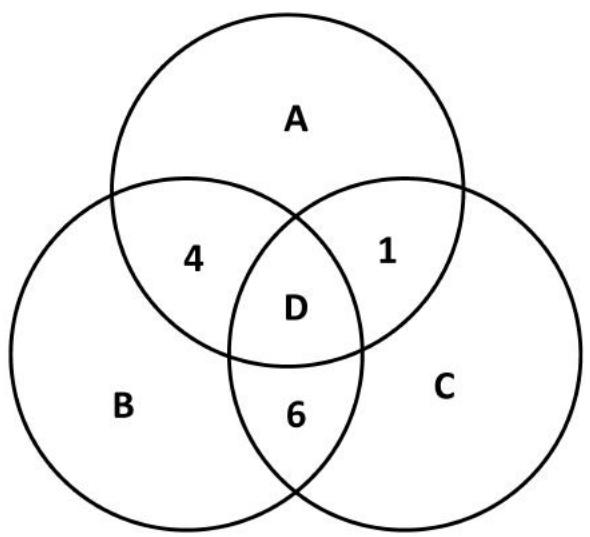

## PAPER B

## SEAMO X

SoutheastAsian Mathematical Olympiad Extended Round 

## DO NOT OPEN THIS BOOKLET UNTIL INSTRUCTED.

## STUDENT'SNAME:

Read the instructions on the ANsweR shEeTand filin your CANDIDATENUMBERand Otherdetails. 

Usea2BorBpencil oraBLAcKorBLUEpen. 

Ruboutorstrike offanymistakes. 

Correction tape or liquidpaper isNoT ALLowED. 

You MUsTrecord your answers on the ANsweR SHEET. 

## MIDDLE PRIMARY

Nomarksareawarded forquestions leftBLANK. 

MarkswillNoTbedeductedfor incorrect answers. 

You must answer ALL PARTsof the question correctly. 

INCOMPLETEquestionsare considered incorrect. 

QUESTIONS1TO10 

Eachcorrectanswerisawarded SixMARKs. 

QUESTIONS 11 TO 15 

Eachcorrectanswer isawarded EIGHTMARKS. 

YouareNotallowed touseacalculator. 

## Section A

For questions 1 to 10, each correct answer is awarded 6 marks. 

1. Find the value of ! in the number sequence below. 

1, 3, 6, 15, 33, !, … 

2. Given that the 4-digit number 37****)** 5* is divisible by 35, find ). 

3. Paul’s savings is 3 times Mary’s savings at first. If Paul withdraws $180 of his savings while Mary saves another $40, they will have the same amount of money. 

What is Mary’s savings at first? 

4. If 10 chickens lay 10 eggs in 10 days, how many eggs can 30 chickens lay in 30 days? 

5. In mathematics, 

$$
\begin{array}{l} 3 ^ {1} = 3 \\ 3 ^ {2} = 3 \times 3 = 9 \\ 3 ^ {3} = 3 \times 3 \times 3 = 2 7 \\ 3 ^ {4} = 3 \times 3 \times 3 \times 3 = 8 1 \\ \end{array}
$$

Find the ones digit in 300. 

6. Find the value of C in the cryptarithm below. 

7. In a box, there are 6 red, 7 yellow, 2 white and 5 black marbles. What is the least number of marbles that must be taken out, without looking, to ensure that one has marbles of 4 different colours? 

8. Evaluate 

$$
1 - 2 + 3 - 4 + 5 - 6 + \dots + 1 0 1
$$

9. What is the missing number in the grid below? 

<table><tr><td>1</td><td>3</td><td>5</td><td>7</td><td>9</td></tr><tr><td>8</td><td>12</td><td>?</td><td>2</td><td>20</td></tr><tr><td>5</td><td>9</td><td>12</td><td>8</td><td>19</td></tr></table>

10.At 8:00 AM, Abel cycled from Town A to Town B at a constant speed of 13 km/h. At the same time, Ben cycled from Town B to Town A, at a constant speed of 12 km/h. 

Given that Ben took a 1-hour break and the distance between the towns is 138 km, at what time did the two cyclists meet each other? 

## Section B

For questions 11 to 15, each correct answer is awarded 8 marks. 

11.Given that 

$$
a \diamond b = (a + b) \div 2
$$

$$
a \odot b = 3 a - b
$$

Find the value of (2  4) ± 6. 

12.Following the direction of the arrows, how many paths are there from Point A to Point B? 

13. Each letter in the word “EGGPLANT” represents a digit from 1 to 7, without repetition. Given that the sum of the digits in “EGGPLANT” is odd and divisible by 3, what is the digit corresponding to G? 

14. The figure shown is made up of 3 identical rectangles. Find the perimeter of 1 rectangle. 

15. A, B, C and D represent either of the digits 2, 3, 5 or 7. Given that the sum of numbers in each circle is 15, find the value of A. 

## SEAMO X 2020

## Paper B – Answers

## Section A

Questions 1 to 10 carry 6 marks each. 

<table><tr><td>Q1</td><td>Q2</td><td>Q3</td><td>Q4</td><td>Q5</td></tr><tr><td>78</td><td>4</td><td>110</td><td>90</td><td>3</td></tr></table>

<table><tr><td>Q6</td><td>Q7</td><td>Q8</td><td>Q9</td><td>Q10</td></tr><tr><td>6</td><td>19</td><td>51</td><td>14</td><td>2:00 PM</td></tr></table>

## Section B

Questions 11 to 15 carry 8 marks each. 

<table><tr><td>Q11</td><td>Q12</td><td>Q13</td><td>Q14</td><td>Q15</td></tr><tr><td>4</td><td>29</td><td>5</td><td>28</td><td>7</td></tr></table>