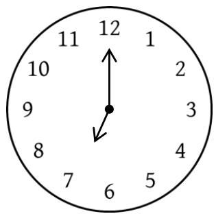
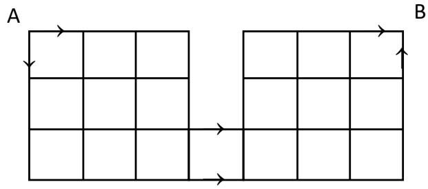
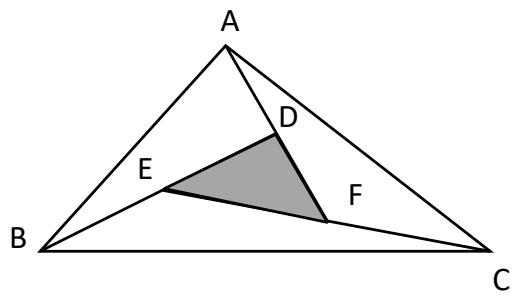
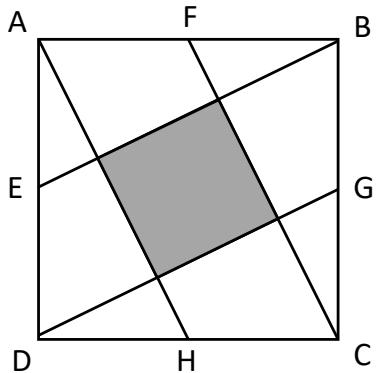

## Section A

For questions 1 to 10, each correct answer is awarded 6 marks. 

1. The time now is 7 a.m. How long, in minutes, does the minute hand to form a straight line with the hour hand for the first time? 

2. How many digits will there be before the first “9” appear, in the number array below? 

1, 1, 2, 1, 1, 2, 3, 2,1, 1, 2, 3, 4, 3, 2, 1, … 

3. Fill in a $^ { \prime \prime } \times ^ { \prime \prime } , \ ^ { \prime \prime } \div ^ { \prime \prime } , \ ^ { \prime \prime } + ^ { \prime \prime } , 0 \Gamma \ ^ { \prime \prime } - ^ { \prime \prime }$ exactly once in each so the result is the largest. 

13 13 13 13 13 

[Hint: If your answer is $\times , \div , + , - ,$ put 1234] 

4. Evaluate 

$$
9 9 ^ {2} + 1 9 8 + 1 ^ {2}.
$$

5. A new operation is defined as 

$$
m \oplus n = m + (m + 1) + (m + 2) + \dots + (m + n)
$$

Evaluate 4 ⊕ 7. 

## 6. Evaluate:

$$
{\frac {1}{1 \times 2 \times 3}} + {\frac {1}{2 \times 3 \times 4}} + {\frac {1}{3 \times 4 \times 5}} + \dots {\frac {1}{9 8 \times 9 9 \times 1 0 0}}.
$$

7. Find the sum of all digits in the product of the following. 

$$
9 9 9   9 9 9 \times 9 9 9   9 9 9
$$

[Hint: Avoid tedious method] 

8. Elaine left her house for Florence’s house. At the same time, Florence left her house for Elaine’s house. Their walking speeds are 72 m/min and 48 m/min respectively. Find the distance between the 2 houses if they met 32 metres from the middle of the 2 houses. 

9. There are 5 Saturdays during a month some years ago. It is found that 3 of the dates are even numbers. On which day of the week was $1 0 ^ { \mathrm { t h } }$ for that month? 

10. Find the number of paths from Point ?? to Point ??. 

## Section B

For questions 11 to 15, each correct answer is awarded 8 marks. 

11. Find the area of ∆??????, where points ??, ?? and ?? are midpoints of ????, ???? ?????? ???? respectively. The area of ∆?????? is 21 cm2. 

12. Find the last 2 digits in 

$$
\underbrace {3 \times 3 \times 3 \times \ldots \times 3} _ {2 0 2 2   3 ^ {\prime} s}
$$

13. ???????? is a square. ??, ??, ??, and ?? are the midpoints of the respective side. 

Find the area of the shaded square if area of ???????? is given as 50 cm2. 

14. The sum of ??, ?? and ?? is 16, where $a , b ,$ and ?? are all whole numbers. If $9 a + 8 b +$ $6 c = 1 3 5$ , find the value of $( 2 a + b - c )$ . 

15. 25g of concentrated syrup is mixed with 100 ml of water to make a drink. After Lina has consumed half of the drink, she added 36 ml of water into remaining mixture. How much of the syrup must Lina add into the mixture so that the sweetness of the drink is the same as before? 

## SEAMO X 2022

## Paper B – Answers

Questions 1 to 10 carry 6 marks each. 

<table><tr><td>Q1</td><td>Q2</td><td>Q3</td><td>Q4</td><td>Q5</td></tr><tr><td>21</td><td>72</td><td>181</td><td>10000</td><td>60</td></tr></table>

<table><tr><td>Q6</td><td>Q7</td><td>Q8</td><td>Q9</td><td>Q10</td></tr><tr><td>14851</td><td>54</td><td>320</td><td>Sunday</td><td>100</td></tr></table>

Questions 11 to 15 carry 8 marks each. 

<table><tr><td>Q11</td><td>Q12</td><td>Q13</td><td>Q14</td><td>Q15</td></tr><tr><td>3</td><td>09</td><td>10</td><td>23</td><td>9</td></tr></table>