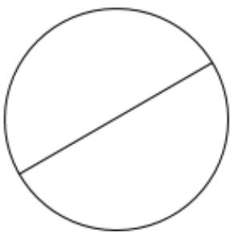
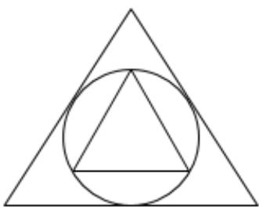
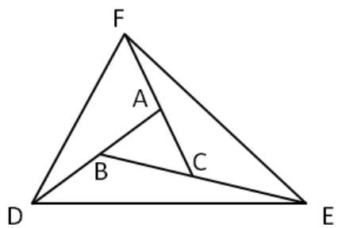
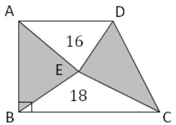

## Section A

For questions 1 to 10, each correct answer is awarded 6 marks. 

1. What is the $1 0 ^ { \mathrm { t h } }$ term in the number sequence below? 

1, 2, 4, 5, 10, 11, 22, 23, 46, … 

2. How many rectangles are there in the figure below? 

<table><tr><td></td><td></td><td></td><td></td></tr><tr><td></td><td></td><td></td><td></td></tr><tr><td></td><td></td><td></td><td></td></tr></table>

3. Find the remainder when 111 ⏟ … 11  is divided by 7. 2023 

4. A straight line divides a circle into 2 parts as shown below. Into how many parts can 6 lines divide the circle? 

5. Given that the $2 0 2 3 ^ { \mathsf { r d } }$ term in the following array of fractions is $\frac { m } { n }$ , find $( m + n )$ . 

$$
\frac {1}{1}, \frac {1}{2}, \frac {2}{2}, \frac {1}{3}, \frac {2}{3}, \frac {3}{3}, \frac {1}{4}, \frac {2}{4}, \frac {3}{4}, \frac {4}{4}, \dots
$$

6. There are 126 cartons of apples in a warehouse, each containing between 120 and 144 apples. What is the greatest number of cartons that is guaranteed to contain the same number of apples at any given time? 

7. Find the greatest number of consecutives zeroes in the product below. 

$$
6 2 5 \times 1 2 8 \times 2 5 \times 4
$$

8. A teacher took 51 pupils on a riverboat excursion. A big boat can take 6 passengers while a small boat can take 4. Given that a total of 11 boats were hired, how many small boats were there? 

9. In the figure below, an equilateral triangle is inscribed in a circle. The circle is in turn inscribed in a bigger equilateral triangle. The ratio of the area of the small triangle to the big triangle is ?? ∶ ??. Find the value of (?? + ??). 

10. Mark and Nick were running, in the same direction, around a 400 m circular track at speeds of 200 m/min and 160 m/min, respectively. Given that they started at the same point, how many minutes will it take for them to meet again? 

Leave your answer as a whole number with no units. 

## Section B

For questions 11 to 15, each correct answer is awarded 8 marks. 

11. In the figure below, ???? = ????, ???? = ???? and $B C = C E$ . Find the area of $\Delta D E F$ , in $c m ^ { 2 }$ , if the area of triangle ?????? is $1 0 \ : c m ^ { 2 }$ . 

Leave your answer as a whole number with no units. 

12. Evaluate 

$$
\left(1 + \frac {1}{4 7}\right) + \left(2 + \frac {1}{4 7} \times 2\right) + \left(3 + \frac {1}{4 7} \times 3\right)
$$

$$
+ \dots + \left(4 6 + \frac {1}{4 7} \times 4 6\right) + \left(4 7 + \frac {1}{4 7} \times 4 7\right)
$$

13. Given that ??679?? is divisible by 72, find (?? + ??). 

14. In the figure shown below, ???? ∥ ???? and $B C = 1 . 5 A D$ . The area of $\Delta A D E = 1 6 c m ^ { 2 }$ and the area of $\Delta B E C = 1 8 \ c m ^ { 2 }$ . Find the area, in $c m ^ { 2 } .$ , of the shaded regions. 

Leave your answer as a whole number with no units. 

15. The grass at the ranch grows at a constant rate every day. 27 oxen could finish eating the grass in 6 days, and 23 oxen could finish eating the grass in 9 days. For how many days could the ranch sustain a herd of 24 oxen? 

Leave your answer as a whole number with no units. 

# SEAMO X 2023

## Paper B – Answers

Questions 1 to 10 carry 6 marks each. 

<table><tr><td>Q1</td><td>Q2</td><td>Q3</td><td>Q4</td><td>Q5</td></tr><tr><td>47</td><td>39</td><td>1</td><td>22</td><td>71</td></tr></table>

<table><tr><td>Q6</td><td>Q7</td><td>Q8</td><td>Q9</td><td>Q10</td></tr><tr><td>6</td><td>6</td><td>7</td><td>5</td><td>10</td></tr></table>

Questions 11 to 15 carry 8 marks each. 

<table><tr><td>Q11</td><td>Q12</td><td>Q13</td><td>Q14</td><td>Q15</td></tr><tr><td>70</td><td>1152</td><td>5</td><td>36</td><td>8</td></tr></table>