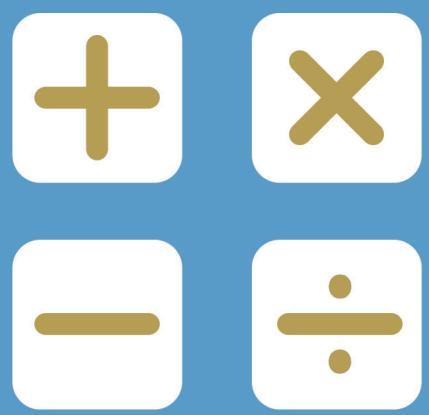
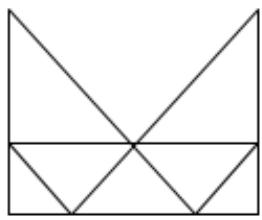
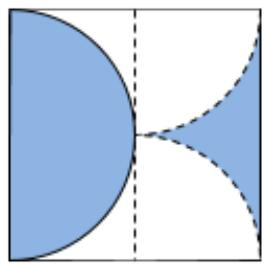
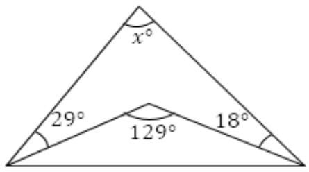
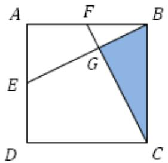
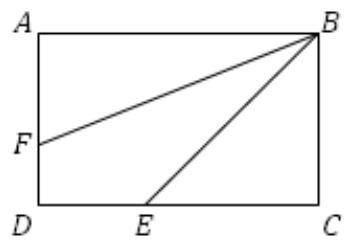

## PAPER B

## SEAMO X

Southeast Asian Mathematical Olympiad Extended Round 

## DO NOT OPEN THIS BOOKLET UNTIL INSTRUCTED.

STUDENT'S NAME: 

Read the instructions on the ANSWER SHEET and fill in your NAME, COUNTRY and CANDIDATE NUMBER. 

All answers must be given in ENGLISH. 

Use a 2B or B pencil. Do NOT use a pen. 

Rub out mistakes completely. 

You MUST record your answers on the ANSWER SHEET. 

## MIDDLE PRIMARY

No marks are awarded for questions left BLANK. 

ONE MARK is deducted for incorrect answers. 

You must answer ALL PARTS of the question correctly. 

INCOMPLETE questions are considered incorrect. 

QUESTIONS 1 TO 10 

Each correct answer is awarded SIX MARKS. 

QUESTIONS 11 TO 15 

Each correct answer is awarded EIGHT MARKS. 

You are NoT allowed to use a calculator. 

## Section A

For questions 1 to 10, each correct answer is awarded 6 marks. 

1. Find the value of ? below. 

$$
(m \div 3) + 8 \times 5 = 1 2 0
$$

2. Find the missing number. 

2, 2, 4, 6, 10, 16, 26, 42, ( ) 

3. How many quadrilaterals, or 4-sided polygons are there in the figure below? [Hint: A rectangle is a quadrilateral.] 

4. The teacher has a bag of sweets. If she gives each student 8 sweets, 3 sweets will remain. If she gives each student 9 sweets, she will need another 5 sweets. How many sweets does the teacher have? 

5. How many numbers greater than 4000 can be formed using the number cards below? 

$$
\boxed{0}\quad \boxed{3}\quad \boxed{5}\quad \boxed{8}
$$

6. The figure shows a square of side length 50 cm. Inscribed inside the square is a shaded semi-circle. The other shaded region is outside the quadrants shown. Find the total shaded area. [Hint: A quadrant is one quarter of a circle] 

7. In the figure below, find the value of ?. 

8. $( 2 ^ { 3 3 } + k )$ is divisible by 31. Find the smallest possible value of ?. 

9. Kenneth forgot his pencil box when he left home for school. His father cycled after him to give him the pencil box. 5 minutes after getting the pencil box from his father, Kenneth reached school and his father got back home. If his father cycles 4 times as fast as Kenneth walks, how many minutes did Kenneth take to walk from home to school? 

10. There is an array of whole numbers from 1 to 160. 

1, 2, 3, 4, … , 158, 159, 160 

In the first operation, the numbers at the odd positions are removed. 

2, 4, 6, 8, … , 158, 160 

In the 2nd operation, again the numbers at the odd positions are removed. 

Continuing in this manner, what is the last number left behind? 

## Section B

For questions 11 to 15, each correct answer is awarded 8 marks. 

11. ???? is a square, points ?, ? are the midpoints of sides ?? and ?? respectively. Find the area of the square if the area of the shaded region is given as $4 8 \ c m ^ { 2 }$ . 

12. Evaluate 

$$
2 0 2 4 \times \left(\frac {1}{1 \times 2} + \frac {1}{2 \times 3} + \frac {1}{3 \times 4} + \dots + \frac {1}{2 0 2 2 \times 2 0 2 3} + \frac {1}{2 0 2 3 \times 2 0 2 4}\right)
$$

13. The figure shows a rectangle ????. $D E : E C = 4 : 5 , A F : F D = 7 : 5$ . The area of ∆??? is $6 0 \ c m ^ { 2 }$ . Find the area of $\Delta A F B$ . 

14. 793 and 399 have the same remainder ? when divided by a prime number ?. Find the biggest possible value of (? + ?). 

15. Find the value of 

$$
\frac {1}{\frac {1}{2 0 2 2 \times 2 0 2 3} + \frac {1}{2 0 2 3 \times 2 0 2 4} + \frac {1}{2 0 2 4}}
$$

# SEAMO X 2024

## Paper B – Answers

Questions 1 to 10 carry 6 marks each. 

<table><tr><td>Q1</td><td>Q2</td><td>Q3</td><td>Q4</td><td>Q5</td></tr><tr><td>240</td><td>68</td><td>16</td><td>67</td><td>12</td></tr></table>

<table><tr><td>Q6</td><td>Q7</td><td>Q8</td><td>Q9</td><td>Q10</td></tr><tr><td>1250</td><td>82</td><td>23</td><td>25</td><td>128</td></tr></table>

Questions 11 to 15 carry 8 marks each. 

<table><tr><td>Q11</td><td>Q12</td><td>Q13</td><td>Q14</td><td>Q15</td></tr><tr><td>240</td><td>2023</td><td>63</td><td>202</td><td>2022</td></tr></table>