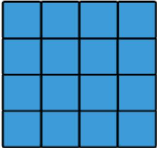
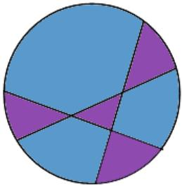

<table><tr><td>QUESTION</td><td>ANSWER</td><td>SOLUTION</td></tr><tr><td>1</td><td>B</td><td>3 + 7 + 11 = 213 + 4 + 5 = 125 + 6 + 12 = 23</td></tr><tr><td>2</td><td>D</td><td>1 Δ:94 Δs:3Δ 11:1Total →9 +3+1=13</td></tr><tr><td>3</td><td>D</td><td>6 × 3 - 3 = 15</td></tr><tr><td>4</td><td>C</td><td>50 × (100 + 1) = 50 × 100 + 50 × 1= 5000 + 50 = 5050</td></tr><tr><td>5</td><td>C</td><td>80+12=92<eq>\frac{92}{2}</eq> = 46</td></tr><tr><td>6</td><td>D</td><td>(1 + 20) × 20 ÷ 2 = 21 × 10= 210</td></tr><tr><td>7</td><td>A</td><td></td></tr><tr><td>8</td><td>B</td><td>6 × 7 = 842 in Row C47 in Row B</td></tr><tr><td>9</td><td>B</td><td>24690</td></tr><tr><td>10</td><td>B</td><td></td></tr><tr><td>11</td><td>C</td><td><eq>5 \times 60 + 10</eq>=310 min</td></tr><tr><td>12</td><td>B</td><td><eq>2 + 2 + 16 = 20</eq><eq>2 + 2 + 14 = 18</eq> [correct answer is <eq>2 + 4 + 14</eq>]<eq>2 + 6 + 12 = 20</eq><eq>2 + 8 + 10 = 20</eq><eq>4 + 4 + 12 = 20</eq><eq>4 + 6 + 10 = 20</eq><eq>4 + 8 + 12 = 24</eq> [correct answer is <eq>4 + 4 + 8</eq>]<eq>6 + 6 + 8 = 20</eq><eq>8 + 8 + 4 = 20</eq>There are 9 ways</td></tr><tr><td>13</td><td>A</td><td></td></tr><tr><td>14</td><td>D</td><td>Fig.1: 1Fig.2: <eq>1 + 2 = 3</eq>Fig.3: <eq>1 + 2 + 3 = 6</eq>Fig.5: <eq>1 + 2 + 3 + 4 + 5 = 15</eq></td></tr><tr><td>15</td><td>B</td><td>1 to 9 : 9 digit<eq>10 - 59 : 59 - 10 + 1 = 50</eq> numbers<eq>50 \times 2 = 100</eq> digits<eq>9 + 100 = 109</eq> digits</td></tr><tr><td>16</td><td>5 Ways</td><td>Make a list<eq>50¢, 20¢</eq><eq>50¢, 10¢, 10¢</eq><eq>20¢, 20¢, 20¢, 10¢</eq><eq>20¢, 20¢, 10¢, 10¢, 10¢</eq><eq>20¢</eq> <eq>5 \times 10¢</eq>5 ways</td></tr><tr><td>17</td><td>D</td><td><eq>1 + 1 = 2</eq><eq>1 + 2 = 3</eq><eq>2 + 3 = 5</eq><eq>5 + 8 = 13</eq></td></tr><tr><td>18</td><td>B</td><td><eq>38 + 39 + 23 = 100</eq></td></tr><tr><td>19</td><td>C</td><td><eq>48-8=40</eq><eq>40÷5=8</eq><eq>8+8=16</eq></td></tr><tr><td>20</td><td>D</td><td>36 + 40 + 52 = 128128 ÷ 2 = 6464 - 36 = 28</td></tr><tr><td>21</td><td>7</td><td></td></tr><tr><td>22</td><td>8 chickens</td><td>17 × 4 = 6868 - 52 = 1668 ÷ 2 = 8 chickens</td></tr><tr><td>23</td><td>7 min</td><td>60 - 55 = 5 metres faster every minute35 ÷ 5 = 7 min</td></tr><tr><td>24</td><td>18 friendly pairs</td><td>18 friendly pairs</td></tr><tr><td>25</td><td>9</td><td>10 the correct caseboy111111118 + 1 = 9</td></tr></table>