## PAPER A

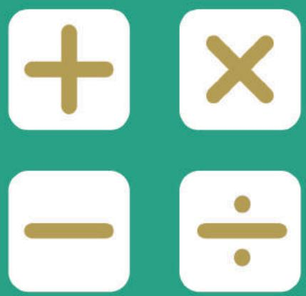

## SEAMO

Southeast Asian Mathematical Olympiads 

## DO NOT OPEN THIS BOOKLET UNTIL INSTRUCTED.

STUDENT'SNAME: 

Read the instructions on the ANsWER SHEETand fillin your NAME,SCHOOLandOTHERINFORMATION. 

Usea2BorBpencil. 

DoNoTuseapen 

Ruboutanymistakescompletely. 

You MUST record youranswers on the ANswER SHEET. 

## LOWER PRIMARY

MarkonlyoNEanswerforeach question. 

MarksareNoTdeducted for incorrectanswers. 

## SeCTION A

Usethe information providedto choose the BesTanswer from thefivepossible options. 

OnyourANswersheeTfillinthe oval thatmatches your answer. 

## SECTION B

Onyour ANsWER SHEET fillin youranswer within the box provided. 

Youare NoTallowed to useacalculator. 

1. What is the missing number? 

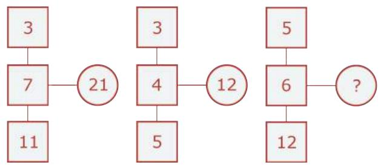

(A) 17 

(B) 19 

(C) 21 

(D) 23 

(E) 30 

2. How many triangles are there in the figure below? 

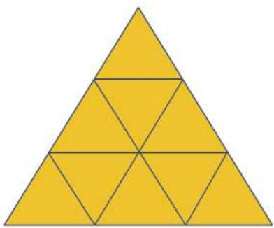

(A) 10 

(B) 11 

(C) 12 

(D) 13 

(E) 14 

3. Vanessa uses some coins to form a triangle. Each of the 3 corners of the triangle has a coin. There are 6 coins on each side of the triangle. How many coins does Vanessa use to form the triangle? 

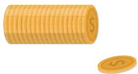

(A) 12 

(B) 13 

(C) 14 

(D) 15 

(E) 16 

4. What is the result of 

$$
5 0 \times 1 0 1?
$$

(A) 1010 

(B) 4350 

(C) 5050 

(D) 10 100 

(E) 50 500 

5. The sum of two numbers is 80. 

The difference between the two numbers is 12. 

What is the value of the bigger number? 

(A) 32 

(B) 40 

(C) 46 

(D) 48 

(E) 52 

6. Find the sum of 

$$
1 + 2 + 3 + 4 + \dots + 1 8 + 1 9 + 2 0
$$

(A) 190 

(B) 195 

(C) 200 

(D) 210 

(E) 220 

7. How many tiles do you need to cover the area shown below? 

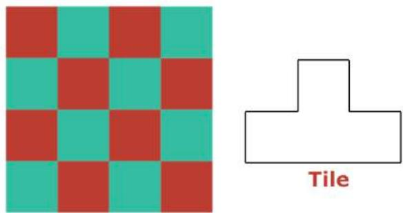

(A) 2 

(B) 3 

(C) 4 

(D) 5 

(E) 6 

8. In which row is the number 47 if the numbers continue? 

<table><tr><td>Row A</td><td>1</td><td>10</td><td>11</td><td>20</td></tr><tr><td>Row B</td><td>2</td><td>9</td><td>12</td><td>19</td></tr><tr><td>Row C</td><td>3</td><td>8</td><td>13</td><td>18</td></tr><tr><td>Row D</td><td>4</td><td>7</td><td>14</td><td>17</td></tr><tr><td>Row E</td><td>5</td><td>6</td><td>15</td><td>16</td></tr></table>

(A) Row A 

(B) Row B 

(C) Row C 

(D) Row D 

(E) Row E 

9. Find the sum of 

$$
2 + 2 2 + 2 2 2 + 2 2 2 2 + 2 2 2 2 2
$$

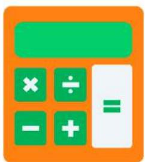

(A) 24 680 

(B) 24 690 

(C) 24 700 

(D) 24 710 

(E) None of the above 

10. What is the least number of colours needed to colour the petals such that no two neighboring petals have the same colour? 

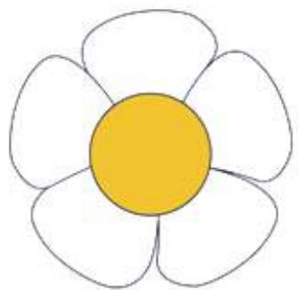

(A) 2 

(B) 3 

(C) 4 

(D) 5 

(E) 6 

11. The time that Jennifer’s party started and ended is as shown below. How long was her party in minutes? 

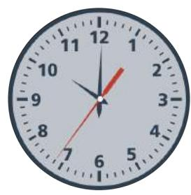

(A) 300 

(B) 305 

(C) 310 

(D) 320 

(E) 330 

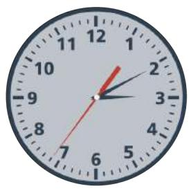

12. How many ways are there to put 20 oranges into 3 baskets so that each basket has an even number of oranges? 

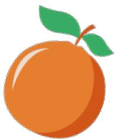

(A) 8 

(B) 9 

(C) 10 

(D) 11 

(E) None of the above 

13. Uncle Sam is going to deliver a parcel to Point B, beginning his journey from Point A. How many ways are there for him to reach there using the directions and only? 

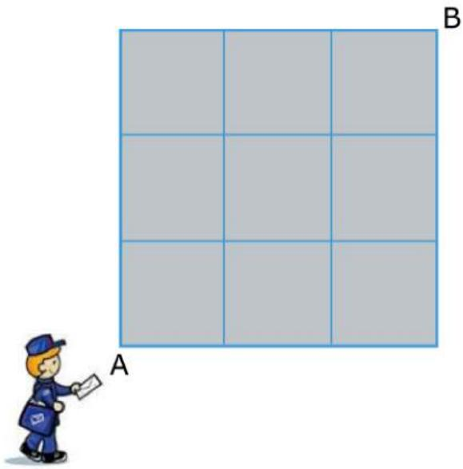

(A) 20 

(B) 21 

(C) 22 

(D) 23 

(E) 24 

14. How many dots are there in Figure 5? 

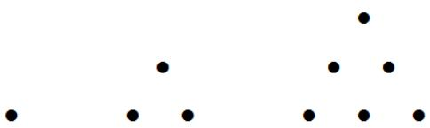

Figure 1 Figure 2

Figure 3

(A) 12 

(B) 13 

(C) 14 

(D) 15 

(E) 16 

15. Jane wrote on a piece of paper all the whole numbers from 1 to 59. 

1 2 3 4 5 6 7 8 9 10 11 12 … … 57 58 59 

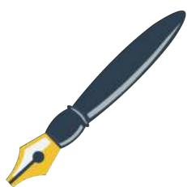

How many digits did she write altogether? 

(A) 107 

(B) 109 

(C) 111 

(D) 113 

(E) 115 

16. A file in a bookstore costs 70 ¢. Akshta has 5 10 ¢ coins, 3 20 ¢ coins and 1 50 ¢ coin. How many ways can she pay for the file without receiving change? 

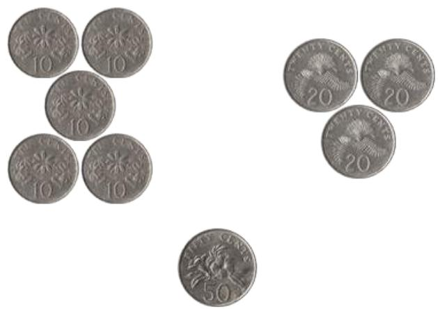

(A) 5 

(B) 6 

(C) 7 

(D) 8 

(E) None of the above 

17. What is the missing number? 

1, 1, 2, 3, 5, 8, 13, ( ), 34, 55, … 

(A) 18 

(B) 19 

(C) 20 

(D) 21 

(E) 22 

18. The diagram shows a dartboard. What is the least number of throws to score 100? 

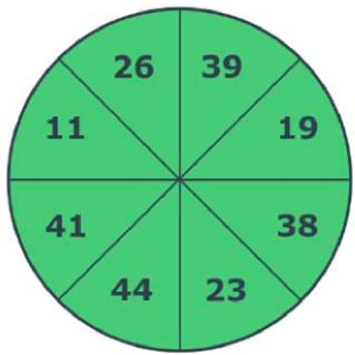

(A) 2 

(B) 3 

(C) 4 

(D) 5 

(E) None of the above 

19. A number is first reduced by 8. 

The remainder is then multiplied by 5. The product is then increased by 8. The final result is 48. 

What is the number? 

(A) 14 

(B) 15 

(C) 16 

(D) 17 

(E) None of the above 

20. Given that 

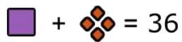

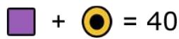

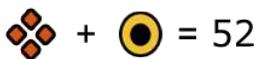

What is the value of ? 

(A) 12 

(B) 20 

(C) 26 

(D) 28 

(E) None of the above 

## QUESTIONS 21 - 25 ARE FREE RESPONSE

## Write your answer in the free response section of the ANSWER SHEET provided.

21. What is the maximum number of slices we can get by making 3 straight cuts? Each slice does not have to be equal in size. 

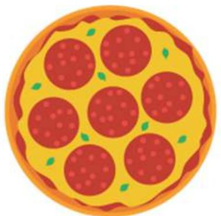

22. A farmer has 17 chickens and rabbits. He counts 52 legs in all. How many chickens does he have? 

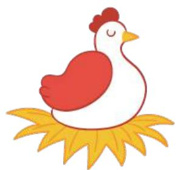

23. Shaun can walk 60 metres in one minute. Tim can walk 55 metres in one minute. If Tim is 35 metres ahead of Shaun, how many minutes does Shaun take to catch up with Tim? 

24. Two circles are friendly if they touch each other like the pair shown below: 

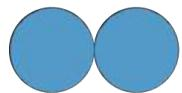

How many “friendly pairs” are there in the figure below? 

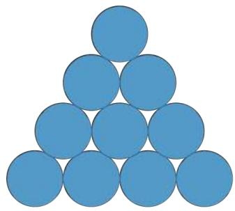

25. There are 5 blue balls, 4 orange balls and 2 yellow balls in a bag. Sheila is blindfolded and starts to take the balls out, one at a time. At least how many balls must she take out so that, for certain, she ends up with 4 balls of the same colour? 

## END OF PAPER