## PAPER A

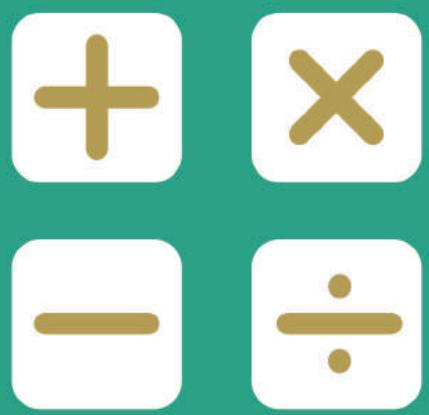

## SEAMO

Southeast Asian Mathematical Olympiad 

## DO NOT OPEN THIS BOOKLET UNTIL INSTRUCTED.

STUDENT'SNAME: 

Read the instructions on the ANsWER SHEETand fillin your NAME,SCHOOLandOTHERINFORMATION. 

Usea2BorBpencil. 

DoNOTuseapen 

Ruboutanymistakescompletely. 

You MUsT record youranswers on the ANswER SHEET. 

## LOWER PRIMARY

Mark onlyoNEanswerforeach question. 

MarksareNoTdeducted for incorrectanswers. 

## QUESTIONS 1TO 20

Usetheinformation providedto choose the BesTanswer from thefive possible options. 

On your ANsweR sHeET shade the option that matches youranswer. 

## QUESTIONS 21 TO 25

Onyour ANsWER SHEETwrite your answer within the box provided.Unitsare notrequired. 

YouareNoTallowedtouseacalculator. 

## QUESTIONS 1 TO 10 ARE WORTH 3 MARKS EACH

## 1. What is the mass of the Ball B?

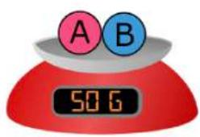

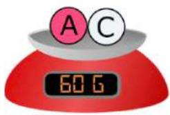

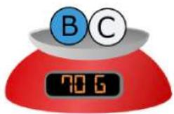

(A) 20 g 

(B) 30 g 

(C) 40 g 

(D) 50 g 

(E) None of the above 

## 2. Find the sum of

$$
3 + 5 + 7 + 9 + 1 1 + 1 3 + 1 5 + 1 7 + 1 9
$$

(A) 77 

(B) 88 

(C) 99 

(D) 110 

(E) None of the above 

## 3. What number does ⊡ represent?

$$
\square + \odot = 1 2
$$

$$
ⓞ \times 6 = 4 2
$$

(A) 3 

(B) 5 

(D) 9 

(E) None of the above 

## 4. Shawn stays on the $8 ^ { \mathrm { t h } }$ floor.

He takes 1 minute to walk from the $1 ^ { \mathsf { s t } }$ to the $2 ^ { \mathsf { n d } }$ floor. 

How many minutes does he take to walk from the $1 ^ { \mathsf { s t } }$ to the $8 ^ { \mathrm { t h } }$ floor? 

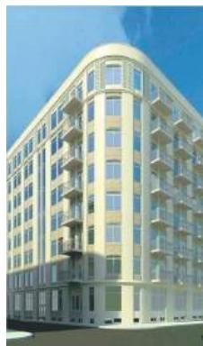

(A) 5 

(B) 6 

(C) 7 

(D) 8 

(E) None of the above 

## 5. John is cutting a cake.

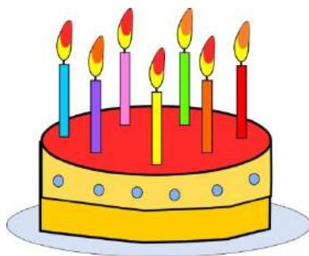

What is the maximum number of pieces he can get with 3 cuts? 

(A) 5 

(B) 6 

(C) 7 

(E) None of the above 

6. There are 60 minutes in an hour. By observing the two clocks, how many minutes has pass passed? 

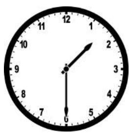

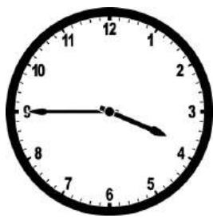

(A) 135 min 

(B) 140 min 

(C) 145 min 

(D) 150 min 

(E) None of the above 

7. Which of the following can be traced, without drawing over any line twice, and without lifting your pen? 

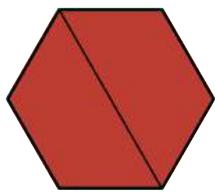

Fig. 1

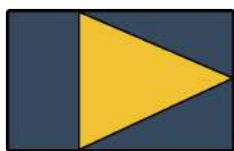

Fig. 2

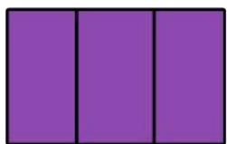

Fig. 3

(A) Figure 1 only 

(B) Figures 1 and 2 

(C) Figures 1 and 3 

(D) Figure 2 only 

(E) Figures 2 and 3 

8. At least how many cubes are there in the figure below? 

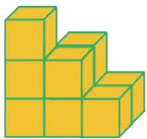

(A) 9 

(B) 10 

(C) 11 

(D) 12 

(E) None of the above 

9. There were 31 commuters on the bus. 

At the $1 ^ { \mathsf { s t } }$ stop, 17 alighted and 14 boarded. 

At the $2 ^ { \mathsf { n d } }$ stop, 5 alighted and 3 boarded. 

How many commuters are there now? 

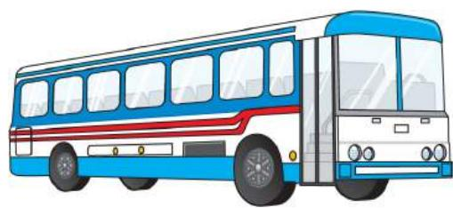

(A) 25 

(B) 26 

(C) 27 

(D) 28 

(E) None of the above 

10. 20 children were queuing to buy food. 

Ali was $8 ^ { \mathrm { t h } }$ from the front. 

Emma was $6 ^ { \mathrm { t h } }$ from the back. 

How many children were queuing 

between Ali and Emma? 

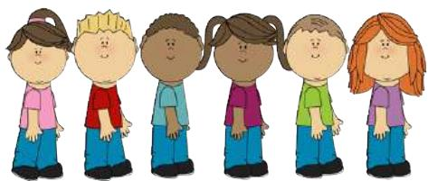

(A) 3 

(B) 4 

(C) 5 

(D) 6 

(E) None of the above 

## QUESTIONS 11 TO 20 ARE WORTH 4 MARKS EACH

11. There are 31 days in January. 

If $5 ^ { \mathrm { t h } }$ January is a Friday, which day is $2 8 ^ { \mathsf { t h } }$ January? 

<table><tr><td>Sun</td><td>Mon</td><td>Tue</td><td>Wed</td><td>Thu</td><td>Fri</td><td>Sat</td></tr><tr><td></td><td></td><td></td><td></td><td></td><td></td><td></td></tr><tr><td></td><td></td><td></td><td></td><td></td><td></td><td></td></tr><tr><td></td><td></td><td></td><td></td><td></td><td></td><td></td></tr><tr><td></td><td></td><td></td><td></td><td></td><td></td><td></td></tr><tr><td></td><td></td><td></td><td></td><td></td><td></td><td></td></tr></table>

(A) Sunday 

(B) Monday 

(C) Wednesday 

(D) Thursday 

(E) None of the above 

12. What is the missing number? 

$$
1, 2, 3, 5, 8, 1 3, 2 1, (), \dots
$$

(A) 32 

(B) 34 

(C) 55 

(D) 56 

(E) None of the above 

13. 2 3 = 13 

$$
2 \oplus 4 = 2 0
$$

$$
3 \oplus 4 = ?
$$

(A) 22 

(B) 23 

(C) 24 

(D) 25 

(E) None of the above 

14. The sum of 2 numbers A and B is 36. 

The difference between A and B is 8. 

Given that A is the larger number, find A. 

(A) 18 

(B) 20 

(C) 22 

(D) 24 

(E) None of the above 

15. Hashima has $22. Mingyi has $10. How much must Hashima give Mingyi so that he will have three times as much money as she? 

(A) 12 

(B) 13 

(C) 14 

(D) 15 

(E) None of the above 

16. How would the $4 ^ { \mathrm { t h } }$ figure look like? 

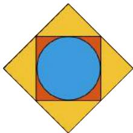

$1 ^ { \mathsf { s t } }$

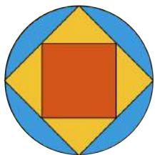

$2 ^ { \mathsf { n d } }$

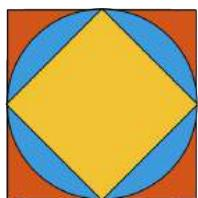

$3 ^ { \mathsf { r d } }$

4th $4 ^ { \mathrm { t h } }$ 

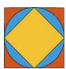

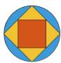

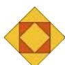

(D) 

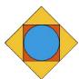

(E) 

None of the above 

17. Halima wrote on the whiteboard. 

1 2 3 4 5 6 7 8 9 10 11 12 … 64 65 

How many digits did she write altogether? 

(A) 120 

(B) 121 

(C) 123 

(D) 125 

(E) None of the above 

18. My mother embroidered 5 flowers on each side of my handkerchief. There was a flower on each corner. 

How many flowers did she embroider altogether? 

Use the square provided to help you. 

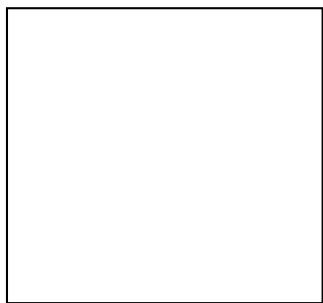

(A) 14 

(B) 15 

(C) 16 

(D) 17 

(E) None of the above 

$1 9 . \odot + \odot + \odot = 1 5$ 

$$
\square + \square + \square = 1 8
$$

$$
\Delta + \Delta + \Delta = 1 2
$$

$$
\Delta + \square + \odot = (\quad ? \quad)
$$

(A) 13 

(B) 14 

(C) 15 

(D) 16 

(E) None of the above 

20. How many triangles are there in the figure below? 

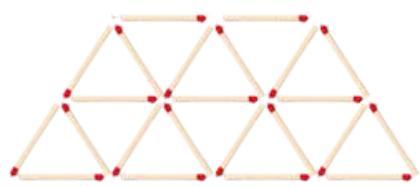

(A) 13 

(B) 14 

(C) 15 

(D) 16 

(E) None of the above 

## QUESTIONS 21 TO 25 ARE WORTH 6 MARKS EACH

21. There are 14 children in a party. 

Each boy gets 2 balloons. 

Each girl gets 3 balloons. 

36 balloons are given out in all. How many girls are there at the party? 

22. Find the value of B in 

$$
\begin{array}{l} \begin{array}{c c} A & B \end{array} \\ \begin{array}{c c} + A & B \end{array} \\ \begin{array}{c c} B & C \end{array} \\ \end{array}
$$

23. Matthew and his twin brother are 5 years old. 

Dad is 32 years old. 

In how many years will the sum of their ages be 60? 

24. What is the missing number? 

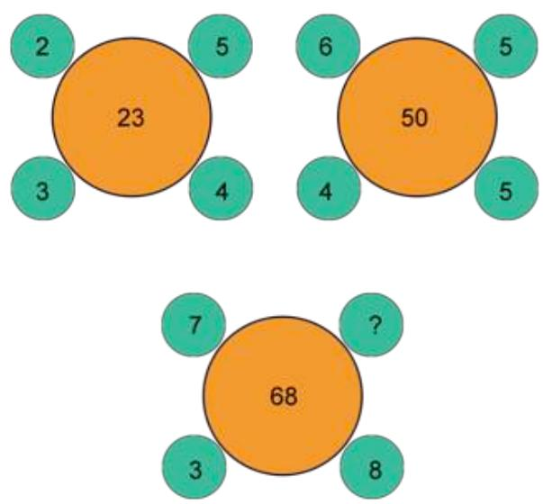

25. The sum of 18 and 81 form a palindromic pair. Their sum is 99. 

$$
\begin{array}{r} 1 \quad 8 \\ + \quad 8 \quad 1 \\ \hline 9 \quad 9 \end{array}
$$

How many other 2-digit palindromic pairs have a sum of 99? 

## SEAMO 2017

## Paper A – Answers

## Multiple-Choice Questions

Questions 1 to 10 carry 3 marks each. 

<table><tr><td>Q1</td><td>Q2</td><td>Q3</td><td>Q4</td><td>Q5</td></tr><tr><td>B</td><td>C</td><td>B</td><td>C</td><td>D</td></tr></table>

<table><tr><td>Q6</td><td>Q7</td><td>Q8</td><td>Q9</td><td>Q10</td></tr><tr><td>A</td><td>B</td><td>A</td><td>B</td><td>D</td></tr></table>

Questions 11 to 20 carry 4 marks each. 

<table><tr><td>Q11</td><td>Q12</td><td>Q13</td><td>Q14</td><td>Q15</td></tr><tr><td>A</td><td>B</td><td>D</td><td>C</td><td>C</td></tr></table>

<table><tr><td>Q16</td><td>Q17</td><td>Q18</td><td>Q19</td><td>Q20</td></tr><tr><td>C</td><td>B</td><td>C</td><td>C</td><td>D</td></tr></table>

## Free-Response Questions

Questions 21 to 25 carry 6 marks each. 

<table><tr><td>21</td><td>22</td><td>23</td><td>24</td><td>25</td></tr><tr><td>8</td><td>4</td><td>6</td><td>4</td><td>4</td></tr></table>