## PAPER

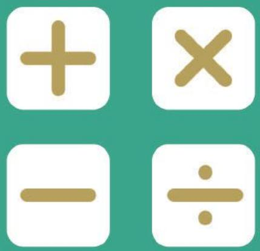

## SEAMO

Southeast Asian Mathematical Olympiads 

## DO NOT OPEN THIS BOOKLET UNTIL INSTRUCTED.

## STUDENT'SNAME:

Read the instructions on the ANswERsHeETand fillin your NAME,CANDIDATE NUMBER and SCHOOL. 

Usea2BorBpencil. 

Do NOTusea pen 

Ruboutanymistakescompletely. 

Youmust complete all the questionswithin90 MiNUTeS. 

## LOWER PRIMARY

MarkonlyoNeanswerforeachquestion. 

MarksareNoTdeducted forincorrectanswers. 

## SECTIONA

Questions1to 10are worth THREE(3) markseach. 

## SECTION B

Questions11to20areworth FouR(4)markseach. 

## SectIoN c

Questions21to25are worth sIx(6)marks each. 

Youare NoTallowedtousea calculator. 

## QUESTIONS 1 TO 10 ARE WORTH 3 MARKS EACH

## 1. Find the missing number.

$$
3, 4, 7, 1 1, 1 8, (\quad), 4 7, \dots
$$

(A) 27 

(B) 28 

(C) 29 

(D) 31 

(E) None of the above 

## 2. How many cubes are there in the figure below?

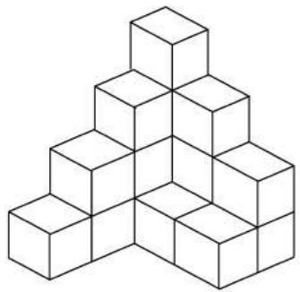

(A) 13 

(B) 14 

(C) 15 

(D) 16 

(E) 17 

## 3. Find the value of M.

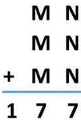

(A) 3 

(B) 4 

(C) 5 

(D) 6 

(E) 7 

## 4. Evaluate

$$
1 + 2 + 3 + \dots + 9 + 1 0 + 9 + 8 + \dots + 2 + 1
$$

(A) 89 

(B) 90 

(C) 99 

(D) 100 

(E) None of the above 

## 5. Find the 50th digit in

$$
\begin{array}{l} 3   5   8   0   3   5   8   0   3   5 \dots \end{array}
$$

(A) 3 

(B) 5 

(C) 8 

(D) 0 

(E) None of the above 

## 6. Find the value of the star.

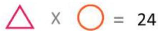

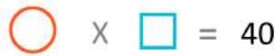

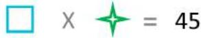

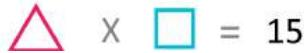

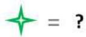

(A) 5 

(B) 6 

(C) 7 

(D) 8 

(E) None of the above 

7. Find the missing figure below. 

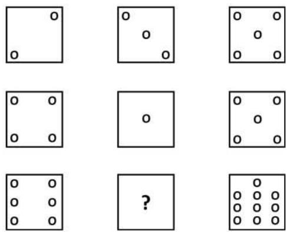

(A) 

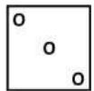

(B) 

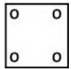

(C) 

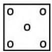

(D) 

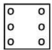

(E) None of the above 

8. Find the missing number. 

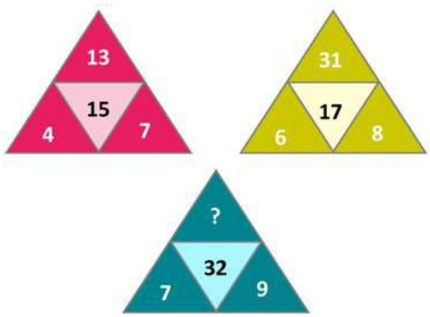

(A) 31 

(B) 33 

(C) 29 

(D) 32 

(E) None of the above 

9. My grandmother is 56 years old. 

My mum is 31 years old. 

I am 7 years old. 

In how many years is the sum of our ages 100? 

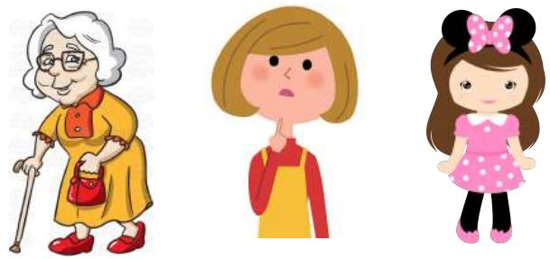

(A) 5 

(B) 4 

(C) 3 

(D) 2 

(E) 1 

10. What time should come next in the sequence below? 

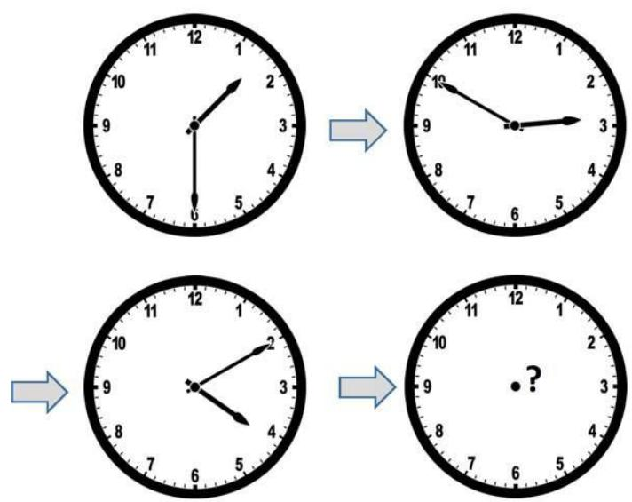

(A) 5:10 PM 

(B) 5:20 PM 

(C) 5:30 PM 

(D) 5:40 PM 

(E) 5:50 PM 

## QUESTIONS 11 TO 20 ARE WORTH 4 MARKS EACH

11. Mohammed wrote the numbers 1 to 24 on the whiteboard as shown: 

1 2 3 4 5 6 … 2 2 2 3 3 2 4 

How many times did he write the digit ‘2’ altogether? 

(A) 5 

(B) 6 

(C) 7 

(D) 8 

(E) 9 

12. Basket A has 54 apples. Basket B has 18 apples. Cindy moves 6 apples at a time from Basket A to Basket B. How many times must she do this so that both baskets have the same number of apples? 

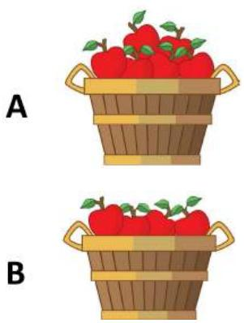

(A) 3 

(B) 4 

(C) 5 

(D) 6 

(E) None of the above 

13. Which of the following figures can be traced without lifting your pencil and without tracing over the same lines? 

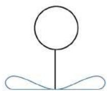

Fig1

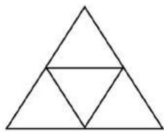

Fig2

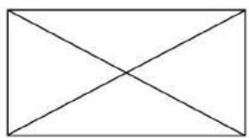

Fig3

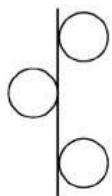

Fig4

(A) All except Fig 1 

(B) All except Fig 2 

(C) All except Fig 3 

(D) All except Fig 4 

(E) All of the above 

14. The digits 2, 4 and 7 can form six different 2-digit numbers. What is the difference between the largest and smallest of these numbers? 

(A) 48 

(B) 50 

(C) 52 

(D) 54 

(E) None of the above 

15. There are 26 chickens and rabbits in a farm. The farmer counted 80 legs together. 

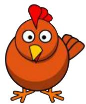

How many rabbits are there on the farm? 

(A) 14 

(B) 15 

(C) 16 

(D) 17 

(E) None of the above 

16. How many triangles are there in the figure below? 

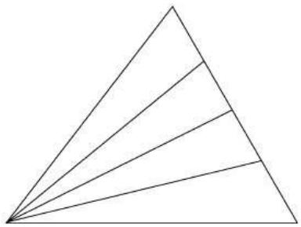

(A) 7 

(B) 8 

(C) 9 

(E) 11 

17. What do we get if all the figures are stacked on top of each other? 

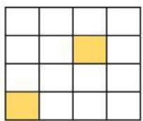

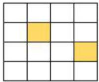

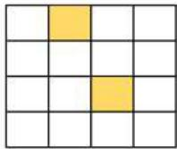

(A)

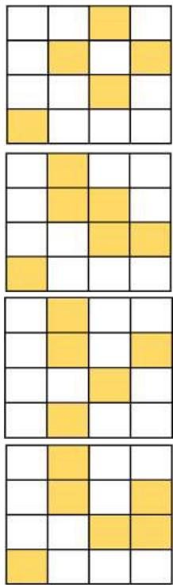

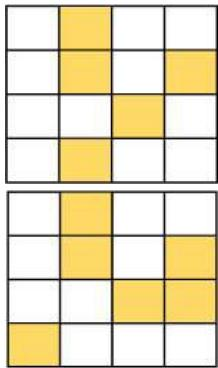

(C)

None of the above

18. John paid $12 for 2 pens and 2 pencils. Mark paid $22.50 for 2 pens and 5 pencils. How much is a pencil? 

(A) $3.20 

(B) $3.50 

(C) $3.80 

(D) $4.10 

(E) $4.30 

19. Shawn stays in the $6 ^ { \mathrm { t h } }$ floor of an apartment block. Jessie stays in the 3rd floor of the same block. If Shawn takes 4 minutes to walk from the 1st floor to Jessie’s apartment. How long, in minutes, does he take to walk from the 1st floor to his own apartment? 

(A) 6 

(B) 8 

(C) 10 

(D) 12 

(E) None of the above 

20. Find the value of the square. 

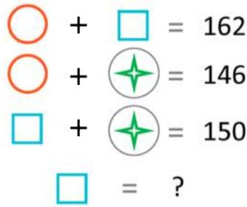

(A) 67 

(B) 79 

(D) 87 

(E) None of the above 

## QUESTIONS 21 TO 25 ARE WORTH 6 MARKS EACH

21. Find the sum of first 48 numbers in: 

1 , 3 , 5 , 7 , 8 , 1 , 3 , 5 , 7 , 8 , 1 , 3 , … 

22. There are 7 days in a week. If today is Tuesday, on which day of the week is the $1 0 0 ^ { \mathrm { t h } }$ day from today? 

23. The masses below are measured in grams. 

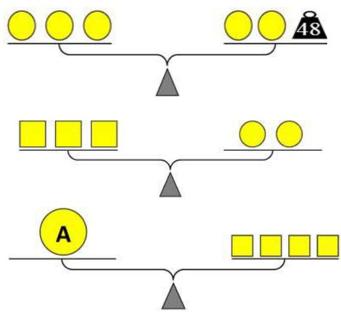

What is the mass of A?

24. Each row represents one of the following numbers: 892, 485, 364,624. 

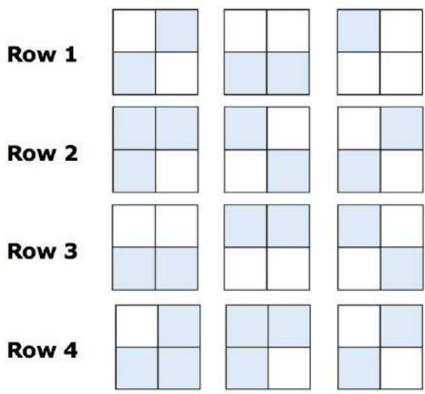

Which number does Row 2 represent?

25. 97 numbers are arranged in the sequence as shown below. 

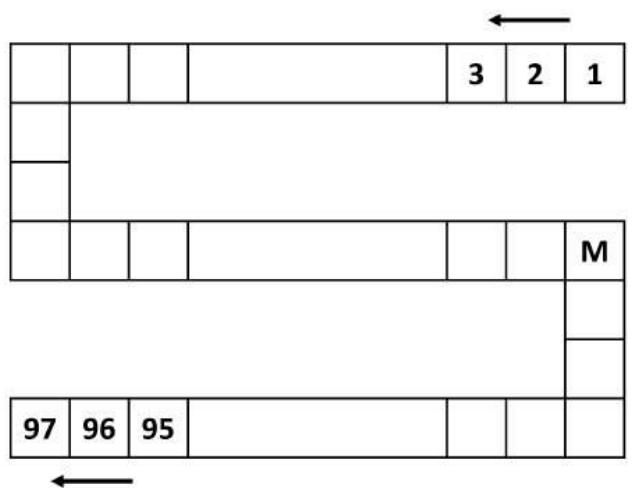

What number does M represent? 

End of Paper 

## SEAMO 2018

## Paper A – Answers

## Multiple-Choice Questions

Questions 1 to 10 carry 3 marks each. 

<table><tr><td>Q1</td><td>Q2</td><td>Q3</td><td>Q4</td><td>Q5</td></tr><tr><td>C</td><td>E</td><td>C</td><td>D</td><td>B</td></tr></table>

<table><tr><td>Q6</td><td>Q7</td><td>Q8</td><td>Q9</td><td>Q10</td></tr><tr><td>E</td><td>B</td><td>A</td><td>D</td><td>C</td></tr></table>

Questions 11 to 20 carry 4 marks each. 

<table><tr><td>Q11</td><td>Q12</td><td>Q13</td><td>Q14</td><td>Q15</td></tr><tr><td>D</td><td>A</td><td>C</td><td>B</td><td>A</td></tr></table>

<table><tr><td>Q16</td><td>Q17</td><td>Q18</td><td>Q19</td><td>Q20</td></tr><tr><td>D</td><td>B</td><td>D</td><td>C</td><td>C</td></tr></table>

## Free-Response Questions

Questions 21 to 25 carry 6 marks each. 

<table><tr><td>21</td><td>22</td><td>23</td><td>24</td><td>25</td></tr><tr><td>225</td><td>WEDNESDAY</td><td>128</td><td>624</td><td>64</td></tr></table>