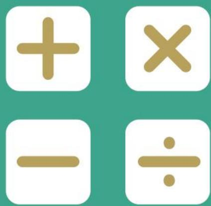
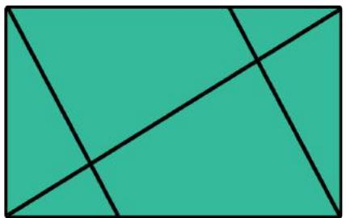
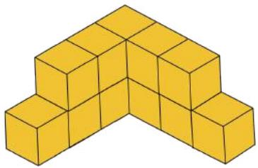
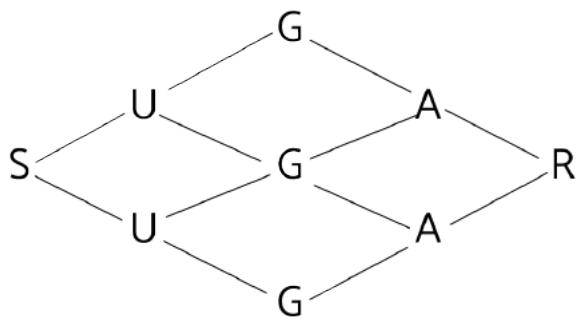
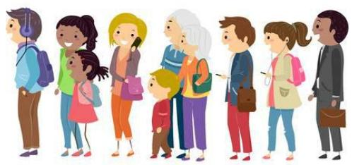
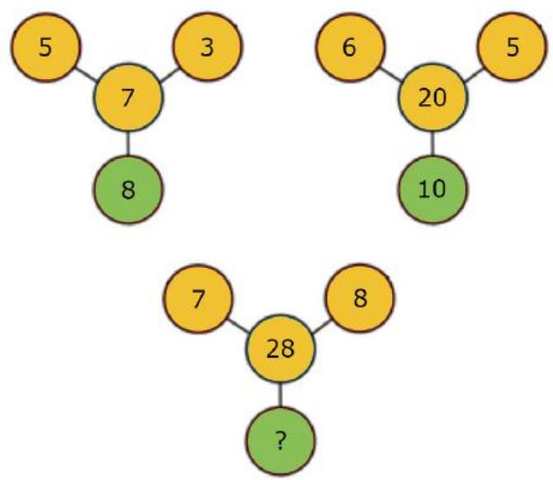
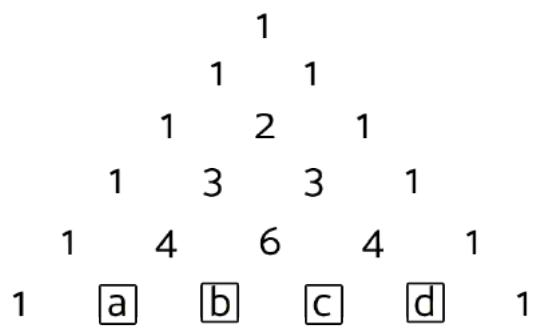
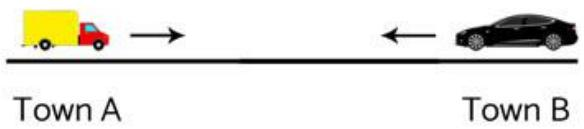

## PAPER

## SEAMO

Southeast Asian 

Mathematical 

Olympiad 

## DO NOT OPEN THIS BOOKLET UNTIL INSTRUCTED.

## STUDENT'SNAME:

Read the instructions on the ANswer sheeTand fillin your NAME,SCHOOLandOTHERINFORMATION. 

Usea2B orBpencil. 

Do NOTuseapen 

Ruboutanymistakescompletely. 

You MUsTrecord your answers on the ANsweR SHEET. 

## LOWER PRIMARY

Markonlyoneanswerforeachquestion. 

MarksareNoTdeducted forincorrectanswers. 

## QUESTIONS1TO20

Use the information provided to choose the BEsTanswer fromthefivepossible options. 

Onyour ANsWER SHEET shade the option that matches youranswer. 

## QUESTIONS21TO 25

On your ANswER sHEETwrite your answer within the box provided.Unitsarenotrequired. 

YouareNotallowed touseacalculator. 

# QUESTIONS 1 TO 10 ARE WORTH 3 MARKS EACH

1. How many triangles are there in the figure below? 

(A) 2 

(B) 4 

(C) 6 

(D) 10 

(E) 12 

2. Find the next number in the sequence. 

$$
1, 5, 6, 1 1, 1 7, 2 8, 4 5, (), \dots
$$

(A) 63 

(B) 64 

(C) 73 

(D) 75 

(E) None of the above 

3. Evaluate the following. 

$$
\begin{array}{l} 2 8 + 3 0 + 3 2 + 3 4 + 3 6 \\ - (2 7 + 2 9 + 3 1 + 3 3 + 3 5) \\ \end{array}
$$

(A) 3 

(B) 5 

(C) 7 

(D) 9 

(E) 11 

4. Given that 

$$
ⓧ + \Delta + \square = 1 2
$$

$$
ⓧ \times \Delta = 1 2
$$

$$
\Delta + 1 = \square
$$

Find the value of ⊛. 

(A) 2 

(E) 6 

5. How many cubes are there in the figure below? 

(A) 12 

(B) 13 

(C) 14 

(D) 15 

(E) None of the above 

6. A farmer bought 37 ducks and geese. There were 35 more ducks than geese. 

If the farmer wants the number of ducks to be twice the number of geese, how many geese should he buy? 

(A) 2 

(B) 7 

(C) 17 

(D) 18 

(E) None of the above 

7. Tom has to paint a 46 7 long fence. On the 1st day, he paints 10 7 of it. Each day after that, he paints 1 7 less than the day before. 

How many days does it take him to finish painting the fence? 

(A) 4 

(B) 5 

(C) 6 

(D) 7 

(E) 8 

8. How many ways are there to spell the word “SUGAR”? 

(A) 3 

(B) 5 

(C) 6 

(D) 9 

(E) 10 

9. There are 7 red, 9 white and 3 black balls in a box. What is the minimum number of balls you have to take out to ensure you have at least 1 white ball? 

(A) 9 

(B) 10 

(C) 11 

(D) 12 

(E) 13 

10. While queuing for the latest iPhone, Cassie realizes she is the 12th person from the front and 5th from the back. How many people are in the queue? 

(A) 16 

(B) 17 

(C) 18 

(D) 19 

(E) 20 

## QUESTIONS 11 TO 20 ARE WORTH 4 MARKS EACH

11. Find the missing number in the number puzzle below. 

(A) 8 

(B) 13 

(C) 14 

(D) 17 

(E) 28 

12. 8 years ago, I was twice as old as my brother. If my brother is now 14, how old am I now? 

(A) 18 

(B) 20 

(C) 22 

(D) 24 

(E) None of the above 

13. Given that 

<table><tr><td></td><td>A</td><td>B</td></tr><tr><td></td><td>A</td><td>B</td></tr><tr><td>+</td><td>A</td><td>B</td></tr><tr><td>1</td><td>6</td><td>8</td></tr></table>

What is the value of <? 

(A) 3 

(B) 4 

(C) 5 

(E) None of the above 

14. Given that ⊠ , ⊛ , △ and ⋇ are all 1-digit numbers and 

$$
\boxtimes \times 3 = \circledast
$$

$$
ⓧ \times 2 = \Delta
$$

$$
\Delta \times * = 2 4
$$

Find the value of ⊠. 

(A) 1 

(B) 2 

(C) 3 

(D) 4 

(E) 5 

15. A number pyramid is shown below. 

Evaluate 8 + 9 + : + ;. 

(A) 15 

(B) 20 

(C) 25 

(D) 30 

(E) 35 

16. There are 20 chickens and cows altogether on a farm. The farmer counts 48 legs from both chickens and cows. How many more chickens than cows are there? 

(A) 8 

(B) 9 

(C) 10 

(D) 11 

(E) 12 

17. What is the 30th number in the number pattern below? 

$$
_ {1, 4, 7, 9, 1, 4, 7, 9, 1, 4, \dots}
$$

(A) 1 

(B) 4 

(E) None of the above 

18. Jim bought 3 erasers and 4 pens for $ 5.35 . Pam bought 1 eraser and 2 pens for $ 2.35. 

How much did 1 eraser and 1 pen cost? 

(A) $ 1.35 

(B) $ 1.40 

(C) $ 1.50 

(D) $ 1.80 

(E) None of the above 

19. A new operation is defined as: 

$$
2 \odot 4 = 1 2
$$

$$
3 \odot 5 = 1 6
$$

$$
2 \odot 8 = 2 0
$$

Find the value of 6 ⊙ 9. 

(A) 10 

(B) 15 

(C) 20 

(D) 25 

(E) 30 

20. The digits 2, 5 and 8 can be used to form 6 different 2-digit numbers such as 25, 28, … 

What is the difference between the smallest and largest numbers that can be formed? 

(A) 42 

(B) 44 

(C) 48 

(D) 60 

(E) None of the above 

## QUESTIONS 21 TO 25 ARE WORTH 6 MARKS EACH

21. Arrange the numbers 1 to 9 in the boxes below, such that each row, column and diagonal have the same sum. 

<table><tr><td></td><td></td><td></td></tr><tr><td></td><td>m</td><td></td></tr><tr><td></td><td></td><td></td></tr></table>

What is the value of 7? 

22. Ahmed works for 2 days then takes a day off. 

He repeats this cycle of working and taking a day off continuously every week. 

On Week 27, he took a day off on a Monday. 

On which week will he next take a day off on a Monday? 

23. Three children are asked if they can swim. 

Aaron: “I can swim.” 

Bertha: ”Aaron lied.” 

Cindy: “Both Aaron and Bertha lied.” 

If only one child tells the truth, which of them can swim? 

24. It is known that B89BB is a 2-digit number. 

By writing “1” behind it, it becomes a 3-digit number B89BBB 1B. 

By writing “1” in front, it becomes another 3-digit number B1B89BBB. 

Given that the difference between 89BBBB 1B and 1BB89BBB is 414, which digit does 9 represent? 

25. The distance between Town A and Town B was 650 km. 

At 9:00 AM, a truck left Town A and started travelling to Town B. At the same time, a car left Town B and started travelling to Town A. 

The truck travelled a distance of 60 km in 1 hour and the car travelled a distance of 70 km in 1 hour. 

At what time did the 2 vehicles pass each other? 

End of Paper 

## SEAMO 2019

## Paper A – Answers

## Multiple-Choice Questions

Questions 1 to 10 carry 3 marks each. 

<table><tr><td>Q1</td><td>Q2</td><td>Q3</td><td>Q4</td><td>Q5</td></tr><tr><td>D</td><td>C</td><td>B</td><td>B</td><td>A</td></tr></table>

<table><tr><td>Q6</td><td>Q7</td><td>Q8</td><td>Q9</td><td>Q10</td></tr><tr><td>C</td><td>D</td><td>C</td><td>C</td><td>A</td></tr></table>

Questions 11 to 20 carry 4 marks each. 

<table><tr><td>Q11</td><td>Q12</td><td>Q13</td><td>Q14</td><td>Q15</td></tr><tr><td>E</td><td>B</td><td>C</td><td>A</td><td>D</td></tr></table>

<table><tr><td>Q16</td><td>Q17</td><td>Q18</td><td>Q19</td><td>Q20</td></tr><tr><td>E</td><td>B</td><td>C</td><td>E</td><td>D</td></tr></table>

## Free-Response Questions

Questions 21 to 25 carry 6 marks each. 

<table><tr><td>21</td><td>22</td><td>23</td><td>24</td><td>25</td></tr><tr><td>5</td><td>30</td><td>Aaron</td><td>7</td><td>2:00 PM</td></tr></table>