## PAPER A

## SEAMO

Southeast Asian Mathematical Olympiad 

## DO NOT OPEN THIS BOOKLET UNTIL INSTRUCTED.

STUDENT'SNAME: 

Read the instructions on the ANsWER sHEETand fillin your NAME,SCHOOLandOTHERINFORMATION. 

Usea2B orBpencil. 

DoNOTuseapen 

Ruboutanymistakescompletely. 

You MUsT record youranswers on the ANswER SHEET. 

## LOWER PRIMARY

MarkonlyoNEanswer foreach question. 

MarksareNoTdeducted for incorrectanswers. 

## QUESTIONS 1 TO 20

Usetheinformation providedto choose the BesTanswer from thefivepossible options. 

On your ANsweR sHeET shade the option thatmatches youranswer. 

## QUESTIONS 21 TO 25

Onyour ANsWER SHEETwrite your answer within the box provided.Unitsare not required. 

Youare NoTallowed to useacalculator. 

## QUESTIONS 1 TO 10 ARE WORTH 3 MARKS EACH

1. How many triangles are there altogether? 

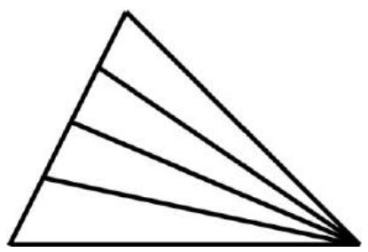

(A) 4 

(B) 6 

(C) 8 

(D) 9 

(E) 10 

2. How many rabbits are equivalent to a bull? 

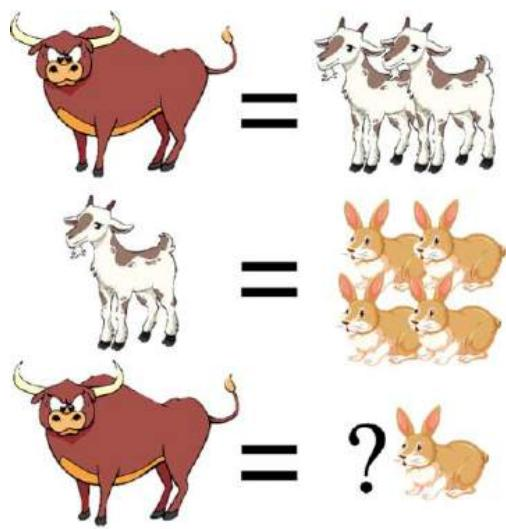

(A) 5 

(B) 6 

(C) 7 

(D) 8 

(E) 9 

3. Find the sum 

$$
1 + 2 + 3 + 4 + \dots + 1 1 + 1 2
$$

(A) 60 

(B) 64 

(C) 68 

(D) 72 

(E) 78 

4. Find the perimeter of the figure below. 

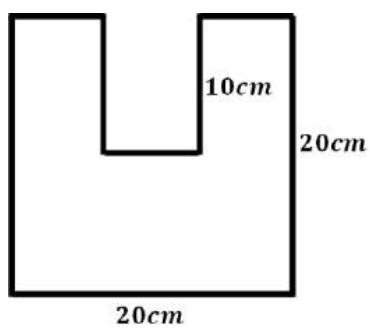

(A) 90 cm 

(B) 100 cm 

(C) 110 cm 

(D) 120 cm 

(E) 130 cm 

5. How many cubes are there in the model below? 

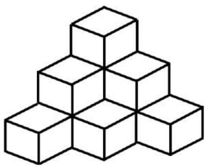

(A) 8 

(B) 9 

(C) 10 

(D) 11 

(E) 12 

6. There are 10 ostriches and goats on a farm. An ostrich has 2 legs while a goat has 4 legs. The farmer counts 32 legs in total. 

How many goats are there on the farm? 

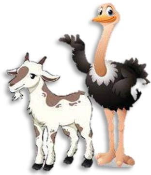

(A) 6 

(B) 7 

(C) 8 

(D) 11 

(E) 12 

7. It is given that 

$$
2 * 3 = 1 0
$$

$$
3 * 4 = 2 1
$$

$$
4 * 5 = 3 6
$$

Find the value of 5 ∗ 6. 

(A) 44 

(B) 55 

(C) 66 

(D) 70 

(E) 77 

8. What is the time in Figure 4? 

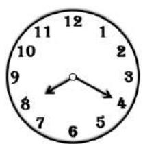

Figure 1

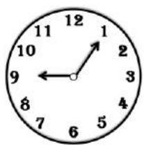

Figure 2

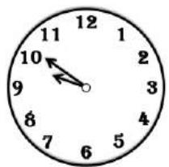

Figure 3

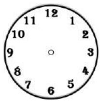

Figure 4

(A) 10:20 AM 

(B) 10:25 AM 

(C) 10:30 AM 

(D) 10:35 AM 

(E) None of the above 

9. Find the missing number. 

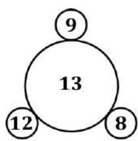

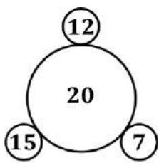

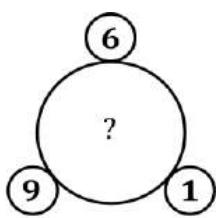

(A) 12 

(B) 13 

(C) 14 

(D) 15 

(E) 16 

10. From left to right, which operations should replace the ‘ ? ’ to make the equation correct? 

$$
4? 4? 4? 4? 4 = 2
$$

(A) × ÷ + − 

(B) − ÷ − ÷ 

(C) × + ÷ − 

(D) × × − − 

(E) $\times \times + +$ 

## QUESTIONS 11 TO 20 ARE WORTH 4 MARKS EACH

11. In the sum below, each letter represents a digit. What is the digit represented by ‘A’? 

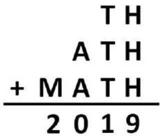

(A) 4 

(B) 5 

(C) 6 

(D) 7 

(E) 8 

12. A single cut can divide a cake into 2 pieces. Two cuts can divide it into 4 pieces. What is the most pieces of cake you can get with three cuts? 

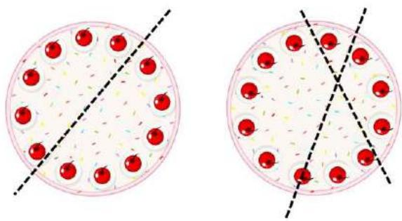

(A) 6 

(B) 7 

(C) 9 

(D) 10 

(E) 11 

13. Which of the numbers listed below are not divisible by 7? 

21, 35, 63, 45, 70, 17 

(A) 35 and 70 

(B) 35 and 63 

(C) 63 and 45 

(D) 45 and 17 

(E) None of the above 

14. Find the missing letter. 

$$
Z, U, P, K, (\quad), \dots
$$

(A) ?? 

(B) ?? 

(C) ?? 

(D) ?? 

(E) ?? 

15. An archer shoots five arrows at the target board without missing. Points scored depend on where the arrow lands. How many points did the archer score in total? 

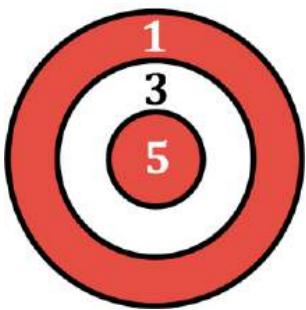

(A) 6 

(B) 10 

(C) 15 

(D) 18 

(E) 22 

16. How many ways are there for the postman to deliver the letter to the house by passing through Point A if he has to move along the same route as shown by the arrows? 

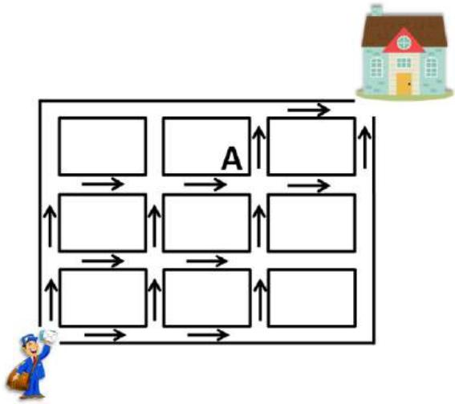

(A) 9 

(B) 10 

(C) 11 

(D) 12 

(E) 14 

17. Some students gathered in the hall. They were then asked to stand in a rectangular grid formation. 

James observes that there are 3 students in front of him and 1 student behind him. There are 5 students to his left and 3 students to his right. 

How many students are there in the hall? 

(A) 45 

(B) 50 

(C) 55 

(D) 60 

(E) None of the above 

18. A hound runs 60 metres in 4 seconds. A rabbit runs 20 metres in 2 seconds. The rabbit is 30 metres in front of the hound. 

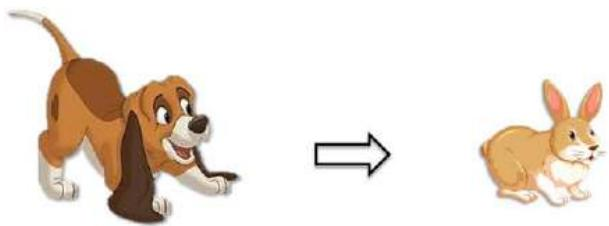

How many seconds does the hound take to catch up with the rabbit? 

(A) 3 

(B) 4 

(C) 5 

(D) 6 

(E) None of the above 

19. Which two balls, one from Group A and one from Group B, should be switched such that the sum of the numbers in both groups is the same? 

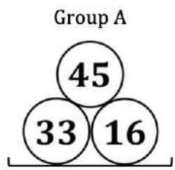

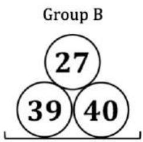

(A) 45 with 40 

(B) 33 with 39 

(C) 33 with 27 

(D) 45 with 39 

(E) None of the above 

20. If Mark buys 3 bottles of water, he will have $1.00 left. If he buys 5 bottles of water, he is short of $5.00. How much is a bottle of water? 

(A) $1.00 

(B) $1.50 

(C) $2.00 

(D) $2.50 

(E) $3.00 

## QUESTIONS 21 TO 25 ARE WORTH 6 MARKS EACH

21. In your Answer Sheet, fill the circles with numbers 1 to 7 so that the sum of numbers along each line is 12. 

You may only use each number once. 

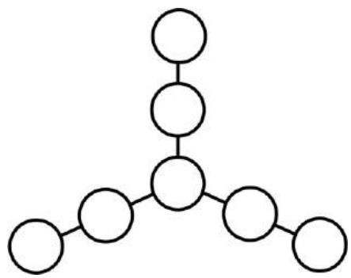

22. A series of geometric patterns is shown below. 

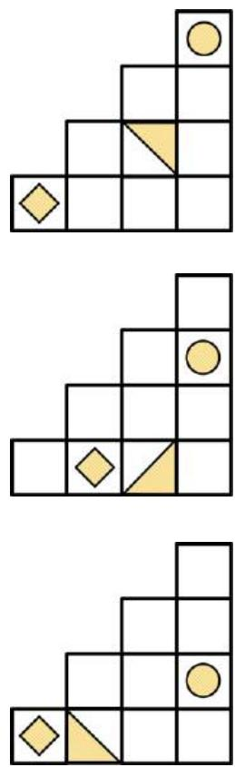

Draw the next pattern in your Answer Sheet. 

23. Dots are used to form a series of patterns as shown below. 

Find the number of dots in Figure 8. 

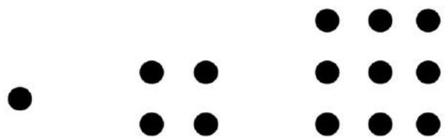

Figure1

Figure2

Figure3

24. Cindy had $45 at first. Diane had $62 at first. 

Their mum gave them $70 to share. After they split the money, Diane has twice as much money as Cindy. 

How much money did Diane receive? 

25. Odd numbers are numbers that cannot be divided by 2. 

Examples of odd numbers include: 1, 3, 5, 7, 9, 11, 13, 15, 17, … 

At the start, there are 20 students standing in a row. Each student is assigned a number in order 1, 2, 3, … consecutively from left to right. 

The students who are assigned an odd number are asked to sit. 

The students who remain standing are then assigned new numbers 1, 2, 3, … in consecutive order again. Then, those with odd numbers are asked to sit. 

This process continues until Roy was the only one left standing. 

What was the first number that was assigned to Roy at the start? 

## SEAMO 2020

## Paper A – Answers

## Multiple-Choice Questions

Questions 1 to 10 carry 3 marks each. 

<table><tr><td>Q1</td><td>Q2</td><td>Q3</td><td>Q4</td><td>Q5</td></tr><tr><td>E</td><td>D</td><td>E</td><td>B</td><td>C</td></tr></table>

<table><tr><td>Q6</td><td>Q7</td><td>Q8</td><td>Q9</td><td>Q10</td></tr><tr><td>A</td><td>B</td><td>D</td><td>C</td><td>B</td></tr></table>

Questions 11 to 20 carry 4 marks each. 

<table><tr><td>Q11</td><td>Q12</td><td>Q13</td><td>Q14</td><td>Q15</td></tr><tr><td>A</td><td>B</td><td>D</td><td>C</td><td>C</td></tr></table>

<table><tr><td>Q16</td><td>Q17</td><td>Q18</td><td>Q19</td><td>Q20</td></tr><tr><td>D</td><td>A</td><td>D</td><td>B</td><td>E</td></tr></table>

## Free-Response Questions

Questions 21 to 25 carry 6 marks each. 

<table><tr><td>21</td><td>22</td><td>23</td><td>24</td><td>25</td></tr><tr><td>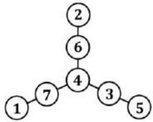</td><td>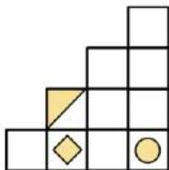</td><td>64</td><td>56</td><td>16</td></tr></table>