## PAPER A

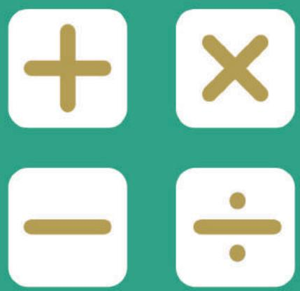

## SEAMO

Southeast Asian Mathematical Olympiad 

## DO NOT OPEN THIS BOOKLET UNTIL INSTRUCTED.

STUDENT'SNAME: 

Read the instructions on the ANsWER sHEETand fillin your NAME,SCHOOLandOTHERINFORMATION. 

Usea2BorBpencil. 

DoNoTuseapen 

Ruboutanymistakes completely. 

You MUsT record youranswers on the ANswER SHEET. 

## LOWER PRIMARY

Mark onlyoNEanswer foreach question. 

MarksareNoTdeducted for incorrectanswers. 

## QUESTIONS 1TO 20

Usetheinformation providedto choose the BesTanswer from thefive possible options. 

On your ANsweR sHeET shade the option thatmatches youranswer. 

## QUESTIONS 21 TO 25

Onyour ANsWER SHEETwrite your answer within the box provided.Unitsare not required. 

YouareNoTallowedtouseacalculator. 

## QUESTIONS 1 TO 10 ARE WORTH 3 MARKS EACH

## 1. Find the sum of

$$
1 1 + 1 2 + 1 3 + \dots + 1 7 + 1 8 + 1 9
$$

(A) 120 

(B) 125 

(C) 130 

(D) 135 

(E) 140 

## 2. Find the number of cubes in the figure below.

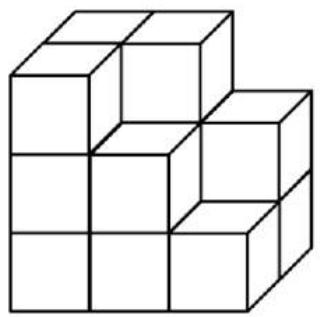

(A) 12 

(B) 13 

(C) 14 

(D) 15 

(E) 16 

## 3. Find the missing numbers ? and ?.

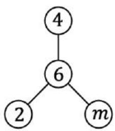

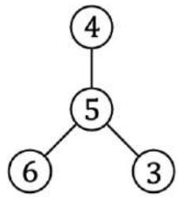

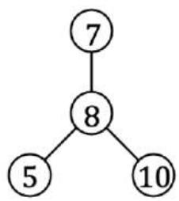

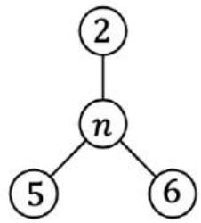

(A) 7 and 8 

(B) 8 and 9 

(C) 8 and 8 

(D) 7 and 9 

(E) 10 and 3 

## 4. This year, Grandpa is 56 years old, Dad is 31 years old, and I am 7 years old. In how many years will the sum of our ages be 100?

(A) 1 

(B) 2 

(C) 3 

(D) 4 

(E) 5 

5. Find the missing number. 

2, 2, 4, 6, 10, 16, ( ), 42 

(A) 24 

(B) 25 

(C) 26 

(D) 28 

(E) 30 

6. Which of the following comes next? 

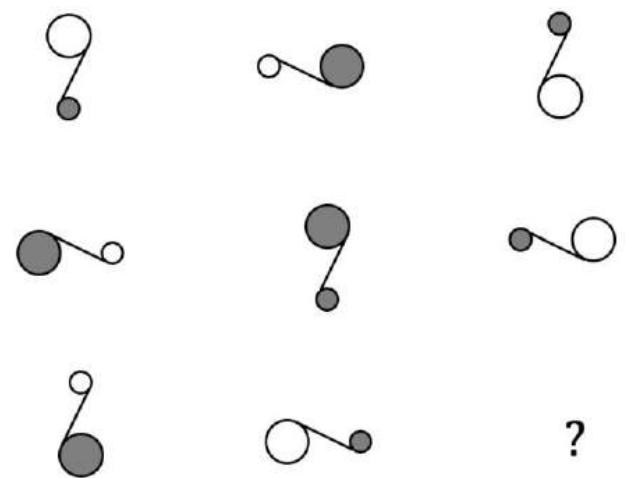

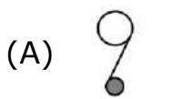

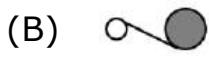

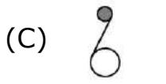

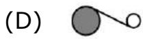

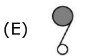

7. Wattaria is putting coins along the 3 sides of the triangle, such that there are 6 coins on each side of the triangle. How many coins are there in total? Use the figure provided to help you. 

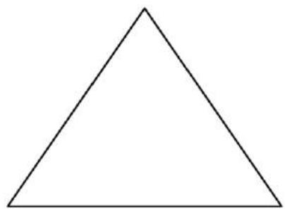

(A) 15 

(B) 16 

(C) 17 

(D) 18 

(E) 19 

8. There are 18 children in a party. Each girl gets 5 balloons, while each boy gets 3 balloons. If 72 balloons are given out in all, how many boys are there? 

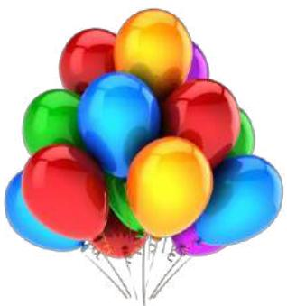

(A) 6 

(B) 7 

(C) 8 

(D) 9 

(E) 10 

9. Fill in each circle with a number from 2, 5, 6 and 7, such that the sum of the 3 numbers along each line is 18. What is ?? 

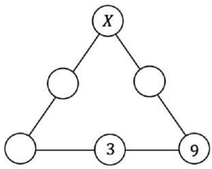

(A) 2 

(B) 5 

(C) 6 

(D) 7 

(E) None of the above 

10. Postman Pat is delivering a parcel from Point ? to Point ? , where his movements can only be in the directions → and ↑ . How many different paths can he take? 

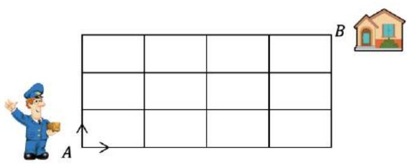

(A) 33 

(B) 34 

(C) 35 

(D) 36 

(E) 40 

## QUESTIONS 11 TO 20 ARE WORTH 4 MARKS EACH

11. How many triangles are there in the figure below? 

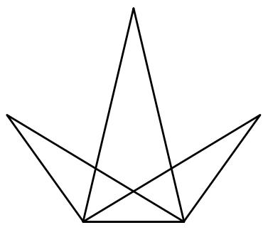

(A) 14 

(B) 15 

(C) 16 

(D) 17 

(E) 18 

12. Susan adds up 8 of the following numbers. Given that the result is 400, which number did she leave out? 

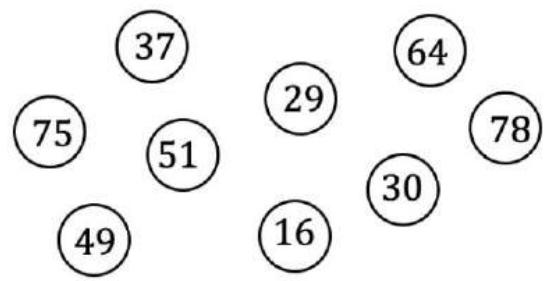

(A) 75 

(B) 16 

(C) 64 

(D) 78 

(E) 29 

13. Today is Monday, the 9th of August. On which day of the week is the 9th of September? 

(A) Tuesday 

(B) Wednesday 

(C) Thursday 

(D) Friday 

(E) Saturday 

14. Lily wrote the following on a piece of paper 

$$
\begin{array}{l} 1 \quad 2 \quad 3 \quad 4 \quad 5 \quad 6 \quad 7 \quad 8 \quad 9 \quad 1 \quad 0 \end{array}
$$

$$
\begin{array}{l} 1 1 1 2 \dots 7 8 7 9. \end{array}
$$

How many digits did she write altogether? 

(A) 130 

(B) 132 

(C) 140 

(D) 145 

(E) 149 

15. Find the missing number. 

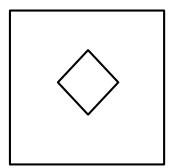

41

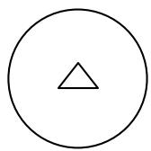

23

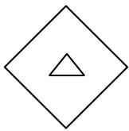

13

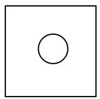

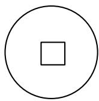

?

(A) 42 

(B) 32 

(C) 31 

(D) 24 

(E) 14 

16. Perimeter is defined as the total length of the outline of a shape. 

For example, in the following figure, 

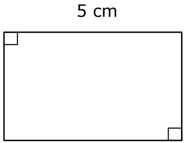

3 cm

The perimeter of the rectangle is 

$$
5 \times 2 + 3 \times 2 = 1 6 \mathrm{cm}
$$

Find the perimeter 

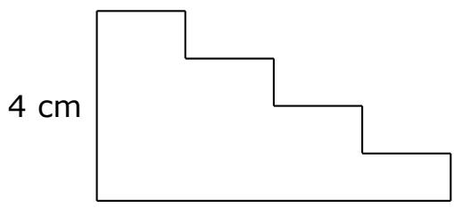

7 cm

(A) 21 cm 

(B) 22 cm 

(C) 24 cm 

(D) 26 cm 

(E) 28 cm 

17. Find the sum of first 42 numbers in 

$$
\begin{array}{l} 2, \quad 4, \quad 6, \quad 2, \quad 4, \quad 6, \quad 2, \quad 4, \quad 6, \dots \end{array}
$$

(A) 168 

(B) 164 

(C) 162 

(D) 160 

(E) 172 

18. What comes next? 

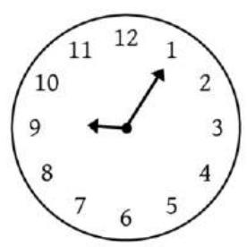

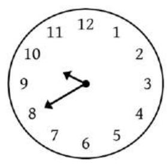

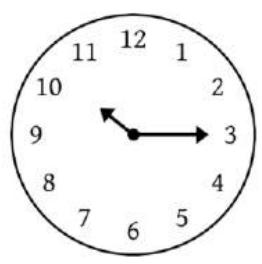

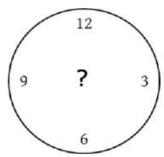

(A) 11.45 a.m. 

(B) 11.50 a.m. 

(C) 10.50 a.m. 

(D) 11.00 a.m. 

(E) 10.55 a.m. 

19. Mummy gave Mink some money. Mink spent $5.00 on a book. Her father gave her another $10.00. After paying $2.50 for a drink and $1.70 for some fries, she was left with $23.80. How much did Mummy give Mink at first? 

(A) $21.80 

(B) $22.00 

(C) $22.50 

(D) $22.80 

(E) $23.00 

20. Given that the digits R, I, C and E are all odd, what is the value of C? 

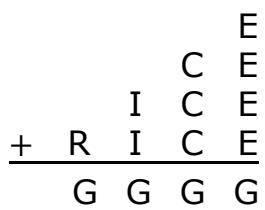

(A) 1 

(B) 3 

(C) 5 

(D) 7 

(E) 9 

## QUESTIONS 21 TO 25 ARE WORTH 6 MARKS EACH

21. Find the sum of the $9 ^ { \mathrm { t h } }$ row in the number pyramid below. 

$$
1 + 2 + 1 = 4
$$

$$
1 + 2 + 3 + 2 + 1 = 9
$$

$$
1 + 2 + 3 + 4 + 3 + 2 + 1 = 1 6
$$

$$
1 + 2 + 3 + 4 + 5 + 4 + 3 + 2 + 1 = 2 5
$$

22. Find the mass of one apple in grams. 

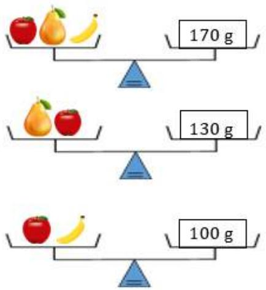

23. How many 4-digit numbers can be formed using the digits 0, 1, 2 and 3 without repeating any of the digits? 

24. How many dots are there in the $1 0 ^ { \mathrm { t h } }$ pattern? 

(1)

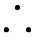

(2)

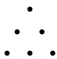

(3)

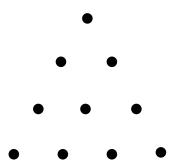

(4)

25. In Mathematics, 

$$
a ^ {2} = a \times a
$$

$$
a ^ {3} = a \times a \times a
$$

$$
a ^ {4} = a \times a \times a \times a
$$

Find the difference between $2 ^ { 5 }$ and $3 ^ { 3 }$ . 

End of Paper 

## SEAMO 2021

## Paper A – Answers

## Multiple-Choice Questions

Questions 1 to 10 carry 3 marks each. 

<table><tr><td>Q1</td><td>Q2</td><td>Q3</td><td>Q4</td><td>Q5</td></tr><tr><td>135</td><td>14</td><td>8 and 9</td><td>2</td><td>26</td></tr></table>

<table><tr><td>Q6</td><td>Q7</td><td>Q8</td><td>Q9</td><td>Q10</td></tr><tr><td></td><td>15</td><td>9</td><td>7</td><td>35</td></tr></table>

Questions 11 to 20 carry 4 marks each. 

<table><tr><td>Q11</td><td>Q12</td><td>Q13</td><td>Q14</td><td>Q15</td></tr><tr><td>14</td><td>29</td><td>Thursday</td><td>149</td><td>24</td></tr></table>

<table><tr><td>Q16</td><td>Q17</td><td>Q18</td><td>Q19</td><td>Q20</td></tr><tr><td>22</td><td>168</td><td>10.50 a.m.</td><td>$23.00</td><td>7</td></tr></table>

## Free-Response Questions

Questions 21 to 25 carry 6 marks each. 

<table><tr><td>21</td><td>22</td><td>23</td><td>24</td><td>25</td></tr><tr><td>100</td><td>60</td><td>18</td><td>55</td><td>5</td></tr></table>