## PAPER A H

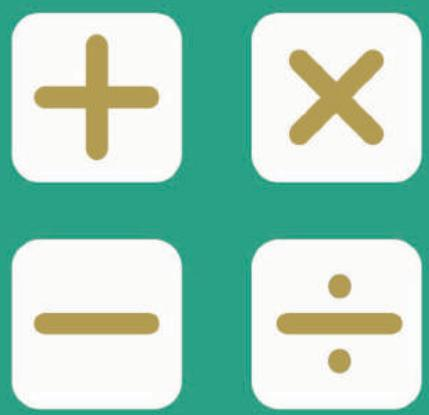

## SEAMO

Southeast Asian Mathematical Olympiad 

## DO NOT OPEN THIS BOOKLET UNTIL INSTRUCTED.

## STUDENT'SNAME:

Read the instructions on the ANsWER sHEETand fillin your NAME,SCHOOLandOTHER INFORMATION. 

Usea2B orBpencil. 

DoNOTuseapen 

Ruboutanymistakescompletely. 

You MUsTrecord your answers on the ANswER SHEET. 

## LOWER PRIMARY

MarkonlyoNEanswerforeachquestion. 

Marksare NoTdeducted forincorrectanswers. 

## QUESTIONS 1TO 20

Use the information provided to choose the BEsTanswer from thefivepossible options. 

On your ANsweR sHeET shade the option that matches youranswer. 

## QUESTIONS 21 TO 25

Onyour ANsWER SHEETwrite your answer within the box provided.Unitsarenot required. 

YouareNoTallowed touseacalculator. 

## QUESTIONS 1 TO 10 ARE WORTH 3 MARKS EACH

## 1. Find the value of

$$
9 + 9 9 + 9 9 9
$$

(A) 1107 

(B) 1108 

(C) 1109 

(D) 1110 

(E) None of the above 

## 2. Find the missing number in Figure 3.

Figure 1

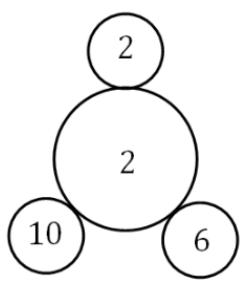

Figure 2

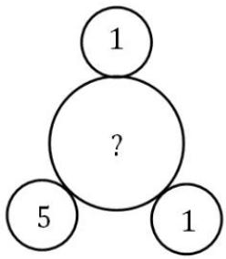

Figure3

(A) 1 

(B) 2 

(C) 3 

(D) 4 

(E) 5 

## 3. Find the missing numbers.

$$
1, 2, 4, 7, 1 1, (\quad), (\quad), 2 9, 3 7, \dots
$$

(A) 15, 21 

(B) 16, 22 

(C) 16, 23 

(D) 15, 22 

(E) 17, 24 

## 4. Find the area of the shaded region, in $\mathrm { c m } ^ { 2 }$ .

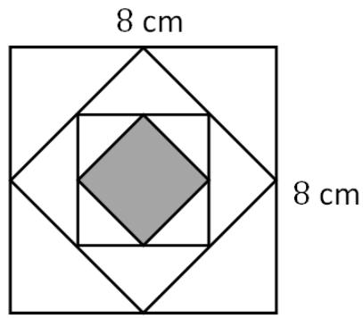

(A) 4 

(B) 6 

(C) 8 

(D) 10 

(E) 12 

## 5. There are 18 chickens and rabbits in a farm. Altogether there are 58 legs. How many rabbits are there?

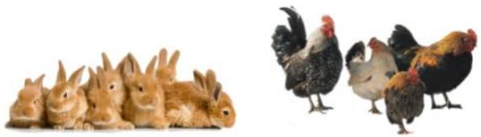

(A) 8 

(B) 9 

(C) 10 

(D) 11 

(E) 12 

6. The perimeter of a figure is found by measuring the total length of its outline. Each figure below is made up of 6 small rectangles. Which of the following statements is TRUE? 

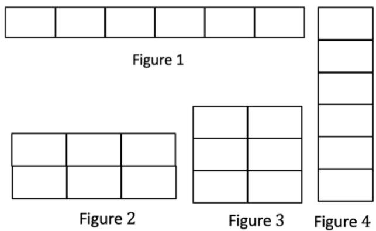

(A) Figure 1 and Figure 4 have the same perimeter. 

(B) Figure 2 and Figure 3 have the same perimeter. 

(C) Figure 1 has the largest perimeter. 

(D) Figure 3 has the largest perimeter. 

(E) Figure 4 has the largest perimeter. 

7. Mark saw the reflection of an old clock. What was the actual time? 

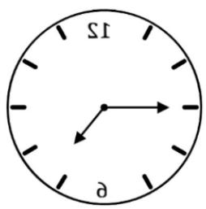

(A) 2.35 pm 

(B) 3.15 pm 

(C) 4.15 pm 

(D) 4.45 pm 

(E) None of the above 

8. How many squares are there altogether in the figure below? 

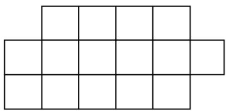

(A) 15 

(B) 19 

(C) 23 

(D) 24 

(E) 25 

9. Find the value of 

$$
1 - 2 + 3 - 4 + 5 - 6 + \dots - 2 0 + 2 1
$$

(A) 11 

(B) 13 

(C) 15 

(D) 17 

(E) 21 

10. Find the 3-digit number ??? ̅̅̅̅̅̅ , such that 

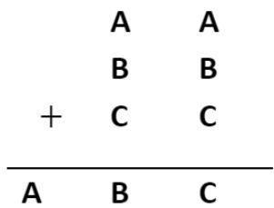

(A) 196 

(B) 197 

(C) 198 

(D) 199 

(E) 200 

## QUESTIONS 11 TO 20 ARE WORTH 5 MARKS EACH

11. How many shortest paths are there from ? to ? ? Follow the direction of the arrows. 

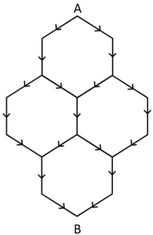

(A) 5 

(B) 6 

(C) 7 

(D) 8 

(E) 9 

12.The sum of dates of all Wednesdays in a certain month is 66 . On which day of the week was the 1st day of the month? 

<table><tr><td>Sun</td><td>Mon</td><td>Tue</td><td>Wed</td><td>Thu</td><td>Fri</td><td>Sat</td></tr><tr><td></td><td></td><td></td><td></td><td></td><td></td><td></td></tr><tr><td></td><td></td><td></td><td></td><td></td><td></td><td></td></tr><tr><td></td><td></td><td></td><td></td><td></td><td></td><td></td></tr><tr><td></td><td></td><td></td><td></td><td></td><td></td><td></td></tr></table>

(A) Monday 

(B) Tuesday 

(C) Wednesday 

(D) Thursday 

(E) Friday 

13.Each circle represents a number. The number in the last circle is shown below. What is the number in the 1st circle? 

$$
Ⓩ + 6 \bigcirc \xrightarrow {\times 6} \bigcirc - 6 \bigcirc \div 6 ⓑ
$$

(A) 5 

(B) 4 

(C) 3 

(D) 2 

(E) 1 

14.There are 5 black, 3 orange and 4 red balls in a bag. Without looking into the bag, how many balls must Shawn take so he will have at least 1 ball of each colour? 

(A) 8 

(B) 9 

(C) 10 

(D) 11 

(E) 12 

15. There are 5 steps to a flight of stairs. Chatdanai can take 1 or 2 steps up at a time. How many ways are there for him to do so? 

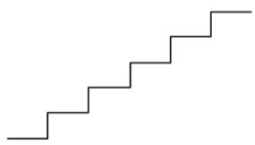

(A) 7 

(B) 8 

(C) 9 

(D) 10 

(E) 12 

16. The teacher has a bag of sweets. If she gives each student 7 sweets, 3 sweets remain. If she gives each student 8 sweets, she needs another 5 sweets. How many sweets does the teacher have? 

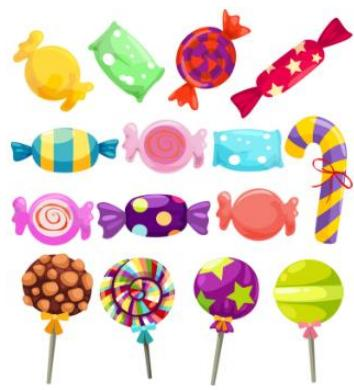

(A) 58 

(B) 59 

(C) 60 

(D) 61 

(E) 62 

17.Find the value of ? in Figure 3. 

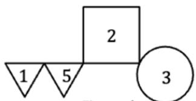

Figure 1

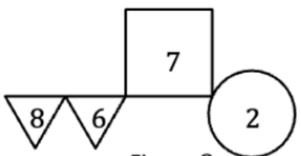

Figure 2

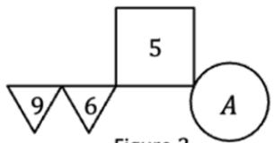

Figure 3

(A) 1 

(B) 2 

(C) 3 

(D) 4 

(E) 5 

18. Put $^ { \mathrm { u } } + \prime ^ { \prime } , \ ^ { \mathrm { u } } - \prime ^ { \prime } , \ ^ { \mathrm { u } } \times \prime ^ { \prime } \ 0 \Gamma ^ { \mathrm { u } } \div \prime \prime$ in the to make the following number statement work. 

$$
3 \bigcirc 3 \bigcirc 3 \bigcirc 3 = 7
$$

(A) − , +, × 

(B) + , − , + 

(C) ×, ×, ÷ 

(D) + , +, ÷ 

(E) − , −, ÷ 

19. It is given: 

$$
\begin{array}{l} \square + \triangle + \bigcirc = 4 8 \\ \square + \triangle + \triangle = 4 7 \\ \square + \square + \triangle = 4 6 \\ \end{array}
$$

Find the value of ◯. 

(A) 15 

(B) 16 

(C) 17 

(D) 18 

(E) 20 

20. A cube has 6 faces. The object shown is made up of 8 cubes. How many cubes will have 4 faces painted if the object is painted yellow? 

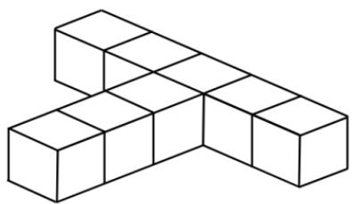

(A) 3 

(B) 4 

(C) 5 

(D) 6 

(E) 7 

## QUESTIONS 21 TO 25 ARE WORTH 6 MARKS EACH

21. Some numbers below have a remainder of 2 when divided by 3 . What is their sum? 

12, 362,135, 28, 94 

71, 29, 83, 125, 142 

22. The swimming coach asked his new students if they can swim. 

Mink: I can swim. 

Kamjai: Mink is lying. 

Chatdanai: Kamjai can swim. 

If one person is lying and only one person can swim, who is the swimmer? 

23. How many chicks have the same weight as ONE rabbit? 

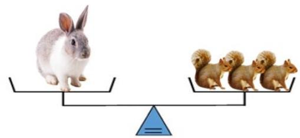

Figure 1

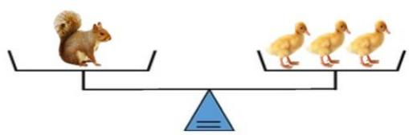

Figure2

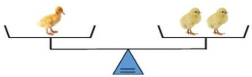

Figure3

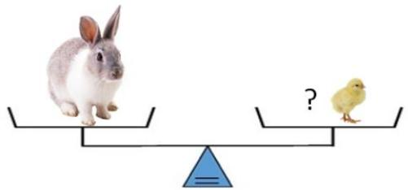

Figure 4

24. Find the value of ✰. 

$$
\star + \star = (\quad)
$$

$$
\star - \star = (\quad)
$$

$$
\star \times \star = (\quad)
$$

$$
\begin{array}{r} + \quad \star \div \star = (\quad) \\ \hline 1 0 0 \end{array}
$$

25. Vivian bought one cheese burger and a pack of French fries for $9.70 . Wendy paid $26.60 for 3 cheese burgers and 2 packs of French fries. How much is a pack of French fries in cents? 

## End of Paper

## SEAMO 2022

## Paper A – Answers

## Multiple-Choice Questions

Questions 1 to 10 carry 3 marks each. 

<table><tr><td>Q1</td><td>Q2</td><td>Q3</td><td>Q4</td><td>Q5</td></tr><tr><td>(A)</td><td>(D)</td><td>(B)</td><td>(C)</td><td>(D)</td></tr></table>

<table><tr><td>Q6</td><td>Q7</td><td>Q8</td><td>Q9</td><td>Q10</td></tr><tr><td>(C)</td><td>(D)</td><td>(D)</td><td>(A)</td><td>(C)</td></tr></table>

Questions 11 to 20 carry 4 marks each. 

<table><tr><td>Q11</td><td>Q12</td><td>Q13</td><td>Q14</td><td>Q15</td></tr><tr><td>(B)</td><td>(E)</td><td>(E)</td><td>(C)</td><td>(B)</td></tr></table>

<table><tr><td>Q16</td><td>Q17</td><td>Q18</td><td>Q19</td><td>Q20</td></tr><tr><td>(B)</td><td>(C)</td><td>(D)</td><td>(C)</td><td>(B)</td></tr></table>

## Free-Response Questions

Questions 21 to 25 carry 6 marks each. 

<table><tr><td>21</td><td>22</td><td>23</td><td>24</td><td>25</td></tr><tr><td>670</td><td>Kamjai</td><td>18</td><td>9</td><td>250</td></tr></table>