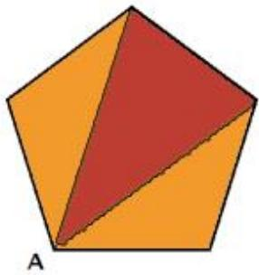
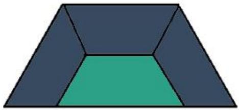

<table><tr><td>QUESTION</td><td>ANSWER</td><td colspan="6">SOLUTION</td></tr><tr><td>1</td><td>E</td><td colspan="6"><eq>4 \times 5 = 20</eq><eq>14 + 6 = 20</eq><eq>3 \times 4 = 12</eq><eq>7 + 5 = 12</eq><eq>12 + 4 = 16</eq><eq>2 \times ? = 16</eq></td></tr><tr><td>2</td><td>C</td><td colspan="6"><eq>3 + 5 + 8 + 4 + 2 + 1 = 23</eq><eq>68 \div 6 = 11 \, rz</eq><eq>23 \times 11 + 3 + 5 = 261</eq></td></tr><tr><td>3</td><td>C</td><td colspan="6"><eq>3 \times 3 + 4 = 13</eq><eq>5 \times 3 + 9 = 24</eq><eq>7 \times 3 + 7 = 28</eq><eq>13 \times 3 + 8 = 47</eq></td></tr><tr><td>4</td><td>B</td><td colspan="6"><eq>1\square: \quad 1</eq><eq>4\square s: \quad 4</eq><eq>9\square s: \quad 4</eq><eq>\underline{16\square s: \quad 1}</eq><eq>10</eq></td></tr><tr><td>5</td><td>E</td><td colspan="6"><eq>66 + 70 + 78 = 214</eq><eq>218 \div 2 = 107</eq><eq>107 - 66 = 41</eq></td></tr><tr><td>6</td><td>A</td><td colspan="6"><eq>48 \times 12 = 576</eq><eq>576 \div 8 = 72</eq><eq>72 - 4 = 68</eq></td></tr><tr><td>7</td><td>E</td><td colspan="6"><eq>15 \times 3 = 45</eq><eq>45 - 15 - 20 = 10</eq></td></tr><tr><td>8</td><td>B</td><td colspan="6"><eq>75 - 1 = 74</eq><eq>74 \div 2 = 37</eq><eq>37 + 1 = 38</eq></td></tr><tr><td>9</td><td>E</td><td colspan="6"><eq>\underline{\text{Red}}</eq> <eq>\underline{\text{White}}</eq> <eq>\underline{\text{Yellow}}</eq> <eq>\underline{\text{Blue}}</eq> <eq>\underline{\text{Black}}</eq><eq>\underline{1}</eq> <eq>\underline{1}</eq> <eq>\underline{1}</eq> <eq>\underline{1}</eq> <eq>\underline{1}</eq><eq>\underline{1}</eq> <eq>\underline{1}</eq> <eq>\underline{1}</eq> <eq>\underline{1}</eq><eq>12 + 10 + 8 + 1 = 31</eq></td></tr><tr><td>10</td><td>D</td><td colspan="6">Total → <eq>380 + 400 + 420 = 1200 \, cm^{2}</eq><eq>1200 - 70 - 80 - 90 = 960 \, cm^{2}</eq><eq>960 + 30 = 990 \, cm^{2}</eq></td></tr><tr><td>11</td><td>D</td><td colspan="6"><eq>5 \times 46 = 230</eq><eq>4 \times 68 = 272</eq><eq>8 \times 55 = 440</eq><eq>230 + 272 - 440 = 62</eq></td></tr><tr><td>12</td><td>E</td><td colspan="6">Let the last number be 25<eq>1 + 2 + 3 + \cdots + 25 = \frac{(1 + 25) \times 25}{2}</eq>= <eq>13 \times 25</eq>= 325<eq>325 - 305 = 20</eq></td></tr><tr><td>13</td><td>B</td><td colspan="6"><eq>3 \times 180 = 540^{\circ}</eq><eq>540^{\circ} = 108^{\circ}</eq></td></tr><tr><td rowspan="4">14</td><td rowspan="4">B</td><td>Power</td><td><eq>2^{1}</eq></td><td><eq>2^{2}</eq></td><td><eq>2^{3}</eq></td><td><eq>2^{4}</eq></td><td><eq>2^{5}</eq></td></tr><tr><td></td><td>2</td><td>4</td><td>8</td><td>6</td><td>2</td></tr><tr><td></td><td>r1</td><td>r2</td><td>r3</td><td>r0</td><td></td></tr><tr><td colspan="6"><eq>222 \div 4 = 55r2</eq>The one digit of <eq>222^{222}</eq> is 4</td></tr><tr><td>15</td><td>C</td><td colspan="6"><eq>\frac{5x}{95} &gt; \frac{57}{95} &gt; \frac{5y}{95}</eq><eq>x = 12, y = 11</eq><eq>x + y = 23</eq></td></tr><tr><td>16</td><td>A</td><td colspan="6"><eq>1 + 2 + 3 + \cdots + 7 = \frac{(1 + 7) \times 7}{2}</eq><eq>= 28</eq><eq>14 \times 3 = 42</eq><eq>42 - 28 = 14</eq><eq>m = 14 \div 2</eq><eq>= 7</eq></td></tr><tr><td>17</td><td>C</td><td colspan="6">If all were answered correctly,<eq>20 \times 7 = 140</eq> marks1 wrong: <eq>4 + 7 = 11</eq> marks1 unattempted = 7 marks<eq>30 = 11 \times 3 + 1 \times 7</eq></td></tr><tr><td>18</td><td>D</td><td colspan="6">Recall Pythagoras Triples: (3, 4, 5), (6, 8, 10), (5, 12, 13) and so on.</td></tr><tr><td>19</td><td>E</td><td colspan="6">The car took <eq>(150 \div 2) \div 60 = 1\frac{1}{4}</eq> h to reach 75 kmThe van took <eq>75 \div 50 = 1\frac{1}{2}</eq>hThe van must leave 15 minutes before the car.</td></tr><tr><td>20</td><td>B</td><td colspan="6">Exam → 10 applesShortage → 6 applesDifference → 6 – 4 = 2 apples<eq>(10 + 6) \div 2 = 8</eq> members in the family<eq>8 \times 6 - 6 = 42</eq><eq>8 \times 4 + 10 = 42</eq></td></tr><tr><td>21</td><td>108</td><td colspan="6"><eq>999999 \times 888888 \times 2 = (1000000 - 1) \times 888888 \times 2</eq><eq>= (888888000000 - 888888) \times 2</eq><eq>= 888887111112 \times 2</eq>There are 6 pairs of <eq>9 = 6 \times 9 \times 2</eq><eq>= 108</eq></td></tr><tr><td>22</td><td>2</td><td colspan="6">Case 1, n = 07m 360m = 2we have 72 360Case 2, n = 57m 365<eq>7 + mr \, 3 + 6 + 5 = 21 + m</eq>m = 6We have 76 360From Case 1, <eq>2 + 0 = 2</eq></td></tr><tr><td>23</td><td>37.5</td><td colspan="6">min hand 1 round → 360°hour hand 1 round→ 360° ÷ 12 = 30°The hour hand → 4 × 30° + <eq>\frac{1}{4}</eq> × 30° = 120° + 7.5°= 127.5°The min hand→ 3 × 30° = 90°The angle is 127.5° – 90° = 37.5°</td></tr><tr><td>24</td><td></td><td colspan="6"></td></tr><tr><td>25</td><td>213</td><td colspan="6">Make a guess\( \begin{array}{c}r1 \\1 \\1 \\1 \\1 \\r1 \\2 \\2 \\2 \\2 \\r1 \\3 \\3 \\3 \\3 \\3 \\13\end{array} \begin{array}{c}r1 \\5 \\5 \\5 \\5 \\5 \\5 \\5 \\5 \\5 \\5 \\5 \\5 \\5 \\5 \\5 \\5 \\5 \\5 \\5 \\5 \\5 \\5 \\5 \\5 \\5 \\5 \\5 \\5 \\5 \\5 \\5 \\5 \\5 \\5 \\5 \\5 \\5 \\5 \\5 \\5 \\5 \\5 \\5 \\5 \\5 \\5 \\5 \\5 \\5 \\5 \\149 \\149 \\149 \\149 \\149 \\149 \\149 \\149 \\149 \\149 \\149 \\149 \\149 \\149 \\149 \\149 \\149 \\149 \\149 \\149 \\149 \\149 \\149 \\149 \\149 \\148 \\148 \\148 \\148 \\148 \\148 \\148 \\148 \\148 \\148 \\148 \\148 \\148 \\148 \\148 \\148 \\148 \\148 \\148 \\148 \\148 \\148 \\148 \\148 \\148 \\147 \\147 \\147 \\147 \\147 \\147 \\147 \\147 \\147 \\147 \\147 \\147 \\147 \\147 \\147 \\147 \\147 \\147 \\147 \\147 \\147 \\147 \\147 \\147 \\147 \\146 \\146 \\146 \\146 \\146 \\146 \\146 \\146 \\146 \\146 \\146 \\146 \\146 \\146 \\146 \\146 \\146 \\146 \\146 \\146 \\146 \\146 \\146 \\146 \\146 \\145 \\145 \\145 \\145 \\145 \\145 \\145 \\145 \\145 \\145 \\145 \\145 \\145 \\145 \\145 \\145 \\145 \\145 \\145 \\145 \\145 \\145 \\145 \\145 \\145 \\144 \\144 \\144 \\144 \\144 \\144 \\144 \\144 \\144 \\144 \\144 \\144 \\144 \\144 \\144 \\144 \\144 \\144 \\144 \\144 \\144 \\144 \\144 \\144 \\144 \\143 \\143 \\143 \\143 \\143 \\143 \\143 \\143 \\143 \\143 \\143 \\143 \\143 \\143 \\143 \\143 \\143 \\143 \\143 \\143 \\143 \\143 \\143 \\143 \\143 \\142 \\142 \\142 \\142 \\142 \\142 \\142 \\142 \\142 \\142 \\142 \\142 \\142 \\142 \\142 \\142 \\142 \\142 \\142 \\142 \\142 \\142 \\142 \\142 \\142 \\141 \\141 \\141 \\141 \\141 \\141 \\141 \\141 \\141 \\141 \\141 \\141 \\141 \\141 \\141 \\141 \\141 \\141 \\141 \\141 \\141 \\141 \\140 \\140 \\140 \\140 \\140 \\140 \\140 \\140 \\140 \\140 \\140 \\140 \\140 \\140 \\140 \\140 \\140 \\140 \\140 \\140 \\140 \\140 \\140 \\140 \\140 \\141 \\141 \\141 \\141 \\141 \\141 \\141 \\141 \\141 \\141 \\141 \\141 \\141 \\141 \\141 \\141 \\141 \\141 \\141 \\141 \\141 \\141 \\141 \\141 \\141 \\140 \\140 \\141 \\142 \\142 \\142 \\142 \\142 \\142 \\142 \\142 \\142 \\142 \\142 \\142 \\142 \\142 \\142 \\142 \\142 \\142 \\142 \\142 \\142 \\142 \\142 \\142 \\140 \\140 \\140 \\140 \\140 \\140 \\140 \\140 \\140 \\140 \\140 \\140 \\140 \\140 \\140 \\140 \\140 \\140 \\140 \\140 \\140 \\140 \\140 \\140 \\142 \\142 \\142 \\142 \\142 \\142 \\142 \\142 \\142 \\142 \\142 \\142 \\142 \\142 \\142 \\142 \\142 \\142 \\142 \\142 \\142 \\142 \\142 \\142 \\143 \\143 \\143 \\143 \\143 \\143 \\143 \\143 \\143 \\143 \\143 \\143 \\143 \\143 \\143 \\143 \\143 \\143 \\143 \\143 \\143 \\143 \\143 \\143 \\140 \\140 \\140 \\140 \\140 \\140 \\140 \\140 \\140 \\140 \\140 \\140 \\140 \\140 \\140 \\140 \\140 \\140 \\140 \\140 \\140 \\140 \\140 \\140 \\143 \\143 \\143 \\143 \\143 \\143 \\143 \\143 \\143 \\143 \\143 \\143 \\143 \\143 \\143 \\143 \\143 \\143 \\143 \\143 \\143 \\143 \\143 \\143 \\145 \\145 \\145 \\145 \\145 \\145 \\145 \\145 \\145 \\145 \\145 \\145 \\145 \\145 \\145 \\145 \\145 \\145 \\145 \\145 \\145 \\145 \\145 \\145 \\146 \\146 \\146 \\146 \\146 \\146 \\146 \\146 \\146 \\146 \\146 \\146 \\146 \\146 \\146 \\146 \\146 \\146 \\146 \\146 \\146 \\146 \\146 \\146 \\147 \\147 \\147 \\147 \\147 \\147 \\147 \\147 \\147 \\147 \\147 \\147 \\147 \\147 \\147 \\147 \\147 \\147 \\147 \\147 \\147 \\147 \\147 \\147 \\148 \\148 \\148 \\148 \\148 \\148 \\148 \\148 \\148 \\148 \\148 \\148 \\148 \\148 \\148 \\148 \\148 \\148 \\148 \\148 \\148 \\148 \\148 \\148 \\149 \\149 \\149 \\149 \\149 \\149 \\149 \\149 \\149 \\149 \\149 \\149 \\149 \\149 \\149 \\149 \\149 \\149 \\149 \\149 \\149 \\149 \\149 \\149 \\142 \\142 \\142 \\142 \\142 \\142 \\142 \\142 \\142 \\142 \\142 \\142 \\142 \\142 \\142 \\142 \\142 \\142 \\142 \\142 \\142 \\142 \\142 \\142 \\145 \\145 \\145 \\145 \\145 \\145 \\145 \\145 \\145 \\145 \\145 \\145 \\145 \\145 \\145 \\145 \\145 \\145 \\145 \\145 \\145 \\145 \\145 \\145 \\148 \\148 \\148 \\148 \\148 \\148 \\148 \\148 \\148 \\148 \\148 \\148 \\148 \\148 \\148 \\148 \\148 \\148 \\148 \\148 \\148 \\148 \\148 \\148 \\145 \\145 \\145 \\145 \\145 \\145 \\145 \\145 \\145 \\145 \\145 \\145 \\145 \\145 \\145 \\145 \\145 \\145 \\145 \\145 \\145 \\145 \\145 \\145 \\147 \\147 \\147 \\147 \\147 \\147 \\147 \\147 \\147 \\147 \\147 \\147 \\147 \\147 \\147 \\147 \\147 \\147 \\147 \\147 \\147 \\147 \\147 \\147 \\145 \\145 \\145 \\145 \\145 \\145 \\145 \\145 \\145 \\145 \\145 \\145 \\145 \\145 \\145 \\145 \\145 \\145 \\145 \\145 \\145 \\145 \\145 \\145 \\140 \\140 \\140 \\140 \\140 \\140 \\140 \\140 \\140 \\140 \\140 \\140 \\140 \\140 \\140 \\140 \\140 \\140 \\140 \\140 \\140 \\140 \\140 \\139 \\139 \\139 \\139 \\139 \\139 \\139 \\139 \\139 \\139 \\139 \\139 \\139 \\139 \\139 \\139 \\139 \\139 \\139 \\139 \\139 \\139 \\139 \\139 \\139 \\138 \\138 \\138 \\138 \\138 \\138 \\138 \\138 \\138 \\138 \\138 \\138 \\138 \\138 \\138 \\138 \\138 \\138 \\138 \\138 \\138 \\138 \\138 \\138 \\138 \\137 \\137 \\137 \\137 \\137 \\137 \\137 \\137 \\137 \\137 \\137 \\137 \\137 \\137 \\137 \\137 \\137 \\137 \\137 \\137 \\137 \\137 \\137 \\137 \\137 \\136 \\136 \\136 \\136 \\136 \\136 \\136 \\136 \\136 \\136 \\136 \\136 \\136 \\136 \\136 \\136 \\136 \\136 \\136 \\136 \\136 \\136 \\136 \\136 \\136 \\135 \\135 \\135 \\135 \\135 \\135 \\135 \\135 \\135 \\135 \\135 \\135 \\135 \\135 \\135 \\135 \\135 \\135 \\135 \\135 \\135 \\135 \\135 \\135 \\135 \\136 \\136 \\136 \\136 \\136 \\136 \\136 \\136 \\136 \\136 \\136 \\136 \\136 \\136 \\136 \\136 \\136 \\136 \\136 \\136 \\136 \\136 \\136 \\136 \\137 \\137 \\137 \\137 \\137 \\137 \\137 \\137 \\137 \\137 \\137 \\137 \\137 \\137 \\137 \\137 \\137 \\137 \\137 \\137 \\137 \\137 \\137 \\137 \\138 \\138 \\138 \\138 \\138 \\138 \\138 \\138 \\138 \\138 \\138 \\138 \\138 \\138 \\138 \\138 \\138 \\138 \\138 \\138 \\138 \\138 \\138 \\138 \\139 \\139 \\139 \\139 \\139 \\139 \\139 \\139 \\139 \\139 \\139 \\139 \\139 \\139 \\139 \\139 \\139 \\139 \\139 \\139 \\139 \\139 \\139 \\139 \\137 \\137 \\137 \\137 \\137 \\137 \\137 \\137 \\137 \\137 \\137 \\137 \\137 \\137 \\137 \\137 \\137 \\137 \\137 \\137 \\137 \\137 \\137</td></tr></table>