## PAPER B

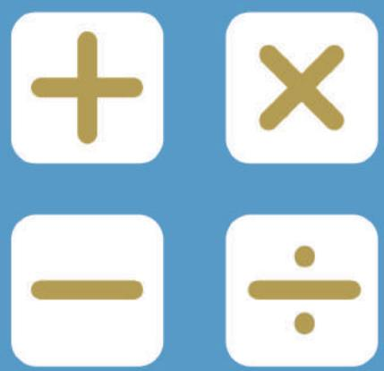

## SEAMO

Southeast Asian Mathematical Olympiads 

## DO NOT OPEN THIS BOOKLET UNTIL INSTRUCTED.

STUDENT'SNAME: 

Read the instructions on the ANsWER SHEETand fillin your NAME,SCHOOLandOTHERINFORMATION. 

Usea2B orBpencil. 

DoNoTuseapen 

Ruboutanymistakescompletely. 

You MUsT record youranswers on the ANswER SHEET. 

## LOWER PRIMARY

MarkonlyoNeanswerforeachquestion. 

MarksareNoTdeducted for incorrectanswers. 

## SectION A

Usethe information providedto choose the BesTanswer fromthefive possible options. 

OnyourANswersheeTfillinthe oval thatmatches your answer. 

## SECTION B

Onyour ANsWER SHEETfillin youranswer within the box provided. 

YouareNoTallowedtouseacalculator. 

1. Find the missing number in the number pattern below. 

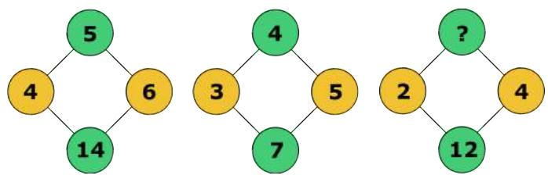

(A) 4 

(B) 5 

(C) 6 

(D) 7 

(E) None of the above 

2. What is the sum of first 68 digits in 

358421358421358421… 

(A) 246 

(B) 252 

(C) 261 

(D) 273 

(E) 284 

3. In a new operation 

3 4 = 13, 

5 9 = 24, 

7 7 = 28, 

Find the value of 13 8 

(A) 45 

(B) 46 

(C) 47 

(D) 48 

(E) None of the above 

4. The figure shown below is a 4 × 4 square grid. 

How many squares contain the dot? 

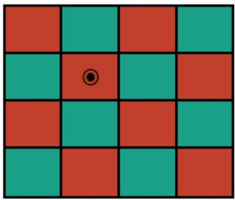

(A) 8 

(B) 10 

(D) 14 

(E) 16 

5. Find the value of in the following. 

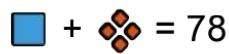

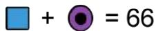

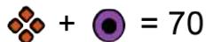

(A) 23 

(B) 29 

(C) 37 

(D) 39 

(E) 41 

6. Find the missing number. 

$$
[ (\mathrm{?} + 4) \times 8 ] \div 1 2 = 4 8
$$

(A) 68 

(B) 70 

(C) 74 

(D) 76 

(E) None of the above 

7. Find the value of S in the $3 \times 3$ magic square shown below. 

<table><tr><td>R</td><td>12</td><td>U</td></tr><tr><td>S</td><td>15</td><td>20</td></tr><tr><td>16</td><td>T</td><td>11</td></tr></table>

(A) 5 

(B) 6 

(C) 8 

(D) 9 

(E) 10 

8. Find the value of 

$$
1 - 2 + 3 - 4 + 5 - 6 + \dots + 7 3 - 7 4 + 7 5
$$

(A) 37 

(B) 38 

(C) 39 

(D) 40 

(E) None of the above 

9. A bag contains 12 red, 10 white, 8 yellow, 3 blue and 2 black balls. Roy takes out the balls one by one without looking. At least how many balls must he take so that, for certain, he would have 4 balls of the same colour? 

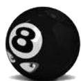

(A) 15 

(B) 19 

(C) 20 

(D) 25 

(E) None of the above 

10. Circles A, B and C have areas $3 8 0 \ c m ^ { 2 }$ , $4 0 0 \ c m ^ { 2 }$ and $4 2 0 \ c m ^ { 2 }$ respectively. The numbers represent overlapping areas in $c m ^ { 2 }$ . Find the total area of the figure. 

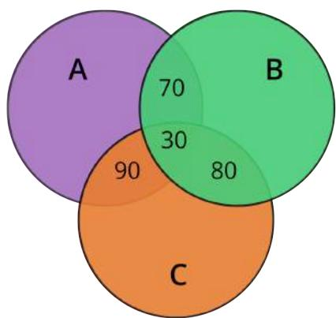

(A) 780 

(B) 820 

(C) 960 

(D) 1200 

(E) None of the above 

11. The average of 8 numbers arranged in ascending order is 55. 

The average of the first 5 numbers is 46. The average of the last 4 numbers is 68. Find the value of the fifth number. 

(A) 32 

(B) 44 

(C) 58 

(D) 62 

(E) 74 

12. Emma adds up the sum of 1 + 2 + 3 + 4 + ⋯ on a calculator. When she reaches the sum of 305, she realizes that she had forgotten to add one number. What is the number? 

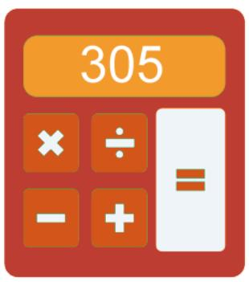

(A) 16 

(B) 17 

(C) 18 

(D) 19 

(E) 20 

13. The figure shown below is a regular pentagon. Find the magnitude of each of its interior angles. 

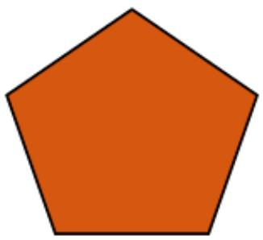

(A) $1 0 6 ^ { \circ }$ 

(B) $10 8 ^ { \circ }$ 

(C) $1 1 4 ^ { \circ }$ 

(D) $2 4 0 ^ { \circ }$ 

(E) $3 0 0 ^ { \circ }$ 

14. In mathematics, 

$$
3 ^ {4} = 3 \times 3 \times 3 \times 3
$$

$$
2 ^ {5} = 2 \times 2 \times 2 \times 2 \times 2 \text { and   so   on. }
$$

What is the ones digit in $2 2 2 ^ { 2 2 2 } ?$ 

(A) 2 

(B) 4 

(C) 6 

(D) 8 

(E) None of the above 

15. In mathematics, ! > ! means the value of ! is greater than that of ! . For example, ! > ! . Given that ! and ! are whole numbers, what is a possible value of ( ! + ! ) in the following. 

$$
\frac {x}{1 9} > \frac {3}{5} > \frac {y}{1 9}
$$

(A) 4 

(B) 13 

(C) 15 

(D) 23 

(E) None of the above 

16. The numbers 2, 3, 4, 5, 6, 7 and 8 are arranged in the circles in such a way that the sum of the 3 numbers on each line is 15. What is the value of !? 

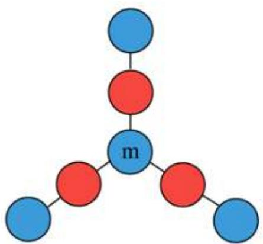

(A) 5 

(B) 6 

(C) 7 

(D) 8 

(E) None of the above 

17. There are 20 questions in a mathematics test. 7 marks are awarded for a correct answer. 4 marks will be deducted for a wrong attempt. A student gets 0 marks for any question not attempted. If Joan scores 100 marks for the test, how many questions did she not attempt? 

(A) 3 

(B) 2 

(C) 1 

(D) 0 

(E) None of the above 

18. The perimeter of a right-angled triangle is 12 !". Its area is 6 !!!. Find the longest side of the triangle. 

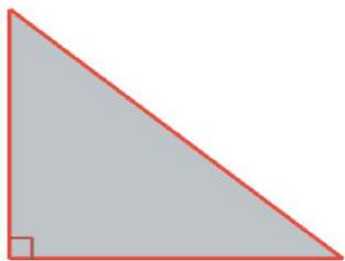

(A) 3 cm 

(B) 5 cm 

(C) 7 cm 

(D) 9 cm 

(E) None of the above 

19. The distance between Medan city and Lake Toba is approximately 90 km. Henry left Medan for Lake Toba at 8:00 am, travelling at a constant speed of 90 km/h. 20 minutes later, Annisa left Medan also for Lake Toba, at 120 km/h. 

How far was Annisa’s car from the destination when Henry had arrived? 

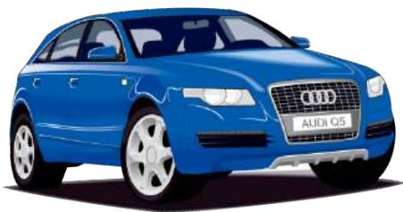

(A) 8 km 

(B) 10 km 

(C) 12 km 

(D) 14 km 

(E) None of the above 

20. Mr Wang bought a basket of apples for the family. If each family member eats 4 apples, they will have 10 apples leftover. If each family member eats 6 apples, they will be short of 6 apples. How many apples did Mr Wang buy? 

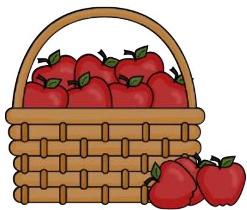

(A) 40 

(B) 42 

(C) 44 

(D) 46 

(E) None of the above 

## QUESTIONS 21 - 25 ARE FREE RESPONSE

## Write your answer in the free response section of the ANSWER SHEET provided.

21. Find the sum of all digits of the product of 999 999 × 1 777 776 

22. A 5-digit number 7!36! is divisible by 5. It can also be divided by 9. Find the value of ( ! + ! ), when the value of the 5-digit number is the least. 

23. What is the smaller angle formed by the hour hand and the minute hand at 6:45 pm? 

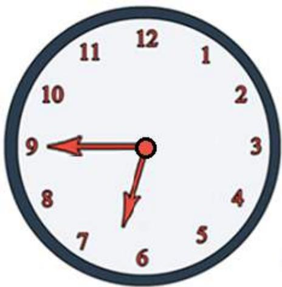

24. A regular hexagon is a 6-sided polygon in which each of its sides has the same length. The figure below shows half a hexagon. Divide the figure into 4 identical shapes of equal area. 

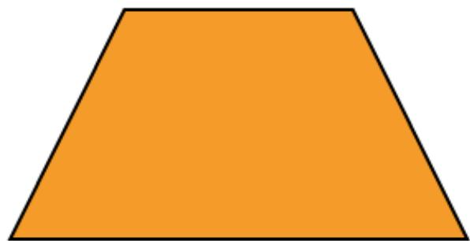

25. A basket contains between 200 to 240 . 

When I divide all the into 4 equal bags, 1 is left. When I divide one of such bags into 4 equal packets, the remainder will still be 1. When I split one of such packets into 4 equal parts, the remainder is still 1. What is the number of in the basket? 

END OF PAPER 