## PAPER B

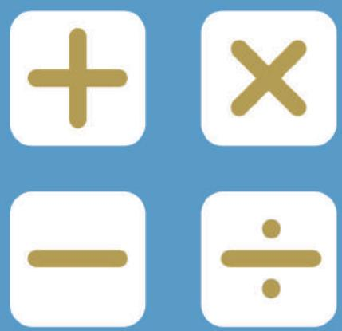

## SEAMO

Southeast Asian Mathematical Olympiad 

## DO NOT OPEN THIS BOOKLET UNTIL INSTRUCTED.

## STUDENT'SNAME:

Read the instructions on the ANsWER SHEETand fillin your NAME,SCHOOLandOTHERINFORMATION. 

Usea2B orBpencil. 

DoNoTuseapen 

Ruboutanymistakescompletely. 

You MUST record youranswers on the ANswER SHEET. 

## MIDDLEPRIMARY

MarkonlyoNEanswer foreach question. 

MarksareNoTdeducted for incorrectanswers. 

## QUESTIONS 1 TO 20

Usetheinformation providedto choose the BesTanswer fromthefivepossible options. 

On your ANsweR sHeET shade the option that matches youranswer. 

## QUESTIONS 21 TO 25

Onyour ANsWER SHEET write your answer within the box provided.Unitsarenot required. 

Youare NoTallowed to useacalculator. 

## QUESTIONS 1 TO 10 ARE WORTH 3 MARKS EACH

## 1. Find the missing number in

2, 2, 4, 6, 10, ( ), 42, … 

(A) 12 

(B) 14 

(C) 16 

(D) 18 

(E) None of the above 

## 2. Cindy scored the following for five tests:

97, 99, 96, 93 , 95 

What is her average score? 

(A) 96 

(B) 95 

(C) 94 

(D) 93 

(E) None of the above 

## 3. There are 15 children at a party. Each boy gets 2 balloons, while each girl gets 3 balloons.

Altogether, 37 balloons are given out. How many boys are there? 

(A) 7 

(B) 8 

(C) 9 

(D) 10 

(E) None of the above 

## 4. Which figure best replaces the question mark?

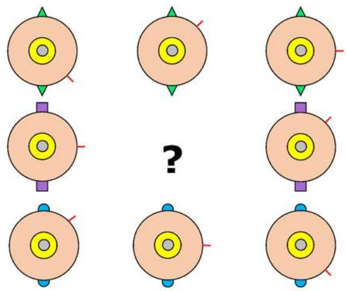

(A)

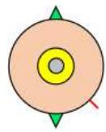

(B)

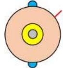

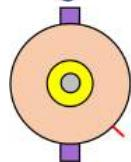

(C)

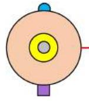

(D)

(E) None of the above 

## 5. How many triangles are there in the figure?

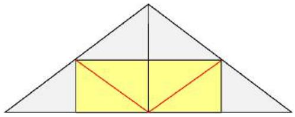

(A) 12 

(B) 13 

(C) 14 

(D) 15 

(E) None of the above 

6. The area of a square is given as 

$$
S i d e \times S i d e
$$

For example, in the figure below, 

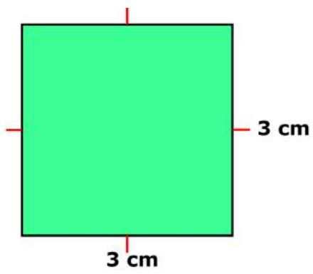

the area of the square is 

$$
3 c m \times 3 c m = 9 c m ^ {2}
$$

Find the area of square ABCD if the area of the shaded region is 16 457. 

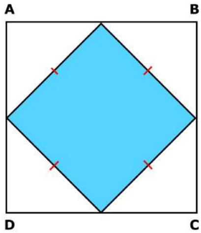

(A) 26 cm2 

(B) 29 $\mathsf { c m } ^ { 2 }$ 

(C) 30 $\mathsf { c m } ^ { 2 }$ 

(D) 32 $\mathsf { c m } ^ { 2 }$ 

(E) None of the above 

7. Given that 

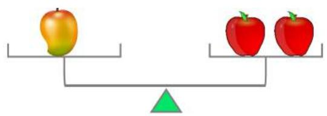

and 

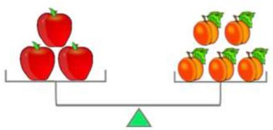

Then, 

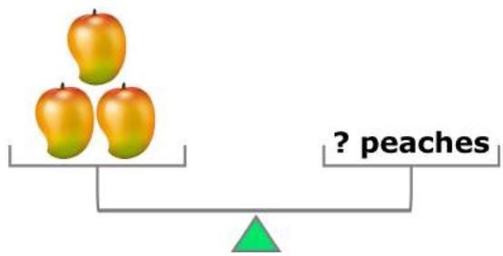

(A) 8 

(B) 10 

(D) 14 

(E) None of the above 

8. Shawn is 9 years old. He asks his cousin for her age. She replies, “When you reach my age, I will be 35 years old.” 

How old is Shawn’s cousin? 

(A) 21 

(B) 22 

(E) None of the above 

9. What number does AB represent? 

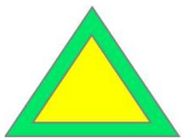

11

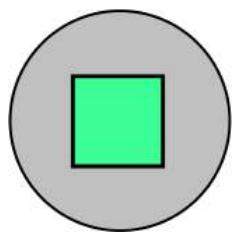

23

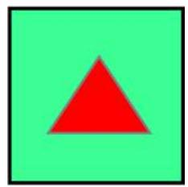

31

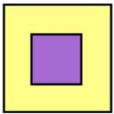

33

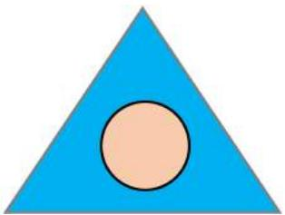

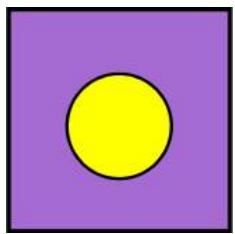

AB

(A) 12 

(B) 21 

(C) 31 

(D) 32 

(E) None of the above 

10. Chandni and his sister were 250 m apart in the park. They began walking towards each other at a speed of 25 and 30 metres per minutes, respectively. How far apart were they after 4 minutes? 

(A) 20 m 

(B) 25 m 

(D) 35 m 

(E) None of the above 

## QUESTIONS 11 TO 20 ARE WORTH 4 MARKS EACH

11. Michelle asks her aunt, “How old are you?” 

Her aunt replies, 

“When I was your age, you were only 3 years old. By the time you reach my age, I will be 39.” 

How old is Michelle’s aunt? 

(A) 25 

(B) 26 

(E) None of the above 

12. A number leaves a remainder of 2 when divided by 3. It leaves a remainder of 1 when divided by 4. 

What is the remainder it leaves when divided by 12? 

(A) 2 

(B) 3 

(E) None of the above 

13. A, B and C are balls of different weights. 

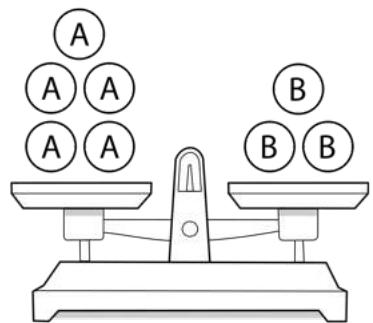

Fig. 1

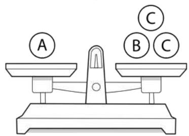

Fig. 2

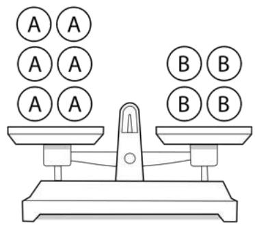

Fig.3

In Fig. 3, what must be added to the pan on the right-hand side to make it balanced? 

(A) 2B 

(B) 2C 

(C) 1A and 2B 

(D) 1A and 2C 

(E) None of the above 

14. A game of numbers involves 2 players and 2017 beads. 

At every turn, a player must remove between 1 to 4 beads. The player who is left with the last bead loses. 

How many beads must the first player remove at the start of the game in order to win? 

(A) 1 

(B) 2 

(E) None of the above 

15. At first, the amount of milk in Barrel A was twice that in Barrel B. After 20 litres of milk was removed from each barrel, the amount of milk in Barrel A was thrice that in Barrel B. What was the amount of milk (in litres) in Barrels A and B, respectively, at the beginning? 

(A) 30 and 60 

(B) 80 and 40 

(C) 50 and 100 

(D) 100 and 200 

(E) None of the above 

16. The figure shows a square of sides 10 cm. The area of rectangle EFGH is 8 cm2. Find the area of the quadrilateral ABCD in cm2. 

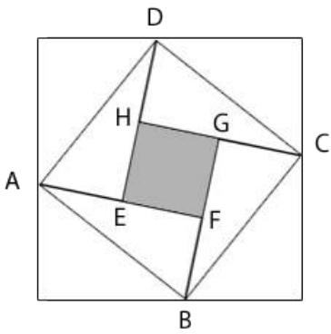

(A) 40 

(B) 42 

(C) 44 

(D) 46 

(E) None of the above 

17. The figure shows 2 squares ABCD and DEFG . The length of the sides are 5 cm and 3 cm, respectively. 

Find the area of the shaded region ACEF in cm2. 

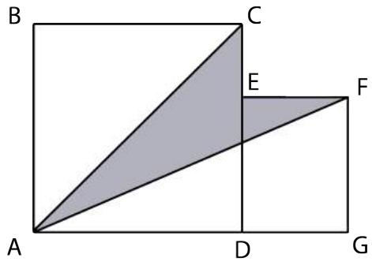

(A) 9.0 

(B) 9.5 

(C) 10.0 

(D) 12.0 

(E) None of the above 

18. Shi Ting’s piano examination is coming. 

In order to motivate her, her mom will give her 8 chocolate bars on days she practices 30 minutes or more. She will be given only 5 chocolate bars if she practices for less than 30 minutes on any particular day. 

Suppose she practices for 18 days and has earned a total of 53 chocolate bars, on how many days did she fall short of the 30- minute mark? 

(A) 5 

(B) 6 

(C) 7 

(E) None of the above 

19. In 2017, 5th August falls on a Saturday. 

On which day of the week will 1st January 2018 fall? 

(A) Monday 

(B) Tuesday 

(C) Wednesday 

(D) Thursday 

(E) None of the above 

20. A car travelled from Town ? to Town @ at a speed of 90 km/h. It then returned at a speed of 60 km/h. What was the average speed of the car for the whole trip? 

(A) $6 8 \mathrm { { k m / h } }$ 

(B) 70 km/h 

(C) 72 km/h 

(D) 75 km/h 

(E) None of the above 

## QUESTIONS 21 TO 25 ARE WORTH 6 MARKS EACH

21. Evaluate 

$$
\frac {1}{1 \times 2} + \frac {1}{2 \times 3} + \frac {1}{3 \times 4} + \dots + \frac {1}{8 \times 9} + \frac {1}{9 \times 1 0}
$$

22. ? , @ and G are three consecutive whole numbers such that 

$$
A \times B \times C = 5 0 4
$$

Find the value of ?. 

23. How many ways are there to put 2 beads on a 3 × 3 grid, so that they do not lie on the same line? 

24. In $\Delta A B C , A D = { \frac { 1 } { 2 } } D B , C E = { \frac { 1 } { 4 } } C B$ . Given that the area of $\Delta \ : C D E$ is $9 \mathrm { c m } ^ { 2 }$ , find the area of $\Delta { \cal A } B C$ in $c m ^ { 2 }$ . 

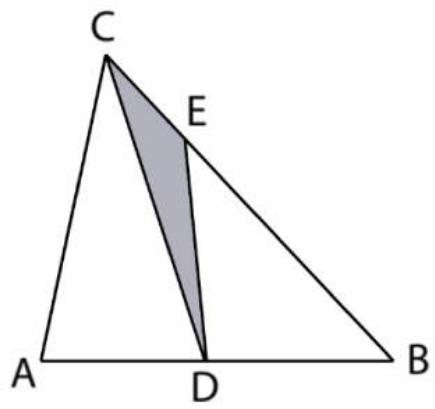

25. Evaluate 

$$
1 - 2 + 3 - 4 + \dots + 1 9 9 - 2 0 0 + 2 0 1
$$

END OF PAPER 

## SEAMO 2017

## Paper B – Answers

## Multiple-Choice Questions

Questions 1 to 10 carry 3 marks each. 

<table><tr><td>Q1</td><td>Q2</td><td>Q3</td><td>Q4</td><td>Q5</td></tr><tr><td>C</td><td>A</td><td>B</td><td>C</td><td>E</td></tr></table>

<table><tr><td>Q6</td><td>Q7</td><td>Q8</td><td>Q9</td><td>Q10</td></tr><tr><td>D</td><td>B</td><td>B</td><td>D</td><td>C</td></tr></table>

Questions 11 to 20 carry 4 marks each. 

<table><tr><td>Q11</td><td>Q12</td><td>Q13</td><td>Q14</td><td>Q15</td></tr><tr><td>C</td><td>D</td><td>B</td><td>A</td><td>B</td></tr></table>

<table><tr><td>Q16</td><td>Q17</td><td>Q18</td><td>Q19</td><td>Q20</td></tr><tr><td>E</td><td>B</td><td>C</td><td>A</td><td>C</td></tr></table>

## Free-Response Questions

Questions 21 to 25 carry 6 marks each. 

<table><tr><td>21</td><td>22</td><td>23</td><td>24</td><td>25</td></tr><tr><td><eq>\frac{9}{10}</eq></td><td>7</td><td>36</td><td>54</td><td>101</td></tr></table>