## PAPER B

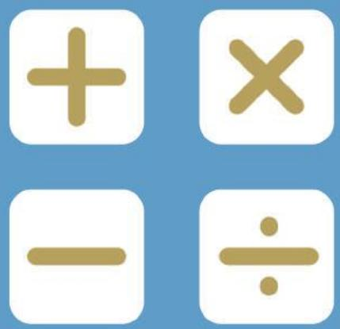

## SEAMO

Southeast Asian Mathematical Olympiads 

## DO NOT OPEN THIS BOOKLET UNTIL INSTRUCTED.

STUDENT'SNAME: 

Read the instructions ontheANsweR sheetand fillin your NAME,CANDIDATE NUMBER and SCHOOL. 

Usea2borBpencil. 

DoNOTuseapen 

Ruboutanymistakescompletely. 

Youmust complete all the questionswithin90 MiNUTeS. 

## MIDDLEPRIMARY

MarkonlyoNeanswerforeachquestion. 

MarksareNoTdeducted forincorrectanswers. 

## SECTIONA

Questions1to 10are worth THREE(3) markseach. 

## SECTION B

Questions11to20areworth FouR(4)markseach. 

## sectioN c

Questions21to25are worth sIx(6)marks each. 

YouareNoTallowedtouseacalculator. 

## QUESTIONS 1 TO 10 ARE WORTH 3 MARKS EACH

1. Find the next number in the sequence 5611, 111223, 232447,… 

(A) 232495 

(B) 464793 

(C) 474895 

(D) 474896 

(E) None of the above 

2. Find perimeter of the figure below. 

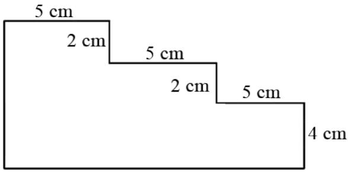

(A) 38 

(B) 42 

(C) 44 

(D) 46 

(E) None of the above 

3. 6 footballs and 3 basketballs cost $279. 2 footballs and 3 basketballs cost $139. Find the prices of a football and a basketball, respectively. 

(A) $35 and $21 

(B) $35 and $23 

(C) $40 and $21 

(D) $40 and $23 

(E) None of the above 

4. How many cubes are there in the figure below? 

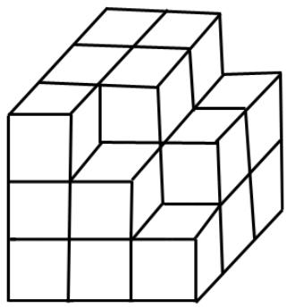

(A) 20 

(B) 22 

(C) 23 

(D) 24 

(E) 25 

5. In the following additions, each letter represents a different digit. 

Find -./0 11111111. 

<table><tr><td></td><td>A</td><td>B</td><td>C</td><td>D</td></tr><tr><td>+</td><td></td><td>E</td><td>F</td><td>G</td></tr><tr><td></td><td>9</td><td>0</td><td>6</td><td>3</td></tr></table>

<table><tr><td></td><td>A</td><td>B</td><td>C</td></tr><tr><td>+ D</td><td>E</td><td>F</td><td>G</td></tr><tr><td>2</td><td>5</td><td>2</td><td>9</td></tr></table>

(A) 8370 

(B) 9464 

(C) 8371 

(D) 9465 

(E) None of the above 

6. Pine trees are planted at equal intervals of 16 m along a straight road, including both ends of the road. If the road is 960 m long, how many pine trees are there altogether? 

(A) 56 

(B) 58 

(C) 59 

(D) 60 

(E) 61 

7. The numbers 1, 2, 3, … , 9 is to be filled in each circle, such that the sum of numbers along each line is 9. Find 9. 

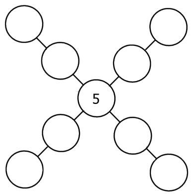

(A) 25 

(B) 26 

(C) 22 

(D) 34 

(E) None of the above 

8. There are 14 children at a party. If each child shakes hands with each other exactly once, how many handshakes will take place? 

(A) 75 

(B) 85 

(C) 87 

(D) 89 

(E) 91 

9. When 925 is divided by 8, the quotient is 35 and the remainder is 15. Find 8. 

(A) 23 

(B) 25 

(C) 26 

(D) 27 

(E) None of the above 

10. There are 15 red, 20 white, 25 black and 40 yellow balls in bag. Without looking into the bag, find the least number of balls to be removed, without replacement, to obtain at least 4 balls of different colours. 

(A) 86 

(B) 76 

(C) 75 

(D) 66 

(E) 67 

## QUESTIONS 11 TO 20 ARE WORTH 4 MARKS EACH

11. Find the missing number in the number puzzle below. 

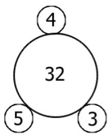

(A) 5 

(B) 7 

(C) 4 

(D) 8 

(E) None of the above 

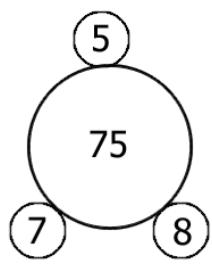

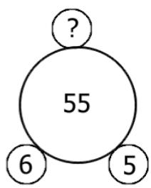

12. Peter has a total of 100 chickens and rabbits on his farm. If the animals have 260 legs altogether, how many chickens are there on the farm? 

(A) 40 

(B) 50 

(C) 60 

(D) 70 

(E) 80 

13. Teacher Ali has a bag of sweets. If he gives each student 4 sweets, he will be left with 4 sweets. If he gives each student 5 sweets, he will be short of 7 sweets. How many sweets does Teacher Ali have? 

(A) 45 

(B) 46 

(C) 47 

(D) 48 

(E) None of the above 

14. There is a total of 15 questions in a mathematics test. For every correct answer, 8 marks will be awarded. For every wrong answer, 4 marks are deducted. If John scored a total of 72 marks, how questions did he answer wrongly? 

(A) 2 

(B) 3 

(C) 4 

(D) 5 

(E) 6 

15. Cindy’s father is 4 times older than her. Three years ago, both their ages added up to 49. How old are Cindy and her father, respectively, this year? 

(A) 10 and 45 

(B) 11 and 44 

(C) 12 and 46 

(D) 9 and 36 

(E) None of the above 

16. Mark had some stamps. He gave 10 less than half of his stamps of to Shaun. Then, he gave 6 more than half the remainder to Cindy. Finally, he gave 30 stamps to his cousin and was left with 40 stamps. How many stamps did he have at first? 

(A) 284 

(B) 304 

(C) 322 

(D) 354 

(E) None of the above 

17. The diagram below shows a rectangle of length 36 cm . It contains two shaded regions and 7 identical small rectangles. Find the area of one small rectangle, in cm;. 

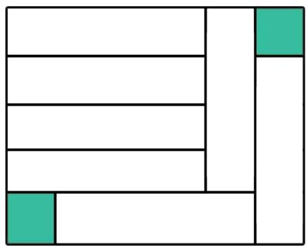

(A) 98 

(B) 120 

(C) 144 

(D) 156 

(E) None of the above 

18. Train - left Town < for Town =, at a speed of 60 km/h. 1h later, Train . left Town < for Town = , at a speed of 75 km/h. How many hours did Train . take to catch up with Train -? 

(A) 2 h 30 min 

(B) 3 h 

(C) 3 h 30 min 

(D) 3 h 45 min 

(E) 4 h 

19. In the diagram below, the topmost layer has 60 circles. How many circles are there altogether? 

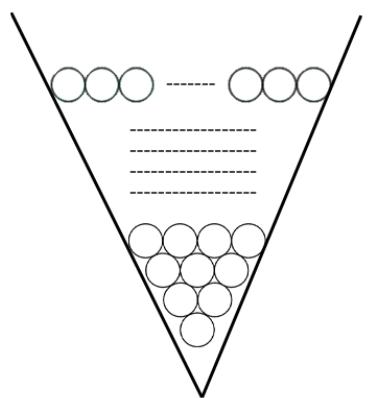

(A) 1750 

(B) 1780 

(C) 1830 

(D) 1880 

(E) None of the above 

20. The diagram shows a square -./0 of side 10 H8 and a shaded rectangle of area 6 cm;. What is the area of IJKL? 

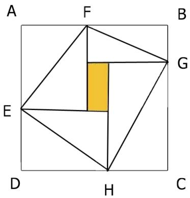

(A) 49 cm; 

(B) $5 1 \mathrm { c m } ^ { 2 }$ 

(C) $6 2 \mathrm { c m } ^ { 2 }$ 

(D) $5 3 \mathrm { c m } ^ { 2 }$ 

(E) $5 8 \mathrm { c m } ^ { 2 }$ 

## QUESTIONS 21 TO 25 ARE WORTH 6 MARKS EACH

21. A new operation is defined as 

$$
a \odot b = 5 \times a - 3 \times b
$$

Given that 14 ⊚ D = 13, find the value of D. 

22. Alan wrote on the whiteboard 

$$
1, 2, 3, 4, 5, \dots , 1 7 3
$$

How many times did he write the digit ‘7’ altogether? 

23. Many years ago, there were 5 Saturdays in the month of February. 

On which day of the week was the last day of that year? 

24. Jane walked from her house to Peter’s at a speed of 80 m/min. At the same time, Peter walked from his house to Jane’s at a speed of 60 m/min. They met 15 m from the mid-point of the two houses. 

How far is Jane’s house from Peter’s? 

25. In the diagram below, -./0 is a square of side 4 cm . 0IJK is a rectangle. I-J is a straight line. Given that /K = 3 cm and 0K = 5 cm , find the length of 0I in cm. 

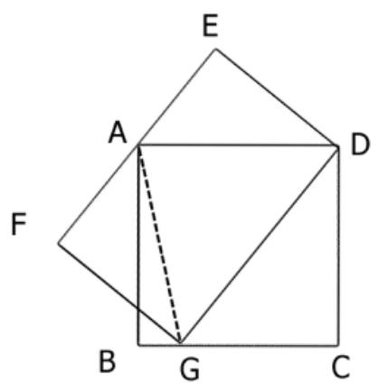

End of Paper

## SEAMO 2018

## Paper B – Answers

## Multiple-Choice Questions

Questions 1 to 10 carry 3 marks each. 

<table><tr><td>Q1</td><td>Q2</td><td>Q3</td><td>Q4</td><td>Q5</td></tr><tr><td>C</td><td>D</td><td>B</td><td>B</td><td>C</td></tr></table>

<table><tr><td>Q6</td><td>Q7</td><td>Q8</td><td>Q9</td><td>Q10</td></tr><tr><td>E</td><td>A</td><td>E</td><td>C</td><td>A</td></tr></table>

Questions 11 to 20 carry 4 marks each. 

<table><tr><td>Q11</td><td>Q12</td><td>Q13</td><td>Q14</td><td>Q15</td></tr><tr><td>A</td><td>D</td><td>D</td><td>C</td><td>B</td></tr></table>

<table><tr><td>Q16</td><td>Q17</td><td>Q18</td><td>Q19</td><td>Q20</td></tr><tr><td>A</td><td>C</td><td>E</td><td>C</td><td>D</td></tr></table>

## Free-Response Questions

Questions 21 to 25 carry 6 marks each. 

<table><tr><td>21</td><td>22</td><td>23</td><td>24</td><td>25</td></tr><tr><td>19</td><td>31</td><td>THURSDAY</td><td>210 m</td><td>3.2 cm</td></tr></table>