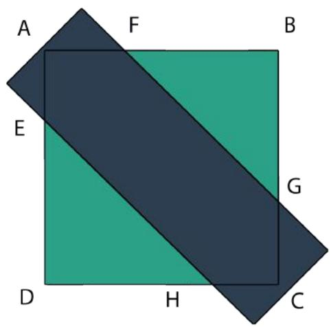
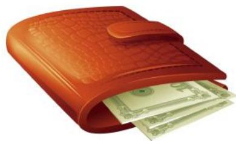
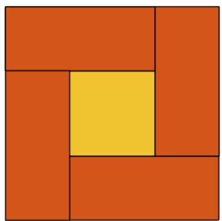
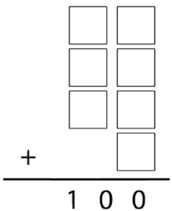
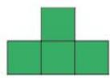
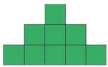
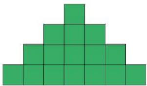
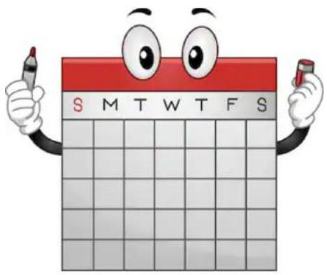
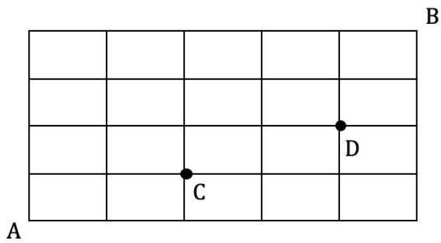

## PAPER B

## SEAMO

Southeast Asian Mathematical Olympiad 

## DO NOT OPEN THIS BOOKLET UNTIL INSTRUCTED.

STUDENT'SNAME: 

Read the instructions on the AnsweRsheetand fillin your NAME,SCHOOLandOTHERINFORMATION. 

Usea2BorBpencil. 

Do NOTusea pen 

Ruboutanymistakes completely. 

You MUsTrecord your answers on the ANsweR SHEET. 

## MIDDLE PRIMARY

Mark onlyonEanswerforeach question. 

MarksareNoTdeducted for incorrectanswers. 

## QUESTIONS1TO20

Use the information provided to choose the besTanswer fromthefivepossible options. 

Onyour ANsWER SHEET shade the option that matches youranswer. 

## QUESTIONS 21TO 25

On your ANswER sHEETwrite your answer within the box provided.Unitsarenotrequired. 

YouareNotallowedtouseacalculator. 

## QUESTIONS 1 TO 10 ARE WORTH 3 MARKS EACH

1. Find the value of ! in 

$$
1, 2, 3, 6, 1 2, 2 3, 4 4, x, 1 6 4, \dots
$$

(A) 82 

(B) 84 

(C) 85 

(D) 87 

(E) None of the above 

2. Find the sum of all the digits in the product 

$$
1 1 1 1 1 \times 9 9 9 9 9
$$

(A) 36 

(B) 45 

(C) 54 

(E) None of the above 

3. A double-decker bus has 66 seats. 

At the 1st stop, 1 commuter boards; At the 2nd stop, 2 commuters boards; At the 3rd stop, 3 commuters boards; and so on… 

At which stop will all the seats be taken? 

(A) $1 0 ^ { \mathrm { t h } }$ 

(B) $1 1 ^ { \mathrm { t h } }$ 

(C) $1 2 ^ { \mathrm { t h } }$ 

(D) $1 3 ^ { \mathrm { t h } }$ 

(E) None of the above 

4. In the figure, )*+, is a square and -./0 is a rectangle. 

It is known that .* = 2). , */ = 2/+ , ,0 = 20+ and ,- = 2)-. 

Given that .* = 4 cm, find the area of -./0. 

(A) 12 

(B) 13 

(C) 14 

(D) 16 

(E) None of the above 

5. Sam has 63 $2 and $5 notes in his wallet with a total value of $171. 

How many $5 notes does he have? 

(A) 15 

(B) 16 

(C) 17 

(D) 18 

(E) None of the above 

6. The figure below shows a rectangle that has been subdivided into smaller rectangles. 

The areas (in units) of some smaller rectangles have been given below. 

Find the area ). 

<table><tr><td>15</td><td></td><td>A</td></tr><tr><td></td><td></td><td></td></tr><tr><td>30</td><td></td><td>90</td></tr></table>

(A) 38 

(B) 40 

(D) 46 

(E) None of the above 

7. The sum of Alice and her uncle’s ages is 33 years. If her uncle will be twice her age in 3 years’ time, how old is Alice this year? 

(A) 9 

(B) 10 

(C) 11 

(D) 12 

(E) None of the above 

8. The figure is made up of 2 squares and 4 identical rectangles. Given that the area of the 2 squares are 64 :;< and 4 :;< , respectively, find the perimeter of a rectangle. 

(A) 16 cm 

(B) 18 cm 

(C) 20 cm 

(D) 22 cm 

(E) None of the above 

9. When Mark filled a number from 1 to 7 into each box, the sum is 100. 

Find the largest 2-digit number in the addition. 

(A) 35 

(B) 38 

(C) 47 

(D) 52 

(E) None of the above 

10. A notorious child speaks the truth on Mondays, Wednesdays and Fridays. Other days, he lies. On which day will he say: “Tomorrow I will speak the truth” ? 

(A) Tuesday 

(B) Wednesday 

(C) Thursday 

(D) Friday 

(E) None of the above 

## QUESTIONS 11 TO 20 ARE WORTH 4 MARKS EACH

11. Evaluate 

$$
\begin{array}{l} 1 - 2 + 3 - 4 + 5 - 6 + \dots \\ + 2 0 1 7 - 2 0 1 8 + 2 0 1 9 \\ \end{array}
$$

(A) 1006 

(B) 1008 

(C) 1010 

(D) 1012 

(E) None of the above 

12. In the 3 × 3 magic square below, the sum of numbers in each row, column and diagonal is the same. 

Find () + * + + + ,). 

<table><tr><td>A</td><td>12</td><td>D</td></tr><tr><td>B</td><td>15</td><td>20</td></tr><tr><td>16</td><td>C</td><td>11</td></tr></table>

(A) 58 

(B) 61 

(C) 64 

(D) 67 

(E) None of the above 

13. In mathematics, 

$$
\begin{array}{l} 2 ^ {1} = 2 \\ 2 ^ {2} = 2 \times 2 \\ 2 ^ {3} = 2 \times 2 \times 2 \\ \end{array}
$$

For 3=? , find the digit in the ones place. 

(A) 3 

(B) 7 

(C) 9 

(D) 1 

(E) None of the above 

14. A palindromic pair are two numbers that are mirror images of each other. 

Here are some examples: 13 and 31, 56 and 65, 92 and 29… 

How many 2-digit palindromic pairs have a sum of 99? 

(A) 1 

(B) 2 

(C) 3 

(D) 4 

(E) None of the above 

15. The digit ‘0’ was used 31 times in all to print the page numbers of a book. How many pages did the book have? 

(A) 170 

(B) 180 

(C) 188 

(D) 190 

(E) None of the above 

16. Given that Fig. 1 has a perimeter of 10 cm, find the perimeter of the figure formed using 36 squares. 

Fig.3

(A) 34 

(B) 36 

(C) 38 

(D) 40 

(E) None of the above 

17. In a particular year some time ago, there was a month with 5 Sundays. 3 of those Sundays happened on an even day of the month. 

Which day was the 24th day of that month? 

(A) Monday 

(B) Tuesday 

(C) Wednesday 

(D) Thursday 

(E) Friday 

18. What is the sum of the first 170 numbers in the number pattern below? 

$$
_ {1 1, 7, 1 3, 2, 1 1, 7, 1 3, 2, 1 1, \dots}
$$

(A) 1400 

(B) 1404 

(C) 1408 

(D) 1412 

(E) None of the above 

19. Car ) travelled from Town ! to Town G at a speed of 40 km/h. Car * travelled from Town G to Town ! at a speed of 50 km/h. 

They passed each other 20 km away from the middle of the two towns. Find the distance between the towns. 

(A) 270 km 

(B) 300 km 

(C) 330 km 

(D) 360 km 

(E) None of the above 

20. If Ms. Woodley gives 5 sweets to each of her students, she will have 32 left. If she gives each student 8 sweets, then 5 of them will not get any. 

How many sweets does Ms. Woodley have? 

(A) 140 

(B) 144 

(C) 148 

(D) 152 

(E) None of the above 

## QUESTIONS 21 TO 25 ARE WORTH 6 MARKS EACH

## 21. Given that

$$
A + B + C + D = 3 3 6
$$

$$
A + B = 1 4 4
$$

$$
B + C = 1 5 2
$$

$$
B + D = 1 6 0
$$

Find the value of ,. 

22. How many ways are there to travel from ) to * , by passing through + and ,? 

23. A new operation is defined as 

$$
2 \square 3 = 2 + 3 + 4
$$

$$
6 \text {   口   } 2 = 6 + 7
$$

$$
3 \square 5 = 3 + 4 + 5 + 6 + 7
$$

Find the value of I if I ⊡ 8 = 76. 

24. Whole numbers starting from ‘0’ are arranged in the array shown below. 

In which row will it be possible to find the number ‘2019’ ? 

<table><tr><td>Row 1</td><td>0</td><td>3</td><td>8</td><td>15</td><td>24</td><td>...</td></tr><tr><td>Row 2</td><td>1</td><td>2</td><td>7</td><td>14</td><td>23</td><td>...</td></tr><tr><td>Row 3</td><td>4</td><td>5</td><td>6</td><td>13</td><td>22</td><td>...</td></tr><tr><td>Row 4</td><td>9</td><td>10</td><td>11</td><td>12</td><td>21</td><td>...</td></tr><tr><td>Row 5</td><td>16</td><td>17</td><td>18</td><td>19</td><td>20</td><td>...</td></tr><tr><td>...</td><td>...</td><td>...</td><td>...</td><td>...</td><td>...</td><td>...</td></tr></table>

25. Each distinct letter represents a unique digit in the cryptarithm shown below. 

Find the digit represented by M. 

$$
\begin{array}{c c c c c} & \text {   M   A   T   H   } \\ + & \text {   M   A   T   H   } \\ \hline & \text {   H   A   B   I   T   } \end{array}
$$

End of Paper 

## SEAMO 2019

## Paper B – Answers

## Multiple-Choice Questions

Questions 1 to 10 carry 3 marks each. 

<table><tr><td>Q1</td><td>Q2</td><td>Q3</td><td>Q4</td><td>Q5</td></tr><tr><td>C</td><td>B</td><td>B</td><td>D</td><td>A</td></tr></table>

<table><tr><td>Q6</td><td>Q7</td><td>Q8</td><td>Q9</td><td>Q10</td></tr><tr><td>E</td><td>B</td><td>A</td><td>E</td><td>E</td></tr></table>

Questions 11 to 20 carry 4 marks each. 

<table><tr><td>Q11</td><td>Q12</td><td>Q13</td><td>Q14</td><td>Q15</td></tr><tr><td>C</td><td>B</td><td>C</td><td>D</td><td>E</td></tr></table>

<table><tr><td>Q16</td><td>Q17</td><td>Q18</td><td>Q19</td><td>Q20</td></tr><tr><td>A</td><td>A</td><td>B</td><td>D</td><td>D</td></tr></table>

## Free-Response Questions

Questions 21 to 25 carry 6 marks each. 

<table><tr><td>21</td><td>22</td><td>23</td><td>24</td><td>25</td></tr><tr><td>100</td><td>27</td><td>6</td><td>Row 6</td><td>7</td></tr></table>