## PAPER B

## SEAMO

Southeast Asian Mathematical Olympiad 

## DO NOT OPEN THIS BOOKLET UNTIL INSTRUCTED.

STUDENT'SNAME: 

Read the instructions on the ANsWER sHEETand fillin your NAME,SCHOOLandOTHERINFORMATION. 

Usea2B orBpencil. 

DoNOTuseapen 

Ruboutanymistakescompletely. 

You MusTrecord your answers on the ANsweR SHEET. 

## MIDDLEPRIMARY

MarkonlyoNEanswerforeachquestion. 

Marksare NoTdeducted forincorrectanswers. 

## QUESTIONS 1TO 20

Usetheinformation providedto choose the BesTanswer from the five possible options. 

On your ANsweR sHeET shade the option thatmatches youranswer. 

## QUESTIONS 21 TO 25

Onyour ANsWER SHEETwrite your answer within the box provided.Unitsarenotrequired. 

YouareNoTallowed touseacalculator. 

## QUESTIONS 1 TO 10 ARE WORTH 3 MARKS EACH

## 1. Find the value of

$$
\left(1 \div (2 \div 3) \div (3 \div 4) \div (4 \div 5) \div (5 \div 6)\right)
$$

(A) 2 

(B) 3 

(C) 4 

(D) 5 

(E) 6 

## 2. Find the number represented by the last figure.

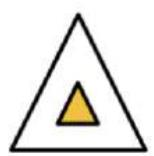

11

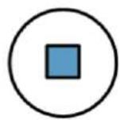

23

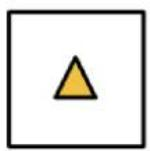

31

22

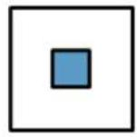

33

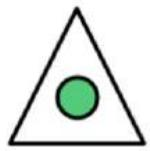

12

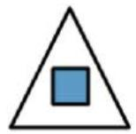

13

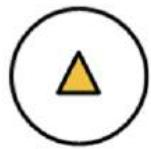

21

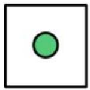

？

(A) 13 

(B) 31 

(C) 32 

(D) 23 

(E) None of the above 

## 3. How many dots will there be in the $8 ^ { \mathrm { t h } }$ figure?

Fig1

Fig2

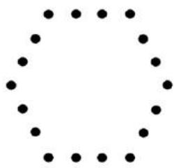

Fig3

(A) 42 

(B) 44 

(C) 46 

(D) 48 

(E) None of the above 

## 4. A new operation is defined as

$$
M \forall N = 4 M - 3 N
$$

Find the value of ?? in ?? ∀ 1 = 17. 

(A) 3 

(B) 4 

(C) 5 

(D) 6 

(E) 7 

5. In the figure below, ???????? is a square, ?????? is a straight line where ???? = ??. It is given that the shaded region ?? is larger than the shaded region ?? by 5 ????2. 

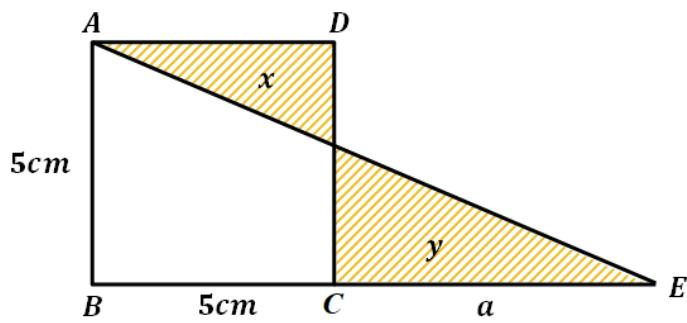

Find the length, ??. 

(A) 7 ???? 

(B) 8 ???? 

(C) 9 ???? 

(D) 10 ???? 

(E) None of the above 

6. The diagonal of a square is 12 ???? as shown below. What is its area? 

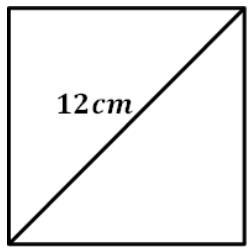

(A) $6 8 \ c m ^ { 2 }$ 

(B) $7 2 ~ c m ^ { 2 }$ 

(C) $7 4 ~ c m ^ { 2 }$ 

(D) $7 6 \ : c m ^ { 2 }$ 

(E) $8 0 ~ c m ^ { 2 }$ 

7. A prime number is a whole number that has exactly two positive factors, 1 and itself. 

Examples of prime numbers include 2, 3,5,7,11,13, … 

The sum of 2 prime numbers is 34. Find their smallest possible product. 

(A) 48 

(B) 54 

(C) 72 

(D) 88 

(E) 93 

8. Find the value of ??. 

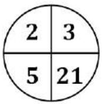

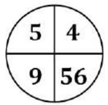

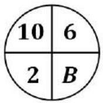

(A) 72 

(B) 84 

(C) 88 

(D) 94 

(E) 96 

9. How many numbers are there in the sequence below? 

$$
4, 1 0, 1 6, 2 2, 2 8, \dots , 6 4
$$

(A) 8 

(B) 10 

(C) 12 

(D) 14 

(E) None of the above 

10. Marvin wrote the following sequence on the whiteboard. 

$$
_ {1, 2, 3, 4, 5, 6, 7, \ldots}
$$

What is the $1 7 7 ^ { \mathrm { t h } }$ digit he wrote? 

(A) 1 

(B) 2 

(C) 3 

(D) 4 

(E) 5 

## QUESTIONS 11 TO 20 ARE WORTH 4 MARKS EACH

11. How many digits are there in the product below? 

$$
\begin{array}{l} 1 1 1 \quad 1 1 1 \quad 1 1 1 \times 1 1 1 \quad 1 1 1 \quad 1 1 1 \end{array}
$$

(A) 13 

(B) 14 

(C) 15 

(D) 16 

(E) None of the above 

12. Find the value of 

$$
\begin{array}{l} 1 - 2 + 3 - 4 + 5 - 6 + 7 - \dots - 2 0 1 8 \\ + 2 0 1 9 \\ \end{array}
$$

(A) 840 

(B) 1010 

(C) 1060 

(D) 2000 

(E) 2018 

13. Nutcharat drove from Chiang Mai to Bangkok at a speed of 120 ????/ℎ. She then returned from Bangkok to Chiang Mai at a speed of 80 ????/ℎ. 

What was her average speed for the entire trip? 

(A) 93 $k m / h$ 

(B) 94 $k m / h$ 

(C) 95 $k m / h$ 

(D) 96 $k m / h$ 

(E) 100 $k m / h$ 

14. Emma’s wallet was stolen. Adam, Ben and Charles were the suspects. 

Adam: “Ben stole the wallet!” 

Ben: “Not me!” 

Charles: “It wasn’t me.” 

Given that only one person told the truth, who stole the wallet? 

(A) Adam 

(B) Ben 

(C) Charles 

(D) Adam and Ben 

(E) Impossible to determine 

15. What is the largest 4-digit number that is a common multiple of 5 and 8? 

(A) 9900 

(B) 9920 

(C)9940 

(D)9960 

(E) None of the above 

16. What is the first number in the $1 0 ^ { \mathrm { t h } }$ row in the following array? 

<table><tr><td></td><td></td><td></td><td></td><td>1</td><td></td><td></td><td></td><td></td></tr><tr><td></td><td></td><td></td><td>3</td><td>5</td><td>7</td><td></td><td></td><td></td></tr><tr><td></td><td></td><td>9</td><td>11</td><td>13</td><td>15</td><td>17</td><td></td><td></td></tr><tr><td></td><td>19</td><td>21</td><td>23</td><td>25</td><td>27</td><td>29</td><td>31</td><td></td></tr><tr><td></td><td>33</td><td>35</td><td>37</td><td>39</td><td>41</td><td>43</td><td>45</td><td>47</td></tr><tr><td>..</td><td>..</td><td>..</td><td>..</td><td>..</td><td>..</td><td>..</td><td>..</td><td>..</td></tr></table>

(A) 163 

(B) 165 

(C) 167 

(D) 169 

(E) 171 

17. In Mathematics "?? > ??" means ?? is larger than ?? ; "?? < ??" means ?? is smaller than ??. 

Given that: 

$$
A = 9 8 7 6 5 \times 8 7 6 5 4
$$

and 

$$
B = 9 8 7 5 6 \times 8 7 6 6 3
$$

Which of the following is true? 

(A) ?? > ?? 

(B) ?? < ?? 

(C) ?? = ?? 

(D) Impossible to determine 

(E) None of the above 

18. The school rented some boats for 48 students to go on a boat ride. 

A small boat fits 3 students and costs $4 to rent. A big boat fits 5 students and costs $6 to rent. 

What is the minimum amount of fees the school paid to rent the boats? 

(A) $54 

(B) $55 

(C) $56 

(D) $57 

(E) $58 

19. There is a basket of apples. 

At first, 2 more than half of the apples are removed. 

Then, 2 less than half the remaining number of apples are removed. 

In the end, 20 apples remain. 

How many apples were there in the basket at first? 

(A) 76 

(B) 72 

(C) 64 

(D) 58 

(E) 48 

20. How many squares are there in the 4 × 4 grid? 

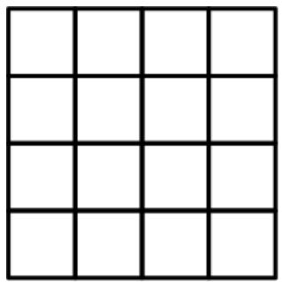

(A) 28 

(B) 30 

(C) 32 

(D) 34 

(E) 36 

## QUESTIONS 21 TO 25 ARE WORTH 6 MARKS EACH

21. In Mathematics, 

$$
3 ^ {1} = 3
$$

$$
3 ^ {2} = 3 \times 3 = 9
$$

$$
3 ^ {3} = 3 \times 3 \times 3 = 2 7
$$

$$
3 ^ {4} = 3 \times 3 \times 3 \times 3 = 8 1
$$

What is the ones digit in 3333 ? 

22. By only moving → or ↓ , how many ways are there to go from ?? to ?? while passing through ??? 

A

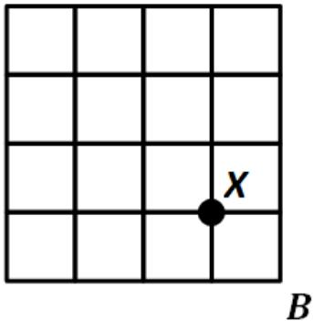

23. The sum of two numbers, ?? and ??, is 42. If ?? is multiplied by 5 and ?? is multiplied by 3, their new sum is 182. 

Find the value of ??. 

24. A car travels for 10 minutes at half its full speed. It then travels at full speed for the next 10 minutes. 

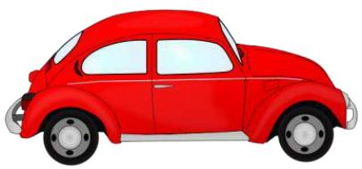

If the car travelled 21 ???? altogether, what is its full speed in ????/ℎ ? 

25. The figure shows 2 squares of different sizes. The area of the shaded region is 25 ????2. 

Find the perimeter (in cm) of the shaded region, given that the side length of the square is a natural number. 

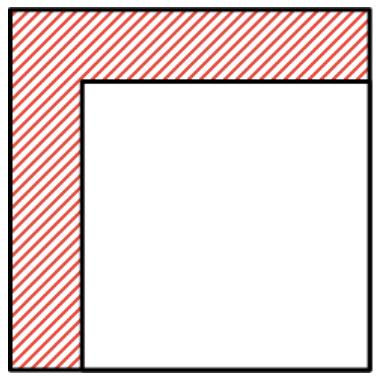

End of Paper

## SEAMO 2020

## Paper B – Answers

## Multiple-Choice Questions

Questions 1 to 10 carry 3 marks each. 

<table><tr><td>Q1</td><td>Q2</td><td>Q3</td><td>Q4</td><td>Q5</td></tr><tr><td>B</td><td>C</td><td>D</td><td>C</td><td>A</td></tr></table>

<table><tr><td>Q6</td><td>Q7</td><td>Q8</td><td>Q9</td><td>Q10</td></tr><tr><td>B</td><td>E</td><td>A</td><td>E</td><td>C</td></tr></table>

Questions 11 to 20 carry 4 marks each. 

<table><tr><td>Q11</td><td>Q12</td><td>Q13</td><td>Q14</td><td>Q15</td></tr><tr><td>A</td><td>B</td><td>D</td><td>C</td><td>D</td></tr></table>

<table><tr><td>Q16</td><td>Q17</td><td>Q18</td><td>Q19</td><td>Q20</td></tr><tr><td>A</td><td>B</td><td>E</td><td>A</td><td>B</td></tr></table>

## Free-Response Questions

Questions 21 to 25 carry 6 marks each. 

<table><tr><td>21</td><td>22</td><td>23</td><td>24</td><td>25</td></tr><tr><td>3</td><td>40</td><td>28</td><td>84</td><td>52</td></tr></table>