## PAPER B

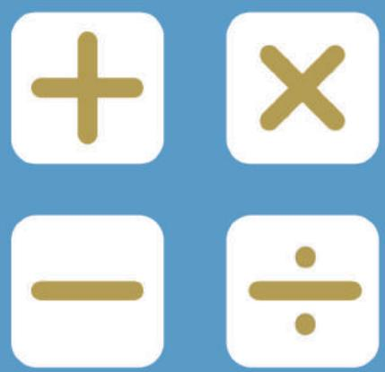

## SEAMO

Southeast Asian Mathematical Olympiad 

## DO NOT OPEN THIS BOOKLET UNTIL INSTRUCTED.

## STUDENT'SNAME:

Read the instructions on the ANsWER sHEETand fillin your NAME,SCHOOLandOTHERINFORMATION. 

Usea2B orBpencil. 

DoNoTuseapen 

Ruboutanymistakes completely. 

You MUsT record youranswers on the ANswER SHEET. 

## MIDDLEPRIMARY

Mark onlyoNEanswer foreach question. 

MarksareNoTdeducted for incorrectanswers. 

## QUESTIONS 1TO 20

Usetheinformation providedto choose the BesTanswer from thefive possible options. 

On your ANsweR sHeET shade the option thatmatches youranswer. 

## QUESTIONS 21 TO 25

Onyour ANsWER SHEETwrite your answer within the box provided.Unitsare not required. 

YouareNoTallowedtouseacalculator. 

## QUESTIONS 1 TO 10 ARE WORTH 3 MARKS EACH

## 1. Find the value of ? in

$$
1 + 2 + 3 + 4 + \dots + m = 2 5 3
$$

(A) 20 

(B) 21 

(C) 22 

(D) 23 

(E) 24 

2. Shawn and Matthew have 76 books altogether. The number of books Shawn has is 3 times the number of books of Matthew has. How many books does Shawn have? 

(A) 19 

(B) 27 

(C) 47 

(D) 57 

(E) None of the above 

3. Find, in $m ^ { 2 }$ , the area of the shaded region. 

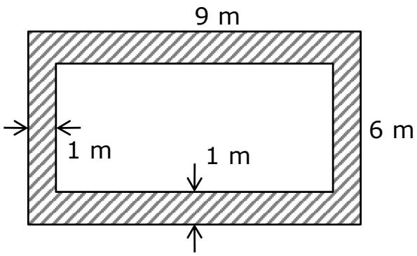

(A) 17 

(B) 19 

(C) 35 

(D) 54 

(E) None of the above 

## 4. Evaluate

$$
1 0 0 - 9 9 + 9 8 - 9 7 + 9 6 - 9 5 + \dots
$$

$$
+ 4 - 3 + 2 - 1
$$

(A) 48 

(B) 49 

(C) 50 

(D) 99 

(E) 100 

## 5. A new operation is defined as

$$
m \text {※} n = (m + n) \div 2
$$

Find the value of 3 ※ (6 ※ 8) 

(A) 3 

(B) 4 

(C) 5 

(D) 6 

(E) 7 

6. A whole number ? is multiplied by 6. 6 is then added to this product, after which the sum is divided by 6. Finally, 6 is subtracted from the quotient, which still gives a value of 6. Find the value of ?. 

(A) 10 

(B) 11 

(C) 12 

(D) 13 

(E) 14 

7. Some teenagers are being questioned by the traffic police. 

Adrian: I have a driving license. Ben: I do not know how to drive. Chris: Ben does not know how to drive. 

Given that only one person is telling the truth, which of the following conclusions can we make? 

(A) Both Adrian and Ben can drive 

(B) Both Ben and Chris can drive 

(C) Only Adrian can drive 

(D) Ben cannot drive 

(E) Chris cannot drive 

8. There are 19 chickens, ducks and goats on a farm. The farmer counted 56 animal legs altogether. How many goats are there? 

(A) 10 

(B) 9 

(C) 8 

(D) 7 

(E) 6 

9. The teacher wanted to distribute 100 apples as fairly as possible to the children at a nursery. At least one of the children received 3 apples. What could be the maximum number of children at the nursery? 

(A) 36 

(B) 47 

(C) 49 

(D) 51 

(E) 53 

10. Find the number of ways for an insect to climb from Point ? to Point ? , by passing through Point ?. 

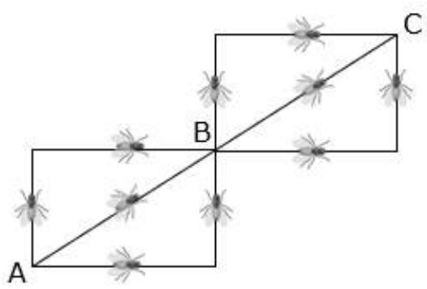

(A) 8 

(B) 9 

(C) 10 

(D) 11 

(E) 12 

## QUESTIONS 11 TO 20 ARE WORTH 4 MARKS EACH

11. The average of 5 whole numbers is 20. When one of the numbers is changed to 18, the new average is now 18. What is the original value of that number? 

(A) 26 

(B) 28 

(D) 32 

(E) 34 

12. The fruit seller is packing oranges into some bags. If he packs 5 oranges into each bag, he has 14 oranges leftover. If he packs 7 oranges into each bag, he will need another 2 bags. 

How many oranges does the fruit seller have? 

(A) 76 

(B) 78 

(C) 80 

(D) 82 

(E) 84 

13. Find the value of 

$$
\begin{array}{l} \left(\frac {1}{1 \times 2} + \frac {1}{2 \times 3} + \frac {1}{3 \times 4} + \dots \right. \\ \left. + \frac {1}{2 0 2 1 \times 2 0 2 2}\right) \times 2 0 2 2 \\ \end{array}
$$

(A) 2020 

(B) 2021 

(C) 2022 

(D) 2023 

(E) None of the above 

14. Find the value of $\overline { { A B } }$ in 

$$
\begin{array}{r r r r} & A & B & C \\ - & B & C & A \\ \hline & & A & B \end{array}
$$

(A) 32 

(B) 38 

(C) 44 

(D) 54 

(E) 65 

15. Find $\angle a + \angle b + \angle c + \angle d .$ 

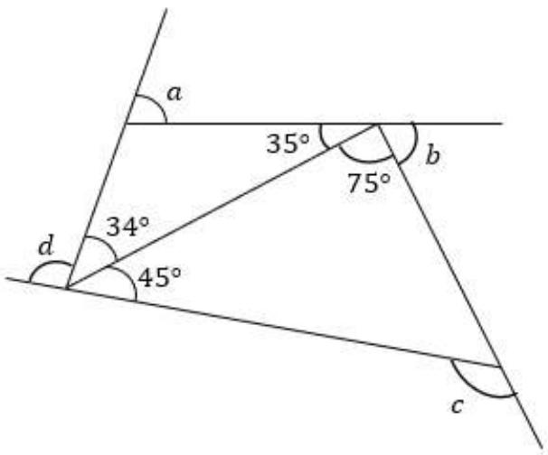

(A) $1 8 0 ^ { \circ }$ 

(B) $2 7 0 ^ { \circ }$ 

(C) $3 6 0 ^ { \circ }$ 

(D) $4 5 0 ^ { \circ }$ 

(E) None of the above 

16. Find the missing number 

$$
\begin{array}{l} \begin{array}{c c c} 4 0 & 2 4 & 8 \end{array} \\ \begin{array}{c c c} 4 5 & 1 9 & 1 3 \end{array} \\ \begin{array}{c c c} 2 9 & 5 & 1 2 \end{array} \\ (\quad) \quad 1 5 \quad 1 7 \\ \end{array}
$$

(A) 49 

(B) 50 

(C) 51 

(D) 52 

(E) 53 

17. Find the remainder when 

$$
\underbrace {5 5 5 \ldots 5 5} _ {2 0 2 1 5 ^ {\prime} s}
$$

is divided by 13. 

(A) 5 

(B) 3 

(C) 9 

(D) 4 

(E) 6 

18. 4 triangles are formed using 9 line segments of equal lengths. If 4 beads are to be put along each line segment at equal intervals, how many beads will there be altogether? 

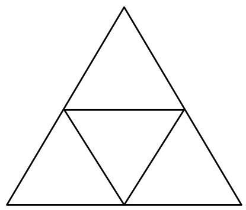

(A) 20 

(B) 21 

(C) 22 

(D) 24 

(E) 25 

19. Javier was walking home using the path indicated by the arrows. 

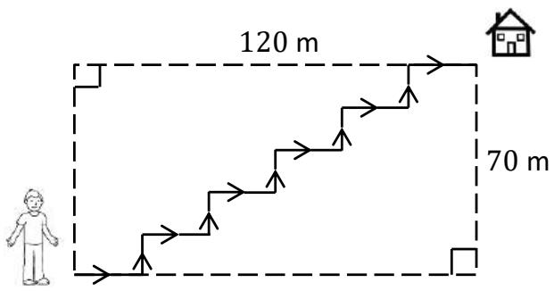

What was the total distance, in metres, he had covered by the time he reached home? 

(A) 70 

(B) 95 

(C) 120 

(D) 190 

(E) None of the above 

20. How many rectangles are there in the figure? 

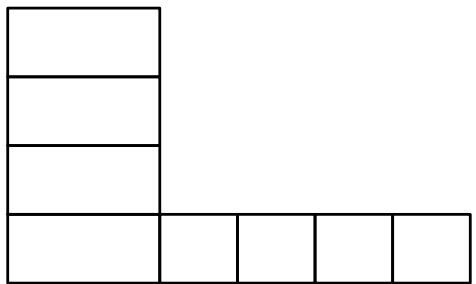

(A) 22 

(B) 24 

(C) 25 

(D) 26 

(E) 27 

## QUESTIONS 21 TO 25 ARE WORTH 6 MARKS EACH

21. In Mathematics, 

$$
\begin{array}{l} 1 ^ {2} = 1 \times 1 = 1 \\ 2 ^ {2} = 2 \times 2 = 4 \\ 3 ^ {2} = 3 \times 3 = 9 \\ \begin{array}{c} \dots \\ \dots \end{array} \\ \end{array}
$$

It is also observed that 

$$
\begin{array}{l} 2 ^ {2} = 1 ^ {2} + 3 \\ 3 ^ {2} = 2 ^ {2} + 5 \\ 4 ^ {2} = 3 ^ {2} + 7 \\ 5 ^ {2} = 4 ^ {2} + 9 \\ \dots \\ \dots \\ 2 1 ^ {2} = a ^ {2} + b \\ \end{array}
$$

Find the value of (? + ?). 

22. The figure shows a number pattern within an array of hexagons. In the middle, there is only one dot. There are 6 dots on the 1st hexagon. There are 12 and 18 dots on the 2nd and 3rd hexagons, respectively. 

How many dots are there in the 49th hexagon? 

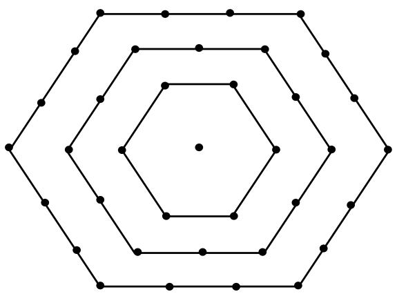

23. There are 1, 4 and 10 cubes in Figures 1, 2 and 3, respectively. 

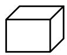

Fig 1

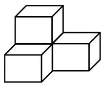

Fig 2

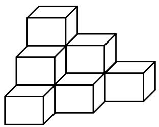

Fig 3

How many cubes are there altogether in Figures 1 to 5? 

24. Mdm Yee has 10 apples to give to her 3 children. Each child must get at least one apple. 

How many ways are there to do so? 

25. Megan was walking along a straight road. She met an oncoming car and she asked the driver, “Did you overtake a cyclist just now?” 

“Yes, 10 minutes ago,” the driver replied. 

After walking for another 10 minutes, Megan met the cyclist. 

Given that the cyclist’s speed was 4 times Megan’s walking speed, how many times of Megan’s speed was the driver’s speed? 

## End of Paper

## SEAMO 2021

## Paper B – Answers

## Multiple-Choice Questions

Questions 1 to 10 carry 3 marks each. 

<table><tr><td>Q1</td><td>Q2</td><td>Q3</td><td>Q4</td><td>Q5</td></tr><tr><td>22</td><td>57</td><td>None of the above</td><td>50</td><td>5</td></tr></table>

<table><tr><td>Q6</td><td>Q7</td><td>Q8</td><td>Q9</td><td>Q10</td></tr><tr><td>11</td><td>Both Adrian and Ben can drive</td><td>9</td><td>49</td><td>9</td></tr></table>

Questions 11 to 20 carry 4 marks each. 

<table><tr><td>Q11</td><td>Q12</td><td>Q13</td><td>Q14</td><td>Q15</td></tr><tr><td>28</td><td>84</td><td>2021</td><td>54</td><td><eq>360^{\circ}</eq></td></tr></table>

<table><tr><td>Q16</td><td>Q17</td><td>Q18</td><td>Q19</td><td>Q20</td></tr><tr><td>49</td><td>6</td><td>24</td><td>190</td><td>24</td></tr></table>

## Free-Response Questions

Questions 21 to 25 carry 6 marks each. 

<table><tr><td>21</td><td>22</td><td>23</td><td>24</td><td>25</td></tr><tr><td>61</td><td>294</td><td>70</td><td>36</td><td>9</td></tr></table>