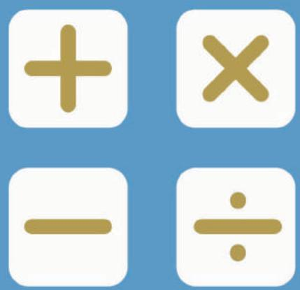
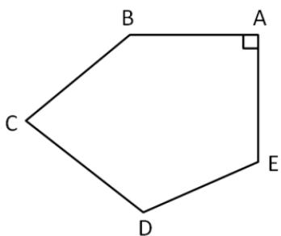
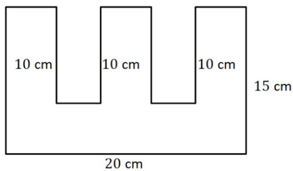
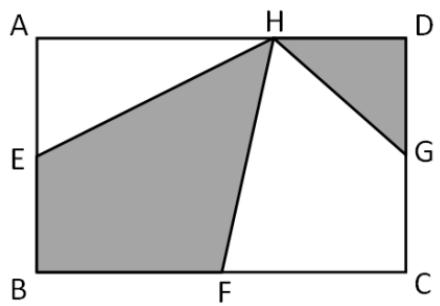
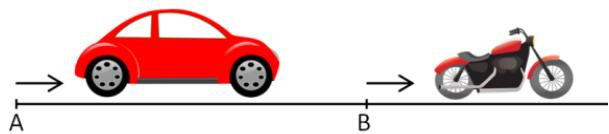
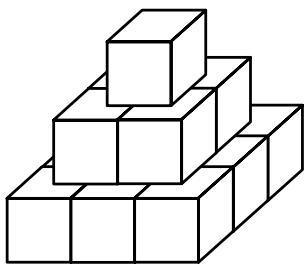
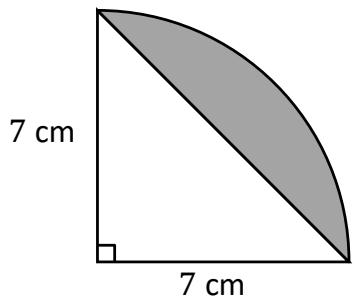
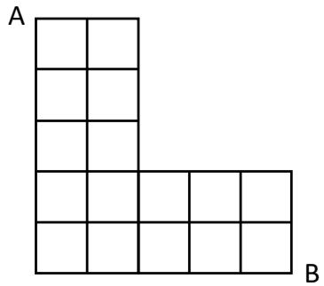
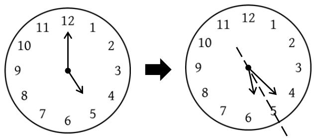

## PAPER B

## SEAMO

Southeast Asian Mathematical Olympiad 

## DO NOT OPEN THIS BOOKLET UNTIL INSTRUCTED.

## STUDENT'SNAME:

Read the instructions on the ANsWER sHEETand fillin your NAME,SCHOOLandOTHER INFORMATION. 

Usea2B orBpencil. 

DoNOTuseapen 

Ruboutanymistakescompletely. 

You MusTrecord your answers on the ANsweR SHEET. 

## MIDDLEPRIMARY

MarkonlyoNEanswerforeachquestion. 

Marksare NoTdeducted forincorrectanswers. 

## QUESTIONS 1TO 20

Usethe information providedto choose the BesTanswer from thefive possible options. 

On your ANsweR sHeET shade the option that matches youranswer. 

## QUESTIONS 21 T0 25

OnyourANsWER SHEETwrite your answer within the box provided.Unitsare notrequired. 

YouareNoTallowedtouseacalculator. 

## QUESTIONS 1 TO 10 ARE WORTH 3 MARKS EACH

1. The average of 5 numbers is 7. If one of the numbers is changed to 9, the new average becomes 8. What is the original value of the number that was changed? 

(A) 2 

(B) 3 

(C) 4 

(D) 5 

(E) 6 

2. What is the 100 th number in the series below? 

1, 4, 7, 10, … 

(A) 292 

(B) 294 

(C) 296 

(D) 298 

(E) 300 

3. It is given that $\angle A = 9 0 ^ { \circ }$ , find $\angle B +$ $\angle C + \angle D + \angle E$ . 

(A) $4 0 0 ^ { \circ }$ 

(B) $4 1 0 ^ { \circ }$ 

(C) $4 2 0 ^ { \circ }$ 

(D) $4 4 0 ^ { \circ }$ 

(E) $4 5 0 ^ { \circ }$ 

4. A square number is derived when a number is multiplied by itself. For example, 

$$
1 \times 1 = 1
$$

$$
2 \times 2 = 4
$$

$$
3 \times 3 = 9
$$

Find the first square number after 2022. 

(A) 1998 

(B) 2024 

(C) 2025 

(D) 2031 

(E) 2040 

5. Find the perimeter of the figure below. 

(A) 80 cm 

(B) 90 cm 

(C) 100 cm 

(D) 110 cm 

(E) 120 cm 

6. A number is an Ascending Number when its ones digit is greater than its tens digit. For example: 12, 56, 39, 27 and so on. How many 2-digit ascending numbers are there? 

(A) 35 

(B) 36 

(C) 37 

(D) 38 

(E) 39 

7. Mdm Jones distributed 20 rice dumplings and 25 apple pies to her neighbours. After distributing the dumplings and pies, she had 2 dumplings left but was short of 2 pies. How many neighbours did she distribute the food to? 

(A) 9 

(B) 10 

(C) 11 

(D) 12 

(E) 14 

8. Find the possible values of ? and ? , respectively, in 7?36? , so that the 5-digit number is divisible by both 5 and 9? 

(A) 2, 0 

(B) 6, 5 

(C) 3, 0 

(D) Both (A) and (B) 

(E) Both (B) and (C) 

9. ???? is a rectangle. ? is a point along ?? . ? , ? and ? are the midpoints of ?? , ?? , and ?? , respectively. Given that the area of ???? is 40 cm2, find the area of the shaded regions? 

(A) 18 

(B) 20 

(C) 22 

(D) 24 

(E) 28 

10. A car left Point ? and a motorcycle left Point ? at the same time. Both travelling in the same direction. If the car travels at 60 km/h, it will catch up with the motorcycle in 5 hours. If the car travels at 70 km/h, it will catch up with the motorcycle in 3 hours. Find the speed of the motorcycle. 

(A) 45 

(B) 48 

(C) 52 

(D) 54 

(E) 56 

## QUESTIONS 11 TO 20 ARE WORTH 4 MARKS EACH

11. The figure shown is made up of 3 layers of 2 × 2 × 2 cm cubes. Find the total area of the visible surfaces from the top and sides. 

(A) 105 

(B) 103 

(C) 120 

(D) 126 

(E) 132 

12.There are altogether 48 books on a bookshelf with three levels. 

Candy moved 8 books from the top shelf to the middle one. She then moved 6 books from the middle shelf to the bottom one. The 3 shelves then had the same number of books. 

How many books were in the top shelf at first? 

(A) 20 

(B) 22 

(C) 24 

(D) 26 

(E) 28 

13.Find the number of consecutive “1’?” in 

$$
\underbrace {8 8 8 \dots 8} _ {2 0 2 2} \times \underbrace {9 9 9 \dots 9} _ {2 0 2 2}
$$

(A) 2020 

(B) 2021 

(C) 2022 

(D) 1021 

(E) 1022 

14. The area of a circle is given as $\pi r ^ { 2 }$ , where $\pi = { \frac { 2 2 } { 7 } }$ 227 , and ? is the radius. Find the area of the shaded region. 

(A) $1 0 \ c m ^ { 2 }$ 

(B) $1 1 \ c m ^ { 2 }$ 

(C) $1 2 \ c m ^ { 2 }$ 

(D) $1 3 \ \mathsf { c m } ^ { 2 }$ 

(E) $1 4 \ c m ^ { 2 }$ 

15. ?, ?, ?, ? and ? had ranked among the top 5 participants in a Mathematics competition. Their coach asked them to make a guess about their rankings. 

?: ? is ranked 2, ? is ranked 5 

?: ? is ranked 2, ? is ranked 4 

?: ? is ranked 1, ? is ranked 5 

?: ? is ranked 2, ? is ranked 3 

?: ? is ranked 3, ? is ranked 4 

Given that each student is right about 1 statement that she made, who was ranked in 1st place? 

(A) ? 

(B) ? 

(C) ? 

(D) ? 

(E) ? 

16. The number 37 can be written as the sum of difference prime numbers. For example, 

$$
3 7 = 3 + 5 + 2 9
$$

$$
= 2 + 5 + 7 + 2 3
$$

How many ways are there to do so? 

(A) 7 

(B) 8 

(C) 9 

(D) 10 

(E) 11 

17. Starting on 1st January 2022, ? works for 3 days before resting for 1 day. ? works for 5 days before taking 2 days off. On the day when both ? and ? are off duty, ? would work as a relief worker. How many days does ? have to work in 2022? 

(A) 22 

(B) 24 

(C) 26 

(D) 28 

(E) 30 

18. Find the remainder when 666 666 is divided by 13. 

(A) 0 

(B) 1 

(C) 2 

(D) 3 

(E) 4 

19. Find the number of shortest paths from ? to ?. 

(A) 120 

(B) 122 

(C) 124 

(D) 125 

(E) 126 

20. The time on the clock is now 5 pm. How many minutes later will the minute- and hour- hands first be of equal distance on both sides of the number $3 7 2$ 

(A) 23 1 $2 3 \frac { 1 } { 1 3 }$ 

(B) $2 3 \frac { 2 } { 1 3 }$ 

(C) $2 4 \frac { 1 } { 1 1 }$ 

(D) $2 4 \frac { 3 } { 1 1 }$ 

(E) $2 4 \frac { 5 } { 1 1 }$ 

## QUESTIONS 21 TO 25 ARE WORTH 6 MARKS EACH

21. Noppon is to choose 2 different numbers from {11,12,13, … ,20,21}. The probability that the sum of the 2 numbers is even is ${ \frac { m } { n } } .$ . Find the value of $( m + n )$ . 

22. The average age of a group of doctors and teachers is 40 . The average age of the doctors is 60 while that of the teachers is 28 . Given that the number of doctors and teachers is in the ratio a∶b, find the 2-digit number $\overline { { a b } }$ . 

23. Lenny left home for school without his homework, so Mum left home shortly after to catch up to him. 10 minutes after receiving his homework from Mum, Lenny arrived at school and Mum arrived home. If Mum’s walking speed was twice of that of Lenny’s, how long (in minutes) did Mum take to catch up with him? 

24. Evaluate 

$$
1 - 3 + 5 - 7 + 9 - 1 1 + 1 3 - \dots - 3 9 + 4 1
$$

25. ???? is a multiple of 11. Given that $\overline { { b c } }$ is a perfect square, and $a = b + c ,$ find the largest possible value of $\overline { { a b c d } }$ . 

End of Paper 

## SEAMO 2022

## Paper B – Answers

## Multiple-Choice Questions

Questions 1 to 10 carry 3 marks each. 

<table><tr><td>Q1</td><td>Q2</td><td>Q3</td><td>Q4</td><td>Q5</td></tr><tr><td>(C)</td><td>(D)</td><td>(E)</td><td>(C)</td><td>(D)</td></tr></table>

<table><tr><td>Q6</td><td>Q7</td><td>Q8</td><td>Q9</td><td>Q10</td></tr><tr><td>(B)</td><td>(A)</td><td>(D)</td><td>(B)</td><td>(A)</td></tr></table>

Questions 11 to 20 carry 4 marks each. 

<table><tr><td>Q11</td><td>Q12</td><td>Q13</td><td>Q14</td><td>Q15</td></tr><tr><td>(E)</td><td>(C)</td><td>(B)</td><td>(E)</td><td>(E)</td></tr></table>

<table><tr><td>Q16</td><td>Q17</td><td>Q18</td><td>Q19</td><td>Q20</td></tr><tr><td>(D)</td><td>(C)</td><td>(A)</td><td>(E)</td><td>(A)</td></tr></table>

## Free-Response Questions

Questions 21 to 25 carry 6 marks each. 

<table><tr><td>21</td><td>22</td><td>23</td><td>24</td><td>25</td></tr><tr><td>16</td><td>35</td><td>10</td><td>21</td><td>9812</td></tr></table>