## Question 1

Which of the following is an even number? 

A. 587 

B. 634 

C. 61 

D. 333 

E. 325 

## Question 2

6 + 15 is the same as ___ + 4. 

A. 15 

B. 17 

D. 16 

E. 18 

## Question 3

Which card below has the greatest value? 

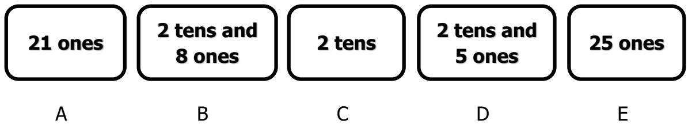

## Question 4

If ∆× 7 = 21, what is the value of (∆+10)? 

A. 3 

B. 13 

C. 10 

D. 21 

E. 17 

## Question 5

Calculate 9 + 8 + 7 + 6 + 5 + 4 + 3 + 2 + 1. 

A. 45 

B. 49 

C. 40 

D. 50 

E. 30 

## Question 6

Benny wants to put his 13 candies into 4 boxes. How many more candies does he need at the least such that each box will have an equal number of candies and all his candies will be in the boxes? 

A. 1 

B. 2 

C. 3 

D. 4 

E. 5 

## Question 7

Yesterday was Monday. Which day of the week will be the day after tomorrow? 

A. Monday 

B. Tuesday 

C. Wednesday 

D. Thursday 

E. Friday 

## Question 8

Bob and James spent some money on buying gifts. Bob spent $20 less than James. If James spent twice as much money as Bob, how much money did James spend on gifts? 

A. $20 

B. $30 

C. $40 

D. $60 

E. $100 

## Question 9

Amy, Beatrice, Cindy, Dawn and Elena took the same test. Cindy scored more than Dawn and more than Elena. Elena scored more than Beatrice. Amy scored more than Beatrice. Dawn scored more than Elena. Who got the lowest score among the five of them? 

A. Amy 

B. Beatrice 

C. Cindy 

D. Dawn 

E. Elena 

## Question 10

Sally’s teacher asked her to add a number to 8. However, Sally read the number wrongly and reversed its digits. For example, she would read 12 as 21. As a result, she got a final sum of 39. What should be the sum if Sally read the number correctly? 

A. 21 

B. 31 

C. 29 

D. 8 

E. 13 

## Question 11

Observe the following pattern. What is the missing number? 

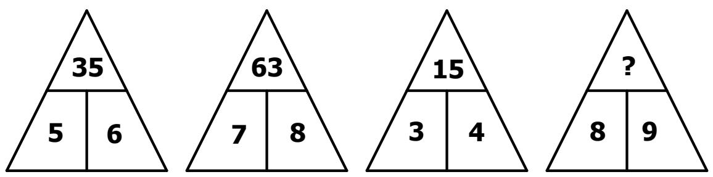

A. 17 

B. 36 

C. 72 

D. 80 

E. 19 

## Question 12

How will the following figure look like when looking from the top? 

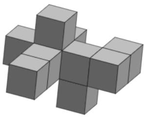

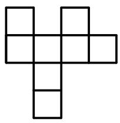

A

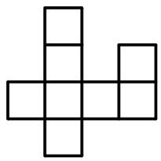

B

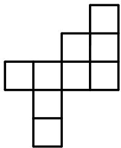

C

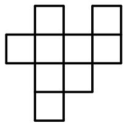

D

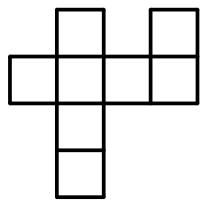

E

## Question 13

Yong Xin had 8 plates. He placed some pears on the plates according to a pattern. The first 5 plates are shown below: 

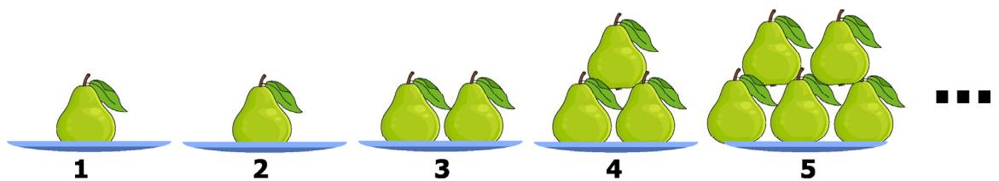

How many pears are there on the $6 ^ { \mathrm { { t h } } }$ plate? 

A. 5 

D. 8 

E. 10 

## Question 14

The table below follows a pattern. 

<table><tr><td>Row</td><td>Pattern</td></tr><tr><td>1</td><td>SIMOC2021</td></tr><tr><td>2</td><td>ISMOC0212</td></tr><tr><td>3</td><td>IMSOC2120</td></tr><tr><td>4</td><td>IMOSC1202</td></tr><tr><td>5</td><td>IMOCS2021</td></tr><tr><td>6</td><td>SIMOC0212</td></tr><tr><td>...</td><td>...</td></tr></table>

The word ‘SIMOC2021’ appears in the first row for the first time. In which row will ‘SIMOC2021’ appear again for the second time? 

A. 12 

B. 20 

C. 21 

D. 24 

E. 7 

## Question 15

Four of the following figures can be drawn without lifting the pen and without retracing any lines that have already been drawn. Which of the following figures cannot be drawn in the same way? 

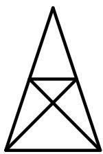

A

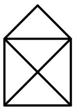

B

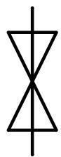

C

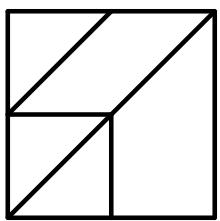

D

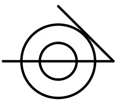

E

## Question 16

$$
\boxed {5 4 1} \boxed {+} \boxed {2 8 9} \boxed {=} \boxed {?}
$$

## Question 17

How many 2-digit even numbers can be formed with the digits below if each digit below can only be used at most once in any number? 

2, 3, 5 

## Question 18

Study the picture below. 

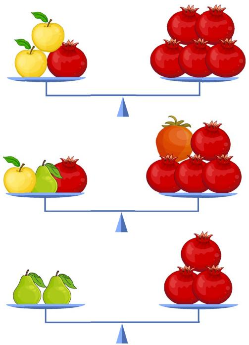

If = 1 and = 2, then what is the value of 

## Question 19

Three workers can clean 6 rooms in one day. How many workers are needed to clean 20 rooms in one day? 

## Question 20

Three girls, May, April and June, ate some fruits. The fruits were orange, peach and apple. Each girl ate only 1 fruit and every girl ate a different fruit. Based on the following statements, which girl ate the orange? 

• May ate either the orange or the peach; 

• April only eats fruits with the same number of letters in its name as her name; 

• June ate the apple. 

Note: If it is May, leave your answer as 5555. If it is April, leave your answer as 4444. If it is June, leave your answer as 6666. 

Translation Instructions: use the names of the girls and fruits which have the same number of letters as orange (6), peach (5), apple (5), May (3), April (5) and June (4). 

## Question 21

Mark has 7 wooden sticks. He can break a wooden stick into three, making 3 shorter wooden sticks (these are still considered wooden sticks). Mark wants to have 13 wooden sticks in total. How many of the 7 wooden sticks must he break in this way to get 13 wooden sticks in total? 

## Question 22

There are 2 lights installed on Jimmy’s skateboard: one red light and one blue light. The red light flashes every 2 minutes and the blue light flashes every 3 minutes. If all the lights flash together just now, how many minutes later will they flash together again for the first time? 

## Question 23

Mary has a jar of candies. There are 2 red candies and 3 blue candies. She takes out the candies without looking at their colour. What is the least number of candies she must take out so that she will have 2 blue candies? 

## Question 24

After school, Janet needs to exercise at the gym, practise at the dance studio and buy some groceries at the supermarket before going home. She does not need to complete her tasks in that particular order. Below is a map showing her home, school, and the three places she needs to visit. She can only travel on the designated paths and the length of each path is shown. What is the least total distance she needs to travel (in metres) from her school to her home while completing all her tasks? 

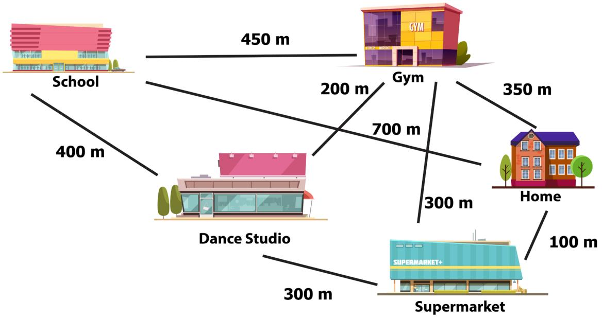

## Question 25

Farmer John had some ducks and cows. He had 12 animals in total, and the animals had a total of 36 feet. After he sold some ducks and bought some cows, he still had 12 animals but the total number of feet increased to 40. How many ducks did he sell? 