## Question 1

Which of the following is an odd number? 

A. 496 

B. 1110 

C. 441 

D. 20 

E. 6 

## Question 2

8 + 13 is the same as ___ + 4. 

A. 19 

B. 7 

C. 17 

D. 16 

E. 18 

## Question 3

Which card below has the greatest value? 

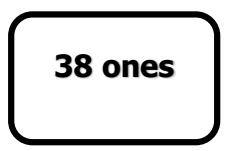

A 

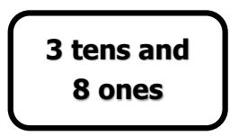

B 

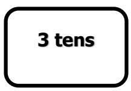

C 

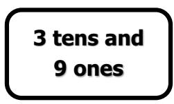

D 

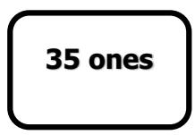

E 

## Question 4

If $\Delta \times 6 = 2 4$ , what is the value of (∆+11)? 

A. 4 

B. 11 

C. 14 

D. 15 

E. 16 

## Question 5

Calculate. 

$$
2 + 5 + 9 + 1 3 + 1 7 - 4 - 8 - 1 2 - 1 6
$$

A. 5 

B. 6 

D. 8 

## Question 6

One box of cookies contains exactly 4 cookies. Harry bought 6 such boxes. If he ate one cookie, how many cookies does he have now? 

A. 19 

B. 20 

C. 23 

D. 24 

E. 25 

## Question 7

Study the picture below. 

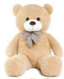

+ 

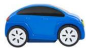

= $50 

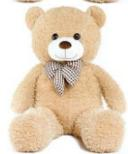

+ 

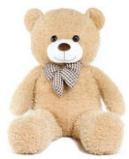

= $56 

How much does 

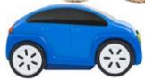

cost? 

A. $28 

B. $23 

C. $22 

D. $32 

E. $12 

## Question 8

How many triangles are there in the figure below? 

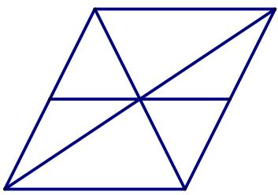

A. 13 

B. 12 

C. 10 

D. 8 

E. 7 

## Question 9

The diagram shows some cubes of the same size stacked in a corner of a room. How many cubes are there altogether? (Note: The floor is horizontal and the two walls are vertical. There are no gaps or holes behind the visible cubes. 

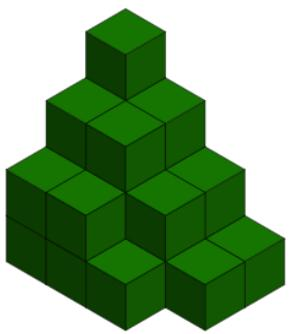

A. 14 

B. 34 

C. 25 

E. 24 

## Question 10

One ruler weighs as heavy as three pens. Two pens weigh as heavy as five pencils. How many pencils weigh as heavy as two rulers? 

A. 5 pencils 

B. 10 pencils 

C. 15 pencils 

D. 20 pencils 

E. 25 pencils 

## Question 11

The four cards below are numbered with 3-digit numbers. Each digit appears twice in these 4 numbers, what is the smallest possible number on the fourth card? 

<table><tr><td>829</td><td>398</td><td>563</td><td>?</td></tr></table>

A. 265 

B. 526 

C. 562 

D. 625 

E. 256 

## Question 12

Amy is 2 years older than Benjamin. Cindy is 3 years younger than Dorothy. Benjamin is 4 years younger than Dorothy. The sum of Amy’s and Cindy’s ages is 17. What is the sum of ages of these four children? 

A. 30 

B. 31 

C. 34 

D. 35 

E. 7 

## Question 13

What is the next number in the sequence below? 

$$
\begin{array}{l} 2, 3, 5, 8, 1 3, 2 1, \dots \end{array}
$$

A. 25 

B. 28 

C. 33 

D. 34 

E. 43 

## Question 14

How many 3-digit numbers have the sum of their digits equal to 25? 

A. 2 

B. 5 

D. 7 

E. 999 

## Question 15

How many even multiples of 5 between 1 and 202 are there? 

A. 202 

B. 20 

C. 19 

D. 40 

E. 200 

## Question 16

In a shop, one pen costs 2 cents more than one pencil. One pen and two pencils cost 40 cents. How many cents does one pen cost? 

## Question 17

Given ∇= 1 and $\left( \Delta - \nabla \right) \times \left( \Delta + \nabla \right) = 3 5$ . Find the value of ∆. 

## Question 18

Study the pattern and find the value of the missing number. 

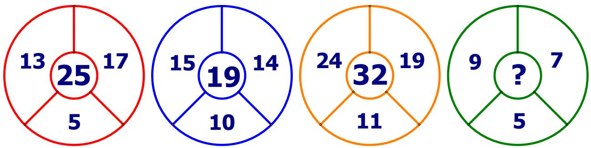

## Question 19

Two cubes are joined together as shown below. Each cube has 6 faces. Five faces with numbers written on them are shown. The sum of the numbers on the opposite faces in each cube is equal to 7. What is the sum of the numbers on the other 7 faces which are not visible in the picture? 

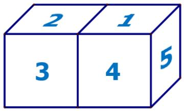

## Question 20

Karl brought some cookies to school. In the morning, he shared half of them with his friends. He ate 13 cookies at lunch. Afterwards, he had one-third of the cookies he brought left. How many cookies did he bring to school? 

## Question 21

Study the picture below. Find the value of the missing number. 

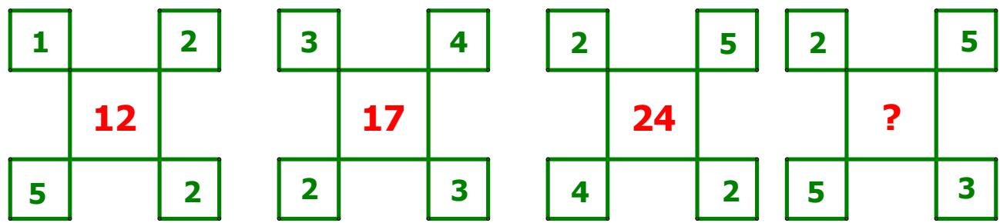

## Question 22

Dorothy has some marbles. She can put them in 9 bags in a way that each bag contains an equal number of marbles. If she gives one of her marbles to Amy, then Dorothy can put all her marbles in 10 bags such that each bag has an equal number of marbles. What is the smallest number of marbles can Dorothy have initially? 

## Question 23

The total number of digits in the page numbering of a book is 99. If the page numbering starts with 1, how many pages are there in the book? 

## Question 24

How many times does digit 2 appear in whole numbers from 1 to 141? 

## Question 25

Three friends looked inside a box with candies and made the following statements: 

Frank: Cindy only tells the truth. There are 18 candies in the box. 

Amy: There are 9 candies in the box. Frank always lies. 

Cindy: There are 13 candies in the box. There are more candies than Amy says. If one of them only tells the truth, one of them always lies, and one of them tells one truth and one lie, how many candies are in the box? 