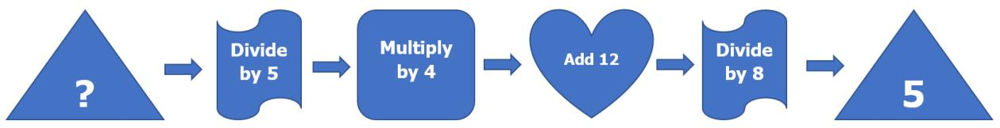
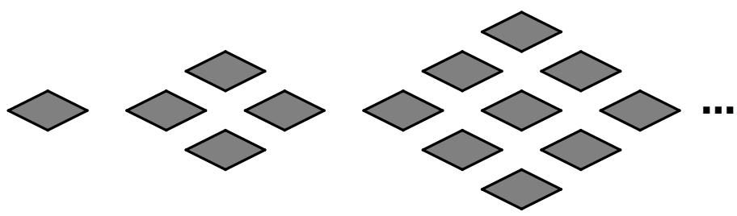
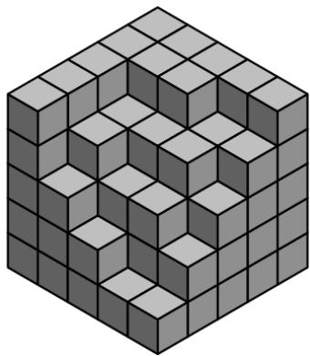
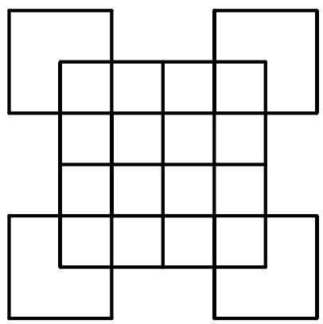
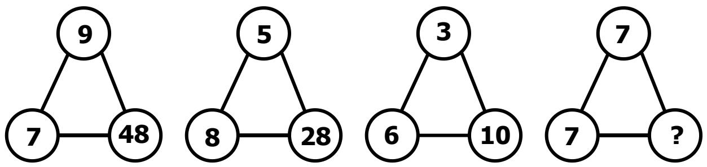
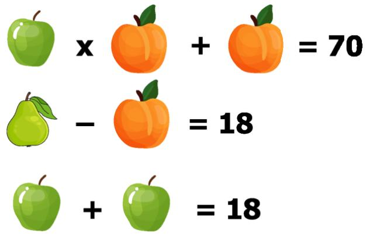
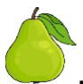

# PRIMARY 1 (GRADE 1) 2023 CONTEST PAPER

## NAME:

## SCHOOL:

## Index Number:

## INSTRUCTIONS:

1. Please DO NOT OPEN the contest booklet until the Proctor has given permission to start 

2. TIME: 1 hour 30 minutes. 

3. There are 25 questions: 

Section A: Questions 1 to 15 score 2 points each, no points are deducted for an unanswered question and 1 point is deducted for the wrong answer. 

Section B: Questions 16 to 25 score 4 points each, no points are deducted for an unanswered or wrong answer. 

4. Shade your answers neatly using a 2B lead pencil in the Answer Entry Sheet. 

5. PROCTORING: No one may help any student in any way during the contest. 

6. No electronic devices capable of storing and displaying visual information are allowed during the course of the exam. 

7. Strictly No Calculators are allowed into the exam. 

8. All students must fill and shade their Name, School and Index Number in the Answer Entry Sheet and Contest booklet. 

9. A student must show detailed working and transfer answers to the Answer Entry Sheet. 

10.No exam papers and written notes can be taken out by any contestant. 

## Rough Working

## Section A (Correct answer – 2 points| No answer – 0 points| Incorrect answer – minus 1 point)

## Question 1

Which of the following is an even number? 

A. 385 

B. 2023 

C. 1352 

D. 241 

E. 5 

## Question 2

If $\Delta \times 7 = 5 6 ,$ what is the value of $( \Delta + 2 2 ) ?$ 

A. 8 

B. 22 

C. 30 

D. 32 

E. 40 

## Question 3

Calculate the sum below. 

$$
7 6 + 1 3 5 + 4 7 + 3 6 + 6 4 + 5 3 + 2 6 5 + 1 2 4
$$

A. 800 

B. 700 

C. 80 

D. 8000 

E. 808 

## Question 4

One jar of marbles contains exactly 9 marbles. Sarah bought 7 such jars. If she lost two marbles, how many marbles does she have now? 

A. 61 

B. 62 

C. 63 

D. 65 

E. 60 

## Question 5

Study the picture below and find the missing number. 

A. 20 

B. 25 

C. 30 

D. 35 

E. 40 

## Question 6

Picture 1 has one shape. Picture 2 has four shapes. Picture 3 has nine shapes. How many shapes will there be in Picture 9? 

Picture 1

Picture 2

Picture 3

A. 49 

B. 64 

D. 81 

E. 100 

## Question 7

The diagram shows some cubes of the same size stacked at a corner of a room. How many cubes are there altogether? 

(Note: The floor is horizontal and the two walls are vertical. There are no gaps or holes behind the visible cubes.) 

A. 96 

B. 97 

C. 98 

D. 100 

E. 95 

## Question 8

If the day before yesterday is four days before Wednesday. What will be the day after tomorrow? 

A. Monday 

B. Tuesday 

C. Wednesday 

D. Thursday 

E. Sunday 

## Question 9

How many squares are there in the figure below? 

A. 34 

B. 33 

C. 35 

E. 29 

## Question 10

The sum of the 4 different even non-zero whole numbers is 40. What is the largest possible number among these 4 numbers? 

A. 28 

B. 30 

C. 34 

D. 38 

E. 40 

## Question 11

In the table below, 5 letters and 4 digits appear in a repeating pattern. Which letter and digit will appear in the $6 2 ^ { \mathsf { n d } }$ column? 

<table><tr><td>S</td><td>I</td><td>M</td><td>O</td><td>C</td><td>S</td><td>I</td><td>M</td><td>O</td><td>C</td><td>...</td></tr><tr><td>2</td><td>0</td><td>2</td><td>3</td><td>2</td><td>0</td><td>2</td><td>3</td><td>2</td><td>0</td><td>...</td></tr></table>

A. S, 2 

B. I, 0 

C. M, 2 

D. M, 3 

E. M, 0 

## Question 12

There are 7 types of flowers available in a flower shop: roses, lilies, sunflowers, tulips, orchids, daisies and carnations. Emma wants to buy 2 different types of flowers. How many different choices does she have? 

A. 49 

B. 42 

C. 28 

D. 21 

E. 15 

## Question 13

Find the next number in the sequence below. 

3, 4, 7, 10, 11, 16, 15, 22, 19, … 

A. 27 

B. 28 

C. 23 

D. 25 

E. 29 

## Question 14

Observe the following pattern. What is the missing number? 

A. 56 

B. 42 

C. 36 

D. 64 

E. 14 

## Question 15

Five athletes, Alex, Ben, Charlie, David and Eric, competed in a race. Alex finished ahead of David and Eric, while David finished ahead of Charlie. Eric finished ahead of Ben and there was exactly one person between the two of them. If Ben was not the last, who finished third in the race? 

A. Alex 

B. Ben 

C. Charlie 

D. David 

E. Eric 

Section B (Correct answer – 4 points| No answer – 0 points| Incorrect answer – 0 point) 

## Question 16

It is given that: 

Find the value of 

## Question 17

There are 6 black balls, 5 blue balls, 4 red balls and 3 green balls in a box. What is the least number of balls Emily must take from the box without looking to be sure of getting two balls of the same colour? 

## Question 18

Emily lists down all 2-digit multiples of a number. If she listed 10 numbers in total, what is this number? 

## Question 19

The sum of the digits of an even 3-digit number is 21. What is the sum of the largest and smallest possible such 3-digit numbers? 

## Question 20

How many different ways are there to pay for a $25 toy using $2, $5 or $10 notes? 

## Question 21

How many 3-digit odd numbers can be formed using any of the digits 0, 1, 7 and 2? Each digit can be used at most once in any 3-digit number. 

## Question 22

Study the pattern below. 

$$
3 \blacksquare 6 = 6 6
$$

$$
2 \blacksquare 7 = 7 5
$$

$$
8 \blacksquare 8 = 9 1
$$

$$
5 \blacksquare 1 = 1 8
$$

What is the value of 6∎3? 

## Question 23

Tom had a bag of marbles. He gave away half of the marbles to his brother. After that, he gave away some of the remaining marbles to his sister. Finally, he was left with 18 marbles. If the amount he gave away to his brother was 3 times the amount he gave away to his sister, how many marbles did he have at first? 

## Question 24

A backpack containing 5 textbooks weighs 2800 grams. If 2 textbooks were removed, the remaining weight would be 1900 grams. If all the textbooks weigh the same, what is the weight (in grams) of the backpack? 

## Question 25

A teacher has some buns. If she gives 6 buns to each of her students, there will be an excess of 3 buns. If she gives 7 buns to each of her students, she will need another 6 buns. How many buns does the teacher have? 