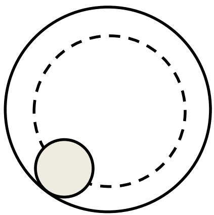
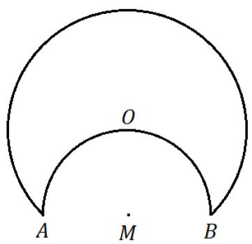
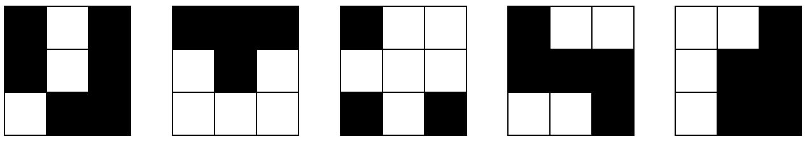

## Section A (Correct answer – 2 points| No answer – 0 points| Incorrect answer – minus 1 point)

## Question 1

Find the value of 

$$
\left(\frac {1}{\sqrt {0} + \sqrt {1}} + \frac {1}{\sqrt {1} + \sqrt {2}} + \frac {1}{\sqrt {2} + \sqrt {3}} + \dots + \frac {1}{\sqrt {2 0 1 7} + \sqrt {2 0 1 8}}\right) ^ {2}
$$

A. 2016 

B. 2017 

C. 2018 

D. 2029 

E. None of the above 

## Question 2

A triangle, circle and square are drawn on a rectangular (with different dimensions) piece of paper. What is the greatest number of regions that can be formed? 

A. 4 

B. 19 

C. 23 

D. 27 

E. None of the above 

## Question 3

A positive integer is said to be a “double square” if it can be written as a sum of two perfect squares. Given that all the following options below are prime, which of them is a “double square”? 

A. 15139 

B. 23357 

C. 35803 

D. 41183 

E. None of the above 

## Question 4

The value of 30! is computed and all the ending digits “0” are removed from the result. What is the last digit of the remaining value? 

A. 2 

B. 4 

C. 6 

D. 8 

E. None of the above 

## Question 5

A small circle with radius ????, rolls along the inner circumference of the larger circle with radius of 3????. How many rotations has the smaller circle done around its centre when it reaches the original starting position? 

A. 1 

B. 1.5 

C. 2 

D. 4 

E. None of the above 

## Question 6

The letters “C”, “I”, “M”, “O” and “S” are rearranged to form all five-letter words. The list of words is then arranged in dictionary order. For example, the first word is CIMOS and the last word is SOMIC. What is the order of ‘SIMOC’ in the list? 

A. 101 

B. 106 

C. 109 

D. 120 

E. None of the above 

## Question 7

If $a b + b c + c a = 0$ what is the value of $\begin{array} { r } { \frac { 1 } { a ^ { 2 } - b c } + \frac { 1 } { b ^ { 2 } - c a } + \frac { 1 } { c ^ { 2 } - a b } ? } \end{array}$ 

A. 2 

B. 3 

D. 5 

E. None of the above 

## Question 8

In the figure below, arc ???????????? is a semicircle centered at ????, with being the middle point. Another arc centered at passing through ???? and is drawn. Given that $M A = 5$ , the area enclosed by the figure can be written as $a + b \pi$ , where ???? and are positive rational numbers. What is the value of $a + b ?$ 

A. 25 

B. 50 

C. 75 

D. 100 

E. None of the above 

## Question 9

Some white and black cubes are combined to build a 3 × 3 × 3 bigger cube. Five faces of the big cube are shown below: 

Given that the middle square of the 6th remaining face is white, how many black squares are there on the 6th remaining face? 

A. 1 

B. 3 

C. 5 

D. 7 

E. None of the above 

## Question 10

There are 3 different types of special power pill found in the lab: 33 Strength, 37 Agility and 49 Intelligence pills. A pharmacist is tasked to reduce the quantity of special power pills in the lab until only one Intelligence pill is left. 

• She can combine 1 Strength and 1 Agility pill to get 1 Intelligence pill 

• She can combine 1 Strength and 1 Intelligence pill to get 1 Agility pill 

• She can combine 1 Agility pill and 1 Intelligence pill to get 1 Strength pill. 

Before she starts the combination process, she must add one more pill. Once the pill combination process has started, no additional pills can be added. Which pill must the pharmacist add to achieve her task? 

A. Strength 

B. Agility 

C. Intelligence 

D. Adding any type of pill will give you the intelligence pill 

E. None of the above 

## Question 11

Let ???? be a positive number such that $\textstyle a ^ { 2 } + { \frac { 1 } { a ^ { 2 } } } = 7$ 2 . What is the value of $\textstyle a ^ { 3 } + { \frac { 1 } { a ^ { 3 } } } ?$ 

A. ±12 

B. ±15 

C. ±18 

D. ±27 

E. None of the above 

## Question 12

You are given an empty 3 litres and 8 litres jug. You can perform any of the following steps: 

• Fill a jug completely with water. 

• Completely empty a jug. 

• Pour water from one jug to another until either of the jugs is either empty or full. 

What is the minimum number of steps required to obtain exactly 1 litre of water in one of the jugs? 

A. 6 

B. 7 

C. 8 

D. 9 

E. None of the above 

## Question 13

A group of knights, knaves and traders joined a conference hosted by the King. Knights always tell the truth; knaves always lie while traders alternate between telling the truth or lying. The King asked each person the 4 questions below in the following order: 

1. Are you a knight? 

2. Are you a trader? 

3. Are you a knave? 

4. Are you a knight? 

Thirty-eight people replied “Yes” to the first 2 questions, 15 people replied “Yes” to both the second and third questions, no one replied “Yes” to both questions 3 and 4 and 28 people replied “Yes” in both the first and last questions. 

How many knights are there? 

A. 3 

B. 4 

C. 5 

D. 6 

E. None of the above 

## Question 14

How many 3-digit numbers are divisible by 6, 7 or 12? 

A. 30 

B. 196 

C. 216 

D. 257 

E. None of the above 

## Question 15

What is the sum of the coefficients of ????????, where ???? is even, in the expansion of: 

$$
(2 x ^ {2} - 3 x + 2) ^ {2} (x ^ {2} - 2 x + 2) ^ {4}
$$

A. 202 

B. 3884 

C. 15313 

D. 17212 

E. None of the above 

## Section B (Correct answer – 4 points| Incorrect or No answer – 0 points)

When the answer is a 1-digit number, shade “0” for the tens, hundreds and thousands place. 

Example: if the answer is 7, then shade 0007 

When the answer is a 2-digit number, shade $\ " 0 \prime \prime$ for the hundreds and thousands place. 

Example: if the answer is 23, then shade 0023 

When the answer is a 3-digit number, shade $\ " 0 \prime \prime$ for the thousands place. 

Example: if the answer is 785, then shade 0785 

When the answer is a 4-digit number, shade as it is. 

Example: if the answer is 4196, then shade 4196 

## Question 16

If $P ( x )$ is a non-zero polynomial with all integer coefficients and has the root: 

$$
x = \sqrt {2 0 1 9} + \sqrt [ 3 ]{2 0 2 0}
$$

What is the minimum degree of $P ( x ) ?$ 

## Question 17

Find the number of real solution(s) of the following equation. 

$$
\sqrt {- x ^ {2} + 8 x - 1 7} + \sqrt {3 x ^ {2} - 2 4 x + 4 8} = \sqrt {2 x ^ {2} - 1 6 x + 6 5}
$$

## Question 18

We have three coins, one is fair (head on one side and tail on the other), one has Head on both sides, and one has Tail on both sides. We pick a coin at random and toss it. If it shows Head facing up, the probability that the other side of the coin is also a Head is ${ \frac { a } { b } } \cdot \operatorname { I f } { \frac { a } { b } }$ is a fraction in simplest form, find the value of $a + b$ . 

## Question 19

Let ???? and ???? be two functions on ℝ such that: 

$$
f (x) = \frac {1 0}{\log_ {x} e ^ {1 0}}, g (x) = e ^ {\frac {1 0}{x (x + 1) (x + 2)}}
$$

Let S be the sum of composite functions such that: 

$$
S = f (g (1)) + f (g (2)) + \dots + f (g (1 0))
$$

If $\begin{array} { r } { S = \frac { a } { b ^ { \prime } } , } \end{array}$ where $\frac { a } { b }$ is a fraction in simplest form. Find the value of $a + b$ . 

## Question 20

The function $S ( x )$ is the sum of the digits of the positive integer ????. If the sum of the positive integer ???? and $S ( x )$ is equal to 2019. What is the smallest possible value of $x ?$ 

## Question 21

Let $a _ { n }$ and $b _ { n }$ be 2 distinct roots of the equation $x ^ { 3 } - 1 2 x + 1 6 = 0$ for all ${ \mathsf n } =$ $1 , 2 , . . . , 1 0 0$ . Find the value of: 

$$
\left| \frac {3}{(a _ {1} - 1) (b _ {1} - 1)} + \frac {3}{(a _ {2} - 1) (b _ {2} - 1)} + \dots + \frac {3}{(a _ {1 0 0} - 1) (b _ {1 0 0} - 1)} \right|
$$

## Question 22

What is the smallest positive integer ???? such that the first 4-digit of the number $n \times 2 0 1 9$ is 2018? 

## Question 23

How many positive integers ???? satisfy all the criteria below? 

• $n ^ { 2 } - 3 n + 2$ is divisible by 24 

• $n ^ { 2 } + 5 n + 6$ is divisible by 7 

$n \leq 2 0 0$ 

## Question 24

A triangle ABC is inscribed in a circle with radius of 6 cm. Point M is the intersection point of the heights of the triangle ABC. If $\angle B A C = 6 0 ^ { \circ }$ , find the length (in cm) of the segment AM. 

## Question 25

Given that 

$$
a + b = 3
$$

$$
a ^ {2} + b ^ {2} = 1
$$

Find the sum of digits of $a ^ { 1 0 } + b ^ { 1 0 }$ . 