# Singapore International Math Olympiad Challenge 2019

# GRADE 2 (PRIMARY 2)

July 7, 2019 

Time: 1 hour 30 minutes 

NAME: 

GRADE: 

COUNTRY: 

## INSTRUCTIONS

1. Please DO NOT OPEN the contest booklet until the Proctor has given permission. 

2. There are 25 questions. 

Section A: Questions 1 to 15 score 2 points each, no points are deducted for unanswered question and 1 point is deducted for wrong answer. 

Section B: Questions 16 to 25 score 4 points each, no points are deducted for unanswered or wrong answer. 

3. Shade your answers neatly using a pencil in the Answer Entry Sheet. 

4. PROCTORING: No one may help any student in any way during the contest. 

5. No electronic devices capable of storing and displaying visual information is allowed during the course of the exam. Strictly No Calculators are allowed into the exam. 

6. Students must show detailed working and transfer answers to the Answer Entry Sheet. 

7. No exam papers and written notes can be taken out by any contestant. 

Rough Working 

## Section A (Correct answer – 2 points| No answer – 0 points| Incorrect answer – minus 1 point)

## Question 1

Calculate $\left( 1 + 1 1 + 2 1 + 3 1 + 4 1 \right) + \left( 9 + 1 9 + 2 9 + 3 9 + 4 9 \right)$ . 

A. 70 

B. 80 

C. 90 

D. 100 

E. None of the above 

## Question 2

If 12 12 12 12 12 6 + + + + = × ∆ , what is the value of ∆ − 3? 

A. 7 

B. 9 

C. 11 

D. 13 

E. None of the above 

## Question 3

If $\left( \mathrm { O } - \Delta \right) \times \left( \mathrm { O } - \Delta \right) = 1 2 1$ and ∆ = 5 , what is value of Ο ? 

A. 6 

B. 11 

C. 16 

D. 21 

E. None of the above 

## Question 4

The figure below is made up of several 1x1x1 cubes. How many 1x1x1 cubes make up the entire figure? 

A. 24 

B. 27 

C. 30 

D. 33 

E. 36 

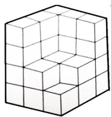

## Question 5

In August 2018, there were 4 Saturdays and 5 Fridays. On what day of the week does August 9, 2018 fall? 

A. Monday 

B. Tuesday 

C. Wednesday 

D. Thursday 

E. Friday 

## Question 6

Study the pattern below: 

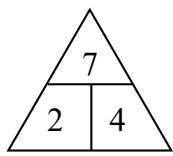

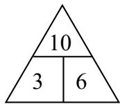

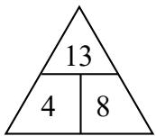

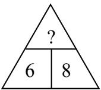

What number does “?” represent? 

A. 12 

B. 14 

C. 15 

D. 16 

E. None of the above 

## Question 7

Jane, Joan, and Jean are all accountants. They are going to marry the three men named below. 

Peter is a lawyer. 

Joan will not marry the engineer. 

The doctor’s wife is not Joan. 

Mike will marry Jane. 

Arthur is the engineer. 

Who is the doctor? 

A. Mike 

B. Arthur 

C. Peter 

D. Cannot be determined 

E. None of the above 

## Question 8

Which of the following solids can be formed by the net below? 

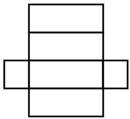

A.

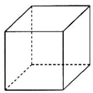

B.

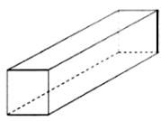

C.

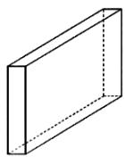

D.

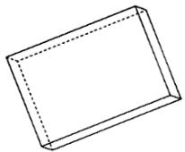

E.

None of them 

## Question 9

Mary is reading a book. On the first day, she read 8 pages. On each succeeding day, she reads 3 more pages than the previous day. She finishes reading the book by reading 32 pages on the last day. How long does it take Mary to finish reading the entire book? 

A. 6 

B. 7 

C. 8 

D. 9 

E. None of the above 

## Question 10

Find the sum of the next 2 numbers in the sequence 2, 5, 10, 13, 26, 29, ( ), ( ). 

A. 119 

B. 129 

C. 139 

D. 149 

E. None of the above 

## Question 11

Study the picture. 

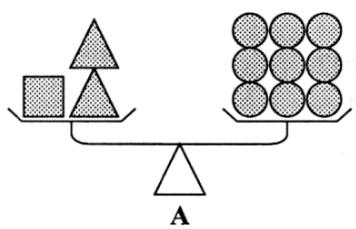

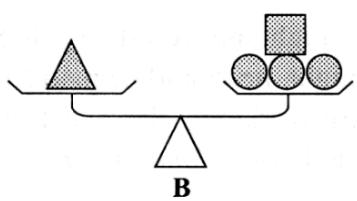

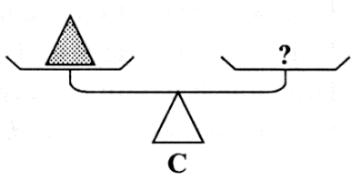

How many squares are needed to balance 1 triangle? 

A. 2 

B. 3 

C. 4 

D. 5 

E. None of the above 

## Question 12

In a game, there were 32 rows of participants. In each row, there were three times as many boys as girls. If there were 24 girls in each row, how many participants took part in the game? 

A. 24 

B. 72 

C. 96 

D. 2304 

E. 3072 

## Question 13

What is “x” in the figure below? 

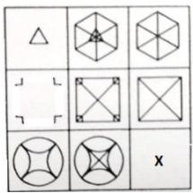

A. 

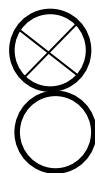

B. 

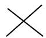

C. 

D. 

None of the above 

## Question 14

A figure made up of unit cubes appears from the different views. What is the minimum number of cubes which could be used to build this figure? 

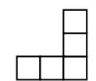

Left side

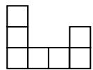

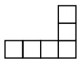

Front

A. 6 

B. 7 

C. 8 

D. 9 

E. 10 

## Question 15

Below are four labeled boxes. Each box is painted a different colour. There is a red box, which is next to a blue box. There is a green box, which is next to the red box and a yellow box. Which box could be painted red? 

<table><tr><td>1</td><td>2</td><td>3</td><td>4</td></tr></table>

A. 1 only 

B. 2 only 

C. 3 only 

D. 2 or 3 

E. 1 or 4 

## Section B (Correct answer – 4 points| Incorrect or No answer – 0 points)

When the answer is a 1-digit number, shade “0” for the tens, hundreds and thousands place. 

Example: if the answer is 7, then shade 0007 

When the answer is a 2-digit number, shade “0” for the hundreds and thousands place. 

Example: if the answer is 23, then shade 0023 

When the answer is a 3-digit number, shade “0” for the thousands place. 

Example: if the answer is 785, then shade 0785 

When the answer is a 4-digit number, shade as it is. 

Example: if the answer is 4196, then shade 4196 

## Question 16

Study the diagram below carefully. What is the missing number? 

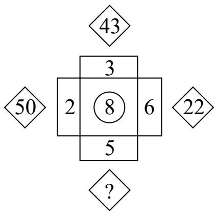

Question {Trick and additions}{Blue Book} 

There are several heroes in 7 Universes: Universe T to Z. Universe T has 51 heroes; Universe U has 1 more hero than Universe T; Universe V has 1 more hero than Universe U; so on and so forth. How many heroes are there in total? 

## Question 17

A father is 27 years older than his son, Moses. A mother is 24 years older than her son, Moses. The sum of the ages of the father and mother is 93. How old is Moses? 

## Question 18

How many whole numbers smaller than 500 that are divisible by 3 can be formed by arranging the following digits 2, 4, 6, and 9? For each number, each digit can only be used once. 

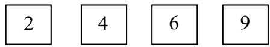

## Question 19

The bird feeder has two sections of the same size. The sections are connected internally so that the seeds from the upper section can move to the lower section. When the bird feeder is full, it can feed 6 birds at a time, 3 in the upper section, and 3 in the lower section. When the feeder is filled to its capacity, it takes the 6 birds 9 hours to empty the feeder. The 6 birds eat at the same rate, and they eat until their respective sections are empty. Also, the birds in the upper sections cannot go down the lower section to eat. How long will the 3 birds in the upper section of the feeder feed themselves? 

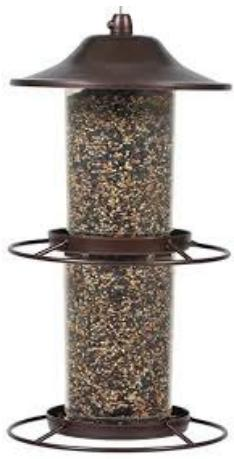

## Question 20

Red had a certain number of bottle caps. He later gave $\frac 1 4$ of them to Blue and $\frac { 5 } { 6 }$ of the remainder to Green. If Blue received 40 bottle caps from Red, how many bottle caps did Red have at first? 

## Question 21

The students from a primary school are going for a camping trip. If each bus takes 46 students, there will be 12 vacant seats. If each bus takes 37 students, 15 students will not get any seat. How many students are going for the camping trip? 

## Question 22

Mr. Lee had some eggs on a tray. If the eggs were divided into groups of 4, 1 egg would be left on the tray. If the eggs were divided into groups of 6, 3 eggs would be left. If the eggs were divided into groups of 7, 5 eggs would be left. What was the least number of eggs Mr. Lee had on the tray? 

## Question 23

The yellow, red, blue and green lights are able to make many types of signals. These signals can be made from one light, two lights, three lights or four lights at the same time. How many different signals can these lights make? 

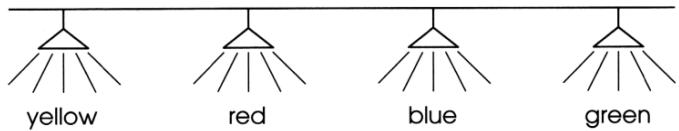

## Question 24

In the following, each letter represents a different digit from 0 to 9. What is the value of the sum A+B+C+D? 

<table><tr><td></td><td>A</td><td>B</td><td>B</td><td>C</td></tr><tr><td>+</td><td>C</td><td>B</td><td>B</td><td>A</td></tr><tr><td></td><td>B</td><td>B</td><td>D</td><td>D</td></tr></table>

## Question 25

Tom made number 869 using 19 matchsticks as shown below. He wants to construct the greatest possible number by moving exactly two matches. Find this greatest possible value. 

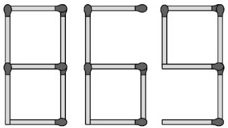

(The figures of all the digits from 0 to 9 are shown below.) 

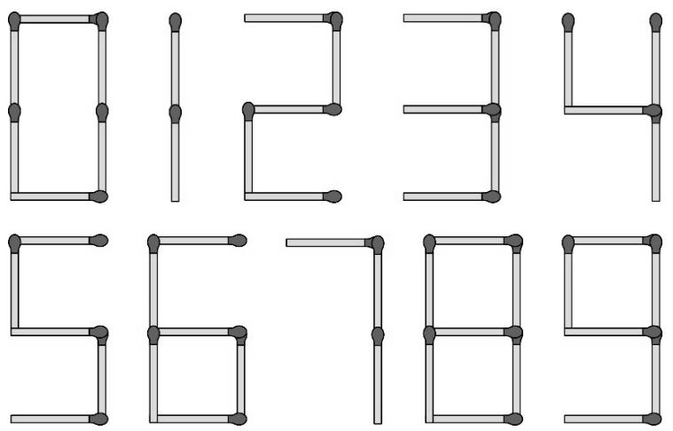

Rough Working 

Rough Working 