# Singapore International Math Olympiad Challenge 2019

# GRADE 3 (PRIMARY 3)

July 7, 2019 

Time: 1 hour 30 minutes 

NAME: 

GRADE: 

COUNTRY: 

## INSTRUCTIONS

1. Please DO NOT OPEN the contest booklet until the Proctor has given permission. 

2. There are 25 questions. 

Section A: Questions 1 to 15 score 2 points each, no points are deducted for unanswered question and 1 point is deducted for wrong answer. 

Section B: Questions 16 to 25 score 4 points each, no points are deducted for unanswered or wrong answer. 

3. Shade your answers neatly using a pencil in the Answer Entry Sheet. 

4. PROCTORING: No one may help any student in any way during the contest. 

5. No electronic devices capable of storing and displaying visual information is allowed during the course of the exam. Strictly No Calculators are allowed into the exam. 

6. Students must show detailed working and transfer answers to the Answer Entry Sheet. 

7. No exam papers and written notes can be taken out by any contestant. 

Rough Working 

## Section A (Correct answer – 2 points| No answer – 0 points| Incorrect answer – minus 1 point)

## Question 1

Calculate $\left( 2 0 + 2 1 + 2 2 + \cdots + 4 9 + 5 0 \right) - \left( 1 0 + 1 1 + 1 2 + \cdots + 3 9 + 4 0 \right) .$ . 

A. 290 

B. 300 

C. 310 

D. 320 

E. None of the Above 

## Question 2

If $\Delta + \Delta + \Delta = 3 6 , \bigsqcup \times \Delta = 1 8 0 , \ \underline { { { \ m } } } \div \bigsqcup = 7 _ { \mathit { i } }$ , what is the value of ∎? 

A. 105 

B. 100 

C. 120 

D. 130 

E. None of the Above 

## Question 3

Study the pattern below. 

<table><tr><td>11</td><td>12</td><td>13</td><td>14</td></tr><tr><td>15</td><td>16</td><td>17</td><td>18</td></tr><tr><td>52</td><td>A</td><td>60</td><td>64</td></tr></table>

What is the value of A? 

A. 53 

B. 54 

C. 55 

D. 56 

E. None of the Above 

## Question 4

Peter decorated his garden by hanging a lantern at each fixed interval of 8 metres, between 2 lampposts. He used 39 lanterns altogether. The distance between the first lamppost and the first lantern is 8 metres, and the distance between the second lamppost and the 39th lantern is also 8 metres. He did not hang any lanterns on the 2 lampposts. What was the distance between the 2 lampposts, in metres? 

A. 312 

B. 320 

C. 328 

D. 336 

E. None of the Above 

## Question 5

Father’s age is 5 times as his son’s age now. If the age of father 16 years ago is equal to the age of his son 12 years from now, how old is father now? 

A. 35 

B. 40 

C. 45 

D. 50 

E. None of the Above 

## Question 6

All of the following figures can be folded to form a cube except for one. Which one is it? 

A.

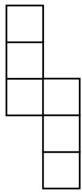

B.

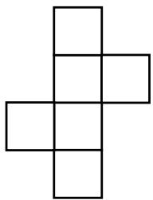

C.

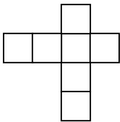

D.

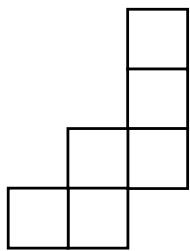

## Question 7

A boy always tells the truth on Mondays and Tuesdays, always tells lies on Saturday, and tells either truth or lies on the rest of the days of the week. For six days in a row, he was asked what his name was and he gave the following answers: Mark, James, Mark, John, James, John. What is the boy’s name? 

A. Mark 

B. James 

C. John 

D. James or John 

E. Impossible to determine 

## Question 8

In the Orchard Garden, there are 500 apple and orange trees. If the number of apple trees is 16 less than twice the number of orange trees, how many apple trees are there? 

A. 170 

B. 172 

C. 328 

D. 330 

E. None of the Above 

## Question 9

Figure 1 is called a “stack map.” The numbers tell how many cubes are stacked in each position. Figure 2 shows these cubes, and Figure 3 shows the view of the stacked cubes as seen from the front. 

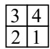

Figure 1

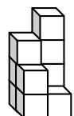

Figure 2

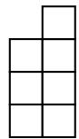

Figure 3

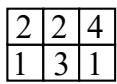

Figure 4

Which of the following is the front view for the stack map in Figure 4? 

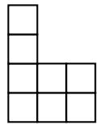

A

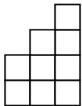

B

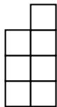

C

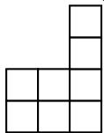

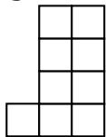

E

## Question 10

Allan, Bob and Charles bought a total of 12 pieces of bread for their breakfast. They agreed to divide the bread equally among the three of them. 

At the cashier, Charles forgot to bring his money. As such, Allan paid for the 7 pieces of bread, while Bob paid for the 5 pieces of bread. 

They all went home and had their breakfast. After eating all the bread, Charles brought out $4 from his drawer and gave some money to Allan and Bob. 

How much money did Allan get from Charles? 

A. $1 

B. $2 

C. $3 

D. $4 

E. None of the Above 

## Question 11

A dictionary uses 1215 digits for its page numbers. How many pages does the dictionary have? 

A. 440 

B. 441 

D. 443 

E. None of the Above 

## Question 12

John, an airline passenger, was bound for London. Upon reaching $\frac 1 3$ of the total distance, he fell asleep. When he finally woke up, the remaining distance to London was $\frac 1 8$ of the distance traveled when he was asleep. What fraction of the entire trip was John asleep? 

A. 7/12 

B. $7 / 2 4$ 

C. 2/27 

D. $1 6 / 2 7$ 

E. None of the Above 

## Question 13

In the following, all the different letters stand for different digits. Find the value of the $A + B$ . 

$$
\begin{array}{c} A B C \\ \underline {{- B C A}} \\ A B \end{array}
$$

A. 6 

B. 7 

C. 8 

D. 9 

E. None of the Above 

## Question 14

How many whole numbers smaller than 500 that are divisible by 3 can be formed by arranging the following digits 2, 4, 6 and 9. For each number, each digit can only be used once. 

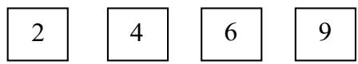

A. 11 

B. 12 

C. 13 

D. 14 

E. None of the Above 

## Question 15

ABCD is a square. It consists of 2 rectangles, with areas 44 ????????2 and 28????????2, respectively and a smaller square. Find the sum of the areas of the two squares. 

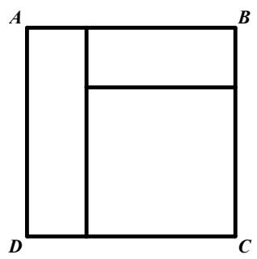

A. 65 

B. 157 

C. 170 

D. 185 

E. None of the Above 

## Section B (Correct answer – 4 points| Incorrect or No answer – 0 points)

When the answer is a 1-digit number, shade “0” for the tens, hundreds and thousands place. 

Example: if the answer is 7, then shade 0007 

When the answer is a 2-digit number, shade “0” for the hundreds and thousands place. 

Example: if the answer is 23, then shade 0023 

When the answer is a 3-digit number, shade “0” for the thousands place. 

Example: if the answer is 785, then shade 0785 

When the answer is a 4-digit number, shade as it is. 

Example: if the answer is 4196, then shade 4196 

## Question 16

Observe the pattern: 

$$
(2 \times 2) - (1 \times 1) = 3
$$

$$
(3 \times 3) - (2 \times 2) = 5
$$

$$
(4 \times 4) - (3 \times 3) = 7
$$

$$
(1 9 \times 1 9) - (1 8 \times 1 8) = A
$$

What is the value of ????? 

## Question 17

Lisa has 415 cards more than Vincent. John has 926 cards fewer than what Lisa and Vincent have in total. If three of them have 4520 cards altogether, how many cards does Lisa have? 

## Question 18

Kendra has a collection of math books, but she can’t remember the exact the number in her collection. 

She knew that 3 of her friends Nicole, Mary and Paris borrowed some of the books. 

First, Nicole borrowed half of the books plus 1 book. Then Mary borrowed half of the remaining books plus 2 books. Lastly, Paris then borrowed half of the remaining books plus 3 books. Afterwards, there are 2 books left in Kendra’s collection. 

How many books are there in Kendra’s collection? 

## Question 19

30 students numbered from 1 to 30 were asked to line up in a straight line. The first student in the line was asked to leave, the second student remained. The third student was asked to leave the line, the fourth student remained and so forth. This process was then repeated until there was only one student left in the line. What was the number of the only student left in the line? 

## Question 20

5 cows and 6 horses can consume 139 kg of grass each day, while 6 cows and 5 horses can consume 125 kg of grass each day. How much in kilograms, can 1 horse and 1 cow consume each day? 

## Question 21

Andrew and Barbara went to the bookstore to buy the same comic book. 

Andrew did not bring enough money; in fact, to be able to buy that 1 comic book, he needs an additional $28. 

Meanwhile, Barbara, did not bring enough money either; in fact, to be able to buy that 1 comic book, she needs an additional $26. 

If Andrew and Barbara combine their money; they will have enough to buy that comic book, and will still have $26 left. 

How much does the comic book cost? 

## Question 22

How many squares are there in the figure below? 

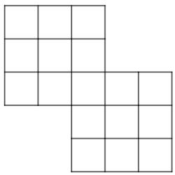

## Question 23

A group of 99 people rented 27 boats, which are of two types. The first type has a capacity of 5 people and costs $40 per boat. The second has a capacity of 3 people and costs $30 per boat. The 99 people perfectly filled all 27 boats. What is the total cost of renting the 27 boats? 

## Question 24

In the following, each box represents a single digit. What is the value of $\mathsf { A } + \mathsf { B } + \mathsf { C } ?$ 

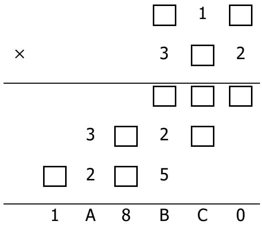

## Question 25

Tom made number 869 using 19 matchsticks as shown below. He wants to construct the greatest possible four-digit number by moving exactly three matches. Find this greatest possible value. 

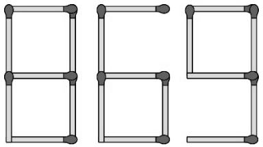

(The figures of all the digits from 0 to 9 are shown below.) 

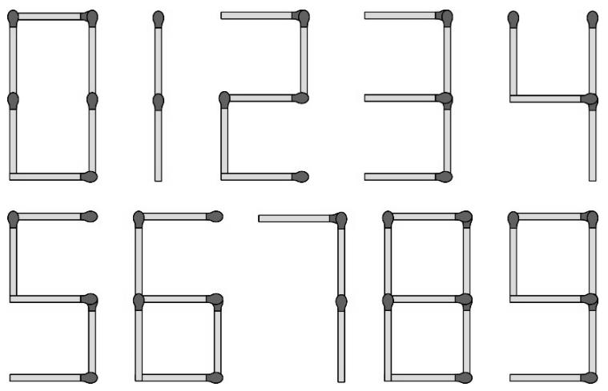

Rough Working 

Rough Working 