# Singapore International Math Olympiad Challenge 2019

# GRADE 4 (PRIMARY 4)

July 7, 2019 

Time: 1 hour 30 minutes 

NAME: 

GRADE: 

COUNTRY: 

## INSTRUCTIONS

1. Please DO NOT OPEN the contest booklet until the Proctor has given permission. 

2. There are 25 questions. 

Section A: Questions 1 to 15 score 2 points each, no points are deducted for unanswered question and 1 point is deducted for wrong answer. 

Section B: Questions 16 to 25 score 4 points each, no points are deducted for unanswered or wrong answer. 

3. Shade your answers neatly using a pencil in the Answer Entry Sheet. 

4. PROCTORING: No one may help any student in any way during the contest. 

5. No electronic devices capable of storing and displaying visual information is allowed during the course of the exam. Strictly No Calculators are allowed into the exam. 

6. Students must show detailed working and transfer answers to the Answer Entry Sheet. 

7. No exam papers and written notes can be taken out by any contestant. 

Rough Working 

## Section A (Correct answer – 2 points| No answer – 0 points| Incorrect answer – minus 1 point)

## Question 1

Find the value of 87 × 27 + 72 × 87 + 87. 

A. 2700 

B. 7200 

C. 8700 

D. 9700 

E. None of the Above 

## Question 2

I am thinking of a number. First, I multiply it by 2, then add 14 to the result. Then divide the sum by 7 and subtract 3 from the result. I will get 9 as my final answer. What number am I thinking of? 

A. 35 

B. 14 

C. 21 

D. 42 

E. None of the Above 

## Question 3

Study the pattern below. 

<table><tr><td>11</td><td>12</td><td>13</td><td>14</td></tr><tr><td>15</td><td>16</td><td>17</td><td>18</td></tr><tr><td>52</td><td>56</td><td>60</td><td>A</td></tr></table>

What is the value of A? 

A. 28 

B. 82 

D. 64 

E. None of the above 

## Question 4

Figure 1 is called a “stack map.” The numbers tell how many cubes are stacked in each position. Figure 2 shows these cubes, and Figure 3 shows the view of the stacked cubes as seen from the front. 

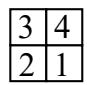

Figure 1

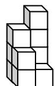

Figure 2

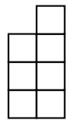

Figure 3

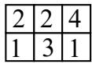

Figure 4

Which of the following is the front view for the stack map in Figure 4? 

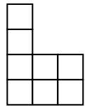

A

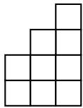

B

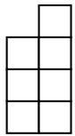

C

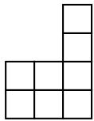

D

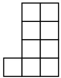

E

## Question 5

A “funny number” is a number formed by writing two digits followed by their product. For example, 6 7 42 × = , so 6742 and 7642 are “funny numbers”. The first digit of a “funny number” cannot be a 0. 

What is the difference between the largest and smallest “funny number?” 

A. 9837 

B. 9541 

C. 9581 

D. 9081 

E. 9881 

## Question 6

In a certain month, the number of Thursdays is more than the number of Wednesdays. Also, the number of Sundays is less than the number of Saturdays. On what day of the week will the 27th of that month fall? 

A. Monday 

B. Tuesday 

C. Wednesday 

D. Friday 

E. Sunday 

## Question 7

What is the remainder when the number 1111111111 ��������� is divided by 7? 10 1???? 

A. 3 

B. 4 

C. 5 

D. 6 

E. None of the Above 

## Question 8

A boy always tells the truth on Mondays and Tuesdays, always tells lies on Saturday, and tells either truth or lies on the rest of the days of the week. For six days in a row, he was asked what his name was and he gave the following answers: Tom, Brad, Tom, John, Brad, John. What is the boy’s name? 

A. Tom 

B. Brad 

C. John 

D. Brad or John 

E. Impossible to determine 

## Question 9

Study the pattern below. 

$$
\begin{array}{l} 3 \bigotimes 5 = 3 + 4 + 5 + 6 + 7 \\ 8 \bigotimes 3 = 8 + 9 + 1 0 \\ 1 1 \bigotimes 7 = 1 1 + 1 2 + 1 3 + 1 4 + 1 5 + 1 6 + 1 7 \\ 1 0 0 \bigotimes 2 = 1 0 0 + 1 0 1 \\ \end{array}
$$

What is the value of 10 ⨂ 4 ? 

A. 10 

B. 14 

C. 40 

D. 50 

E. None of the above 

## Question 10

If a digit ???? is added to the left of the one-digit number 8 and a digit ???? is added to the right of it, a 3-digit number ????8???? is formed. If this number ????8???? is a multiple of 3, what is the largest possible product ???? × ????? 

A. 8 

B. 56 

C. 84 

D. 96 

E. None of the Above 

## Question 11

Ann, Betty and Clare, each bought beads from a market. Ann bought 400 beads more than Betty. The total number of beads of Ann and Betty bought were 900 more than Clare’s. If the three of them bought 4500 beads in total, how many beads did Clare buy? 

A. 1150 

B. 1550 

C. 1800 

D. 2700 

E. None of the Above 

## Question 12

The temperature relationship between degrees Celsius (C) and degrees Fahrenheit (F) is given by ${ \frac { 9 } { 5 } } \times C + 3 2 = F$ . For example, $2 0 ^ { \circ }$ Celsius is equal ${ \frac { 9 } { 5 } } \times 2 0 + 3 2 = 6 8 ^ { \circ }$ Fahrenheit. At what degree Celsius will the value of the temperature in degrees Fahrenheit be exactly 5 times the value of the temperature in degrees Celsius? 

A. 10 

B. 20 

C. 30 

D. 40 

E. 50 

## Question 13

$\frac { 3 } { 5 }$ of the marbles in Box B are equal in number to $\frac { 6 } { 7 }$ of the marbles in Box U. There is a total of 85 marbles in the 2 boxes. How many marbles are there in Box U? 

A. 35 

B. 50 

C. 60 

D. 70 

E. None of the Above 

## Question 14

It takes 2 goats and 3 cows 6 days to eat 2 acres of grass. It takes 6 goats and 5 cows 10 days to eat 8 acres of grass. How many days will it take 8 goats and 8 cows to eat 17 acres of grass? 

A. 5 

B. 12 

C. 15 

D. 17 

E. None of the Above 

## Question 15

At a snack bar, the cost of 7 sandwiches, 5 drinks and 1 dessert is $32, while the cost of 10 sandwiches, 7 drinks, and 1 dessert is $45. Find the cost of 1 sandwich, 1 drink, and 1 dessert. 

A. $6 

B. $7 

C. $7.50 

D. $19 

E. None of the Above 

## Section B (Correct answer – 4 points| Incorrect or No answer – 0 points)

When the answer is a 1-digit number, shade “0” for the tens, hundreds and thousands place. 

Example: if the answer is 7, then shade 0007 

When the answer is a 2-digit number, shade “0” for the hundreds and thousands place. 

Example: if the answer is 23, then shade 0023 

When the answer is a 3-digit number, shade “0” for the thousands place. 

Example: if the answer is 785, then shade 0785 

When the answer is a 4-digit number, shade as it is. 

Example: if the answer is 4196, then shade 4196 

## Question 16

Study the pattern. 

<table><tr><td>1</td><td>2</td></tr><tr><td>4</td><td>3</td></tr></table>

<table><tr><td>1</td><td>3</td></tr><tr><td>15</td><td>7</td></tr></table>

<table><tr><td>1</td><td>4</td></tr><tr><td>x</td><td>13</td></tr></table>

What is the value of x ? 

## Question 17

ABCD is a square of side length 12 cm. Point L is any point on side AB. Points H and I divide side AD into three equal parts. Points J and K also divide side BC into three equal parts. Finally, points G, F and E divide side DC into four equal parts. Find the total area (in cm2) of the shaded region. 

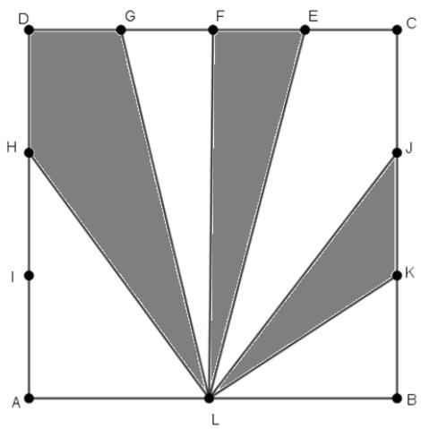

## Question 18

The numbers 11, 12, 13, 14, 15, 16, 17, 18 and 19 are placed in the 9 boxes shown below. The numbers 15, 16, and 19 have been placed accordingly. If the sum of the numbers placed horizontally is equal to the sum of the numbers placed vertically, what is the sum of all possible values of ????? 

<table><tr><td>16</td><td></td><td>19</td><td>15</td><td>a</td></tr><tr><td rowspan="4"></td><td rowspan="4"></td><td rowspan="4"></td><td rowspan="4"></td><td></td></tr><tr><td></td></tr><tr><td></td></tr><tr><td></td></tr></table>

## Question 19

Calculate the following 

$$
1 9 2 \times \left(\frac {1}{4 \times 7} + \frac {1}{7 \times 1 0} + \frac {1}{1 0 \times 1 3} + \frac {1}{1 3 \times 1 6}\right)
$$

## Question 20

Tom made number 869 using 19 matchsticks as shown below. He wants to construct the greatest possible four-digit number by moving exactly three matches. Find this greatest possible value. 

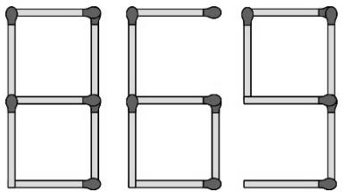

(The figures of all the digits from 0 to 9 are shown below.) 

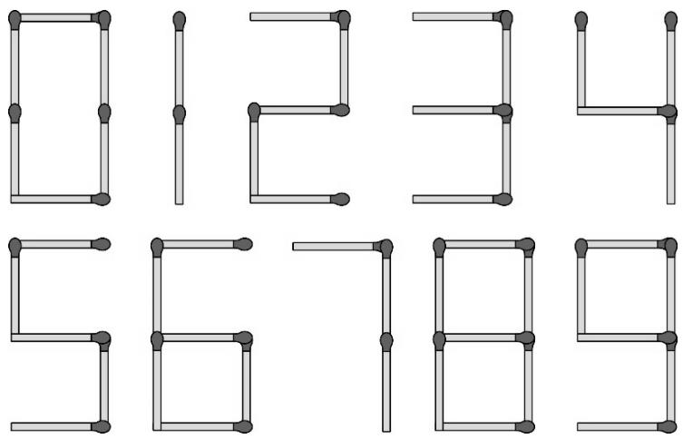

## Question 21

Several commuters were on a bus when it started its journey from a bus interchange. At the first bus stop, 2 more than $\frac 1 3$ of the commuters alighted. At the second bus stop, 4 more than $\frac 1 3$ of the remaining commuters alighted. At the third bus stop, 8 more than $\frac 1 3$ of the remaining commuters alighted. Then the bus was left with 16 commuters. How many commuters boarded the bus at the bus interchange? 

## Question 22

If a three-digit number $\overline { { a 1 b } }$ is 9 times the 2-digit number $\overline { { a b } } ,$ , find the number $\overline { { a b } }$ . 

## Question 23

The number of my house is a 4-digit number. One day, on my way home, I accidentally turned the number of my house upside down. I noticed that the new number formed by turning it upside down is bigger than the original number by 4872. What is the number of my house? 

## Question 24

Find the value of 

$$
2 + 4 + 8 + \dots + 5 1 2 + 1 0 2 4
$$

## Question 25

All the sides of the figure below meet at right angles. Use the numbers 1, 2, 3, 4, 5, 6, 7 and 8 to represent the sides  and  in some order. Find the largest possible area of the figure. 

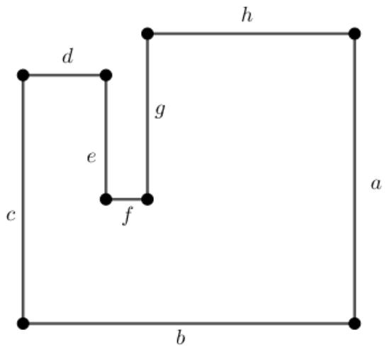

Rough Working 